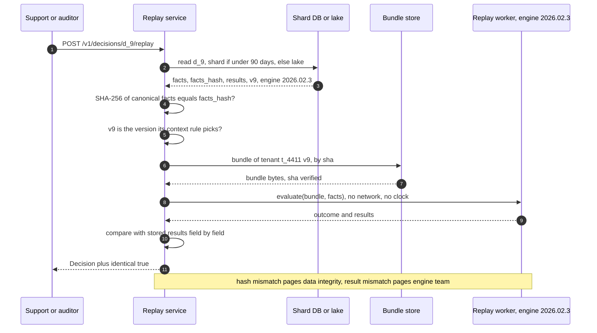

# Deep dive: audit, replay and determinism

> One-line answer: a decision is a pure function of **(policy version, engine version, facts)**, and all three are kept for 7 years: bundles are immutable and content-addressed, every engine release is a retained hermetic artifact, and the ~1 KB of facts the rules read (amounts in minor units, the FX (foreign exchange) rate, the network time that picked the version, attributes with their version, counter values read under the lock) is snapshotted on the decision with its hash. `replay(decision_id)` re-runs it and must be identical, every source of non-determinism is banned by construction, and the decision stream flows by CDC (change data capture) from the shard (hot 90 days) into a Parquet lake (7 years) that is also the simulator's input.

Zoom-in on [`../solution.md`](../solution.md) §5.5 and §10.6. Reusable blocks: [`../../../concepts/columnar-db.md`](../../../concepts/columnar-db.md) (Parquet layout), [`../../../concepts/merkle-tree.md`](../../../concepts/merkle-tree.md) (tamper evidence), [`../../../concepts/exactly-once.md`](../../../concepts/exactly-once.md) (CDC dedup), [`../../../concepts/temporal-durable-execution.md`](../../../concepts/temporal-durable-execution.md) (the same determinism rules, for workflows). Siblings: [`safe-rule-changes.md`](safe-rule-changes.md), [`rule-model-and-evaluation.md`](rule-model-and-evaluation.md), [`degraded-modes-and-region-loss.md`](degraded-modes-and-region-loss.md).

---

## 1. The decision is a pure function of three recorded inputs

`decision = engine[engine_version](bundle[policy_version], facts)`. The stored `results` are the expected output, kept to compare against.

- **Policy version** resolves to one bundle by SHA-256, and is chosen by **spend time**. Card `AUTH`: the version active at the network time. Card `CAPTURE` and `SUBMIT`: the `policy_version` recorded on the `AUTHORIZATION`, reused, never re-derived, so the ~5 s activation lag cannot put two versions on one card expense. Out-of-pocket: the version in force at the start of the expense date (the tenant's local midnight). The facts carry the time and the rule that picked the version, so replay checks it too.
- **Engine version** resolves to one artifact: CEL (Common Expression Language) runtime, custom functions, pinned libraries.
- **Facts** are everything the rules read, assembled before evaluation.

Anything else that changes an outcome lives inside one of the three. Tenant settings (degraded cap, tip buffer, auto-approve limit) and reference tables (MCC groups) are compiled into the bundle, so changing one is a new version and old decisions still replay.

---

## 2. What goes in the facts

One authorization: swipe B of solution Flow 2, dated March 3 (1,068 bytes in canonical form):

```json
{
  "facts_schema": 3, "context": "AUTH", "tenant_id": "t_4411",
  "subject": {"kind": "AUTH", "id": "a_2", "processor_auth_id": "iauth_1Qx9"},
  "spend_time": "2026-03-03T17:41:07Z", "version_selected_by": "network_time",
  "expense": {
    "amount_minor": 1500, "currency": "USD", "amount_usd_minor": 1500,
    "fx_rate_id": "fx_2026-03-03", "fx_rate_e9": 1000000000,
    "mcc": "5814", "mcc_group": "fast_food", "category": "meals",
    "merchant_id": "m_5521", "merchant_country": "US",
    "card_id": "c_91", "card_program": "standard", "incremental": false,
    "network_time": "2026-03-03T17:41:07Z", "local_time": "2026-03-03T12:41:07-05:00"
  },
  "employee": {
    "id": "e_17", "attribute_version": 4412, "status": "ACTIVE",
    "department": "d_4", "level": "L5", "country": "US",
    "employment_type": "FULL_TIME", "manager_id": "e_3", "cost_center": "cc_12"
  },
  "trip": null,
  "counters": [
    {"key": "card:c_91:month", "window_start": "2026-03-01", "spent_minor": 41200, "held_minor": 3500},
    {"key": "emp:e_17:cat:meals:month", "window_start": "2026-03-01", "spent_minor": 16000, "held_minor": 3500},
    {"key": "dept:d_4:month", "window_start": "2026-03-01", "spent_minor": 2210000, "held_minor": 98000}
  ]
}
```

- **Money** is integers only. The FX rate is stored twice: the id for provenance, the value as an integer scaled by 1e9, so replay needs no rate table.
- **Raw and derived both.** `mcc` (merchant category code) and the `mcc_group` enrichment gave it. Replay uses the derived value; the simulator can re-derive with a draft's table.
- **Time is computed once.** `local_time` and every `window_start` are resolved at assembly with the tenant's timezone, so replay never needs the tz database of that day.
- **Every rule-visible attribute**, not just those the March policy read, plus `attribute_version`. A draft scoped on `cost_center` can then be simulated on history. HRIS (human resources information system) values are copied as the projection held them, stale or not.
- **Counters as read under the lock**, with key and window. This is the only record of which of two racing swipes locked first. Absent when a point rule declined first: aggregates are then `NOT_EVALUABLE`, reason `short_circuit`.
- **`CAPTURE`** adds the captured amount, the processor transaction id and the authorization's `policy_version` it reuses. **`SUBMIT`** adds the trip id and the trip total the expense service read under the `TRIP` lock; the decision service never queries the expense DB.
- **No names, emails or receipt text.** Ids only (§9).

---

## 3. facts_hash, immutable bundles and engine artifacts

- **`facts_hash`** = SHA-256 of canonical JSON: sorted keys, no whitespace, integers only, UTF-8 strings in Unicode normalization form C. The sample hashes to `e45cb0e2...`. It proves the stored facts are the ones evaluated.
- **Tamper evidence.** A hash in the same row can be rewritten with the row. Each night, each shard's decision hashes for the day go into a Merkle tree whose root is written to a write-once bucket [design choice]. An auditor can check any decision against that day's root.
- **Bundles** are addressed by SHA-256, never overwritten, kept 7 years. They hold checked ASTs (abstract syntax trees) that both the current and the previous engine can load. Today ~2 GB for all tenants; every version for 7 years ~730 GB (50k tenants, one publish a week, ~40 KB median) [estimate].
- **Engine artifacts** are hermetic images: CEL runtime, custom functions, RE2 regex library, Unicode tables, tz database. Reference tables are not here; they are in the bundle. ~60 releases a year (solution counts 30 between March and September), ~420 kept for 7 years, tens of GB [estimate]. Old images run in a sandbox with no network. A monthly job replays 100 decisions per retained version, so artifact rot is found before an auditor finds it.

---

## 4. The replay API



- **`identical: false` under the original versions** means a non-determinism bug (or an engine artifact that no longer behaves) and pages the engine team; the SLO (service level objective) is 100%. A facts_hash mismatch is checked first and is a different incident: storage or tampering.
- **Adopted and superseded decisions.** A degraded approval replays through the fallback function (point rules plus the cap, both in the bundle) on the journal's facts. An authorization the processor or network approved without us (Stripe `webhook_timeout`, Marqeta Commando Mode, network STIP, stand-in processing by the card network) has no evaluation of ours: replay returns `replayable: false` with the processor record, and replays the after-the-fact aggregate check instead. A `superseded` decision (we computed it, but a degraded answer was sent, or the processor's recorded outcome differs and adopt applied that instead) still replays identical; explain shows the outcome the processor applied.
- **`policy_version` override** ("what would today's policy say") returns a diff. `identical: false` is expected there and never pages. Facts missing a field the new version reads come back `NOT_EVALUABLE`.
- **Continuous check.** Nightly, replay a 0.1% sample of yesterday's ~31 M decisions (~31k, about a core-second) across every engine version that was live [estimate]. A hot replay takes tens of ms; a lake one a few seconds [estimate].

---

## 5. Every source of non-determinism, and how it is banned

| Source | How it would leak | Ban |
|---|---|---|
| Wall clock | "After 6 pm" computed from `now()` | No `now()`. Rules read `network_time` and `local_time` from facts |
| Wall-clock timeouts | A slow host returns `ERROR` where a fast one passed | Only CEL's cost budget, which is counted, not timed |
| Floating-point money | Rounding differs by path | Integer minor units, integer FX rate, half-even rounding |
| Iteration order | Go maps iterate randomly; "first violation" changes | Outcome is a max. Results sorted by `rule_id`. Every candidate rule evaluated, no early exit |
| I/O from a rule | A live lookup returns something new | CEL has no I/O. Enrichment happens first and lands in facts |
| Calendar and tz data | A daylight-saving rule update moves `window_start` | Windows and local time resolved once, stored in facts |
| Reference data | MCC 5814 moves group | `mcc_group` in facts; the table snapshot is compiled into the bundle |
| Libraries and locale | RE2 or Unicode tables change a match; case folding in a custom function | Pinned inside the engine artifact. Built-ins only, locale-free |
| Tenant settings | Degraded cap, tip buffer or auto-approve limit edited mid-month | Compiled into the bundle, so a change is a new version |
| Host faults | Out of memory mid-evaluation | Never recorded as `ERROR`. The call fails whole and is retried |

This is the list Temporal enforces on workflow code, for the same reason: replay from recorded inputs only works when the code reads nothing else.

---

## 6. "Why was my card declined on March 3?"

1. **Resolve the day.** March 3 in the tenant's timezone spans two UTC dates in the lake. Read both partitions, pruned to the tenant's row groups: seconds.
2. **Find the authorization** by `(tenant, card_id, local date)`, skipping `superseded` decisions: `a_2`, decision `d_9`, `DECLINE`, policy v9, engine 2026.02.3, `degraded: false`. Had it been degraded, the answer is the fallback: amount over the degraded cap during an outage.
3. **Read the results.** `meals-month` `VIOLATED`, observed 21000 against 20000, action `DECLINE`; four other rules `PASS`. The rule text is `RULE meals-month` as of v9, kept in the policy DB.
4. **Explain the observed.** From the facts: 16000 captured plus 3500 held plus this 1500. The lake lists the captures and open holds on `emp:e_17:cat:meals:month` for March.
5. **Prove it, then what-if.** `replay(d_9)` returns `identical: true`. `replay(d_9, policy_version = 15)` answers "under today's policy this is allowed", with no pretence that it applied then.
6. **Not ours?** Stripe records the reason in `request_history.reason` (`spending_controls`, `card_inactive`, `webhook_timeout`, `suspected_fraud` and others). A processor-side decline gets a `DECISION` row from the webhook receiver citing the static control, the versioned controls sync that put it on the card, and the policy version it was compiled from, so step 2 finds it too. No row at all means the swipe died earlier: Stripe warns it can be declined "before any related information is transmitted to Stripe", when "the cardholder involved must directly contact the business" ([docs.stripe.com/issuing/purchases/authorizations](https://docs.stripe.com/issuing/purchases/authorizations)).

---

## 7. Retention tiers and the lake

```mermaid
%% Where a decision lives for 7 years. The spend-control DB is red: CDC reads its WAL, and a stalled consumer retains WAL on the store the auth path cannot lose.
flowchart LR
    DS[Decision service] -->|"AUTH and CAPTURE decisions,<br/>in the counter txn"| SDB[(Spend-control DB<br/>hot 90 days,<br/>daily partitions)]
    ES[Expense service] -->|"SUBMIT decisions"| EDB[(Expense DB)]
    SDB -->|"logical decoding,<br/>WAL keep capped"| CDC[CDC connector]
    EDB -->|"second CDC stream,<br/>same schema"| CDC
    PROC[Issuer processor] -->|"authorization.created,<br/>upstream declines too"| RCV[Webhook receiver]
    CDC -->|"row changes, key decision_id"| K[[Kafka CDC topics]]
    RCV -->|"via adopt: processor outcomes,<br/>declines as DECISION rows"| SDB
    K -->|"dedup by id, hourly files"| PW[Parquet writer]
    PW -->|"daily compaction,<br/>sorted by tenant"| LAKE[(Decision lake<br/>Parquet, 7 years,<br/>then lifecycle delete)]
    LAKE -->|"count per shard and day"| REC{Lake count equals<br/>shard count?}
    REC -->|"yes, drop day 91 partition"| SDB
    LAKE -->|"one tenant, 90 days"| SIM[Simulator]
    LAKE -->|"one decision by id"| RP[Replay service]

    class DS,ES,CDC,RCV,PW,SIM,RP service
    class SDB critical
    class EDB,LAKE store
    class K queue
    class PROC external
    class REC decision

    classDef service  fill:#dcfce7,stroke:#16a34a,stroke-width:2px,color:#111
    classDef store    fill:#ede9fe,stroke:#7c3aed,stroke-width:2px,color:#111
    classDef queue    fill:#cffafe,stroke:#0891b2,stroke-width:2px,color:#111
    classDef critical fill:#fee2e2,stroke:#dc2626,stroke-width:4px,color:#111
    classDef external fill:#e5e7eb,stroke:#6b7280,stroke-width:2px,color:#111,stroke-dasharray:4 3
    classDef decision fill:#fce7f3,stroke:#db2777,stroke-width:2px,color:#111
```



| Tier | What | Size | Serves |
|---|---|---|---|
| Hot, shard DB | Decisions 90 days, daily partitions | `AUTH` and `CAPTURE`: 20 M/day x 1.5 KB x 90 = ~2.7 TB, ~170 GB per logical shard | Explain, disputes, support, in ms |
| Kafka CDC topics | Row changes, 7 days [estimate] | ~325 GB at 46.5 GB/day [estimate] | Re-feeding the lake after a writer outage |
| Lake, object storage | Decisions, lifecycle events, processor records | ~9 GB/day Parquet, ~3.4 TB/yr, ~24 TB at 7 years | Audit queries, replay, simulator |
| Bundles and engines | Every version and release | ~730 GB and tens of GB over 7 years [estimate] | Replay, rollback |

- **Layout.** Partitioned by UTC date, rows sorted by `(tenant_id, spend_time)`, ~128 MB row groups [estimate]. One tenant's day touches a few row groups.
- **The lake is the simulator's input.** The largest tenant's 90 days are ~27 M expenses, ~4 GB of projected columns. The audit log and the safety net are the same bytes, so a gap in one is a gap in both.

---

## 8. CDC from the spend-control DB to the lake

- **Logical decoding** of `DECISION`, `AUTHORIZATION` and `HOLD` changes. The last two give the simulator every capture, reversal and expiry. `SUBMIT` decisions live in the expense DB with the same schema and arrive by a second CDC stream. Postgres 16 and later can decode on a standby, which keeps it off the primary.
- **The WAL (write-ahead log) trap.** A replication slot keeps WAL until the consumer confirms it. At ~500 txn/s and ~5 KB of WAL each, a cluster writes ~9 GB an hour [estimate]; a stalled connector over a weekend fills the disk of the one store the auth path cannot lose. Cap it with `max_slot_wal_keep_size` (~200 GB, about a day [estimate]) and alert on slot lag over 15 minutes. If the cap is hit the slot is invalidated, the database lives, and the gap is re-exported from the shard's 90 days.
- **At-least-once in, exactly-once effect.** Duplicates are removed by `decision_id` in the daily compaction.
- **Never drop a hot partition blind.** Day 91 is dropped only when the lake's distinct count for that shard and day matches.
- **Adopted authorizations** (degraded journal, processor timeout, Commando Mode, STIP) reach the shard through one idempotent `adopt()` that writes `AUTHORIZATION` and a `DECISION` marked degraded or adopted, never re-decided, then flow through the same CDC. The processor's recorded outcome is final: any `authorization.created` or `authorization.updated` that disagrees with our row goes through adopt too, and processor-side declines land the same way.
- **The honest hole.** On region loss, ~1 s of committed decisions never reached the other region. Holds re-sync from the processor; the facts do not. Those decisions are rebuilt from the processor's record and marked `facts_lost`.

---

## 9. Erasure requests vs financial retention

- **The tenant is the controller.** Erasure requests reach us through the employer, not directly.
- **Facts carry ids, not people.** `e_17` and `m_5521`, never a name, email or receipt text. The id-to-person map lives in the HRIS and expense DB, so pseudonymizing a person there never touches facts: `facts_hash` and replay still hold.
- **Retention wins for financial records.** GDPR (General Data Protection Regulation) Art. 17(3)(b) exempts data kept to meet a legal obligation such as bookkeeping law, and CCPA (California Consumer Privacy Act) has a similar exception. The decision stays, pseudonymous, until 7 years, then the lake lifecycle rule deletes it.
- **Tenant offboarding.** Per-tenant encryption keys on lake files [design choice]: after the retention period, deleting the key makes every file of that tenant unreadable without rewriting 7 years of shared daily files.

---

## 10. Why snapshot facts beats event-sourcing recompute

| | Snapshot facts (chosen) | Event-source and recompute |
|---|---|---|
| Answers | What the engine **saw** | What it **should** have seen |
| Attributes 40 s stale | Shows the stale value, the truth of that decision | Rebuilds the fresh value and explains a decision that never happened |
| Two racing swipes | Lock order is in the counter values | Only in Postgres commit order, in no event log |
| Cost | ~1 KB x 31 M/day, ~31 GB/day of facts | Policy, HRIS, counter and FX logs complete for 7 years, plus a fold per question |
| Weakness | A fact-assembly bug is recorded faithfully, not caught | A gap in any of four logs silently changes the answer |

Trade-offs we accept: ~31 GB a day of mostly redundant facts, a 90-day hot copy (~170 GB per logical shard) so support stays fast, and an explicit 1 s audit hole on region loss rather than synchronous cross-region writes on the auth path.

---

## 11. How an interviewer attacks this

1. **"Replay says identical, but the decision was wrong."** Replay proves determinism, not correctness. If the attribute was stale, the facts show it; the fix is the projection, and the audit answer is honest.
2. **"Your 2026 engine will not run in 2033."** Hermetic image, no-network sandbox, a monthly replay of 100 decisions per retained version.
3. **"Someone edited a decision row."** The recomputed hash will not match, and the day's Merkle root in a write-once bucket catches a rewritten hash too.
4. **"A region is gone. Did you lose decisions?"** About 1 s of them. The processor's record fills the gap and the rows are marked `facts_lost`.
5. **"An ex-employee asks you to delete everything."** Via the tenant. Pseudonymize the HRIS side; the financial record stays 7 years under the legal-obligation exception.
6. **"Why not just log outcome and rule id?"** No observed value, no replay, and no history for the simulator.

---

## 12. Numbers to say out loud

- Facts ~1 KB (sample 1,068 bytes), decision ~1.5 KB, ~31 M decisions a day. Bundles ~730 GB over 7 years [estimate].
- 46.5 GB/day raw, ~9 GB/day Parquet, ~3.4 TB/yr, ~24 TB for 7 years.
- Hot: 90 days of `AUTH` and `CAPTURE` decisions, ~2.7 TB, ~170 GB per logical shard. CDC lag minutes; a partition drops only after counts match.
- Replay SLO 100% identical; any mismatch pages. Hot replay tens of ms.
- Region loss: ~1 s of decisions rebuilt from processor records.
