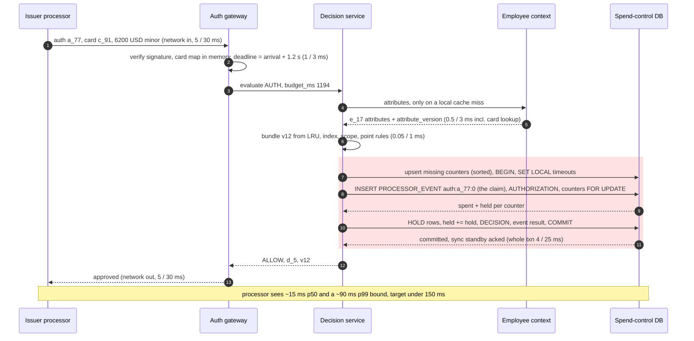
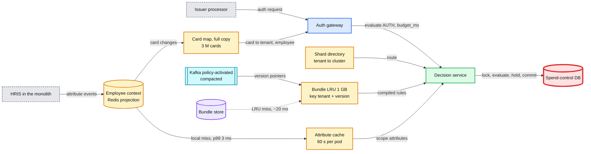
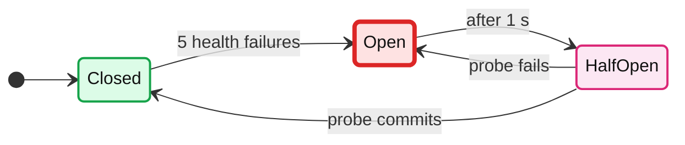

# Deep dive: the authorization hot path

> One-line answer: the processor gives us 2 s (Stripe) and then decides without us, so the gateway sets its own 1.2 s deadline and passes the remaining budget down every hop; everything except the counter transaction is in process (an LRU, least recently used, cache of immutable bundle versions pushed by `policy-activated`, a 60 s employee-context cache over a Redis projection, the card map), nothing calls the monolith, and the one remote call that must succeed (lock, evaluate, hold, commit on one spend-control shard, ~4 ms p50, ~25 ms p99) is idempotent per request and bounded by client-side and server-side timeouts plus a breaker, so a sick shard becomes our fallback answer in ~350 ms instead of the processor's default.

Zoom-in on [`../solution.md`](../solution.md) §2 (latency budget), §5.1 and §10.1 (the processor's synchronous webhook). Reusable blocks: [`../../../concepts/caching-patterns.md`](../../../concepts/caching-patterns.md), [`../../../concepts/rate-limiting-and-load-shedding.md`](../../../concepts/rate-limiting-and-load-shedding.md) (breakers, shedding), [`../../../concepts/exactly-once.md`](../../../concepts/exactly-once.md) (idempotency keys), [`../../../concepts/mvcc-and-isolation.md`](../../../concepts/mvcc-and-isolation.md) (`FOR UPDATE`). Siblings: [`rule-model-and-evaluation.md`](rule-model-and-evaluation.md), [`aggregates-holds-and-concurrency.md`](aggregates-holds-and-concurrency.md), [`degraded-modes-and-region-loss.md`](degraded-modes-and-region-loss.md).

---

## 1. The deadline is the processor's, and so is the default

| Processor | Deadline | If we miss it | Source |
|---|---|---|---|
| Stripe Issuing | 2 s | "automatically approved or declined based on your timeout settings, or Autopilot settings, if configured"; the authorization records `request_history.reason: webhook_timeout` | [real-time authorizations](https://docs.stripe.com/issuing/controls/real-time-authorizations) |
| Lithic ASA (Auth Stream Access) | Declined at 6 s; under 3 s recommended | Slower answers see "a higher percentage of transactions being voided shortly after you have approved them" | [ASA](https://docs.lithic.com/docs/auth-stream-access-asa) |
| Marqeta Gateway JIT (just-in-time) funding | Not on the page we read [unverified] | "Commando Mode to make a decision in your place based on defined business rules"; unsent webhooks stored for later | [JIT funding](https://www.marqeta.com/docs/developer-guides/about-jit-funding) |
| Card network | Processor unreachable | STIP (stand-in processing). Stripe: the network may approve what Stripe declined; funds are not held "but they might still be captured" | Stripe and Marqeta pages above |

- **A miss is a decision by someone else's default.** So we answer first: internal deadline = processor deadline minus 800 ms, 1.2 s for Stripe; from Lithic's 3 s recommendation, 2.2 s [estimate].
- **In practice we answer far earlier.** `statement_timeout` 300 ms means a fallback by ~350 ms. The 1.2 s is the wall for anything with no timeout of its own: a GC (garbage collection) pause, CPU starvation, a cold bundle.
- **Measure misses where the processor sees them.** Stripe marks authorizations it decided for us with `webhook_timeout` or `webhook_error`, and warns "Don't rely on approved to gauge integration health because Autopilot can approve on your behalf". That field feeds the "processor timeouts > 0.1% for 2 min" page, and every such authorization is **adopted** from the `issuing_authorization.created` webhook: holds inserted if still open, aggregates re-run and breaches flagged, never re-decided.

## 2. One authorization, step by step

| Step | p50 | p99 | Guard | If it is slow or down |
|---|---|---|---|---|
| Processor to gateway (TLS, same region) | 5 ms | 30 ms | Not ours | Placement only (§7) |
| Signature, parse (the idempotency claim is the transaction's first INSERT) | 1 ms | 3 ms | CPU | Shed before the queue grows |
| Card, tenant, employee, attributes | 0.5 ms | 3 ms | Redis call timeout 20 ms [estimate] | Serve stale past 60 s; a cold miss takes the fallback |
| Bundle and point rules | 0.05 ms | 1 ms | Bundle-store GET 200 ms [estimate], LRU miss only | Fallback, decision marked degraded |
| Counter transaction | 4 ms | 25 ms | `lock_timeout` 100 ms, `statement_timeout` 300 ms, client deadline | Fallback: point rules + degraded cap; breaker (§8) |
| Response to processor | 5 ms | 30 ms | Not ours | |
| **Total** | **~15 ms** | **~90 ms** | Internal deadline 1.2 s | Fallback answered by ~350 ms |

- **Ours versus the wire.** The four middle rows are ~5.5 ms p50; the two network legs are the other ~10 ms. The counter transaction is ~70% of our own time.
- **Adding p99s gives a bound, not a p99.** Two steps rarely hit their tails on one request. The middle rows bound at ~32 ms, inside the gateway p99 SLO (service level objective) of 50 ms.

## 3. Budget propagation and timeouts

- **One deadline, passed down.** The gateway stamps `deadline = arrival + (processor deadline minus 800 ms)` and sends `budget_ms` on every call (a gRPC deadline or a header). Each hop computes what is left and starts nothing it cannot finish. Under ~60 ms left on arrival [estimate], the decision service skips the database and answers from the fallback path.
- **Server-side timeouts per transaction.** `SET LOCAL lock_timeout = min(100 ms, left minus reserve)`, same for `statement_timeout` with 300 ms, reserve ~50 ms [estimate] for the fallback and the return leg. `SET LOCAL`, not `SET`, so a pooled connection carries nothing into the next request. The commit waits for `ANY 1` of two synchronous standby candidates in the other two AZs (availability zones), so losing one standby does not stall every commit.
- **A client-side deadline as well.** Postgres enforces `lock_timeout` and `statement_timeout` on the server. A dead primary or a partition answers nothing, so neither fires and the driver waits on TCP. The decision service sets its own socket or context deadline at the same ~300 ms and a ~50 ms connect timeout [estimate].
- **A long lock wait is a signal.** A counter lock is held ~4 ms p50 (two round trips plus the synchronous commit), so a normal wait is a few ms. 100 ms means some writer holds a counter too long: a settlement batch, the sweeper, a backfill. Every non-auth writer uses sorted keys and short transactions (at most ~100 rows each [estimate]).
- **Retry only when it is safe and useful.** The gateway retries on another decision-service pod once, only if the first failed before touching the database (connection refused, pod draining). Never after a database timeout: the shard is the problem, and a retry doubles its load. If no pod answers at all, the gateway has no point-rule verdicts: it applies each card's cached layer-1 controls plus the degraded cap.
- **Timed out, but committed.** A `COMMIT` can finish after the client gave up: Postgres turns a cancel during the synchronous-replication wait into a warning, and the transaction is already committed locally. **The answer that was sent wins.** The degraded journal entry (spooled to the gateway's local disk if Kafka is down) goes through the one idempotent `adopt` path: it overwrites the AUTHORIZATION status to what the processor was told, marks the orphaned decision `superseded`, and bumps a counter only when its hold insert actually inserted (`RETURNING`).

## 4. What is cached where

| Cache | Key | Size | Freshness | Miss, or source down |
|---|---|---|---|---|
| Bundle LRU, per pod | `(tenant, version)` | 1 GB of ~2 GB total | Immutable, never invalidated | Bundle-store GET ~20 ms; store down: cached versions keep working |
| Version pointers, per pod | tenant | 50k tenants × a few versions | p99 5 s | Compacted topic replayed at boot; a policy-DB poll catches a missed event [estimate: every 30 s] |
| Attribute cache, per pod | employee | ~0.5 GB | 60 s TTL (time to live) | Redis; Redis down: stale-if-error up to 24 h [estimate], decision flagged, `attribute_version` recorded |
| Employee context projection | employee hash | ~3 GB, one Redis cluster + replica | p99 60 s behind the HRIS | Upsert only if the event's `attribute_version` is newer |
| Card map | `processor_card_id` | 3 M × ~100 B ≈ 300 MB [estimate] | Seconds | Full copy per pod, so no miss exists [refinement: the solution keeps it in the projection] |
| Shard directory | tenant | 50k rows | Changes on a tenant move | Full copy, versioned |

- **Why nothing calls the monolith.** The HRIS (human resources information system) lives in Rippling's main application, a Python monolith (their Gunicorn post talks about 17M+ lines of code). A synchronous call makes every monolith deploy, slow query or worker recycle a declined card. Events plus a projection invert the dependency: with the monolith down for an hour, swipes decide on attributes as of the outage start.
- **Pointers, plural.** At `AUTH` the version is the one in force at the network time in the request (not our clock). `CAPTURE` and `SUBMIT` reuse the `policy_version` recorded on the `AUTHORIZATION` and never re-derive it, so a capture after a publish still uses the old version. Each pod keeps `(version, effective_from)` per tenant (at most one scheduled future version), and the LRU keeps old versions warm.
- **Activation.** On `policy-activated`, a pod that holds the tenant fetches the new bundle in the background (a few KB to ~5 MB), checks its SHA-256, then records the pointer; otherwise it records the pointer and loads lazily. During the ~5 s spread, two pods can judge one tenant under v12 and v13; each decision names its version. A tenant that wants a clean cut publishes `effective_from` a few seconds ahead.

## 5. Termination: a card freeze, not a cache entry

- **Offboarding freezes every card at the processor before it completes.** One API call per card, retried until confirmed. Stripe ([authorizations](https://docs.stripe.com/issuing/purchases/authorizations)): "Cancel the card or deactivate the cardholder to decline all future recurring authorizations" (recurring authorizations are allowed even on expired cards).
- **The processor then declines on card status** without calling us, so the 60 s attribute cache never matters. The same event marks the card in our card map: a second line if the freeze raced a swipe.
- **Future-dated terminations** need a timer in the offboarding workflow at the effective time, in the tenant's timezone. "Synchronous" means before offboarding completes, not when HR clicks.
- **What still gets through:** a capture on an authorization approved before the freeze. "Captures for approved authorizations always succeed", and card status does not apply to captures. It lands as a `CAPTURE` decision on the final report.

## 6. Idempotency, incrementals and held amounts

- **Claim the event first, inside the transaction.** The first statement inserts `PROCESSOR_EVENT(tenant_id, event_key, result)` with `ON CONFLICT DO NOTHING`, key `auth:{auth_id}:{seq}` (seq 0 for the initial request). A conflict is a duplicate: return the stored result, write nothing. Then `AUTHORIZATION`, `HOLD`, and `COUNTER` rows by sorted key, the global lock order. Declines are stored too, point-rule declines included, so a retried decline never flips to an approval. A copy arriving while the first is in flight blocks on the first one's uncommitted key, then sees the conflict, so two copies can never both hold. No separate "not seen" read exists.
- **Key the request, not the authorization.** A hotel's incremental authorization is a new synchronous request on the same `auth_id`. Keyed on `auth_id` alone, it would be answered from the stored original: approved, never evaluated, no hold. So incrementals claim `auth:{auth_id}:1`, `:2`, and so on (where the seq comes from is per processor [unverified]).
- **The incremental transaction.** Lock the `AUTHORIZATION` row, its `HOLD` rows, then the counters the original hold used (same `window_start`, even if the month turned), point rules on the cumulative amount ($200 plus a $100 incremental is $300 against "no single expense over $250"), aggregates on the delta; the `HOLD` row, keyed `(tenant_id, auth_id, counter_key)`, accumulates the open amount.
- **Hold what the processor holds.** At a fuel dispenser Stripe sends a 1 USD request (a "status check"), and "The default amount held is 100 USD to cover the unknown purchase amount"; the final amount comes later in `issuing_authorization.updated` (same page). Treat the processor's held amount as the amount: a $1 hold leaves the counter $99 short until capture. Aggregates decide on that exact amount; the tip buffer only sizes the hold, `max(amount, min(1.2 × amount, headroom))`, so it never declines.
- **Partial approval.** When `is_amount_controllable` is true, the response can carry a lower amount, so approving the remaining budget can beat a decline [extension, not in the solution].

## 7. Warm paths and placement

- **Gateway in the processor's cloud region,** TLS terminated at the gateway, keep-alive on. The two network legs (5 ms p50, 30 ms p99 each) shrink only by placement.
- **Counter primaries near the processor too.** A gateway in a tenant's non-home region forwards the evaluate call once to the home region; that hop [estimate: 30 to 70 ms round trip] alone breaks p99 50 ms. Active-active is true of the stateless tiers, so home regions for a processor's tenants belong in the region nearest that processor, and the forward stays the exception.
- **Pools open before traffic.** Per cluster ~500 txn/s × 25 ms p99 ≈ 13 transactions in flight, so ~20 connections per cluster across the fleet is plenty [estimate], opened at boot.
- **Readiness gate.** A pod joins the load balancer only after replaying `policy-activated`, pre-loading bundles for tenants that swiped in the last hour, and running synthetic evaluations.
- **Keep other work off the auth pods.** `CAPTURE` runs the engine in process inside the settlement consumer (same library and version, point rules before `BEGIN`, so no RPC while row locks are held); `SUBMIT` has its own decision-service deployment. After a Kafka outage the settlement consumer catches up at full speed; that burst must hit a throttled pool and throttled counter writers, not the auth pods or the rows auths wait on.

## 8. Circuit breaker: skip a dead shard in 1 ms, not 350 ms

- **Keyed by physical cluster,** the failover unit: 4 breakers per pod, no coordination between pods. Probe interval 1 s [estimate].
- **Only health failures count:** connect errors, the client deadline, `statement_timeout`, a read-only error from a demoted primary. **Not** `lock_timeout`: that is one hot row, and tripping on it would put a quarter of tenants on degraded decisions because of one tenant's contention.
- **While open,** the decision service returns "counter store unavailable" with the point-rule verdicts it already has; the gateway applies the degraded cap and a per-card degraded running total ($1,000 per pod [estimate]) and writes the degraded journal, in ~1 ms.
- **Timing.** At ~300/s per cluster the first five timeouts land ~350 ms after the primary dies; the ~105 swipes in flight by then answer at ~350 ms, the rest in ~1 ms. A 20 s failover makes ~6,000 degraded decisions. Half-open probes and a throttled journal replay keep the new primary from being stampeded.

## 9. Load and capacity

| Quantity | Number | Source |
|---|---|---|
| Authorizations | avg 116/s, peak ~1.2k/s, designed for 2k/s | solution §1.2 |
| In flight at the gateway | 2k/s × 15 ms ≈ 30; at 50 ms ≈ 100 | Little's law |
| Gateway and decision service | Gateway ~500 req/s per pod; 6 pods of each per region (12 decision-service pods total), sized for an AZ loss at 2x | §10.3 |
| Rule CPU | 2k/s × ~10 µs = 0.02 of a core | §2 |
| Decision-service memory | 1 GB bundles + 0.5 GB attributes per pod, + ~300 MB card map [estimate] | §10.3 |
| Per cluster | ~500 txn/s at peak, ~5 statements each | §10.3 |
| Hottest counter row | ~23/s auths + lifecycle events at ~1.3 per auth ≈ 53/s, against ~250/s at p50 (lock held ~4 ms); escrow seam at ~100/s | §2, derived |
| Error budget | 99.99% of 300 M auths/month leaves 30,000; one 20 s peak failover spends ~6,000 | derived |

Load test [estimate]: replay recorded authorizations at 2x design (4k/s) with production-sized bundles, kill one primary mid-run, and check that the breaker opens, the other three clusters hold p99 under 50 ms, and nothing waits past ~350 ms.

## 10. How an interviewer attacks this

1. **"Why 1.2 s and not 1.9 s?"** The margin covers the return leg, the processor's own time and jitter. And we answer by ~350 ms anyway; 1.2 s is the wall for untimed stalls.
2. **"The primary host is dead. What fires?"** Not `statement_timeout`: the server enforces it. The client deadline fires at ~300 ms, then the breaker skips the cluster.
3. **"Redis is down."** Local caches serve stale past 60 s, the card map is a full copy, only a cold pod takes the fallback. Termination depends on none of it.
4. **"The same authorization arrives twice, concurrently."** Its `PROCESSOR_EVENT` key is claimed first; the second copy blocks, then returns the stored answer.
5. **"A hotel adds $300 on day three."** A new event key `auth:{auth_id}:1`, point rules on the cumulative amount, aggregates on the delta, same window.
6. **"Put the counters in Redis, it is faster."** 4 ms p50 is already inside budget, and asynchronous replication can lose acknowledged holds on failover.

## 11. Numbers to say out loud

- Stripe 2 s, then the timeout setting decides. Lithic declines at 6 s, asks for under 3 s. Internal deadline 1.2 s.
- ~15 ms p50 as the processor sees it, ~5.5 ms of it ours, 4 ms of that the counter transaction (25 ms p99).
- `lock_timeout` 100 ms, `statement_timeout` 300 ms, fallback by ~350 ms, ~1 ms once the breaker is open.
- Bundle LRU 1 GB (all bundles ~2 GB), miss ~20 ms. Attribute cache 60 s. Activation p99 5 s.
- ~500 txn/s per cluster; hottest row ~23/s of auths against ~250/s per counter (~10%). Error budget 30,000 a month; one peak failover ~6,000.
