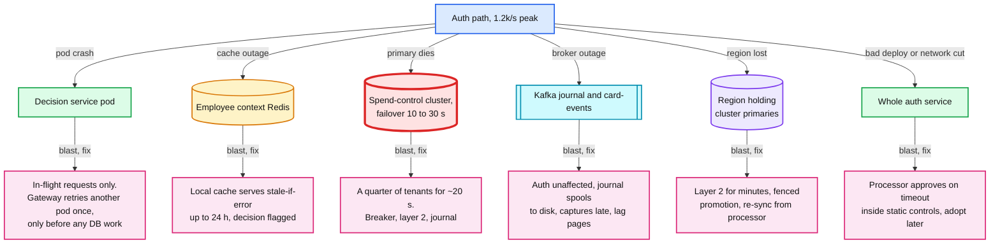
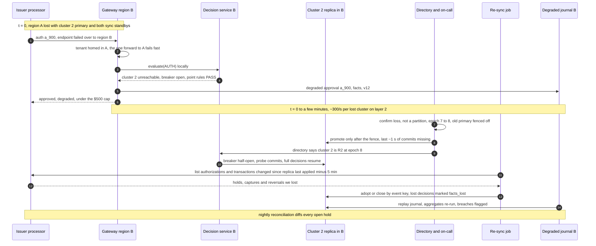

# Deep dive: degraded modes and region loss

> One-line answer: cards keep working, within bounds, through three layers that each know less than the one above. **Layer 1:** static controls the compiler derives from the policy and pushes to the processor, never stricter than the policy, which is what makes "approve on timeout" safe. **Layer 2:** our own fallback decision inside the 1.2 s deadline: point rules plus a per-authorization degraded cap (default $500), written to a degraded journal and replayed into the counters later without re-deciding. **Layer 3:** capture and submit re-checks that flag whatever slipped through. A counter-cluster failover costs ~20 s of degraded decisions for a quarter of tenants instead of ~9,000 false declines. A region loss costs minutes of degraded decisions and ~1 s of holds, re-synced from the processor, which is the system of record for authorizations.

Zoom-in on [`../solution.md`](../solution.md) §5.3, the failure timelines of §10.4 and the failure modes of §8. Reusable blocks: [`../../../concepts/replication-and-quorums.md`](../../../concepts/replication-and-quorums.md) (sync standby vs async replica), [`../../../concepts/leases-fencing-clocks.md`](../../../concepts/leases-fencing-clocks.md) (fencing a promoted primary), [`../../../concepts/rate-limiting-and-load-shedding.md`](../../../concepts/rate-limiting-and-load-shedding.md) (breakers and bulkheads), [`../../../concepts/exactly-once.md`](../../../concepts/exactly-once.md) (replay by id). Siblings: [`aggregates-holds-and-concurrency.md`](aggregates-holds-and-concurrency.md), [`authorization-hot-path.md`](authorization-hot-path.md), [`safe-rule-changes.md`](safe-rule-changes.md).

---

## 1. What fails on the auth path

- **Most likely first:** a counter-cluster failover (every primary eventually dies) and a bad deploy of our own. Region loss is rare and the most expensive.
- **One more branch not drawn:** the synchronous standby. With a single sync candidate, losing it or its AZ (availability zone) stops every commit: each waits for an acknowledgement that never comes. So each cluster runs **two** candidates, `synchronous_standby_names = 'ANY 1 (standby_az2, standby_az3)'`: 4 instances per cluster (a primary, 2 sync-candidate standbys in the other two AZs, 1 asynchronous cross-region replica). Losing one standby costs nothing.
- **Separate pools per cluster** (bulkheads). At 300/s, a dead primary with a 300 ms timeout keeps `300 × 0.3 = 90` requests waiting (Little's law). They must not starve the pools of the three healthy clusters.

## 2. Three layers, each coarser than the one above

| Layer | Runs in | Knows | Can do | Is the answer when |
|---|---|---|---|---|
| Full decision | decision service + spend-control DB | every rule, every counter | exact limits, holds | healthy (99.99% SLO, service level objective) |
| 1. Static controls | the processor | per card: blocked categories, per-authorization max, monthly ceiling | decline before we are asked | always on; alone when we are unreachable |
| 2. Fallback decision | our gateway | point rules, degraded cap, per-card degraded total, credit slice | approve up to the cap, journal it | shard down, breaker open, budget spent |
| 3. After the fact | settlement consumer, expense service | everything, later | flag, ask for approval, recover | at capture and at submit |

## 3. Layer 1: static controls, derived by the compiler

A rule may be pushed for one card only if **all** hold: `mode = ENFORCE`, `action = DECLINE`, `AUTH` is in its contexts, its scope matches this cardholder (resolved at compile time from the employee context, so exemptions are already applied), and its predicate reads only what the processor sees (category or MCC, which is merchant category code, amount, an interval total on this card).

| Policy rule | Pushed as | Loosened by | Why the loosening |
|---|---|---|---|
| `blocked_categories{airfare}` | `blocked_categories` | only processor categories wholly inside our blocked set | a processor category broader than ours would block spend we allow |
| `category_cap{restaurant, 7500}`, `DECLINE` | per-authorization limit on those categories | an FX (foreign exchange) margin, 10% [estimate] | the processor converts foreign currency at its own rate; we use the daily rate table |
| `per_period_cap{card, month}`, `DECLINE` | monthly limit | × 2, plus the tip margin | Stripe's "date-based intervals start at midnight UTC" ([spending controls](https://docs.stripe.com/issuing/controls/spending-controls)); our months start at local midnight |
| Department or trip caps, `REQUIRE_APPROVAL`, `FLAG`, `SHADOW`, predicates on HRIS (human resources information system) attributes | nothing | | the processor cannot express it, or would be stricter |

- **Why × 2 is provably safe.** One UTC month overlaps at most two local months. If our engine enforced the limit L in each, the UTC month holds at most 2L, so a 2L ceiling never fires while we are healthy. A ceiling of L would: $2,900 spent at 20:00 on 31 January in California counts in Stripe's February, and a legitimate February then hits the processor's limit first.
- **Push order.** A tightening change activates in our engine first. A **new** pushable `DECLINE` rule reaches the processor only after a 24 h [estimate] soak in our engine, so a bad new rule is never at the processor inside the window where it gets rolled back. A loosening change (unblock airfare, raise a cap) is pushed first and activates after the processor acknowledges it. The exception is a rollback: it activates in our engine at once (~5 s) and the loosening push follows. Syncs are versioned like bundles. HRIS moves (Sales to Ops) follow the same order.
- **Volume.** Only changes to pushable `DECLINE` rules touch the processor, and only as a diff per card. Stripe also takes cardholder-level limits ("a cardholder's spending limits apply across all of their cards"), so the largest tenant is at most 100k calls, minutes at a processor's API rate limits [estimate]. So a loosening change to a pushable rule at the 100k-card tenant waits on the processor API and does **not** meet the 5 s activation. The admin sees "activating" until it does.
- **Processor-side declines get a `DECISION` too.** Stripe's controls "can decline a purchase before the `issuing_authorization.request` is sent, resulting in a declined `issuing_authorization.created` event". The webhook receiver turns each one into a `DECISION` with the static control as the reason, or "why was my card declined?" has no answer.

## 4. The processor's timeout setting

| Processor | If we do not answer | What we set | Our deadline |
|---|---|---|---|
| Stripe Issuing ([docs](https://docs.stripe.com/issuing/controls/real-time-authorizations)) | "automatically approved or declined based on your timeout settings" after 2 s, or by Autopilot (public preview) "based on a predefined set of rules" | approve | 2 s − 800 ms = 1.2 s |
| Marqeta ([docs](https://www.marqeta.com/docs/developer-guides/about-jit-funding)) | Commando Mode decides "based on defined business rules"; unsent webhooks are stored "for later transmission" | business rules = our static controls | derived per processor; timeout not verified |
| Lithic ([docs](https://docs.lithic.com/docs/auth-stream-access-asa)) | "If no response is received within 6 seconds, the transaction will be declined"; answer within 3 s recommended | decline is the documented behaviour | 3 s − 800 ms = 2.2 s [estimate] |

- **Why approve is safe only with layer 1.** Without it, a timeout approves any amount at any merchant. A 10-minute bad deploy at peak is `1.2k/s × 600 s = 720k` approvals checked by nothing. With it, each of those 720k is inside a blocked-category list, a per-authorization max and a monthly ceiling, so the worst case per card is the ceiling.
- **Why not decline on timeout.** Then every incident of ours becomes a fleet-wide card outage, and our availability becomes the card's availability.
- **On Lithic, layer 2 is the only soft landing,** so the gateway's own availability matters more there.
- **One `adopt` path for everything we did not decide ourselves.** A degraded journal entry, a Stripe timeout approval (`request_history.reason` = `webhook_timeout`), Marqeta Commando Mode (`standin_approved_by`) and network stand-in processing, STIP (`standin_by` = `NETWORK`), all seen on the processor's `authorization.created` and `authorization.updated` webhooks, go through one idempotent `adopt(auth_id, state)`. The processor's recorded outcome is final: whenever our record disagrees (a lost answer included), adopt adds or releases holds to match it. It never re-decides; it re-runs aggregates and flags breaches. The journal is the fast path; the processor webhook is the backstop. Waiting for the capture (the force-capture path) would leave the limit blind for days on a hotel.

## 5. Layer 2: the fallback decision and the breaker

1. The gateway gives the request 1.2 s. The decision service runs point rules in memory first, then the counter transaction with `lock_timeout` 100 ms and `statement_timeout` 300 ms.
2. On a timeout, a connection error, a failed commit or an open breaker, the decision service returns the point-rule verdicts it already has, plus "store unavailable".
3. The gateway decides: a point rule says `DECLINE`, so decline, not degraded. Otherwise approve with `degraded: true` only if the amount is at most the tenant's degraded cap (default 50000 minor = $500, a tenant setting compiled into the bundle; $0 means fail closed), the card's degraded running total on this pod stays under $1,000 [estimate], **and** the tenant's credit slice has room (§7). Otherwise decline, degraded.
4. It writes the journal entry (key tenant, `acks=all`: facts, point verdicts, policy and engine version, the answer), then answers. Fallback answered by ~350 ms.
5. **Decision service unreachable:** the gateway has no point verdicts. It uses the card's cached layer-1 controls (the same derived data pushed to the processor) plus the cap and the per-card total.
6. **Kafka unreachable:** the gateway still answers and spools the entry to its local disk. The processor's webhook (§4) is the backstop, so a lost entry costs audit detail, not a leaked hold.

| Breaker state (per decision-service pod, per physical cluster) | Enters when | Behaviour |
|---|---|---|
| Closed | healthy | every request tries the database |
| Open | 5 consecutive failures | skip the database, fallback in under 1 ms |
| Half-open | 1 s after opening [estimate] | one probe request; success closes, failure re-opens |

## 6. Journal replay is `adopt`

- **Idempotent by the claim key.** Replaying a journal entry calls `adopt`, which claims `auth:{auth_id}:0` in `PROCESSOR_EVENT` and upserts `AUTHORIZATION`, `HOLD` and `DECISION` keyed by `auth_id` and moves a counter only when the hold row was actually inserted (`RETURNING`). A second replay, or a replay after a partial one, changes nothing.
- **No re-decision.** The processor already has our answer. Adopt records it: `held += amount` if the authorization is still open.
- **The answer that was sent wins.** If the primary died during `COMMIT`, the promoted standby may hold a full decision (say `DECLINE`) whose acknowledgement never arrived, while the processor was told the degraded approval. `ON CONFLICT DO NOTHING` would keep the wrong one. Adopt overwrites the `AUTHORIZATION` status to what the processor was told, adds the holds, and marks the orphaned decision `superseded`.
- **Order-independent with lifecycle events.** `card-events` (key `card_id`) and the journal (key tenant) are separate topics. After a promotion, a reversal for a degraded approval can be applied **before** its journal entry. If a lifecycle event for an unknown `auth_id` were dropped, replay would then create a hold nothing ever releases (until the sweeper, days later). If it took the force-capture path, a capture plus a replayed hold would count the dinner twice. Rule: an event for an unknown `auth_id` creates the `AUTHORIZATION` row in its end state (reversed, captured); replay sees a closed authorization and adds no hold.
- **Aggregates re-run and flag.** With the holds in, the engine runs the aggregate rules under the `policy_version` recorded with the degraded decision, the same one a later capture reuses. A breach becomes a flag or `NEEDS_APPROVAL` on the expense and a second `DECISION` row, never a decline.
- **Speed.** 9,000 entries at a replay cap of ~200/s [estimate] drain in ~45 s, beside 300/s of live traffic on a cluster that carries ~500 transactions/s at the design peak. Breakers close before the drain ends: a full decision on counters missing a minute of degraded spend beats another minute of degraded decisions.

## 7. Credit exposure: the one counter that fails closed

- **A policy violation is not a loss.** The company owes the merchant either way; it is visible and recoverable. **Credit exposure is a loss:** Rippling's own money on a charge card, if the customer cannot pay.
- **Healthy path:** a `tenant:credit` counter on the tenant's shard, `spent + held` against the credit line, locked like any other counter.
- **Degraded path:** that row sits on the dead shard. So each gateway pod holds a pre-allocated **escrow slice** of the company's last-known credit headroom, for example `min(10% of headroom, a fixed amount) ÷ 12 pods` (6 per region) [estimate], refreshed every minute while healthy. Degraded approvals spend the slice locally. Slice empty, or older than 5 minutes [estimate]: decline.
- **It binds only where it should.** Most tenants have headroom thousands of times the $500 cap. The slice bites for a tenant near its credit line, which is exactly the tenant that should fail closed.

## 8. Layer 3: after the fact

- **Capture:** point rules on the final amount, aggregates on the new counters, under the `policy_version` recorded on the `AUTHORIZATION`. A violation becomes `NEEDS_APPROVAL` or a flag.
- **Submit:** trip rules with the authoritative trip total, and receipts.
- **Recovery:** the employee repays. A payroll deduction only with written consent and within legal limits, a tenant policy decision, not a default.

## 9. Region loss

- **Topology.** The gateway and decision service run active-active in both regions. Each cluster has a primary in its home region, two sync-candidate standbys in the other two AZs of that region, and an asynchronous replica in the other region. A gateway in the non-home region forwards the evaluate call once to the tenant's home region, and card-events are produced to the home region's topic. With the home region gone, that forward fails fast and the local decision service answers.
- **Blast radius.** Tenants whose cluster primary lived in the lost region go to layer 2. With primaries split 2 and 2 [estimate], that is half the traffic, ~600/s at peak.
- **Promotion is a decision, not a reflex.** A partition can look like a loss, and two primaries would both accept holds on the same counters. The shard directory holds an epoch: it is bumped and the old primary is fenced off **before** the replica is promoted, and decision services refuse an endpoint with an older epoch. RTO (recovery time objective) is a few minutes; layer 2 carries the gap.
- **Two different numbers.** The RPO (recovery point objective) is ~1 s of **data**: at 300/s per cluster, ~300 holds and ~375 lifecycle effects per lost cluster [estimate], plus any `card-events` not yet mirrored out of region A. Decisions lost in that second are rebuilt from the processor's records and marked `facts_lost`. The **degraded window** is minutes of layer-2 decisions. Alert when replica lag passes a few seconds, or the RPO is a fiction.
- **Re-sync the delta, not everything.** ~6 M holds are open fleet-wide; listing millions through a processor's API is slow. Ask instead for every authorization and transaction that changed since the replica's last applied time minus a margin (5 minutes [estimate]), and diff both ways: we have it and the processor closed it, apply the close; the processor has it and we do not, adopt it. Nightly reconciliation catches the rest.
- **When region A returns,** its old primaries are rebuilt as replicas. They never serve again as they are.

## 10. Monzo Stand-in, compared

Source: [Monzo, "Tolerating full cloud outages with Monzo Stand-in"](https://monzo.com/blog/tolerating-full-cloud-outages-with-monzo-stand-in).

| | Monzo Stand-in | Our layer 2 |
|---|---|---|
| What it is | an independent platform on Google Cloud; the primary runs on Amazon Web Services; separate services | a code path in our gateway |
| Cost | "around 1% of the cost of our Primary Platform" | one Kafka topic |
| Effects | "Monzo Advices" in a durable queue, applied by the primary "verbatim" | degraded journal, replayed without re-deciding |
| Accepted risk | a stale balance may take a customer into "an unapproved overdraft" | overspend up to the cap per authorization, flagged later |
| Exercised | always a few customers on it for testing; enabled for everyone in an August 2024 outage of ~1 hour | must be exercised the same way |

- **Steal the exercise, not the platform.** Compute the fallback decision on every healthy authorization in shadow and log where it disagrees with the full decision: that measures its false approve and false decline rates for free. Kill one cluster primary on a monthly game day, at a quiet hour.
- **What Monzo buys that we do not:** surviving a whole-cloud outage. Our layer 2 shares the gateway, so a bad gateway deploy takes it down too. That is why layer 1 lives in another company's infrastructure.

## 11. Fail open vs fail closed

- **Fail closed** on one cluster failover: `300/s × 30 s = 9,000` false declines at peak, many at restaurant counters with a client watching.
- **Fail open, unbounded:** every card approves anything until we are back.
- **Bounded (chosen):** point rules still decline; each degraded approval is at most $500; the worst case for a 30 s failover is `9,000 × $500 = $4.5 M` of spend approved without aggregate checks [upper bound]. Only the part above an aggregate limit is a policy miss, and all of it is marked `degraded: true` and recoverable.
- **Fail closed only where the loss is real:** credit exposure, through the slice. And any tenant can choose a $0 cap.

## 12. How an interviewer attacks this

1. **"Approve on timeout is reckless."** Only without layer 1. With it, every processor-alone approval is inside blocked categories, a per-authorization max and a monthly ceiling, and each is adopted from the webhook.
2. **"The processor reverses a degraded approval before your replay."** The reversal creates the authorization in its end state; replay sees it closed and adds no hold.
3. **"Your replica was 1 s behind. You lost holds."** Re-sync every authorization and transaction the processor changed since the replica's last applied time minus a margin, both directions, idempotent by `PROCESSOR_EVENT` key; lost decisions come back marked `facts_lost`.
4. **"The region is not dead, just partitioned."** The directory's epoch is bumped and the old primary fenced off before the replica is promoted.
5. **"Your static controls decline what the policy allows."** Only ENFORCE + DECLINE rules the processor can express are pushed, with an FX margin and ×2 for UTC months. A new one reaches the processor only after a 24 h soak, and a loosening change is pushed before it activates (a rollback excepted).
6. **"Why not a Monzo-style full stand-in?"** It is a second platform to run. Our independent failure domain is the processor itself, for the cost of one sync job.

## 13. Numbers to say out loud

- Internal deadline 1.2 s (Stripe 2 s minus 800 ms). `lock_timeout` 100 ms, `statement_timeout` 300 ms, fallback by ~350 ms. Breaker opens after 5 failures.
- Degraded cap $500 (50000 minor) default, $0 = fail closed; per-card degraded total $1,000 per pod [estimate]; credit slice stale after 5 minutes [estimate]. Worst case 9,000 × $500 = $4.5 M per 30 s failover [upper bound].
- Cluster failover 10 to 30 s; one cluster = 4 logical shards, ~12.5k tenants, 300/s at peak, 9,000 would-be false declines.
- Journal: key tenant, 7 days; 9,000 entries drain in ~45 s at ~200/s [estimate].
- Region loss: RTO a few minutes, RPO ~1 s of data (not the degraded window), ~300 holds per lost cluster [estimate], re-sync from the replica's last applied time minus 5 minutes [estimate].
- Each cluster: 4 instances, 2 sync candidates (`ANY 1`), 1 cross-region async replica.
- New pushable `DECLINE` rules soak 24 h [estimate] before the processor push. Employee context stale-if-error up to 24 h [estimate], flagged.
- Pages: degraded decisions above 1% for 1 minute; processor timeouts above 0.1% for 2 minutes.
- Monzo Stand-in: ~1% of the primary's cost; ~1 hour outage in August 2024 fully on Stand-in.
