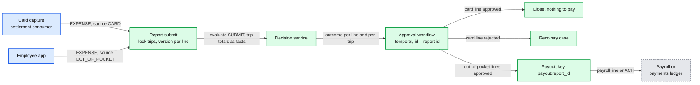
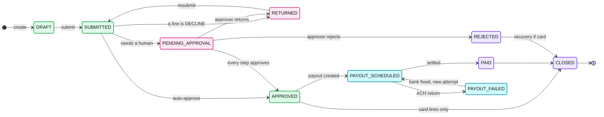
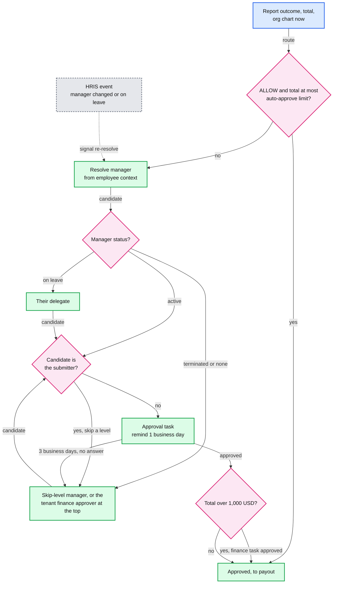
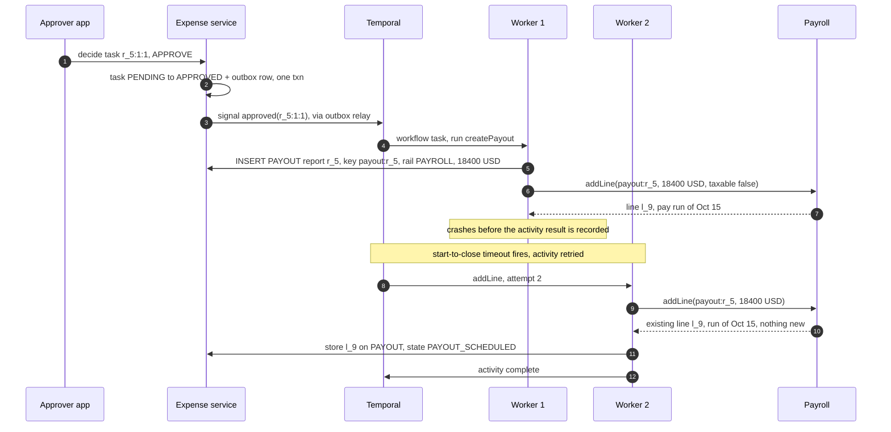

# Deep dive: reimbursement workflow and payout

> One-line answer: card-backed and out-of-pocket expenses go through **one report flow**. Submit locks the trip rows and judges every line under the policy version in force **when its money was spent** (for a card, the version recorded on its authorization; for out-of-pocket, the version in force at the start of the expense date), so a policy change never applies retroactively and never changes under a waiting report. A Temporal workflow per report (workflow id = report id) routes it using the HRIS (human resources information system) org chart at routing time, with a reminder after 1 business day and escalation after 3. Approval ends in one of three places: nothing to pay (card money already moved), a recovery case (card spend rejected as personal), or **one payout** keyed `payout:{report_id}`. The rail for that payout is chosen and written on our `PAYOUT` row before any call, and that row, not the ledger's 24 h key, stops a second payment.

Zoom-in on [`../solution.md`](../solution.md) §4.4 and §6 Flow 5. Reusable blocks: [`../../../concepts/temporal-durable-execution.md`](../../../concepts/temporal-durable-execution.md) (replay, timers, signals, patching), [`../../../concepts/exactly-once.md`](../../../concepts/exactly-once.md) (one dedup key per hop). The money movement itself: [`../../payments-ledger/`](../../payments-ledger/). Siblings: [`aggregates-holds-and-concurrency.md`](aggregates-holds-and-concurrency.md) (trip counters at `AUTH`), [`audit-replay-and-determinism.md`](audit-replay-and-determinism.md) (facts on every decision).

---

## 1. Two kinds of expense, one report flow

| | Card-backed | Out-of-pocket |
|---|---|---|
| Money moved? | Yes, at capture. Stripe: "captures for approved authorizations always succeed" | No. The company owes the employee |
| `EXPENSE` row created by | Capture, through an outbox row keyed by transaction id that the expense service consumes idempotently. Already judged at `AUTH` and `CAPTURE` | Employee app, `POST /v1/expenses`, judged first at `SUBMIT` |
| Volume | ~10 M receipt and memo submissions/day, handled in the submit transaction | 1 M expenses/day in ~330k reports (~3 lines each). 12/s avg, ~120/s peak, ~360/s at month-end |
| "Approved" means | Accepted as business spend. Nothing to pay | A payout is owed |
| "Rejected" means | Personal spend on a company card. Recovery case (§8) | Not reimbursable. Nothing owed |

- A report may mix both kinds. Its payout is the sum of approved out-of-pocket lines, paid as a payroll line or by ACH (automated clearing house). Card lines never pay out.
- **Which reports start a workflow.** Every report with money owed to the employee, even an auto-approved one, because the payout needs durable retries. A card-only report whose outcome is `ALLOW` closes in the submit transaction, so the ~10 M card receipts/day stay out of Temporal.

## 2. The report state machine

- Every transition is `UPDATE REPORT SET state = :to WHERE report_id = :id AND state = :from`. Zero rows means someone else won: re-read, do nothing. That one line removes double taps, two approvers clicking at once, and a retry racing its own timeout.
- `SUBMITTED` is legal from `DRAFT` **and** `RETURNED`. Pink states wait on a human, cyan states on a rail. The submitter reads their own report from the primary (read-your-writes).

## 3. Trips, the lock at SUBMIT, and which version judges a line

- **Trip assignment.** A travel booking creates the `TRIP` row with dates, and expenses inside those dates are suggested onto it. Without a booking the employee creates or picks a trip per expense. Moving an expense to another trip after submit needs a return. Every path that attaches an expense to a trip (a capture on a booked trip, a re-assignment) takes the `TRIP` row `FOR SHARE`, so it waits behind a SUBMIT holding `FOR UPDATE`.
- **The lock.** One expense-DB transaction: `SELECT ... FOR UPDATE` every `TRIP` row the report touches, in sorted `trip_id` order (no deadlocks, same trick as counters). Read each trip's total: card expenses assigned to the trip plus out-of-pocket lines in reports that are not `REJECTED`. Pass the totals to `evaluate(SUBMIT)` as facts. Write the decisions (they live in the expense DB and reach the lake by a second CDC, change data capture, stream) and `SUBMITTED`. Commit. A second report on the same trip waits a few ms [estimate], then sees the first one's lines.
- **The decision service never queries the expense DB.** The read must happen inside the lock's transaction, and replay needs the exact total the rule saw.
- **`SUBMIT` is authoritative for trips.** The `trip:t_88:cat:meals` counter at `AUTH` exists only when a booked trip covers today. It is an early, best-effort check on card spend only, and it never sees out-of-pocket lines.
- **Version by spend time.** A card line reuses the `policy_version` recorded on its `AUTHORIZATION` in `CAPTURE` and `SUBMIT`. It is never re-derived, so the ~5 s activation lag cannot make two versions judge one card expense. An out-of-pocket line uses the version in force at the start of its expense date (the tenant's local midnight), so a same-day publish applies from the next day's expenses. A trip rule runs inside each line's decision, under that line's version, with the trip total as a fact.
- **No pin on the report.** Each decision records its own `policy_version`. A policy published while the report waits (Flow 4) changes nothing, and a resubmit after `RETURNED` keeps every line's version. Old bundles are immutable and kept 7 years, so a cold version is one object-storage GET (~20 ms).
- **Backdating guard.** Spend time now picks the policy, so an employee could backdate a dinner to before a tighter rule. An expense date that disagrees with the OCR (optical character recognition) receipt date is flagged, and an expense older than 90 days [estimate] at submit is flagged.

## 4. Approval routing

- **Who approves is decided at routing time.** A manager resolved at submit is stale by day 3. The employee-context projection is at most 60 s behind the HRIS (p99), plenty for a step measured in days.
- **Auto-approve** needs outcome `ALLOW` **and** a report total at or under the tenant's auto-approve limit ($250 default [estimate]). "ALLOW means auto-approved" alone would pay a clean $5,000 report with no human looking.
- **Finance above $1,000** of report total, whatever the outcome. Lines are converted to the tenant currency with each expense's stored FX (foreign exchange) rate id.
- **Re-route.** An HRIS manager-change, leave or termination event finds open tasks through an index on `APPROVAL_TASK (tenant_id, approver_id, state)`. The same index serves the approver's inbox. Each affected workflow gets a `re-resolve` signal, cancels its open task (compare-and-set `PENDING` to `CANCELLED`) and resolves again.
- **Self-approval is impossible.** The approver is never the submitter. A delegate who is the submitter, or a chain that resolves to the submitter, skips a level. Admin overrides are allowed and logged with the actor.

## 5. The Temporal workflow

- **Identity.** Workflow id = report id, with the id-reuse policy set to reject duplicates. The workflow lives from first submit to `CLOSED`, including `RETURNED`, where it waits on a `resubmitted` signal (closed after 60 days of silence [estimate]). A duplicate submit hits the running workflow. A stale one after close is refused by the `REPORT` compare-and-set first, then by Temporal.
- **Workflow code decides, activities act.** Each activity is idempotent on a key derived from the report: `resolveApprover`, `createTask(task_id = r_5:round:step)`, `notify(r_5:round:step:kind)`, `createPayout(payout:r_5)`, `submitToRail(payout:r_5)`, `setState`.
- **Business-day timers.** "1 business day" needs the tenant's timezone and holiday calendar, which is I/O. An activity computes the `remind_at` and `escalate_at` instants, and the workflow sleeps until them: a durable timer, not a cron.
- **Approver decisions.** `POST /v1/approvals/{task_id}/decide` does the task compare-and-set and writes an outbox row in the same transaction. A relay signals the workflow at least once, so a crash cannot lose an approval. The workflow ignores a second signal for the same `task_id`.
- **Worker crash.** Any worker replays the event history and lands in the same state. An in-flight activity is retried after its start-to-close timeout, which is why every activity carries a key (sequence in §7). Routing code changes with workflows open go through Temporal's versioning (patching) API, or replay diverges.
- **Temporal down.** Submits and approvals still commit to the expense DB and the outbox, and workflows catch up when it returns. The visible cost is a payout that misses a payroll cutoff and lands in the next run.

## 6. Partial approval: split the report

An approver may approve some lines and return others. **Decision: split.** Approved lines stay on `r_5` and go to payout. Returned lines move to a new child report `r_6` (`parent_report_id = r_5`), in `RETURNED`, with the same trips, its own workflow and its own `payout:r_6`.

| Option | Good lines paid now? | Payout key | Chose |
|---|---|---|---|
| All or nothing: return the whole report | No, they wait on the worst line | `payout:{report_id}` works | No |
| Line-level states in one report | Yes | Needs a round in the key, two payouts per report | No |
| Split returned lines into a child report | Yes | `payout:{report_id}` stays one per report | **Yes** |

- **The bug this avoids.** One report, two payouts, one key `payout:r_5`: the later payout for the fixed lines is deduplicated away, and the employee is never paid for them. Both reports lock the same trips at submit, so the trip total still counts every line.

## 7. Payout

- **Write the payout before paying it.** `createPayout` inserts `PAYOUT(report_id, amount_minor, currency, rail, ledger_payment_id = null, state = CREATED)`, unique per report on `payout:r_5`. The rail is chosen here, before any call.
- **Rail.** Default: a line on the next payroll run (no transfer fee, one deposit, shown on the pay stub). ACH through the payments ledger when the report is approved after the run's cutoff and the tenant enabled fast reimbursement, or the employee is terminated or has no upcoming run.
- **Never switch rails on an unknown outcome.** Payroll and the ledger each deduplicate `payout:r_5` only against themselves. The rail moves from payroll to ACH only after payroll confirms it did not pay.
- **Cutoff.** Payroll owns the cutoff and decides the run inside `addLine`: it returns this run or the next. The workflow never guesses which side of the cutoff it is on. A run typically locks ~2 business days before pay date to fund direct deposits [estimate].
- **Tax.** Under a US accountable plan (business connection, substantiated within a reasonable time, excess returned), reimbursements are not wages, so nothing is withheld [general knowledge, confirm with payroll tax counsel]. Each line carries `taxable`, default false. A line outside the plan is paid as wages. Other countries: rules live in payroll.
- **Currency.** Each expense stores its `fx_rate_id` from the daily table. Each line converts to the employee's payroll currency (from the HRIS) with half-even rounding. `PAYOUT` stores the sum as `amount_minor` plus `currency`, fixed at `createPayout` and never recomputed on pay date.
- **The `PAYOUT` row is the long-lived guard.** The ledger's idempotency record lives only 24 h ([`../../payments-ledger/deep-dives/idempotency-keys.md`](../../payments-ledger/deep-dives/idempotency-keys.md)). So after the first call, `submitToRail` stores the ledger's payment id (or the payroll line id) on `PAYOUT`. Every retry looks that id up first and never posts twice. The activity's schedule-to-close timeout stays under 24 h, then a human reconciles.
- **Returns.** An ACH return (for example `R03`, no account) can arrive up to 2 banking days later ([`../../payments-ledger/deep-dives/rails-timeouts-and-unknown-outcome.md`](../../payments-ledger/deep-dives/rails-timeouts-and-unknown-outcome.md)). The payout goes to `PAYOUT_FAILED`. Once the bank details are fixed, it re-pays under a new `PAYOUT_ATTEMPT` (a new attempt id) under the same `PAYOUT` row, never a new payout.

## 8. Recovery for card violations found after the fact

- **Where they come from.** The `CAPTURE` re-check (the tip), degraded approvals replayed after a failover, and `SUBMIT` (no receipt, trip over its cap). The money has moved, so the tools are approve, flag, or recover.
- **Approval first.** Most become `NEEDS_APPROVAL`, and the manager can accept the exception. Recovery starts only for a card line that ends `REJECTED`.
- **Recovery order [policy decision].** (1) The employee repays in the app, key `recovery:{expense_id}`. (2) A payroll deduction, only with written consent, capped per run, and within minimum-wage and state or country limits that payroll holds [general knowledge, not legal advice]. (3) Otherwise a finance or HR case, and the card may be frozen. The engine never deducts on its own.

## 9. Month-end spike (3x)

- ~360/s expense submissions in the last two business days. Submit writes `SUBMITTED` plus an outbox row in one transaction and returns 202. Evaluation workers read from Kafka and autoscale. The employee sees "checking policy" for seconds.
- A per-tenant concurrency cap in the workers stops a 100k-employee tenant from starving 40-person tenants. Correctness does not depend on it: the trip lock serializes whatever runs.
- Temporal: ~330k workflows/day (~100k with approval steps, ~230k auto-approved payouts), about 3x that at month-end, ~1.5k actions/s at the peak (solution §10.3). Capacity is counted in state transitions per second: a small cluster. None of it shares a database or a pool with the auth path.

## 10. Exactly-once for the money, end to end

| Hop | Duplicate comes from | Key | Guard |
|---|---|---|---|
| Submit | Double tap, app retry | `Idempotency-Key` + report id | `REPORT` compare-and-set from `DRAFT` or `RETURNED` |
| Workflow start | Submit retry, relay redelivery | Workflow id = report id | Temporal refuses a second start, reuse policy refuses after close |
| Approval | Double click, two approvers | `task_id` | Task compare-and-set from `PENDING`; outbox signal, repeat ignored |
| Payout row | Activity retry | `payout:{report_id}` | Unique on `PAYOUT`, rail fixed before any call |
| Payroll line | Retry after a crash (§7) | `payout:{report_id}` | Payroll's unique line key, line id stored on `PAYOUT` |
| ACH transfer | Retry, even after 24 h; re-pay after a return | `payout:{report_id}`, then `ledger_payment_id`; a new `PAYOUT_ATTEMPT` id per re-pay | Ledger key (24 h), then lookup by stored id; entry id from `(payment_id, kind)` |
| Anything missed | | | Daily reconciliation: approved reports vs `PAYOUT` vs payroll lines vs ledger |

## 11. Trade-offs

| Decision | Chose | Gave up |
|---|---|---|
| Workflow engine | Temporal, one workflow per report | One more system to run and patch. A DB state machine plus cron is fine at small scale |
| Which policy version | Spend time per line: the authorization's recorded version for card, start of the expense date for out-of-pocket | One version per report. Lines on one report can differ, and backdating needs a guard |
| Partial approval | Split into a child report | More reports; one trip can span two reports |
| Default rail | Payroll line | Speed: up to one pay period of waiting, unless the tenant pays for ACH |
| Approver identity | Resolved at routing time, re-routed by signal | An index on open tasks by approver and a fan-out on every org change |
| Recovery | Repay first, deduction only with consent | Money comes back slower and sometimes not at all |

## 12. How an interviewer attacks this

1. **"The policy changes while the report waits."** Nothing changes. Each line is judged by the version in force when its money was spent, recorded on its decision, and a resubmit keeps it.
2. **"Then I backdate my dinner to before the new rule."** A date that disagrees with the receipt's OCR date is flagged, and so is anything older than 90 days at submit.
3. **"The worker dies after payroll accepted the line."** Replay plus a retry with the same key. Payroll returns the existing line (§7).
4. **"Payroll timed out. Just send ACH."** Two systems, two dedup scopes: a double payment. Switch only after payroll confirms it did not pay.
5. **"The manager is fired the day after submit."** The HRIS event finds the open task by approver and signals re-resolve. The task moves to the skip-level.
6. **"Approve half the report."** Split into a child report, so each report still has exactly one payout key.
7. **"You change the routing code with open workflows."** Temporal's patching API plus replay tests, or replay diverges.

## 13. Numbers to say out loud

- Out-of-pocket: 1 M expenses/day in ~330k reports. 12/s avg, ~120/s peak, ~360/s month-end. Card receipts: ~10 M/day, closed in the submit transaction.
- ~100k approval workflows/day plus ~230k auto-approved payout workflows. ~1.5k Temporal actions/s at the month-end peak.
- Reminder after 1 business day, escalation after 3. Finance above $1,000. Auto-approve at or under $250 [estimate].
- Approver data at most 60 s stale (p99). Backdating flag at 90 days [estimate].
- `payout:{report_id}`: our row 7 years, the ledger's key 24 h. ACH returns up to 2 banking days.
- Reimbursement availability 99.9%. No capacity shared with the auth path.
