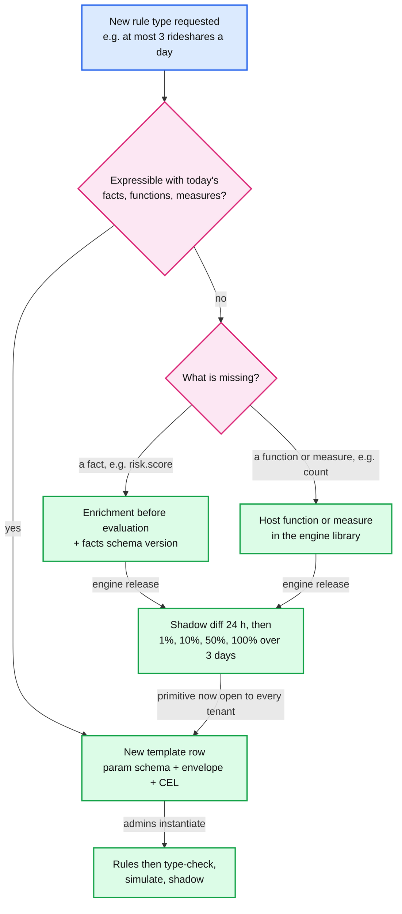
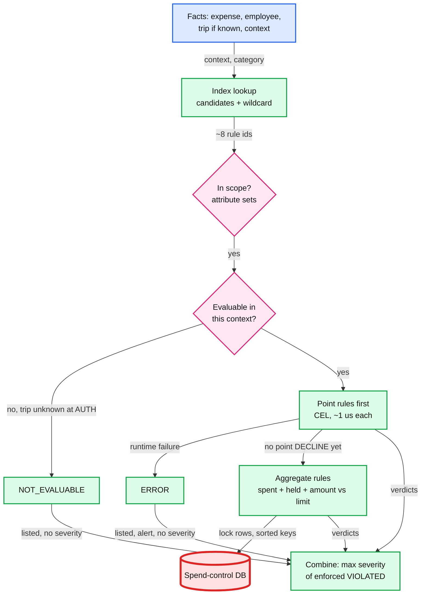

# Deep dive: rule model and evaluation

> One-line answer: a rule is **data**: a JSON (JavaScript Object Notation) envelope the engine reads structurally (scope, contexts, aggregate, action, mode) plus a typed CEL (Common Expression Language) predicate that cannot loop or do I/O. Templates generate both halves, so a new rule *type* is an API call; only a new *primitive* (a fact, a function, an aggregate measure) is an engine release. The compiler type-checks, cost-limits and indexes a tenant's rules into an immutable bundle, and evaluation returns every applicable rule's verdict with numbers, combined by one order-independent law: outcome = max severity of enforced violations.

Zoom-in on [`../solution.md`](../solution.md) §3.2, §4.1, §4.2 and §10.1. Reusable block: [`../../../concepts/caching-patterns.md`](../../../concepts/caching-patterns.md) (immutable, versioned keys never need invalidation). Siblings: [`authorization-hot-path.md`](authorization-hot-path.md) (where bundles are cached and run), [`aggregates-holds-and-concurrency.md`](aggregates-holds-and-concurrency.md) (the counters aggregate rules read), [`safe-rule-changes.md`](safe-rule-changes.md), [`audit-replay-and-determinism.md`](audit-replay-and-determinism.md).

---

## 1. The phone-screen version first

The Rippling prompt as reported: `evaluateRules(rules, expenses)`, six rules, "discuss the return type", then "rule creation via an API". Get this right in 20 minutes. Everything after it is the same idea plus versions and state.

**The six rules as data.** One row shape covers all six: filter by expense type, measure the expense (or the sum over its trip), compare with a cap in integer cents. A blocked category is a cap of 0.

```json
[
  {"id": "restaurant-75",    "level": "EXPENSE", "types": ["restaurant"],          "max_cents": 7500},
  {"id": "no-airfare",       "level": "EXPENSE", "types": ["airfare"],             "max_cents": 0},
  {"id": "no-entertainment", "level": "EXPENSE", "types": ["entertainment"],       "max_cents": 0},
  {"id": "single-250",       "level": "EXPENSE", "types": ["*"],                   "max_cents": 25000},
  {"id": "trip-2000",        "level": "TRIP",    "types": ["*"],                   "max_cents": 200000},
  {"id": "meals-per-trip",   "level": "TRIP",    "types": ["restaurant", "meals"], "max_cents": 20000}
]
```

**The return type** is `{by_expense: Map<expense_id, List<RuleResult>>, by_trip: Map<trip_id, List<RuleResult>>}`, with `RuleResult {rule_id, status, observed_cents, limit_cents, message}`, every applicable rule listed, sorted by `rule_id`.

| Simpler shape | What it loses |
|---|---|
| `boolean` | Which rule, and why. The employee cannot fix the expense; support cannot answer the ticket |
| First violation | The rest. The employee fixes one, resubmits, hits the next |
| List of violated rule ids | The numbers ("$84.20 against $75.00") and the level: a trip violation is not the fault of the dinner that tipped it over |

**The inputs are maps of strings** (as reported, the amount arrives as text like `"49.99"`). Parse once, at the boundary:
- **Integer cents, never floats.** `Math.round(1.005 * 100)` is 100 in Java, not 101, because `1.005 * 100` is `100.49999999999999`. Use `new BigDecimal(s).movePointRight(2).longValueExact()`, which throws on `"49.999"`. Check the shape with a regex first: `BigDecimal` also accepts `"1e3"`.
- **Bad input is a result, not an exception.** An unparseable amount gives `ERROR` on that expense's amount rules; the other 999 expenses still evaluate.
- **A missing field is `NOT_EVALUABLE`, not `PASS`.** No `expense_type` means "no airfare" cannot claim a pass. No `trip_id` means trip rules are `NOT_EVALUABLE` for that expense.
- **Boundaries and edges are explicit.** "Over $75" means violated when amount > 7500, so $75.00 passes. The cap-of-0 trick lets a $0.00 airfare pass "no airfare"; accept it or add `blocked: true`. Say the screen is USD only; production carries an ISO 4217 code and an FX (foreign exchange) rate id.

## 2. The production rule: an envelope plus a CEL predicate

The row shape breaks on compound conditions ("restaurant **and** over $75 **unless** Sales"), HRIS (human resources information system) scopes, windows ("per month") and actions. So a rule splits into what the engine must understand and what is free-form:

| Field | Interpreted by | Example | Why it is not inside CEL |
|---|---|---|---|
| `template` + params | Policy service | `category_cap{restaurant, 7500}` | Provenance; the UI edits params, not CEL |
| `scope` | Engine, set intersection on attribute ids | `departments: *`, `exclude_levels: exec` | Indexable. Exemptions live here |
| `contexts` | Engine | `AUTH`, `CAPTURE`, `SUBMIT` | Per-context evaluability, known at compile time |
| `predicate` | CEL | `expense.category == 'restaurant' && expense.amount_minor > 7500` | The only free-form part |
| `aggregate` | Engine + counter store | `group_by trip, measure sum, limit_minor 20000` | Needs locked state; CEL has no I/O |
| `action`, `mode`, `message` | Engine | `REQUIRE_APPROVAL`, `ENFORCE` | The combination law and shadow mode |

For an aggregate rule the predicate is the **filter** (which expenses count toward the total) and the envelope holds the comparison: violated when `spent + held + amount > limit_minor`. CEL never touches state; counter values are read under lock and handed in as plain facts.

**Which version judges an expense:** the one in force when the money was spent. At `AUTH`, the version in force at the network transaction time; `CAPTURE` and `SUBMIT` reuse the `policy_version` recorded on the `AUTHORIZATION`, so one card expense is judged by one version. Out-of-pocket: the version in force at the start of the expense date (the tenant's local midnight). `effective_from` never decreases, at most one future version is scheduled, nothing is backdated, and publish is compare-and-set on `base_version`. So a policy change never applies retroactively.

## 3. Templates: "rule creation via an API" with no deploy

A template is a row: `{name, param_schema, envelope_skeleton, predicate}`. The predicate reads parameters as typed CEL variables (`expense.amount_minor > params.max`), never as spliced text, so a parameter cannot inject CEL, and one checked program serves every rule made from that template. `category_cap`, `per_trip_cap`, `blocked_categories` and `per_period_cap` are four rows; a fifth (global, or private to one tenant) is a write to the policy DB.



- **Data, minutes:** templates, rules, scopes, MCC (merchant category code) group tables. Group tables are snapshotted into the bundle, so a replay sees the groups as they were. **Code, days:** a new fact in the declared types, a host function (`in_mcc_group`, `days_between`), a new measure (`count`, distinct merchants), a new context. The cel-go README: "the only functions beyond the built-ins that may be invoked are provided by the host environment". So "3 rideshares a day" is a template **if** `count` exists; if not, one engine release adds it for every tenant. Rules store `template_version`: a template fix re-expands, simulates per tenant, and publishes system-authored versions cohort by cohort.

## 4. Type-checking and cost limits at save

Checks run on every `PUT` of a draft:
1. **Parse.** Syntax errors come back with a line and column. Parse and check are the expensive phases, so they run at save and publish only; the checked program is "stateless, thread-safe, and cachable" (cel-go README), so every evaluator thread shares one copy.
2. **Type-check** against `expense`, `employee`, `trip`, `params`. `amout` fails with a position; `expense.amount_minor > "75"` fails (int against string); the result must be `bool`.
3. **Money and size.** Limits are integers in minor units, in the policy currency; a double literal fails. Rules per tenant capped at 10k; long list literals rejected in favour of `in_mcc_group`.
4. **Context fit.** A predicate that reads `trip` may list `AUTH` only if it tolerates `NOT_EVALUABLE` there. The compiler records a per-context flag.
5. **Cost.** The checker's estimate must be under the per-rule limit (fixed per plan); a runtime cost limit backs it up. CEL is linear in expression and input size **when macros are disabled** (cel-go README). With macros, `a.all(x, b.exists(y, x == y))` is `len(a) × len(b)`: exactly what the estimate catches.

## 5. Compile into a bundle

| Part | Contents | Why it is there |
|---|---|---|
| Programs and tables | Serialized checked AST (abstract syntax tree) per rule, as cel-spec recommends; MCC to category map, MCC groups, messages | No parse or check on the hot path; tables snapshotted for replay |
| Candidate index | `(context, category or MCC group) -> rule ids`, a wildcard bucket, a scope index by attribute id | 40 rules to ~8 candidates, 5k to ~100 |
| Counter dimensions | Per aggregate rule: `group_by`, window, canonical hash of the filter, giving key templates like `emp:{e}:cat:meals:month` | Which rows the auth transaction locks, in sorted order |
| Evaluability | Per rule and context: always, only if a trip is known, never | `NOT_EVALUABLE` without running anything |
| Tenant settings | Degraded cap, tip buffer, auto-approve limit, timezone, policy currency | Anything that changes an outcome is versioned and replayable |
| Header | Tenant, version, `effective_from`, SHA-256; checked ASTs loadable by the current and the previous engine version | Content-addressed; an engine rollback needs no rebuild |
| Static controls (side output) | Only `ENFORCE` + `DECLINE` rules that apply at `AUTH` and that the processor can express; monthly ceilings at 2x the limit (UTC months vs local months), per-authorization caps loosened by an FX margin | Layer 1 at the processor, never stricter than the policy |

- **The index must be sound.** Keys come only from top-level conjuncts the compiler understands (`expense.category == 'x'`, `... in [...]`, `in_mcc_group(...)`); a rule with `||` or a negation on category goes to the wildcard bucket. A rule left out of the candidates can never be violated by that expense: the property Cedar proves for its policy slicing, which made template-based authorization 10.0x to 18.0x faster on average (Cedar paper).
- **Counters are shared only when the filter is identical.** `cat:meals` is shorthand for "category in [restaurant, meals]". Any other filter needs its own key (the filter hash), and a new key needs a backfill before it can enforce.
- **Sizes.** ~1 KB per compiled rule, median bundle ~40 KB, a 5k-rule bundle ~5 MB, all bundles ~2 GB. Median ~8 candidates at ~1 µs each is ~10 µs; the 5k-rule tenant is ~100 µs.

## 6. Evaluating one expense



- **Unknowns, not guesses.** Missing inputs go to CEL as unknown values. CEL's `&&` and `||` are commutative over errors and unknowns (`<x> && false` is `false`, cel-go README), so `expense.category == 'restaurant' && trip.city == 'NYC'` on a fuel swipe is a `PASS` without a trip. Only a result that truly depends on the missing input is `NOT_EVALUABLE`. Out-of-scope rules are not listed at all.
- **Short-circuit is safe.** If a point rule already says `DECLINE` at `AUTH`, aggregates cannot raise the outcome: they are listed `NOT_EVALUABLE` with reason `short_circuit`, no counter is locked and no hold is written. The `AUTHORIZATION` and `DECISION` rows are still written, so a retry returns the same decline.
- **Trip totals at `SUBMIT` are facts.** The expense service locks the `TRIP` row and passes the total in; the decision service never queries the expense DB. At `AUTH` a `trip:*` counter exists only when a booked trip covers today: an early, best-effort check on card spend only.

## 7. Combination: deny-only, max severity

| Action | `AUTH` | `CAPTURE` | `SUBMIT` |
|---|---|---|---|
| `FLAG` | `ALLOW_FLAGGED` | `ALLOW_FLAGGED` | `ALLOW_FLAGGED` |
| `REQUIRE_APPROVAL` | `NEEDS_APPROVAL`: card approved, approval after capture | `NEEDS_APPROVAL` | `NEEDS_APPROVAL` |
| `DECLINE` | `DECLINE` | `NEEDS_APPROVAL` (money already moved) | `DECLINE` (returned with every reason) |

Why order-independence is worth defending:
- **Narrowing, short-circuits and replay are safe.** Skipping a rule that cannot fire, or stopping at a decline, never changes the answer; results sort by `rule_id` and the outcome is a max, so iteration order is irrelevant.
- **No priority field.** Nothing for an admin to get wrong. With first-match rules, inserting a rule one row too high silently disables everything below it.
- **Exemptions live in scope** (`exclude_levels: exec`), not in "allow" rules, so two rules never contradict. The price: an exemption is written on each rule it covers; a tenant-level exemption group referenced from scope makes it one edit.

**Compared with Cedar:** it denies by default, "forbid policies always override permit policies", and because policies have no side effects "evaluation order doesn't matter" (Cedar paper §2.4). We keep the core property (nothing can un-deny) with the opposite default: allow, and only forbids at three severities. **Compared with DMN** (Decision Model and Notation) hit policies: `FIRST` is first match wins, `UNIQUE` makes overlap an error, `COLLECT` returns all matches with an optional aggregation. Ours is `COLLECT` with a max over severity.

The core types and the law as a Java sketch (compiles on Java 17+; the engine is not shown):

```java
enum Context { AUTH, CAPTURE, SUBMIT }
enum Status  { PASS, VIOLATED, NOT_EVALUABLE, ERROR }
enum Action  { FLAG, REQUIRE_APPROVAL, DECLINE }
enum Level   { EXPENSE, TRIP, PERIOD }
enum Outcome { ALLOW, ALLOW_FLAGGED, NEEDS_APPROVAL, DECLINE }   // declaration order = severity

record RuleResult(String ruleId, int ruleVersion, Level level, Status status, Action action,
                  boolean shadow, long observedMinor, long limitMinor, String currency, String message) {}

final class Combiner {
    /** Max severity over enforced violations. Order-independent, so any subset can run first. */
    static Outcome combine(java.util.Collection<RuleResult> results, Context ctx) {
        Outcome out = Outcome.ALLOW;
        for (RuleResult r : results) {
            if (r.shadow() || r.status() != Status.VIOLATED) continue;  // PASS, NOT_EVALUABLE, ERROR add nothing
            Outcome o = severity(r.action(), ctx);
            if (o.compareTo(out) > 0) out = o;
        }
        return out;
    }
    static Outcome severity(Action a, Context ctx) {
        return switch (a) {
            case FLAG -> Outcome.ALLOW_FLAGGED;
            case REQUIRE_APPROVAL -> Outcome.NEEDS_APPROVAL;
            case DECLINE -> ctx == Context.CAPTURE ? Outcome.NEEDS_APPROVAL : Outcome.DECLINE;  // money moved
        };
    }
    /** At AUTH the processor only hears yes or no. NEEDS_APPROVAL approves now and asks later. */
    static boolean approvedAtAuth(Outcome o) { return o != Outcome.DECLINE; }
}
```

## 8. PASS, VIOLATED, NOT_EVALUABLE, ERROR, and shadow

| Status | When | Effect on outcome | Example |
|---|---|---|---|
| `PASS` | Predicate false, or total within limit | None; listed with observed vs limit | $62 lunch: 6200 vs 7500 |
| `VIOLATED` | Predicate true, or total over limit | Its action's severity, if `ENFORCE` | Capture at 8400 vs 7500 |
| `NOT_EVALUABLE` | The result depends on an input this context lacks | None now; checked again in a later context | Trip rule at `AUTH`, no booked trip |
| `ERROR` | Runtime failure: overflow, division by zero, cost limit hit | None; decision flagged for review; tenant admins and our on-call alerted | Custom rule dividing by trip nights = 0 |

- **`ERROR` is not `VIOLATED`.** Counted as a violation, one bad field declines a whole company; silently passed, nobody learns. The price: an erroring rule fails **open** for that swipe, bounded by the processor's static controls and by the `CAPTURE` and `SUBMIT` re-checks.
- **Shadow.** A `SHADOW` rule is evaluated identically and recorded with `shadow: true`, but `combine` skips it. Shadow rules never write holds: counters follow only the enforced outcome. So a shadow report counts only the first violation per counter window (after it, the real counter has already run past the shadow limit). It is a lake query grouped by `rule_id`.

## 9. Choosing the predicate language

| Option | Terminates | Typed at save | I/O from a rule | Speed evidence | Fit | Verdict |
|---|---|---|---|---|---|---|
| CEL | Yes: "linear time, is mutation free, and not Turing-complete" (cel-spec) | Yes, with positions | None; host functions only | ~1 µs per compiled predicate [estimate] | Typed expressions over one fact | **Chosen** |
| Rete / Drools (Forgy 1982) | Rule actions are Java | Partly | Yes | Wins at many facts × many rules changing incrementally | We have one fact and ~8 rules | Rejected |
| OPA / Rego | Yes (Datalog-based) | Optional | Some built-ins | Rego gdrive median 76 µs at 5 entities, 676 µs at 50 (Cedar paper) | Policies over JSON documents | Rejected on fit, not speed |
| Cedar | Yes, deterministic | Yes | None | 28.7x to 35.2x faster than OpenFGA, 42.8x to 80.8x faster than Rego at the median | Principal, action, resource; slots only `?principal`, `?resource` | Close second |
| Embedded Python or JS | No | No | Yes | Fast enough | Anything | Termination, sandboxing, determinism, isolation become ours |

Cedar's SMT (satisfiability modulo theories) encoding answers analysis questions in 75.1 ms on average. That is the reason to revisit Cedar: if customers ask "prove no rule can decline all spend", analyzability becomes a requirement. Speed never is: even Rego's 676 µs is under 5% of a ~15 ms swipe.

## 10. How an interviewer attacks this

1. **"Customer wants 'at most 3 rideshares a day'. Is that a deploy?"** Only if `count` is not a measure yet. Then one engine release, after which it is a template for everyone.
2. **"'Meals need approval' and 'execs are exempt' conflict."** They cannot. The exemption is scope on the meals rule; the outcome is a max.
3. **"Your index skipped a rule that should have fired."** Keys come only from top-level conjuncts; everything else is wildcard. A property test compares all rules against the indexed subset on random facts; the engine shadow diff catches the rest.
4. **"A rule throws on 1% of swipes."** `ERROR`: no severity, an alert, a re-check at capture. The fix is a new policy version, not an engine hotfix.
5. **"Is $75.00 over $75?"** No. The operator is in the rule, and the template says "over".

## 11. Numbers to say out loud

- 2 M rules, avg 40 per tenant, cap 10k. ~1 KB per compiled rule. Median bundle ~40 KB, 5k-rule bundle ~5 MB, all ~2 GB; 1 GB LRU (least recently used) cache per decision-service pod.
- Median ~8 candidates, ~10 µs. 5k-rule tenant ~100 candidates, ~100 µs. 2k auths/s × 10 µs = 0.02 of a core.
- Cedar: 28.7x to 35.2x faster than OpenFGA, 42.8x to 80.8x faster than Rego; Rego 76 µs to 676 µs; SMT 75.1 ms; slicing 10.0x to 18.0x. `Math.round(1.005 * 100)` = 100. Integer cents everywhere. Activation p99 5 s. Engine rollout: 24 h shadow diff, then 1%, 10%, 50%, 100% over 3 days.
