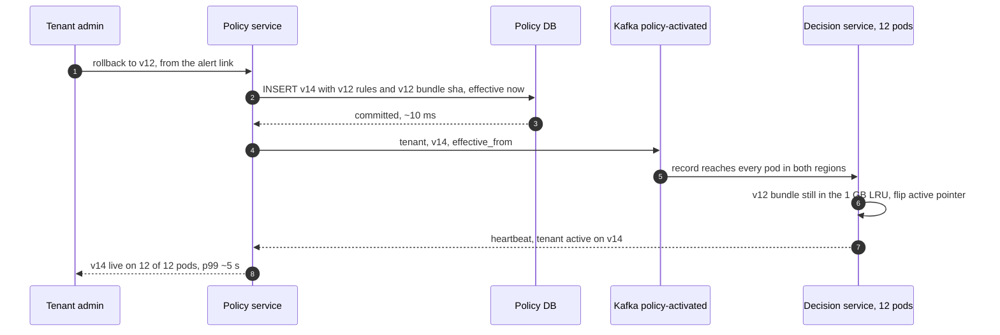
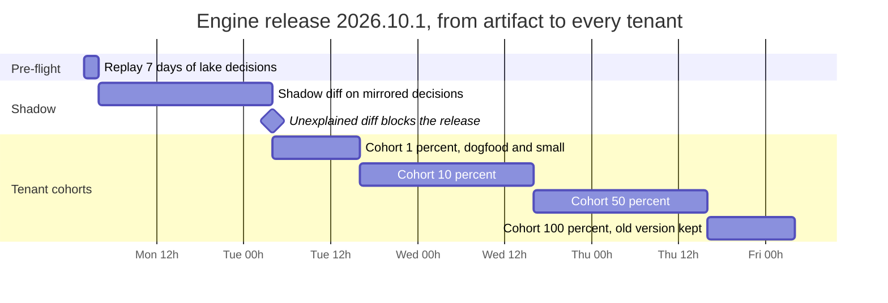

# Deep dive: safe rule changes

> One-line answer: a policy is a program the customer writes and we run on every swipe, so a publish is treated like a deploy: type-checked at save, **simulated** against 90 days of the decision lake with the same engine version (counters recomputed in time order, not read back from history), optionally **shadowed** per rule for 7 days, **effective-dated and forward-only**, rolled back in ~5 s by republishing an old bundle, and watched for 30 minutes after activation. Our own engine code goes through a stricter path: 24 h of decision diffing on mirrored traffic, then tenant cohorts 1%, 10%, 50%, 100% over 3 days with automatic rollback.

Zoom-in on [`../solution.md`](../solution.md) §5.4, §10.2 and §10.9. Reusable blocks: [`../../../concepts/stream-processing.md`](../../../concepts/stream-processing.md) (event-time replay), [`../../../concepts/columnar-db.md`](../../../concepts/columnar-db.md) (the Parquet scan), [`../../../concepts/rate-limiting-and-load-shedding.md`](../../../concepts/rate-limiting-and-load-shedding.md) (simulator quotas). Siblings: [`audit-replay-and-determinism.md`](audit-replay-and-determinism.md), [`rule-model-and-evaluation.md`](rule-model-and-evaluation.md), [`aggregates-holds-and-concurrency.md`](aggregates-holds-and-concurrency.md).

---

## 1. Four shapes of a bad change, and the layer that stops each

| Shape | Example | First layer that stops it | Backstop |
|---|---|---|---|
| Admin mistake | Means "entertainment needs approval", publishes `amount > 0 → DECLINE` for everyone | Simulation: 100% newly declined, far over the 2% guard, needs a confirm token | Shadow first; 30 min watch alerts at 3x baseline; one-click rollback |
| Runtime error | A field missing in `CAPTURE`, an overflow in a custom rule | Type-check and context check at save | `ERROR` status contributes nothing to the outcome, alerts admin and our on-call |
| New counter dimension | "$150 per employee per week on rideshare" starts from an empty counter | Backfill of the current window before the rule can enforce | Rule stays `SHADOW` until the backfill publishes the enforcing version |
| Our engine or template bug | A release changes how `>=` compares money; `category_cap` expands to `>=` instead of `>` | Offline replay plus 24 h shadow diff; unexplained diffs block | Tenant cohorts with auto-rollback on decline-rate anomaly |

The first three are one tenant's blast radius. The fourth is every tenant at once, which is why it gets the slowest path.

---

## 2. Validation at save

Runs on every `PUT .../draft/rules/{rule_id}`, in milliseconds, before anything is stored.

- **Type-check the CEL (Common Expression Language) predicate** against the declared `expense`, `employee`, `trip` and `counters` types. `amout` fails with a position.
- **Cost estimate** from the CEL checker under the per-plan limit. At runtime the limit is the same CEL cost budget, counted, never a wall-clock timeout, so a slow host cannot change a result.
- **Scope is non-empty** and resolves against current HRIS (human resources information system) attributes. A scope matching zero people is a warning; one matching the whole company with a `DECLINE` action needs a second admin (§10.10 of the solution).
- **Money is integer minor units with an ISO 4217 currency.** `75` for "$75" is caught because the template asks for `7500` and shows "$75.00" back.
- **Contexts match fields.** A rule reading `trip` cannot list `AUTH` unless it tolerates `NOT_EVALUABLE`.
- **New counter dimension flagged.** The compiler diffs the draft's counter dimensions against the active bundle. A new one means backfill (§8) and, for a company-wide key at a large tenant, a hotness estimate from history (the 100k tenant's company cap is ~23/s against a row lock that serializes at ~250/s at p50, ~10% utilization).
- **Base version recorded on the draft.** Publish is compare-and-set on `base_version`. Without it, admin B publishing a draft cut from v12 silently erases admin A's v13.

---

## 3. The simulator

```mermaid
%% Simulation of one draft. Pass 1 is pure and parallel. Pass 2 is one sequential fold per tenant because counters couple decisions.
flowchart LR
    ADM[Admin draft] -->|"simulate, draft sha"| PS[Policy service]
    PS -->|"job: tenant, 90 days,<br/>engine of tenant cohort"| SIM[Simulator pool<br/>64 cores, 2 jobs per tenant]
    LAKE[(Decision lake<br/>Parquet)] -->|"facts, lifecycle events,<br/>submits, ~4 GB projected"| SIM
    BS[(Bundle store)] -->|"current and draft bundles"| SIM
    SIM -->|"one event each, parallel"| P1[Pass 1<br/>point verdicts,<br/>counter contributions]
    P1 -->|"sorted by network time"| P2[Pass 2 fold<br/>counters recomputed<br/>for current and draft]
    P2 -->|"two outcome streams"| DIFF[Diff draft vs current]
    DIFF -->|"counts, dollars, samples"| REP[Impact report]
    REP -->|"newly declined and<br/>newly approval shares"| G{Declined over 2 percent<br/>or approval over 10?}
    G -->|"yes"| TOK[Confirm token<br/>bound to draft and base]
    G -->|"no"| PUB[Publish allowed]
    TOK -->|"admin confirms"| PUB

    class ADM client
    class PS,SIM,P1,P2,DIFF,REP,PUB service
    class LAKE,BS store
    class G,TOK decision

    classDef client   fill:#dbeafe,stroke:#2563eb,stroke-width:2px,color:#111
    classDef service  fill:#dcfce7,stroke:#16a34a,stroke-width:2px,color:#111
    classDef store    fill:#ede9fe,stroke:#7c3aed,stroke-width:2px,color:#111
    classDef decision fill:#fce7f3,stroke:#db2777,stroke-width:2px,color:#111
```



- **Input.** The tenant's last 90 days from the decision lake: every decision's facts, the lifecycle events of each authorization (capture, reversal, refund, expiry), and out-of-pocket submits. Monthly windows that started before day 90 are read from their start, so no counter begins half-empty.
- **Same engine version as production.** The one the tenant's cohort is pinned to (during an engine rollout there are two). The lake therefore receives authorizations and lifecycle events as well as decisions ([`audit-replay-and-determinism.md`](audit-replay-and-determinism.md) §7).
- **Diff two simulations, not draft vs recorded.** Recorded outcomes carry every older policy of the last 90 days, degraded decisions, and processor-side declines. Simulating the current policy under the same assumptions isolates the draft. The current-vs-recorded match rate is printed as the simulator's fidelity.
- **Counters and trip totals are recomputed, never read from facts.** The values in the facts were built by the *old* policy's approvals. If the draft would have declined a $900 swipe on March 2, every later swipe that month sees $900 less. So pass 2 recomputes counters and trip totals from lifecycle events under each policy, in network-time order, and a swipe's hold is added only if that simulation approved it.
- **Counterfactual rules, stated in the report.** Approved then, declined now: its hold, capture and refund are removed from that simulation. Declined then, approved now: assumed to capture its authorized amount, a stated fidelity limit (we cannot know the tip, or whether the employee paid another way). Changes caused only by an earlier changed decision are reported as **cascade**, separately.
- **Why pass 2 is sequential.** One authorization touches ~3 counters and its outcome is the max over all of them, so a decline on the employee counter also keeps the swipe off the department counter. Counters form one connected graph per tenant whenever any company or department key exists.

**Impact report** (the shape the UI and the publish guard read):

```text
simulation_id sim_8812, draft_sha256 9f2c..., base_version 12, engine 2026.09.2, window 90 days
fidelity: current policy re-simulated vs recorded, 99.6% of outcomes identical
delta (draft vs current)   count   spend affected   over limit
  newly DECLINE                0            $0            $0
  newly NEEDS_APPROVAL       412       $31.6k [estimate]   $6,900
  newly ALLOW_FLAGGED          0            $0            $0
  loosened (now ALLOW)         0            $0            $0
cascade 0, not evaluable on history 0 rules, top rule restaurant-60 (412 of 9,800 restaurant expenses)
top employees e_17 (9), e_203 (7); 20 sample decisions before and after
guard: newly declined 0 (limit 2%), newly needing approval 412, under the 10% limit, no confirm token
```

**The guards.** `NEEDS_APPROVAL` at `AUTH` approves the swipe and opens an approval afterwards, so a change that sends everything to approval never declines a card but floods approvers. Publish therefore needs `confirm_token` when newly declined exceeds 2% of the tenant's authorizations in the window, or newly needing approval exceeds 10% [estimate]. The token is an HMAC (keyed hash) over `(simulation_id, draft_sha256, base_version)`, valid 24 h [estimate]. Edit the draft or let another admin publish, and the token dies with the simulation.

**Cost.** Pass 1 for the largest tenant: 27 M expenses at ~20 µs, ~540 core-seconds, ~9 s on 64 cores, plus the ~4 GB scan. Rules unchanged between current and draft are evaluated once. Pass 2 folds ~60 M events (auths plus ~1.3 lifecycle events each) folded on one core at ~0.3 to 0.5 µs of hash-map arithmetic, **~20 to 30 s [estimate]**, the two folds on two cores. So ~40 s for the largest tenant, shown with a progress bar. The median tenant (~11k expenses) takes well under 1 s.

---

## 4. Shadow mode per rule

- **What it does.** `mode = SHADOW` evaluates live in every context and writes a `RuleResult` with `shadow: true` into the same `DECISION.results`. It never changes the outcome and never writes a hold. When a point rule declines first, aggregate rules (shadow or not) are `NOT_EVALUABLE` with reason `short_circuit`.
- **Counters stay well defined.** They are keyed by dimension, not by rule, and follow only the **enforced** outcome: an approved swipe holds on every dimension in the bundle, shadow rules' dimensions included, and a shadow verdict never adds or removes a hold. A shadow rule on an existing dimension reads the same rows at no extra cost. One on a new dimension makes each swipe lock one more counter: real cost from day one, and what makes its backfill possible (§8).
- **The catch: shadow over-reports aggregate violations.** Shadow cap $200 a month. A $250 swipe violates. Every later $20 swipe that month also violates, because in reality the $250 went through. Enforced, the $250 declines and the next nine pass. The report therefore counts only the **first violation per counter window** as a would-be decline, and re-runs the simulator over the shadow period for the counterfactual.
- **Where results live.** In the decision row: hot 90 days in the shard, then the lake. A stream job aggregates per `(tenant, rule_id, day)`: evaluations, would-be violations, `ERROR` and `NOT_EVALUABLE` counts, and outcome changes (outcome with shadow rules counted vs without) with dollars and sample ids.
- **Promotion is a publish.** Flipping `SHADOW` to `ENFORCE` makes a new version, so every decision names the mode it ran under. The UI suggests 7 days of shadow for any rule that can decline.

---

## 5. Effective dating and forward-only versions

- **Every publish is a new immutable version** with `effective_from`. Nothing is edited in place, so a decision's `policy_version` means the same thing in 7 years.
- **Never backdated, never decreasing.** `effective_from >= now`, and `effective_from` never decreases as the version number rises. A backdated version would rewrite what past decisions "should" have been.
- **Spend time picks the version, never the evaluator's clock.** Card: the authorization's network time picks it at `AUTH`, and `CAPTURE` and `SUBMIT` reuse the version the authorization recorded, so one card expense is judged by one version even if the swipe landed inside a publish's ~5 s propagation. Out-of-pocket: the version in force at the **start** of the expense date (the tenant's local midnight), so a same-day publish applies from the next day's expenses. A change is never retroactive and never moves under a waiting report. A future-dated version is preloaded, so it switches exactly at `effective_from`; an immediate one is live within ~5 s.
- **A trap in "max(version) where effective_from <= t".** Admin schedules v13 for Oct 1, then today publishes v14 (v12 plus a typo fix). On Oct 1 the rule picks v14, and v13 never activates. That is why `effective_from` must not decrease: at most one scheduled version per policy, and an immediate publish while one waits either cancels it or rebases it (a new scheduled version with both changes, simulated again).
- **Mid-window tightening.** Spend time protects each old expense, but a lower monthly cap on the 20th still counts the spend already in the counter against the new limit. The simulator shows it; the admin can pick "from the next window start" instead.

---

## 6. One-click rollback in ~5 s



- **Why it is fast.** Same bundle sha, so no compile, no upload, usually no object-storage GET (the LRU, least recently used cache, still holds it). No simulation: the version was enforced minutes ago. It is still audit-logged with actor and reason.
- **Under the 10 s NFR** (non-functional requirement) with room for the slowest pod. The heartbeat is what lets the admin see "rolled back" instead of hoping.
- **What rollback does not undo.** Declines already sent, holds already written. Spend made while v13 was live is still judged by v13 at capture and submit (spend time picks the version), so the rollback screen offers an audited bulk waive of v13's flags. A counter dimension only v13 used stops being maintained; rolling forward later needs a fresh backfill.
- **Static controls never hold a rollback hostage.** The normal sync order pushes a loosening to the processor first and activates after, which at the 100k-card tenant waits on 100k processor updates, minutes [estimate]. Two rules keep rollback at ~5 s. A new `DECLINE` rule the processor can express is pushed only after a 24 h [estimate] soak in our engine, so a bad new rule is never at the processor inside the window where it gets rolled back. And a rollback activates in our engine at once; its loosening push follows. Each controls sync is versioned, so an audit can say which controls a card carried at any moment.

---

## 7. The post-activation watch

- **30 minutes after every activation**, compare the tenant's decline rate with its 7-day baseline. Above **3x**, alert the tenant's admins, naming the rules behind the new declines (from `results`) with the one-click rollback link.
- **Small-tenant floor.** A 40-person company may have a baseline of zero and 10 swipes in 30 minutes. Require at least 20 declines [estimate], use `max(tenant baseline, fleet median)` as the baseline floor, count processor-side declines too (they get a `DECISION` row), and extend the watch to the first 200 authorizations when 30 minutes is too quiet [estimate].
- **No auto-revert of customer policy.** A legitimate "freeze all spend, we suspect fraud" looks exactly like the spike. An automatic revert is also a policy change nobody authored, which is poor SOX (Sarbanes-Oxley) evidence. A single tenant's spike notifies that tenant; it never pages us.
- **Our side.** Fleet-wide decline rate at 2x baseline pages the engine team: that pattern is our bug, not a customer's intent.

---

## 8. Counter backfill before enforce

- **The boundary is the policy version, not a timestamp.** Version N introduces the key and ships the rule in `SHADOW`. Every decision under N or later maintains the key live. The backfill covers exactly the window's authorizations decided under versions below N, read from the tenant's `AUTHORIZATION` and `HOLD` rows (each decision's facts carry the fields the new key needs). No swipe is counted twice or missed across the ~5 s activation.
- **It inserts `HOLD` rows for open authorizations**, not only a total, so a later capture or reversal of an old authorization can release its share on the new key.
- **Throttled and off-peak.** Batches of ~1k rows per transaction [estimate] with the auth path's lock order. A rideshare-week key at the 100k tenant is ~2 M expenses scanned and at most 100k counter rows: minutes [estimate].
- **Completion publishes version N+1** with the rule in `ENFORCE`, authored by a system actor. No hidden "counter ready" flag: the enforcing switch is a version, so replay stays a function of the version.

---

## 9. Engine releases

The engine artifact is one versioned unit: the CEL runtime, our custom functions (`in_mcc_group`, `days_between`), pinned libraries and the time-zone database. Everything else that changes an outcome is in the bundle: rules, tenant settings (degraded cap, tip buffer, auto-approve limit) and reference tables such as MCC (merchant category code) groups. Bundles hold checked ASTs (abstract syntax trees) that both the current and the previous engine version can load, so an engine rollback needs no rebuild.



- **Pre-flight replay.** 7 days of lake decisions (~217 M) through old and new engines on their original facts: ~4,300 core-seconds, ~70 s on the 64-core pool [estimate].
- **24 h shadow diff.** Because a decision is a pure function of `(bundle, engine, facts)`, the shadow engine needs no locks and no holds: it consumes the live decision stream and re-evaluates each decision's facts. It also recomputes the counter key set from the raw expense, since a window bug would otherwise hide inside facts that already hold the counters. Fact-assembly changes (MCC normalization) need a tee of the raw request instead.
- **Explained diffs only.** The release declares an expected-diff predicate ("rules using `days_between` across a daylight-saving change"). Any diff outside it blocks.
- **Cohorts by tenant.** The gateway routes by a cohort map to decision-service deployments per engine version. Cohort 1 is Rippling's own tenant plus small tenants; the largest tenants go last. Auto-rollback when a cohort's decline rate diverges from the control cohort at the same hour. Rollback is a cohort-map flip, seconds, no rebuild and no data migration.
- **Afterwards.** Decisions made by a bad release are found in the lake by `engine_version`, re-run, and wrongly flagged expenses cleared in bulk. A wrongly declined swipe cannot be undone.
- **Template bugs are policy changes.** Templates are expanded at save, so a fixed `category_cap` does not change rules already stored. Each rule stores its `template_version`; the fix re-expands every affected rule, simulates per tenant, and publishes system-authored versions, cohort by cohort.

---

## 10. Why not canary by employee, and the Griffin lesson

**Canary-by-employee is wrong for customer policy.** Two employees under one policy get different answers for the same dinner, and neither support nor an auditor can say "the policy" in one sentence. A 40-person company has no meaningful 1%. Shared counters break it too: half a department enforced against a department cap is not a cap. Simulation plus shadow give the same signal with everyone treated alike. Canaries are for **our** code, where the unit is a tenant.

**Grab Griffin** ([engineering.grab.com/griffin](https://engineering.grab.com/griffin)), an anti-fraud rules engine at "100K+ Queries per second (QPS) at peak time (on only 6 regular EC2s)", shows why the write path is the risk. A web UI took a rule change from "1 week for code change/test/deployment" to "just 1 minute", and then "Anyone can turn the whole checkpoint down, whether unintentionally or maliciously. Hence we implemented Shadow Mode and Percentage-based rollout for each rule." They also added "version control for every rule change" to "rollback to the previous version quickly", and a flow where "any prod change needs at least two people". We copy shadow per rule, versions, fast rollback and two-person changes for broad rules. We do not copy percentage rollout per rule: fine for analysts tuning fraud scores, unfair for a company's spend policy.

---

## 11. Trade-offs

| Decision | Chose | Gave up |
|---|---|---|
| Simulation baseline | Re-simulate current policy, diff with draft | Simplicity of "draft vs what happened" |
| Aggregates in simulation | Recompute counters in time order | ~20 to 30 s sequential fold at the largest tenant [estimate] |
| Shadow granularity | Per rule, results in the decision row | A few bytes per decision; aggregates over-report, fixed by first-violation counting |
| Bad customer policy | Alert with one-click rollback | Minutes of wrong declines while the admin reads the alert |
| Backfill switch | System-published version N+1 | An extra version per new dimension |
| Static controls and rollback | Push new `DECLINE` rules after a 24 h soak; rollback activates before its push | The processor's fallback layer is up to a day looser than policy for new rules |
| Our engine | Diff, then tenant cohorts over 3 days | A release takes ~4 days end to end |

---

## 12. How an interviewer attacks this

1. **"The simulation said 0% and production declined 10%."** Check the fidelity line first. Usual causes: new data shapes (a merchant type never seen in 90 days), or rules over counters the simulation seeded wrong. The watch catches it in 30 minutes and rollback takes ~5 s.
2. **"Shadow numbers look scary for the new monthly cap."** Cascade. Read first violations per window, or run the simulator over the shadow week.
3. **"Why not auto-revert when declines spike?"** The spike may be the intent (a fraud freeze), and an unauthored policy change is bad audit evidence. We auto-revert only our own code.
4. **"Two admins publish at once."** Compare-and-set on the draft's base version; the loser rebases and re-simulates. The confirm token is bound to the base too.
5. **"Your engine release changes rounding for one currency."** The 24 h diff shows every changed decision in that currency; unless the release declared it, the rollout stops before the 1% cohort.
6. **"A rule on a new counter enforces on day one?"** Not possible: it ships in shadow and only the backfill's version N+1 flips it.

---

## 13. Numbers to say out loud

- Save: type-check and cost check in milliseconds. Rule cap 10k per tenant.
- Simulation: 90 days. Largest tenant 27 M expenses: pass 1 ~540 core-seconds (~9 s on 64 cores), pass 2 a ~20 to 30 s fold [estimate], ~40 s total. Median tenant under 1 s. 2 jobs per tenant.
- Guards: newly declined over 2%, or newly needing approval over 10% [estimate], of the tenant's authorizations needs a confirm token.
- Shadow: 7 days suggested. Activation p99 5 s, except a loosening of a processor-pushed rule, which waits on the push. Rollback ~5 s (push follows), NFR under 10 s. New pushable `DECLINE` rules soak 24 h [estimate] before the push.
- Watch: 30 minutes, alert at 3x the 7-day baseline, at least 20 declines [estimate], fleet-median floor, tenant notification only. Fleet 2x pages us.
- Engine: 24 h shadow diff, then 1%, 10%, 50%, 100% of tenants over 3 days, auto-rollback.
- Griffin: 1 week to 1 minute per rule change, then shadow and percentage rollout per rule.
