# Diagrams: expense / corporate card rules engine

> One-line answer: twelve views of one design. A synchronous auth path (gateway, decision service, tenant-sharded Postgres counters with holds) answers a swipe in ~15 ms p50. An asynchronous path (Kafka, settlement consumer, expense service, Temporal) settles, re-checks and reimburses. A control plane (policy service, simulator, bundle store) turns rules into immutable bundles. The spend-control DB is the one red box.

The D1 to D12 set from `hld/CLAUDE.md` §4, each with a one-line caption. A diagram already in [`solution.md`](solution.md) gets a heading, a caption and a link, never a second copy. Acronyms: HRIS (human resources information system), CEL (Common Expression Language), AZ (availability zone), CDC (change data capture), ACH (automated clearing house), MCC (merchant category code), LRU (least recently used), WAL (write-ahead log), RPC (remote procedure call).

| # | Diagram | Where it lives |
|---|---|---|
| D1 | Context | below |
| D2 | Data flow | below |
| D3 | Component architecture (final design) | [solution §6](solution.md#6-final-design-and-the-six-core-flows) |
| D4 | Happy path per FR | FR1 publish a rule: below. FR2 evaluate a SUBMIT: below. FR3 authorize: [solution Flow 1](solution.md#flow-1-a-62-lunch-is-approved-about-15-ms) (capture: [Flow 3](solution.md#flow-3-the-dinner-captures-at-84-with-the-tip)). FR4 reimburse: [solution Flow 5](solution.md#flow-5-a-reimbursement-from-submit-to-payout) |
| D5 | Failure paths | Auth redelivered after a gateway death, consumer crash between commits, service unreachable: below. Two swipes race: [solution Flow 2](solution.md#flow-2-two-swipes-race-for-the-last-20-of-a-counter). Cluster failover: [solution §10.4](solution.md#104-failure-timeline) |
| D6 | Decision flow | Gateway fallback: [solution §5.3](solution.md#53-keep-cards-working-when-parts-fail-fallback-layers). Engine evaluation algorithm: below |
| D7 | Entity relationship | [solution §3.3](solution.md#33-data-model) |
| D8 | State machines | Hold: [solution §5.2](solution.md#52-two-swipes-can-never-both-break-a-limit-aggregates-holds-and-concurrency). Expense report and rule version: below |
| D9 | Deployment / topology | below |
| D10 | Scaling / partitioning | below |
| D11 | Failure mode map | below, two trees |
| D12 | Rollout / migration | below |

## D1. Context (zoom-out)

Our system as one box: people write policy and expenses, the processor asks for decisions, HRIS and travel supply facts, payroll pays, auditors read.

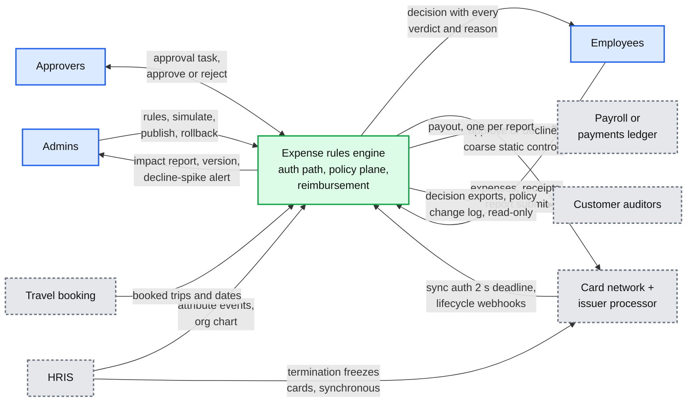

## D2. Data flow (DFD)

Inputs to outputs with format, size and rate. Peak rates unless marked per day.

```mermaid
%% D2: data flow. Processes are rounded, stores are cylinders. Numbers from solution 1.2 and 2 and the editor's volumes, except the attribute rate, marked estimate.
flowchart LR
    PROC[Issuer processor]:::external -->|"auth request, JSON ~1 KB,<br/>1.2k/s peak, 2k/s design"| AD(Auth gateway +<br/>decision service):::service
    AD -->|"approve or decline,<br/>JSON ~20 B body, p99 50 ms"| PROC
    HRIS[HRIS]:::external -->|"attribute event, JSON ~1 KB,<br/>under 10/s, estimate"| ECS[(Employee context<br/>Redis, 3 GB)]:::cache
    ECS -->|"attributes ~1 KB,<br/>60 s local cache"| AD
    BS[(Policy DB +<br/>bundle store, ~2 GB)]:::store -->|"bundle, 40 KB median, 5 MB max,<br/>on activation or LRU miss"| AD
    AD -->|"counter txn, 3 locks + holds +<br/>AUTH decision 1.5 KB, 2k txn/s"| SDB[(Spend-control DB<br/>16 logical shards)]:::store
    PROC -->|"lifecycle webhook, JSON ~2 KB,<br/>13 M/day, 1.5k/s"| K[[Kafka card-events<br/>64 partitions, 26 GB/day]]:::queue
    K -->|"events keyed by card_id"| SC(Settlement consumer):::service
    SC -->|"hold to spend + CAPTURE<br/>decision, 10 M/day"| SDB
    SC -->|"expense outbox rows,<br/>10 M/day"| ES(Expense service +<br/>expense DB + workflow):::service
    EMP[Employee app]:::client -->|"expense JSON + receipt, 1 M/day<br/>in ~330k reports, 360/s month-end"| ES
    ES -->|"evaluate SUBMIT, trip total<br/>as a fact, 11 M/day"| AD
    ADM[Admin]:::client -->|"draft rule, envelope + CEL,<br/>~1 KB compiled, few per week"| PS(Policy service +<br/>simulator):::service
    PS -->|"bundle by SHA-256"| BS
    SDB -->|"CDC, AUTH + CAPTURE decisions 20 M/day,<br/>auths, lifecycle events, processor declines"| LAKE[(Decision lake, 31 M/day<br/>46.5 GB raw, ~9 GB Parquet)]:::store
    ES -->|"second CDC stream,<br/>SUBMIT decisions 11 M/day"| LAKE
    LAKE -->|"90 days of columns,<br/>up to ~4 GB per simulation"| PS
    ES -->|"payroll line or ACH,<br/>~330k reports/day"| PAY[Payroll or<br/>payments ledger]:::external
    classDef client   fill:#dbeafe,stroke:#2563eb,stroke-width:2px,color:#111
    classDef service  fill:#dcfce7,stroke:#16a34a,stroke-width:2px,color:#111
    classDef store    fill:#ede9fe,stroke:#7c3aed,stroke-width:2px,color:#111
    classDef cache    fill:#fef3c7,stroke:#d97706,stroke-width:2px,color:#111
    classDef queue    fill:#cffafe,stroke:#0891b2,stroke-width:2px,color:#111
    classDef external fill:#e5e7eb,stroke:#6b7280,stroke-width:2px,color:#111,stroke-dasharray:4 3
```

- 31 M decisions/day = 10 M AUTH + 10 M CAPTURE + 11 M SUBMIT, ~1.5 KB each. SUBMIT decisions live in the expense DB (same schema), so the lake has two CDC streams. It also takes authorizations and lifecycle events, because the simulator recomputes counters from them under each policy.

## D3. Component architecture

The final design, spend-control DB in red. Embedded once in [solution §6](solution.md#6-final-design-and-the-six-core-flows).

## D4. Happy paths, one per FR

FR3 authorize: [solution Flow 1](solution.md#flow-1-a-62-lunch-is-approved-about-15-ms), capture in [Flow 3](solution.md#flow-3-the-dinner-captures-at-84-with-the-tip). FR4 reimburse to payout: [Flow 5](solution.md#flow-5-a-reimbursement-from-submit-to-payout). FR1 and FR2 are new below.

### D4 FR1. An admin publishes a tightened rule

Save type-checks, simulation diffs 90 days (~40 s for the largest tenant, under 1 s for a median one), publish compiles an immutable bundle, and every evaluator flips to it inside ~5 s p99.

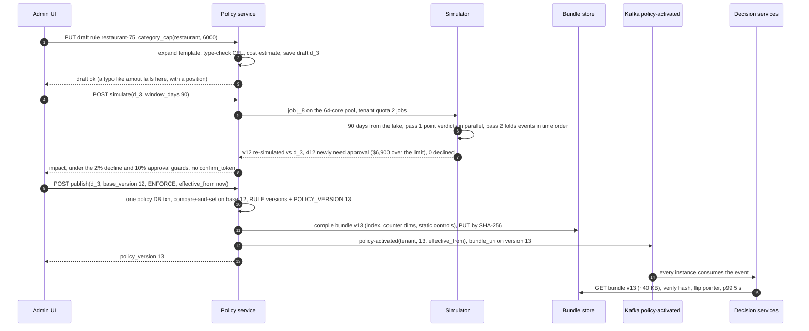

- Versions follow spend time, never submit time. A card expense reuses the version on its AUTHORIZATION at CAPTURE and SUBMIT; an out-of-pocket expense uses the version in force at the start of its date, so this same-day publish applies to out-of-pocket spend from tomorrow.
- Nothing is pushed to the processor here: static controls carry only ENFORCE DECLINE rules the processor can express, and a new one is pushed only after a 24 h soak [estimate]. A rollback activates here in ~5 s and its loosening push follows.

### D4 FR2. Evaluate a SUBMIT expense and explain it

The $92 dinner on trip t_88 from solution §4.2, in the final design: the expense service locks the trip and passes its total as a fact, the index narrows, every verdict comes back with numbers.

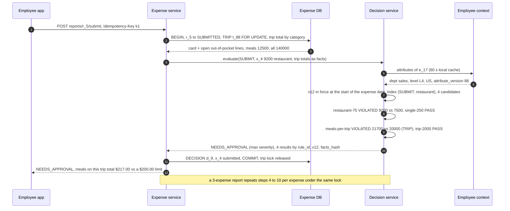

## D5. Failure paths

Already in solution.md: the concurrency race ([Flow 2](solution.md#flow-2-two-swipes-race-for-the-last-20-of-a-counter)) and the cluster failover ([§10.4](solution.md#104-failure-timeline)). Three new ones below.

### D5a. The same authorization arrives twice after a gateway pod died mid-request

The counter transaction committed, the answer was lost, and the retry's first INSERT hits the claim key and returns the stored result. Never a second hold.

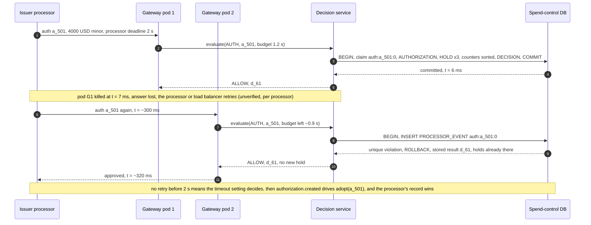

- `PROCESSOR_EVENT(tenant_id, event_key)` is claimed by the first INSERT, with no separate "not seen" read. A duplicate that arrives while the first transaction is open waits on the unique index, then returns the stored result. Increments claim `auth:a_501:1` to `n`; declines are recorded the same way, so a retried decline never flips.
- The processor's recorded outcome is final. Its `authorization.created` and `authorization.updated` events go through adopt, which adds or releases holds wherever our record disagrees, and marks an orphaned decision `superseded`.

### D5b. The settlement consumer dies between the DB commit and the Kafka offset commit

The replay hits the claim key and is a no-op. The expense row travels in an outbox row committed with the capture, so the crash cannot lose it.

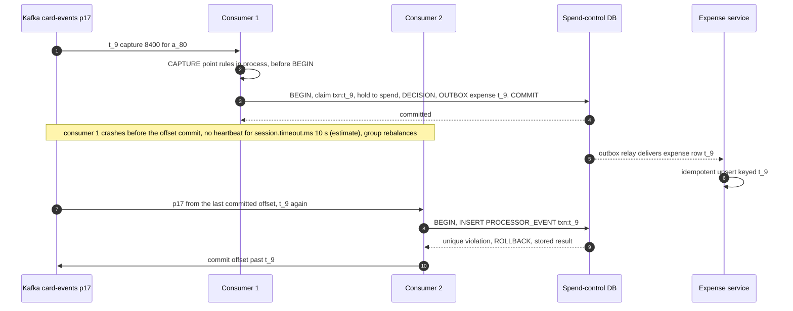

- Solution Flow 3 used to call the expense service after the commit, so a crash in between lost the expense. The outbox closes that window, and the expense service dedups on the transaction id.

### D5c. The whole service is unreachable from the processor

Static controls still bound every swipe, the timeout setting approves at 2 s, and the queued `authorization.created` webhooks adopt those approvals when the path returns.

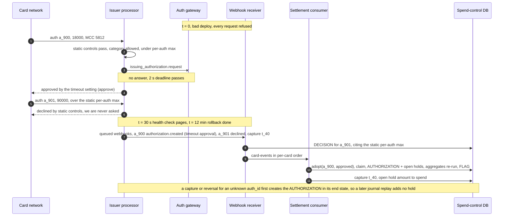

- One idempotent `adopt(auth_id, state)` covers every authorization we did not decide: degraded journal entries, timeout approvals, Commando Mode, network STIP (stand-in processing). It never re-decides. `authorization.updated` (a reversal, an expiry) goes through the same path. Waiting for force capture instead would leave an open hotel authorization invisible to limits for days.

## D6. Activity / decision flow

The gateway's healthy-or-fallback decision is in [solution §5.3](solution.md#53-keep-cards-working-when-parts-fail-fallback-layers). Below: the engine's evaluation algorithm inside the decision service, per call.

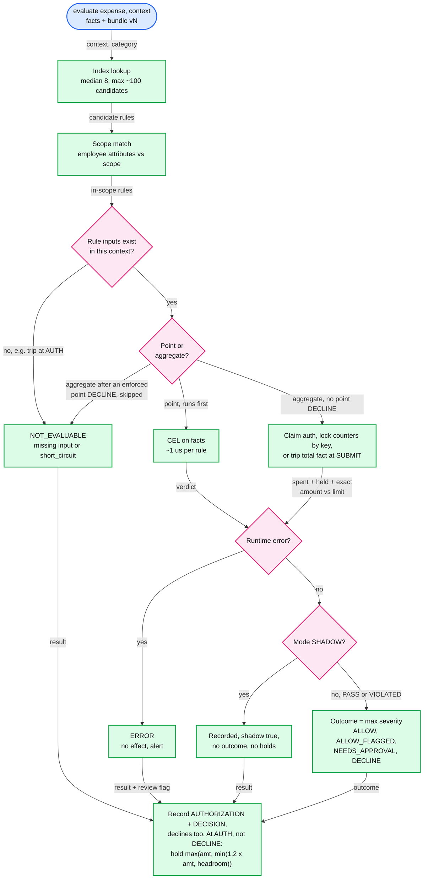

- A lock or statement timeout on G is not an `ERROR`. The decision service returns the point-rule verdicts marked "store unavailable" and the gateway falls back (solution §5.3). The tip buffer only sizes the hold, so it never causes a decline. At AUTH only `DECLINE` answers `approved: false`. `NEEDS_APPROVAL` approves the swipe and opens an approval on the expense afterwards: the money moves first.

## D7. Entity relationship

POLICY_VERSION, RULE, COUNTER, HOLD, AUTHORIZATION, DECISION, EXPENSE, TRIP, REPORT, APPROVAL_TASK and PAYOUT, with keys and the DB each lives in: [solution §3.3](solution.md#33-data-model).

## D8. State machines

The hold lifecycle (Held, PartlyCaptured, Captured, Released, Refunded) is in [solution §5.2](solution.md#52-two-swipes-can-never-both-break-a-limit-aggregates-holds-and-concurrency). Two new ones below.

### D8a. Expense report

No state pins a policy version: a card expense reuses its authorization's version, an out-of-pocket one uses the version in force at the start of its date. Money owed to the employee always runs a workflow.

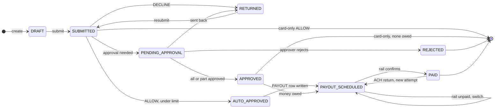

- Auto-approve needs `ALLOW` and a total at or under the tenant's limit ($250 default [estimate]). Anything else (`NEEDS_APPROVAL`, a flag, a total over the limit) goes to PENDING_APPROVAL, and finance approves above $1,000 whatever the outcome. The workflow (id = report id) stays open through RETURNED.
- A partial approval approves the kept lines and moves the returned lines to a child report (`parent_report_id`) with its own workflow and payout. The `PAYOUT` row is written with its rail before any call, and the rail switches only after the first one confirms it did not pay. An ACH return re-pays as a new `PAYOUT_ATTEMPT` under the same `PAYOUT` row.

### D8b. Rule version

Versions are immutable: an edit after publish is a new version and the old one is superseded. A new counter dimension stays in Shadow until its backfill completes.

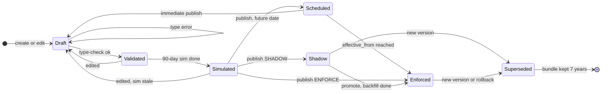

- Publish is compare-and-set on `base_version`, and `effective_from` never decreases as versions rise; there is no backdating. An immediate publish cancels the scheduled version or rebases it, which sends it back through simulation.

## D9. Deployment / topology

Two regions, three AZs each. Cluster 1 is drawn in full: a primary, two synchronous standby candidates in the other two AZs, one async replica in the other region. Clusters 2 to 4 have the same shape, primaries split between regions.

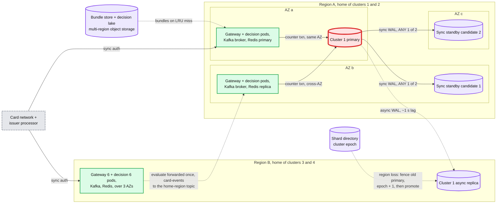

- 4 instances per cluster, 16 in all. With one sync candidate, losing it would stop every commit; with `ANY 1 (standby_az2, standby_az3)` either one acks. Pods from solution §10.3: gateway 6 and decision service 6 per region, each region sized for the full 2k/s alone.
- **Crosses a region:** async WAL (RPO, recovery point objective, ~1 s of data; the degraded window is minutes), `policy-activated` and bundles, CDC to the lake, an auth for a tenant homed elsewhere (forwarded once as one RPC, never a remote multi-statement transaction), and card-events produced to the home region's topic. After promotion, only authorizations and transactions changed since the replica's last applied time minus a margin are re-synced from the processor, diffed both ways; decisions lost in the RPO window are rebuilt from processor records and marked `facts_lost`.

## D10. Scaling / partitioning

Tenant to logical shard to cluster. The directory lets one tenant move alone. Red is one row, not a shard.

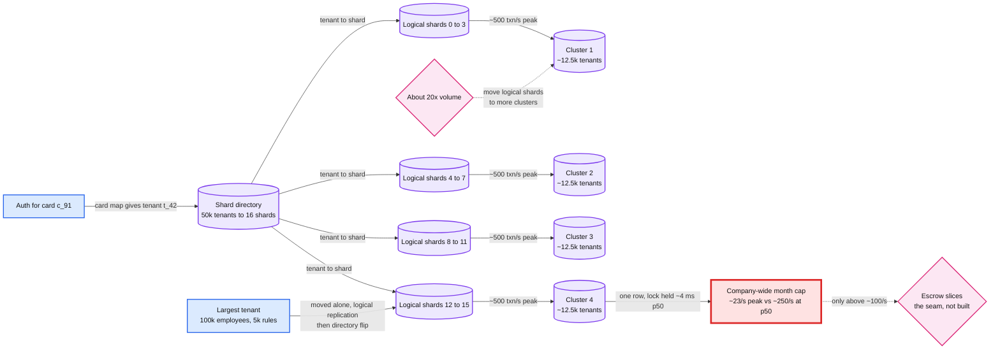

- Per cluster: ~12.5k tenants, ~500 txn/s at peak. Per logical shard: counters ~0.4 GB, holds ~0.06 GB, hot AUTH and CAPTURE decisions ~170 GB. The lock is held from `SELECT ... FOR UPDATE` to `COMMIT` (two round trips plus the synchronous commit), so the hottest row runs at ~10% utilization. Escrow (O'Neil 1986) spends local slices of the remaining budget; at 23/s it buys nothing. See [`../../concepts/sharding.md`](../../concepts/sharding.md).

## D11. Failure mode map

Component, what fails, blast radius, mitigation. Split in two to stay under 15 nodes each. Not drawn: a gateway or decision pod dying costs only its in-flight requests, retried idempotently (D5a); losing one sync standby costs nothing, the other candidate acks. If the decision service itself is unreachable, the gateway uses each card's cached static controls plus the degraded cap.

### D11a. Auth path

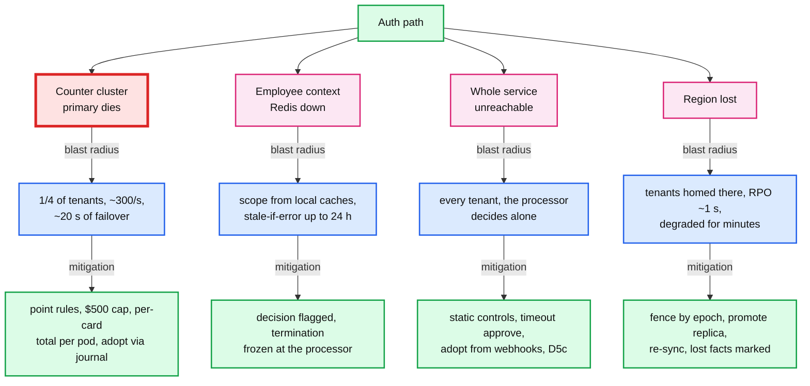

### D11b. Async path and control plane

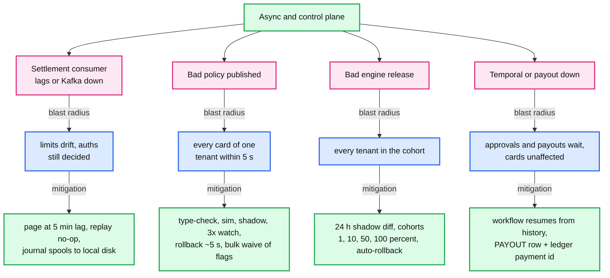

## D12. Rollout / migration

From policy checks inside the monolith to this design, the five phases of [solution §8](solution.md#8-staff-level-notes). Counters are backfilled before the shadow starts, so aggregate diffs are real from its first day. Each milestone is that phase's rollback point. Durations are estimates. In phase 4, static controls go live before the timeout setting flips to approve, or an outage approves without any bound.

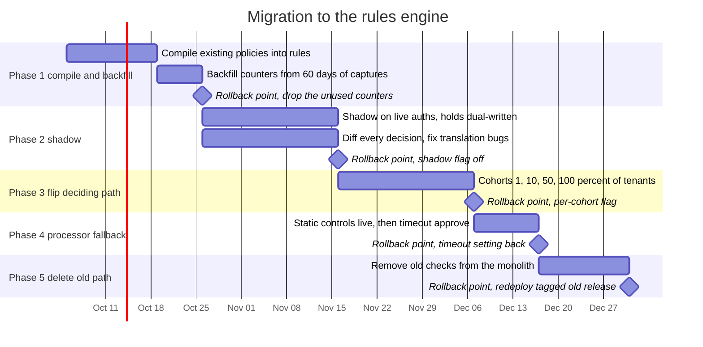
