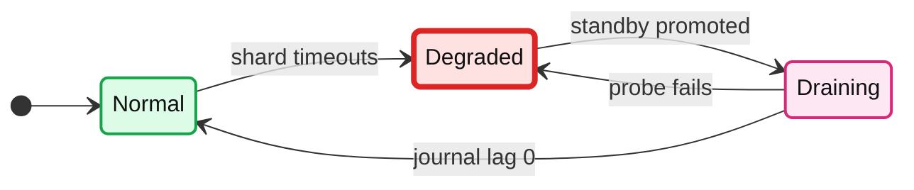
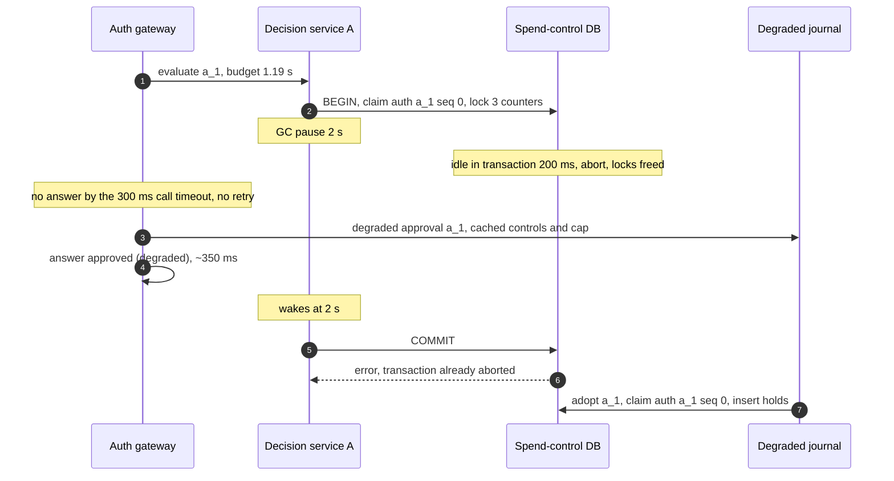
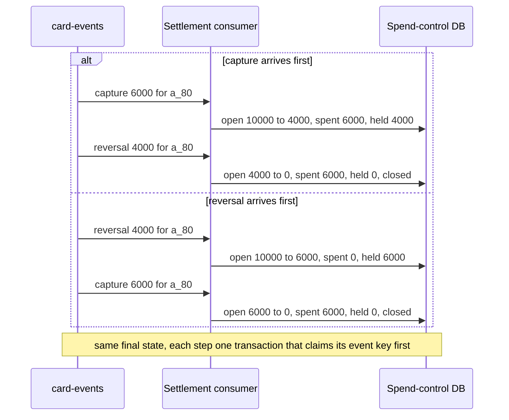
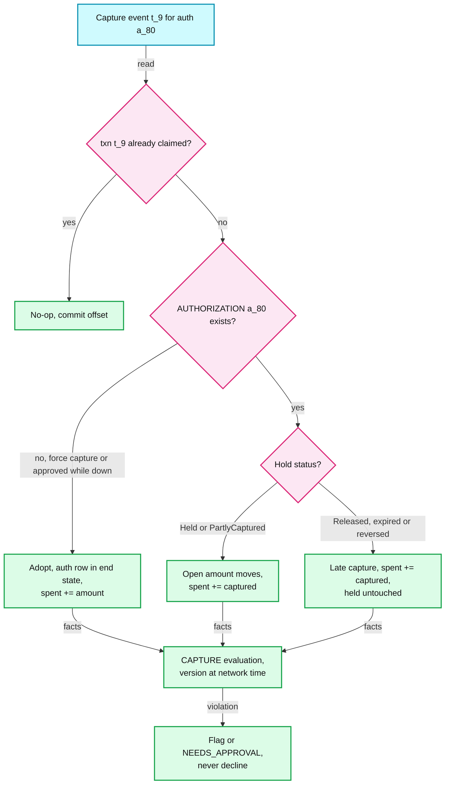
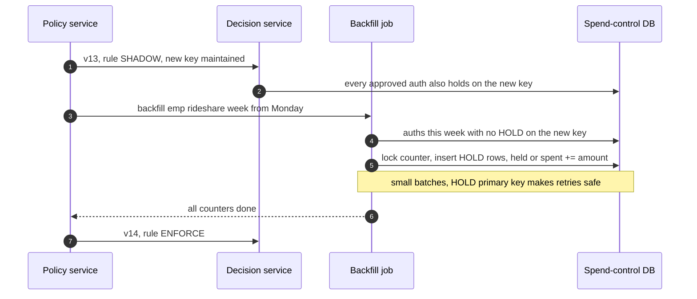

# Edge cases: expense / corporate card rules engine

Every entry answerable in under 60 seconds out loud. Categories: failure, consistency, scale, data, operations, security / abuse. Design reference: [`solution.md`](solution.md). An answer bullet that starts with **Decision:** goes past what solution.md states. Card facts are from Stripe's [authorizations](https://docs.stripe.com/issuing/purchases/authorizations), [transactions](https://docs.stripe.com/issuing/purchases/transactions), [spending controls](https://docs.stripe.com/issuing/controls/spending-controls) and [real-time authorizations](https://docs.stripe.com/issuing/controls/real-time-authorizations) pages.

---

## Failure
## Edge case: a counter cluster primary dies at lunch peak
- **Trigger:** the primary of one of the 4 spend-control clusters dies at ~1.2k auths/s. That cluster holds 4 logical shards, ~12.5k tenants and a quarter of traffic.
- **Symptom:** ~300 auths/s hit `lock_timeout` 100 ms or `statement_timeout` 300 ms. Degraded decisions above 1% for 1 minute pages. Employees notice nothing unless a swipe is over the $500 degraded cap.
- **Answer:**
  - Fallback by ~350 ms: the decision service returns point-rule verdicts with "store unavailable", and the gateway approves under the tenant's degraded cap and a per-card degraded running total ($1,000 per pod [estimate]), writes the degraded journal, marks `degraded: true`. A breaker opens after 5 failures. ~20 s × 300/s = ~6,000 capped approvals instead of ~6,000 false declines.
  - The shard directory's epoch fences the old primary, then one of two synchronous standby candidates in the other AZs (availability zones) is promoted at ~20 s with RPO (recovery point objective) 0. With one candidate, losing it would stop every commit. Journal entries are adopted: holds inserted, never re-decided, aggregates re-run, breaches flagged.
  - **Decision:** the cluster stays on the fallback path until its tenants' journal backlog is adopted (Draining below). If full decisions resumed at ~20 s while the journal drained until ~60 s, for ~40 s they would read counters missing up to ~6,000 holds and approve past limits without `degraded: true`. Drain first and unthrottled: while the cluster is Draining no live swipe locks its rows, so the ~200 writes/s catch-up throttle can lift, and ~6,000 entries at ~4 ms on 16 workers take ~2 s [estimate]. See [`deep-dives/degraded-modes-and-region-loss.md`](deep-dives/degraded-modes-and-region-loss.md).
- **Diagram:**

- **Confidence:** [ ] shaky  [ ] ok  [ ] confident

## Edge case: the employee-context Redis is down
- **Trigger:** the Redis projection (one hash per employee, ~3 GB, fed by HRIS (human resources information system) events) loses its primary, or the network to it flaps.
- **Symptom:** attribute and card-map reads fail. Scope matching needs department and level, and the department counter key needs the department.
- **Answer:**
  - The 60 s local cache covers less than it sounds. A card swipes ~3.3 times a day, spread over ~12 decision-service pods (6 per region), so most swipes miss it. "Stale attributes for up to 60 s" overstates the cover.
  - The card map (card to tenant, employee, program, status; 3 M rows, ~300 MB [estimate]) and the shard directory are full in-memory copies in every pod, not caches, so every pod still finds the tenant and its shard. The attribute cache is stale-if-error for up to 24 h [estimate], with the decision flagged, but only for employees that pod has already seen. See [`../../concepts/caching-patterns.md`](../../concepts/caching-patterns.md).
  - A true miss takes the fallback path (point rules whose scope resolves, degraded cap, journal); adoption resolves counter keys once Redis is back. Termination stays safe because offboarding freezes cards at the processor synchronously.
- **Confidence:** [ ] shaky  [ ] ok  [ ] confident

## Edge case: Kafka is down
- **Trigger:** the shared Kafka cluster that carries `card-events`, `policy-activated` and the degraded journal is unavailable for 30 minutes.
- **Symptom:** the webhook receiver cannot produce. Captures, reversals and refunds stop reaching counters; a policy published now does not activate. Auth answers are unaffected.
- **Answer:**
  - The receiver answers non-2xx so the processor keeps and retries the event (Marqeta stores unsent webhooks for later transmission). Page on receiver produce errors, because consumer lag cannot be measured. Limits drift both ways: unapplied reversals and expiries keep holds (more declines, the common case); unapplied over-captures leave counters low. Both converge on replay, exactly once through the `PROCESSOR_EVENT` claim.
  - **Decision:** evaluators also poll the policy DB for the active version of recently active tenants every 30 s [estimate], so activation and rollback slow to ~30 s instead of stopping.
  - If a counter shard fails at the same time, the gateway spools the degraded journal to local disk. The processor's authorization webhook is the backstop, so a lost spool delays adoption; it does not lose the record.
- **Confidence:** [ ] shaky  [ ] ok  [ ] confident

## Edge case: the processor cannot reach us at all
- **Trigger:** a bad gateway deploy or a network cut between the processor and both our regions.
- **Symptom:** Stripe gets no answer within 2 s and applies the timeout setting; the authorization records `request_history.reason = webhook_timeout`. Processor timeouts above 0.1% for 2 minutes pages.
- **Answer:**
  - Layer 1 still runs: per-card static controls "run before real-time authorisations" (only `ENFORCE` and `DECLINE` rules at `AUTH` that the processor can express), and the timeout setting is approve, so cards keep working within those bounds.
  - When the path is back, the processor's `authorization.created` and `authorization.updated` events go through the same idempotent `adopt(auth_id, state)` as the journal, because the processor's recorded outcome is final. Approvals made without us (timeout, Marqeta Commando Mode, network stand-in processing) get their `AUTHORIZATION` and open holds, never re-decided; aggregates re-run and flag breaches.
  - "Never stricter than the policy" has a trap: Stripe's date-based intervals start at midnight UTC (Coordinated Universal Time), ours at the tenant's midnight. One UTC month overlaps at most two local months, so monthly ceilings go out as 2x the policy limit, and per-auth caps get an FX (foreign exchange) margin.
- **Confidence:** [ ] shaky  [ ] ok  [ ] confident

## Edge case: a region is lost
- **Trigger:** the region that holds the primaries of some spend-control clusters goes dark.
- **Symptom:** those tenants lose their primary and both in-region standbys. Gateways in the other region keep answering (active-active); a non-home gateway forwards the evaluate call once to the tenant's home region, which fails, so those tenants get fallback decisions.
- **Answer:**
  - Fence the old primary through the shard directory's epoch, then promote the asynchronous cross-region replica. RPO is ~1 s of data; the degraded window is the RTO (recovery time objective), minutes. Different numbers. See [`../../concepts/leases-fencing-clocks.md`](../../concepts/leases-fencing-clocks.md).
  - Re-sync lists the authorizations and transactions that changed since the replica's last applied time minus a margin, not all ~6 M open holds, and diffs both ways: adopt what we lack, release what the processor closed. Nightly reconciliation catches the rest.
  - Decisions lost in the ~1 s window are rebuilt from processor records and marked `facts_lost`. **Decision:** the 100% replay SLO (service level objective) excludes `facts_lost` rows by name and reports their count.
- **Confidence:** [ ] shaky  [ ] ok  [ ] confident

## Edge case: a decision service instance pauses for garbage collection mid-transaction, holding row locks
- **Trigger:** a 2 s GC (garbage collection) pause after `SELECT ... FOR UPDATE` on three counters and before `COMMIT`.
- **Symptom:** every other swipe on those counters (same card, employee or department) queues on the row locks. The paused request's gateway budget runs down.
- **Answer:**
  - Other swipes on those rows hit `lock_timeout` 100 ms and fall back one by one; the cluster breaker ignores `lock_timeout`, so one stuck row never degrades a quarter of tenants. The paused request gets no answer within the gateway's call timeout (~300 ms [estimate]). The gateway does not retry, because A may already hold locks, and answers from the fallback.
  - The gap: `statement_timeout` does not fire while the client sits between statements, so Postgres keeps the locks for the whole pause. **Decision:** set `idle_in_transaction_session_timeout` to 200 ms [estimate]; Postgres aborts the transaction and frees the locks.
  - The journal later adopts a_1 (claim `auth:a_1:0`, holds). If A's commit lands first anyway, the processor's recorded outcome is final: adopt sets the `AUTHORIZATION` to it, marks A's decision `superseded`, and moves a counter only if its hold insert inserted (`RETURNING`).
- **Diagram:**

- **Confidence:** [ ] shaky  [ ] ok  [ ] confident

---

## Consistency
## Edge case: two swipes race for the last $20
- **Trigger:** `emp:e_17:cat:meals:month` is at spent 16000 plus held 2000 against a 20000 limit. Two $15 swipes land 3 ms apart (the employee's card and a colleague's on a shared cap).
- **Symptom:** a `SUM` at decision time, or Redis `INCRBY` after approving, lets both pass: $210 on a $200 cap.
- **Answer:**
  - One transaction per authorization on the tenant's shard: `SELECT ... FOR UPDATE` the counter rows, evaluate on `spent + held + amount`, add the hold, commit. Swipe B waits ~2 ms on the lock, sees A's hold (held 3500), and declines with observed 21000 vs limit 20000.
  - Counter rows are locked in sorted key order (missing rows upserted in that order before `BEGIN`), so two swipes touching overlapping sets cannot deadlock. See [`../../concepts/mvcc-and-isolation.md`](../../concepts/mvcc-and-isolation.md).
  - Pessimistic, not optimistic: conflicts on shared counters are expected, and a retry loop under a 1.2 s deadline is worse than a 2 ms wait. Not Redis: asynchronous replication can lose an acknowledged increment on failover.
- **Diagram:** `solution.md` §6 Flow 2.
- **Confidence:** [ ] shaky  [ ] ok  [ ] confident

## Edge case: the same authorization is delivered twice
- **Trigger:** the processor retries after our answer was lost, or a failover replays the request. Sometimes both copies are in flight at once on two gateway pods.
- **Symptom:** without dedup, two holds for one purchase and possibly two different answers.
- **Answer:**
  - Sequential copy: the first insert of the transaction claims `auth:{auth_id}:0` in `PROCESSOR_EVENT`; a duplicate finds the claim and returns the stored result. Declines are stored too, point-rule declines included, so a retried decline never flips. Incremental authorizations claim `auth:{auth_id}:{seq}`. See [`../../concepts/exactly-once.md`](../../concepts/exactly-once.md).
  - Concurrent copy: the second claim blocks on the first one's uncommitted key, then gets a conflict, rolls back, and returns the first copy's result.
  - Across a degraded period there is no row yet, and the per-pod running total makes the fallback depend on the pod. **Decision:** each gateway pod remembers its degraded answers by `auth_id` for the degraded window, so a retry on the same pod gets the same answer and is not counted twice. Adopt dedups by `auth_id`, and the processor's recorded outcome is final, so its authorization events settle a cross-pod disagreement.
- **Confidence:** [ ] shaky  [ ] ok  [ ] confident

## Edge case: a reversal and a capture for one card arrive out of order
- **Trigger:** a $100 authorization is partly captured ($60) and the rest reversed ($40). Webhook deliveries retry independently, so the receiver can see the reversal first [unverified: processors generally do not promise webhook order].
- **Symptom:** Kafka keeps one card's events in **arrival** order, not the processor's event order. Applying fixed deltas in arrival order would release the whole hold on the reversal, then subtract a hold that is already gone.
- **Answer:**
  - Every event moves the `HOLD` row's open amount, never below 0: a reversal releases what is still open, a capture moves what it captured to `spent`, and a capture that finds the hold `Released` adds to `spent` without touching `held`. Each event first claims its `PROCESSOR_EVENT` key (`txn:{id}` or `rev:{id}`).
  - Either order ends at spent 6000, held 0 (diagram). **Decision:** terminal states are sticky; a status update older than the auth's last applied event (by the processor's object timestamp) is ignored.
  - `card_id` partitioning puts one card's events on one consumer, and the lock order (claim, `AUTHORIZATION`, `HOLD`, counters) serializes two events for the same auth even if they ever run concurrently.
- **Diagram:**

- **Confidence:** [ ] shaky  [ ] ok  [ ] confident

## Edge case: a capture arrives with no open hold
- **Trigger:** (a) a force capture with no authorization, such as an offline in-flight purchase; (b) an authorization approved while we were unreachable (timeout setting, or the network's STIP, stand-in processing); (c) a merchant captures after the authorization expired and our hold was released.
- **Symptom:** the settlement consumer finds no `AUTHORIZATION`, or a hold already `Released`. Stripe: captures for approved authorizations "always succeed", and an expired authorization keeps "any remaining amount authorized for possible late captures".
- **Answer:**
  - Count it, never reject it. Unknown `auth_id`: adopt creates the `AUTHORIZATION` in its end state (captured), counter keys from the facts at network time, `spent += amount`. Released hold: `spent += amount`, `held` untouched, so `held` never goes negative. The hold state machine needs this `Released` to `Captured` edge.
  - Then a `CAPTURE` evaluation, in process in the settlement consumer, under the version in force at the network time. A violation becomes a flag or `NEEDS_APPROVAL`, never a decline.
  - The end-state row matters: a degraded-journal replay that arrives later sees the auth closed and adds no hold. Otherwise that hold would sit on the counter until the expiry sweeper.
- **Diagram:**

- **Confidence:** [ ] shaky  [ ] ok  [ ] confident

## Edge case: a policy changes after the money is spent (before capture, or while a report waits)
- **Trigger:** v13 tightens restaurants to $60 two days after a $70 dinner authorized under v12, before it captures. Separately, a report waits a week for approval while v13 and v14 publish.
- **Symptom:** which version judges each evaluation? The wrong answer flags purchases that were compliant when made, or moves the goalposts under an approver.
- **Answer:**
  - Spend time decides. A card expense is judged by the version in force at the authorization's network transaction time, for `AUTH`, `CAPTURE` and `SUBMIT` alike; an out-of-pocket expense by the version in force at the start of its expense date (the tenant's local midnight), so a same-day publish applies from the next day's expenses. A report pins nothing; each decision records its own version. A waiting report never changes, and a resubmit after `RETURNED` keeps its versions. Approval routing uses the org chart at routing time.
  - `CAPTURE` and `SUBMIT` of a card expense reuse the `policy_version` recorded on the `AUTHORIZATION` and never re-derive it, so the ~5 s activation lag cannot make two versions judge one card expense. `effective_from` never decreases as versions rise, and nothing is backdated.
  - Backdating guard: an expense date that disagrees with the receipt date (from OCR, optical character recognition) is flagged, and expenses older than 90 days [estimate] at submit are flagged.
- **Confidence:** [ ] shaky  [ ] ok  [ ] confident

## Edge case: two reports on the same trip are submitted at once
- **Trigger:** trip t_88 has "meals at most $200". Two reports with $120 of meals each are submitted from two devices within milliseconds.
- **Symptom:** each report alone passes; together they are $240.
- **Answer:**
  - `SUBMIT` is authoritative for trip totals. The expense service locks the `TRIP` row `FOR UPDATE`, reads the total (card expenses assigned to the trip plus out-of-pocket lines in reports that are not rejected) and passes it to the decision service as a fact. The decision service never queries the expense DB.
  - The lock is held until the submit commits, so whichever report goes second reads a total that includes the first one's lines and gets the trip-level violation (`level: TRIP`, observed 24000 vs limit 20000). Every path that attaches an expense to a trip (a capture on a booked trip, a re-assignment) takes the `TRIP` row `FOR SHARE`, so it serializes with a submit.
  - **Decision:** if a report on the trip is later rejected, open reports on the same trip get a re-evaluation signal, so an approver never acts on a trip violation that no longer exists. The `trip:*` counter at `AUTH` is only an early best-effort check on card spend.
- **Confidence:** [ ] shaky  [ ] ok  [ ] confident

## Edge case: a refund cannot be linked to its purchase
- **Trigger:** the merchant credits the card instead of refunding the authorization. Stripe calls linking "an inexact science": a refund can arrive with no authorization, or linked to an unrelated one.
- **Symptom:** which counter gets the money back? Crediting the current window opens a loophole: buy $3,000 on September 30, spend $3,000 in October, return the September purchase, and October has room for another $3,000.
- **Answer:**
  - An unlinked refund **credits nothing until it is matched** (same card, same network merchant id, amount at most one capture's unrefunded part). Crediting the current window, even floored at 0, would keep the loophole above: October only drops to 0 and gains $3,000 of room.
  - Once matched, the credit goes to the purchase's own window. Matching runs within minutes [estimate], so the employee waits minutes for the room, never gains room they should not have. No match after 7 days [estimate] goes to finance.
  - Every credit is capped by the matched capture's unrefunded amount, which also bounds a wrong link. A refund reversal (a negative refund) re-debits through the same link.
- **Confidence:** [ ] shaky  [ ] ok  [ ] confident

---

## Scale
## Edge case: the 100k-employee tenant's company-wide cap
- **Trigger:** a company-wide monthly cap at the largest tenant. Every authorization in that company locks the same row.
- **Symptom:** one hot row; the worry is lock queueing on every swipe in the company.
- **Answer:**
  - Math: 100k employees × 2 auths/day = 200k/day = 2.3/s, 10x at peak = ~23/s. The lock is held from `SELECT ... FOR UPDATE` to `COMMIT` (two round trips plus the synchronous commit, ~4 ms p50), so one row serializes at ~250/s at p50, less at the tail: ~10% from swipes alone.
  - Also count the lifecycle: captures, reversals and journal adoption lock the same row, roughly 50/s [estimate], ~20% utilization. A slow p99 commit (~25 ms) makes the next few swipes wait, bounded by `lock_timeout` 100 ms.
  - The seam is escrow (O'Neil 1986): above ~100/s, split the remaining budget into slices, spend locally, collapse to one row near the limit. Not built. See [`deep-dives/aggregates-holds-and-concurrency.md`](deep-dives/aggregates-holds-and-concurrency.md).
- **Confidence:** [ ] shaky  [ ] ok  [ ] confident

## Edge case: a tenant with 10k rules
- **Trigger:** a tenant hits the 10k-rule cap, usually one rule per employee or per cost center.
- **Symptom:** a ~10 MB bundle [estimate, linear from ~5 MB at 5k rules], more candidates per swipe, slower compiles and simulations, and possibly many counters per authorization.
- **Answer:**
  - CPU is still not the problem: ~100 candidates at 5k rules (~100 µs), ~200 µs at 10k [estimate]. A cold LRU (least recently used) cache miss is one ~10 MB GET, so large bundles are preloaded on `policy-activated` and pinned.
  - The real risk is locks. **Decision:** the compiler caps distinct counter keys per authorization at 8 [estimate]; each extra key is one more row lock in the hot transaction.
  - The better fix is the model: 10k near-identical rules are one rule with a per-employee limit table in the bundle (a template parameter). One candidate, one counter dimension.
- **Confidence:** [ ] shaky  [ ] ok  [ ] confident

## Edge case: month end: 3x reports and a saturated simulator pool
- **Trigger:** the last two business days of the month. Out-of-pocket expenses go from ~120/s to ~360/s at peak, and admins tune policy before the new month.
- **Symptom:** report workers and approval workflows run hot; simulation jobs queue on the 64-core pool, where the largest tenant's 27 M-expense job takes ~40 s over two passes.
- **Answer:**
  - Volume: 1 M out-of-pocket expenses a day in ~330k reports, so ~100k approval workflows plus ~230k auto-approved payout workflows a day, 3x at month end. Card-only reports that are `ALLOW` close in the submit transaction, so the ~10 M card receipt submissions never enter Temporal.
  - **Decision:** `SUBMIT` never touches the spend-control DB. Its aggregate facts are read by the expense service from the expense DB, so month end cannot slow a swipe.
  - **Decision:** simulations keep the 2-jobs-per-tenant quota and add a reserved slice (16 of 64 cores [estimate]) for jobs under 1 M expenses, so a median tenant's under-1 s job never waits behind a 40 s one. A `SHADOW` publish cannot decline, so it skips the simulation gate; a company-wide freeze skips it with a second admin.
- **Confidence:** [ ] shaky  [ ] ok  [ ] confident

## Edge case: 10x traffic tomorrow
- **Trigger:** a huge customer onboards or a holiday spike: 20k auths/s and 15k lifecycle events/s at peak.
- **Symptom:** which limit breaks first?
- **Answer:**
  - Tomorrow: scale gateways and decision services 10x (stateless), scale the 4 cluster primaries up (~5k transactions/s each), preload the new tenant's bundle. Moving logical shards to new clusters is logical replication plus a directory flip per tenant: days, not hours. See [`../../concepts/sharding.md`](../../concepts/sharding.md).
  - First real limit: `card-events` has 64 partitions applied serially at ~4 ms per transaction, ~250/s each. 15k/s ÷ 64 = ~234/s per partition: saturated [estimate]. Apply different cards within a partition in parallel, or cut over to a larger topic per card.
  - Next: the hottest counter reaches ~230/s, past the ~100/s escrow seam and near the ~250/s ceiling, so that one counter gets escrow slices. Hot `AUTH` and `CAPTURE` decisions grow to ~1.7 TB per logical shard over 90 days, so hot retention drops to 30 days; the lake keeps the rest.
- **Confidence:** [ ] shaky  [ ] ok  [ ] confident

---

## Data
## Edge case: a new rule on a new counter dimension
- **Trigger:** on a Wednesday an admin adds "rideshare at most $150 per employee per week". No `emp:*:cat:rideshare:week` counter exists.
- **Symptom:** starting from zero gives everyone another $150 this week; a backfill that races live swipes double counts or misses.
- **Answer:**
  - Publish v13 with the rule in `SHADOW` and the new dimension marked maintained, separate from the rule's mode: from activation every approved authorization also writes a `HOLD` on the new key. Counters follow the enforced outcome; the shadow verdict changes nothing.
  - **Decision:** the backfill cuts by row, not by time. For each auth in the window with no `HOLD` on the new key, insert one (open auths as held, captured ones as spent) in batches of ~100 [estimate] under the counter lock. The `HOLD` primary key makes retries safe, and later captures move backfilled holds like any other.
  - When every counter is done, v14 flips the rule to `ENFORCE`. Windows longer than the 90 hot days backfill from the expense DB. A dimension on a fact we never recorded cannot be backfilled; it stays in shadow for one full window.
- **Diagram:**

- **Confidence:** [ ] shaky  [ ] ok  [ ] confident

## Edge case: the amount changes between authorization and capture (tip or FX)
- **Trigger:** a $70 dinner captures at $84 with the tip. A €70 dinner on a USD card settles at a different FX rate than it authorized at.
- **Symptom:** aggregates end over the limit by the tip; a point rule could flip only because the euro moved.
- **Answer:**
  - Tips never decline: point and aggregate rules decide on the exact authorized amount. On tip MCCs (merchant category codes) the hold reserves `max(amount, min(1.2 × amount, headroom))` per counter [1.2 is an estimate of the network tolerance], so a $70 dinner with $75 of room holds $75, not $84. On single-capture MCCs the capture closes the hold and releases the remainder. The capture re-check flags $84 vs $75 as `REQUIRE_APPROVAL` (Flow 3).
  - FX: the processor sends the card-currency amount plus `merchant_amount` and `merchant_currency`. **Decision:** counters use the card-currency amount actually charged, because that is the budget. Point rules convert the merchant amount with the `fx_rate_id` stored at `AUTH`, and `CAPTURE` reuses it, so FX movement alone never flips a rule; a tip changes the merchant amount and can.
  - All of it in integer minor units with ISO 4217 exponents (JPY has none) and half-even rounding.
- **Confidence:** [ ] shaky  [ ] ok  [ ] confident

## Edge case: an employee changes department mid-month
- **Trigger:** e_17 moves from Sales (d_4) to Engineering (d_9) on the 15th with $250 of meals spent. Sales caps meals at $300 a month, Engineering at $200. A swipe from the 14th captures on the 16th.
- **Symptom:** which department counter gets the old spend, the new spend, and the late capture?
- **Answer:**
  - **Decision:** counter keys are resolved at authorization and stored on the `HOLD` rows. Capture, reversal and refund apply to the stored keys, never to keys recomputed from today's attributes, so the 14th's capture lands in `dept:d_4:month`.
  - New swipes use d_9 within the attribute freshness p99 of 60 s. `dept:d_4:month` keeps Sales's spend: a department budget belongs to the department.
  - **Decision:** employee counters follow the person. `emp:e_17:cat:meals:month` stays at $250, so Engineering's $200 rule declines the next meal. That is the policy working; an admin can add a scope exemption for the move month. Each decision records `attribute_version`, so a later dispute can be answered.
- **Confidence:** [ ] shaky  [ ] ok  [ ] confident

## Edge case: an employee is terminated with an open trip and pending reimbursements
- **Trigger:** e_17 is offboarded mid-trip with a hotel authorization open and two reports waiting for approval.
- **Symptom:** new swipes must stop now; money already committed must still be counted and paid exactly once.
- **Answer:**
  - Offboarding freezes the cards at the processor synchronously. The hotel still captures (captures for approved authorizations "always succeed"), and refunds are credited "even if your card status is inactive or canceled". The capture path runs as usual and flags the expense as post-termination.
  - Pending reports continue in their Temporal workflows; the manager or finance submits the trip's remaining expenses as a delegate. See [`deep-dives/reimbursement-workflow-and-payout.md`](deep-dives/reimbursement-workflow-and-payout.md).
  - Payout: the `PAYOUT` row is written with its rail before any call and stores the ledger's payment id after the first call, because the ledger's idempotency record lives only 24 h. If the final pay run has passed, the rail switches from payroll to ACH (automated clearing house) only after payroll confirms it did not pay; an ACH return re-pays under a new `PAYOUT_ATTEMPT` on the same row. Out-of-policy card spend is repaid by the employee; a deduction from final pay needs written consent and legal limits.
- **Confidence:** [ ] shaky  [ ] ok  [ ] confident

## Edge case: GDPR or CCPA erasure against 7-year retention
- **Trigger:** a former employee files a GDPR (General Data Protection Regulation) or CCPA (California Consumer Privacy Act) erasure request. Their decisions sit in the shard for 90 days and in the lake for 7 years.
- **Symptom:** deleting rows breaks the audit trail and replay; keeping everything ignores the request.
- **Answer:**
  - Financial records the law requires us to keep are exempt from erasure for the retention period [unverified: jurisdiction specific, counsel sets the period]. Everything else goes now.
  - Facts carry ids only (employee id, department id, amounts, MCC). Erasure pseudonymizes the id-to-person mapping and never touches the facts, so immutable Parquet files need no rewrite and replay stays `identical: true`.
  - At the end of retention, whole date partitions are dropped.
- **Confidence:** [ ] shaky  [ ] ok  [ ] confident

## Edge case: replaying a 7-year-old decision on a 7-year-old engine
- **Trigger:** an auditor asks us in 2033 to reproduce a 2026 decision. Hundreds of engine releases have shipped since (~60 a year [estimate]).
- **Symptom:** the bundle and the facts are in the lake, but the engine that made the decision may no longer build or start.
- **Answer:**
  - Storage is cheap: ~3.4 TB/year of Parquet, ~24 TB after 7 years; bundles over 7 years are ~730 GB [estimate], content-addressed, so identical versions dedup.
  - **Decision:** each engine version is kept as a hermetic, runnable artifact (pinned runtime, that version's custom functions, no network). The replay service picks it by `engine_version`; the facts schema is versioned with it.
  - **Decision:** a weekly job replays a sample of decisions from every retained engine version, and any mismatch pages like a live replay mismatch. Otherwise the first time an old engine fails to start is in front of an auditor. See [`deep-dives/audit-replay-and-determinism.md`](deep-dives/audit-replay-and-determinism.md).
- **Confidence:** [ ] shaky  [ ] ok  [ ] confident

---

## Operations
## Edge case: a customer admin publishes "amount > 0 declines"
- **Trigger:** the admin means "entertainment needs approval" and publishes `amount > 0 → DECLINE` for everyone.
- **Symptom:** if enforced, every card in the company declines within ~5 s.
- **Answer:**
  - It type-checks, so the gates are about impact: the 90-day simulation shows ~100% newly declined, over the 2% guard, so publish needs the confirm token; a rule that can decline company-wide spend needs a second admin; the UI suggests 7 days of shadow.
  - If forced anyway: the 30-minute watch (at least 20 declines [estimate], above a fleet-median floor) alerts at 3x the 7-day baseline decline rate with one-click rollback (forward-only v14 with v12's rules, ~5 s) and an audited bulk waive of the flags v13 raised. No auto-revert: "block all spend, we suspect fraud" looks the same.
  - Static controls: a new `DECLINE` rule the processor can express is pushed only after a 24 h [estimate] soak in our engine, so this rule never reaches the processor as a $0 cap. Rollback activates in our engine at once; any loosening push follows. See [`deep-dives/safe-rule-changes.md`](deep-dives/safe-rule-changes.md).
- **Confidence:** [ ] shaky  [ ] ok  [ ] confident

## Edge case: a bad engine release changes `>=` on money
- **Trigger:** a refactor turns "at most $75" into a strict comparison. Only expenses exactly at a limit change.
- **Symptom:** almost invisible. The 24 h shadow diff sees few exact-limit swipes, and the decline-rate anomaly check on the 1%, 10%, 50%, 100% cohorts will not trip on a change this small.
- **Answer:**
  - **Decision:** before the shadow diff, run a boundary corpus (limit minus 1, limit, limit plus 1 minor unit, every currency exponent) and replay a sample of lake decisions on the new engine. Any `identical: false` not in the release notes blocks the rollout.
  - If it shipped: pin the previous engine per cohort (bundles hold checked ASTs both versions load, so no rebuild), find affected decisions in the lake by `engine_version` with observed equal to limit, re-run them, and clear wrong flags and approvals in bulk.
  - A wrong decline cannot be undone; the employee retries. That is why our code is the widest blast radius and ships by cohort over 3 days.
- **Confidence:** [ ] shaky  [ ] ok  [ ] confident

## Edge case: what pages at 3am
- **Trigger:** on-call asks which alerts are real.
- **Symptom:** n/a.
- **Answer:**
  - Swipes: processor-reported timeouts above 0.1% for 2 minutes; degraded decisions above 1% for 1 minute; a counter cluster failover.
  - Correctness: decline rate for **all** tenants at 2x baseline (an engine or data bug, not a customer); `card-events` consumer lag above 5 minutes (limits drifting); any replay mismatch; hold reconciliation mismatch above 1% (above 0.1% is a ticket).
  - Not pages: one tenant's decline spike (their admins are notified), simulator queueing, approval backlogs. **Decision:** add webhook-receiver produce errors (a Kafka outage hides lag) and a cluster in Draining for over 2 minutes [estimate].
- **Confidence:** [ ] shaky  [ ] ok  [ ] confident

## Edge case: migrating from the old in-monolith checks
- **Trigger:** today the checks run inside the main monolith (17M+ lines of code, per Rippling's Gunicorn post) and decide every swipe.
- **Symptom:** the interviewer asks how to cut over with no downtime and a rollback path.
- **Answer:**
  - Phase 1: compile every existing policy into rules and backfill counters from 60 days of captures and open authorizations.
  - Phase 2: run the new engine in shadow on live authorizations, its counters kept current from the old path's enforced outcomes; diff every decision until the diff is explained. Phase 3: flip the deciding path per tenant cohort behind a flag, old path now in shadow; rollback is the flag.
  - Phase 4: push static controls and switch the processor's timeout setting to approve. Phase 5: delete the old path. No phase needs a coordinated deploy.
- **Confidence:** [ ] shaky  [ ] ok  [ ] confident

## Edge case: "why was this declined on March 3?", asked in September
- **Trigger:** an employee disputes a decline six months later. The rule changed four times, they moved department, and the engine had 30 releases.
- **Symptom:** the hot copy in the shard is gone after 90 days; support needs a defensible answer, not a guess.
- **Answer:**
  - `GET /v1/decisions/{id}` reads the lake by tenant and date: outcome, every rule's verdict with observed vs limit, `policy_version`, `engine_version`, `attribute_version`. `replay` re-runs it on the recorded facts and must return `identical: true`; a replay under today's version answers "would it pass now?".
  - A degraded decline says so: "over the $500 degraded cap while our system was degraded", not a policy reason.
  - A decline by the processor's static controls never reached us (Stripe records `request_history.reason = spending_controls`); the webhook receiver writes a `DECISION` row citing the control. Some declines never reach Stripe at all, and then the answer is "not seen by us or the processor".
- **Confidence:** [ ] shaky  [ ] ok  [ ] confident

---

## Security / abuse
## Edge case: an employee splits a $400 purchase into two $200s
- **Trigger:** "no single expense over $250" is a point rule; two $200 swipes at the same merchant a minute apart both pass it.
- **Symptom:** the policy is dodged without any rule failing.
- **Answer:**
  - An aggregate rule over `(employee, merchant, day)`: the second swipe sees $400 against $250 at `AUTH`. **Decision:** the template defaults to `REQUIRE_APPROVAL` (at `AUTH` that approves the swipe and opens an approval afterwards), not `DECLINE`, because two real team lunches at the same cafe are common; the admin can choose `DECLINE`.
  - It is a new counter dimension with daily churn (millions of rows a day [estimate]), swept after 2 days. Only tenants with the rule pay for it.
  - Splits across two employees' cards or two days escape the counter; detect them in the lake and flag at `SUBMIT`. The same check stops two $600 reports that dodge finance approval above $1,000.
- **Confidence:** [ ] shaky  [ ] ok  [ ] confident

## Edge case: self-approval, or a manager chain that loops back to the submitter
- **Trigger:** a manager is their own approver in the org chart, or an HRIS data error makes A manage B and B manage A.
- **Symptom:** a report approved by its submitter, or a workflow that never finds an approver.
- **Answer:**
  - The approver is never the submitter, checked when the task is created and again when it is decided. Manager changes find open tasks through the `APPROVAL_TASK (tenant_id, approver_id, state)` index and signal the workflow to re-route. See [`../../concepts/temporal-durable-execution.md`](../../concepts/temporal-durable-execution.md).
  - **Decision:** walk the chain with a visited set and a depth cap of 10 [estimate]. A cycle, or no eligible approver (the CEO), routes to the tenant's finance admin queue and alerts the HRIS admin about the data.
  - **Decision:** delegation never goes to the submitter or anyone who reports to them. Finance approval above $1,000 is a separate step the manager step cannot satisfy. Reciprocal approvals between two managers are flagged from the lake.
- **Confidence:** [ ] shaky  [ ] ok  [ ] confident

## Edge case: a forged authorization webhook
- **Trigger:** an attacker posts fake `issuing_authorization.request` or lifecycle events to our endpoints.
- **Symptom:** a fake request only gets our answer, which never reaches the card network. The damage is to our state: fake holds shrink an employee's room; a fake reversal or refund frees room for real overspend.
- **Answer:**
  - The gateway and webhook receiver accept only requests with a valid processor signature (an HMAC, hash-based message authentication code, over the body and a timestamp) and reject stale timestamps, which stops replays.
  - A fake hold on an `auth_id` the processor never issued is released by the expiry sweeper and removed by the nightly reconciliation. **Decision:** reconciliation also compares captures and refunds, not only open holds.
  - The real threat is a leaked signing secret: then every event is forgeable. Reconciliation mismatch (above 0.1% a ticket, above 1% a page) catches drift within a day; rotate the secret with overlap.
- **Confidence:** [ ] shaky  [ ] ok  [ ] confident

## Edge case: a malicious or careless admin
- **Trigger:** an admin loosens their own limits, targets one employee with a punitive rule, publishes thousands of rules, or mines simulations for colleagues' spend.
- **Symptom:** policy is a program the customer runs on every swipe; abuse passes every validation.
- **Answer:**
  - Every change is a new immutable version with actor and diff, so history cannot be rewritten. Publish is compare-and-set on `base_version`, and the confirm token binds `(simulation_id, draft sha, base_version)`. A rule that can decline company-wide spend needs a second admin. **Decision:** so does any loosening whose scope includes the author.
  - Resource abuse is capped: 10k rules per tenant, a CEL (Common Expression Language) cost limit per rule at save, per-tenant rate limits on `evaluate` and `simulate`, 2 concurrent simulation jobs per tenant on a separate pool. See [`../../concepts/rate-limiting-and-load-shedding.md`](../../concepts/rate-limiting-and-load-shedding.md).
  - Simulation output names employees and amounts, so it needs the spend-admin role and every view is access-logged.
- **Confidence:** [ ] shaky  [ ] ok  [ ] confident

## Edge case: a rule that tries to read another tenant's data or loop forever
- **Trigger:** a raw rule sent through the API names another tenant's department id, or nests list macros to burn CPU.
- **Symptom:** a cross-tenant leak, or a swipe that never finishes.
- **Answer:**
  - CEL has no I/O. The activation is built server-side from the authenticated card (tenant from the processor card id, never from the payload), so no other tenant's data exists in the evaluation. Scope ids are validated at save against the tenant's own HRIS ids.
  - CEL "evaluates in linear time, is mutation free, and not Turing-complete". Macros only iterate the input's lists, and the checker's cost estimate rejects an expensive rule at save.
  - At runtime a CEL cost budget, never a wall-clock timeout (a slow host must not change a result), aborts that one rule with `ERROR`, which contributes nothing to the outcome and alerts the tenant's admins and our on-call. A broken rule never declines everyone and never stalls the swipe.
- **Confidence:** [ ] shaky  [ ] ok  [ ] confident

## Edge case: a merchant's MCC is wrong
- **Trigger:** a hotel restaurant bills under the hotel MCC, or a liquor store is registered as grocery. The merchant's acquirer sets the MCC; the cardholder cannot change it.
- **Symptom:** false declines ("no lodging" hits a dinner) or a dodged policy ("no alcohol" misses the store).
- **Answer:**
  - Facts carry the MCC and an enriched merchant category, and rules can use either. **Decision:** at `AUTH`, a merchant override table keyed by network merchant id (from enrichment and admin reports) is compiled into the bundle like MCC groups, so it is versioned and replayable; full enrichment and receipt OCR apply at `CAPTURE` and `SUBMIT`.
  - The decision records the MCC as seen, so the explain call shows the merchant was misclassified, not the employee; the admin fixes it with a scope exception or an override. Employees steering spend to misclassified merchants show up in the lake as a pattern and are flagged after the fact.
- **Confidence:** [ ] shaky  [ ] ok  [ ] confident
