# HLD: Expense / corporate card rules engine (with reimbursement)

> One-line answer: admins write spend policy as **rules that are data**: a JSON envelope that says who the rule applies to, what it aggregates and what it does, plus a typed, non-Turing-complete predicate (CEL, the Common Expression Language). A compiler turns each tenant's rules into an immutable, versioned, indexed bundle, and **one engine library** evaluates it in three contexts: synchronously on every card authorization (about 15 ms p50 inside the processor's 2 s deadline), again when the transaction captures (clears), and when an employee submits an out-of-pocket expense. Point rules ("no restaurant over $75") are pure functions evaluated in memory. Aggregate rules ("meals at most $200 per trip", "$3,000 a month per card") lock their counter rows in a tenant-sharded Postgres, evaluate, and write **holds** in one transaction, so two concurrent swipes can never both break a limit; holds become spend at capture and are released on reversal or expiry. Every call returns a structured decision (an outcome plus every rule's verdict with observed value, limit, policy version and engine version) and is logged with its inputs, so any decision can be explained and replayed for 7 years. Policy changes are type-checked, simulated against 90 days of history, optionally shadowed, and forward-versioned. When our engine is slow or down, a fallback decision inside our own 1.2 s deadline and coarse static controls pushed down to the card processor keep cards usable within bounds, and everything that slipped through is caught at capture.

Sources: the Rippling prompt as reported (Blind, Apr 2026, SSE phone screen: `evaluateRules(rules, expenses)`, "discuss the return type", more rule types and "rule creation via an API" as the future; five PracHub pages on scaling it; see [`../company-questions.md`](../company-questions.md) §2.3 and [`research/interview-framing-survey.md`](research/interview-framing-survey.md)). Card mechanics from Stripe Issuing, Marqeta and Lithic docs, rule-language facts from the CEL spec and the Cedar paper (OOPSLA 2024), real systems from Grab (Griffin) and Monzo (Stand-in), see [`research/mechanisms-survey.md`](research/mechanisms-survey.md) and [`research/real-world-architectures-survey.md`](research/real-world-architectures-survey.md). Numbers I used were checked against the primary page; corrections are at the bottom of each survey. Written flow-first: §4 builds one diagram one functional requirement at a time, §5 breaks and mutates it one non-functional requirement at a time, §6 shows the final design and the six flows to rehearse. Reusable blocks: [`../../concepts/exactly-once.md`](../../concepts/exactly-once.md), [`../../concepts/sharding.md`](../../concepts/sharding.md), [`../../concepts/mvcc-and-isolation.md`](../../concepts/mvcc-and-isolation.md), [`../../concepts/caching-patterns.md`](../../concepts/caching-patterns.md), [`../../concepts/temporal-durable-execution.md`](../../concepts/temporal-durable-execution.md), [`../../concepts/rate-limiting-and-load-shedding.md`](../../concepts/rate-limiting-and-load-shedding.md). The money movement itself is [`../payments-ledger/`](../payments-ledger/).

---

## 1. Understanding the problem

Restate before designing. Three facts shape every decision. Say all three in the first minute:

1. **Two systems share one engine.** A card swipe is a synchronous decision with a hard deadline: Stripe Issuing approves or declines on your behalf if you do not answer its `issuing_authorization.request` within 2 seconds. A reimbursement is an asynchronous workflow measured in hours. The rules are the same; the consequence differs. At authorization a violation can decline. After capture the money has already moved (Stripe: "captures for approved authorizations always succeed"), so a violation can only flag, ask for approval, or recover the money later.
2. **The evaluation is trivial; the state is hard.** Checking 40 predicates against one expense takes microseconds. The difficulty is the aggregates ("trip total at most $2,000", "$3,000 per card per month"): they need state that is right when two swipes land in the same millisecond, and that keeps changing after the decision (a tip at capture, a reversal, a refund, an authorization that expires).
3. **A policy is a program the customer writes and we run on every swipe.** A bad one ("amount > 0 → decline") is an outage for that company: every card declined at once. So the write path (validate, simulate, shadow, version) matters as much as the read path, and every decision must be explainable months later, after the policy has changed.

### 1.1 Functional requirements

Core:
1. **Define policy.** Admins create, edit, scope and version rules through a UI and an API. Scope uses HRIS (human resources information system) attributes: department, level, country, employment type, card program. Two kinds: **point rules** about one expense ("no airfare", "restaurant at most $75") and **aggregate rules** over a group and a window ("meals at most $200 per trip", "software at most $500 per employee per month"). Actions: `DECLINE`, `REQUIRE_APPROVAL`, `FLAG`. New rule types arrive as templates through the API, without a deploy.
2. **Evaluate and explain.** `evaluate(expense, context)` returns a structured decision: the overall outcome plus, for every applicable rule, its verdict, the observed value, the limit and a message. Per-expense and per-trip violations are distinguishable.
3. **Decide card authorizations in real time,** inside the processor's deadline, and keep every limit correct through captures, tips, incremental authorizations, reversals, refunds and expiries.
4. **Reimburse.** An employee submits an out-of-pocket expense (and receipts for card spend). It is evaluated, routed for approval along the org chart, and paid through the next payroll run or by ACH (automated clearing house, the US bank transfer network).

Below the line (say it out loud):
- **Receipt OCR** (optical character recognition) and merchant enrichment. They produce facts; the engine consumes them.
- **Fraud and ML risk scoring.** A risk score can become one more fact a rule reads. The model is out.
- **Issuing the cards and moving money.** We use an issuer processor (Stripe Issuing, Marqeta or Lithic) that connects to Visa and Mastercard. Ledger and payouts are [`../payments-ledger/`](../payments-ledger/).
- **Accounting and ERP (enterprise resource planning) export, general workflow automation.** Covered as evolution in §10.11.

### 1.2 Non-functional requirements

Ask for scale first: how many companies, cards, swipes a day, rules per company, the largest customer, and which processor (it sets the deadline). Then:

| Dimension | Target | Why it matters |
|---|---|---|
| Scale | 50k tenant companies (median ~40 employees, largest 100k), 3 M active cards. 10 M authorizations/day, avg 116/s, peak ~1.2k/s, designed for 2k/s. 13 M card lifecycle events/day. 1 M out-of-pocket expenses/day in ~330k reports, 3x in the last two business days of a month. 2 M rules, avg 40 per tenant, cap 10k | Auth QPS is modest. The shape is many small tenants and a few huge ones |
| Auth latency | Our gateway in to out: p50 ~6 ms, p99 SLO 50 ms. As the processor sees it (both network legs): p50 ~15 ms, p99 under 150 ms. Internal hard stop 1.2 s (Stripe's deadline is 2 s; Lithic declines at 6 s and asks for under 3 s) | Miss the deadline and the processor decides for you, with a default that fits nobody |
| Availability | Auth path 99.99% (4.3 min/month). Policy API and reimbursement 99.9% | A declined card at a client dinner is the most visible failure this system has |
| Correctness | Two concurrent authorizations never both pass an aggregate limit. Evaluation is deterministic given (policy version, engine version, facts) | Limits that leak under concurrency are not limits. Non-determinism makes audits impossible |
| Consistency | Counters and holds: strong (row locks) within a tenant's shard. Policy to evaluators: bounded, p99 under 5 s, stamped on every decision. Employee attributes: p99 under 60 s, except termination, which freezes cards synchronously | Stated per edge in §10.6 |
| Safety | No policy change enforces without a type-check and a 90-day simulation. Any policy rolled back in under 10 s. Engine code rolls out by tenant cohort behind decision diffing | The write path is the biggest blast radius |
| Audit | Every decision, its facts and the exact policy and engine version kept 7 years, replayable | "Why was my card declined on March 3?" asked in September. Also SOX (Sarbanes-Oxley) evidence for customers' auditors |

---

## 2. Back-of-envelope

Only the numbers that change the design. The design point is a few times Rippling's size today; treat the inputs as assumptions to state, not facts.

**Authorizations.** 3 M active cards, ~3.3 authorizations per card per business day: `10 M/day ÷ 86,400 s = 116/s` average. Spend follows US business hours and lunch, so peak is about 10x: **~1.2k/s**, designed for 2k/s. Each authorization is followed by ~1.3 lifecycle events (capture, reversal, incremental, refund, expiry): 13 M/day, 150/s average, 1.5k/s peak, all asynchronous.

**Reimbursements.** 1 M out-of-pocket expenses a day in ~330k reports (~3 lines each): 12 expenses/s average, ~120/s peak, ~360/s in the month-end rush. ~30% of reports need a human approval (~100k approval workflows a day); the other ~230k are auto-approved but still run a workflow for the payout. Plus receipt and memo submissions for card spend (roughly one per card expense, 10 M/day), handled in the submit transaction with no workflow when they pass. None of it is latency-critical.

**Decisions.** `10 M auth + 10 M capture re-evaluation + 11 M submit = ~31 M decisions/day`, 360/s average.

**Rules and memory.** `50k tenants × 40 rules = 2 M rules`. A compiled rule (checked CEL program, envelope, index entries) is ~1 KB, so a median tenant's bundle is ~40 KB and all bundles are ~2 GB. An evaluator does not need all of them: the tenants that swiped in the last hour fit in a 1 GB LRU (least recently used) cache.

**Evaluation cost.** The bundle's index narrows a median tenant's 40 rules to ~8 candidates for one expense; at ~1 µs per compiled predicate that is ~10 µs. A 5k-rule tenant narrows to ~100 candidates, ~100 µs. At 2k auths/s that is at most 0.2 of a core. **CPU for rules is irrelevant**; the counter transaction is ~70% of our own time (4 of ~5.5 ms at p50). This number kills the "use a Rete engine for speed" answer (§5.1).

**Counter store.** Each authorization touches ~3 aggregate counters (card-month, employee-category-month, department-month; a trip counter when a trip is known). At 2k/s: 6k row locks and updates, 6k hold inserts, 2k decision inserts per second, in 2k transactions. Over 16 logical shards on 4 Postgres clusters that is ~500 authorization transactions/s per cluster, plus ~375/s of lifecycle events (1.5k/s peak across 4 clusters) and any journal adopt: under ~1k transactions/s per cluster, a small fraction of what one primary does. Rows: `3 M cards × ~10 live counter windows ≈ 30 M counters × 200 B = 6 GB`; open holds `~6 M × 150 B ≈ 1 GB`. It fits in memory on each cluster.

**The hottest counter.** A company-wide monthly cap at the largest tenant: `100k employees × 2 auths/day = 200k/day = 2.3/s`, 10x peak = **23 swipes/s on one row**, ~45 lock holds/s once their captures and reversals are counted. A counter's row lock is held from `SELECT ... FOR UPDATE` to `COMMIT`: two round trips plus the commit to a standby in another AZ, ~4 ms p50. So one counter serializes at **~250/s at p50**, less at the tail. The hottest row is at ~20% of that: **~5x headroom, so no counter sharding** (§5.6).

**Decision log.** `31 M/day × 1.5 KB` (normalized facts, results, versions) = **46.5 GB/day, ~17 TB/year raw**, ~3.4 TB/year as compressed Parquet (~5x), ~24 TB for 7 years in object storage. Hot copy of AUTH and CAPTURE decisions for 90 days in the spend-control DB: `20 M × 1.5 KB × 90 = 2.7 TB`, ~170 GB per logical shard. SUBMIT decisions live in the expense DB.

**Simulation.** The largest tenant over 90 days: `100k × 3 expenses/day × 90 = 27 M expenses`. It runs in two passes. Pass 1 (point verdicts and each event's counter contributions) is parallel: at ~20 µs each, 540 core-seconds, ~9 s on 64 cores plus the scan of ~4 GB of projected Parquet columns. Pass 2 cannot be parallel within a tenant, because each authorization's outcome is the maximum over ~3 counters: a decline on one counter keeps the spend off the others. It folds the tenant's ~60 M events in time order, ~20 to 30 s on one core [estimate]. So **~40 s for the largest tenant**; a median tenant (40 employees, ~11k expenses) is well under a second. Simulation is an interactive batch job, not a nightly one.

**Latency budget for one authorization** (target p50 / p99):

| Step | p50 | p99 |
|---|---|---|
| Processor to our gateway (TLS, same cloud region) | 5 ms | 30 ms |
| Verify signature (the idempotency claim is inside the counter transaction) | 1 ms | 3 ms |
| Card to tenant and employee, attributes (in-process, then Redis) | 0.5 ms | 3 ms |
| Policy bundle (in-process cache) and point rules | 0.05 ms | 1 ms |
| Counter transaction: lock rows, evaluate aggregates, write holds and decision, commit to a sync standby | 4 ms | 25 ms |
| Response back to the processor | 5 ms | 30 ms |
| **Total** | **~15 ms** | **~90 ms** |

Our own deadline is 1.2 s, set as `processor deadline − 800 ms` of margin for the return path and jitter. Past it we answer with the fallback decision ourselves (§5.3) rather than let the processor's timeout setting decide.

---

## 3. The set-up

Product-style.

### 3.1 Core entities

- **Tenant**: a customer company. Home shard, timezone (windows like "per month" are in the tenant's timezone), currency, degraded-mode cap.
- **Employee context**: the HRIS attributes rules can scope on (department, level, country, manager, employment status), with an attribute version. Owned by the HRIS; we keep a read projection.
- **Card**: `card_id`, processor card id, tenant, employee, card program, status.
- **Rule**: one row per `(tenant, rule_id, version)`. Envelope (scope, contexts, aggregate spec, action, message, mode) plus a CEL predicate. Created from a **template** (a parameterized rule type) or written directly through the API.
- **Policy version**: an immutable, numbered snapshot of all of a tenant's rules, with `effective_from`, a mode (`ENFORCE` or `SHADOW` per rule), and a compiled **bundle** in object storage with its SHA-256.
- **Expense**: one unit of spend. `source = CARD` (linked to an authorization and its captures) or `OUT_OF_POCKET`. Amount in integer minor units plus currency, FX (foreign exchange) rate id, category, merchant, MCC (merchant category code), trip, receipt.
- **Trip**: groups expenses for trip-level rules. From a travel booking or assigned by the employee.
- **Counter**: `(tenant, counter_key, window_start) → spent, held`. Keyed by group, window and filter, not by rule, so rules with the same three share one counter.
- **Hold**: the part of a counter reserved by one open authorization: `(auth_id, counter_key, amount, status, expires_at)`.
- **Decision**: the result of one evaluation, with its facts and versions.
- **Report and approval task**: an expense report's lifecycle and the approvals it waits on. A partial approval splits the returned lines into a child report.
- **Payout**: money owed to an employee for one report, paid through payroll or ACH. The row is written with its rail before any call and keeps the ledger's payment id.

### 3.2 API

Control plane (admins, the UI, customers' own integrations). REST, tenant from the auth token.

| Call | Request | Response | Notes |
|---|---|---|---|
| `GET /v1/rule-templates` | | templates with a parameter schema: `category_cap{category, max}`, `per_trip_cap{categories, max}`, `blocked_categories{list}`, `per_period_cap{dimension, period, max}` | How "new rule types via an API" works: a template is data, adding one is not a deploy |
| `PUT /v1/policies/{policy_id}/draft/rules/{rule_id}` | template + params, or a raw envelope + CEL predicate | the rule, or type errors with positions | Edits a draft. Type-checked on every save |
| `POST /v1/policies/{policy_id}/simulate` | `draft_id, window_days: 90` | `job_id` then impact: newly declined / needs approval / flagged, count and $, top affected employees, sample decisions | §5.4 |
| `POST /v1/policies/{policy_id}/publish` | `draft_id, base_version, modes per rule, effective_from, confirm_token?` | `policy_version`, or `409` if `base_version` is no longer current | Compare-and-set on `base_version`. Needs the simulation's `confirm_token`, bound to `(simulation_id, draft sha, base_version)`, if the impact crosses a guard. `effective_from` can never be earlier than the current version's |
| `POST /v1/policies/{policy_id}/rollback` | `to_version` | new `policy_version` | Forward only: republishes an old version's rules as a new version |
| `POST /v1/evaluate` | `expense, context: AUTH or CAPTURE or SUBMIT, as_of?` | `Decision` | Also "can I buy this?" from the app, and the simulator's inner call |
| `GET /v1/decisions/{decision_id}` | | `Decision` with rendered messages | The explain call |
| `POST /v1/decisions/{decision_id}/replay` | `policy_version?` | `Decision` + `identical: bool` | Replay under the original versions, or under another version for "what would the new policy say" |

Data plane.

| Call | Direction | Payload | Notes |
|---|---|---|---|
| `issuing_authorization.request` (Stripe) or JIT (just-in-time) funding request (Marqeta) or ASA (Auth Stream Access, Lithic) | processor to our auth gateway, synchronous | card, amount, currency, merchant, MCC, auth id, incremental flag | Answer `approved: true/false` inside the deadline. Idempotent on the processor's auth id |
| Lifecycle webhooks: authorization updated, transaction created (capture, refund), reversed, expired | processor to our webhook receiver, asynchronous, retried | ids, amounts | Into Kafka, applied exactly once by id |
| `POST /v1/expenses`, `POST /v1/reports/{id}/submit`, `POST /v1/approvals/{task_id}/decide` | employee and approver apps | expense with receipt; `Idempotency-Key` header | FR4 |

**The return type** (the question the phone screen opens with):

```text
Decision {
  decision_id, subject {kind: AUTH | EXPENSE | TRIP, id}, context: AUTH | CAPTURE | SUBMIT
  outcome: ALLOW | ALLOW_FLAGGED | NEEDS_APPROVAL | DECLINE      // max severity of enforced violations
  results: [RuleResult]            // every applicable rule, sorted by rule_id
  holds: [{counter_key, window_start, amount_minor}]             // AUTH only
  policy_version, engine_version, facts_hash, evaluated_at, degraded: bool
}
RuleResult {
  rule_id, rule_version, level: EXPENSE | TRIP | PERIOD
  status: PASS | VIOLATED | NOT_EVALUABLE | ERROR, reason?     // e.g. no_trip_at_auth, short_circuit
  action: DECLINE | REQUIRE_APPROVAL | FLAG, shadow: bool
  observed_minor, limit_minor, currency, message
}
```

Why this shape and not the simpler ones:
- **A boolean** says nothing about which rule or why. The employee cannot fix the expense, and support cannot answer the ticket.
- **The first violation** hides the rest. The employee fixes one, resubmits, and hits the next. Evaluate all rules; the outcome is the maximum severity, so order never matters.
- **A list of violated rule ids** lacks the numbers ("$84.20 against a $75.00 limit") and cannot say that a violation belongs to the trip, not to the last dinner that tipped it over.
- **`NOT_EVALUABLE`** makes "this rule is checked later" explicit, for example a trip rule during a swipe when no trip is known yet, or an aggregate rule skipped because a point rule already declined (`short_circuit`).
- **At `AUTH`, only `DECLINE` answers the processor `approved: false`.** `NEEDS_APPROVAL` approves the swipe and opens an approval on the expense afterwards: the money moves, and the approval is after the fact. A tenant that wants pre-approval writes a `DECLINE` rule with an exemption for pre-approved requests.
- **Versions and `facts_hash`** make the decision replayable (§5.5). `ERROR` is separate from `VIOLATED` so a broken rule never silently declines (§5.4).

For the phone screen's batch form, `evaluateRules(rules, expenses)` returns `{by_expense: Map<expense_id, List<RuleResult>>, by_trip: Map<trip_id, List<RuleResult>>}`, which is the same idea without the versions.

### 3.3 Data model

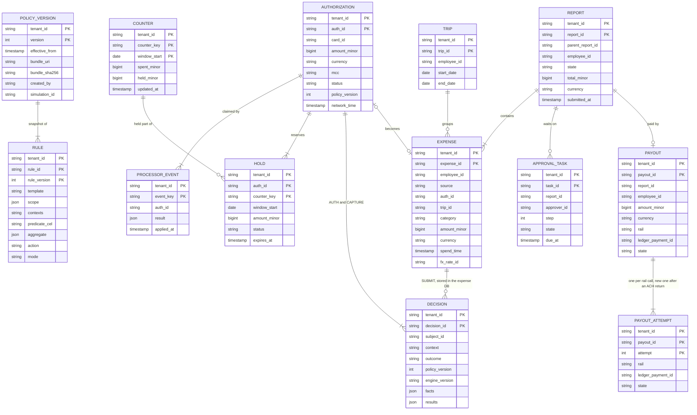

Access patterns that justify it:
- **Everything is partitioned by `tenant_id`.** All counters, holds and decisions a single authorization touches live on one shard, so the auth transaction is single-shard. No distributed transaction on the hot path, ever.
- **Counter lock by key** (every authorization): primary key `(tenant_id, counter_key, window_start)`. Keys look like `card:c_91:month`, `emp:e_17:cat:meals:month`, `dept:d_4:month`, `trip:t_88:cat:meals`. `window_start` is the start of the window in the tenant's timezone (1970-01-01 for a trip, which has no window). A counter is identified by its group, its window **and its filter**: the middle of the key is the canonical filter (a sorted category set such as `cat:meals`, or a short hash of the canonical CEL filter). A new rule with the same group, window and filter reuses the counter; anything else is a new counter and needs a backfill (§5.4).
- **Holds by `auth_id`** (every capture, reversal and incremental): primary key `(tenant_id, auth_id, counter_key)`. The processor's id is the idempotency key. Holds by `expires_at` for the sweeper (secondary index on open holds only).
- **Idempotency claim** (every synchronous request and every lifecycle event): `PROCESSOR_EVENT` primary key `(tenant_id, event_key)`, claimed by the first `INSERT` of the transaction. Keys: `auth:{auth_id}:{seq}` (seq 0 for the initial request, 1 to n for incremental authorizations; `seq` is the processor's own request identifier or request-history position, never one we assign, so a retried increment keeps its key), `txn:{transaction_id}` for captures and refunds, `rev:{id}` for reversals. A duplicate finds the claim and returns the stored result, so there is no separate "have I seen this" read to race.
- **Active policy at time t**: `max(version) where effective_from <= t`, cached per evaluator. For `AUTH`, `t` is the network transaction time, and the version used is stored on the `AUTHORIZATION`; `CAPTURE` and `SUBMIT` of that card expense **reuse the stored version** rather than re-derive it, so the ~5 s activation lag can never make two versions judge one card expense. For an out-of-pocket expense, `t` is the start of its expense date in the tenant's timezone. `effective_from` never decreases as the version rises, and a policy has at most one scheduled future version (§5.4). Versions are immutable, so the cache never needs invalidating, only extending.
- **Tenant placement**: a shard directory `(tenant_id → logical shard, epoch)`, cached everywhere, changed only by a tenant move or a fenced promotion (§5.3, §5.6).
- **Retention**: `DECISION` and `PROCESSOR_EVENT` are partitioned by day and dropped after 90 days, once the lake's row count for the day matches (§5.5).
- **Trip total at submit**: `EXPENSE` by `(tenant_id, trip_id)`, read by the expense service with the `TRIP` row locked `FOR UPDATE` so two submissions on one trip serialize, and passed to the engine as a fact (§4.4).
- **Approver inbox and re-routing**: `APPROVAL_TASK` by `(tenant_id, approver_id, state)`. An HRIS "manager changed" or "on leave" event finds the open tasks through it and signals their workflows.
- **Payout guard**: `PAYOUT` unique on `(tenant_id, report_id)`; a partial approval creates a child `REPORT` (`parent_report_id`), so each report still has exactly one payout.
- **Decision by subject** for explain and support: secondary index on `(tenant_id, subject_id)`. Hot for 90 days in the shard DB, then only in the lake.

**Money is integer minor units plus an ISO 4217 currency code** (cents for USD, no decimals for JPY). No floats anywhere: the Rippling delivery-cost screen asks exactly this. Currency conversion uses a daily rate table whose id is stored on the expense, so a re-evaluation never sees a different rate.

---
## 4. High-level design

One subsection per functional requirement. Each traces input to output through the boxes, adds the boxes it needs to one diagram, and ends with what is still missing. The design at the end of §4 is deliberately the simple version; §5 breaks it.

### 4.1 Define policy: rules as data, compiled into a versioned bundle

**Bad: a class per rule.** `NoRestaurantOver75 implements Rule`. It is what the phone screen expects you to start from, and it is fine for six rules. It breaks the moment 50k companies each want their own limits: every new limit is a deploy, and a customer cannot author anything.

**Good: rules as rows with fixed columns.** `(field, operator, value, action)`, e.g. `(expense_type, =, airfare, DECLINE)`. Admins can add them from a UI. It breaks on the second requirement of the prompt: "meals at most $200 per trip" is a sum over a group, not a comparison on one field, and "restaurant **and** amount > 75 **unless** the employee is in Sales" is a compound condition. You end up inventing a language one column at a time.

**Great: a JSON envelope plus a typed predicate language.** The envelope carries what the engine must understand structurally: scope, contexts, the aggregate, the action. The predicate is a CEL expression over a typed `expense` and `employee`. CEL "evaluates in linear time, is mutation free, and not Turing-complete" (cel-spec README), so a customer-written rule cannot loop, allocate without bound, or call the network. Templates generate both halves, so most admins never see CEL.

```json
{
  "rule_id": "meals-per-trip", "template": "per_trip_cap",
  "scope": {"departments": ["*"], "exclude_levels": ["exec"]},
  "contexts": ["AUTH", "CAPTURE", "SUBMIT"],
  "predicate": "expense.category in ['restaurant', 'meals']",
  "aggregate": {"group_by": "trip", "measure": "sum(amount_policy_minor)", "limit": {"amount_minor": 20000, "currency": "USD"}},
  "action": "REQUIRE_APPROVAL", "mode": "ENFORCE",
  "message": "Meals on this trip total {observed} against a {limit} limit"
}
```

**Flow: an admin adds "no restaurant expense over $75".**

1. The admin picks the `category_cap` template in the UI and enters `restaurant, 7500`. The UI calls `PUT /v1/policies/p1/draft/rules/restaurant-75`.
2. The policy service expands the template into an envelope plus `expense.category == 'restaurant' && expense.amount_usd_minor > 7500`, parses and **type-checks** the CEL against the declared `expense` and `employee` types (a typo such as `amout` fails here, with a position), checks the cost estimate against a limit, and saves the draft.
3. On publish, the service writes the rules as new `RULE` versions and a new `POLICY_VERSION` row (version 12, `effective_from = now`) in one transaction in the policy DB.
4. The compiler builds the **bundle** for version 12: every rule's checked CEL program, an index `(context, category) → candidate rules`, the set of counter dimensions the aggregate rules need, and a flag per rule saying in which contexts its inputs exist. It writes the bundle to object storage under its SHA-256 and records the URI on the version row.
5. The API returns `policy_version = 12`.

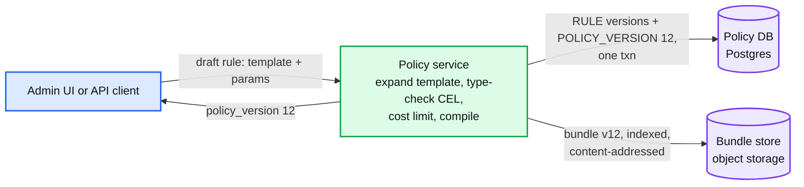

Data model so far: `RULE`, `POLICY_VERSION`, and bundle files.

**What is still missing:** nothing evaluates the rules. §4.2.

### 4.2 Evaluate an expense and explain the result

**Bad: return a boolean, stop at the first violation.** Covered in §3.2. The employee cannot act on it and support cannot answer the ticket.

**Good: return the list of violations.** Enough for the phone screen. It still mixes expense-level and trip-level violations, has no numbers, and cannot be reproduced once the policy changes.

**Great: the `Decision` in §3.2**, with an explicit combination rule: rules only restrict (there are no "allow" rules, and exemptions live in the scope), so the outcome is the **maximum severity** over enforced violations, `ALLOW < ALLOW_FLAGGED < NEEDS_APPROVAL < DECLINE`. Evaluation order does not matter, rules never conflict, and a partial evaluation is always safe to extend. Cedar shares the key property: in Cedar a forbid overrides any permit, so nothing can undo a deny and order does not matter. (Cedar denies by default and has permits; we allow by default and have only restrictions.)

**Flow: an out-of-pocket dinner, $92 at a restaurant on trip t_88.**

1. The expense app calls the decision service: `evaluate(expense, context = SUBMIT)`.
2. The decision service finds the tenant's active version (12) and fetches bundle v12 from the bundle store.
3. It fetches the employee's attributes (department, level, country) from the HRIS so it can check each rule's scope.
4. It looks up the candidate rules in the bundle's index under `(SUBMIT, restaurant)`: `restaurant-75`, `single-250`, `meals-per-trip`, `trip-2000`.
5. Point rules run in memory: `restaurant-75` is `VIOLATED` (observed 9200, limit 7500, `REQUIRE_APPROVAL`); `single-250` passes.
6. Aggregate rules query the expense DB: `SUM(amount) WHERE trip_id = t_88 AND category IN (restaurant, meals)` returns 12,500; with this expense, 21,700 against 20,000: `VIOLATED` at trip level. The trip total (140,000 + 9,200) passes.
7. Outcome = max severity = `NEEDS_APPROVAL`. The decision carries all four results, version 12, and the engine version, and the service returns it.

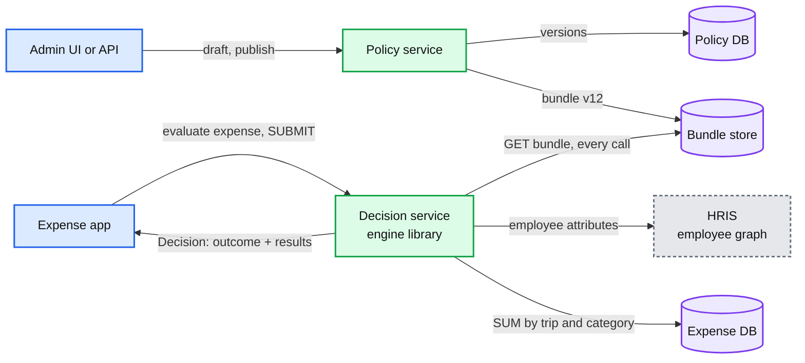

Data model so far: plus `EXPENSE` and `TRIP` in the expense DB, and `DECISION`.

**What is still missing:** cards. A swipe has a 2 s deadline and money has not moved yet. §4.3.

### 4.3 Decide card authorizations in real time

**Flow: a $62 lunch on a corporate card.**

1. The merchant's terminal sends the authorization through the acquirer and Visa to our issuer processor. The processor first checks the card's own static controls, then calls our auth gateway synchronously (for Stripe, the `issuing_authorization.request` webhook, answered within 2 s).
2. The gateway verifies the processor's signature, maps the processor card id to `(tenant, employee, card)`, and calls the decision service with `context = AUTH`.
3. The decision service evaluates exactly as in §4.2. Trip rules come back `NOT_EVALUABLE`, because a swipe carries no trip. Aggregates such as "card at most $3,000 a month" are a `SUM` over this card's captured expenses plus its open authorizations this month.
4. Outcome `ALLOW`: the gateway answers `approved: true`; the processor answers the network; the terminal prints "approved". The `AUTHORIZATION` row and the decision are stored.
5. Later, asynchronously, the processor sends lifecycle webhooks: the capture (possibly a different amount), a reversal, a refund, an expiry. A receiver writes them to Kafka (`card-events`, partitioned by card id so one card's events stay in order). The **settlement consumer** applies each one: on capture it creates the `EXPENSE` row and asks the decision service to re-evaluate in `CAPTURE` context. A violation now cannot decline, so it becomes `NEEDS_APPROVAL` or a flag on the expense.

```mermaid
%% Incremental diagram, step 3 of 4: card authorizations arrive synchronously from the processor; lifecycle events arrive later through Kafka.
flowchart LR
    NET[Card network<br/>Visa, Mastercard] -->|"auth request"| PROC[Issuer processor<br/>Stripe, Marqeta, Lithic]
    PROC -->|"sync auth webhook,<br/>2 s deadline"| GW[Auth gateway]
    GW -->|"evaluate, AUTH"| DS[Decision service<br/>engine library]
    DS -->|"bundle, attributes"| BS[(Bundle store + HRIS)]
    DS -->|"SUM captured + open auths"| EDB[(Expense DB)]
    GW -->|"approved or declined"| PROC
    PROC -->|"capture, reversal, refund,<br/>expiry webhooks"| RCV[Webhook receiver]
    RCV -->|"card-events by card_id"| K[[Kafka]]
    K -->|"consume"| SC[Settlement consumer]
    SC -->|"EXPENSE rows"| EDB
    SC -->|"re-evaluate, CAPTURE"| DS

    class GW client
    class DS,RCV,SC service
    class BS,EDB store
    class K queue
    class NET,PROC external

    classDef client   fill:#dbeafe,stroke:#2563eb,stroke-width:2px,color:#111
    classDef service  fill:#dcfce7,stroke:#16a34a,stroke-width:2px,color:#111
    classDef store    fill:#ede9fe,stroke:#7c3aed,stroke-width:2px,color:#111
    classDef queue    fill:#cffafe,stroke:#0891b2,stroke-width:2px,color:#111
    classDef external fill:#e5e7eb,stroke:#6b7280,stroke-width:2px,color:#111,stroke-dasharray:4 3
```

Data model so far: plus `AUTHORIZATION`.

**What is still missing:** a lot, and all of it is §5. The hot path makes three remote calls and a `SUM` over a month of rows (§5.1). Two concurrent swipes both read the same sum and both pass (§5.2). If the database fails over, the processor's timeout setting decides for every card (§5.3). And a bad rule reaches every swipe the moment it is published (§5.4).

### 4.4 Reimburse: submit, evaluate, approve, pay

**Flow: an employee submits three out-of-pocket expenses from a trip.**

1. The employee app uploads receipts and creates expenses (`POST /v1/expenses`), then submits the report (`POST /v1/reports/r_5/submit` with an `Idempotency-Key`). The expense service moves the report from `DRAFT` (or `RETURNED`, on a resubmit) to `SUBMITTED`.
   **Which policy version judges each expense: the one in force when the money was spent.** For out-of-pocket lines that is the version in force at the start of the expense date (the tenant's local midnight), so a same-day publish applies from the next day's spend; for card expenses it is the version stored on the authorization, the same one that judged the swipe and the capture. A report does not pin one version and a resubmit does not change them, so a policy change is never retroactive and never moves under a waiting report. To stop backdating, an expense date that disagrees with the receipt date is flagged, and so is any expense older than 90 days [estimate] at submit.
2. The expense service locks the trip row (`SELECT ... FOR UPDATE` on `TRIP`) so two reports on one trip serialize, reads the trip's total (card expenses assigned to the trip plus out-of-pocket lines in reports that are submitted, approved or paid; drafts do not count), and calls the decision service in `SUBMIT` context with that total as a fact. Period rules ("software at most $500 per employee per month") work the same way at submit: the expense service reads the employee's period totals (card expenses plus out-of-pocket lines) under a per-employee, per-period advisory lock and passes them as facts, because the counters only ever saw card spend. Each expense's trip and period rules are judged by that expense's own version. SUBMIT is the authoritative trip check; the trip counter at authorization (§5.2) is only an early, best-effort check on card spend. The decision service itself never queries the expense DB, which is what makes the §4.2 query above the naive version.
3. The report's outcome is the maximum over its expenses and trip results. `ALLOW` and a total at or under the tenant's auto-approve limit ($250 default [estimate]): auto-approved. Otherwise `NEEDS_APPROVAL`. `DECLINE`: returned to the employee with every reason. Every report that owes the employee money starts a workflow, auto-approved or not, because the payout needs durable retries. A card-only report that passes closes in the submit transaction.
4. The approval workflow (a durable workflow per report, on Temporal, workflow id = report id) asks the approvers the policy names: the manager from the HRIS org chart at routing time, and finance above $1,000 whatever the outcome. It sends reminders, escalates after 3 business days (on the tenant's holiday calendar), and re-routes when an HRIS event says the manager changed or went on leave. The approver can never be the submitter. Approving only some lines splits the rest into a child report with its own workflow and payout. A terminated submitter's open reimbursement is still paid: the money is owed.
5. Once approved, the workflow writes one `PAYOUT` row for the report with the chosen rail **before** any call: a line on the employee's next payroll run (flagged non-taxable where an accountable plan applies), or an ACH transfer through the payments ledger. The ledger's own idempotency record lives only 24 h, so the `PAYOUT` row is the long-lived guard: it stores the ledger's payment id after the first call, and every retry looks that id up before posting again. The rail changes only after the first rail confirms it did not pay.
6. Card expenses follow the same report flow for receipts and memos. Their money already moved, so the workflow can only approve or flag. Recovery of a real violation is the employee repaying; a payroll deduction needs the employee's written consent and must respect wage laws, so it is a tenant policy decision, not a default.

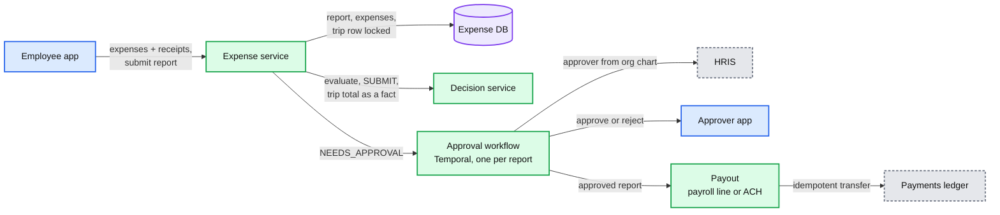

Data model so far: plus `REPORT`, `APPROVAL_TASK`, `PAYOUT`.

**What is still missing:** this path is not latency-critical. What matters is exactly-once payouts across a 24 h ledger key, approvals that survive restarts and re-routing, and a version rule that never changes under a waiting report. [`deep-dives/reimbursement-workflow-and-payout.md`](deep-dives/reimbursement-workflow-and-payout.md).

---

## 5. Deep dives

One per non-functional requirement. Each one names what breaks in the §4 design with a number, fixes it, and lists what changed in the API, the data model, and the diagram.

### 5.1 "Answer every swipe inside 2 seconds, p99 50 ms": the hot path

**What breaks.** Walk one authorization through §4.3 and price each step:

1. **Bundle fetched from object storage on every call.** An S3 GET is 10 to 50 ms p50 and 100+ ms p99. At 2k/s that is also 2k GETs/s for data that changes a few times a week.
2. **Employee attributes from the HRIS on every call.** At Rippling that is the main application, a large Python monolith (their Gunicorn post talks about 17M+ lines of code). A monolith deploy, a slow query or a garbage-collection pause now declines cards.
3. **`SUM` over the card's month.** An active card has hundreds of rows by month-end; the query is 5 to 50 ms and grows with history. It is also wrong under concurrency (§5.2).
4. **No deadline of our own.** If the database stalls for 3 s, we miss Stripe's 2 s and the processor's timeout setting decides. Lithic declines after 6 s and warns that answers slower than 3 s see "a higher percentage of transactions being voided shortly after you have approved them".

**Fix.**
- **Bundles in process.** Each decision service instance keeps an LRU of compiled bundles keyed `(tenant, version)`, 1 GB, which holds every tenant active in the last hour. Versions are immutable, so there is no invalidation: when the policy service publishes, it emits `policy-activated{tenant, version, effective_from}` on Kafka, every instance loads the new bundle (a few KB to a few MB) in the background, and flips its "active version" pointer for that tenant. A pod that misses the event must not enforce an old version silently, so each pod also polls the policy DB's active-version table every 30 s [estimate], and a per-pod activation-lag metric alerts. A miss (a tenant's first swipe of the day) is one object-storage GET, ~20 ms, still inside budget. An out-of-pocket expense can need an older version than the latest (the one in force at the start of its date), and the compacted topic only keeps the latest, so evaluators also resolve `(tenant, t) → version` against the policy DB and cache the answer.
- **Employee context as a projection.** The HRIS publishes attribute changes as events; a small consumer writes them to an employee-context store (Redis, one hash per employee, with `attribute_version`), and each decision service instance keeps a 60 s local cache in front of it. If Redis is down past the TTL, the cache serves stale entries for up to 24 h [estimate] and flags the decision. The swipe never calls the monolith. **Termination is the exception**: the HRIS offboarding flow cancels or deactivates the employee's cards at the processor synchronously (a future-dated termination sets a timer for its effective time), so a stale cache can never approve a terminated employee's swipe. Authorizations approved before that moment can still capture; they are ordinary card expenses.
- **Card map and shard directory in every pod.** `processor_card_id → (tenant, employee, card program, status)` is a full in-memory copy per gateway and decision-service pod (~300 MB [estimate] for 3 M cards), fed by the same events, and so is the shard directory. With Redis down and a cold pod, we can still route a swipe, find its bundle and apply the degraded cap.
- **Counters instead of `SUM`.** §5.2.
- **Our own deadline.** The gateway gives each request a 1.2 s budget (Stripe's 2 s minus 800 ms of margin; derived per processor). Every downstream call carries the remaining budget; at the deadline the gateway answers with the fallback decision (§5.3) and logs it as degraded.
- **Idempotency by claim, not by lookup.** The first statement of the authorization transaction inserts `PROCESSOR_EVENT(auth:{auth_id}:{seq})`. A duplicate delivery (a processor retry, a failover replay) collides on it and returns the stored answer, so it never reserves twice, and an incremental authorization (a new `seq`) is never mistaken for a retry of the original.
- **Out of the monolith.** The gateway, decision service and counter store are a separate deployable with their own on-call, so no unrelated deploy can take card authorization down.

**Push back on the textbook answer.** "Use a Rete engine (Drools) so evaluation is fast." Rete (Forgy, 1982) wins when many rules match against many facts that change incrementally, sharing partial joins between rules. We have **one fact** (an expense) and ~8 candidate rules after indexing: ~10 µs, under 0.1% of a 15 ms request. The Cedar paper measured Rego at a 76 µs median on its smallest test and Cedar 42.8x to 80.8x faster still; either way it is noise next to a 4 ms commit. Pick the rule language for **safety and analyzability** (termination, type-checking, no I/O), not for speed.

**What changed:** bundle LRU plus the `policy-activated` topic; employee-context projection; synchronous card freeze on termination; per-request deadline; idempotency on `auth_id`; a separate deployable. The diagram gains the employee-context store and the topic. [`deep-dives/authorization-hot-path.md`](deep-dives/authorization-hot-path.md), [`deep-dives/rule-model-and-evaluation.md`](deep-dives/rule-model-and-evaluation.md).

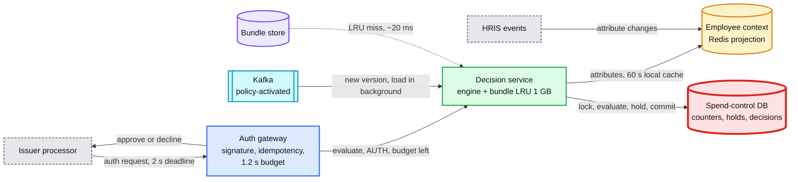

### 5.2 "Two swipes can never both break a limit": aggregates, holds and concurrency

**What breaks.** The §4.3 `SUM` has five holes:

1. **Check-then-act race.** An employee's monthly meals counter sits at $180 of $200. Two $30 swipes (the employee's card and a colleague's lunch on a shared department cap) arrive 3 ms apart. Both read $180, both approve, the total ends at $240. Moving the counter to Redis and running `INCRBY` after approving has the same race, and Redis replication is asynchronous, so a failover can lose acknowledged increments.
2. **Approved is not spent.** A gas-pump status check (Stripe sends a 1 USD request but holds 100 USD by default, so the hold must follow the processor's held amount, not the request), a hotel's $300 incidentals hold and a cancelled order are approved but may never capture, or capture a different amount. A single number cannot say which.
3. **The amount changes after the decision.** A $70 dinner authorizes and captures at $84 with a tip. Stripe warns that "additional tips and fees can be posted at a later time, causing a spending limit to be exceeded". Hotels add incremental authorizations. Refunds arrive weeks later and are linked to the original purchase only on a best-effort basis ("an inexact science", in Stripe's words).
4. **Authorizations expire.** An approval with no capture is released by the processor after a period. If we never release our side, the employee's limit shrinks forever.
5. **No trip at swipe time.** The card network does not know about trips.

**Fix: counter rows with a held part, updated in one transaction per event.**

- **Counters keyed by group, window and filter,** `(tenant, counter_key, window_start) → (spent, held)`. The compiled bundle says which counter keys an expense touches (card-month, employee-category-month, department-month, trip-category when a trip is known).
- **Authorization = lock, evaluate, hold, in one transaction on the tenant's shard.** Point rules run first, before any lock. Missing counter rows for the window are upserted in sorted key order, in autocommit, before `BEGIN`. Then: `SELECT ... FOR UPDATE` the counter rows **in sorted key order**, and let the engine evaluate every aggregate rule on `spent + held + amount` with the **exact** amount. If the outcome is not `DECLINE`, add each counter's reservation to `held` and insert one `HOLD` row per counter. **Always** insert the `AUTHORIZATION` with its final status (approved or declined, including point-rule declines) and the `DECISION`, then commit. Recording declines matters: a retried declined authorization must return the stored decline, not be re-evaluated and maybe flip. The second of two racing swipes waits ~2 ms for the lock, sees the first one's hold, and declines. Rules share counters, so a new rule on an existing dimension needs no backfill.
- **One lock order everywhere:** `AUTHORIZATION`, then `HOLD`, then `COUNTER` rows sorted by key. The authorization path, every lifecycle event and the sweeper follow it, so no two of them can deadlock.
- **Capture** moves a hold to spend in one transaction keyed by the processor's transaction id (a unique constraint makes a redelivered event a no-op): `held -= open_amount`, `spent += captured`, and the `HOLD` row's open amount drops to 0. Every event moves the hold's **open** amount, never the original, so a late capture after an expiry (Stripe keeps "any remaining amount authorized for possible late captures") adds to `spent` without subtracting `held` a second time. The settlement consumer runs the engine **in process**, and point rules are re-evaluated on the captured amount in `CAPTURE` context **before** `BEGIN`, so no remote call happens while rows are locked. A violation becomes `NEEDS_APPROVAL` or a flag, never a decline.
- **Tips.** Every rule, point or aggregate, **decides** on the exact authorized amount: declining a $70 dinner because a tip might push it past $75 would be a false decline, and so would declining a $62 swipe that fits a counter only because a 20% buffer does not. For MCCs where tips are normal (restaurants, bars, taxis), the **hold** reserves `max(amount, min(1.2 × amount, headroom))` per counter, so the counter keeps room for the likely tip without ever causing a decline. The 20% is a tenant-tunable buffer [estimate: networks let these merchants capture above the authorized amount, but the exact tolerance varies by network and I could not verify it from a primary source]. The capture re-check flags the dinner if the final amount is over.
- **Incremental authorization** (hotel): the same transaction on the delta, with the same `auth_id`. **Reversal**: release the hold. **Refund**: `spent -= amount` on the linked authorization's counters, and an unlinked refund **credits nothing until it is matched** to its purchase (matching runs within minutes [estimate]; no match after 7 days goes to finance). Crediting the current window instead would open a loophole: buy $3,000 on September 30, spend $3,000 in October, return the September purchase, and October has $3,000 of new headroom. **A lifecycle event for an `auth_id` we never saw** (a force capture such as an offline in-flight purchase, or an authorization the processor approved without us) first creates the `AUTHORIZATION` in its end state, then applies: `spent += amount` and a `CAPTURE` evaluation. A journal replay arriving later sees it closed and adds no hold (§5.3).
- **Expiry.** The processor's expiry webhook releases the hold's open amount. A sweeper releases any hold past its `expires_at` (set from the processor's rule for that MCC, e.g. longer for hotels and car rental) as a backstop for a lost webhook. It picks candidates without locks, then runs one short transaction per authorization in the global lock order, taking the `AUTHORIZATION` row with `SKIP LOCKED` so it never waits on a live capture. Nightly reconciliation compares our open holds with the processor's open authorizations.
- **Trips at swipe time.** If the employee has a booked trip covering today (Rippling Travel knows), the swipe is assigned to it and the trip counter gives an early, best-effort check on card spend. Otherwise trip rules are `NOT_EVALUABLE` at `AUTH`. Either way, `SUBMIT` is the authoritative trip check (§4.4), and every path that attaches an expense to a trip takes the `TRIP` row `FOR SHARE`, so it serializes with a submit holding `FOR UPDATE`. Say this out loud: some rules cannot be enforced before the money moves.

**Push back on the textbook answer.** "Shard hot counters into N sub-counters or use escrow." Do the arithmetic first: the hottest counter we have, a company-wide cap at a 100k-employee tenant, sees ~23 swipes/s at peak, ~45 lock holds/s once its captures are counted, and one row lock held ~4 ms serializes at ~250/s, so it runs at ~20% utilization. Splitting it adds a rebalancing protocol and makes the counter exact only when reassembled, which is exactly when you are near the limit. The escrow and demarcation protocols (O'Neil 1986; Barbara and Garcia-Molina 1992) are the seam if a tenant ever needs one counter above ~100/s: split the remaining budget into slices, spend locally, and collapse to one slice near the limit. Not before.

**What changed:** the spend-control DB (Postgres, sharded by `tenant_id`) with `COUNTER`, `HOLD`, `AUTHORIZATION`, `DECISION`; the tip buffer by MCC; the expiry sweeper and the nightly hold reconciliation. `Decision.holds` is filled. [`deep-dives/aggregates-holds-and-concurrency.md`](deep-dives/aggregates-holds-and-concurrency.md).

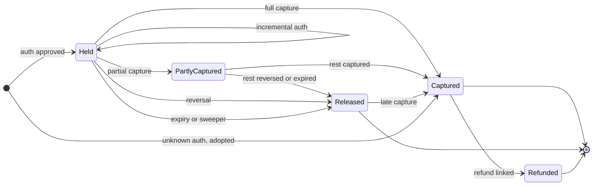

### 5.3 "Keep cards working when parts fail": fallback layers

**What breaks.**

1. **A counter cluster fails over.** Postgres failover to the synchronous standby takes ~10 to 30 s. One physical cluster holds 4 logical shards, ~12.5k tenants and a quarter of the traffic, and every one of their authorizations waits on a dead primary. Without a fallback, all of them miss the deadline.
2. **Our whole service is unreachable** (a bad deploy, a network cut between the processor and us). Then the processor decides alone: Stripe approves or declines "based on your timeout settings"; Marqeta switches to Commando Mode and decides "based on defined business rules"; Lithic declines after 6 s; and if the network cannot reach the processor, Visa or Mastercard stand-in processing (STIP) decides.
3. **A region is lost.** Counters replicate asynchronously to the other region, so the last ~1 s of holds is lost on promotion.

**Fix: three layers, each coarser than the one above it.**

- **Layer 1, static controls at the processor, always on.** The compiler also emits, per card, the subset of the policy that is unconditional for that cardholder and that the processor can express: only `ENFORCE` rules whose action is `DECLINE` and that apply at `AUTH`, as blocked categories, a per-authorization maximum and a monthly ceiling. They are pushed to the processor's card-level controls (Stripe `spending_controls`, which "run before real-time authorisations"). They must never be **stricter** than the policy, or they cause false declines the policy never asked for. Two traps make "equal to the policy" stricter. Stripe's date-based intervals start at midnight UTC and ours at the tenant's local midnight, so a monthly ceiling goes out as **2 × the policy limit**: one UTC month overlaps at most two local months. And the processor converts currency at its own rate, so per-authorization caps get an FX margin. **Sync order:** a loosening change is pushed to the processor first and activated after; a tightening change is activated first and pushed after. So a loosening change to a pushable rule at a 100k-card tenant waits on the processor API and misses the 5 s activation; say so. Declines made by these controls never reach our webhook, so the webhook receiver writes a `DECISION` for each declined `authorization.created`, citing the control. They are coarse on purpose: Stripe aggregates spending limits on a best-effort basis, with up to 30 s of delay. With them in place, the processor's timeout setting can safely be **approve**: an outage approves within bounds instead of declining every card.
- **Layer 2, our fallback decision inside our deadline.** When the counter store is unavailable, the decision service returns the point-rule verdicts (they need no state) with "store unavailable". When the decision service itself is unreachable, the gateway uses the card's cached layer-1 controls instead. Either way the gateway approves only if the point rules pass, the amount is under the tenant's degraded cap (default $500, configurable; $0 means fail closed), and the card's degraded running total on this pod stays under $1,000 [estimate]. It writes the approval to a **degraded journal** (a Kafka topic, spooled to local disk if Kafka is also down) and marks the decision `degraded: true`. A pod remembers its degraded answers by `auth_id` for the degraded window, so a processor retry to the same pod gets the same answer; if a retry lands on another pod, adopt defers to the processor's own recorded outcome.
- **One adopt path for every approval we did not fully decide.** Journal entries, processor timeout approvals (visible as Stripe `webhook_timeout` on `authorization.created`), Marqeta Commando Mode and network STIP all go through one idempotent `adopt(auth_id, state)`. It inserts the `AUTHORIZATION` and its holds if the authorization is still open, never re-decides, re-runs the aggregate rules and flags breaches. Two rules make it safe. **The processor's recorded outcome wins**: the settlement consumer applies every `authorization.created` and `authorization.updated` event, and whenever our record disagrees (the primary died during `COMMIT` and the gateway then answered with a degraded approval, or our answer arrived too late and the processor applied its timeout setting), adopt overwrites our status with the processor's, adds or releases the holds, and marks the orphaned decision `superseded`. And the counter moves only if the hold insert actually inserted a row (`RETURNING`), so a replay after a partial replay is a no-op. The journal is the fast path; the processor's webhook is the backstop if a journal entry is lost.
- **Layer 3, after the fact.** Capture and submit re-evaluation catch everything that slipped through layers 1 and 2. A violation becomes an approval request, or a repayment request to the employee.
- **Regions.** The gateway and decision service run active-active in two regions. Each tenant's cluster has one primary in its home region, **two synchronous standby candidates** in the other two AZs (availability zones; with only one, losing it would stop every commit), and an asynchronous replica in the other region. On region loss we fence the old primary (the shard directory carries an epoch, and the old primary is shut off before promotion, so a partition cannot create two primaries), then promote the replica. The RTO (recovery time objective) is a few minutes, and layer 2 carries the gap. Then we **re-sync from the processor**, the system of record for authorizations: we list the authorizations and transactions that changed since the replica's last applied time minus a margin, not all ~6 M open holds, and diff in both directions through adopt. Nightly reconciliation catches the rest. Decisions lost in that second are rebuilt from the processor's records and marked `facts_lost`. Keep two numbers apart: the RPO (recovery point objective) is about 1 s of lost writes; the degraded window is minutes. A tenant has one home region, placed in the region nearest its processor so that forwarding is the exception (a region failover), not the norm; the extra 30 to 70 ms [estimate] of a forward would break the p99 SLO, which is suspended while it happens. A gateway in the other region forwards the evaluate call there once (never a multi-statement transaction across regions), and webhook receivers produce `card-events` to the home region's topic, so one card's events stay in one ordered partition.

**Push back on the textbook answer.** "It is money, so fail closed." Declining every card on one cluster for 30 s at peak is `300/s × 30 s = 9,000` false declines, a lot of them executives at restaurant counters. A policy violation is not a money loss: the company owes the merchant either way, and the overspend is bounded by the degraded cap, visible on the decision, and recoverable. The one counter that should fail closed is the **company's credit exposure** (Rippling's own money on a charge card). Its counter lives on the same shard that just died, so each gateway pod holds a pre-allocated escrow slice of the company's last-known credit headroom, and degraded approvals draw from it; when the slice is empty or older than 5 minutes [estimate], the pod declines. Monzo made the same trade-off in its Stand-in platform: approvals made from a possibly stale balance are applied verbatim later, even if that takes a customer into an unapproved overdraft.

**What changed:** the compiler emits static controls and a controls-sync job pushes them to the processor; the processor timeout setting is approve; the tenant's degraded cap; the degraded-journal topic and its replay consumer; the hold re-sync from the processor after a promotion. [`deep-dives/degraded-modes-and-region-loss.md`](deep-dives/degraded-modes-and-region-loss.md).

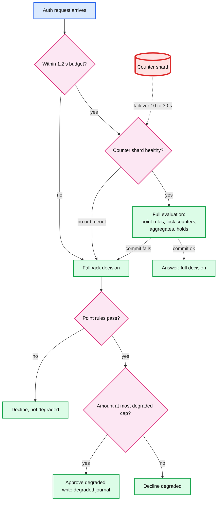

### 5.4 "A bad rule must not decline a whole company": safe policy changes

**What breaks.** In §4.1, publish means enforce on the next swipe:

1. An admin means "entertainment over $0 needs approval" and publishes `amount > 0 → DECLINE` for everyone. 100% of the company's cards decline within 5 s.
2. A rule that errors at runtime (a field missing in one context, a division by zero in a custom rule) either declines everything or passes everything, depending on which accident the code has.
3. A tighter limit on a new dimension ("$150 per employee per week on rideshare") starts from an empty counter, so it is wrong for the rest of the week.
4. **Our** change is the bigger risk: a new engine version that changes how `>=` compares money, or a template bug, reaches every tenant at once.

**Fix.**
- **Validate at save.** Type-check (unknown fields and wrong types fail with a position), cost estimate under a limit, a non-empty scope, money limits in minor units with a currency, and contexts that match the fields used (a rule on `trip` cannot claim `AUTH` unless it tolerates `NOT_EVALUABLE`).
- **Simulate before publish.** Replay the tenant's last 90 days of authorizations, lifecycle events and out-of-pocket expenses from the lake under the draft **and** under the current policy, with the production engine version, and show the difference: newly declined, newly needing approval, newly flagged, with counts, the spend affected, the amount over the limit, and examples. The baseline is the current policy re-simulated, not the recorded outcomes, which mix older versions, degraded decisions and processor-side declines. Counters and trip totals are recomputed from the events under each policy, never read from the lake, because the stored counter values were produced by the old policy's approvals. A swipe that was declined then but passes now is assumed to have captured its authorized amount; the report states this fidelity limit. ~40 s for the largest tenant (§2). If newly declined authorizations exceed 2%, or newly needing approval exceeds 10% [estimate] of the tenant's volume, publish needs an explicit confirmation token. The token is bound to `(simulation_id, draft sha, base_version)`, and publish is a compare-and-set on `base_version`, so two admins drafting from the same version cannot silently overwrite each other.
- **Shadow mode per rule.** `mode = SHADOW` evaluates live and records the result with `shadow: true` but never changes the outcome. A shadow verdict never writes a hold of its own; counters follow only the enforced outcome. A counter dimension in the bundle is maintained by every approved authorization whatever the mode of the rules that read it, which is what lets a shadow rule on a new dimension catch up. Because the real spend went through, every swipe after the first breach in a window would also "violate", so shadow reports count the first violation per counter window. The UI suggests 7 days of shadow for any rule that can decline.
- **Runtime errors are `ERROR`, not `VIOLATED`.** An erroring rule contributes nothing to the outcome (the outcome is unchanged, not `ALLOW_FLAGGED`), the decision goes to a review queue, and the tenant's admins and our on-call get an alert. A broken rule neither declines everyone nor hides silently.
- **Backfill before enforce.** A rule on a new counter dimension is published in shadow as version N. Decisions under N and later write the new counter live. A backfill job then cuts **by row, not by time**: every authorization in the window with no `HOLD` on the new key gets its captured spend added, or a `HOLD` row if it is still open, so its capture can release it. A time cut at N's activation would miss authorizations decided under N-1 during the ~5 s activation lag; the `HOLD` primary key makes the row cut idempotent. When the backfill completes, the system publishes N+1 with the rule in `ENFORCE`. The readiness is itself a version, so every decision stays a function of its version.
- **Templates are versioned too.** Rules store `template_version`. A template bug is fixed by re-expanding affected rules, simulating per tenant, and publishing system-authored versions cohort by cohort; an engine rollout alone would not touch stored rules.
- **Versioned, forward-only, instant rollback.** Every publish is a new immutable version. `effective_from` never decreases as the version number rises; a policy has at most one scheduled future version, and an immediate publish cancels or rebases it, so a scheduled version can never be skipped. A rebased scheduled version goes back through simulation and the confirm guard. No backdating. Rollback republishes an old version's rules as a new version: ~5 s to every evaluator through `policy-activated`. The processor's static controls cannot slow it down, because a new pushable `DECLINE` rule is pushed to the processor only after a 24 h [estimate] soak in our engine, and a rollback always activates in our engine first, with the loosening push following. For a rule older than the soak, that leaves a window of minutes at a large tenant in which the processor is stricter than the policy; we accept it, because the alternative is a rollback that waits on the processor's API. Spend made while the bad version was live is still judged by it (versions follow spend time, §4.4), so rollback also offers an audited bulk waive of the flags that version raised. After an activation we watch the tenant's decline rate for 30 minutes. If it jumps above 3x its 7-day baseline, with at least 20 declines [estimate] and above the fleet median, the admin gets an alert with a one-click rollback. We do **not** auto-revert a customer's policy: it is their intent, and a legitimate freeze ("block all spend, we suspect fraud") looks exactly like a spike.
- **Our code rolls out slowly and is diffed.** A new engine version first runs in shadow next to the current one on mirrored live traffic for 24 h. Any decision that differs and is not explained by the release notes blocks the rollout. Diffing on identical facts cannot see a change in how facts are assembled (MCC normalization, window starts, counter keys), so the shadow also recomputes the counter key set, and a fact-assembly change tees raw processor requests to the new code. Then 1%, 10%, 50%, 100% of tenants, with automatic rollback on a decline-rate anomaly. Grab's Griffin shows the failure this prevents: once "a rule change needed 1 week" became "just 1 minute", "anyone can turn the whole checkpoint down", so they added shadow mode and percentage rollout per rule.

**Push back on the textbook answer.** "Canary every policy change to 1% of employees." Two employees under the same policy would get different answers for the same dinner, which is unfair and hard to explain to an auditor, and a 40-person company has no meaningful 1%. Simulation on history plus shadow mode give the same signal without treating people differently. Canaries are for **our** code, where the unit is a tenant cohort.

**What changed:** the simulate endpoint and the simulator (batch workers reading the decision lake); `mode` per rule; `ERROR` status; counter backfill jobs; the post-activation monitor; engine versioning with a shadow engine and cohort rollout. [`deep-dives/safe-rule-changes.md`](deep-dives/safe-rule-changes.md).

```mermaid
%% The publish pipeline for a policy change. Each gate can stop the change before it reaches a single swipe.
flowchart LR
    D[Draft rule] -->|"save"| V{Type-check,<br/>cost, scope ok?}
    V -->|"no: errors with positions"| D
    V -->|"yes"| S[Simulate 90 days<br/>same engine version]
    S -->|"impact"| G{Newly declined over 2%<br/>or approvals over 10%?}
    G -->|"yes, admin confirms"| P[Publish version N+1]
    G -->|"no"| P
    P -->|"new counter dimension"| B[Backfill counter,<br/>stay in shadow]
    P -->|"mode SHADOW"| SH[Shadow: logged, not enforced]
    P -->|"mode ENFORCE"| EN[Enforced within ~5 s]
    B -->|"done"| EN
    SH -->|"admin promotes"| EN
    EN -->|"decline rate over 3x baseline"| AL[Alert admin,<br/>one-click rollback]

    class D client
    class S,P,B,SH,EN,AL service
    class V,G decision

    classDef client   fill:#dbeafe,stroke:#2563eb,stroke-width:2px,color:#111
    classDef service  fill:#dcfce7,stroke:#16a34a,stroke-width:2px,color:#111
    classDef decision fill:#fce7f3,stroke:#db2777,stroke-width:2px,color:#111
```

### 5.5 "Explain any decision for 7 years": determinism and replay

**What breaks.** In September, an employee disputes a March 3 decline. The §4 decision says "declined by rule `meals-month`". Since March that rule has changed four times, the employee moved department, the counter moved on, the FX rate is different, and the engine has had 30 releases. Nobody can say what the rule saw.

**Fix: a decision is a pure function of four recorded inputs, and all four are kept.**

- **Policy version.** Bundles are immutable and content-addressed, kept 7 years (~730 GB [estimate] of versions over 7 years; cheap). Everything that can change an outcome is compiled into the bundle: the rules, the tenant's settings (degraded cap, tip buffer, auto-approve limit) and reference tables such as MCC groups. Bundles hold checked ASTs that both the current and the previous engine version can load. Per-rule limits are CEL cost budgets, never wall-clock timeouts, so a slow host cannot change a result.
- **Engine version.** The engine is one versioned artifact, used by the decision service, the capture path, the simulator and replay, and every artifact is kept.
- **Facts.** Everything the rules read, captured at evaluation time: the normalized expense (amount in minor units, currency, FX rate id, MCC, merchant, and the spend time that selected the policy version), the employee attributes with their `attribute_version`, the counter values read under the lock, the trip if any. ~1 KB, stored on the decision with its hash. Facts carry ids, never names: an erasure request pseudonymizes the id-to-person mapping in the HRIS and expense DB, and the facts and their hash stay intact.
- **Results.** Every rule's verdict.

`replay(decision_id)` loads the bundle and the engine version, feeds the facts, and compares with the stored results; `identical: false` pages the engine team, because it means a non-determinism bug.

**Sources of non-determinism, banned by construction:** wall-clock time inside rules (rules see the network's transaction time from the facts); floating-point money (integer minor units, conversions with a stored rate and half-even rounding); map iteration order (the outcome is a max, results are sorted by `rule_id`); any I/O from a rule (CEL has none; every enrichment happens before evaluation and lands in the facts); locale-dependent string handling in custom functions (built-ins only, tested for determinism).

**Retention.** AUTH and CAPTURE decisions live 90 days in the spend-control DB, and SUBMIT decisions in the expense DB (support and disputes). Two CDC streams carry them, plus authorizations and lifecycle events, to the lake as Parquet for 7 years: ~3.4 TB a year compressed. The processor's `authorization.created` events are ingested too, so a decline made by the processor's static controls, which never reached us, still has a record. CDC replication slots are capped (`max_slot_wal_keep_size`) so a stalled connector cannot fill the primary's disk, and a day-91 partition is dropped only after the lake's row count for it matches. A region loss can lose ~1 s of decisions; those are rebuilt from the processor's records and marked `facts_lost`. The lake is also the simulator's input, so the audit log and the safety net are the same data.

**Push back on the textbook answer.** "Event-source everything and recompute any decision from the event log." To recompute a March decision you need March's policy, March's HRIS state, March's counters and March's FX table, each reconstructed from its own history. Snapshotting ~1 KB of facts per decision (46.5 GB/day) is cheaper, simpler and faster to query than proving four event logs are complete.

**What changed:** facts and `facts_hash` on `DECISION`; engine artifact retention; the replay endpoint; the decision stream to the lake. [`deep-dives/audit-replay-and-determinism.md`](deep-dives/audit-replay-and-determinism.md).

### 5.6 "50k tenants, one with 100k employees and 5k rules": tenancy and scale

**What breaks.**

1. **One database for everyone.** Every tenant shares one failure domain and one noisy neighbour.
2. **A big tenant's heavy work.** A 27 M-row simulation or a month-end burst of reports running next to the auth path.
3. **A big tenant's rules.** 5k rules scanned linearly is ~5 ms of CPU per swipe, and one compiled bundle of ~5 MB.
4. **Hot counters.** Covered in §5.2: 23/s against a ~250/s ceiling.

**Fix.**
- **Directory-based sharding.** Tenants map to 16 logical shards through a directory table, and logical shards map to 4 physical Postgres clusters. A big tenant can be moved alone (logical replication, then a directory flip under a short per-tenant write pause), and a cluster failure touches a quarter of tenants, not all. Hash sharding would make that move impossible. [`../../concepts/sharding.md`](../../concepts/sharding.md).
- **Separate the paths.** The spend-control DB serves only the auth and capture paths. Reports, search and analytics use the expense DB and the lake. Simulations run on a separate batch pool with at most 2 concurrent jobs per tenant.
- **Index the bundle.** The compiler indexes rules by `(context, category or MCC group)` and by scope attribute, so a 5k-rule tenant evaluates ~100 candidates, ~100 µs.
- **Queue the non-urgent.** Month-end reports go through Kafka to autoscaled workers; the approval workflow and payouts are asynchronous. None of it shares capacity with the auth path.

**Push back on the textbook answer.** "Give each big customer its own deployment." It multiplies the on-call and upgrade surface by the number of big customers for a problem that directory sharding and separate pools already solve. Keep one deployment, isolate by shard and by pool, and move a tenant only when its numbers say so.

**What changed:** the shard directory; the batch pool with per-tenant quotas; the bundle index. [`diagrams.md`](diagrams.md) D10 shows the partitioning.

---
## 6. Final design and the six core flows

Everything from §5 composed. Under 15 nodes; zoom-ins in [`diagrams.md`](diagrams.md).

```mermaid
%% D3: final design. The spend-control DB is red: it is the only stateful dependency on the synchronous auth path, and every fallback layer in 5.3 exists because it can fail over.
flowchart LR
    U[Admins, employees,<br/>approvers] -->|"rules, drafts"| PS[Policy service<br/>validate, compile, simulate,<br/>static controls sync]
    U -->|"expenses, reports, approvals"| ES[Expense service<br/>+ expense DB]
    PROC[Card network +<br/>issuer processor] -->|"sync auth, 2 s deadline"| GW[Auth gateway<br/>1.2 s budget, fallback]
    GW -->|"evaluate AUTH"| DS[Decision service<br/>engine + bundle LRU]
    DS -->|"attributes"| ECS[(Employee context<br/>projection)]
    DS -->|"lock, evaluate, hold, commit"| SDB[(Spend-control DB<br/>16 logical shards, 4 clusters)]
    PROC -->|"lifecycle and auth events,<br/>via the webhook receiver"| K[[Kafka<br/>card-events, policy-activated,<br/>degraded journal]]
    K -->|"card-events by card_id"| SC[Settlement consumer]
    SC -->|"hold to spend, CAPTURE eval"| SDB
    SC -->|"expense rows, flags"| ES
    PS -->|"versions, bundles"| PDB[(Policy DB +<br/>bundle store)]
    PS -->|"policy-activated"| K
    K -->|"new bundle version"| DS
    PS -.->|"coarse static controls"| PROC
    SDB -.->|"auth, capture decisions,<br/>lifecycle via CDC"| LAKE[(Decision lake<br/>Parquet, 7 years)]
    ES -.->|"SUBMIT decisions via CDC"| LAKE
    LAKE -.->|"90 days history"| PS
    ES -->|"evaluate SUBMIT, trip total as fact"| DS
    ES -->|"NEEDS_APPROVAL"| WF[Approval workflow<br/>Temporal]
    WF -->|"approved report"| PAY[Payroll or<br/>payments ledger]
    HRIS[HRIS<br/>employee graph] -->|"attribute events"| ECS

    class U,GW client
    class PS,ES,DS,SC,WF service
    class ECS cache
    class SDB critical
    class K queue
    class PDB,LAKE store
    class PROC,PAY,HRIS external

    classDef client   fill:#dbeafe,stroke:#2563eb,stroke-width:2px,color:#111
    classDef service  fill:#dcfce7,stroke:#16a34a,stroke-width:2px,color:#111
    classDef store    fill:#ede9fe,stroke:#7c3aed,stroke-width:2px,color:#111
    classDef cache    fill:#fef3c7,stroke:#d97706,stroke-width:2px,color:#111
    classDef queue    fill:#cffafe,stroke:#0891b2,stroke-width:2px,color:#111
    classDef critical fill:#fee2e2,stroke:#dc2626,stroke-width:4px,color:#111
    classDef external fill:#e5e7eb,stroke:#6b7280,stroke-width:2px,color:#111,stroke-dasharray:4 3
```

The six flows below are the ones to say from memory. Each is the final design, not the §4 version.

### Flow 1: a $62 lunch is approved (about 15 ms)

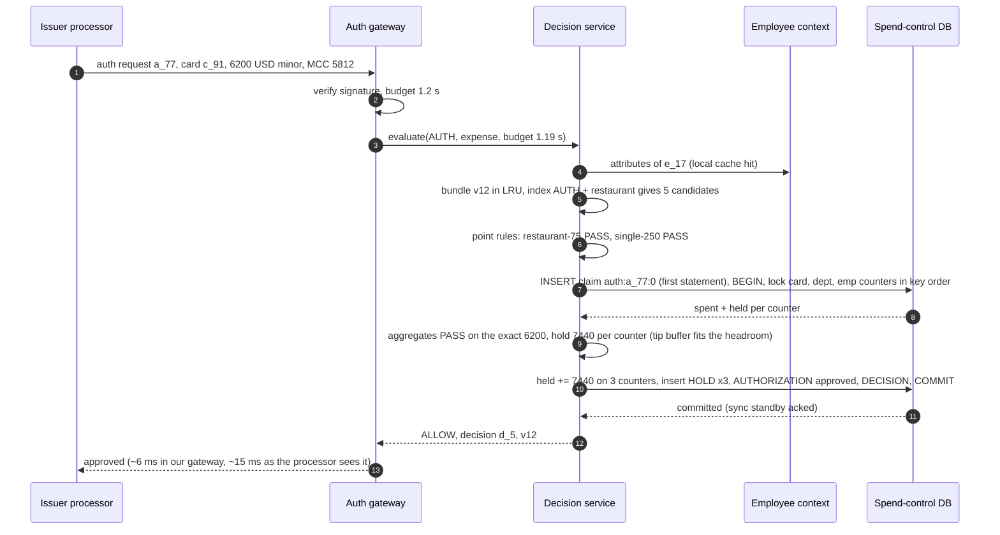

### Flow 2: two swipes race for the last $20 of a counter

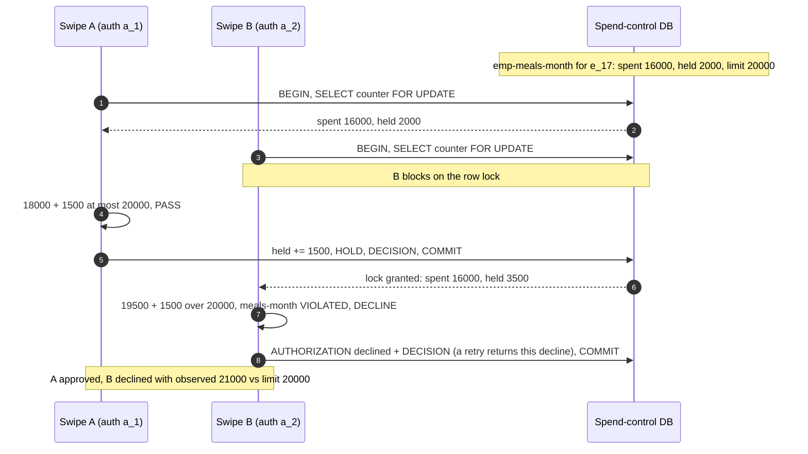

### Flow 3: the dinner captures at $84 with the tip

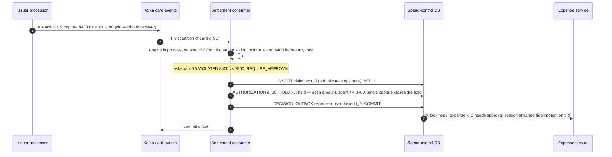

### Flow 4: an admin tightens the policy

Shown in §5.4. Summary: the admin sets "restaurant at most $60" in the UI; the draft type-checks; the 90-day simulation reports that 412 of the company's 9,800 restaurant expenses would have needed approval (they total $31,400, of which $6,900 is over the new limit) and none would have been declined, so no confirmation is needed; the admin publishes version 13 with `effective_from = now`; `policy-activated` reaches every decision service instance within ~5 s; authorizations and expenses with a spend time after activation are judged by 13; anything spent before it, including expenses in reports submitted next week, is still judged by 12.

### Flow 5: a reimbursement from submit to payout

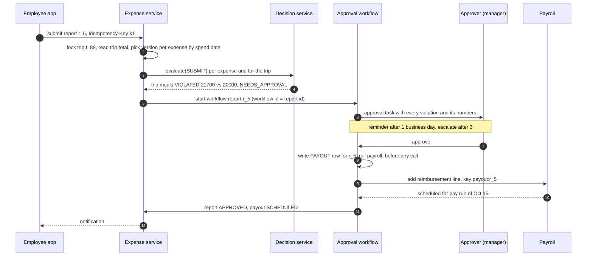

### Flow 6: a counter cluster fails over at lunch peak

Shown in §5.3 (D6) and §10.4. Summary: the primary of one physical cluster dies. For ~20 s, authorizations for its ~12.5k tenants cannot lock counters. A dead host never answers, so the server-side `statement_timeout` cannot fire; the decision service's own client deadline (300 ms) does, and the gateway answers from point rules and the degraded cap, writing each approval to the degraded journal. No swipe waits past ~350 ms. The standby is promoted at ~20 s, but the cluster stays on the fallback path in a **draining** state until every degraded journal entry for its tenants is adopted (unthrottled, because no live swipe is locking those rows: a few seconds); only then does the breaker close. Full decisions that read counters still missing thousands of degraded holds would approve past limits without being marked degraded. The aggregate rules run on the adopted spend and flag any breach. Nobody's card was declined for an infrastructure reason unless the amount was over the degraded cap.

---

## 7. Trade-offs

| Decision | Option A | Option B | Chose | Why |
|---|---|---|---|---|
| Rule representation | Code (a class per rule) or fixed columns | JSON envelope + CEL predicate, authored through templates | Envelope + CEL | New limits and new rule types without a deploy. Columns cannot express per-trip sums or compound conditions |
| Rule language | Rete engine (Drools), OPA/Rego, embedded JS or Python | CEL (Cedar a close second) | CEL | Typed, linear-time, no I/O, cost estimation, mature Go and Java runtimes. Speed is irrelevant at ~10 µs (§5.1). Cedar is analyzable too but shaped around principal, action and resource |
| Combination | Ordered rules, first match wins | Deny-only rules, outcome = max severity | Max severity | Order-independent, no conflicts, safe partial evaluation, explainable |
| Aggregate state | `SUM` at decision time, or Redis counters | Postgres counter rows with holds, locked per transaction | Postgres | Exact under concurrency and durable through failover. Redis's asynchronous replication can lose acknowledged increments |
| Concurrency control | Optimistic (version check, retry) | Pessimistic `FOR UPDATE`, sorted keys | Pessimistic | Conflicts on shared counters are expected; retries under a deadline are worse than a 2 ms wait |
| Hot counters | Split counters or escrow | One row per counter | One row | 23/s peak against ~250/s. Escrow is the seam above ~100/s |
| Tips | Hold the exact authorized amount | Hold with a 20% buffer on tip MCCs, point rules on the exact amount | Buffer on holds only | Aggregates stay right; no false declines for tips that may never come |
| Fail mode | Fail closed, or fail open | Bounded: point rules + degraded cap + journal, then after-the-fact checks | Bounded | 9,000 false declines per 30 s failover vs a capped, visible, recoverable overspend |
| Processor-side controls | None, or push the whole policy | A coarse subset, never stricter than the policy | Coarse subset | Keeps cards bounded when we are unreachable, without false declines when we are healthy |
| Policy distribution | Fetch per request, or a TTL (time to live) cache | Immutable versions pushed as `policy-activated` | Push | No invalidation problem, ~5 s activation, every decision names its version |
| Safe policy change | Canary by employee | Simulation on 90 days + shadow mode | Simulation + shadow | Fair (same policy, same answer), works for a 40-person company. Canaries are for our code |
| Which version judges an expense | The version active at submit (pinned per report) | The version in force at spend time: stored on the authorization for card spend, start of the expense date for out-of-pocket | Spend time | Never retroactive, never changes under a waiting report, and one card expense is judged by one version at AUTH, CAPTURE and SUBMIT even inside the ~5 s activation lag. Backdating is caught by the receipt-date check |
| Audit | Event-source and recompute | Snapshot ~1 KB of facts per decision | Snapshot | 46.5 GB/day is cheap; recomputation needs four complete historical logs |
| Sharding | Hash of `tenant_id` | Directory of tenants to logical shards | Directory | A big tenant can be moved alone |
| Hot path placement | Inside the main monolith | Separate gateway, decision service and DB | Separate | No unrelated deploy can decline cards |
| Reimbursement workflow | DB state machine + cron | Durable workflow (Temporal) | Temporal | Timers, reminders, re-routing and retries without hand-written recovery. A state machine in the DB is fine at small scale |
| What we refused to build | A Rete engine, a Turing-complete rule language, per-customer deployments, auto-revert of a customer's policy, cross-shard transactions, synchronous cross-region replication on the auth path | | | Each adds cost or a failure mode the requirements do not pay for |

Consistency model, stated once: **counters, holds and authorization decisions are strongly consistent within a tenant's shard (row locks, one of two synchronous standbys in the other AZs); the policy seen by evaluators is a versioned snapshot, p99 5 s stale, named on every decision; employee attributes are eventually consistent within 60 s, except termination, which is synchronous at the processor; capture effects are applied exactly once in per-card order; the decision lake and every report are eventual (minutes); a submitter has read-your-writes on their own report**. Cross-region replication is asynchronous, so a region loss can lose about a second of holds, re-synced from the processor.

---

## 8. Staff-level notes

- **Simplest thing that meets the requirement.** One engine library, one rule format, one transaction per authorization on one shard, and Postgres row locks as the whole concurrency story. We refused a Rete engine (nothing to optimize), split counters (23/s does not need them), a general scripting language (termination and isolation), per-customer deployments, and synchronous cross-region writes, and we can say why for each.
- **Failure modes and blast radius.** A decision service instance: nothing (stateless; the gateway retries another instance once, and only for failures before any DB work, such as connection refused or a draining pod, so a retry never doubles the load on a failing shard). A counter cluster: a quarter of tenants on degraded decisions for ~20 s. The employee-context store: a card swipes ~3 times a day across a dozen pods, so a pod's 60 s cache mostly misses, and stale-if-error only helps employees that pod has seen; most swipes of affected employees go to the fallback path until Redis is back. Termination is still safe. Kafka: captures and policy activations delayed and limits drift until the consumer catches up, which is why consumer lag pages. Auth keeps working, and degraded approvals spool the journal to the gateway's local disk, with the processor's webhook as the backstop. The whole service: processor static controls plus "approve on timeout". The largest blast radius is **a bad engine release** (every tenant) and **a bad policy** (every card of one tenant); the first is stopped by decision diffing and cohort rollout, the second by type-check, simulation, shadow mode and one-click rollback.
- **Migration.** From policy checks inside the monolith (or a first-generation engine): phase 1, compile every existing policy into rules and backfill counters from 60 days of captures and open authorizations. Phase 2, run the new engine in **shadow** on live authorizations, writing holds to its own counters while the old code still decides; diff every decision, aggregates included (which is why the counters come first), and fix translation bugs until the diff is explained. Phase 3, flip the deciding path per tenant cohort behind a flag, old path now in shadow; rollback is the flag. Phase 4, push static controls to the processor and switch its timeout setting to approve. Phase 5, delete the old path. No phase needs a coordinated deploy.
- **Operability.** SLOs over 28 days: 99.99% of authorizations answered inside the processor deadline with a non-degraded decision; gateway p99 under 50 ms; policy activation p99 under 5 s; 100% of replays identical (decisions marked `facts_lost` after a region loss are excluded by name and counted). Pages at 3am: processor-reported timeouts above 0.1% for 2 minutes; degraded decisions above 1% for 1 minute; a counter cluster failover; decline rate for **all** tenants 2x its baseline (an engine or data bug, not a customer); card-events consumer lag above 5 minutes (limits are drifting); nightly hold reconciliation mismatch above 0.1%; any replay mismatch. A single tenant's decline spike is a notification to that tenant's admins, not a page.
- **Cost.** Small next to the value on the line. 4 Postgres clusters of 4 instances each (primary, two sync-standby candidates in the other AZs, a cross-region replica), 6 decision-service pods per region, a shared Kafka, and ~24 TB in the lake after 7 years (a few hundred dollars a month at object-storage prices). The engineering cost is a spend-platform team of 6 to 8 that owns the engine, the auth path and the counters. The expense product team owns reports and workflow, payroll owns payouts, the HRIS team owns the attribute events, and the card-program team owns the processor relationship. The contracts between them are the rule envelope, the facts schema and the `Decision` type.
- **Explicit trade-off.** We accept a bounded, visible overspend during failures to avoid false declines, and we accept a ceiling of ~250 lock holds/s on any single counter in exchange for a concurrency story that fits in one sentence.

---

## 9. What is expected at each level

**Mid (80/20 breadth/depth).** Writes `evaluateRules` with rules as objects or data, returns a list of violations per expense, handles the per-trip rules with a group-by, and uses integer cents. For scale: a rules service with a cache, a database of expenses, and "evaluate on submit". May not separate card authorization from reimbursement, and may not notice the concurrency problem on totals.

**Senior (60/40).** Designs the return type deliberately (all violations, amounts, expense vs trip level), stores rules as data with versions, caches compiled rules per tenant, and splits the synchronous authorization path from the asynchronous report path. Uses atomic counters for limits and knows authorizations can be reversed or captured for a different amount. Goes deep on one of: the rule model, the counters, or the approval workflow.

**Staff+ (40/60).** Everything above, plus: says in the first minute that evaluation is cheap and state and safety are hard; knows the processor deadline and what the processor does on timeout; uses holds that become spend at capture, locks counters in sorted order in one shard, and does the hot-counter arithmetic before refusing to shard counters; handles tips, incrementals, refunds and expiry; states which rules cannot be enforced before the money moves; designs the three fallback layers and argues bounded overspend over fail closed, with the credit-exposure exception; treats a policy change as a deploy (type-check, simulate, shadow, forward-only versions, one-click rollback) and canaries only our own code; makes decisions replayable from facts and versions; and gives the shadow-first migration from the old path.

---

## 10. Nitty-gritty (past interview scope)

### 10.1 Internals of each chosen technology

**The engine (CEL inside an envelope).** A CEL expression goes through parse, then check against declared types (`expense`, `employee`, `trip`, `counters`), then planning into an evaluable program. Checking is where `amout` or `expense.amount > "75"` fail, with a source position. The planner produces a tree of interpretable nodes; evaluation walks it against an activation (the facts). CEL is linear in the expression and the input only when macros are disabled; macros such as `exists` and `all` iterate over the input's lists, and nested ones cost n × m. So we rely on the checker's cost estimate to reject an expensive rule at save time, plus a runtime cost limit (a budget in operations, never a wall-clock timeout, so a slow host cannot change a result). The envelope is interpreted by our code, not by CEL: scope matching (a set intersection on attribute ids), the aggregate (which counter keys, which limit) and the action. Custom functions (`in_mcc_group`, `days_between`) are registered by the host and versioned with the engine. [`deep-dives/rule-model-and-evaluation.md`](deep-dives/rule-model-and-evaluation.md).

```mermaid
%% How one rule goes from text to a decision. Compile-time steps run once per publish; only the last box runs per swipe.
flowchart LR
    T[Template + params<br/>or raw envelope] -->|"expand"| P[Parse CEL]
    P -->|"AST"| C[Type-check against<br/>expense, employee, trip]
    C -->|"checked AST, cost estimate"| PL[Plan program]
    PL -->|"program + index entries"| B[(Bundle vN)]
    B -->|"load once per version"| E[Evaluate per swipe<br/>~1 us per rule]
    C -.->|"type error with position"| T

    class T client
    class P,C,PL,E service
    class B store

    classDef client   fill:#dbeafe,stroke:#2563eb,stroke-width:2px,color:#111
    classDef service  fill:#dcfce7,stroke:#16a34a,stroke-width:2px,color:#111
    classDef store    fill:#ede9fe,stroke:#7c3aed,stroke-width:2px,color:#111
```

**Postgres as the counter store.** `SELECT ... FOR UPDATE` takes a row-level lock that blocks other writers and other `FOR UPDATE` readers of the same row until commit; plain readers are not blocked (MVCC). Locking counter rows in sorted key order means two transactions always ask for shared rows in the same order, which rules out deadlock. The first use of a counter in a window upserts the row (`INSERT ... ON CONFLICT DO NOTHING`), in sorted key order and in autocommit before `BEGIN`, so the upsert cannot deadlock either. The global lock order is `PROCESSOR_EVENT` claim, `AUTHORIZATION`, `HOLD`, then `COUNTER` rows by key, for the auth path, every lifecycle event and the sweeper (which takes `AUTHORIZATION` with `SKIP LOCKED`). Commit waits for one of two synchronous standbys (`synchronous_standby_names = 'ANY 1 (standby_az2, standby_az3)'`, `synchronous_commit = on`), which costs ~1 to 2 ms across AZs, makes an AZ loss lose nothing, and survives losing a standby. With a single candidate, losing it would stop every commit. `lock_timeout` and `statement_timeout` are set per transaction from the remaining budget, so a stuck lock turns into a fast fallback instead of a missed deadline. [`../../concepts/mvcc-and-isolation.md`](../../concepts/mvcc-and-isolation.md).

**Kafka.** `card-events` is partitioned by `card_id`, so two events for one card are never applied at the same time. That is all partitioning buys: Kafka keeps the order in which events reached the receiver, and webhook retries are independent, so a reversal can still arrive after a capture it preceded. Correctness comes from the `PROCESSOR_EVENT` claims, holds that move only their open amount, end states that cannot be reopened, and ignoring a status update older than the authorization's last applied event (by processor timestamp). The consumer applies an event and records its processor id in the same Postgres transaction (a unique constraint), then commits the offset; a crash between the two replays the event, and the unique constraint turns the replay into a no-op. `policy-activated` is keyed by tenant and log-compacted, so a new decision-service instance reads the latest version per tenant at boot. The degraded journal is keyed by tenant and kept 7 days. [`../../concepts/exactly-once.md`](../../concepts/exactly-once.md).

**Temporal for approvals.** One workflow per report, workflow id = report id, so a duplicate submit cannot start a second one. The workflow code is deterministic and replayed from its event history after a worker crash; side effects (notify, add payroll line) are activities with their own idempotency keys. Timers implement reminders and escalation without a cron; business days come from the tenant's holiday calendar through an activity, never from workflow code. An approval is written to the DB and signalled to the workflow through an outbox, so a crash between the two cannot lose it. Changing routing code while ~100k workflows are open needs Temporal's versioning (patching) API, or old histories stop replaying. [`../../concepts/temporal-durable-execution.md`](../../concepts/temporal-durable-execution.md).

**The processor's synchronous webhook.** One HTTPS request per authorization, signed by the processor; the answer is a body such as `{"approved": true}` with a 200. Stripe: 2 s, then the timeout setting decides. Lithic: declined after 6 s, answer within 3 s recommended. Marqeta: on no response, Commando Mode decides from preconfigured rules. The gateway keeps warm TLS connections, pins no state, and runs in the processor's cloud region to keep the first and last 5 ms small.

### 10.2 Configuration knobs that matter

| Component | Knob | Value | Why |
|---|---|---|---|
| Gateway | internal deadline | processor deadline − 800 ms (1.2 s for Stripe) | Answer with our fallback, not the processor's default |
| Decision service | client deadline / connect timeout | 300 ms / 50 ms [estimate] | A dead primary never answers, so only a client-side deadline turns it into a fallback |
| Decision service | DB `statement_timeout` / `lock_timeout` / `idle_in_transaction_session_timeout` | 300 ms / 100 ms / 200 ms [estimate] | A live but stuck server or a long lock wait becomes a fallback for that request, and a GC-paused client cannot sit on row locks between statements |
| Gateway | circuit breaker | one per physical cluster; opens on 5 consecutive connect errors, client deadlines, statement timeouts or read-only errors, never on `lock_timeout` | One tenant's hot row must not put a quarter of all tenants into degraded mode |
| Settlement consumer, journal replay | catch-up rate | ~200 writes/s per shard [estimate], alert while throttled | After an outage, catch-up must not starve the live authorizations that lock the same rows |
| Decision service | bundle LRU | 1 GB | Every tenant active in the last hour |
| Decision service | attribute cache TTL | 60 s | Bounded staleness for scope; termination does not depend on it |
| Engine | CEL cost limit per rule / rules per tenant | fixed per plan / 10k | Reject expensive rules at save time |
| Counters | tip buffer on tip MCCs | 20% [estimate] | Aggregates do not end over by the tip |
| Counters | hold expiry backstop | processor's per-MCC expiry + 1 day | The processor's webhook is primary; the sweeper is a backstop |
| Postgres | synchronous standby | `ANY 1` of 2 candidates in the other AZs | RPO (recovery point objective) 0 on AZ loss for ~1 to 2 ms per commit; one candidate lost does not stop writes |
| Postgres | `max_slot_wal_keep_size` on CDC slots | ~100 GB [estimate], page on slot lag | A stalled CDC connector must not fill the primary's disk |
| Degraded mode | per-tenant cap | $500 default, $0 allowed | Bounds overspend during a failover |
| Processor | timeout setting | approve | Safe only because static controls bound it |
| Policy | shadow suggestion / confirm threshold | 7 days / newly declined over 2% or newly needing approval over 10% | Stops the "amount > 0" class of mistake and the "everything to approval" one |
| Policy | processor push of a new `DECLINE` rule | after a 24 h soak [estimate] | A rollback never waits on the processor |
| Policy | post-activation watch | 30 min, alert at 3x baseline decline rate | Tells the admin fast, does not override their intent |
| Engine rollout | shadow diff, then cohorts | 24 h, then 1%, 10%, 50%, 100% | Our code is the widest blast radius |
| Kafka | `card-events` partitions | 64, key `card_id` | Per-card order, parallel consumers |
| Temporal | reminder / escalation | 1 / 3 business days | Approval latency without spamming |

### 10.3 Capacity math per component

| Component | Per unit | Total | Limit and headroom |
|---|---|---|---|
| Auth gateway | ~500 req/s per pod at ~10 ms | 2k/s peak on 6 pods per region | CPU-light; sized for AZ loss at 2x |
| Decision service | 2k evals/s × ~10 µs CPU = 0.02 core for rules; the rest is I/O wait | 6 pods per region | Memory: 1 GB bundles + 0.5 GB attribute cache per pod |
| Spend-control DB cluster | ~500 txn/s at peak (a quarter of 2k/s), ~5 statements each | 4 clusters | Low single-digit % of a primary's capacity; **the hottest row (~23/s against ~250/s) is the nearest limit** |
| Spend-control DB storage | per logical shard: ~0.4 GB counters, ~0.06 GB holds, ~170 GB hot AUTH and CAPTURE decisions | ~2.7 TB | Fine; decision partitions older than 90 days are dropped once the lake's count matches |
| Employee context | 3 M employees × ~1 KB | 3 GB | One small Redis cluster with a replica |
| Kafka `card-events` | 13 M/day × 2 KB = 26 GB/day | 1.5k/s peak | Trivial |
| Decision stream to lake | 46.5 GB/day raw, ~9 GB/day Parquet | ~24 TB after 7 years | Object storage |
| Simulator | largest tenant 27 M expenses ≈ 540 core-seconds | 64-core pool, per-tenant quota 2 jobs | Interactive for all but the largest few tenants |
| Approval workflow | ~330k workflows/day (~100k with a human approval), ~5 activities each | ~20 activities/s average, ~600/s in a month-end peak hour | Well within a small Temporal cluster |

Nothing is near a limit at the design point. The first real limit is **a single counter above ~250 lock holds/s** (~100/s is where escrow starts), then **one physical cluster's share of peak** at roughly 20x today's volume, which is when logical shards move to more clusters.

### 10.4 Failure timeline

Cluster failover at lunch peak (Flow 6), second by second:

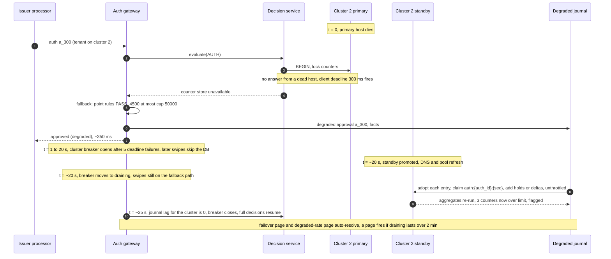

Bad policy published, minute by minute: t = 0, an admin confirms past the simulation warning and publishes "all entertainment declined" meaning "needs approval"; t + 5 s, every evaluator enforces v13; t + 10 min, the tenant's decline rate is 4x its baseline and the admin gets an alert naming the rule, with one-click rollback; t + 11 min, rollback publishes v14 (= v12's rules); t + 11 min 5 s, enforced everywhere. Declined swipes in between are visible in the decision log and the admin can message the employees.

Processor cannot reach us (network cut or a bad gateway deploy): the processor's static controls still apply to every swipe; after 2 s Stripe applies the timeout setting (approve); the gateway's own health checks page at 30 s; when the path is back, the processor's `authorization.created` events for the approvals made in our absence arrive (Marqeta explicitly stores webhooks for later transmission; Stripe marks them `webhook_timeout`), and the settlement consumer **adopts** each one: `AUTHORIZATION` and holds inserted, no re-decision, aggregates re-run, breaches flagged. So an open hotel authorization counts against limits at once, not days later at capture. A capture that still arrives for an unknown authorization creates it in its end state first.

### 10.5 Exactly-once and idempotency end to end

| Hop | Where duplicates come from | Dedup key | Where removed | Lifetime |
|---|---|---|---|---|
| Processor to gateway (auth) | Retries across our failover, duplicate delivery | `auth:{auth_id}:0` | `PROCESSOR_EVENT` claim, the first insert of the transaction; a repeat returns the stored result, declines included | 90 days in the shard |
| Incremental authorization | Same | `auth:{auth_id}:{seq}` | Same claim; the delta is added to the open amount of the existing holds | Life of the hold |
| Lifecycle webhooks to Kafka | Webhook retries, receiver retries | `txn:{transaction_id}`, `rev:{id}` | Same claim, inside the consumer's DB transaction | 90 days |
| Capture to expense row | Crash after COMMIT, before the expense service hears | transaction id | Outbox row written in the capture's transaction; the expense upsert is idempotent on it | Until relayed |
| Kafka to settlement consumer | Offset committed after the DB write | same id | Same constraint makes the replay a no-op | |
| Degraded journal replay and adopt | Replay after a partial replay, a lifecycle event that arrived first | `auth:{auth_id}:{seq}` | Adopt claims the event key in `PROCESSOR_EVENT`. For seq 0 it skips an authorization that already exists (open or closed); for an incremental (seq 1 or more) it adds the delta to the existing holds. The counter moves only if the hold write returned a row | 7 days |
| Report submit | Double tap, app retry | `Idempotency-Key` + report id | State transition from `DRAFT` or `RETURNED` only; Temporal workflow id = report id, kept open through `RETURNED`, id-reuse policy rejects duplicates | Report lifetime |
| Approval decision | Double click, a manager and their delegate at once | `task_id` (one task per step, with a set of eligible approvers) | Task state transition from `PENDING` only, then signalled to the workflow through an outbox | Report lifetime |
| Payout | Workflow activity retry, a retry after the ledger's 24 h key expired, a rail switch, an ACH return | `PAYOUT` row unique per report, holding rail and `ledger_payment_id` | Row written before any call; retries look up the stored ledger payment id; the ledger key (24 h) covers only the first day; the rail changes only after the first rail confirms no payment; a returned ACH payment is re-paid as a new `PAYOUT_ATTEMPT` under the same row | 7 years |

The one place duplicates would cost money is the payout. The trap is key lifetime: [`../payments-ledger/`](../payments-ledger/) keeps its idempotency record for 24 h, but a Temporal activity can retry for days. So the `PAYOUT` row, which lives 7 years, is the real guard, and the ledger key only covers the first day.

### 10.6 Consistency model per edge

| Edge | Model | Why |
|---|---|---|
| Processor to gateway to decision service | Synchronous request, idempotent on `auth_id` | One answer per authorization |
| Decision service to spend-control DB | Strong: row locks, single-shard transaction, sync standby | The limit guarantee |
| Policy DB to evaluators (`policy-activated`) | Versioned snapshot, p99 5 s, named on each decision | Immutable versions, no invalidation |
| HRIS to employee-context projection | Eventual, p99 60 s, `attribute_version` on each decision | Scope changes are rare and not urgent |
| HRIS termination to processor card status | Synchronous in the offboarding flow | The one attribute change that must never lag |
| Processor lifecycle to counters (Kafka) | Exactly-once effect, per-card order, lag minutes at worst | Limits drift only as far as consumer lag |
| Expense service to decision service (SUBMIT) | Strong on the trip row (`FOR UPDATE`), trip total passed as a fact, version by spend time | Two reports on one trip cannot both pass, and a policy change is never retroactive |
| Spend-control DB to lake (CDC) | Eventual, minutes | Audit and simulation, not decisions |
| Report state for the submitter | Read-your-writes (primary reads) | The employee sees their own submit |
| Cross-region replica | Asynchronous, ~1 s | RPO ~1 s of holds and decisions; holds re-synced from the processor, decisions rebuilt as `facts_lost` |
| Gateway in the non-home region to the home region | One forwarded RPC per authorization | Never a cross-region multi-statement transaction |

### 10.7 Alternatives rejected

| Alternative | Why it looked attractive | Why rejected |
|---|---|---|
| Drools / Rete | "Rules engine" is literally its name; shared joins across rules | One fact per evaluation, ~8 candidate rules, ~10 µs. Its strengths do not apply, and its rule language is Turing-complete Java |
| OPA / Rego | Mature, used for policy everywhere, partial evaluation | Datalog-style semantics are harder for admins and for us to type-check against a money schema; the Cedar paper measured it 42.8x to 80.8x slower than Cedar at the median. Speed is not the reason, fit is |
| Cedar | Analyzable (its SMT encoding checks policies in 75.1 ms on average), forbid-overrides-permit semantics like ours | Built around principal, action and resource authorization; our facts are an expense and counters. A strong choice if analysis ("can any rule decline all spend?") becomes a requirement |
| Embedded Python or JavaScript | Maximum flexibility, Rippling is a Python shop | Termination, sandboxing, determinism and tenant isolation all become our problem |
| Redis counters with Lua | Sub-millisecond atomic check-and-increment | Asynchronous replication can lose acknowledged holds on failover; Postgres at ~4 ms is well inside budget |
| DynamoDB conditional writes | Serverless, conditional update is exactly "increment if under limit" | Multi-rule, multi-counter evaluation needs a transaction over several items and a read of all of them first; Postgres's lock-evaluate-write is simpler. Viable at larger scale |
| Evaluate everything at submit only | No real-time path at all | Card spend is most of the volume, and the whole point of a corporate card policy is to stop the swipe |
| The processor's controls only | No real-time integration to build | Stripe's spending-limit aggregation is best-effort with up to 30 s of delay, and it cannot express HRIS scope, trips or approvals |

### 10.8 How the big companies do it

- **Stripe Issuing** splits the problem the same way: card-level `spending_controls` that "run before real-time authorisations" with categories and interval limits, then a synchronous `issuing_authorization.request` answered within 2 s, with a timeout setting when you miss it. Its own interval limits are aggregated "on a best-effort basis" with up to 30 s of delay, which is exactly why exact limits live in our engine, not theirs. Captures "always succeed" once an authorization was approved.
- **Marqeta and Lithic** show the fallback chain: Marqeta falls back to Commando Mode, deciding "based on defined business rules" and storing webhooks for later; if the network cannot reach Marqeta, the network does STIP. Lithic declines after 6 s and warns that answers slower than 3 s get voided more often.
- **Brex pluggable authorizations** (Brex Tech Blog, Jul 2022, shipped late 2020): the transactions processor asks several team-owned plugins (credit limits, budgets, fraud controls) in parallel "with a short timeout on the RPC", because otherwise "the card network will assume that Brex's authorization endpoint is down and will make its own decision". A plugin that times out gets a per-plugin default decision (some default to approve, some to decline), and "if any plugin declines the transaction, then Transactions processor declines". That is our max-severity combination and our fallback, organized around team boundaries instead of one engine. We chose one engine with rules as data because at Rippling the rules belong to customers, not to internal teams.
- **Grab Griffin** (anti-fraud rules engine) evaluates rules in memory only, "100K+ QPS at peak time (on only 6 regular EC2s)" with "< 6ms" per prediction. Rule changes went from "1 week" to "1 minute", and because "anyone can turn the whole checkpoint down", they added shadow mode and percentage rollout per rule. Our §5.4 is the same lesson, applied to customers instead of analysts.
- **Monzo Stand-in** is a separate minimal platform that approves card payments when the primary is down, costing "around 1% of the cost of our Primary Platform". Its approvals are applied to the primary "verbatim", accepting that a stale balance may push a customer into an unapproved overdraft. It is the bounded-overspend trade-off of §5.3 at bank scale.
- **AWS Cedar** (Amazon Verified Permissions) chose deny-overrides semantics and a language small enough to verify with an SMT solver. It is the direction to take if customers ask "prove my policy can never decline the CEO's travel".

### 10.9 Operational runbook

- **Dashboards (the five):** authorizations/s and outcome mix per region; gateway latency p50/p99/p99.9 and processor-reported timeouts; degraded-decision rate by cluster; card-events consumer lag and hold reconciliation mismatches; decline rate against baseline, fleet-wide and top-20 tenants.
- **Alerts:** processor timeouts above 0.1% for 2 min (page); degraded rate above 1% for 1 min (page); consumer lag above 5 min (page); fleet-wide decline rate 2x baseline (page, engine team); reconciliation mismatch above 0.1% (ticket, page above 1%); replay mismatch (page, engine team); a single tenant's spike (tenant admin notification).
- **Rollout:** engine releases go shadow-diff for 24 h, then tenant cohorts 1%, 10%, 50%, 100% over 3 days with automatic rollback on decline-rate anomaly. Gateway and decision service deploy one AZ at a time; never during the US lunch peak.
- **Rollback:** engine by pinning the previous version per cohort (bundles are engine-agnostic data, so no data migration); a tenant's policy by one-click rollback. Decisions made by a bad release are found in the lake by `engine_version` and re-run; wrongly flagged expenses are cleared in bulk. A wrongly declined swipe cannot be undone; the employee retries.

### 10.10 Security and abuse

- **Auth boundaries.** Processor webhooks are verified by signature and source; the gateway accepts nothing else. Policy edits require a spend-admin role; publishing a rule that can decline company-wide spend needs a second admin. Every policy change is audit-logged with actor and diff.
- **Tenant isolation.** Bundles are keyed by tenant; facts are assembled server-side from the authenticated card or employee; CEL has no I/O and can only read the activation we build. A rule cannot reference another tenant's data because no such data is ever in its activation.
- **Employee abuse.** Split purchases ($400 as two $200s to dodge "no single expense over $250"): an aggregate rule over `(employee, merchant, day)` catches it at authorization. Its template defaults to `REQUIRE_APPROVAL`, not `DECLINE`, because people legitimately buy twice at one merchant in a day, and its daily counters are dropped with their window. Self-approval: the approver can never be the submitter, and if the manager chain resolves to the submitter it skips a level. MCC gaming (merchants misclassify): rules can use merchant enrichment facts as well as MCC.
- **Admin mistakes as abuse vectors.** The simulation guard and second-admin rule stop one careless or malicious admin from freezing a whole company.
- **Data.** Decisions hold merchant names, locations and amounts: encrypted at rest, access by support logged. Erasure requests (GDPR, CCPA) meet financial-record retention: the decision stays for the retention period with the employee pseudonymized where the law allows, and is deleted after.
- **Rate limits.** `evaluate` and `simulate` are per-tenant rate-limited; simulation runs on its own pool, so a script hammering it cannot touch authorizations. [`../../concepts/rate-limiting-and-load-shedding.md`](../../concepts/rate-limiting-and-load-shedding.md).

### 10.11 Evolution

- **10x volume (20k auth/s).** Move logical shards onto more clusters (the directory makes it a per-shard move); the decision service scales horizontally. The first counter to pass ~100/s gets escrow slices. The settlement consumer becomes a limit too: 64 `card-events` partitions applied one transaction at a time at ~4 ms is ~250/s per partition, which 10x traffic (~15k/s peak) saturates, so it applies different cards in parallel within a partition (order matters only per card) and the topic grows.
- **ML risk score.** A scoring call becomes one more fact before evaluation, with its own 20 ms budget and a default when it is slow; rules can read `risk.score`. The score and model version go into the facts, so replay still works.
- **"Can I buy this?" in the app.** The same `evaluate` in `AUTH` context without holds, clearly labelled advisory.
- **Per-country policy and data residency.** Tenants get a home region per legal entity; the shard directory already places tenants, so EU tenants live on EU clusters, and their decisions go to an EU lake.
- **Rules outside spend.** Rippling's workflow automation (onboarding, device, app access) wants the same thing: typed predicates over employee facts, versioned, simulated, explainable. The engine library and envelope become a platform with pluggable fact schemas; spend is its first tenant.
- **LLM-written rules.** An admin describes a policy in words and a model drafts rules. Nothing changes below the draft: the draft still type-checks, simulates and shadows before it enforces, which is the guardrail.

---

## 11. Follow-up questions to expect

Ranked by how likely an interviewer asks them. Answers in [`edge-cases.md`](edge-cases.md) and the deep dives.

1. **What does `evaluateRules` return, and why?** §3.2, [`deep-dives/rule-model-and-evaluation.md`](deep-dives/rule-model-and-evaluation.md).
2. **How does an admin add a new rule type without a deploy?** Templates plus CEL, §4.1.
3. **Two swipes on the same trip or month at the same moment?** Lock-evaluate-hold, §5.2, [`deep-dives/aggregates-holds-and-concurrency.md`](deep-dives/aggregates-holds-and-concurrency.md).
4. **What is on the auth hot path, and what happens at the deadline?** §5.1, §5.3, [`deep-dives/authorization-hot-path.md`](deep-dives/authorization-hot-path.md).
5. **The tip pushes the dinner over the limit.** Capture re-evaluation and the hold buffer, §5.2.
6. **Your database fails over at lunch.** Fallback layers, §5.3, [`deep-dives/degraded-modes-and-region-loss.md`](deep-dives/degraded-modes-and-region-loss.md).
7. **An admin publishes a rule that declines everything.** §5.4, [`deep-dives/safe-rule-changes.md`](deep-dives/safe-rule-changes.md).
8. **Why was this declined six months ago?** §5.5, [`deep-dives/audit-replay-and-determinism.md`](deep-dives/audit-replay-and-determinism.md).
9. **A policy changes while a report waits for approval.** Nothing changes: each expense is judged by the version in force when it was spent, §4.4, [`deep-dives/reimbursement-workflow-and-payout.md`](deep-dives/reimbursement-workflow-and-payout.md).
10. **Why not Drools, OPA or Redis?** §10.7.
11. **Trip rules at swipe time?** `NOT_EVALUABLE` unless a booked trip covers today, §5.2.
12. **One customer is 100x bigger than the median.** §5.6.
