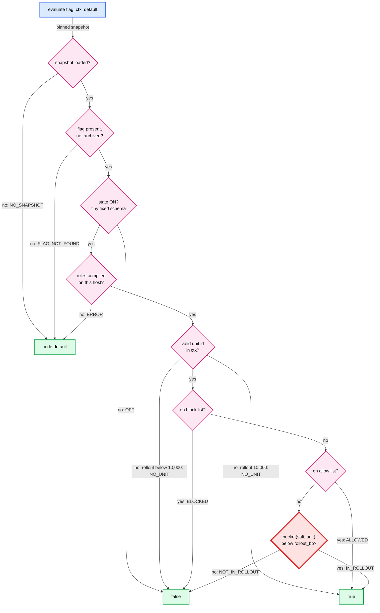
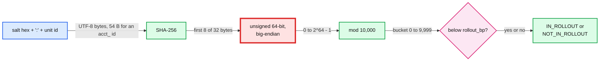

# Deep dive: evaluation and bucketing

> One-line answer: a check walks a fixed 9-step order (no snapshot, missing flag, kill switch, unparseable rules, missing unit, block list, allow list, then the bucket) and returns a value plus a reason. The bucket is `uint64_be(SHA-256(utf8(salt + ":" + unit))[0:8]) mod 10,000`, compared with `rollout_bp`. Measured below on 1 M synthetic merchant ids: a ramp from 10% to 20% to 50% loses **0** units, two flags at 10% overlap on **9,900** (expected 10,000), and the 10,000 buckets pass a chi-square test (p = 0.49). The bias of `mod 10,000` is **7 x 10^-17**. The real cross-language risk is not the hash or float rounding. It is reading 8 bytes as an **unsigned** 64-bit integer: the obvious Java code disagrees with Go on **50%** of buckets, and the obvious JavaScript code on **99.7%**. A 10,000-row golden file catches all of it.

Design context: [`../solution.md`](../solution.md) §4.1 (the order and the formula), §5.1 (pinning and memoizing), §5.2 (why a salted hash), §7 (hash choice), §8 (`legacy_v1` buckets during migration). Siblings: [`fail-static-and-bad-snapshots.md`](fail-static-and-bad-snapshots.md) for where `NO_SNAPSHOT` and `ERROR` come from, [`lists-segments-and-cross-service.md`](lists-segments-and-cross-service.md) for the block and allow lookups when a list is a segment.

---

## 1. The evaluation order, and why each step sits where it does



| Step | If | Returns | Reason | Why here | OpenFeature mapping |
|---|---|---|---|---|---|
| 0 | No snapshot in the process | code default | `NO_SNAPSHOT` | Nothing else can be read. The call site's default is the only answer left | `ERROR`, code `PROVIDER_NOT_READY` |
| 1 | Flag missing or archived | code default | `FLAG_NOT_FOUND` | A typo or a deleted flag must not change behaviour. The default is what the code did before the flag existed | `ERROR`, code `FLAG_NOT_FOUND` |
| 2 | `state == OFF`, read first with a tiny fixed schema | false | `OFF` | The kill switch. It beats every list, and it lands even where this host cannot parse the rules | `DISABLED` |
| 3 | The rest of the record failed to compile on this host, or its `min_sdk_level` is above this SDK's | code default | `ERROR` | Per-flag isolation: one bad record costs one flag, not 20k. After OFF, so a kill is never lost to a parse failure or an old SDK | `ERROR`, code `PARSE_ERROR` |
| 4 | Unit id missing, empty, not a string, or not valid Unicode | `rollout_bp == 10,000` | `NO_UNIT` | Lists and buckets both need the id. An empty string is "missing": otherwise every anonymous request shares one bucket and flips together | `DEFAULT` (not an error) |
| 5 | Unit on the block list | false | `BLOCKED` | "Must never get this" (legal, opt-out). Beats allow | `TARGETING_MATCH` |
| 6 | Unit on the allow list | true | `ALLOWED` | Test accounts and design partners, at any rollout including 0 | `TARGETING_MATCH` |
| 7 | `bucket < rollout_bp` | true | `IN_ROLLOUT` | The only step that hashes, so it runs last and only when reached | `SPLIT` |
| 8 | otherwise | false | `NOT_IN_ROLLOUT` | | `SPLIT` |

The OpenFeature names are the spec's 8 reasons and 8 error codes ([`types.md`](https://raw.githubusercontent.com/open-feature/spec/main/specification/types.md)). The mapping is ours, so an OpenFeature provider over this SDK is a thin adapter.

Four sharp edges to say out loud:
- **Code default is a safety decision, not a placeholder.** Steps 0, 1 and 3 return it. Write the value that is safe when the flag system knows nothing: `false` for a release flag.
- **The kill is read before the rules.** Every record starts with a tiny schema (`state`, `version`) that never changes name, type or position, and the loader reads it first. A host that meets a corrupt rule, or a flag whose `min_sdk_level` is above its SDK, still honours a kill. Only a flag that is ON with rules this host cannot use falls back to the code default, and `ERROR` alerts within a minute.
- **Off for everyone except test accounts** is `state ON, rollout 0, allow = [test accounts]`, never `state OFF` plus an allow list.
- **A propagated decision slots in right after step 2.** For a flag marked `propagate`, a `flag=value@version` passed by an mTLS internal peer stands in for steps 3 to 8, so one request sees one answer across services. A local kill (step 2) still beats a propagated ON.

## 2. The bucket function, byte by byte



- **The salt is part of the version.** It is a column of every flag version, copied forward and replaced only by a reshuffle. A revert to a pre-reshuffle version restores the old buckets, and "who was in at 14:02" is answerable from history.
- **Sticky per seq, not per flag version.** Same unit and same seq give the same answer on every host and in every language. The seq fixes the flag version (salt, rollout, inline lists) and the version of every segment it references. A segment edit changes answers with no new flag version.
- **Pin the salt's text form.** The salt is 16 random bytes, but the formula concatenates strings, so the spec says: lowercase hex, 32 characters. The input is then `32 + 1 + 21 = 54` bytes for a Stripe-style `acct_` id. That fits one 64-byte SHA-256 block up to a 22-byte id. Longer ids cost a second block.
- **The `:` is safe** because the salt has a fixed length and no `:`. A unit id that contains `:` (`a:b`) cannot collide with another salt and unit pair.
- **No normalization.** `café` typed as one code point (5 bytes) and as `e` plus a combining accent (6 bytes) are different ids with different buckets. Ids are bytes. Merchant ids are ASCII in practice, but the golden file still pins it.
- **The exact unsigned read per language:** Go `binary.BigEndian.Uint64(d[:8]) % 10000`, Java `Long.remainderUnsigned(ByteBuffer.wrap(d).getLong(), 10_000)`, Node `d.readBigUInt64BE(0) % 10000n`, Ruby `d.unpack1("Q>") % 10_000`, Python `int.from_bytes(d[:8], "big") % 10_000`.

How the others do it (all from [`../research/facts-survey.md`](../research/facts-survey.md)): LaunchDarkly hashes `key.salt.value` with SHA-1 and divides the first 15 hex digits by `0xFFFFFFFFFFFFFFF` in `float32`, weights in 0.001% steps. Unleash takes MurmurHash3 x86 32-bit of `groupId:userId`, seed 0, `(hash % 100) + 1`, with `groupId` defaulting to the flag name. GrowthBook v2 runs FNV-1a 32-bit twice into 10,000 buckets. flagd hashes `flagKey + targetingKey` with murmur3. Every one puts something per-flag into the input. That is the independence property.

## 3. Measured: sticky, monotonic, independent, uniform

One seeded run over 1 M synthetic merchant ids (`acct_` plus 16 random alphanumerics).

```python
import hashlib, math, random

def h64(salt: str, unit: str) -> int:              # salt = 32 lowercase hex chars
    return int.from_bytes(hashlib.sha256((salt + ":" + unit).encode("utf-8")).digest()[:8], "big")

rng = random.Random(56)
ALNUM = "0123456789ABCDEFGHIJKLMNOPQRSTUVWXYZabcdefghijklmnopqrstuvwxyz"
units = ["acct_" + "".join(rng.choices(ALNUM, k=16)) for _ in range(1_000_000)]
salt_a, salt_b = rng.randbytes(16).hex(), rng.randbytes(16).hex()
h = [h64(salt_a, u) for u in units]
a = [x % 10_000 for x in h]                        # the bucket
cohort = lambda bs, bp: {i for i, x in enumerate(bs) if x < bp}

# 1. Sticky and monotonic: ramp 10% -> 20% -> 50%
c10, c20, c50 = cohort(a, 1_000), cohort(a, 2_000), cohort(a, 5_000)
print(f"cohorts 10/20/50%: {len(c10):,} / {len(c20):,} / {len(c50):,}")
print(f"lost on 10->20: {len(c10 - c20)}, lost on 20->50: {len(c20 - c50)}")
m20, m50 = {i for i, x in enumerate(h) if x % 5 == 0}, {i for i, x in enumerate(h) if x % 2 == 0}
print(f"contrast, in iff hash % (100/pct) == 0, lost on 20->50: {len(m20 - m50):,} of {len(m20):,}")
c10_new = cohort([h64(rng.randbytes(16).hex(), u) % 10_000 for u in units], 1_000)   # reshuffle: new salt
print(f"reshuffle at 10%: kept {len(c10 & c10_new):,}, lost {len(c10 - c10_new):,}, "
      f"gained {len(c10_new - c10):,}")

# 2. Independent: two flags at 10%
print(f"overlap A10% & B10%, own salts: {len(c10 & cohort([h64(salt_b, u) % 10_000 for u in units], 1_000)):,}")
unsalted = [int.from_bytes(hashlib.sha256(u.encode()).digest()[:8], "big") % 10_000 for u in units]
print(f"flags that hash the unit only share one cohort: {len(cohort(unsalted, 1_000)):,} units")
print(f"shared salt, B at 5% outside A at 10%: {len(cohort(a, 500) - c10)}")
print(f"same, after A alone is reshuffled: {len(cohort(a, 500) - c10_new):,} of {len(cohort(a, 500)):,} outside")

# 3. Uniform: chi-square over 10,000 buckets, 1 M ids, 9,999 degrees of freedom
def chi2(bs, k=9_999):
    n = [0] * 10_000
    for x in bs: n[x] += 1
    x2 = sum((c - 100) ** 2 / 100 for c in n)       # 100 expected per bucket
    z = ((x2 / k) ** (1 / 3) - (1 - 2 / (9 * k))) / math.sqrt(2 / (9 * k))  # Wilson-Hilferty
    return f"chi2 {x2:,.0f}, z {z:+.2f}, p {0.5 * math.erfc(z / math.sqrt(2)):.2f}, min {min(n)}, max {max(n)}"
print("random ids    :", chi2(a))
print("sequential ids:", chi2([h64(salt_a, f"acct_{i:016d}") % 10_000 for i in range(1_000_000)]))
```

```text
cohorts 10/20/50%: 100,069 / 199,692 / 498,998
lost on 10->20: 0, lost on 20->50: 0
contrast, in iff hash % (100/pct) == 0, lost on 20->50: 100,499 of 199,957
reshuffle at 10%: kept 9,937, lost 90,132, gained 89,988
overlap A10% & B10%, own salts: 9,900
flags that hash the unit only share one cohort: 99,540 units
shared salt, B at 5% outside A at 10%: 0
same, after A alone is reshuffled: 44,805 of 49,796 outside
random ids    : chi2 10,001, z +0.02, p 0.49, min 63, max 138
sequential ids: chi2 10,127, z +0.90, p 0.18, min 63, max 141
```

- **Monotonic: 0 lost** at each step. A unit is in at `bp` iff its bucket is below `bp`, so raising `bp` can only add. Lowering it removes the newest units first.
- **Monotonic is not automatic.** "In iff `hash % (100 / pct) == 0`" is just as sticky, yet the 20% to 50% step drops **50%** of the 20% cohort (100,499 units).
- **Reshuffle is a real event.** A new salt at the same 10% keeps 9,937 of the 100,069 (1% of the population, as independence predicts): ~90,000 merchants lose the feature and ~90,000 gain it. So it is an explicit, logged version, and the console shows that blast radius before the engineer confirms.
- **Independent:** 9,900 against 10,000 expected is one standard deviation (`sqrt(1 M x 0.01 x 0.99) ≈ 99.5`). Hashing the unit alone puts the same 99,540 merchants first in line for every launch.
- **The seam for dependent flags.** If flag B only makes sense with flag A on, independence is wrong: at 10% each, 90% of B's cohort would get B without A. Give B the same salt as A, and B's cohort at 5% sits entirely inside A's at 10% (0 outside). Shared salts must move together: after A alone is reshuffled, 44,805 of B's 49,796 units (90%) sit outside A again. So reshuffling A moves every flag that shares its salt to the new salt in the same transaction, or the API refuses it.
- **Uniform:** chi-square 10,001 on 9,999 degrees of freedom (z +0.02). Sequential ids (`acct_0000000000000001`, ...) pass too (p 0.18). The busiest bucket holds 138 to 141 units against 100 expected, which is normal spread for 1 M draws.

## 4. Measured: mod bias, integer width, and float32

```python
import hashlib, random
from fractions import Fraction as Fr

# 4. Mod bias by hash width: the low r buckets get q + 1 preimages, the rest q
for bits in (16, 32, 64):
    q, r = divmod(2 ** bits, 10_000)
    worst = Fr(r * (q + 1), 2 ** bits) - Fr(r, 10_000)               # worst rollout is rollout_bp = r
    print(f"{bits}-bit: 2^{bits} mod 10,000 = {r:,}, worst rollout over-serves by {float(worst):.1e} of units")

# 5. The same 8 bytes through each language's "obvious" code. Spec: unsigned big-endian.
rng = random.Random(56)
units = ["acct_" + "".join(rng.choices("0123456789abcdefghijklmnopqrstuvwxyz", k=16))
         for _ in range(200_000)]
salt = rng.randbytes(16).hex()
ways = {"java %": lambda s, u: (abs(s) % 10_000) * (1 if s >= 0 else -1),  # truncates toward zero
        "java floorMod": lambda s, u: s % 10_000,                         # never negative
        "js parseInt": lambda s, u: int(float(u) % 10_000)}               # 64-bit value in a double
stats = {k: [0, 0, 0] for k in ways}                                      # bucket differs, decision differs, in
for x in units:
    raw = hashlib.sha256((salt + ":" + x).encode()).digest()[:8]
    u, s = int.from_bytes(raw, "big"), int.from_bytes(raw, "big", signed=True)  # s = what a Java long holds
    for k, f in ways.items():
        v, st = f(s, u), stats[k]
        st[0] += v != u % 10_000; st[1] += (v < 1_000) != (u % 10_000 < 1_000); st[2] += v < 1_000
n = len(units)
for k, (bd, dd, inn) in stats.items():
    print(f"{k:13}: bucket differs {bd / n:6.1%}, decision at 10% differs {dd / n:5.1%}, in at 10% {inn / n:5.1%}")

# 6. LaunchDarkly-style float32 bucket at a rollout boundary, against exact rationals
def f32(x):                                                       # round to nearest float32, ties to even
    e = x.numerator.bit_length() - x.denominator.bit_length()
    e -= Fr(2) ** e > x                                           # now 2^e <= x < 2^(e+1)
    return Fr(round(x / Fr(2) ** (e - 23))) * Fr(2) ** (e - 23)

TOP = 2 ** 60 - 1                                                 # 0xFFFFFFFFFFFFFFF, 15 hex chars
scale = f32(Fr(TOP))
print(f"float32(2^60 - 1) == 2^60: {scale == 2 ** 60}")
for w in (1_000, 10_000, 50_000):                                 # weight out of 100,000: 1%, 10%, 50%
    cut = f32(Fr(w) / f32(Fr(100_000)))                           # threshold also in float32 (our model)
    f32_in = lambda v: v == 0 or f32(f32(Fr(v)) / scale) < cut
    lo, hi = 1, TOP                                               # binary search: first v float32 puts out
    while lo < hi:
        mid = (lo + hi) // 2
        lo, hi = (mid + 1, hi) if f32_in(mid) else (lo, mid)
    band = -(-w * TOP // 100_000) - lo                            # exact math puts v out from ceil(w*TOP/1e5)
    sha1 = (int(hashlib.sha1(f"flag.{salt}.{x}".encode()).hexdigest()[:15], 16) for x in units)
    bad = sum((Fr(v, TOP) < Fr(w, 100_000)) != f32_in(v) for v in sha1)
    print(f"{w / 1_000:2.0f}% boundary: float32 and exact disagree on {abs(band) / 2 ** 60:.1e} of units "
          f"({5e6 * abs(band) / 2 ** 60:.3f} of 5 M merchants), sampled {bad} of {n:,}")
```

```text
16-bit: 2^16 mod 10,000 = 5,536, worst rollout over-serves by 3.8e-02 of units
32-bit: 2^32 mod 10,000 = 7,296, worst rollout over-serves by 4.6e-07 of units
64-bit: 2^64 mod 10,000 = 1,616, worst rollout over-serves by 7.3e-17 of units
java %       : bucket differs  50.0%, decision at 10% differs 45.0%, in at 10% 55.0%
java floorMod: bucket differs  50.0%, decision at 10% differs 10.0%, in at 10% 10.0%
js parseInt  : bucket differs  99.7%, decision at 10% differs  6.8%, in at 10% 10.0%
float32(2^60 - 1) == 2^60: True
 1% boundary: float32 and exact disagree on 6.9e-10 of units (0.003 of 5 M merchants), sampled 0 of 200,000
10% boundary: float32 and exact disagree on 2.2e-09 of units (0.011 of 5 M merchants), sampled 0 of 200,000
50% boundary: float32 and exact disagree on 1.5e-08 of units (0.075 of 5 M merchants), sampled 0 of 200,000
```

What this says:
- **Mod bias is nothing at 64 bits.** The worst rollout (`rollout_bp = 1,616`) serves 7.3 x 10^-17 of units too many. 32 bits (GrowthBook's width) is also fine at 4.6 x 10^-7. 16 bits would over-serve by 3.8 percentage points.
- **The trap is the integer width, not the hash.** Java has no unsigned `long`. Its `%` returns a negative bucket for half the units, and every negative bucket is "below `rollout_bp`": a 10% rollout serves **55%**. `Math.floorMod` looks fixed (never negative, exactly 10% in), yet it disagrees with Go on **10%** of decisions. A JavaScript `parseInt(hex, 16)` rounds 64 bits into a double: 99.7% of buckets differ and 6.8% of decisions flip, at a perfect-looking 10% rate.
- Both bad versions pass a "about 10% are in" sanity test. Only a golden file catches them.
- **float32 (LaunchDarkly style) is almost harmless.** The divisor is not even `2^60 - 1`: in float32 it rounds to `2^60`. At the 1%, 10% and 50% boundaries float32 and exact math disagree on 7 x 10^-10 to 1.5 x 10^-8 of units: at most 0.075 of 5 M merchants, and 0 of 200,000 sampled. Integer math wins because it is exact by construction in every language, not because float32 is visibly wrong.

## 5. Golden vectors: one file every SDK must reproduce

```python
import hashlib, random, unicodedata

def bucket(salt: str, unit: str) -> int:
    d = hashlib.sha256((salt + ":" + unit).encode("utf-8")).digest()
    return int.from_bytes(d[:8], "big") % 10_000

rng = random.Random(56)
salts = [rng.randbytes(16).hex() for _ in range(100)]
special = ["acct_1Nv0FGQ9RKHgCVdK", "a:b", " acct_1", "ACCT_1", "acct_1",
           unicodedata.normalize("NFC", "café"), unicodedata.normalize("NFD", "café"),
           "商户_42", "مرحبا", "🚀merchant", "x" * 23]  # 23 B: input spills into a 2nd SHA-256 block
s0 = salts[0]
lo = next(f"edge_{i}" for i in range(10 ** 6) if bucket(s0, f"edge_{i}") == 999)   # last bucket in at 10%
hi = next(f"edge_{i}" for i in range(10 ** 6) if bucket(s0, f"edge_{i}") == 1_000)  # first bucket out at 10%
pool = [chr(c) for r in ((0x20, 0x7F), (0xA0, 0x800), (0x4E00, 0x4F00), (0x1F300, 0x1F400))
        for c in range(*r)]                                        # 1, 2, 3 and 4 byte UTF-8, no surrogates
units = special + [lo, hi]
units += ["".join(rng.choices(pool, k=rng.randint(1, 30))) for _ in range(100 - len(units))]

rows = ["salt\tunit_utf8_hex\tbucket\tin_at_1000bp"]         # ids stored as hex: no editor can normalize them
for s in salts:
    for u in units:
        bk = bucket(s, u)
        rows.append(f"{s}\t{u.encode('utf-8').hex()}\t{bk}\t{int(bk < 1_000)}")
golden = ("\n".join(rows) + "\n").encode()
print(f"{len(rows) - 1:,} rows, {len(golden):,} bytes, sha256 {hashlib.sha256(golden).hexdigest()[:16]}...")
print(f"salt[0] = {s0}")
for u in special[5:7] + special[-1:] + [lo, hi]:           # NFC, NFD, 2-block id, the two boundary ids
    print(f"  {ascii(u):27} {len(u.encode()):3} B  bucket {bucket(s0, u):5}  in at 10%: {bucket(s0, u) < 1_000}")
```

```text
10,000 rows, 1,013,761 bytes, sha256 b67cab26f5a47216...
salt[0] = c97a46f703072bd9e7294c8f3d6df102
  'caf\xe9'                     5 B  bucket  2408  in at 10%: False
  'cafe\u0301'                  6 B  bucket  1982  in at 10%: False
  'xxxxxxxxxxxxxxxxxxxxxxx'    23 B  bucket  4432  in at 10%: False
  'edge_7566'                   9 B  bucket   999  in at 10%: True
  'edge_30874'                 10 B  bucket  1000  in at 10%: False
```

- **10,000 rows:** 100 salts x 100 units. The units cover ASCII, case and whitespace variants, `:` inside an id, NFC vs NFD, 2, 3 and 4-byte UTF-8, a 23-byte id that spills into a second SHA-256 block, and the two **boundary units** (bucket 999 and 1,000 under salt 0) that catch a `<=` written for `<`.
- **Units are stored as UTF-8 hex**, so no editor, YAML parser or git setting can normalize them. Each SDK's CI decodes the hex, computes the bucket, and must match every row. The file's SHA-256 is pinned in the platform repo.
- **Unit ids must be valid Unicode.** A Java or JavaScript string can hold a lone surrogate. Java's UTF-8 encoder turns it into `?`, JavaScript's `TextEncoder` into U+FFFD, and Python refuses. Three languages, three behaviours, so the SDK treats such an id as missing (`NO_UNIT`).
- **`legacy_v1` gets its own golden file** during migration ([`../solution.md`](../solution.md) §8), so imported flags keep their old buckets bit for bit.

## 6. Reference `evaluate()`, with tests

The order from section 1, a loader that reads the tiny schema first, applies the `min_sdk_level` gate and never raises, request pinning and the per-request bucket memo from [`../solution.md`](../solution.md) §5.1.

```python
import hashlib, re
from collections import namedtuple

FULL, UNITS, SDK_LEVEL = 10_000, {"merchant_id", "account_id", "user_id"}, 7   # this SDK understands levels <= 7
Flag = namedtuple("Flag", "state version ok salt unit_type rollout_bp allow block archived",
                  defaults=(None, None, None, None, None, False))            # immutable
Decision = namedtuple("Decision", "value reason version", defaults=(0,))

def compile_flag(raw):                  # at snapshot load, off the request path. Never raises
    try:                                # 1. the tiny fixed schema, read first: state and version
        state, version = (raw["state"] if raw["state"] in ("ON", "OFF") else None), int(raw["version"])
    except Exception:
        state, version = None, 0
    try:                                # 2. the rules. A failure keeps the state and marks the record not ok
        bp, ids = raw["rollout_bp"], lambda k: frozenset(raw.get(k, ()))
        assert state and raw.get("min_sdk_level", 0) <= SDK_LEVEL     # parsed is not understood
        assert type(bp) is int and 0 <= bp <= FULL and raw["unit_type"] in UNITS
        assert re.fullmatch(r"[0-9a-f]{32}", raw["salt"])
        assert all(type(i) is str and i for i in ids("allow") | ids("block"))
        return Flag(state, version, True, raw["salt"], raw["unit_type"], bp, ids("allow"), ids("block"),
                    raw.get("archived", False))
    except Exception:
        return Flag(state, version, False)

def unit_of(ctx, unit_type):            # missing, empty, not a string or not valid Unicode: None
    u = ctx.get(unit_type) if isinstance(ctx, dict) else None
    try:
        return u if type(u) is str and u and u.encode("utf-8") else None
    except UnicodeEncodeError:          # a lone surrogate
        return None

def bucket(salt, unit):
    return int.from_bytes(hashlib.sha256((salt + ":" + unit).encode("utf-8")).digest()[:8], "big") % FULL

def evaluate(snap, key, ctx, default, memo=None):
    try:
        if snap is None:            return Decision(default, "NO_SNAPSHOT")                          # 0
        f = snap.get(key)
        if f is None or f.archived: return Decision(default, "FLAG_NOT_FOUND")                       # 1
        if f.state == "OFF":        return Decision(False, "OFF", f.version)                         # 2
        if not f.ok:                return Decision(default, "ERROR", f.version)                     # 3
        unit = unit_of(ctx, f.unit_type)
        if unit is None:            return Decision(f.rollout_bp == FULL, "NO_UNIT", f.version)      # 4
        if unit in f.block:         return Decision(False, "BLOCKED", f.version)                     # 5
        if unit in f.allow:         return Decision(True, "ALLOWED", f.version)                      # 6
        memo = {} if memo is None else memo
        b = memo.get((key, unit))
        if b is None: b = memo[(key, unit)] = bucket(f.salt, unit)
        inside = b < f.rollout_bp                                                                    # 7, 8
        return Decision(inside, "IN_ROLLOUT" if inside else "NOT_IN_ROLLOUT", f.version)
    except Exception:                   # OpenFeature 1.4.10: never throw, return the default
        return Decision(default, "ERROR")

raw = lambda **kw: {"salt": "c97a46f703072bd9e7294c8f3d6df102", "unit_type": "merchant_id", "state": "ON",
                    "rollout_bp": 1_000, "allow": ["acct_vip"], "block": ["acct_bad"], "version": 13, **kw}
snap = {k: compile_flag(r) for k, r in {
    "f": raw(), "off": raw(state="OFF"), "full": raw(rollout_bp=FULL), "zero": raw(rollout_bp=0),
    "both": raw(allow=["acct_x"], block=["acct_x"]), "old": raw(archived=True), "typo": raw(rollout_bp=10_001),
    "killed": raw(rollout_bp=10_001, state="OFF"), "pct": raw(rollout_bp=10.0),
    "acct": raw(unit_type="account_id"), "newer": raw(min_sdk_level=SDK_LEVEL + 1)}.items()}
M = lambda u: {"merchant_id": u}
E = M("edge_7566")                      # bucket 999 under this salt (golden row): the last one in at 10%
cases = [  # (snapshot, flag, ctx, code default, expected value, expected reason)
    (None, "f", E, True, True, "NO_SNAPSHOT"),         (snap, "nope", E, True, True, "FLAG_NOT_FOUND"),
    (snap, "old", E, True, True, "FLAG_NOT_FOUND"),    (snap, "off", M("acct_vip"), True, False, "OFF"),
    (snap, "killed", E, True, False, "OFF"),           (snap, "typo", E, True, True, "ERROR"),
    (snap, "pct", E, False, False, "ERROR"),           (snap, "newer", E, True, True, "ERROR"),
    (snap, "full", {}, False, True, "NO_UNIT"),
    (snap, "f", M(""), True, False, "NO_UNIT"),        (snap, "f", M("acct_\ud800"), True, False, "NO_UNIT"),
    (snap, "acct", E, True, False, "NO_UNIT"),         (snap, "both", M("acct_x"), True, False, "BLOCKED"),
    (snap, "zero", M("acct_vip"), False, True, "ALLOWED"), (snap, "f", E, False, True, "IN_ROLLOUT"),
    (snap, "f", M("edge_30874"), True, False, "NOT_IN_ROLLOUT")]   # bucket 1,000: the first one out at 10%
for s, k, ctx, d, *want in cases:
    got = evaluate(s, k, ctx, d)
    assert [got.value, got.reason] == want, (k, ctx, got)
    print(f"{'no snap' if s is None else k:7} unit={ctx.get('merchant_id')!r:13} default={d!s:5} -> "
          f"{got.value!s:5} {got.reason}")

pinned, memo = snap, {}                 # a request captures these at its first check, for at most ~10 s
live = {**snap, "f": compile_flag(raw(state="OFF", version=14))}             # then a kill lands
seen = [evaluate(pinned, "f", E, False, memo) for _ in range(3)] + [evaluate(live, "f", E, False)]
print("pinned request, 3 checks:", seen[0], "memo size", len(memo))
print("next request:            ", seen[3])
assert seen[:3] == [seen[0]] * 3 and seen[0].value and not seen[3].value and len(memo) == 1
print(f"all {len(cases) + 1} checks passed")
```

```text
no snap unit='edge_7566'   default=True  -> True  NO_SNAPSHOT
nope    unit='edge_7566'   default=True  -> True  FLAG_NOT_FOUND
old     unit='edge_7566'   default=True  -> True  FLAG_NOT_FOUND
off     unit='acct_vip'    default=True  -> False OFF
killed  unit='edge_7566'   default=True  -> False OFF
typo    unit='edge_7566'   default=True  -> True  ERROR
pct     unit='edge_7566'   default=False -> False ERROR
newer   unit='edge_7566'   default=True  -> True  ERROR
full    unit=None          default=False -> True  NO_UNIT
f       unit=''            default=True  -> False NO_UNIT
f       unit='acct_\ud800' default=True  -> False NO_UNIT
acct    unit='edge_7566'   default=True  -> False NO_UNIT
both    unit='acct_x'      default=True  -> False BLOCKED
zero    unit='acct_vip'    default=False -> True  ALLOWED
f       unit='edge_7566'   default=False -> True  IN_ROLLOUT
f       unit='edge_30874'  default=True  -> False NOT_IN_ROLLOUT
pinned request, 3 checks: Decision(value=True, reason='IN_ROLLOUT', version=13) memo size 1
next request:             Decision(value=False, reason='OFF', version=14)
all 17 checks passed
```

- `typo` (rollout 10,001) and `pct` (rollout `10.0`, a float) fail at load, not at check time: the check returns the code default with `ERROR`, and the other flags keep working. `killed` has the same broken rollout with `state OFF`: false, `OFF`. The kill lands even where the rules do not parse.
- `newer` asks for `min_sdk_level` 8 from an SDK at level 7: `ERROR`. Most JSON parsers skip unknown fields, so without the level an old SDK would parse a new rule cleanly and silently ignore it.
- `acct` declares `account_id` while the context only has a merchant id: `NO_UNIT`, false. It never falls back to another id type. A lone surrogate (`acct_\ud800`) is `NO_UNIT` too, not an exception.
- `both` has one id on both lists: block wins. `zero` is the "off except test accounts" shape.
- The pinned request answers version 13 three times after the kill lands, from one memoized bucket. The next request sees `OFF`. One request, one version. A pin expires after ~10 s, and a long job takes one context per unit of work, so a batch job cannot keep a pre-kill snapshot alive.

## 7. Trade-offs

| Choice | Alternative | Why this one | What it costs |
|---|---|---|---|
| SHA-256 | MurmurHash3 or FNV-1a | In every standard library: no hand-ported hash per language | ~0.3 us per check vs tens of ns [estimate]. 6 cores fleet-wide |
| Unsigned 64-bit integer, `mod 10,000` | Float divisor (LaunchDarkly) | Exact in every language | Each SDK needs the right unsigned read (section 4) |
| Random salt per flag version, replaced only by a reshuffle | Flag key in the hash input | Survives renames. A revert restores the old buckets | Salt ships in every snapshot and golden row. Flags sharing a salt reshuffle together |
| Basis points (10,000 buckets) | 1% (Unleash) | 1 bp ≈ 500 merchants of ~5 M [estimate]: a real first canary | Nothing measurable: bias 7 x 10^-17 |
| Independent flags by default | Shared salts | Launches do not pile onto the same merchants | Dependent flags must ask for a shared salt |
| Ids as raw UTF-8 bytes | Unicode normalization | No Unicode tables in five SDKs | Callers must pass ids byte for byte |

**Refused:** a per-unit assignment table (10^11 rows), a remote "evaluate" call, per-request randomness, and any rule that hashes the unit without a per-flag input.
