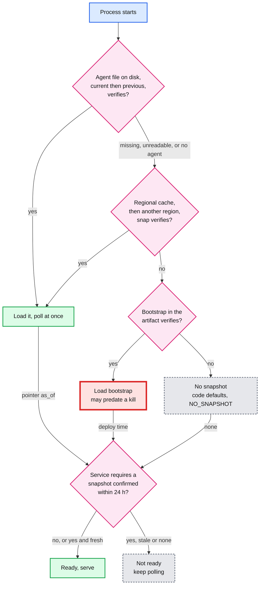
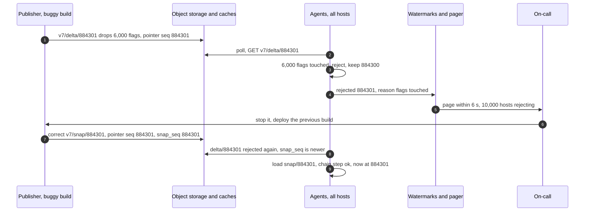

# Deep dive: fail static and bad snapshots

> One-line answer: only a file that passes every check may change what a host evaluates, and the only other input is OFF-only (a recent kill in the pointer, or a break-glass override). A missing, corrupt, oversized, out-of-order, unsigned or suspiciously large change leaves the host on its last-known-good (LKG) snapshot and raises an alert. So an outage shows up as staleness and a bad file as a page, never as a wrong answer on 10,000 hosts. A booting process tries the agent's disk file, then the regional cache, then a bootstrap written into its artifact at deploy time, then code defaults. Format changes roll out in stages. Value changes never do, because holding back one seq would also hold back everything behind it.

Zoom-in on [`../solution.md`](../solution.md) §5.4, §5.8 and §10.4 B. Reusable blocks: [`../../../concepts/caching-patterns.md`](../../../concepts/caching-patterns.md) (what a cache may serve when its origin is down), [`../../../concepts/leases-fencing-clocks.md`](../../../concepts/leases-fencing-clocks.md) (why freshness needs a clock you trust). Siblings: [`propagation-and-kill-switch.md`](propagation-and-kill-switch.md) (how files and the kill overlay reach the agent), [`evaluation-and-bucketing.md`](evaluation-and-bucketing.md) (what `ERROR` and `NO_SNAPSHOT` return). The same idea for a deny list: [`../../distributed-denylist/deep-dives/failure-modes-and-fail-static.md`](../../distributed-denylist/deep-dives/failure-modes-and-fail-static.md).

---

## 1. Two failure classes, opposite in shape

- **Outage:** nothing new arrives. Checks keep the LKG and answers get stale. A host more than 5 min behind is flagged, and more than 1% of live hosts pages.
- **Bad file:** something wrong arrives everywhere in ~7 s, and unhandled it reaches every process at once (Cloudflare, 18 Nov 2025). Validate in the publisher and again in every agent, cap sizes, isolate per flag, stage formats. "Agents rejecting a file" pages on the first reject.

The rule that makes both work: **a host's flag state changes only when a validated file is applied in seq order, or when an OFF-only entry arrives.** Not on a timeout, a failed poll, an agent restart or a 404. The agent never goes to a lower seq, and neither does an SDK: it reloads only when the header's seq is higher than the one it holds. So every upstream failure has one symptom on the host: its seq stops moving.

---

## 2. Booting with the control plane down



- **Disk first.** The agent keeps `current` and `previous`. It writes `snapshot.{seq}.tmp`, fsyncs, renames, then fsyncs the directory, so `current` survives a power cut. A disk fault can still corrupt it, so `previous` is the fallback (boot A in §3). Any process whose agent file is missing or unreadable goes straight to step 2.
- **Every fallback can predate a kill.** In §3, `previous` and a 3-day-old bootstrap both have `f00007` ON, though it was killed at 884301. So a booting agent or direct-mode SDK polls at once instead of waiting 5 s, and the bootstrap is written at **deploy** time, so it is as fresh as the deploy, not weeks old.
- **Readiness uses the pointer's signed `as_of`, rewritten every 60 s.** "Snapshot younger than 24 h" measured from the last edit would fail on a quiet day (a holiday change freeze), and every payment process that restarted would refuse traffic. "Confirmed current within 24 h" never does.
- **Neither open nor closed.** Turning every flag on launches unfinished work. Turning every flag off kills every launched feature. Keeping the LKG changes nothing, which is what you want during someone else's incident.

---

## 3. The agent's apply loop, run against bad inputs

The checks, cheapest first:

| Check | Catches | Cost |
|---|---|---|
| Size cap while downloading. The ladder: API refuses at ~80%, publisher at 32 MB, agent at 40 MB [estimate] | Cloudflare-shaped files, never buffered or parsed. Growth is refused at the API, so it never halts publishing or kills | Free: stop reading at the cap |
| Publisher signature and checksum, then order (`first == local + 1`, snapshot newer), then schema | Corruption in a cache or on disk, forged files, gaps, replays, a new format at an old agent | One hash |
| Admin API signature on every changed flag version, and no version below the one held | A compromised publisher forging or replaying a record | One HMAC per changed flag |
| Flags touched per principal over a sliding hour ≤ 1% (200), count within 1% of the last snapshot boundary, snapshot vs the newest step of its chain. All unless `bulk` | A dropped table, a mass flip that keeps the count, a script of many small files, a slow drain | Counting |
| Parse each changed flag: `state` first (a tiny fixed schema), then its rules. Rules unreadable: OFF if `state` is OFF, else `ERROR`. More than 10 `ERROR` flags [estimate] rejects the file | One bad record, or a parser mismatch hitting thousands | One parse per changed flag |

Any failure keeps the LKG. Then:
- **Corrupt in the cache:** re-fetch once from origin. The cache evicts an object that fails verification, and the reject report triggers an on-demand snapshot.
- **Gap or rejected delta, with a newer `snap_seq`:** load the snapshot. This is how a fixed publisher gets hosts past a bad delta (test 13).
- **More than one snapshot interval behind** (`local < pointer.prev_snap_seq`): load the snapshot and check it against its own chain header, not against the host's old copy (tests 15, 15b).
- **Otherwise:** stay put, report `rejected {seq}: {reason}`, retry next poll. Kills still arrive through the pointer's OFF-only overlay (test 18).

The code implements the loop and feeds it 21 inputs plus 3 boots. HMAC stands in for the two signatures (admin API per flag version, publisher per file) so it runs on the standard library. Production uses asymmetric keys (Ed25519), so agents hold only public keys.

```python
import hashlib, hmac, json

PUB_KEY, API_KEY = b"publisher-key", b"admin-api-key"   # stand-ins for two Ed25519 keys
MAX_BYTES, SCHEMAS, MAX_CHANGE, MAX_BAD, CHAIN = 40 << 20, {7}, 0.01, 10, "v7"

def mac(key, obj):
    return hmac.new(key, json.dumps(obj, sort_keys=True).encode(), hashlib.sha256).hexdigest()

def pack(kind, first, last, flags, schema=7, bulk=False, prev=(None, None), who="alice", at=0):
    """delta: seqs first..last, base = first - 1. snap: full state at last, plus the previous
    snapshot's seq and flag count (the chain). flags: key -> signed record, or None if removed."""
    body = json.dumps({"kind": kind, "first": first, "last": last, "schema": schema, "bulk": bulk,
                       "prev_snap_seq": prev[0], "prev_count": prev[1], "who": who, "at": at,
                       "flags": flags}, sort_keys=True).encode()
    return {"body": body, "sha256": hashlib.sha256(body).hexdigest(),
            "sig": hmac.new(PUB_KEY, body, hashlib.sha256).hexdigest()}

def parse_flag(r):
    """None if the record parses. Else what a check returns: OFF still honours a kill."""
    if r.get("state") not in ("ON", "OFF"):
        return "ERROR"                              # state: tiny fixed schema, read first
    bp, salt = r.get("rollout_bp"), r.get("salt")
    if type(bp) is int and 0 <= bp <= 10_000 and isinstance(salt, str) \
            and len(salt) == 32 and set(salt) <= set("0123456789abcdef"):
        return None
    return "OFF" if r["state"] == "OFF" else "ERROR"   # rules unreadable

class Agent:
    def __init__(self):
        self.seq, self.flags, self.unparsed, self.disk, self.alerts = 0, {}, {}, {}, []
        self.ref, self.ref_seq, self.hour, self.overlay = None, None, {}, set()

    def check(self, f, kind):
        if len(f["body"]) > MAX_BYTES:              # 40 MB: above the publisher's 32 MB, checked
            return None, "size over 40 MB"          # while downloading, before hashing
        good = hmac.new(PUB_KEY, f["body"], hashlib.sha256).hexdigest()
        if hashlib.sha256(f["body"]).hexdigest() != f["sha256"] or not hmac.compare_digest(good, f["sig"]):
            return None, "checksum or signature"
        d = json.loads(f["body"])
        if d["kind"] != kind or (kind == "delta" and d["first"] != self.seq + 1) \
                or (kind == "snap" and d["last"] <= self.seq):
            return None, "order"
        if d["schema"] not in SCHEMAS:
            return None, f"schema {d['schema']} unsupported"
        return d, None

    def apply(self, d):
        changed = {k: r for k, r in d["flags"].items() if r is not None}
        for k, r in changed.items():                # second key: the admin API signed each version
            if not hmac.compare_digest(mac(API_KEY, dict(r, vsig=None)), str(r.get("vsig"))):
                return f"{k} version signature"
            if k in self.flags and r["version"] < self.flags[k]["version"]:
                return f"{k} version {r['version']} below held {self.flags[k]['version']}"
        new = dict(self.flags) if d["kind"] == "delta" else {}
        new.update(changed)
        for k in [k for k, r in d["flags"].items() if r is None]:
            new.pop(k, None)                        # removed or archived
        old, n = len(self.flags), len(new)
        hour = [(t, c) for t, c in self.hour.get(d["who"], []) if t > d["at"] - 3600]
        hour.append((d["at"], len(d["flags"])))     # flags touched, per principal, sliding hour
        if self.flags and not d["bulk"]:
            if d["kind"] == "snap":                 # newest step of the chain, not our old copy
                if abs(n - d["prev_count"]) > MAX_CHANGE * d["prev_count"]:
                    return f"snapshot step {d['prev_count']} -> {n}"
            elif sum(c for _, c in hour) > MAX_CHANGE * old:
                return f"{d['who']} touched {sum(c for _, c in hour)} flags in an hour"
            elif abs(n - self.ref) > MAX_CHANGE * self.ref:
                return f"drift since snapshot {self.ref} -> {n}"
        bad = {k: v for k, r in changed.items() if (v := parse_flag(r))}
        errors = sum(v == "ERROR" for v in bad.values())
        if errors > MAX_BAD:                        # a parser mismatch, not one bad record
            return f"{errors} flags would return ERROR"
        keep = {k: v for k, v in self.unparsed.items() if k not in d["flags"]} \
            if d["kind"] == "delta" else {}
        self.disk["previous"] = self.disk.get("current")   # tmp, fsync, rename, fsync the dir
        self.disk["current"] = pack("snap", d["last"], d["last"], new)
        self.seq, self.flags, self.unparsed = d["last"], new, keep | bad
        self.overlay = {(k, s) for k, s in self.overlay if s > self.seq}   # prefix caught up
        if d["kind"] == "delta":
            self.hour[d["who"]] = hour
        if d["kind"] == "snap" or self.ref_seq is None or self.seq - self.ref_seq >= 1000:
            self.ref, self.ref_seq = n, self.seq
        return None

    def get(self, store, path, kind):
        for tier in ("cache", "origin"):            # corrupt in cache: bypass it once
            f = store[tier].get(path)
            if f is None:
                return None, "missing"
            d, why = self.check(f, kind)
            if why != "checksum or signature":
                return d, why
            self.alerts.append(f"{path} corrupt in {tier}")
        return None, why

    def poll(self, ptr, store):
        self.overlay |= {(k, s) for k, s in ptr["recent_kills"] if s > self.seq}  # OFF-only
        if ptr["seq"] <= self.seq:
            return f"ignore pointer {ptr['seq']}, local is {self.seq}"
        far = self.seq < ptr["prev_snap_seq"]       # over a snapshot interval behind: snapshot
        while self.seq < ptr["seq"]:
            path = f"{CHAIN}/delta/{self.seq + 1}"
            d, why = (None, "skipped, far behind") if far else self.get(store, path, "delta")
            why, far = why or self.apply(d), False
            if why and ptr["snap_seq"] > self.seq:  # gap, corrupt or rejected: try the snapshot
                self.alerts.append(f"{path} {why}, took snap/{ptr['snap_seq']}")
                d, why2 = self.get(store, f"{CHAIN}/snap/{ptr['snap_seq']}", "snap")
                why = why2 or self.apply(d)
            if why:
                return f"keep LKG {self.seq}: {why}" + self.notes()
        return f"at {self.seq}" + self.notes()

    def notes(self):
        out = f", unparsed {dict(sorted(self.unparsed.items()))}" if self.unparsed else ""
        out += f", overlay OFF {sorted(k for k, _ in self.overlay)}" if self.overlay else ""
        return out + (f" | {'; '.join(self.alerts)}" if self.alerts else "")

def flag(i, state="ON", bp=1000, v=1):              # a version as the admin API signs it
    r = {"state": state, "rollout_bp": bp, "salt": f"{i:032x}", "version": v, "vsig": None}
    return dict(r, vsig=mac(API_KEY, r))

S, BASE = 884300, {f"f{i:05d}": flag(i) for i in range(20_000)}
KILLED = dict(BASE, f00007=flag(7, "OFF", v=2))

def run(deltas, ptr, snaps=(), corrupt=None):
    a, origin = Agent(), {}
    a.apply(json.loads(pack("snap", S, S, BASE)["body"]))
    for first, last, fl, opt in deltas:
        origin[f"{CHAIN}/delta/{first}"] = pack("delta", first, last, fl, **opt)
    for seq, fl, *opt in snaps:
        origin[f"{CHAIN}/snap/{seq}"] = pack("snap", seq, seq, fl, **(opt[0] if opt else {"prev": (S, 20_000)}))
    cache = dict(origin)
    if corrupt:                                     # one flipped byte in the cached copy
        cache[corrupt] = dict(cache[corrupt], body=b"x" + cache[corrupt]["body"][1:])
    return a, a.poll(ptr, {"cache": cache, "origin": origin})

def P(seq, snap=S, prev=S - 1000, kills=()):        # pointer, signed in production
    return {"seq": seq, "snap_seq": snap, "prev_snap_seq": prev, "recent_kills": kills}

def one(fl, **opt):                                 # a single delta S+1 on top of S
    return [(S + 1, S + 1, fl, opt)], P(S + 1)

kill, drop = {"f00007": flag(7, "OFF", v=2)}, {f"f{i:05d}": None for i in range(6_000)}
LATER = {k: v for k, v in BASE.items() if k >= "f01000"}  # 1,000 flags archived over 3 days
BATCH = {f"f{i:05d}": flag(i, bp=0, v=2) for i in range(150)}  # 150 flags, 1,000 seqs, one file
forged = dict(flag(7, "ON", v=3), vsig="0" * 64)
tests = {
    "1 kill":             one(kill),
    "2 stale pointer":    ([], P(S - 1, S - 1)),
    "3 gap":              ([(S+1, S+1, kill, {}), (S+3, S+3, {"f00009": flag(9, bp=2000, v=2)}, {})],
                           P(S + 3, S + 2), [(S + 2, KILLED)]),
    "4 corrupt in cache": one(kill) + ((), "v7/delta/884301"),
    "5 oversized":        one({"pad": dict(flag(1), salt="0" * (41 << 20))}),
    "6 drop 6,000":       one(drop),
    "7 drop, bulk":       one(drop, bulk=True),
    "8 flip 6,000 OFF":   one({f"f{i:05d}": flag(i, "OFF", v=2) for i in range(6_000)}),
    "9 slow drain":       ([(S+1+j, S+1+j, {f"f{150*j+i:05d}": None for i in range(150)},
                             {"who": f"user{j}", "at": 60 * j}) for j in range(40)], P(S + 40)),
    "9b script, 5 x 198": ([(S+1+j, S+1+j, {f"f{198*j+i:05d}": flag(198*j+i, bp=2000, v=2) for i in range(198)},
                             {"who": "script-7", "at": j / 12}) for j in range(5)], P(S + 5)),
    "10 one bad flag":    one({"f00042": flag(42, bp="50%", v=2)}),
    "10b kill, bad rules": one({"f00042": flag(42, "OFF", bp="50%", v=2)}),
    "11 50 bad flags":    one({f"f{i:05d}": flag(i, state="MAYBE", v=2) for i in range(50)}),
    "12 v8 file, v7 path": one(kill, schema=8),
    "13 bad, then snap":  ([(S+1, S+1, drop, {})], P(S + 1, S + 1), [(S + 1, KILLED)]),
    "14 batch 1,000":     ([(S+1, S+1000, BATCH, {})], P(S + 1000, S + 1000, S),
                           [(S + 1000, dict(BASE, **BATCH))]),
    "15 offline 3 days":  ([(S+9001, S+9001, {"f01007": flag(1007, "OFF", v=2)}, {})], P(S + 9001, S + 9000,
                           S + 8000), [(S + 9000, LATER, {"prev": (S + 8000, 19_050)})]),
    "15b one-step drop":  ([], P(S + 9000, S + 9000, S + 8000), [(S + 9000, LATER, {"prev": (S + 8000, 20_000)})]),
    "16 replayed v1":     ([(S+1, S+1, kill, {}), (S+2, S+2, {"f00007": flag(7)}, {})], P(S + 2)),
    "17 forged record":   one({"f00007": forged}),
    "18 stuck, kill":     ([(S+1, S+1, drop, {})], P(S + 2, kills=[("f00009", S + 2)])),
}
for name, args in tests.items():
    a, out = run(*args)
    print(f"{name:<19} {out}")

def boot(*sources):                                 # SDK or agent start: first source that verifies
    for name, f in sources:
        d, why = Agent().check(f, "snap") if f else (None, "absent")
        if d:
            return f"{name}, seq {d['last']}, f00007 {d['flags']['f00007']['state']}"
    return "no snapshot: code defaults, reason NO_SNAPSHOT"

a, _ = run(*one(kill))
torn = dict(a.disk["current"], body=a.disk["current"]["body"][:4096])
baked = pack("snap", S - 9000, S - 9000, BASE)      # written into the artifact 3 days ago
print("boot A", boot(("disk current", torn), ("disk previous", a.disk["previous"]), ("bootstrap", baked)))
print("boot B", boot(("disk current", None), ("regional cache", None), ("bootstrap", baked)))
print("boot C", boot(("disk current", None), ("regional cache", None), ("bootstrap", None)))
```

Output:

```text
1 kill              at 884301
2 stale pointer     ignore pointer 884299, local is 884300
3 gap               at 884303 | v7/delta/884302 missing, took snap/884302
4 corrupt in cache  at 884301 | v7/delta/884301 corrupt in cache
5 oversized         keep LKG 884300: size over 40 MB
6 drop 6,000        keep LKG 884300: alice touched 6000 flags in an hour
7 drop, bulk        at 884301
8 flip 6,000 OFF    keep LKG 884300: alice touched 6000 flags in an hour
9 slow drain        keep LKG 884301: drift since snapshot 20000 -> 19700
9b script, 5 x 198  keep LKG 884301: script-7 touched 396 flags in an hour
10 one bad flag     at 884301, unparsed {'f00042': 'ERROR'}
10b kill, bad rules at 884301, unparsed {'f00042': 'OFF'}
11 50 bad flags     keep LKG 884300: 50 flags would return ERROR
12 v8 file, v7 path keep LKG 884300: schema 8 unsupported
13 bad, then snap   at 884301 | v7/delta/884301 alice touched 6000 flags in an hour, took snap/884301
14 batch 1,000      at 885300
15 offline 3 days   at 893301 | v7/delta/884301 skipped, far behind, took snap/893300
15b one-step drop   keep LKG 884300: snapshot step 20000 -> 19000 | v7/delta/884301 skipped, far behind, took snap/893300
16 replayed v1      keep LKG 884301: f00007 version 1 below held 2
17 forged record    keep LKG 884300: f00007 version signature
18 stuck, kill      keep LKG 884300: alice touched 6000 flags in an hour, overlay OFF ['f00009']
boot A disk previous, seq 884300, f00007 ON
boot B bootstrap, seq 875300, f00007 ON
boot C no snapshot: code defaults, reason NO_SNAPSHOT
```

What the tests show:
- **Tests 1 to 5:** the prefix rule, the origin re-fetch and the size cap.
- **Tests 6 and 8:** a mass removal and a mass flip OFF are both caught by flags touched. A count check alone misses test 8, because the count does not change.
- **Tests 9 and 9b:** a buggy publisher spreading removals over 40 deltas from 40 authors passes the per-principal budget, and the count against the snapshot boundary stops it at the second delta. A script sending 198-flag files, 12 a second, passes every per-file check, and the per-principal hour stops it at 396.
- **Tests 10, 10b, 11:** one unreadable record costs one flag its code default. If that record is a kill, `state` is still read, so the kill applies. Fifty unreadable records mean a parser mismatch, and the file is refused. Kills never count toward the 10.
- **Test 13:** the bad delta stays cached forever under its name. The fixed publisher re-renders the same committed seq correctly as `snap/884301` and points at it. No new seq is needed.
- **Test 14:** a 1,000-change batch is one file and 1,000 seqs. The host walks the one 1 MB file. A rule counting seqs behind would have sent it to the 8 MB snapshot.
- **Tests 15, 15b:** a host back after 3 days sees 5% fewer flags than its own copy, all from legitimate archiving. It accepts, because the newest chain step moved 0.3%. A snapshot whose own step drops 5% is refused.
- **Tests 16, 17:** a publisher that replays an older signed version, or forges a new one, is refused by the second key.



**Per-flag fallback: why code default, not the flag's previous record.** Keeping a flag's old record when its new one fails to parse sounds more "fail static". It is worse twice over. The host is no longer at one seq, so two hosts at "884301" can disagree. And if the new record is a kill, the old record is ON. Reading `state` first, with a schema that never changes name, type or position, keeps the kill (test 10b). Everything else gets the code default with reason `ERROR`, which is also what OpenFeature requires on abnormal execution (requirement 1.4.10).

---

## 4. Break-glass: a kill with the control plane down

| Rule | Value |
|---|---|
| Who | Two on-call engineers, each signing with a personal SRE key, separate from the publisher's and the API's keys. The agent requires 2 distinct valid signatures |
| What | `{flags: {key: OFF}, reason, expires_at, counter}`. Any value other than OFF, more than 100 flags, an expired file, or a counter not above the last one seen rejects the whole file. Flags marked `kill_safe = false` are skipped |
| Path | The SRE tool writes `/v1/override` straight to object storage in all 3 regions. No Flag DB, no API, no publisher. The publisher writes the pointer, so the override cannot ride inside it |
| How agents read it | Its own conditional GET on every poll: +2,000 req/s, ~4,000 in total, nearly all `404` or `304` |
| Retire, do not delete | When the control plane is back, the API commits real kill versions at seq S. The on-call writes a signed override with `retire_at_seq: S`. Agents drop an entry once their own seq ≥ S. Deleting the file would switch the feature back on for every host not yet at S. A live override pages until retired |

It can only turn things off, by design. A tool that bypasses every approval must not be able to launch anything.

---

## 5. Staged format changes

- **What is staged:** the file schema, never flag values. Values ride the normal path in ~7 s.
- **How:** while schema v7 moves to v8, the publisher writes two file chains for the same seqs, with the schema version in the path: `v7/delta/{first_seq}` and `v8/delta/{first_seq}`. Each region has `pointer` (v7) and `pointer.canary` (v8). An agent reads the canary when `SHA-256(host_id) mod 10,000 < canary_bp` and its parser supports v8. Steps: 1%, 10%, all, over about 1 h.
- **Rollback:** set `canary_bp = 0`. Canary agents return to the v7 chain at the same seq. They reload, they never move backwards.
- **Gate:** agents report supported schemas with their watermark. Going to 100% needs at least 99.9% of live agents on a v8-capable build.
- **Why values are never staged:** holding seq N back from 99% of hosts also holds back N+1 and everything after it. Format staging works because both chains carry the same seqs. Test 12 is a v8 file found on the v7 path: refused.

---

## 6. The three incidents, and what stops each here

| Incident | What happened ([`../research/facts-survey.md`](../research/facts-survey.md) §8) | What stops it here | What still hurts |
|---|---|---|---|
| Knight Capital, 1 Aug 2012 | New code "repurposed a flag". One of 8 servers kept old code, so the flag re-enabled dead code there: 212 parent orders, ~45 minutes, $460 M loss | Keys are never reused. Old code checks the old key, which is archived, so it gets `FLAG_NOT_FOUND` and its code default. A flag needing a newer SDK returns `ERROR` below its `min_sdk_level` | A deploy that misses a server is still a deploy problem. Per-host watermarks and SDK versions make it visible |
| Google Cloud, 12 Jun 2025 (10:49 PDT) | A new code path "not feature flag protected" crashed on policy data "replicated globally within seconds" | Teams gate new code paths with flags. Our own files are validated twice, capped, and isolated per flag | A flag flip itself is global in ~7 s. Guarded ramps, not this file, defend value changes |
| Cloudflare, 18 Nov 2025 (11:20 UTC) | A feature file "doubled in size" past a preallocated limit of 200 (~60 in use) and the system panicked. Core traffic normal by 14:30 UTC, all systems 17:06 | A cap is a validation failure, never a crash (test 5). The limit ladder refuses growth at the API at ~80%, so normal growth never reaches a consumer's cap | A cap set too low at the publisher would stop updates. That pages in seconds, and kills still flow through the overlay |

---

## 7. Trade-offs

| Decision | Chose | Gave up |
|---|---|---|
| Outage behaviour | Fail static, then code default | No edit lands during the outage. Break-glass covers kills |
| One bad flag record | OFF if its `state` says OFF, else code default with `ERROR`, alert | That flag's last good value |
| More than 10 `ERROR` flags, or a broken file | Reject the whole file, keep LKG, page | Value changes behind it wait for a fixed publish. Kills do not, thanks to the overlay |
| Change budget | 1% per principal per sliding hour, unless `bulk` | A legitimate 300-flag cleanup needs `bulk` and an approver |
| Bootstrap in the artifact | Keep it, write it at deploy, readiness gate | It can predate a kill on a host with no disk copy and no cache |

---

## 8. Numbers to say out loud

- Size ladder: API ~80%, publisher 32 MB (8 MB today), agent 40 MB [estimate]. 50k flags, 10k ids inline.
- Change budget: 200 flags (1%) per principal per sliding hour, count within 1% of the snapshot boundary, unless `bulk`. 10 `ERROR` flags per file [estimate].
- Two signatures: admin API per flag version, publisher per file. Override: 2 SRE signatures, OFF only, 100 flags, `expires_at`, counter, `retire_at_seq`.
- Boot: disk, cache, another region, deploy-time bootstrap, code defaults. Readiness: confirmed by `as_of` within 24 h.
- Format staging: `v7/` and `v8/` chains, 1%, 10%, all, about 1 h.
