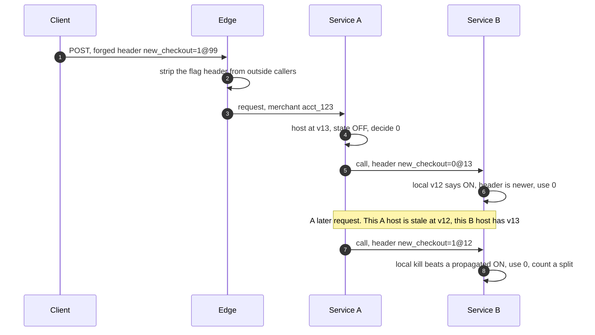

# Deep dive: lists, segments and cross-service consistency

> One-line answer: lists up to 10k ids ride inline in the snapshot. Bigger ones are **segments**: one read-only file per host with a static open-addressing index (a 64-bit hash picks a slot, an exact compare confirms), mmapped by every process. A 1 M-id segment measures 41.8 MB and a probe touches about one cache line, against 99 MB per process as a language-level set. It is exact, because a Bloom filter small enough to matter wrongly matches ~32,000 of 4 M merchants. Segment edits travel as add/remove lists (at most 40k ids, ~1 MB) with a membership checksum, never as whole segments, because every byte is multiplied by 3,300 hosts per region: a 1 M-id segment sent whole is 138 GB per region. A whole-list replace is a new segment version, prefetched, then switched by one flag edit. Across services, the first evaluator passes `flag=value@version` downstream. In the simulation that turns 8,544 split requests per kill into 0, and the rule **a local kill beats a propagated ON** stops a stale upstream host from overriding a kill.

Zoom-in on [`../solution.md`](../solution.md) §5.5 and §5.6. Reusable blocks: [`../../../concepts/bloom-filter.md`](../../../concepts/bloom-filter.md) (the formula used in §4), and the denylist's [`local-lookup-and-memory-layout.md`](../../distributed-denylist/deep-dives/local-lookup-and-memory-layout.md) (the same mmapped open-addressing idea at 255 MB). Sibling: [`safe-changes-and-flag-lifecycle.md`](safe-changes-and-flag-lifecycle.md) (segment edits go through the same exposure rule).

---

## 1. Where a list lives

| | Inline list | Segment |
|---|---|---|
| Size | up to 10k ids per list | above 10k, up to 1 M ids per segment, 256 MB for all segments |
| Where | inside the flag record in the 8 MB snapshot | its own file, `segment/{name}/{seq}` |
| In memory | a hash set in each process | one mmapped file per host, shared by every process |
| Edit | a flag edit (`allow_add`, `block_remove`) | `POST /v1/segments/{name}/members`, up to 40k ids per call |
| Reuse | one flag | many flags ("stripe_internal_accounts") |

- **Ordering is free, and stickiness is per seq.** Segment changes take a `seq` from the same counter as flag edits, and the snapshot carries a manifest of segment versions. A host at seq N has one consistent view of both. A segment edit changes answers with no new flag version, so "same unit, same answer" holds per seq, not per flag version.
- **A shared segment is a shared blast radius.** Adding ids to an allow segment, or removing them from a block segment, is an exposure increase for every flag that references it, so a segment edit inherits the strictest risk tier among them ([`safe-changes-and-flag-lifecycle.md`](safe-changes-and-flag-lifecycle.md) §1).
- **A flag revert does not revert members.** `FLAG_VERSION` stores the segment's name, not its members at that time. Undoing a bad member edit is an inverse edit on the segment. Segment existence is checked inside the commit transaction, so no version can reference a missing segment.

## 2. The segment file and its path to the host


File layout: a 64-byte header, then `n_slots` slots of 8 bytes (`tag u32`, `offset u32`), then the ids as length byte plus bytes. `n_slots` is a power of two at least twice the id count, so the load factor is at most 0.5. The hash is SHA-256's first 8 bytes, the same reason as bucketing: it is in every standard library, so every SDK finds the same slot. The low bits pick the home slot, the high 32 bits are a tag that skips most string compares.

## 3. Code: build a 1 M-id segment, mmap it, probe it

```python
import base64, hashlib, mmap, os, random, struct, sys, tempfile, time
random.seed(56)
N, EMPTY, HDR = 1_000_000, 0xFFFFFFFF, struct.Struct("<8sIIII44x")    # 64-byte header

def h64(s):                            # same hash in every SDK language: SHA-256, first 8 bytes
    return int.from_bytes(hashlib.sha256(s.encode()).digest()[:8], "big")

def new_id():                          # "acct_" + 19 chars = 24 bytes, like a Stripe account id
    return "acct_" + base64.b32encode(random.randbytes(12)).decode()[:19]

def build(ids, path):
    """Read-only segment file: header | slots (tag u32, offset u32) | ids (len byte + bytes)."""
    n_slots = 1 << (2 * len(ids) - 1).bit_length()       # power of two, at least 2n: load <= 0.5
    mask, slots, blob = n_slots - 1, bytearray(b"\xff" * 8 * n_slots), bytearray()
    for s in sorted(ids):
        b, h = s.encode(), h64(s)
        i = h & mask                                       # low bits pick the home slot
        while struct.unpack_from("<I", slots, 8 * i + 4)[0] != EMPTY:
            i = (i + 1) & mask                             # linear probing
        struct.pack_into("<II", slots, 8 * i, h >> 32, len(blob))   # high 32 bits as a tag
        blob += bytes([len(b)]) + b
    with open(path, "wb") as f:
        f.write(HDR.pack(b"FFSEG001", len(ids), n_slots, len(blob), 0) + slots + blob)

class Segment:                         # what each process does: mmap the file, probe, compare
    def __init__(self, path):
        with open(path, "rb") as f:
            self.m = mmap.mmap(f.fileno(), 0, access=mmap.ACCESS_READ)
        _, self.n, n_slots, _, _ = HDR.unpack_from(self.m, 0)
        self.mask, self.blob_at = n_slots - 1, HDR.size + 8 * n_slots
        self.probes = self.lines = 0                       # slots read, 64-byte slot lines touched
    def contains(self, s):
        b, h = s.encode(), h64(s)
        i, tag, p = h & self.mask, h >> 32, 0
        first = i % 8                                      # 8 slots of 8 bytes per cache line
        try:
            while True:
                p += 1
                t, off = struct.unpack_from("<II", self.m, HDR.size + 8 * ((i + p - 1) & self.mask))
                if off == EMPTY: return False
                if t == tag:                               # exact compare: never a false positive
                    at = self.blob_at + off
                    if self.m[at + 1: at + 1 + self.m[at]] == b: return True
        finally:
            self.probes += p; self.lines += (first + p - 1) // 8 + 1

members = [new_id() for _ in range(N)]
as_set = set(members)                                      # the inline alternative, per process
set_mb = (sys.getsizeof(as_set) + sum(map(sys.getsizeof, members))) / 1e6
others = [new_id() for _ in range(N)]                      # merchants not on the list
path = os.path.join(tempfile.mkdtemp(), "segment.bin")
t = time.perf_counter(); build(members, path); build_s = time.perf_counter() - t
seg = Segment(path)
size = os.path.getsize(path)
print(f"file {size / 1e6:.1f} MB = index {8 * (seg.mask + 1) / 1e6:.1f} MB + ids {(size - seg.blob_at) / 1e6:.1f} MB,"
      f" load {N / (seg.mask + 1):.2f}, build {build_s:.1f} s in Python")
print(f"same ids as a Python set of str, in every process: {set_mb:.0f} MB")
for name, keys, want in [("members", members, True), ("non-members", others, False)]:
    seg.probes = seg.lines = 0; t = time.perf_counter()
    wrong = sum(seg.contains(k) != want for k in keys)
    us = (time.perf_counter() - t) / len(keys) * 1e6
    print(f"{name:11}: {len(keys):,} lookups, {wrong} wrong, {seg.probes / len(keys):.2f} slots,"
          f" {seg.lines / len(keys):.2f} slot cache lines, {us:.1f} us each in Python")
```

Output (the two timings vary by machine):

```text
file 41.8 MB = index 16.8 MB + ids 25.0 MB, load 0.48, build 1.1 s in Python
same ids as a Python set of str, in every process: 99 MB
members    : 1,000,000 lookups, 0 wrong, 1.46 slots, 1.06 slot cache lines, 1.0 us each in Python
non-members: 1,000,000 lookups, 0 wrong, 2.33 slots, 1.17 slot cache lines, 0.9 us each in Python
```

- **The solution's ~40 MB holds:** 16.8 MB of slots plus 25.0 MB of ids (24 B each plus a length byte). Six such segments are 251 MB, inside the 256 MB budget. The same ids as a set cost 99 MB in each process, ~500 MB per host at 5 processes, against 41.8 MB shared.
- **Probe counts match linear-probing theory** at load 0.48: 1.46 slots for a hit and 2.33 for a miss. Most checks are misses (the merchant is not on the list), and a miss touches 1.17 slot cache lines and no id bytes. A hit adds one line for the id compare. In Go or Java that is one or two DRAM misses, about 0.1 to 0.2 us [estimate]. The Python microseconds are interpreter overhead. The ~1 s rebuild holds: Python itself builds 1 M ids in about 1 s.

## 4. Exact vs a Bloom filter at the same memory

```python
import base64, hashlib, math, random
random.seed(56)
N_IDS, FILE_BITS, NON_MEMBERS = 1_000_000, 41.8e6 * 8, 4_000_000  # the exact file above; ~5 M merchants [estimate]

def new_id(): return "acct_" + base64.b32encode(random.randbytes(12)).decode()[:19]

def k_for(bits_per_id): return max(1, round(bits_per_id * math.log(2)))

def measured_fp(bits_per_id, n=200_000):       # a real filter, probed with n ids that are not in it
    m, k = bits_per_id * n, k_for(bits_per_id)
    bits = bytearray(m // 8 + 1)
    def idx(s):                                # double hashing from one SHA-256
        d = hashlib.sha256(s.encode()).digest()
        a, b = int.from_bytes(d[:8], "big"), int.from_bytes(d[8:16], "big") | 1
        return [(a + i * b) % m for i in range(k)]
    for _ in range(n):
        for j in idx(new_id()): bits[j >> 3] |= 1 << (j & 7)
    return sum(all(bits[j >> 3] >> (j & 7) & 1 for j in idx(new_id())) for _ in range(n)) / n

print("filter                          size      probes  false positive rate  wrong merchants of 4 M")
for bpi, label in [(8, "8 bits per id"), (10, "10 bits per id"), (33, "10x smaller than the file"),
                   (FILE_BITS / N_IDS, "same size as the file")]:
    k = k_for(bpi)
    fp = measured_fp(bpi) if bpi <= 10 else (1 - math.exp(-k / bpi)) ** k
    how = "measured" if bpi <= 10 else "formula"
    print(f"{label:27} {bpi * N_IDS / 8e6:6.1f} MB {k:7}  {fp:9.2g} {how:9} {fp * NON_MEMBERS:15,.1f}")
print(f"{'exact index (section 3)':27} {41.8:6.1f} MB  1 to 2  {0:9} {'by design':9} {0:15,.1f}")
```

Output:

```text
filter                          size      probes  false positive rate  wrong merchants of 4 M
8 bits per id                  1.0 MB       6      0.021 measured         85,820.0
10 bits per id                 1.2 MB       7     0.0081 measured         32,300.0
10x smaller than the file      4.1 MB      23    1.3e-07 formula               0.5
same size as the file         41.8 MB     232    1.7e-70 formula               0.0
exact index (section 3)       41.8 MB  1 to 2          0 by design             0.0
```

- **At equal memory a Bloom filter is exact too, and 100x slower:** 232 random bit probes per check against one or two cache lines. At 10x smaller it is still nearly exact (0.5 merchants of 4 M) for 23 probes, to save 38 MB per host. So "false positives" is the wrong headline at those sizes.
- **At the size people actually pick (10 bits per id) it wrongly blocks ~32,000 merchants.** And the error is per id, not per request: the same merchant is wrong on every check, with no error anywhere, until the next rebuild picks other victims.
- **A filter also cannot answer "why is acct_123 blocked", list members for an audit, or apply a remove.** The agent needs the ids to rebuild anyway. Exact it is.

## 5. Segment edits on the wire

What crosses the regional cache per change, with 3,300 hosts per region and ~1 GB/s of cache egress per region (solution §10.3):

| Delta content | Per host | Per region | Over one 5 s poll window |
|---|---|---|---|
| One flag edit | ~1 KB | 3.3 MB | nothing |
| 1,000-change batch | ~1 MB | 3.3 GB | 0.66 GB/s, fits |
| Segment edit at the 40k-id cap, as add/remove ops | ~1 MB | 3.3 GB | 0.66 GB/s, fits |
| Segment edit at 100k ids | ~2.5 MB | 8.3 GB | ~8 s of egress |
| A changed 1 M-id segment sent whole | 41.8 MB | 138 GB | ~138 s of egress |

- **The prefix rule turns bytes into delay.** A host applies seq N + 1 only after N, so every edit behind a big transfer waits for it. Kills do not: the pointer's `recent_kills` overlay applies them as OFF-only before the prefix catches up (solution §5.3). Everything else still queues, which is why the cache is red above.
- **So a segment delta is an add/remove list, never the segment:** the ids, the new count, and an order-independent membership checksum (the XOR of every member's 64-bit hash, which one add or remove updates in one step). The agent applies the list to its copy, rebuilds, and compares checksums. A mismatch fetches `segment/{name}/{seq}` in full, as boot and a gap already do.
- **A whole-list replace is a new segment version, switched by one flag edit.** Its full file (138 GB per region at 1 M ids) should reach hosts before the switch, not behind it: agents prefetch a published but unreferenced version in the background, and the switch is allowed once 99% of live hosts report having it [estimate]. A big import takes the same path: a new segment version, prefetched, then switched in by one edit, never 25 calls of 40k ids through the ordered stream.
- **Memory.** The agent's memory limit is ~320 MB [estimate]: the full 256 MB segment budget, a second copy of the largest segment during a rebuild (42 MB) and two snapshots (16 MB). On Linux the page cache is charged to the memory cgroup that first brought the pages in, which is the agent that wrote the file.

## 6. Cross-service skew: one request, two versions

Three shapes, one rule each (solution §5.6): request-scoped behaviour passes the decision in a header; data formats use expand/contract (§7); async work depends on the kind of flag (§8). The simulation is a kill of a flag that service A and then service B check on the same request [estimate: 5,000 r/s, 300 hosts each]. Each host applies the kill at its own time from the propagation budget: pointer at 0.7 s, cache age up to 1 s, a 5 s ±20% poll, 0.1 s to swap.

```python
import random
random.seed(56)
RPS, HOSTS, END = 5_000, 300, 330           # requests/s through A then B [estimate], hosts per service, seconds simulated

def apply_times(laggard_share):
    """When each host applies the kill (s after commit): pointer at 0.7 s, cache age up to 1 s,
    poll every 5 s +-20%, 0.1 s fetch and swap. Laggards are stuck until the 5 min page is handled."""
    out = []
    for _ in range(HOSTS):
        if random.random() < laggard_share: out.append(300.0); continue
        out.append(0.7 + random.uniform(0, 1) + random.uniform(0, 5 * random.uniform(0.8, 1.2)) + 0.1)
    return out

print("fleet               rule for B                 mixed requests  B ran killed path though B had the kill")
for name, lag in [("healthy", 0.0), ("1% laggards, 300 s", 0.01)]:
    A, B = apply_times(lag), apply_times(lag)
    mixed = a_stale_b_killed = 0
    last = 0.0
    for _ in range(RPS * END):
        t = random.uniform(0, END)
        a_on, b_on = t < random.choice(A), t < random.choice(B)  # True = this host has not applied the kill
        mixed += a_on != b_on
        a_stale_b_killed += a_on and not b_on
        if a_on != b_on: last = max(last, t)
    rows = [("no header, B evaluates", mixed, 0),          # B decides alone
            ("header, B always obeys", 0, a_stale_b_killed),  # stale A's ON overrides B's kill
            ("header, local kill wins", a_stale_b_killed, 0)]  # only A-stale, B-killed requests split
    for rule, m, k in rows:
        print(f"{name:19} {rule:26} {m:14,} {k:40,}")
    print(f"{name:19} last split request at {last:.1f} s, mean |apply A - apply B| ="
          f" {sum(abs(a - b) for a in A for b in B) / HOSTS ** 2:.2f} s")
```

Output:

```text
fleet               rule for B                 mixed requests  B ran killed path though B had the kill
healthy             no header, B evaluates              8,544                                        0
healthy             header, B always obeys                  0                                    4,317
healthy             header, local kill wins             4,317                                        0
healthy             last split request at 7.2 s, mean |apply A - apply B| = 1.70 s
1% laggards, 300 s  no header, B evaluates             33,033                                        0
1% laggards, 300 s  header, B always obeys                  0                                   19,137
1% laggards, 300 s  header, local kill wins            19,137                                        0
1% laggards, 300 s  last split request at 300.0 s, mean |apply A - apply B| = 6.61 s
```

- **Mixed requests = rate x mean gap.** 5,000 r/s x 1.70 s ≈ 8,500, matching 8,544. The window closes at 7.2 s, inside the ~8 s budget.
- **The tail dominates.** 1% of hosts stuck for 300 s produce 33,033 split requests, about 4x the normal window. The staleness page, not the poll interval, bounds this.
- **"Always obey the header" lets a stale host override a kill.** 4,317 requests (19,137 with laggards) ran the killed path on B hosts that already had the kill: one laggard on A feeds the dead feature to healthy B hosts for 5 minutes.
- **Rule: a local kill beats a propagated ON.** A broken feature must stop, even at the cost of one split request. In the other direction (A newer), the header delivers the kill to B before B's own poll.
- **The edge strips flag decisions from external callers.** Otherwise a merchant sends `new_checkout=1@99` and turns on an unreleased feature for itself. Only internal peers on mTLS may set one, only for flags marked `propagate`, capped at 20 per request [estimate]. The unit id never comes from a client header either.



## 7. Data formats: expand, then contract

A flag never gates a data format alone. Readers learn the new format before any writer emits it, so turning the writer's flag off is always safe.

| Phase | What ships | Rollback |
|---|---|---|
| 1. Expand | Readers parse v1 and v2. A deploy, or a reader flag at 100% | Normal deploy revert. No v2 data exists yet |
| 2. Write | Writer flag ramps 1 to 100% (guarded) | Writer flag off. Readers still parse the v2 already written |
| 3. Bake | Writer at 100% for 14 days [estimate] | Same as phase 2 |
| 4. Contract | Backfill v1 rows, delete the v1 write path and the writer flag, then the v1 read path | None after the read path goes. This is the one-way step, so it comes last |

The trap this prevents: a writer at 5% makes v2 rows, a reader on an old seq (or an old binary) cannot parse them, and a kill of the writer does not help, because the rows are already written. The writer flag is `kill_safe` only because phase 1 shipped first. A flag whose off path is gone is `kill_safe = false`.

## 8. Async work and the experiments seam

**Async: two kinds of flag.** A `behaviour-only` flag (the default: an email template, a retry policy) is re-checked by the consumer, so a kill stops the backlog at once. A `format-carrying` flag decides at enqueue: the producer writes `new_ledger=1@13` into the message and the consumer honours it, because the payload's shape depends on it. A kill then reaches messages already queued only as they drain (a 2-minute backlog is a 2-minute tail), and expand/contract (§7) is what keeps that tail safe.

**Exposure logging.** For flags marked `experiment`, the SDK that **made** the decision logs `(flag, unit, variant, version)` at evaluation, before the work. A service that received the decision in a header does not log it again. Events are deduped per unit and flag version per process per hour [estimate] and shipped through the agent. Analysis counts distinct units. Then one test catches most logging bugs, the sample ratio mismatch (SRM) check: are the arms the size the split says?

```python
import math, random
random.seed(56)                                   # Python 3.12+ for random.binomialvariate

def srm_p(n_on, n_off, share_on):                 # chi-square goodness of fit, 1 degree of freedom
    n = n_on + n_off
    chi2 = (n_on - n * share_on) ** 2 / (n * share_on) + (n_off - n * (1 - share_on)) ** 2 / (n * (1 - share_on))
    return math.erfc(math.sqrt(chi2 / 2))

def logged(units, share_on, lost_on):             # distinct units per arm that reach the exposure log
    n_on = random.binomialvariate(units, share_on)
    return n_on - random.binomialvariate(n_on, lost_on), units - n_on

print("experiment, 50/50 split                 median p-value   flagged at p < 0.001")
for case, units, lost in [("200k users, no bug",                  200_000, 0.0),
                          ("200k users, 1% of on units unlogged", 200_000, 0.01),
                          ("2 M users, 1% unlogged",            2_000_000, 0.01),
                          ("2 M users, 0.2% unlogged",          2_000_000, 0.002)]:
    ps = sorted(srm_p(*logged(units, 0.5, lost), 0.5) for _ in range(1_000))
    print(f"{case:39} {ps[500]:14.2g} {sum(p < 0.001 for p in ps) / 1_000:22.1%}")
```

Output:

```text
experiment, 50/50 split                 median p-value   flagged at p < 0.001
200k users, no bug                                0.47                   0.2%
200k users, 1% of on units unlogged              0.023                  14.5%
2 M users, 1% unlogged                         1.5e-12                 100.0%
2 M users, 0.2% unlogged                          0.16                   2.9%
```

- **SRM is common and coarse.** About 6% of experiments at Microsoft show one, and about 10% of triggered analyses at LinkedIn ([Fabijan et al., KDD 2019](https://exp-platform.com/Documents/2019_KDDFabijanGupchupFuptaOmhoverVermeerDmitriev.pdf)). But losing 1% of one arm is flagged only 14.5% of the time at 200k users, and 0.2% is invisible even at 2 M. The real defence is logging at evaluation, before the code under test can fail.
- **Count units, never requests,** for merchant-unit flags. A 5% merchant cohort carries 3.5 to 6.1% of requests ([`safe-changes-and-flag-lifecycle.md`](safe-changes-and-flag-lifecycle.md) §4), so a request-level SRM test fails healthy splits. The guarded ramp uses the same unit-level test.
- **Experiments get their own salt and a fixed split.** Changing the split mid-experiment mixes periods. Analysis lives in a separate experimentation system (`hld/README.md` problem #40), which reads our exposure events.

## 9. Numbers to say out loud

- Inline up to 10k ids. Segment up to 1 M ids, 256 MB for all segments, edits up to 40k ids (~1 MB) per call.
- 1 M-id segment: 41.8 MB (16.8 MB slots, 25.0 MB ids), load 0.48, rebuild about 1 s. As a set: 99 MB per process.
- Probes: 1.46 slots per hit, 2.33 per miss, about one cache line. Exact: 0 wrong in 2 M lookups.
- Bloom at 10 bits per id: ~32,000 of 4 M merchants wrong. At equal memory: 232 probes.
- Segment edit at 40k ids: 3.3 GB per region, fits one poll window. A 1 M-id segment sent whole: 138 GB per region. So add/remove lists, and replaces prefetched before the switch.
- Kill seen by A then B, 5,000 r/s: 8,544 split requests without the header, 0 with it. 1% laggards: 33,033. Always-obey header: 4,317 killed-path requests on hosts that knew, 0 with a local kill winning.
- SRM: 1% loss in one arm needs ~2 M units to be caught reliably.
