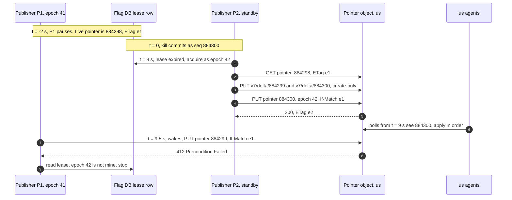

# Deep dive: propagation and the kill switch

> One-line answer: every committed transaction becomes one immutable delta file, written to each region's object storage before that region's 100-byte pointer moves. One agent per host polls the pointer every 5 s (±20%) through a regional cache with `max-age=1`, applies deltas strictly in seq order, and reports a watermark. A seeded simulation of 10,000 hosts gives **p50 3.4 s, p99 6.5 s, slowest host 7.2 s** when every host is healthy, and p99 9.4 s when 2% of hosts are flaky, so the SLO counts live hosts and a failed poll retries fast. Kills also ride in the pointer as an OFF-only overlay, because the simulation showed a kill stuck 34 to 135 s behind big deltas otherwise. Publisher failover costs p99 17 to 19 s, and fenced pointer writes stop a paused old publisher from moving the pointer backwards.

Zoom-in on [`../solution.md`](../solution.md) §4.3, §5.3 and §10.4 A. Reusable blocks: [`../../../concepts/caching-patterns.md`](../../../concepts/caching-patterns.md) (`max-age`, request coalescing), [`../../../concepts/leases-fencing-clocks.md`](../../../concepts/leases-fencing-clocks.md) (the publisher lease and fenced writes), [`../../../concepts/realtime-client-server-communication.md`](../../../concepts/realtime-client-server-communication.md) (why not push). Sibling: [`fail-static-and-bad-snapshots.md`](fail-static-and-bad-snapshots.md) runs the agent's apply loop and its checks. The push version of this problem, at a far higher write rate: [`../../distributed-denylist/deep-dives/propagation-and-fan-out.md`](../../distributed-denylist/deep-dives/propagation-and-fan-out.md).

---

## 1. The path, hop by hop

Clock starts when the edit commits (the ~70 ms commit itself is before t = 0).

| Hop | Typical | Worst, healthy host | What sets it |
|---|---|---|---|
| Publisher sees the commit | 0.1 s | 0.2 s | Tails `CHANGE_LOG` every 200 ms |
| Build the delta, parse it with every SDK's parser, check limits | 0.05 s | 0.05 s | ~1 KB file [estimate] |
| PUT delta, then PUT pointer, in each region | 0.3 s | 0.45 s | Cross-region object writes [estimate]. One pipeline per region, in parallel |
| Regional cache refreshes the pointer | 0.5 s | 1 s | `max-age=1`, one origin fetch per box per second |
| Agent's next poll | 2.5 s | 6 s | 5 s ±20% |
| GET delta, verify, fsync, rename | 0.07 s | 0.11 s | 1 KB from the cache [estimate] |
| SDK sees a higher seq in the header, parses, swaps | 0.1 s | 0.16 s | 100 ms header poll, background parse [estimate] |
| **Total (simulated)** | **3.4 s median** | **7.2 s slowest** | Budget: 7.8 s |

- **The poll wait is ~70% of the budget.** Everything else adds up to about 1 s.
- **The average wait is not 2.5 s by luck.** A poll gap is `I ~ U(4, 6)` s. A commit lands in a long gap more often than a short one, so the mean wait is `E[I²] / (2 E[I]) = (25 + 0.33) / 10 = 2.53 s`.
- **Cache age and poll wait do not just add.** An agent that polls in the second after the pointer moves can hit a box that has not refreshed. It then waits one more poll. That is about `0.5 s / 5 s = 10%` of hosts, and it is why the slowest host sits near `0.7 + 1 + 6 s`.

```mermaid
%% Publisher zoom-in: one pipeline per region, files before pointer, every write conditional. Red = the publisher. It is the single writer: its failover adds 8 to 11 s to an edit, and a paused old instance could move a pointer backwards if writes were not fenced.
flowchart LR
    LOG[(CHANGE_LOG<br/>dense seq)] -->|"rows after last seq, every 200 ms"| PUB[Publisher<br/>lease epoch 42]
    LEASE[(Lease row<br/>10 s, epoch)] -->|"renewed, epoch"| PUB
    SB[Standby<br/>tails the same log] -.->|"acquire on expiry, epoch + 1"| LEASE
    PUB -->|"one delta per transaction"| VAL[Validate<br/>every SDK parser, limits]
    VAL -->|"PUT delta, create-only"| FUS[(us objects<br/>v7/delta, v7/snap)]
    FUS -->|"then PUT pointer, If-Match"| PUS[(us pointer<br/>seq, snap_seq, epoch,<br/>as_of, recent_kills)]
    VAL -->|"same pipeline, independent"| OTH[(eu and ap<br/>objects and pointers)]
    PUS -->|"origin fetch, once a second per box"| CUS[us regional cache<br/>3 boxes, max-age 1 s]
    CUS -->|"304 or new pointer, then delta"| AG[us agents<br/>~3,300 hosts]
    AG -->|"min seq loaded, kills applied"| WM[(Watermarks)]

    class LOG,LEASE,FUS,PUS,OTH,WM store
    class PUB critical
    class SB,VAL,AG service
    class CUS cache

    classDef service  fill:#dcfce7,stroke:#16a34a,stroke-width:2px,color:#111
    classDef store    fill:#ede9fe,stroke:#7c3aed,stroke-width:2px,color:#111
    classDef cache    fill:#fef3c7,stroke:#d97706,stroke-width:2px,color:#111
    classDef critical fill:#fee2e2,stroke:#dc2626,stroke-width:4px,color:#111
```



**One pipeline per region, not one barrier.** Each region gets its files, then its pointer, on its own. With a barrier across all 3, one slow region would delay every kill everywhere.

---

## 2. Simulating 10,000 hosts

What the model assumes. Values marked `[estimate]` are mine.

- 10,000 hosts over 3 regions. Each region has 3 cache boxes, and each box refreshes the pointer once a second at its own phase. Each poll hits a random box in the host's region.
- Publisher: tail `U(0, 0.2)` s, build 0.05 s, then per region PUT delta `U(0.10, 0.35)` s and PUT pointer `U(0.02, 0.10)` s [estimate].
- Agent: polls every `5 s x U(0.8, 1.2)`, on a schedule that started long before the commit. After a hit: GET delta, verify, fsync, then the SDK's 100 ms header poll and swap [estimate]. Times are "loaded in the process", which is what the watermark reports.
- Realistic mix [estimate]: 0.3% of hosts down (not serving, so not "live"). 2% flaky: half their polls time out and their apply takes 0.5 to 3 s more. 0.1% of other polls fail.
- Fast retry: after a failed poll, retry in 1 s, then 2 s, then 4 s, then back to 5 s, all jittered.
- Failover: the standby checks the lease every 1 s [estimate]. "Died t=-2 s" means the lease frees at 8 s. "Died t=0" is the worst case: the old publisher had just renewed.
- Zombie: the old publisher was paused, not dead. It wakes 0.5 s after the new pointer lands and rewrites the pointer with the previous seq.
- Big deltas ahead of the kill: 10 MB (ten 1,000-change batches) or 40 MB (a new version of a 1 M-id segment, rebuilt in ~1 s), all published with the kill. Each region's cache serves ~1 GB/s (solution.md §10.3), shared fairly, at most 100 MB/s per host [estimate]. Pointer requests are not slowed by the bulk downloads.

```python
import math, random
from collections import deque

HOSTS, REGIONS, BOXES = 10_000, 3, 3   # 3 cache boxes per region
POLL, JITTER, MAX_AGE = 5.0, 0.2, 1.0  # agent poll 5 s +-20%, pointer max-age 1 s

def pointer_times(rng, start):
    """Per region: when that region's pointer names the new seq (commit at t = 0)."""
    build = 0.05                                     # build delta, parse it, check limits
    return [start + build + rng.uniform(0.10, 0.35)  # PUT delta in this region
            + rng.uniform(0.02, 0.10)                # then PUT pointer in this region
            for _ in range(REGIONS)]

def downloads(starts, size, bw=1000.0, cap=100.0):
    """Finish times when hosts starting at `starts` each pull `size` MB through one
    region's cache: ~1 GB/s egress shared fairly, at most 100 MB/s per host [estimate]."""
    out, active, v, t, i = [], deque(), 0.0, starts[0], 0   # v: MB each active host has
    while len(out) < len(starts):
        rate = min(cap, bw / len(active)) if active else 0.0
        arrive = starts[i] if i < len(starts) else math.inf
        finish = t + (active[0] - v) / rate if active else math.inf
        if arrive <= finish:
            v, t, i = v + rate * (arrive - t), arrive, i + 1
            active.append(v + size)
        else:
            v, t = active.popleft(), finish
            out.append(t)
    return out

def run(seed, dead=0.0, slow=0.0, fail_all=0.0, fail_slow=0.0, fast_retry=False,
        takeover=None, new_windows=None, ahead_mb=0, rebuild=0.0, overlay=False):
    rng = random.Random(seed)
    start = rng.uniform(0, 0.2) if takeover is None else takeover(rng)
    tptr = pointer_times(rng, start)
    phase = [[rng.uniform(0, MAX_AGE) for _ in range(BOXES)] for _ in range(REGIONS)]
    out, hits = [], []
    for h in range(HOSTS):
        region, kind = h % REGIONS, rng.random()
        if kind < dead:
            out.append(None); continue               # host down: not serving
        is_slow = kind < dead + slow
        p_fail = fail_slow if is_slow else fail_all
        t = rng.uniform(-40, -35)                     # poll schedule started long ago
        while t < 0:
            t += POLL * rng.uniform(1 - JITTER, 1 + JITTER)
        retries, done = 0, math.inf
        while t < 120:
            if rng.random() < p_fail:                 # poll timed out
                retries += 1
                gap = min(2 ** (retries - 1), POLL) if fast_retry else POLL
                t += gap * rng.uniform(1 - JITTER, 1 + JITTER); continue
            retries = 0
            ph = phase[region][rng.randrange(BOXES)]
            refreshed = ph + math.floor((t - ph) / MAX_AGE) * MAX_AGE  # last origin fetch
            windows = new_windows(tptr[region]) if new_windows else [(tptr[region], math.inf)]
            if any(a <= refreshed < b for a, b in windows):
                post = (rng.uniform(0.02, 0.06)                  # GET delta from cache
                        + rng.uniform(0.01, 0.05)                # verify, fsync, rename
                        + (rng.uniform(0.5, 3.0) if is_slow else 0)  # flaky: slow disk, CPU
                        + rng.uniform(0.0, 0.10)                 # SDK header poll 100 ms
                        + rng.uniform(0.02, 0.06))               # parse, swap pointer
                done = t + post
                hits.append((region, t, post, h))
                break
            t += POLL * rng.uniform(1 - JITTER, 1 + JITTER)
        out.append(done)
    if ahead_mb and not overlay:                    # the kill waits for the big files first
        for r in range(REGIONS):
            mine = sorted(x for x in hits if x[0] == r)
            for (_, t, post, h), fin in zip(mine, downloads([x[1] for x in mine], ahead_mb)):
                out[h] = fin + rebuild + post
    return out                                      # overlay: the kill applies at the poll

def pct(xs, q):
    xs = sorted(xs)
    return xs[min(len(xs) - 1, math.ceil(q * len(xs)) - 1)]

def report(name, xs):
    live = [x for x in xs if x is not None]           # stats over live hosts
    every = [math.inf if x is None else x for x in xs]
    f = lambda v: "never" if v == math.inf else f"{v:5.1f}"
    share = lambda s, pool: 100 * sum(x <= s for x in pool) / len(pool)
    print(f"{name:<24}{f(pct(live, .50))} {f(pct(live, .99))} {f(max(live))} "
          f"{share(4, live):6.1f} {share(9, live):6.1f} {share(10, live):6.1f} "
          f"{share(60, live):6.2f} {share(10, every):6.1f} {share(60, every):6.2f}")

REAL = dict(dead=0.003, slow=0.02, fail_all=0.001, fail_slow=0.5)   # [estimate]
print(f"{'scenario':<24}{'p50':>5} {'p99':>5} {'max':>5} {'<=4s':>6} {'<=9s':>6} "
      f"{'<=10s':>6} {'<=60s':>6} {'all10':>6} {'all60':>6}")
report("all healthy", run(1))
report("2% flaky, 0.3% down", run(1, **REAL))
report("same + fast retry", run(1, fast_retry=True, **REAL))
report("failover, died t=-2 s", run(1, takeover=lambda r: r.uniform(8, 9), **REAL))
report("failover, died t=0", run(1, takeover=lambda r: r.uniform(10, 11), **REAL))
zombie = lambda tp: [(tp, tp + 0.5)]                     # old publisher rewrites seq-1
report("zombie, no fencing", run(1, new_windows=zombie, **REAL))
report("zombie, re-assert 1 s", run(1, new_windows=lambda tp: [(tp, tp + 0.5),
                                                              (tp + 1.5, math.inf)], **REAL))
report("behind 10 x 1 MB", run(1, ahead_mb=10))
report("same, overlay", run(1, ahead_mb=10, overlay=True))
report("behind 40 MB segment", run(1, ahead_mb=40, rebuild=1.0))
report("same, overlay", run(1, ahead_mb=40, rebuild=1.0, overlay=True))
for slow in (0.005, 0.01, 0.02, 0.04):                   # SLO sensitivity, live hosts
    a = run(2, slow=slow, fail_all=0.001, fail_slow=0.5)
    b = run(2, slow=slow, fail_all=0.001, fail_slow=0.5, fast_retry=True)
    w = lambda xs: 100 * sum(x <= 10 for x in xs) / len(xs)
    print(f"flaky {100 * slow:3.1f}%: within 10 s {w(a):5.1f}% plain, {w(b):5.1f}% fast retry")
```

Output. `p50`, `p99` and `max` are seconds over live hosts. `<=4s` to `<=60s` are % of live hosts. `all10` and `all60` are % of all 10,000:

```text
scenario                  p50   p99   max   <=4s   <=9s  <=10s  <=60s  all10  all60
all healthy               3.4   6.5   7.2   61.0  100.0  100.0 100.00  100.0 100.00
2% flaky, 0.3% down       3.5   9.4  42.6   59.7   98.9   99.1 100.00   98.7  99.67
same + fast retry         3.5   7.0  33.7   59.8   99.5   99.6 100.00   99.3  99.67
failover, died t=-2 s    11.6  16.8  66.3    0.0    1.5   18.3  99.99   18.2  99.68
failover, died t=0       13.6  18.9  48.1    0.0    0.0    0.0 100.00    0.0  99.72
zombie, no fencing      never never never   11.3   11.4   11.4  11.36   11.3  11.32
zombie, re-assert 1 s     4.5   9.4  39.3   40.7   98.9   99.1 100.00   98.8  99.67
behind 10 x 1 MB         33.1  34.3  34.4    0.9    1.2    1.2 100.00    1.2 100.00
same, overlay             3.4   6.5   7.2   61.0  100.0  100.0 100.00  100.0 100.00
behind 40 MB segment    134.1 135.3 135.4    0.0    0.0    0.0   0.00    0.0   0.00
same, overlay             3.4   6.5   7.2   61.0  100.0  100.0 100.00  100.0 100.00
flaky 0.5%: within 10 s  99.8% plain,  99.9% fast retry
flaky 1.0%: within 10 s  99.6% plain,  99.9% fast retry
flaky 2.0%: within 10 s  99.2% plain,  99.7% fast retry
flaky 4.0%: within 10 s  98.5% plain,  99.5% fast retry
```

Across seeds 1 to 8 the healthy p99 moves between 6.5 and 6.9 s and the slowest host between 7.2 and 7.5 s. The realistic p99 moves between 8.0 and 9.5 s. The big-delta rows move by under 0.2 s.

**What the simulation decided.**

| Question | Simulated | So the design |
|---|---|---|
| Does a 5 s poll meet "99% in 10 s"? | Healthy: p99 6.5 s, slowest 7.2 s, inside the 7.8 s budget | Polls. No push tier |
| Over which hosts? | Over all 10,000: 98.7% in 10 s and 99.67% in 60 s. The 30 down hosts alone exceed 0.01% | Counts **live** hosts (a watermark in the last 30 s). Down hosts are laggards, not SLO misses |
| What do 2% flaky hosts do? | p99 9.4 s, 99.1% of live hosts in 10 s: 0.1 points of margin | Retries a failed poll after 1, 2, 4 s: p99 7.0 s, 99.6%. Holds past 4% flaky |
| What does the kill view show early? | 59.7% at 4 s, 98.9% at 9 s | Teaches on-call to expect ~60% at 4 s and 99% of live hosts by 10 s |
| Kill during publisher failover | p99 16.8 s, or 18.9 s if it died just after renewing | Accepts p99 17 to 19 s. A 5 s lease is the knob (§3) |
| A paused old publisher rewrites the pointer | Only 11.4% of hosts got the kill (7 to 13% across seeds). The rest sat one seq behind until the next edit | Fences every pointer write (§3) |
| A kill behind 10 MB or 40 MB of deltas | p99 34.3 s and 135.3 s: every host first pulls the bytes through a shared ~1 GB/s | Carries recent kills in the pointer as an OFF-only overlay: p99 6.5 s either way (§4) |

**Fast retry is cheap.** An agent whose polls all fail sends 5 requests in its first 12 s instead of ~2.4. A cache outage roughly doubles poll load for ~10 s, then it is back to 2,000/s.

---

## 3. Failover and fencing: the zombie publisher



- **The pointer carries the lease `epoch` and is written with `If-Match` on the last ETag.** A writer that lost the lease holds an old ETag and gets `412`. This is the "conditional write on a version" fence in the concept note. S3, GCS and Azure Blob all support it.
- **Files are create-only** (`If-None-Match: *`). A delta is a pure function of one transaction's rows: sorted records, no timestamps inside. A second writer of the same name gets `412`, reads the existing file, and checks it is byte-identical. So a cache never holds two versions of one name.
- **The active publisher re-reads each region's pointer every 1 s and rewrites it if it is not its own.** That alone brings p99 back to 9.4 s ("re-assert" row), so it covers a store without conditional writes.
- **Nothing goes backwards.** An agent ignores a pointer below its seq (sibling test 2). An SDK reloads only when the header's seq is higher than the one it holds. So a regression can only delay a host, never undo a kill it already has.
- **Fencing makes a shorter lease safe.** A 5 s lease renewed every second would cut failover to about 4 to 6 s, at one ~70 ms consensus write per second. The design keeps 10 s until failover p99 matters.

---

## 4. Kills: the prefix plus an OFF-only overlay

- **Why not a fast lane for kills.** Say a ramp commits at seq N-1 and the kill at N. A lane that delivers N before N-1 must either drop N-1 (a lost edit) or apply it after N (the ramp undoes the kill).
- **Why the strict prefix alone fails.** The kill waits for every byte ahead of it. Behind ten 1 MB batches that is p99 34.3 s. Behind a 40 MB segment version it is p99 135.3 s: 3,300 hosts x 40 MB = 132 GB through ~1 GB/s per region. Fair sharing makes it worse: nearly every host finishes near the end (p50 134.1 s).
- **The overlay.** The signed pointer carries `recent_kills: [{flag, seq}]`, every kill of the last 10 minutes, at most 100. An agent applies each entry at once as OFF on top of its prefix. Simulated p99: 6.5 s, the same as a kill with nothing ahead of it.
- **Why it is safe.** It can only turn a flag OFF, so it never exposes a unit. An entry leaves the agent's overlay only when its own prefix reaches that seq, not when the pointer stops listing it. So a host still downloading after 10 minutes keeps the kill. An unkill has a higher seq and arrives through the prefix, after the kill entry is gone.
- **Two things must see the overlay.** The SDK: its reload trigger is "header seq or overlay higher than held", because the overlay changes while the seq does not. The watermark: it reports overlay kills applied, otherwise the kill view shows ~1% at 10 s while every host already has the flag OFF.
- **Kill-specific rules stay small.** No approval and no `If-Match` (unless the flag is `kill_safe = false`). A retry with the same `Idempotency-Key` returns the same version. Segment edits are capped at 40k ids (~1 MB), so ordinary edits never put a 40 MB file in the prefix. Only a whole-list replace does.

---

## 5. Catch-up and fetch rules

| Rule | Why |
|---|---|
| `v7/delta/{N}` is named by its **first** seq and holds `base_seq = N - 1` and `last_seq`. One file per transaction. The schema version is in the path | An agent at L always knows the next name: `delta/{L+1}`. A failover cuts the same boundaries, since they come from transactions. Two schema chains never share a name (sibling §5) |
| Take the snapshot when `local < pointer.prev_snap_seq`, or on a gap or a rejected delta. Otherwise walk the deltas in order | Behind-ness is measured in snapshot intervals, not seqs. A 1,000-change batch is one 1 MB file but 1,000 seqs, so a "100 seqs behind" rule would send 10,000 hosts to an 8 MB snapshot (80 GB) after every batch (sibling test 14) |
| Walk deltas one by one | The next name comes from the current file's `last_seq`, so names cannot be fetched in parallel. One snapshot interval at the average rate is ~125 files (3,000 a day), ~2.5 s at ~20 ms each [estimate] |
| Read files from the same region as the pointer | Region B's pointer can name a file region A has not written yet |
| Never cache a 404 or a 5xx on file paths. A cache evicts an object that fails verification | File paths are cached "forever". A cached 404 or corrupt copy would block the region. The agent re-fetches once from origin, and its reject report triggers an on-demand snapshot |
| First poll at agent start is immediate, then the jittered schedule | A booting host catches up at once. Every fallback copy can predate a kill |
| The pointer carries a signed `as_of`, rewritten every 60 s | `as_of` over 2 min old means a wedged cache: fail over to another region's cache. Readiness uses the same clock (sibling §2) |

---

## 6. "Did my kill land?": the propagation view

- **Source.** Each SDK pushes the seq it has loaded to the agent on every swap (the 1-minute eval-count cadence would make the watermark lag by up to 60 s). The agent reports the minimum across its processes, dropping a process that has been silent for ~30 s, plus the overlay kills applied. A process with a dead reload thread shows up instead of hiding behind a healthy agent.
- **Timing.** The curve uses each host's `applied_at`, so it is right once reports arrive. Reports are coalesced to at most one per 5 s, so the live view trails reality by up to 5 s.
- **Denominator.** Live hosts. A laggard is a live host below the seq 30 s after publish, classified as dead, rejecting files, or in a slow region. A host more than 5 min behind is flagged, and more than 1% of live hosts pages.
- **What to expect, and say out loud:** about 60% at 4 s, 99% of live hosts by 10 s, the rest named.

---

## 7. Push: what it would buy, and the cheap seam

- Push would cut p50 from 3.4 s and p99 from 6.5 s to under 1 s each [estimate]. That is 3 to 6 s on a path where a human takes minutes to decide.
- With the agent tier, push means **10,000 connections, not 50,000**. Connection count is not the argument against it. A stateful tier that must deliver in order is, plus a reconnect storm after each relay deploy, plus a file path you keep anyway for boot, gaps and catch-up.
- **The seam if an SLO ever needs under 2 s: a nudge.** A small service tells agents "poll now". It carries no data, so it needs no order and no durability, and it cannot deliver a bad file. A lost nudge costs the normal 5 s poll.

---

## 8. Numbers to say out loud

- Poll 5 s ±20%: 2,000 req/s fleet-wide, ~670/s per region, mostly `304`. Mean wait 2.53 s.
- Healthy fleet: p50 3.4 s, p99 6.5 s, slowest 7.2 s. Budget 7.8 s. About 60% at 4 s.
- 2% flaky hosts: p99 9.4 s, 99.1% of live hosts in 10 s. Fast retry: p99 7.0 s, 99.6%.
- Failover p99 17 to 19 s. Unfenced zombie: ~89% of hosts one seq behind.
- Kill behind 10 MB / 40 MB: p99 34 s / 135 s on the prefix, 6.5 s with the overlay.
- SLO over live hosts. Delta names: first seq. Snapshot when behind `prev_snap_seq`, or on a gap or reject.
