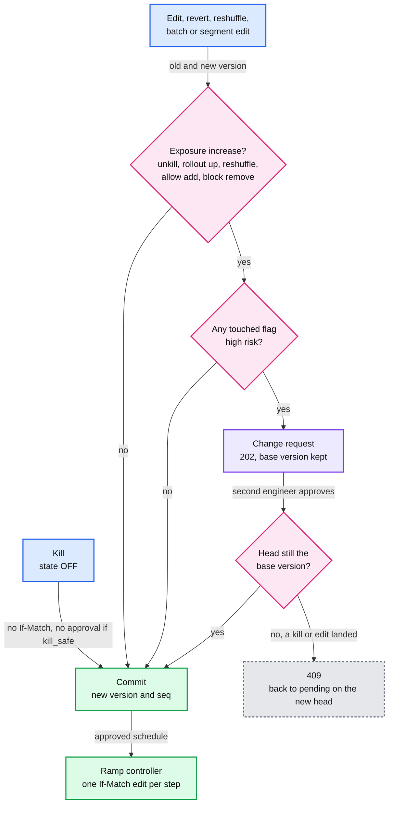

# Deep dive: safe changes and flag lifecycle

> One-line answer: the data plane delivers any edit to 99% of live hosts in under 10 s, so the likely outage is a person doing the wrong thing fast. One rule decides what waits: approval follows **effective exposure**. An edit on a `high`-risk flag waits for a second approver if it can turn the feature **on** for any unit that had it off, whether it is a ramp, an unkill, a revert, a reshuffle or a segment edit. Every approval is applied with the version it was based on, and every distinct kill writes a new version, so a stale approval can never undo a kill. A guarded ramp compares the merchants a step adds with their own recent past and with the off cohort (difference in differences), because a plain on-vs-off test pauses 18% of healthy steps on concentrated traffic. Release flags expire into tickets, never into behaviour changes. A flag is archived only after telemetry shows zero evaluations, and its key is reserved forever (Knight Capital).

Zoom-in on [`../solution.md`](../solution.md) §5.7 and §4.4. Reusable block: optimistic concurrency in [`../../../concepts/mvcc-and-isolation.md`](../../../concepts/mvcc-and-isolation.md) (`If-Match` is OCC on one row). Sibling: [`lists-segments-and-cross-service.md`](lists-segments-and-cross-service.md) for segment edits, exposure logging and the sample ratio mismatch check.

---

## 1. Which edits wait: the exposure rule

| Edit | Exposure increase? | `low` risk | `high` risk |
|---|---|---|---|
| Kill (`state OFF`) | never | now. No `If-Match`. A retry with the same `Idempotency-Key` returns the same version | now, unless the flag is `kill_safe = false`: then an approver |
| Rollout down, block add, allow remove | no | now | now |
| Rollout up | yes | now | second approver, then the guarded ramp |
| Unkill (`OFF -> ON`), including a revert to the pre-kill version | yes | now | second approver |
| Reshuffle (new salt) at 0 < rollout < 100% | yes: at 10%, ~9% of units move in and ~9% move out. A flag nested on this salt is reshuffled in the same batch | now | second approver |
| Allow add, block remove | yes | now | second approver |
| New allow segment, or members added to an allow segment, removed from a block segment | yes, for every flag that references it | the strictest tier of the referencing flags decides | same |
| More than 200 flags (1%) touched by one principal in a sliding hour, batch or not | not the question | `bulk` marker and an approver | same |

- **One rule instead of a list of cases.** "Increase" means: some unit that evaluated false under the old version can evaluate true under the new one. The function in §2 is five lines.
- **Reverts are not special.** A revert carries `If-Match` like any edit. One that lowers exposure is a decrease and never waits. One that re-exposes (the pre-kill version after a kill) is `OFF -> ON` and waits. That is the `Killed --> Running: fixed, re-approved` arrow in solution §5.7.
- **Approval binds to a base version.** A change request stores the `If-Match` it was made against. If a kill or any edit lands first, applying it returns `409` and the request goes back to pending against the new head, for re-approval. The approver is not the author, and requests expire after 24 h [estimate].
- **Kills stay fast, and stale edits cannot beat them.** Every distinct kill writes a new version, even on a flag that is already off, so any unkill or revert prepared before it gets `409`. A flag whose off path is itself dangerous is marked `kill_safe = false`: its kill needs an approver, break-glass skips it, and on a regression the guard only pauses its ramp instead of dropping the rollout to 0 bp.
- **A schedule is approved once.** The ramp controller then writes each step as an ordinary edit with `If-Match`. If a person edits in between, the controller's next step gets `409` and the ramp pauses. It never overwrites a human.



## 2. Code: the gate, and a stale approval meeting a kill

```python
from dataclasses import dataclass, replace

@dataclass(frozen=True)
class V:                                   # the fields of a flag version that decide exposure
    version: int; state: str; rollout_bp: int; salt: str
    allow: frozenset = frozenset(); block: frozenset = frozenset()

def exposure_increase(old, new):
    """Every way `new` can return true for a unit that `old` returned false for."""
    if new.state == "OFF": return []
    if old.state == "OFF": return ["unkill"]
    return [why for why, hit in [
        ("rollout up", new.rollout_bp > old.rollout_bp),
        ("reshuffle", new.salt != old.salt and 0 < new.rollout_bp < 10_000),
        ("allow add", bool(new.allow - old.allow)),
        ("block remove", bool(old.block - new.block))] if hit]

class Flag:
    def __init__(self, risk, head): self.risk, self.head, self.crs, self.kills = risk, head, [], {}
    def _commit(self, new):
        self.head = replace(new, version=self.head.version + 1)
        return f"200 v{self.head.version}"
    def patch(self, if_match, new, approved=False):
        if if_match != self.head.version: return f"409 head is v{self.head.version}"
        inc = exposure_increase(self.head, new)
        if inc and self.risk == "high" and not approved:
            self.crs.append([if_match, new])   # the change request remembers its base version
            return f"202 change request {len(self.crs)} ({', '.join(inc)})"
        return self._commit(new)
    def approve(self, cr):                 # applied with the base version, like any If-Match edit
        out = self.patch(*self.crs[cr - 1], approved=True)
        if out.startswith("409"):          # back to pending, re-based on the new head
            self.crs[cr - 1][0] = self.head.version
            out += ", back to pending"
        return out
    def kill(self, key):                   # no If-Match, no approval. A retry with the same key
        if key not in self.kills:          # returns the same version. A distinct kill writes a new
            self._commit(replace(self.head, state="OFF"))   # version even on a killed flag
            self.kills[key] = self.head.version
        return f"200 v{self.kills[key]}"

f = Flag("high", V(12, "ON", 500, "9f3c" * 8))   # a high-risk flag at 5%, salt = 32 hex chars
h = lambda **kw: (f.head.version, replace(f.head, **kw))   # an edit based on the current head
for name, act in [
        ("owner: block acct_9",        lambda: f.patch(*h(block=frozenset({"acct_9"})))),
        ("owner: unblock acct_9",      lambda: f.patch(*h(block=frozenset()))),
        ("owner: allow acct_test",     lambda: f.patch(*h(allow=frozenset({"acct_test"})))),
        ("owner: reshuffle the 5%",    lambda: f.patch(*h(salt="77aa" * 8))),
        ("owner: 5% down to 1%",       lambda: f.patch(*h(rollout_bp=100))),
        ("owner: ramp 1% to 25%",      lambda: f.patch(*h(rollout_bp=2_500))),
        ("guard monitor: kill k1",     lambda: f.kill("k1")),
        ("approver: approve CR 4",     lambda: f.approve(4)),
        ("guard monitor: retry k1",    lambda: f.kill("k1")),
        ("owner: revert to v14",       lambda: f.patch(15, replace(f.head, state="ON"))),  # = v14
        ("on-call: kill k2",           lambda: f.kill("k2")),
        ("approver: approve CR 5",     lambda: f.approve(5))]:
    print(f"{name:25} -> {act()}")
```

Output:

```text
owner: block acct_9       -> 200 v13
owner: unblock acct_9     -> 202 change request 1 (block remove)
owner: allow acct_test    -> 202 change request 2 (allow add)
owner: reshuffle the 5%   -> 202 change request 3 (reshuffle)
owner: 5% down to 1%      -> 200 v14
owner: ramp 1% to 25%     -> 202 change request 4 (rollout up)
guard monitor: kill k1    -> 200 v15
approver: approve CR 4    -> 409 head is v15, back to pending
guard monitor: retry k1   -> 200 v15
owner: revert to v14      -> 202 change request 5 (unkill)
on-call: kill k2          -> 200 v16
approver: approve CR 5    -> 409 head is v16, back to pending
```

- Lines 1 to 3: blocking a merchant is instant, unblocking one or allow-listing one on a `high` flag is not. Safety moves fast, exposure moves through a second person.
- Line 8 is the property that matters: the ramp to 25% was requested against v14, the guard's kill made v15, so the approval bounces back to pending. Without the base version, a reviewer clicking "approve" five minutes into an incident would unkill the feature at 25%.
- Line 9: the guard's retry with the same key does not write another version. Lines 10 to 12: "revert to the last good version" is an unkill and waits, and a second, distinct kill (v16) bounces that approval too.

## 3. The guarded ramp: how long until the guard can tell?

Setup: the new code path fails 0.9% of requests against a 0.2% baseline. Steps at 1% and 5%. A pooled two-proportion z-test, on cohort worse than off cohort, one look per minute during the 30-minute bake. Path traffic is an [estimate]: 20 r/s (a refund-like path), 200 r/s, 2,000 r/s (a charge-like path). Every request is treated as independent here; §4 removes that assumption.

```python
import math, random, statistics
random.seed(56)                       # Python 3.12+ for random.binomialvariate
P0, P1, BAKE = 0.002, 0.009, 30       # baseline and regressed error rate, bake minutes

def z_two_prop(e1, n1, e0, n0):       # pooled two-proportion z, one-sided (on worse than off)
    p = (e1 + e0) / (n1 + n0)
    return 0.0 if p in (0, 1) else (e1 / n1 - e0 / n0) / math.sqrt(p * (1 - p) * (1 / n1 + 1 / n0))

def bake(rps, share, p_on, z_cut, min_err):
    """One step, one look a minute. Returns (minute paused, extra failed requests) or (None, None)."""
    on, off = round(rps * 60 * share), round(rps * 60 * (1 - share))
    e1 = e0 = 0
    for m in range(1, BAKE + 1):
        e1 += random.binomialvariate(on, p_on)
        e0 += random.binomialvariate(off, P0)
        if e1 >= min_err and z_two_prop(e1, on * m, e0, off * m) >= z_cut:
            return m, e1 - round(on * m * P0)
    return None, None

print("guard                  path r/s  step  false pause  caught in 30 min  median min  extra errors")
for name, z_cut, min_err in [("naive z>=1.96", 1.96, 1), ("z>=3.3, >=3 errors", 3.3, 3)]:
    for rps in (20, 200, 2_000):
        for share in (0.01, 0.05):
            null = [bake(rps, share, P0, z_cut, min_err)[0] for _ in range(2_000)]
            hit = [r for r in (bake(rps, share, P1, z_cut, min_err) for _ in range(2_000)) if r[0]]
            fp = sum(m is not None for m in null) / len(null)
            print(f"{name:22} {rps:8,} {share:5.0%} {fp:12.1%} {len(hit) / 2_000:17.1%}"
                  f" {statistics.median(m for m, _ in hit):11.1f} {statistics.median(x for _, x in hit):13.1f}")
```

Output:

```text
guard                  path r/s  step  false pause  caught in 30 min  median min  extra errors
naive z>=1.96                20    1%        18.4%             77.0%         5.0           1.0
naive z>=1.96                20    5%        22.6%             99.6%         3.0           2.0
naive z>=1.96               200    1%        19.6%            100.0%         2.0           2.5
naive z>=1.96               200    5%        15.9%            100.0%         1.0           5.0
naive z>=1.96             2,000    1%        15.0%            100.0%         1.0           9.0
naive z>=1.96             2,000    5%        16.1%            100.0%         1.0          42.0
z>=3.3, >=3 errors           20    1%         1.8%             49.6%        17.0           3.0
z>=3.3, >=3 errors           20    5%         2.1%             96.1%         7.0           4.0
z>=3.3, >=3 errors          200    1%         1.8%             99.9%         4.0           4.0
z>=3.3, >=3 errors          200    5%         1.4%            100.0%         1.0           7.0
z>=3.3, >=3 errors        2,000    1%         1.7%            100.0%         1.0          10.0
z>=3.3, >=3 errors        2,000    5%         0.9%            100.0%         1.0          42.0
```

What the numbers say:
- **Thirty looks are not one test.** "p < 0.05" checked every minute pauses 15 to 23% of healthy steps. A ramp compares cohorts at 4 steps (1, 5, 25, 50%; at 100% there is no off cohort), so about half of healthy ramps would page someone. Raising the bar to z ≥ 3.3 with at least 3 on-cohort errors brings it to 0.9 to 2.1% per step and still catches the regression at the 5% step on every path.
- **Samples decide, not minutes.** The pause comes after 3 to 10 extra failed requests whatever the traffic. The exception is 2,000 r/s at 5%: 100 on-cohort requests a second fail 0.7 extra a second, so one-minute looks cost 42. Busy paths want 10 s looks. Flow 6's "12 minutes" fits a quiet path: the same code at 8 and 10 r/s gives medians of 12 and 11 minutes.
- **A 30-minute bake on a quiet path is not evidence.** At 20 r/s the 1% step sees 360 on-cohort requests and catches the regression half the time. The 5% step sees 1,800 and catches 96%. So promotion needs 30 minutes **and** about 1,500 on-cohort requests [estimate, from those two rows]. Short of that, the step stays in "baking, not enough data". Promoting anyway is an explicit, logged owner override.
- **A pause leaves the bad path running.** At 2,000 r/s, the 5% cohort fails 0.7 extra requests a second until someone acts: about 630 in a 15-minute page response [estimate], against 42 to detect. For `high` flags the default action should be "drop to 0 bp and page". That is a decrease, so it needs no approval, and allow-listed test accounts keep the feature. A full kill stays opt-in, and neither applies to a `kill_safe = false` flag, which only pauses and pages.

## 4. Merchant mix: the noise a request-level test ignores

The cohort is a set of merchants, not a set of requests. Merchants differ, and a few carry most of the traffic. Model [estimate]: 20,000 active merchants on the path with heavy-tailed traffic, 1 in 20 with a broken integration failing 2.1% of requests (the rest 0.1%). Each trial is a new flag, so a new salt picks a new 5%. One look at the end of the bake, z ≥ 3.3, three tests: on vs off now (naive), on now vs the same merchants over the 2 hours before the step (own past), and the difference of those two differences (DiD).

```python
import math, random
random.seed(56)                        # Python 3.12+ for random.binomialvariate
M, SHARE, WIN, PRE = 20_000, 0.05, 1_800, 7_200  # merchants, 5% step, 30 min bake, 2 h before it
w = [random.paretovariate(1.16) for _ in range(M)]                  # heavy-tailed traffic share
w = [x / sum(w) for x in w]
p = [0.021 if random.random() < 0.05 else 0.001 for _ in range(M)]  # 1 in 20 has a broken integration
WP = sum(a * b for a, b in zip(w, p))
top = sorted(w, reverse=True)
print(f"top merchant {top[0]:.1%} of traffic, top 10 {sum(top[:10]):.1%}, weighted error rate {WP:.3%}")
shares = sorted(sum(w[m] for m in random.sample(range(M), int(M * SHARE))) for _ in range(2_000))
print(f"traffic share of a 5% merchant cohort: p10 {shares[200]:.1%}, median {shares[1_000]:.1%}, "
      f"p90 {shares[1_800]:.1%}, max {shares[-1]:.1%}")

def cell(sw, swp, rps, extra, secs=WIN):  # one cohort, one window: (errors, requests)
    n = round(sw * rps * secs)
    return random.binomialvariate(n, swp / sw + extra), n

def diff(a, b):                        # pooled two-proportion: (difference, variance)
    (e1, n1), (e0, n0) = a, b
    q = (e1 + e0) / (n1 + n0)
    return e1 / n1 - e0 / n0, q * (1 - q) * (1 / n1 + 1 / n0)

def z(d, v): return d / math.sqrt(v) if v > 0 else 0.0

print("path r/s  regression  incident  pause naive  pause own-past  pause DiD")
for rps in (20, 200, 2_000):
    for reg, inc in [(0, 0), (0, 0.003), (0.007, 0)]:
        naive = past = did = 0
        for _ in range(2_000):           # each trial is a new flag: a new salt, a new 5% of merchants
            on = random.sample(range(M), int(M * SHARE))
            sw = sum(w[m] for m in on); swp = sum(w[m] * p[m] for m in on)
            now_on, now_off = cell(sw, swp, rps, reg + inc), cell(1 - sw, WP - swp, rps, inc)
            pre_on, pre_off = cell(sw, swp, rps, 0, PRE), cell(1 - sw, WP - swp, rps, 0, PRE)
            (d1, v1), (d0, v0) = diff(now_on, pre_on), diff(now_off, pre_off)
            naive += z(*diff(now_on, now_off)) >= 3.3      # on vs off, this window
            past += z(d1, v1) >= 3.3                        # on vs its own last 2 hours
            did += z(d1 - d0, v1 + v0) >= 3.3               # (on now - on before) - (off now - off before)
        print(f"{rps:8,} {reg:11.1%} {inc:9.1%} {naive / 2_000:12.1%} {past / 2_000:15.1%} {did / 2_000:10.1%}")
```

Output:

```text
top merchant 10.3% of traffic, top 10 20.4%, weighted error rate 0.177%
traffic share of a 5% merchant cohort: p10 3.5%, median 4.4%, p90 6.1%, max 17.8%
path r/s  regression  incident  pause naive  pause own-past  pause DiD
      20        0.0%      0.0%         0.9%            0.1%       0.1%
      20        0.0%      0.3%         0.1%           23.3%       0.4%
      20        0.7%      0.0%        92.8%           78.8%      77.2%
     200        0.0%      0.0%         5.2%            0.1%       0.1%
     200        0.0%      0.3%         1.9%           99.4%       0.7%
     200        0.7%      0.0%       100.0%          100.0%     100.0%
   2,000        0.0%      0.0%        18.5%            0.0%       0.1%
   2,000        0.0%      0.3%        12.0%          100.0%       0.9%
   2,000        0.7%      0.0%       100.0%          100.0%     100.0%
```

- **"5%" is 5% of merchants, not of traffic.** The cohort carried 3.5 to 6.1% of requests (p10 to p90), and once 17.8%, when the 10.3% merchant landed in it. The console should show the cohort's traffic share, from evaluation counts by decision, next to the unit share. The biggest merchants can be held on the block list until a deliberate step.
- **More traffic makes the naive test worse.** No regression, and it pauses 0.9%, 5.2%, then 18.5% of steps as traffic grows. Sampling noise shrinks with traffic. The merchant-mix noise it ignores does not.
- **Comparing with its own past fails on any incident.** A +0.3 point error rise for everyone (a slow downstream) pauses 23 to 100% of steps.
- **DiD holds at 0.1 to 0.9% in every no-regression row** and still catches the regression at 200 r/s and up. It costs power on a quiet path (77% vs 93% at 20 r/s), which the sample floor in §3 already covers. Caveat: the model holds each merchant's rate fixed between windows. Real rates drift, so real DiD false pauses will be higher than shown [estimate], still far below naive.
- **How the SDK makes DiD possible.** During a guarded ramp it tags three labels, not two: `on`, `next` (`current_bp ≤ bucket < next_bp`, the units the next step adds) and `off`. So the guard already has the next cohort's own baseline before it turns on. Units that were on before the step are left out of the step's test.

## 5. What the guard must not trust

```mermaid
%% Guard data path during a ramp. Red = the metrics pipeline: if it lags or drops a flag's series the guard is blind, so no data means the ramp holds. It promotes on evidence only.
flowchart LR
    SDK[SDK<br/>decision, cohort on, next, off] -->|"tag on request context"| MW[Request-end middleware<br/>status, latency]
    MW -->|"counters per flag, cohort, minute"| MP[Metrics pipeline]
    MP -->|"on, next, off counts"| GM[Guard monitor<br/>unit SRM, then DiD z >= 3.3]
    EDGE[(Edge request log<br/>merchant id, status)] -->|"cohort recomputed from salt and id"| GM
    GM -->|"enough samples, no regression"| RC[Ramp controller]
    RC -->|"next step, If-Match"| API[Flag admin API]
    GM -->|"regression: 0 bp or pause, page"| API
    API -->|"new version, about 8 s to the fleet"| SDK
    GM -->|"page"| OWN[Flag owner]

    class SDK,MW,GM,RC,API service
    class MP critical
    class EDGE store
    class OWN client

    classDef client   fill:#dbeafe,stroke:#2563eb,stroke-width:2px,color:#111
    classDef service  fill:#dcfce7,stroke:#16a34a,stroke-width:2px,color:#111
    classDef store    fill:#ede9fe,stroke:#7c3aed,stroke-width:2px,color:#111
    classDef critical fill:#fee2e2,stroke:#dc2626,stroke-width:4px,color:#111
```



- **A crash hides its own errors.** If the new path kills the request before the middleware records the outcome, the on cohort loses exactly its failures and looks healthy. The bucket is a pure function of salt and unit id, so the guard can recompute each request's cohort from the merchant id in the edge's request log and see the 5xx there. It never has to trust a tag written by the code under test.
- **Check the split on units, not requests.** A merchant cohort's request share is lumpy (3.5 to 6.1% above), so a request-level sample ratio test fails healthy ramps. Count distinct units per cohort ([`lists-segments-and-cross-service.md`](lists-segments-and-cross-service.md) §8 has the test).
- **p99 as a proportion.** A 5% cohort at 20 r/s sees 60 requests a minute, too few for its own p99. Test instead "share of on-cohort requests slower than the off cohort's p99": 1% under no regression, and the same z-test applies.
- **Independent flags do not confuse each other.** Two guarded flags on one path have independent salts, so B's regression lands equally in A's on and off cohorts. Flags that share a salt on purpose (nested cohorts, solution §5.2) do not have that property: never run guarded ramps on two of them at once.
- **At 100% there is no off cohort.** The last bake watches service-level alarms, like AWS AppConfig's bake time after 100% ([AppConfig docs](https://docs.aws.amazon.com/appconfig/latest/userguide/appconfig-creating-deployment-strategy.html)).

## 6. Lifecycle: expiry nags, archive is guarded

| State | Entered when | Do answers change? |
|---|---|---|
| active | created. `expires_at` = +90 days for release flags | no |
| permanent | owner marks it and a reviewer agrees (operational kill switches) | no, and it never expires |
| expired | `expires_at` passes | **no**: a ticket and a line on the team's hygiene report. Auto-off at expiry would be a scheduled outage |
| stale | at 0% or 100% for 30 days, or no evaluations for 30 days | no: a ticket to delete the code path |
| archived | the owner archives it after the code is gone | **yes**: every check returns its code default, `FLAG_NOT_FOUND` |

- **Archive is the only step that changes answers, so it is the guarded one.** The API refuses to archive until evaluations have been zero fleet-wide for 30 days. Archiving a 100% flag whose call sites still pass `default=false` turns the feature off everywhere at once. So the SDK reports, per flag, the code defaults its call sites pass, and the console says "archiving would turn this off in 3 services".
- **Zero must mean zero.** Agent-less processes in direct mode (batch jobs, solution §5.3) have no agent, so they report their own evaluation counts, or their flags would look unused. A month-end job evaluates a flag every 28 to 31 days, so a flag read only by monthly jobs is held to 45 days [estimate].
- **The salt is on the version,** so a revert restores the old cohort and "who was in the rollout at 14:02" is answered from history.

## 7. Never reuse a key

Knight Capital, 1 Aug 2012, from the [SEC order](https://www.sec.gov/litigation/admin/2013/34-70694.pdf): new code "repurposed a flag that was formerly used to activate the Power Peg code". One of 8 servers did not get the new code. On that server the flag turned the dead code back on: 212 parent orders became 4 million executions in about 45 minutes, a $460 million loss.

- `flag_key` is the primary key of `FLAG` and rows are never deleted. `POST /v1/flags` rejects any key ever used, and one that differs from an old key only in case or separators [estimate].
- So an old binary that still checks an archived key gets `FLAG_NOT_FOUND` and its own code default, forever. It can never pick up the state of a new feature, which is exactly what the one stale server at Knight did. A key has one meaning for its whole life, so version skew between binaries cannot change what a flag means.

## 8. Numbers to say out loud

- Exposure rule: waits only if some unit can go false to true, on a `high` flag. Kills (if `kill_safe`), decreases and block adds never wait. Reshuffle at 10%: ~9% in, ~9% out, so it waits. Change budget: 200 flags per principal per sliding hour.
- Naive per-minute z ≥ 1.96: 15 to 23% false pauses per step. z ≥ 3.3 with 3 errors: 0.9 to 2.1%.
- 0.2% to 0.9% at the 5% step: median pause at 7, 1 and 1 minutes for 20, 200 and 2,000 r/s. Promotion floor: 30 minutes and ~1,500 on-cohort requests.
- Merchant mix: a 5% cohort is 3.5 to 6.1% of traffic. Naive test false-pauses 18.5% at 2,000 r/s. DiD: 0.1 to 0.9%.
- Lifecycle: expiry 90 days, stale after 30 days at 0 or 100%, archive needs 45 days of zero evaluations fleet-wide, or 30 days plus the owner's confirmation.
- Knight: 1 of 8 servers, 212 parent orders, ~45 minutes, $460 million.
