# Diagrams: feature flag service

The D1 to D12 set from `hld/CLAUDE.md` §4. Diagrams already in [`solution.md`](solution.md) are listed with a pointer, not pasted twice. Every diagram below adds a zoom-in or a path that `solution.md` does not draw. Numbers match `solution.md`. Timeouts and durations that are new here are marked [estimate] in the caption.

| # | Diagram | Where |
|---|---|---|
| D1 | Context | below |
| D2 | Data flow | below |
| D3 | Component architecture | Zoom-out: `solution.md` §6 (publisher in red). Zoom-ins below: D3a control plane, D3b one host |
| D4 | Happy path per FR | Already in `solution.md`: FR1 edit with a conflict §4.2, FR2 one check §4.1, FR3 one edit propagating §4.3. FR1 approval path: D3a and D8a. Below: D4a FR2 one request with a reload mid-request, D4b FR3 kill and the propagation view, D4c FR4 audit and revert |
| D5 | Failure paths | Kill during publisher failover: §10.4. Below: D5a host back from a partition, D5b boot during a control-plane outage, D5c break-glass kill |
| D6 | Decision flow | Agent validation chain: §5.4. Below: D6a SDK evaluation order, D6b agent poll loop, prefix rule and kill overlay |
| D7 | Entity relationship | Control-plane schema: §3.3. Below: published files, host reports, governance |
| D8 | State machines | Guarded ramp and flag lifecycle: §5.7. Below: D8a change request, D8b host freshness |
| D9 | Deployment / topology | below |
| D10 | Scaling / partitioning | below |
| D11 | Failure mode map | below, D11a and D11b |
| D12 | Rollout / migration | Kill timing budget: §5.3. Below: migration of existing flags |

---

## D1. Context (zoom-out)

The flag service as one box. People write about 3,000 times a day. The fleet reads about 20 M times a second, but only from its own memory.

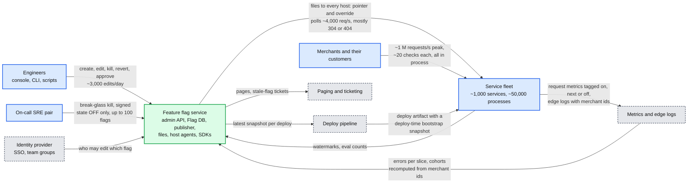

No arrow from the fleet back to the flag service carries a check. The only reads are file polls, off the request path.

## D2. Data flow (DFD)

What moves where, with format, size and rate. The steady state is tiny: one ~1 KB delta per edit to every host. A full 8 MB snapshot moves only when a host boots without a disk copy, falls behind the previous snapshot, or rejects a file and finds a newer snapshot, or into a deploy.

```mermaid
%% D2: data flow with sizes and rates. Rounded boxes are processes, cylinders are stores. The metrics store is the company's, shown because watermarks, tagged request metrics and edge logs live there.
flowchart LR
    ENG(Console, CLI, scripts) -->|"PATCH JSON ~1 KB<br/>0.035/s avg, up to ~12/s"| API(Flag admin API)
    API -->|"one txn: FLAG_VERSION ~1 KB<br/>+ CHANGE_LOG row, ~70 ms"| DB[(Flag DB<br/>~1.1 GB/year)]
    DB -->|"CHANGE_LOG rows after last seq<br/>read every 200 ms"| PUB(Publisher)
    PUB -->|"create-only signed delta ~1 KB per edit, ~1 MB per batch<br/>snap 8 MB per 1,000 changes or 1 h, pointer as_of every 60 s"| OBJ[(Object storage<br/>3 regions, deltas kept 7 days)]
    OBJ -->|"cache miss, coalesced<br/>1 origin GET per object"| CDN(Regional HTTP cache)
    CDN -->|"pointer ~100 B with recent_kills + override<br/>~4,000 req/s fleet, mostly 304 or 404<br/>delta 1 KB x 10k hosts = 10 MB per edit"| AG(Host agent x10k)
    AG -->|"snapshot.seq 8 MB<br/>tmp, fsync, rename"| DISK[(Local disk<br/>current + previous)]
    DISK -->|"parse on new generation<br/>segments by mmap"| SDK(SDK in ~50k processes)
    SDK -->|"loaded seq on each swap<br/>eval counts ~10 KB/host/min"| AG
    AG -->|"watermark = min loaded seq, up to 1 per 5 s<br/>eval counts ~1.7 MB/s fleet"| WM[(Metrics store<br/>watermarks, eval, request metrics)]
    SDK -->|"request metrics tagged on, next or off<br/>guarded flags only, up to 50"| WM
    WM -->|"errors per slice from edge logs<br/>looked at every 10 s"| GRD(Guard monitor)
    GRD -->|"rollout to 0 bp and page, rare"| API
    OBJ -->|"snap 8 MB per deploy"| CI(Deploy pipeline)
    CI -->|"bootstrap snapshot<br/>inside the deploy artifact"| SDK

    class ENG client
    class API,PUB,AG,SDK,GRD service
    class DB,OBJ,DISK,WM store
    class CDN cache
    class CI external

    classDef client   fill:#dbeafe,stroke:#2563eb,stroke-width:2px,color:#111
    classDef service  fill:#dcfce7,stroke:#16a34a,stroke-width:2px,color:#111
    classDef store    fill:#ede9fe,stroke:#7c3aed,stroke-width:2px,color:#111
    classDef cache    fill:#fef3c7,stroke:#d97706,stroke-width:2px,color:#111
    classDef external fill:#e5e7eb,stroke:#6b7280,stroke-width:2px,color:#111,stroke-dasharray:4 3
```

The biggest single transfer in steady state is a ~1 MB delta, from a 1,000-change batch or a 40k-id segment edit: `10,000 x 1 MB = 10 GB` across 3 regions in one 5 s poll window, ~0.7 GB/s per region (`solution.md` §2, §5.5).

## D3. Component architecture

The zoom-out is the final design in `solution.md` §6, with the publisher in red. Two zoom-ins follow.

### D3a. Control plane zoom-in

Inside the admin API and the Flag DB. Every path ends in one transaction that writes a version and a change-log row together, so the change log is also the outbox.

```mermaid
%% D3a: the write path. Red = the seq counter row: every commit takes the next seq from one row, so commits serialize at about one quorum round trip each (~70 ms). That caps single edits at ~12 to 15 a second, the first limit hit if edit volume grows (solution §3.3, §7).
flowchart LR
    ENG[Engineers<br/>console, CLI] -->|"PATCH or revert with If-Match, kill"| AUTH[AuthN and RBAC<br/>owner team or delegate]
    SCR[Scripts] -->|"batch, up to 1,000 changes"| AUTH
    GRD[Guard monitor] -->|"rollout to 0 bp, or pause<br/>if kill_safe = false"| AUTH
    AUTH -->|"allowed"| VAL[Validator<br/>limits at ~80%, no id on both lists,<br/>segment exists, 200 flags/h per person]
    VAL -->|"valid edit"| RISK{Exposure grows on high risk,<br/>over 200 flags, or a kill of<br/>a kill_safe = false flag?}
    RISK -->|"yes, 202"| CR[(CHANGE_REQUEST<br/>pending, base version)]
    CR -->|"second engineer approves"| TXN[Edit transaction<br/>If-Match, insert version, bump head,<br/>sign the version, admin key]
    RISK -->|"no: kills, decreases,<br/>no exposure change"| TXN
    TXN -.->|"409 at apply: back to pending"| CR
    TXN -->|"next seq, or n seqs for a batch"| CTR[(seq counter row<br/>one row, every commit)]
    TXN -->|"insert v13, head = 13"| FV[(FLAG and FLAG_VERSION<br/>kept forever)]
    TXN -->|"insert seq row, same commit"| CL[(CHANGE_LOG<br/>dense seq, the outbox)]
    CL -->|"tail seq after last, 200 ms"| PUB[Publisher]
    ENG -->|"propagation view for a seq"| PV[Propagation view<br/>reads watermarks]

    class ENG,SCR client
    class GRD,AUTH,VAL,TXN,PUB,PV service
    class RISK decision
    class CR,FV,CL store
    class CTR critical

    classDef client   fill:#dbeafe,stroke:#2563eb,stroke-width:2px,color:#111
    classDef service  fill:#dcfce7,stroke:#16a34a,stroke-width:2px,color:#111
    classDef store    fill:#ede9fe,stroke:#7c3aed,stroke-width:2px,color:#111
    classDef critical fill:#fee2e2,stroke:#dc2626,stroke-width:4px,color:#111
    classDef decision fill:#fce7f3,stroke:#db2777,stroke-width:2px,color:#111
```

"Exposure grows" means any edit, revert or unkill that raises the share of units that get `true`: a rollout increase, `OFF -> ON`, `allow_add`, a new allow segment, `block_remove`, a reshuffle, or a segment member edit that widens exposure. The guard's rollback to 0 bp is a decrease, so it needs no approval. A kill carries an `Idempotency-Key`: a retry returns the same version, but every distinct kill writes a new one. Real load is 0.035 edits/s, about 340x below the cap. A kill queued behind a batch waits one commit, under a second.

### D3b. One host zoom-in

One agent keeps a file current. About five service processes read it. The check path on the right has no I/O and no locks.

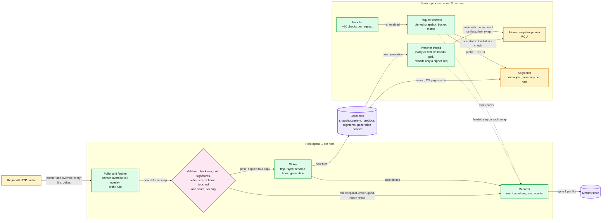

Agents verify two signatures: the admin API's on each flag version, and the publisher's on each file. The old in-memory snapshot is freed when the last request pinned to it finishes; pins expire after ~10 s. Segments are read-only files with a static open-addressing index, one copy per host in the page cache. Each snapshot's manifest names the segment versions to load with it.

## D4. Happy paths, one per FR

### D4a. FR2: one request, three checks, a reload mid-request

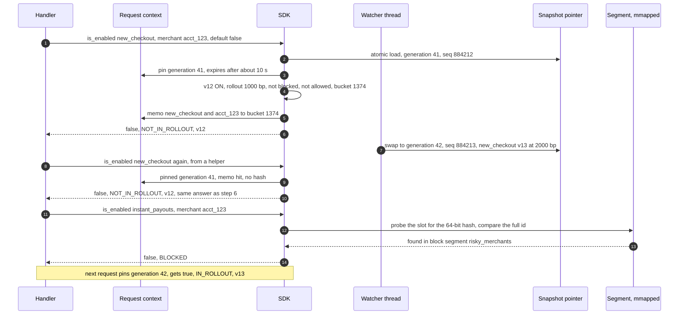

Each check is ~0.3 us. The memo means a flag checked five times in one request hashes once.

### D4b. FR3: a kill, from click to "how far did it get"

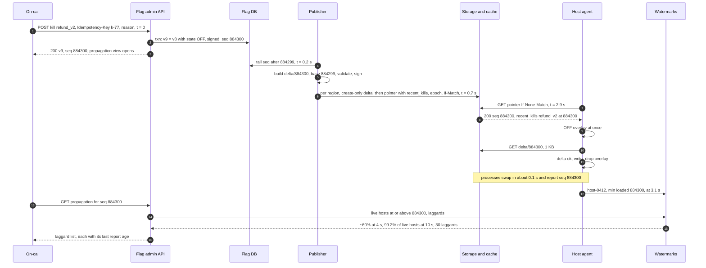

The SLO counts **live** hosts: those whose agent reported in the last 30 s. A laggard is a host still below the seq 30 s after publish, classed as dead (no report for 30 s), rejecting, or slow region. Simulated: p50 3.4 s, p99 6.5 s on a healthy fleet. Behind 10 batches the overlay keeps a kill at p99 7.3 to 7.4 s, against 32 s without it.

### D4c. FR4: audit and revert

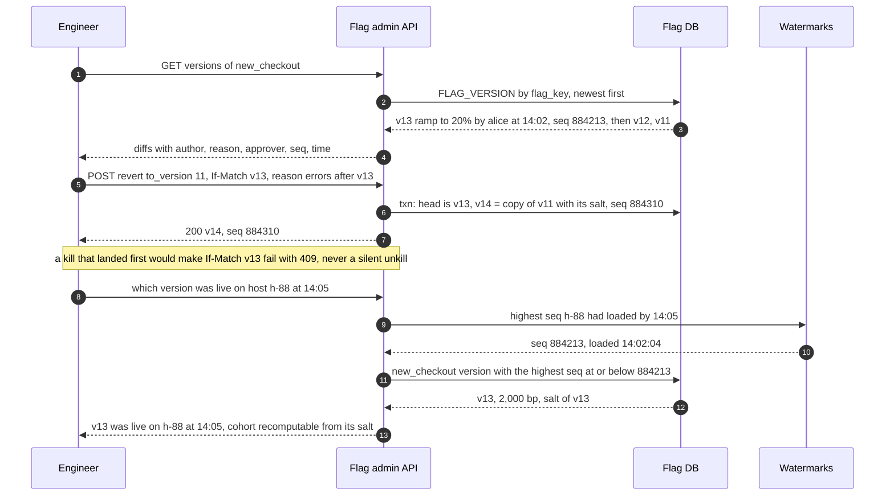

## D5. Failure paths

### D5a. A host comes back from a 2 h partition

It served its old copy the whole time. A lagging cache node serves an old pointer, and one delta arrives corrupt. The 2 s timeout is an [estimate].

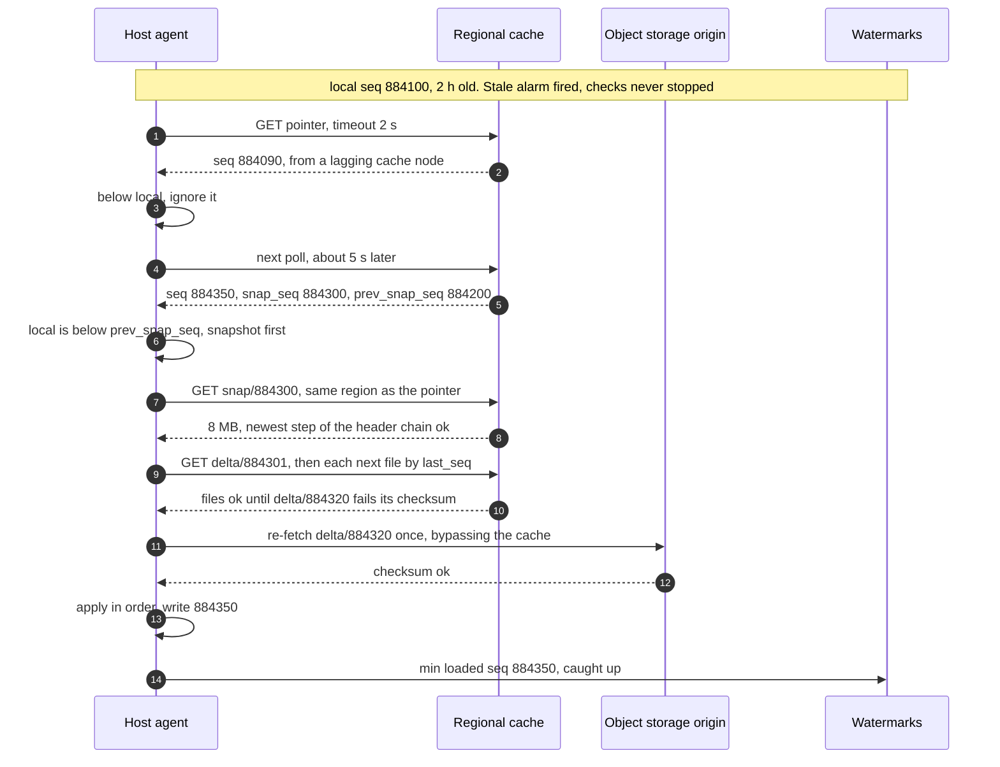

If the origin copy also fails, the delta counts as bad: load `snap/{snap_seq}` if it is newer than local, otherwise keep last-known-good (D6b). Deltas are kept 7 days.

### D5b. A new host boots during a control-plane outage, with its region's cache down too

The Flag DB and publisher have been down since 10:00, so the pointer's `as_of` stopped at 09:59. Region A's cache is down. Region B's object storage and cache still serve files. Timeouts are [estimate].

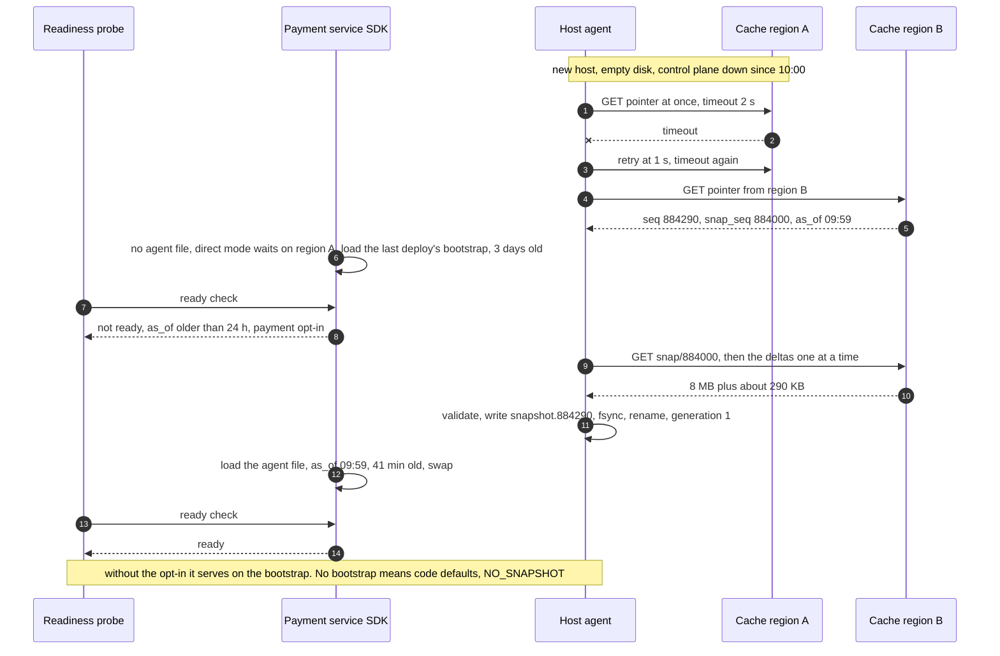

Every fallback can predate a kill. A 3-day-old bootstrap can show a killed flag as ON, which is why payment paths wait and why a booting agent polls at once.

### D5c. Break-glass kill while the Flag DB is down

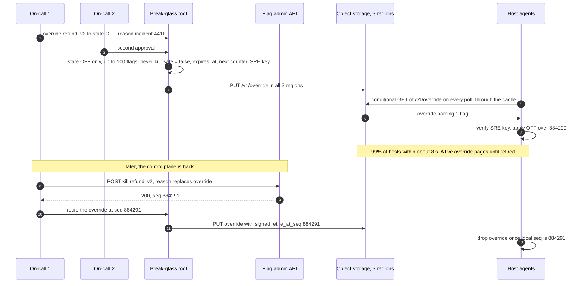

The override has its own conditional GET on every poll: about +2,000 req/s fleet-wide, ~4,000 with the pointer, nearly all `404` or `304`. Deleting it instead would turn the feature back on for any host that has not yet applied seq 884291.

## D6. Decision flows

The agent's per-file validation chain is in `solution.md` §5.4. Below are the two other branching components.

### D6a. SDK evaluation order

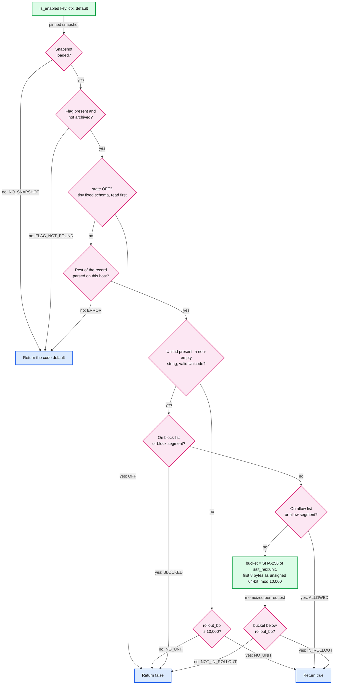

- The salt is 16 random bytes written as 32 lowercase hex characters, so the hash input for an `acct_` id is ~54 bytes, one SHA-256 block.
- The cross-language trap is the 8 bytes read as a **signed** integer (Java `%` or `floorMod`, JavaScript `parseInt`). Every SDK must read them unsigned. The golden file catches it.
- `2^64 mod 10,000 = 1,616`, so the low 1,616 buckets get one extra preimage in 1.8 x 10^19.

### D6b. Agent poll loop, prefix rule and kill overlay

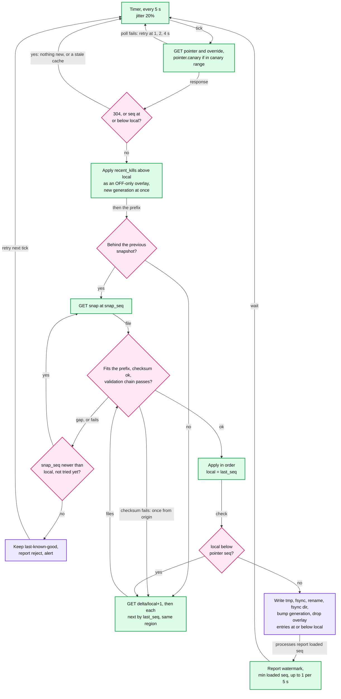

The overlay can only turn flags off, so it never exposes a unit. It also reaches a host stuck behind a rejected file. A reject report triggers an on-demand snapshot at the publisher.

## D7. Entity relationship

The control-plane schema (FLAG, FLAG_VERSION, SEGMENT, SEGMENT_CHANGE, CHANGE_LOG, CHANGE_REQUEST) is in `solution.md` §3.3. Below: what the publisher writes, what hosts report, and governance. FLAG and FLAG_VERSION appear only with the attributes §3.3 does not list.

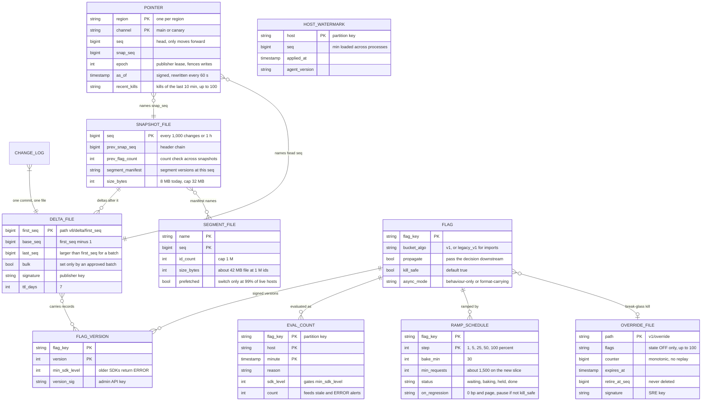

Access patterns: agents read `POINTER` by region every 5 s, then `DELTA_FILE` by `first_seq`. The propagation view counts `HOST_WATERMARK` rows at or above a seq. The stale-flag job reads `EVAL_COUNT` by `flag_key` over 30 days, and the publisher reads it by `sdk_level` to gate a flag's `min_sdk_level` at 99.9% of that flag's evaluators over 7 days. The guard monitor reads at most 50 active `RAMP_SCHEDULE` rows. Deltas live 7 days.

## D8. State machines

The guarded ramp and the flag's own lifecycle (full, stale, archived, key reserved forever) are in `solution.md` §5.7. Below: a change request, and one host's freshness.

### D8a. Change request on a high-risk flag

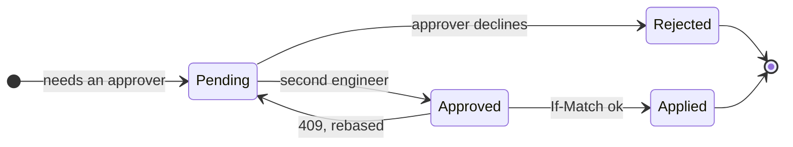

### D8b. One host's freshness

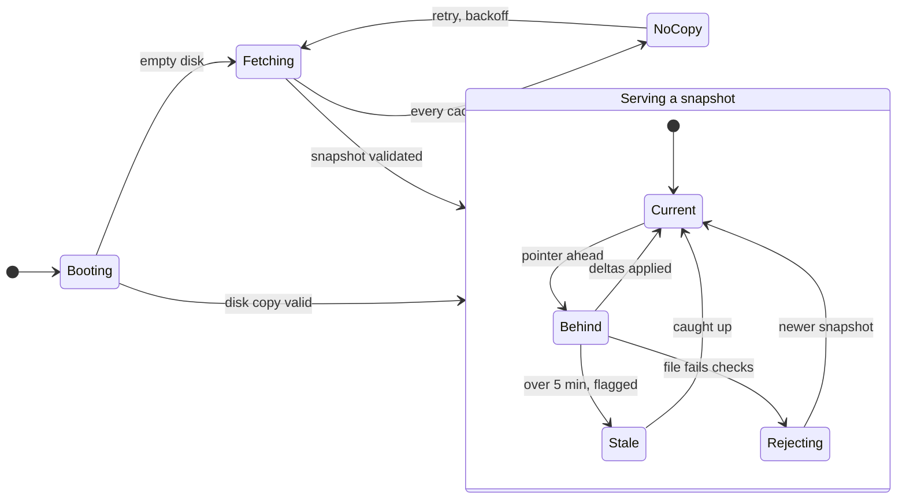

In `NoCopy`, processes run on the bootstrap snapshot or, without one, on code defaults (`NO_SNAPSHOT`). A `Stale` host is flagged. More than 1% of live hosts stale pages someone. "Confirmed current" is measured from the pointer's signed `as_of`, so a quiet day never fails readiness.

## D9. Deployment / topology

Three regions. Only Raft replication, the publisher's file writes, and an agent's fallback to another region's cache cross a region boundary.

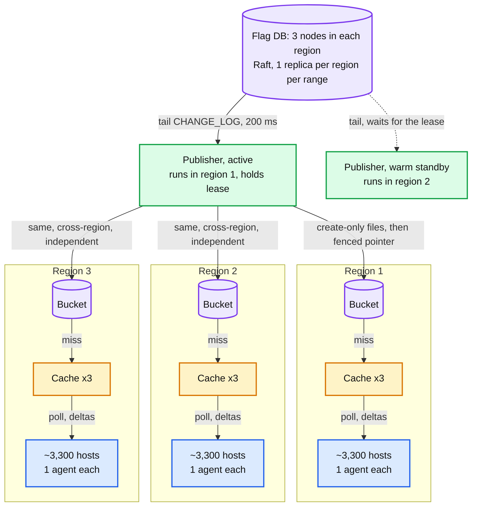

- Each Raft range has one replica per region, so a commit needs one cross-region round trip (~70 ms) and survives a region loss.
- Each region is published independently, so a slow region never delays a kill elsewhere. The pointer write carries the lease `epoch` and is conditional on the last ETag. The active publisher re-reads each region's pointer every 1 s and rewrites it if it is not its own.
- An agent whose region cache is down polls another region's cache (not drawn, to keep the regions side by side).
- The admin API is stateless and runs next to the Flag DB in every region. Total: 9 DB nodes, 2 publishers, 9 cache boxes (`solution.md` §2).

## D10. Scaling / partitioning

The data plane is replicated, not sharded: every host holds every flag. The Flag DB ranges are keyed by `flag_key`, but every commit also touches the one seq counter row (red in D3a). So the interesting picture is the fan-out tree and its one hot spot.

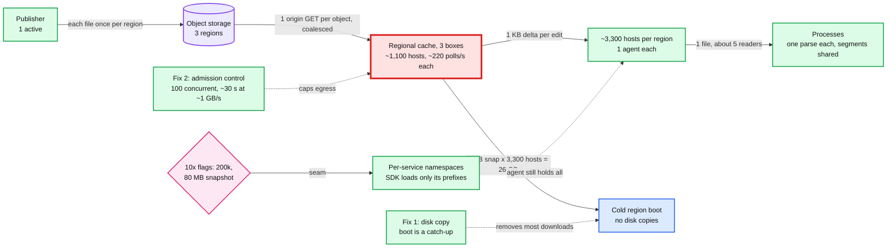

Steady state per cache box: ~220 pointer polls/s (twice that with the override poll) and ~1,100 delta fetches per edit, ~10x headroom. The largest delta is ~1 MB: a 1,000-change batch or a 40k-id segment edit. Replacing a whole list ships a new segment file (~42 MB at 1 M ids). Agents prefetch it as soon as it is published, and the switch edit is allowed only once 99% of live hosts have it; otherwise the switch would pull ~140 GB per region at once. Kills never wait behind it (overlay). Per process: ~400 checks/s against ~3 M/s per core.

## D11. Failure mode map

Component and failure, then blast radius (on the arrow), then mitigation. Split in two to stay under 15 nodes.

### D11a. Control plane and distribution

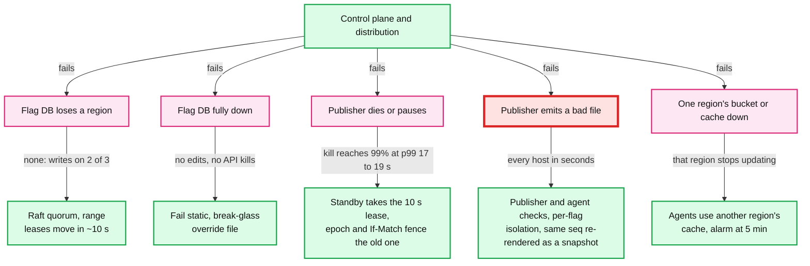

### D11b. Hosts, code and people

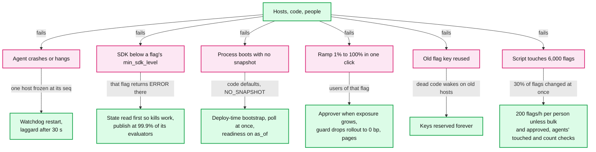

## D12. Rollout / migration

From env vars, per-service YAML or a Redis lookup to this service (`solution.md` §8). Each milestone is a rollback point. Durations are [estimate].

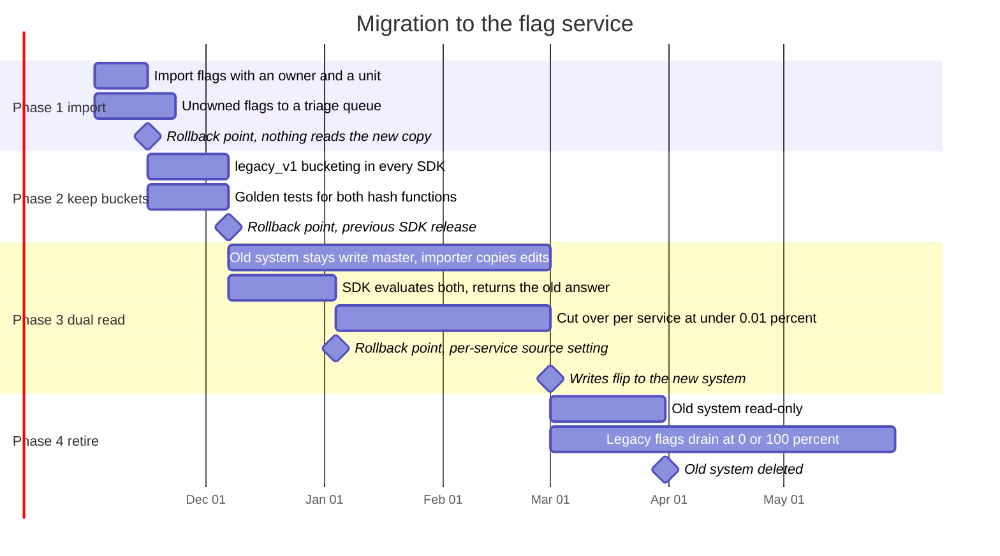

A service cuts over after a week under 0.01% mismatches. The importer keeps both systems on the same state, so migrated services see new edits. Rollback stays one per-service setting until the old system is deleted.

A new snapshot schema follows the same idea at a smaller scale: `pointer.canary` to 1%, then 10%, then all hosts, over about an hour, and only after telemetry shows the fleet can read it. The publisher writes two file chains for the same seqs, with the schema version in the path (`v7/delta/...`, `v8/delta/...`). Rollback at any step is dropping `pointer.canary`. Value changes never wait for this.
