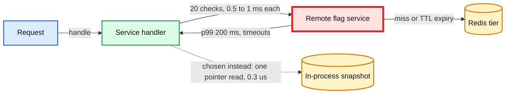
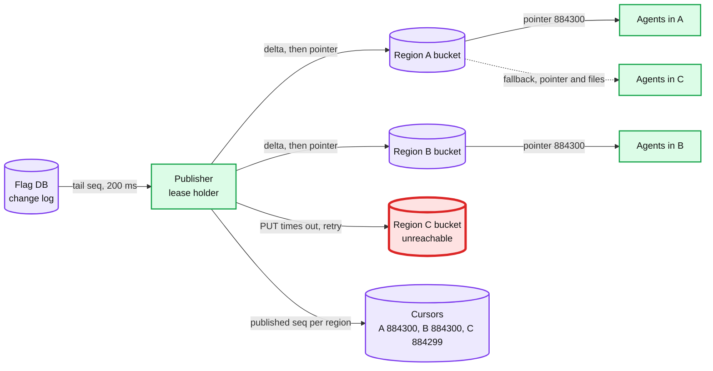
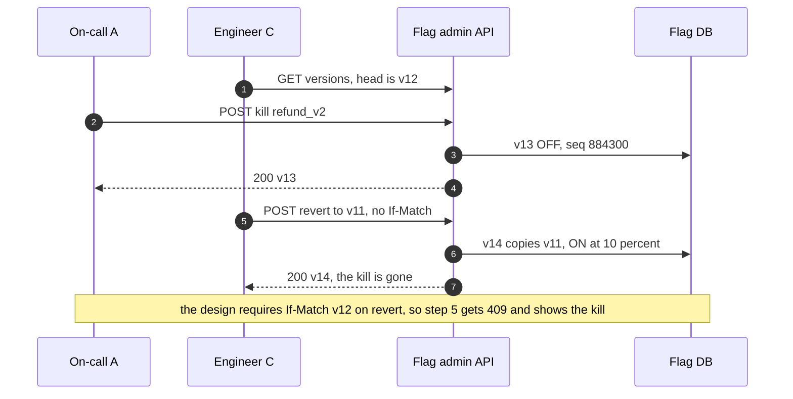
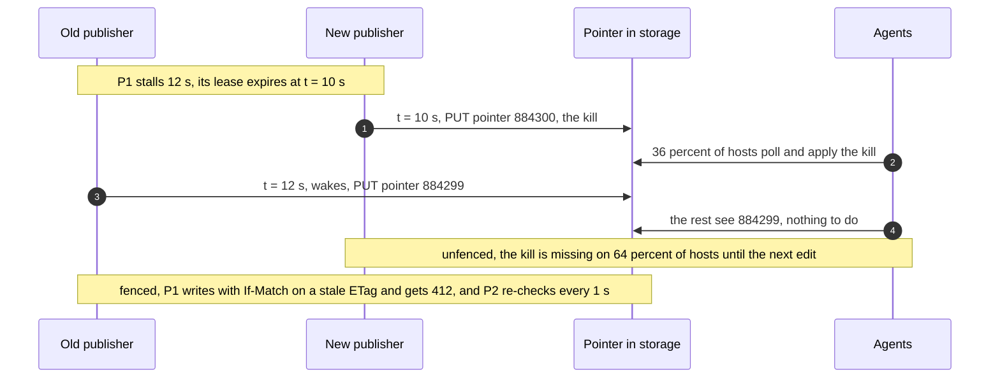
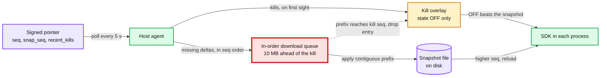

# Edge cases: feature flag service

Every entry is answerable in under 60 seconds out loud. Categories: failure, consistency, scale, data, operations, security. Design reference: [`solution.md`](solution.md).

Many entries came from an adversarial pass over the design: a buggy or hostile publisher, caches, clocks, disks, old SDKs (software development kits, the in-process flag library), scripts, racing humans. Each entry says what the design does and, where it matters, the simpler version that failed. Numbers tagged **[sim]** come from small simulations run for this file. The model is stated in the entry. Treat them like estimates.

---

## Failure

## Edge case: remote flag store slow (why a check never calls one)
- **Trigger:** the interviewer pushes the rate-limiter template: a central flag service with Redis behind it and a 30 s local TTL (time to live) cache. Then a Redis failover takes its p99 from 2 ms to 200 ms.
- **Symptom:** in that design every request in the company slows at once. About 20 checks per request, and a cold process makes all 20 calls before its first response.
- **Answer:**
  - The ratio decides: ~20 M checks/s against 0.035 edits/s, ~6 x 10^8 to 1. A remote check means 20 M remote procedure calls (RPCs) a second, or ~1 M/s batched per request, 0.5 to 1 ms on every request. Even 99.99% availability is 52 minutes a year of slow requests everywhere.
  - TTL refresh alone is `50k processes x 500 flags / 30 s ≈ 830k req/s`, and a fleet-wide deploy restarts every process cold at the same moment.
  - In this design the store can be slow or down and no check notices. Checks read an in-memory snapshot. Hosts read files, never the store. A slow store only delays edits.
  - What we gave up: a kill takes seconds (p99 6.5 s, worst ~7.8 s), not under 1 s. No human decides on a kill faster than that.
- **Diagram:**

- **Confidence:** [ ] shaky  [ ] ok  [ ] confident

## Edge case: kill during publisher failover
- **Trigger:** the active publisher dies just before on-call clicks kill on `refund_v2`.
- **Symptom:** the API returns `200, seq 884300`. The propagation view sits at 0% for ~10 s. On-call thinks the kill failed and clicks again.
- **Answer:**
  - The kill is durable at commit. Only delivery waits. The standby already tails the change log, takes the 10 s lease when it expires, builds the delta, then writes files and pointer. Simulated in `solution.md`: 99% of hosts at p99 17 to 19 s, depending on when in its lease the old publisher died.
  - The kill overlay does not help here: `recent_kills` rides on the pointer, and the pointer is what the dead publisher stopped writing.
  - The second click is harmless. Kill is idempotent by `Idempotency-Key`, so a retry returns the same version. A deliberate second kill writes another OFF version.
  - The new publisher fences the old one: its pointer writes carry the lease `epoch` and are conditional on the ETag it last saw. Publisher lag pages at 60 s, so a normal failover never pages.
- **Diagram:** `solution.md` §10.4 A.
- **Confidence:** [ ] shaky  [ ] ok  [ ] confident

## Edge case: the control plane is down and a kill is needed
- **Trigger:** the Flag DB is unavailable (a bad migration, quorum lost in 2 regions) or the admin API's auth dependency is down, during an incident.
- **Symptom:** `POST /kill` returns `503`. Checks are fine: every host fails static on its last snapshot.
- **Answer:**
  - Break-glass: two on-call engineers sign an override file and write it straight to object storage. Only `state = OFF`, at most 100 flags, never a `kill_safe = false` flag. Agents fetch `/v1/override` with its own conditional GET on every poll (~2,000 extra req/s, nearly all `404` or `304`) and apply it on top of the snapshot.
  - It carries a monotonic counter, so an old signed override cannot be replayed later. A live override pages until it is retired.
  - Retired, never deleted. When the DB returns, the kills become real versions at seq S. Deleting the file at once would let a host still behind S lose the override before it has the real kill, and the feature would come back on. A signed `retire_at_seq: S` tells each agent to drop it only once its own seq ≥ S.
  - `expires_at` only limits when the file may first be installed. An installed override never lapses on its own: if the outage runs long, a kill must not silently lift. SRE (site reliability engineering) retires it, not a timer.
- **Confidence:** [ ] shaky  [ ] ok  [ ] confident

## Edge case: a region is lost in the middle of a publish
- **Trigger:** region C's object storage stops answering after the publisher wrote the delta to A and B. Or the publisher's own region dies mid-publish.
- **Symptom:** a publisher that waited for all 3 regions before moving any pointer would stall a kill everywhere for as long as C is down.
- **Answer:**
  - So each region is published on its own: files first (create-only), then that region's pointer. The invariant is per region: a pointer never names a file missing in its own region. C falls behind and alerts. A and B deliver the kill in seconds.
  - Agents read files from the same region whose pointer they used. Hosts in C fall back to another region's cache, pointer and files together.
  - When C returns, its cursor backfills the missing deltas (or one snapshot), then moves C's pointer. If the publisher's own region died, the standby takes the lease after 10 s and resumes each region's cursor. Create-only files mean nothing is overwritten.
  - The Flag DB keeps 2 of 3 replicas and the counter row's lease moves in ~10 s. That overlaps the publisher's 10 s, so a kill sent at the moment of loss lands in about the failover time. See [`../../concepts/replication-and-quorums.md`](../../concepts/replication-and-quorums.md).
- **Diagram:**

- **Confidence:** [ ] shaky  [ ] ok  [ ] confident

## Edge case: the host agent crashes, hangs, or fills the disk
- **Trigger:** an out-of-memory kill, a deadlock, or a full disk so `snapshot.{seq}.tmp` cannot be written.
- **Symptom:** the host stops advancing. Its processes notice nothing.
- **Answer:**
  - The SDK holds an immutable snapshot in memory and the agent's last file stays readable. Nothing on the request path changes.
  - A watchdog restarts an agent that has not polled for 30 s [estimate]. A full disk fails the write before the rename, so the current file is never touched. The agent alerts and retries.
  - Segment files are mmapped, so the agent never truncates or rewrites one in place: a mapped file that shrinks raises SIGBUS and kills the reading process. New file, rename, unlink the old one.
  - With no watermark for 30 s the host is no longer live and shows as a dead laggard. A host more than 5 min behind is flagged. More than 1% of live hosts pages.
- **Confidence:** [ ] shaky  [ ] ok  [ ] confident

## Edge case: a process boots with no agent file and no reachable cache
- **Trigger:** a new container starts during a regional cache outage, before its agent has written a file.
- **Symptom:** the SDK has nothing to load.
- **Answer:**
  - Boot order: the agent's file. If it is missing or unreadable, or there is no agent, `snap/{seq}` from a cache. Then the bootstrap snapshot. Then code defaults with `NO_SNAPSHOT`.
  - The bootstrap is written into the artifact at deploy time, not build time, so even a rollback deploy carries a fresh one. Every fallback can still predate a kill, so a booting agent or direct-mode SDK polls at once instead of waiting a cycle.
  - Payment paths declare readiness as "confirmed current within 24 h", measured from the pointer's signed `as_of`, which the publisher rewrites every 60 s. A quiet holiday never fails it.
  - "Confirmed current" means the `as_of` of a pointer whose seq the host has loaded. An agent stuck rejecting files keeps seeing fresh pointers, and those must not count.
- **Confidence:** [ ] shaky  [ ] ok  [ ] confident

---

## Consistency

## Edge case: two engineers race a kill and an unkill (or a revert)
- **Trigger:** on-call A kills `refund_v2`. Engineer B, who saw the kill earlier, turns it back on. Engineer C, who had the history page open, clicks "revert to v11". A kills again when errors return.
- **Symptom:** in a naive API, A's kill returned `200`, yet the flag is ON seconds later and nobody meant to override it.
- **Answer:**
  - Two traps cause it. A revert with no `If-Match`, prepared before the kill, lands after it. A kill that is idempotent by state writes nothing on a killed flag, so a stale unkill still matches. [sim] All 90 interleavings of {A kill, kill}, {B read, unkill}, {C read, revert}: with both traps, 31 of 90 silently undo a kill (30 through the revert). With the design's rules, 0.
  - The rules: revert requires `If-Match`. Kill is idempotent by `Idempotency-Key`: a retry returns the same version, but every distinct kill writes a new version, so stale unkills and reverts get `409`. This also ends "my retry got `409` for my own commit" ([`../../concepts/exactly-once.md`](../../concepts/exactly-once.md)).
  - On a high-risk flag, an unkill is an exposure increase and needs a second approver. A `409` at apply sends the change request back to pending for re-approval.
  - Automation such as the ramp scheduler never rebases after a `409`. It pauses and pages.
- **Diagram:**

- **Confidence:** [ ] shaky  [ ] ok  [ ] confident

## Edge case: a paused old publisher writes an older pointer (zombie publisher)
- **Trigger:** the active publisher stalls for 12 s (a long garbage-collection pause, a virtual machine freeze). The standby takes the lease and publishes a kill as seq 884300. The old one wakes and finishes its in-flight write: `pointer = 884299`.
- **Symptom:** without a fence the pointer goes backwards. Hosts that already have 884300 ignore it. Hosts that had not polled see 884299, equal to their own seq, so they wait for the next edit.
- **Answer:**
  - [sim] 10,000 agents, 5 s ±20% polls, cache max-age 1 s, no edits for an hour, no fence. A stale write 2 s after the kill leaves it on 36% of hosts an hour later. At 1 s, ~15%. At 5 s, 93%. "Agents never go backwards" does not help: the stale pointer is not below their seq.
  - A lease says who should write. A fence stops whoever should not ([`../../concepts/leases-fencing-clocks.md`](../../concepts/leases-fencing-clocks.md)). Three fences: the pointer carries the lease `epoch` and is written with `If-Match` on the last ETag ([S3 conditional writes](https://docs.aws.amazon.com/AmazonS3/latest/userguide/conditional-writes.html), GCS `ifGenerationMatch` [request preconditions](https://docs.cloud.google.com/storage/docs/request-preconditions)). Files are create-only (`If-None-Match: *`).
  - Third fence: the active publisher re-reads each region's pointer every 1 s and rewrites it if it is not its own. [sim] Same run with the re-check: 100% of hosts, p99 5.7 s in a healthy fleet.
- **Diagram:**

- **Confidence:** [ ] shaky  [ ] ok  [ ] confident

## Edge case: a cache serves a stale pointer or a corrupt immutable file
- **Trigger:** a cache node keeps serving an old pointer (a bug ignores `max-age`), or it stored a truncated delta and, because deltas are `immutable`, would serve it forever.
- **Symptom:** hosts behind that cache stop advancing. Their agents keep running, so they look alive.
- **Answer:**
  - Stale pointer: safe, because agents never go back. It is detectable because the publisher rewrites the signed `as_of` every 60 s, so "no edits today" looks different from "my cache is wedged". Centrally, a live host below the head seq shows up in the propagation view.
  - Corrupt file: the naive fallback (snapshot, then replay deltas) hits the same cached bad copy and stays stuck until the next full snapshot, up to 1 h. So on a checksum failure the agent re-fetches once from origin past the cache, caches evict objects that fail verification, and agent reject reports trigger an on-demand snapshot.
  - A delta that fails validation counts as a gap: load `snap/{snap_seq}` if it is newer than the local seq. Caches never store a `404` or `5xx` on a file path.
  - Kills reach these hosts anyway through `recent_kills` on the pointer. See [`../../concepts/caching-patterns.md`](../../concepts/caching-patterns.md).
- **Confidence:** [ ] shaky  [ ] ok  [ ] confident

## Edge case: a host rolls back its disk
- **Trigger:** a VM (virtual machine) restored from a 2-hour-old disk image, or an agent that finds `current` corrupt and loads `previous`.
- **Symptom:** the agent boots at seq 884000 while the fleet is at 884300. With the cache reachable it catches up on its first poll, which happens at once on boot. Without it, the host serves the pre-kill state.
- **Answer:**
  - "Never goes back" holds only while the disk survives. Nothing local can detect a restored disk, so the immediate poll at boot is the repair.
  - The SDK enforces order itself: it reloads only when the file's seq is above the one it holds. Keying on the agent's generation counter would let an agent that falls back to `previous` move every process back a version, undoing a kill. The agent fsyncs the directory after each rename, so a power loss cannot undo one.
  - The watermark is the minimum seq loaded across the host's processes, so a host that went back shows as behind.
  - With the cache down too, this is the Knight Capital shape: one server out of many on old state. The readiness gate on `as_of` bounds how old that state can be for payment paths.
- **Confidence:** [ ] shaky  [ ] ok  [ ] confident

## Edge case: a segment edit races a flag edit
- **Trigger:** engineer A points `new_payouts` at `block_segment: risky_v2` while engineer B deletes `risky_v2`. Or someone tries to rewrite a 1 M-id allow segment as 25 removal calls and 25 add calls of 40k ids.
- **Symptom:** naively, a flag version that references a deleted segment, or minutes where an allow segment is half empty and merchants flap off.
- **Answer:**
  - The API checks segment references inside the edit's transaction. Checking before the transaction would be a time-of-check to time-of-use race.
  - A whole-list replace is a new segment version under the same name, built off-line and switched in by one edit. Hosts see the old list or the new one, never half.
  - Each snapshot carries a manifest of segment versions at its seq. The SDK loads the snapshot and those segment files together before it swaps. So stickiness is per seq, not per flag version: a segment edit changes answers with no new flag version, and `evaluate()` returns `seq`.
  - Cost of a replace: every host fetches the whole new file, ~42 MB with its index for 1 M ids. Agents prefetch it, and the switch edit waits until 99% of live hosts have it (scale entry on big deltas).
- **Confidence:** [ ] shaky  [ ] ok  [ ] confident

## Edge case: a propagated decision meets a kill
- **Trigger:** the gateway evaluated `new_checkout = true@v13` and passed it on. 2 s later the flag is killed (v14 OFF). The backend, already on v14, receives a request that carries `true@v13`.
- **Symptom:** honour the request-consistent `true`, or the kill?
- **Answer:**
  - One request, one answer, is the rule for `propagate` flags (§5.6). In the evaluation order it is step 2b: a decision passed by an internal peer on mutual TLS is returned with reason `PROPAGATED`.
  - Step 2b sits right after step 2 (`state == OFF`), so a local kill always wins, whatever the versions. A forged ON, or one minted before a kill and an unkill, can never override a kill. The feature already tolerates a change between requests, and a kill is worth one mixed request.
  - Without that exception, requests that started before the kill keep the feature, and retries can carry the old decision for minutes.
  - Data formats never rely on this. Expand/contract makes either answer safe for a reader.
- **Confidence:** [ ] shaky  [ ] ok  [ ] confident

## Edge case: a long-lived request pins a pre-kill snapshot
- **Trigger:** a streaming connection, a 2-hour export job, or a consumer loop that creates one request context and checks flags inside it for hours.
- **Symptom:** without a limit, the kill reaches 99% of live hosts in seconds but the job keeps running the killed path.
- **Answer:**
  - Pinning per request is right for a 50 ms request and wrong for a 2-hour one. So pins expire after ~10 s, and the next check re-pins to the current snapshot.
  - Long jobs create one context per unit of work (a message, a batch of 1,000 rows), never one per process.
  - The cap also bounds memory: each pinned old snapshot keeps ~8 MB alive, and a process with streams pinned across 10 versions would hold 80 MB.
- **Confidence:** [ ] shaky  [ ] ok  [ ] confident

## Edge case: async work enqueued before a kill
- **Trigger:** 2 M messages [estimate] were enqueued with `decision = ON` before the kill. Consumers need 40 minutes to drain them.
- **Symptom:** with "always decide at enqueue time", the feature keeps running after the kill while the propagation view says 100%.
- **Answer:**
  - Each flag is `format-carrying` or `behaviour-only`. The default is behaviour-only.
  - Format-carrying: the message was written in the new format, so the consumer honours the queued decision and takes the new path.
  - Behaviour-only: the consumer re-checks the flag. If it is now OFF, the kill wins and the backlog takes the old path.
- **Confidence:** [ ] shaky  [ ] ok  [ ] confident

## Edge case: clock skew on a host or on the publisher
- **Trigger:** a host clock 2 h off (a bad NTP (Network Time Protocol) source, a VM migration), or a publisher whose clock runs slow.
- **Symptom:** depends on where the clock is read.
- **Answer:**
  - Evaluation never reads a clock. No time-based rules run on hosts, expiry is a ticket in the control plane, and a scheduled change is an edit committed at its time. Two hosts never disagree because of clocks.
  - Lease: a slow publisher clock can make a paused publisher think it still holds the lease. The fences (epoch, `If-Match`, the 1 s re-check) make that harmless, so correctness never rests on the clock.
  - Watermarks: an `applied_at` from a clock 30 s fast makes a host look 30 s late, and p99 is a tail. Measure with the receiver's clock (arrival minus publish time), or correct with the offset from the cache's `Date` header, and drop samples with a large offset.
  - Age checks (24 h readiness, the override's install window, `as_of`) use wide margins and alert on clock offset instead of refusing. A host 2 days fast must not reject every snapshot as old.
- **Confidence:** [ ] shaky  [ ] ok  [ ] confident

---

## Scale

## Edge case: a script edits 10,000 flags
- **Trigger:** a migration or cleanup script, or a "kill everything team X owns" script with a broken filter.
- **Symptom:** one at a time, at ~12 to 15 edits/s, it would hold the counter row for ~11 to 14 minutes. Through the batch endpoint it is 10 transactions of 1,000 changes.
- **Answer:**
  - Throughput is fine. Safety needed more than a flag-count check: kills skip approval and do not change the count. [sim] With only "count changed under 1%", 10 batches of 1,000 kills pass every agent check and turn 10,000 flags OFF, and 300 files that each remove 0.99% of flags remove 95% in ~25 s.
  - So the design counts flags *touched*. Per delta: over 1% (200) needs `bulk` and an approver. Per principal: the API caps flags touched (killed, ramped, list-edited, removed) at 200 per sliding hour unless approved as `bulk`.
  - The agent's mirror of the hourly budget must also be per principal (each delta carries its principal and approval), never fleet-wide. [sim] 3,000 legitimate edits a day, 80% in a 10-hour working day: the busiest hour touches 270 to 320 distinct flags, over 200 on 20 of 20 simulated days.
  - Metadata-only edits (description, owner) take no seq and produce no delta.
- **Confidence:** [ ] shaky  [ ] ok  [ ] confident

## Edge case: a big batch or segment rewrite sits in front of a kill
- **Trigger:** a script sends 10 batches of 1,000 changes (~10 MB of deltas per host), or rewrites a 1 M-id segment through ~24 MB of add/remove deltas. On-call kills a flag right after.
- **Symptom:** under a strict prefix rule every host must download everything ahead of the kill. In one region that is `3,300 x 10 MB = 33 GB` through caches that serve ~1 GB/s.
- **Answer:**
  - [sim] One region, 3,333 hosts, ~1 GB/s shared fairly. Kill alone: p99 7.3 s. Behind 10 batches: p99 32 s. Behind 24 MB of segment deltas: p99 81 s.
  - So the signed pointer carries `recent_kills` (kills in the last 10 min, at most 100). Agents apply them at once as an OFF-only overlay and drop each entry when their prefix reaches its seq. OFF can only reduce exposure, and an unkill arrives later through the prefix. [sim] Kill p99 7.3 to 7.4 s in every case, and kills also reach a host stuck behind a rejected file.
  - Everything else still queues, so big writes are kept small or moved off the queue. A segment edit is capped at 40k ids (~1 MB), which delays other edits ~1 s. A whole-list replace (~42 MB per host with its index, ~140 GB per region) is prefetched by agents in the background, and the switch edit is allowed only once 99% of live hosts have the new version.
  - The pointer carries `prev_snap_seq`. An agent takes the snapshot only when it is behind the previous snapshot, or on a gap or a rejected delta; otherwise it walks deltas one at a time, each naming the next by `last_seq`. Counting seqs would send every host an 8 MB snapshot after each 1,000-change batch instead of one 1 MB delta.
- **Diagram:**

- **Confidence:** [ ] shaky  [ ] ok  [ ] confident

## Edge case: a whole region cold-boots, or a cache restart causes a herd
- **Trigger:** a region-wide power event reboots 3,300 hosts, or a cache tier restart makes 3,300 agents reconnect in the same second.
- **Symptom:** if hosts lost their disks, `3,300 x 8 MB = 26 GB` of snapshots requested within a minute. Pointer requests arrive in a burst.
- **Answer:**
  - Most hosts boot from their own disk copy and fetch only the deltas since. A reboot does not wipe the disk.
  - Hosts with no copy download under admission control: 100 concurrent downloads per region, the rest get a jittered retry-after. At ~1 GB/s the worst case is ~30 s.
  - After a failed poll an agent retries at 1, 2 and 4 s, then returns to 5 s ±20%, which re-spreads the herd within a cycle or two. Request coalescing keeps origin load at one fetch per object per cache node.
  - Processes that start before their agent use the deploy-time bootstrap. Payment paths wait on readiness.
- **Confidence:** [ ] shaky  [ ] ok  [ ] confident

## Edge case: a prefork Ruby or Python host runs 64 workers
- **Trigger:** a service runs 64 forked workers per host (Unicorn, Gunicorn), not the ~5 processes per host in the estimate.
- **Symptom:** every worker parses the 8 MB snapshot into its own objects on every edit. At ~40 MB of objects each [estimate], that is ~2.5 GB of RAM per host and 64 parses per edit.
- **Answer:**
  - Copy-on-write after fork only shares the snapshot loaded before the fork. Every reload after it is private memory per worker.
  - The seam: the agent writes a flat, pre-validated binary file (offset tables, no object graph) and every SDK mmaps it, as segments already are. One copy per host in the page cache. A reload becomes a remap and a pointer swap, not a parse.
  - That also shrinks the parser inside every service (parser entry under Security).
  - Cheap first step: the SDK reloads at most once a second [estimate], so a 10-batch script costs one reload, not ten.
- **Confidence:** [ ] shaky  [ ] ok  [ ] confident

## Edge case: 10x traffic, hosts or flags tomorrow
- **Trigger:** growth, an acquisition, or a new product that checks flags 10x more.
- **Symptom:** which component notices first?
- **Answer:**
  - 10x traffic: checks scale with each service's CPU and nothing central sees them. `200 M/s x 0.3 us` is 60 cores fleet-wide.
  - 10x hosts (100k): 20,000 polls/s plus 20,000 override GETs, ~13,000 per region, still mostly `304`. Watermark ingest at most 20,000 reports/s.
  - 10x flags (200k): an 80 MB snapshot, over the 32 MB cap. The API refuses at ~80% of the cap first, which is the §10.11 trigger for per-service namespaces.
  - 10x edits (0.35/s): still ~35x under the counter-row cap. The per-principal hourly budget, not the database, is what a busy team hits first.
- **Confidence:** [ ] shaky  [ ] ok  [ ] confident

---

## Data

## Edge case: a new rule type or schema meets an old agent or SDK
- **Trigger:** a new rule type (`country in [...]`) or snapshot schema v8, while 1,000 services deploy on their own schedules and some run a 6-month-old SDK.
- **Symptom:** an SDK that skips unknown fields would evaluate the flag without the new rule. A narrowing rule would be silently dropped and everyone in the rollout would get the feature.
- **Answer:**
  - Each flag record carries `min_sdk_level`, frozen next to `state` and `version` so every SDK can read it. An SDK below it returns the code default with `ERROR` and counts it. A kill still works there, because `state` is read first.
  - The gate is per flag: publish only when ≥ 99.9% of the processes that evaluated *that* flag in 7 days support it. A fleet-wide 99.9% would be 50 processes, one average service, left behind.
  - The publisher runs every SDK language's parser on the file (a conformance harness), not only the agent's.
  - Schema changes run two file chains (`v7/delta/...`, `v8/delta/...`) through the canary pointer, so every value change, kills included, exists in both. The on-disk format the agent writes for local SDKs needs the same care: the newest format every SDK on that host supports.
- **Confidence:** [ ] shaky  [ ] ok  [ ] confident

## Edge case: the unit id is empty, malformed, huge, or non-ASCII
- **Trigger:** `merchant_id = ""` on an unauthenticated path, `ACCT_123` vs `acct_123`, a 1 MB user id from a header, or a decomposed accented character.
- **Symptom:** every anonymous request lands in one bucket (all or none get the feature), one merchant gets two answers from two services, or one check costs milliseconds.
- **Answer:**
  - A unit id that is missing, empty, not a string, or not valid Unicode is `NO_UNIT` at step 4, never `bucket(salt, "")`. The golden file includes `""`, null and each language's zero value.
  - Valid ids are hashed as given, UTF-8, no normalization, pinned by the golden file. Each `unit_type` should also have a canonical form and a format check (prefix, charset, at most 255 bytes [estimate]) so two services never hash two spellings.
  - The length cap doubles as a denial-of-service cap. SHA-256 runs at roughly 0.5 to 2 GB/s per core [estimate], so a 1 MB id costs 0.5 to 2 ms per flag. Normal input is ~54 bytes (32 hex characters of salt, `:`, an `acct_` id), one SHA-256 block, ~0.3 us.
  - The unit id comes from the authenticated principal, never from a client header.
- **Confidence:** [ ] shaky  [ ] ok  [ ] confident

## Edge case: code checks a key that does not exist, or a flag is archived too early
- **Trigger:** code checks `new_chekout` (a typo), or a flag is archived while one service on an old deploy still checks it.
- **Symptom:** `FLAG_NOT_FOUND`, the code default, forever, silently. If the flag was at 100% and the code default is false, archiving would switch the feature off on that service.
- **Answer:**
  - SDK telemetry counts `FLAG_NOT_FOUND` per key per service. A missing key with evaluations opens a ticket for the calling service.
  - A flag is archived only after zero evaluations fleet-wide for 45 days, or 30 days plus the owner's confirmation. Direct-mode SDKs report evaluation counts too. "At 100% for 30 days" only marks it stale.
  - Keys are never reused, so an archived key cannot come back meaning something else (Knight Capital, 1 Aug 2012).
- **Confidence:** [ ] shaky  [ ] ok  [ ] confident

## Edge case: three years of growth hit a hard limit
- **Trigger:** cleanup lags creation. 20k flags drift toward 50k, the snapshot toward 32 MB, segments toward 256 MB.
- **Symptom:** a publisher that refuses an over-limit snapshot stops publishing. If valid edits could reach that limit, one create of flag 50,001 would halt every later change.
- **Answer:**
  - A ladder of limits: the API enforces each one at ~80%, inside the commit transaction. The publisher enforces 100%. Agents and SDKs sit above that. Valid edits never reach the publisher limit, so growth never halts publishing.
  - Each consumer's limit is above its producer's, so a file a producer accepts never trips a consumer. Cloudflare's 200-feature limit was enforced only at the consumer.
  - Warn earlier: per-team hygiene reports, and a creation quota for the teams with the most stale flags.
  - The Flag DB is not the problem: ~1.1 GB a year, ~3.3 GB after 3 years.
- **Confidence:** [ ] shaky  [ ] ok  [ ] confident

## Edge case: a GDPR erasure request for a user id on an allow list
- **Trigger:** a `user_id` flag has `usr_123` on its allow list. The user asks for erasure under GDPR (General Data Protection Regulation).
- **Symptom:** the id sits in the live list, in every old `FLAG_VERSION` (kept forever), and in deltas and snapshots in object storage.
- **Answer:**
  - Live list: a normal edit removes it.
  - History: versions store list members by reference to a members table. Erasure deletes or crypto-shreds that row, and the version keeps a tombstone hash. "Versions forever" covers the decision, not personal data.
  - Files: deltas age out after 7 days, and old snapshots are deleted on the same schedule. State that window in the privacy notice.
  - Prefer merchant or account ids for lists. Most flags never need a person's id.
- **Confidence:** [ ] shaky  [ ] ok  [ ] confident

## Edge case: the count check meets a legitimate bulk cleanup
- **Trigger:** an approved cleanup archives 1,500 flags in `bulk` batches. One host is off for 12 h across it. Another is online and receives an ordinary edit right after.
- **Symptom:** comparing against the wrong reference makes the agent reject good files.
- **Answer:**
  - Offline host: it must not compare a new snapshot against its own old copy. [sim] That comparison fails (7.5% fewer flags), while the bulk-marked steps pass one at a time. So each snapshot header carries `prev_snap_seq`, the previous count and a bulk bit, and the agent checks the newest step of that chain.
  - Online host: the "count within 1% of the last snapshot" half must also move with bulk deltas. [sim] Without that, after an approved removal of 500 flags the next 1-flag edit is 2.5% off the last snapshot and is rejected, with no newer snapshot to fall back to, for up to 1 h. So the publisher writes a snapshot right after every approved bulk delta, and it becomes the new reference.
  - Kills are unaffected either way: they arrive through `recent_kills`.
- **Confidence:** [ ] shaky  [ ] ok  [ ] confident

---

## Operations

## Edge case: what pages at 3am
- **Trigger:** on-call asks which alerts are real.
- **Symptom:** n/a.
- **Answer:**
  - Platform on-call: any agent rejecting a published file. Publisher lag over 60 s. More than 1% of live hosts more than 5 min behind. Any flag evaluating with `ERROR`. A live break-glass override.
  - Flagged, not paged: one host more than 5 min behind (out of 10,000, something is always rebooting), a publisher failover that finishes in ~10 s, a single laggard.
  - Flag owner: a guarded ramp the guard dropped to 0 bp (or paused, for a `kill_safe = false` flag), `FLAG_NOT_FOUND` from their service, a jump in a flag's `NO_UNIT` share (usually the wrong `unit_type`, so the rollout is silently 0%).
  - Security: any change to a `permanent` or `kill_safe = false` flag, any signing-key change.
- **Confidence:** [ ] shaky  [ ] ok  [ ] confident

## Edge case: "did my kill land?" and the propagation view's blind spots
- **Trigger:** on-call kills a flag and watches the view: "60% at 4 s, 99.2% of live hosts at 10 s, 30 laggards".
- **Symptom:** a naive view over-reports in three ways.
- **Answer:**
  - It counts what processes loaded, not what agents wrote: the watermark is the minimum seq across the host's processes, and direct-mode SDKs report their own. Each SDK pushes its loaded seq to the agent on every swap, not at the 1-minute eval-count cadence, or the view would lag by a minute. A process silent for ~30 s drops out of the minimum, so one dead process cannot pin its host.
  - Laggards are live hosts below the seq 30 s after publish, sorted into dead (no report), rejecting (a reject reason), and slow region (no reject). The SLO counts live hosts only.
  - Loaded is not in effect: a pin (≤ ~10 s) or a format-carrying queued message can still hold the old decision.
  - Host clocks can bend p99 (clock skew entry).
- **Confidence:** [ ] shaky  [ ] ok  [ ] confident

## Edge case: a bad agent build rejects good files
- **Trigger:** a new agent version has a validation bug and rejects valid deltas, or writes a file the SDKs cannot read.
- **Symptom:** reject counts climb on canary hosts, or new processes fall to the bootstrap.
- **Answer:**
  - Agents ship like any library: canary hosts, then 1%, 10%, all. The "agents rejecting a file" page fires while it is still on the canary.
  - A rejecting agent keeps its last-known-good copy, so the cost is staleness, not wrong answers. Kills still land through the overlay.
  - The SDK never swaps to a file it cannot fully parse. A process that cannot read the agent's file fetches `snap/{seq}` itself before falling to the bootstrap.
  - Rollback is a normal deploy. The disk format is versioned, so the older agent reads or rebuilds what the newer one wrote.
- **Confidence:** [ ] shaky  [ ] ok  [ ] confident

## Edge case: migrating legacy flags without reshuffling users
- **Trigger:** existing flags live in env vars, per-service YAML, and a Redis lookup that hashes differently.
- **Symptom:** re-hashing a 30% flag takes the feature away from ~21% of merchants (70% of those who had it) and gives it to another ~21%.
- **Answer:**
  - Imported flags carry `bucket_algo: legacy_v1`, implemented in every SDK with golden tests, so no bucket moves. Unowned flags go to triage.
  - The old system stays the write master, with a continuous importer, until the last service cuts over. So both sources always agree on what was edited.
  - Dual read: the SDK evaluates both, returns the old answer, and counts mismatches. Cut a service over at under 0.01% mismatches for a week. `legacy_v1` is a rule type, so `min_sdk_level` applies.
  - Rollback is a per-service SDK setting. Legacy flags drain as they reach 0% or 100%.
- **Confidence:** [ ] shaky  [ ] ok  [ ] confident

---

## Security

## Edge case: a malicious or buggy publisher
- **Trigger:** the publisher's signing key is stolen, or a publisher bug emits a well-formed, correctly signed file with wrong values.
- **Symptom:** structure checks cannot see intent. With one key, agents would accept whatever the publisher signs.
- **Answer:**
  - Malformed or mass changes: two validators, hard limits, the touched-flags check. The 6,000-flag drop is refused by the publisher and by every agent (§10.4 B).
  - Two signing keys: the admin API signs each version at commit, and the publisher signs files. Agents verify both and refuse a flag version lower than the one they hold. A stolen publisher key can delay updates, not forge or replay a value.
  - Well-formed but wrong: an independent job rebuilds checksums from the Flag DB every hour and compares them with what was published.
  - With these, the blast radius of a bad publisher is delay. Without them it is every flag on every host in seconds, which is why the publisher is the red node.
- **Confidence:** [ ] shaky  [ ] ok  [ ] confident

## Edge case: a cache or bucket serves forged, replayed, or frozen files
- **Trigger:** an attacker controls a regional cache node or has write access to a bucket.
- **Symptom:** they try to flip a flag, replay an old snapshot or override, or freeze a region on old data.
- **Answer:**
  - Forge: every file, the pointer and the override are signed. Agents reject unsigned or badly signed content.
  - Replay: signed payloads name their own `seq` and `base_seq`. An old snapshot is below the local seq and is ignored. An old override loses to its monotonic counter.
  - Freeze: the signed pointer's `as_of` is rewritten every 60 s, so a frozen pointer ages visibly and the agent tries another region and alerts. This is the timestamp role of TUF (The Update Framework), whose spec promises that "an attacker cannot respond to client requests with the same, outdated metadata without the client being aware of the problem" ([TUF specification](https://theupdateframework.github.io/specification/latest/)).
  - Net: an attacker in the cache can delay a region, which pages. It cannot change an answer.
- **Confidence:** [ ] shaky  [ ] ok  [ ] confident

## Edge case: a client injects a flag decision through the baggage header
- **Trigger:** `propagate` flags pass `flag=value@version` downstream. A public API caller sends `baggage: new_checkout=true@v13`.
- **Symptom:** if the edge passed incoming baggage through, downstream SDKs would honour a decision the attacker wrote. OpenTelemetry's default propagators are `tracecontext,baggage` ([SDK environment variables](https://opentelemetry.io/docs/specs/otel/configuration/sdk-environment-variables/)), so pass-through is the default, not a misconfiguration.
- **Answer:**
  - The edge gateway strips flag decisions from external callers. Only internal peers on mutual TLS (both sides present certificates) may set one.
  - A local kill beats a propagated ON, which bounds even a forged decision.
  - The bucketing unit id never comes from a client header. It comes from the authenticated principal.
- **Confidence:** [ ] shaky  [ ] ok  [ ] confident

## Edge case: someone kills a flag whose OFF state is the unsafe one
- **Trigger:** `fraud_screening_v3` or `rate_limit_enforcement`, where ON is the protection. A one-click, no-approval kill would turn protection off in seconds.
- **Symptom:** the kill switch becomes an attack switch.
- **Answer:**
  - Each flag has `kill_safe`, default true: OFF means the old, known-good behaviour.
  - A `kill_safe = false` flag needs an approver to kill. Break-glass skips it. On a regression the guard only pauses its ramp, instead of dropping the rollout to 0 bp as it does for other flags.
  - The naming rule that keeps most flags kill-safe: a flag always enables new behaviour, and OFF is the old path.
- **Confidence:** [ ] shaky  [ ] ok  [ ] confident

## Edge case: a value change triggers a parser bug in one SDK language
- **Trigger:** a valid edit unlike any before it: a 9,999-id inline list, an emoji in an id, a key at the length limit. The agent's parser accepts it. The Ruby SDK's parser has a fixed-size buffer.
- **Symptom:** every Ruby process on every host fails to reload, or crashes, within one poll. Value changes are never staged, so the canary pointer does not help.
- **Answer:**
  - This is the Cloudflare shape (18 Nov 2025): the file's data "doubled in size", its format did not change, and a consumer limit (200 features, ~60 in use) was hit.
  - The publisher runs every SDK language's parser on the file before publishing (the conformance harness). The limit ladder keeps SDK limits above publisher limits.
  - The SDK reloads on a background thread. On a whole-file failure it keeps its current snapshot and reports. More than 10 `ERROR` flags in one file rejects the file. A single bad flag is `ERROR`, but its kill still applies because `state` is read first.
  - The seam that shrinks this risk: SDKs mmap a flat file the agent already validated (prefork entry), so per-language code reads offsets instead of parsing a format.
- **Confidence:** [ ] shaky  [ ] ok  [ ] confident

## Edge case: an insider widens a high-risk flag without an approver
- **Trigger:** an engineer wants `instant_payouts` (high risk) on for more merchants without a second approver.
- **Symptom:** an approval rule written as "rollout increases" misses three paths: list edits, reverts and unkills.
- **Answer:**
  - Approval follows effective exposure: any edit that can make the answer true for more units, including an unkill, an allow-list add, a block-list remove, a reshuffle, and a revert that raises exposure. Exempt: kills, decreases, and reverts that do not raise it.
  - A segment edit inherits the strictest risk tier of the flags that reference it, so adding ids to a shared segment cannot bypass a high-risk flag.
  - Every path is still a version with author and reason. RBAC (role-based access control) by owner team limits who can try, and any change to a `permanent` flag pages.
- **Confidence:** [ ] shaky  [ ] ok  [ ] confident
