# HLD: Feature flag service

> One-line answer: about **20 M flag checks a second** against about **3,000 edits a day** is a read/write ratio of ~6 x 10^8 to 1, so a check never leaves the process. A thin SDK in every service evaluates in under 1 us against an immutable in-memory snapshot. The order is fixed: missing flag gives the code default, then kill switch, block list, allow list, then `bucket = SHA-256(salt:unit) mod 10,000` compared with the rollout in basis points. That makes answers sticky with no stored assignment, monotonic as a rollout grows, and independent across flags. Edits go to one small strongly consistent store (3-region consensus SQL) that stamps each change with a sequence number. One publisher turns each change into an immutable delta file in object storage. A per-host agent polls a 100-byte pointer every 5 s through a regional HTTP cache, applies deltas in order, and keeps the last-known-good copy on disk. So an edit or a kill reaches 99% of hosts in under 10 s with no streaming tier, and the fleet keeps working when the whole control plane is down. The one thing that can hurt every request at once is a bad snapshot, so it is validated at the publisher and again on every host, and format changes roll out in stages.

Sources: the Stripe Staff prompt as reported in Aug 2026 (see [`README.md`](README.md)), LaunchDarkly and Unleash SDK docs and source, the OpenFeature spec, AWS AppConfig, Meta's Configerator / Gatekeeper paper (SOSP 2015), and the Knight Capital (2012), Google Cloud (Jun 2025) and Cloudflare (Nov 2025) incident reports. Facts and URLs are in [`research/facts-survey.md`](research/facts-survey.md). The closest solved problem is [`../distributed-denylist/`](../distributed-denylist/): same skeleton, 1/20th of its fleet (10k hosts vs 200k), and a write rate tens of thousands of times lower (~0.035/s vs its ~2k/s average). Written flow-first: §4 builds one diagram one functional requirement at a time, §5 breaks and mutates it one non-functional requirement at a time, §6 shows the final design and the core flows.

---

## 1. Understanding the problem

A feature flag service is **a tiny dataset read everywhere, billions of times, and written rarely by people who are usually in a hurry**. Say three facts in the first minute. They decide the design before any box is drawn:

1. **The ratio.** Checks happen inside request handling, tens per request. Edits happen when an engineer clicks a button. That is roughly 20 M/s against 0.035/s. Anything that puts a network call on the check path pays for 6 x 10^8 reads to save one write.
2. **Stickiness without storage.** "The same merchant gets the same answer on every server, and keeps it as the rollout grows" sounds like a per-user assignment table. It is a hash, and the table is the trap.
3. **The kill switch is used during incidents.** The moment someone flips it is the moment other things are broken. So the path that delivers a kill must not depend on the systems most likely to be on fire, and a check must keep working when the flag system itself is down.

The rejected Staff candidate in [`README.md`](README.md) started from a rate limiter template (local cache plus tiered Redis). That template answers "count requests across servers". This prompt asks "copy a small, slowly changing dataset to every server and evaluate it locally". Name the difference out loud.

### 1.1 Functional requirements

Core:

1. **Manage flags.** Create a flag (key, owner, unit, risk), turn it on or off for everyone, set a rollout percentage, add or remove ids on its allow and block lists. Every edit is a new immutable version with author and reason.
2. **Check flags.** `is_enabled(flag, context, default)` inside request handling returns a boolean and a reason, with no network call.
3. **Propagate.** Every edit, and above all a kill, reaches every process quickly and in order. The editor sees how far it got.
4. **Audit and undo.** Who changed what and when. Revert to any earlier version in one action.

Below the line: experiments (multiple variants, exposure logging, metric analysis), browser and mobile flags, scheduled changes, flags that carry arbitrary config values, targeting on attributes such as country or plan. §10.11 names the seam for each.

### 1.2 Non-functional requirements

Ask for scale first. The numbers below are the working set this answer states, sized for a Stripe-like company.

| Dimension | Target | Why this number |
|---|---|---|
| Check latency | p99 < 1 us, no I/O, no locks | 20 checks per request must not show up in a p99 measured in milliseconds |
| Check availability | Never fails, never blocks | A flag check is on every request path. Its availability must be the process's own |
| Propagation | 99% of **live** hosts within 10 s, p50 ~3.5 s, 99.99% of live hosts within 60 s. A live host is one whose agent reported a watermark in the last 30 s | Humans take minutes to decide on a kill. Seconds after that are noise, a minute is not. Counted over all hosts, 30 dead hosts alone break 99.99%, so dead hosts are laggards, not SLO misses |
| Staleness alarm | A host more than 5 min behind is flagged. More than 1% of live hosts behind pages | Bounded staleness is only real if someone is told when it is violated. Paging on any single host would page all day at 10k hosts |
| Stickiness | Same unit, same `seq` (the flag version plus the segment versions it references at that seq): same answer on every host, in every SDK language | The prompt's hint 2. "Same flag version" is not enough once a segment the flag references can change underneath it |
| Monotonic rollout | Raising 10% to 20% keeps every unit that was in | Users must not flap in and out of a feature |
| Independence | Two flags at 10% overlap on ~1% of units | Otherwise flag B's rollout hits the same merchants as flag A's, every time |
| Ordering | Each host applies edits in sequence order and never goes back | "Kill, then unkill" must not arrive as "unkill, then kill" |
| Control plane | 99.9% for writes. A kill works with one region down | The kill switch is an incident tool |
| Safety | A malformed or oversized snapshot never reaches a request path | Cloudflare, 18 Nov 2025: one oversized config file took down a global proxy fleet |
| Scale | 20k live flags, ~3,000 edits a day, single edits up to ~12/s, bulk edits through a batch endpoint, lists up to 1 M ids | §2, §3.3 |

**Consistency model, stated once:** linearizable per flag in the control plane (an edit names the version it replaces). Each host applies a **prefix of one total order**, so it is monotonic and never torn, **plus an OFF-only overlay of recent kills** carried in the pointer (§5.3), so a kill never waits behind large deltas. Across hosts it is eventual, with a measured bound (p99 under 10 s). There is no cross-host or cross-service consistency during that window. §5.6 handles the one place that matters.

---

## 2. Back-of-envelope

**Fleet.** ~1,000 services on ~10,000 hosts, ~5 service processes per host: **~50,000 processes** across 3 regions [estimate].

**Checks.**
- Peak traffic ~1 M requests/s handled across the fleet, counting internal RPCs [estimate].
- ~20 flag checks per request [estimate]: `1 M x 20 = 20 M checks/s` at peak, ~7 M/s on average.
- In process, one check is a map lookup plus one SHA-256 over ~54 bytes (one 64-byte block), about 0.3 us. Fleet CPU: `20 M/s x 0.3 us = 6 CPU-seconds per second`, which is **6 cores across 10,000 hosts**. Free.
- As a remote call instead: 20 M RPC/s, or ~1 M/s batched per request. Either way a ~0.5 to 1 ms hop on every request, and a dependency whose 99.99% availability is 52 minutes a year of failed or slowed requests everywhere at once.

**Edits.**
- ~3,000 edits/day: `3,000 / 86,400 = 0.035/s` on average [estimate]. Scripts that touch hundreds of flags or ids use a batch endpoint: one transaction, up to 1,000 changes, one delta file.
- **Ratio: 20 M / 0.035 ≈ 5.7 x 10^8.** Say "six hundred million reads per write".
- Versions kept forever: `3,000 x 365 ≈ 1.1 M versions/year`, ~1 KB each, **~1.1 GB/year**. Any database will do. The store's job is correctness and availability, not scale.

**Snapshot.**
- 20k live flags, ~400 B each compiled (key, salt, unit, state, rollout, small inline lists): `20,000 x 400 B = 8 MB`.
- Ship the whole thing to every host. Partitioning by service saves 8 MB of RAM per host and costs a subscription model. Not worth it until §10.11's 10x.
- Lists: inline up to 10k ids. Larger lists are **segments**, separate files up to 1 M ids each. A Stripe id is ~24 bytes, so a 1 M segment is ~24 MB of ids plus a 16 MB hash index, ~40 MB (§5.5).

**Propagation load.**
- Each agent polls a ~100 B pointer every 5 s: `10,000 / 5 = 2,000 req/s` fleet-wide, ~670/s per region, almost all `304 Not Modified`. It also polls the break-glass override object on the same cycle (another 2,000 req/s, nearly all `404` or `304`), so ~4,000 req/s in all.
- Per edit, each host downloads one ~1 KB delta: `10,000 x 1 KB = 10 MB` per edit. A 1,000-change batch is a ~1 MB delta, so `10,000 x 1 MB = 10 GB` across 3 regional caches, spread over one 5 s poll window: ~0.7 GB/s per region for 5 s.
- A full snapshot to every host (mass reboot of a region, no local copy): `3,300 hosts x 8 MB = 26 GB` per region. Spread over ~60 s by boot timing (poll jitter is only about ±1 s), that is ~440 MB/s from the regional cache. §5.4 avoids most of it with the on-disk copy.

**Telemetry.**
- Each agent sends per-flag evaluation counts once a minute: ~500 active flags x ~20 B = 10 KB/host/min, so `10,000 x 10 KB / 60 s ≈ 1.7 MB/s`. Small.
- Watermark reports (the seq each host has applied), coalesced to at most one per host per 5 s: ≤ 2,000/s, usually far fewer.

**Cost, in one line.** 9 DB nodes, 2 publishers, 9 cache boxes, an agent at ~320 MB RAM per host (the 256 MB segment budget, a ~42 MB copy while a segment rebuilds, two 8 MB snapshots; page cache counts against the agent's memory cgroup), so `10,000 x 320 MB = 3.2 TB` fleet-wide, ~0.1% of fleet RAM on 256 GB hosts [estimate], and a few GB of object storage. The engineering cost is the SDKs: one per language, all bucketing identically (§5.2).

---

## 3. The set-up

### 3.1 Core entities

| Entity | What it is |
|---|---|
| **Flag** | Key, owner team, unit type (`merchant_id`, `account_id`, `user_id`), risk tier, a random 16-byte **salt** chosen at creation (written as 32 lowercase hex characters, stored on each version so a revert restores the buckets too), lifecycle (active, permanent, stale, archived), expiry date |
| **Flag version** | Immutable. `state` (ON or OFF), `rollout_bp` (0 to 10,000 basis points), inline allow and block lists or segment references, author, reason, approver, and the global `seq` it was committed at |
| **Segment** | A named list of ids too big to inline (over 10k), versioned by the same `seq`. Reusable across flags ("stripe_internal_accounts") |
| **Change log entry** | One row per committed change: `seq`, what changed. The single total order every host applies. Doubles as the outbox |
| **Snapshot / delta files** | Immutable, create-only files in object storage: `delta/{first_seq}` (one per transaction, covering `first_seq .. last_seq`), `snap/{seq}`, plus one mutable `pointer` per region carrying `{seq, snap_seq, checksum, schema, epoch, as_of, recent_kills}` |
| **Host watermark** | The last `seq` each host applied, and when. Lives in the metrics store, not the flag DB |
| **Decision** | What a check returns: `value`, `reason` (OFF, PROPAGATED, BLOCKED, ALLOWED, IN_ROLLOUT, NOT_IN_ROLLOUT, NO_UNIT, FLAG_NOT_FOUND, ERROR, NO_SNAPSHOT), flag `version` |

### 3.2 API

Control plane (internal REST, authenticated, every call audited):

| Call | Request | Response | Notes |
|---|---|---|---|
| `POST /v1/flags` | `{key, description, owner_team, unit, risk, expires_at}` | `201 {key, version: 1, seq}` | Starts OFF, rollout 0. The salt is generated server-side. Keys are never reused, even after archive |
| `PATCH /v1/flags/{key}` | `If-Match: "v12"`, `{state?, rollout_bp?, allow_add?, allow_remove?, block_add?, block_remove?, segment refs?, reason}` | `200 {version: 13, seq}`, or `409` stale version, or `202 {change_request_id}` when approval is needed | Optimistic concurrency. One edit, one version |
| `POST /v1/flags/{key}/kill` | `Idempotency-Key`, `{reason}` | `200 {version, seq}` | No `If-Match`. No approval, unless the flag is `kill_safe = false` (§5.7). Idempotent **by request id**: a retry returns the same version, but every distinct kill writes a new version, even on a killed flag, so any unkill or revert prepared against the older version gets `409` |
| `POST /v1/flags/{key}/revert` | `If-Match: "v13"`, `{to_version, reason}` | `200 {version: 14, seq}` or `409` | Writes a **new** version equal to the old one. History only moves forward. `If-Match` is required: without it, an engineer looking at a stale history page could revert over a kill that landed meanwhile |
| `GET /v1/flags/{key}/versions` | | `[{version, diff, author, reason, approver, seq, at}]` | The audit trail |
| `GET /v1/flags/{key}/propagation?seq=` | | `{hosts_total, hosts_at_or_above, p50_s, p99_s, laggards[]}` | Answers "did my kill land?" |
| `POST /v1/segments/{name}/members` | `{add: [...], remove: [...], reason}` | `200 {seq}` | Bulk list edits, capped per call |

Data plane:

```text
SDK (in process, every language):
  is_enabled(key, ctx, default) -> bool
  evaluate(key, ctx, default)   -> Decision{value, reason, version, seq}
  ctx = {merchant_id?, account_id?, user_id?}      # the flag picks which id is its unit

Agent -> regional cache (HTTP, every 5 s, jittered):
  GET /v1/pointer                 -> {seq, snap_seq, checksum, schema, epoch, as_of,
                                      recent_kills: [{flag, seq}]}                     max-age=1
  GET /v1/delta/{first_seq}       -> immutable delta, one per transaction               immutable
  GET /v1/override                -> signed break-glass kills, usually 404              max-age=1
  GET /v1/snap/{seq}              -> immutable full snapshot             Cache-Control: immutable
  GET /v1/segment/{name}/{seq}    -> immutable segment file
Agent -> watermark endpoint:
  POST /v1/watermark {host, agent_seq, min_process_seq, applied_at, agent_version, sdk_versions[]}
  # each SDK pushes its loaded seq to the agent on every swap; direct-mode SDKs report their own watermark
```

### 3.3 Data model

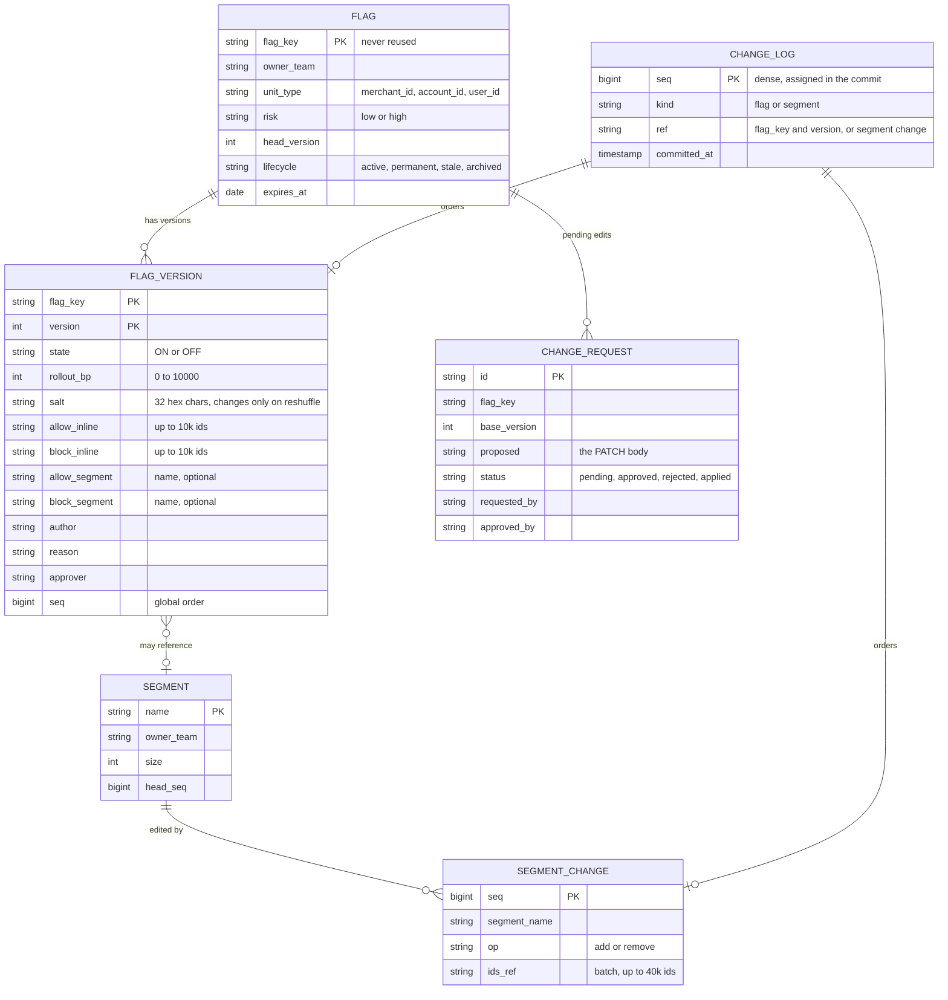

**Access patterns and why they fit.**
- **Edit (the only hot write).** In one transaction: read `FLAG.head_version` and check `If-Match`, insert `FLAG_VERSION`, bump the head, insert a `CHANGE_LOG` row with the next `seq`. Everything is keyed by `flag_key`, plus one counter.
- **Dense seq.** `seq` comes from a single counter row updated in the same transaction, not from a sequence that can skip values on rollback. A gap would look like a lost change to every host. The counter row serializes all commits, and in a 3-region consensus store each commit holds it for about one quorum round trip (~70 ms), so **single edits cap at ~12 to 15 a second**. Humans make 0.035 a second. Scripts use the batch endpoint, which takes `seq .. seq + n - 1` in one transaction. A kill queued behind a batch waits one commit, under a second. Accepted, and §10.7 names the alternative (publisher-assigned seq at a closed timestamp) if the cap ever binds.
- **Publisher** reads `CHANGE_LOG where seq > last_published order by seq`.
- **Console** reads by `flag_key` (history), by `owner_team` (my flags), and by `lifecycle, expires_at` (cleanup reports).
- **Hosts never query this store.** That is the property §5.4 depends on.

Store choice: a **3-region consensus-replicated SQL database** (CockroachDB or Spanner class), 3 nodes per region. Each commit pays one cross-region quorum round trip, ~60 to 80 ms [estimate]. That is invisible at 0.035 writes/s, and it keeps writes, and so kills, available with one region down. Postgres with a synchronous standby is the cheaper alternative. It is rejected in §7 because its failover is exactly the operation you do not want to need during an incident.

---

## 4. High-level design

One diagram, grown one functional requirement at a time. Each step says what is still missing. Every arrow says what flows on it.

### 4.1 Check flags: in process, against an immutable snapshot

Start where the ratio points: the check. Before any control plane exists, a check is a function over data already in the process.

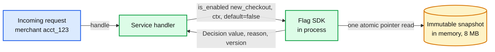

**The evaluation order.** Fixed, documented, and identical in every SDK language:

| Step | Condition | Result | Reason |
|---|---|---|---|
| 0 | The process has no snapshot at all | code default | `NO_SNAPSHOT` |
| 1 | Flag key not in the snapshot, or archived | code default | `FLAG_NOT_FOUND` |
| 2 | `state == OFF`. `state` is read with a tiny fixed schema that never changes, before the rest of the record | false | `OFF` |
| 2b | Flag marked `propagate` and the request carries a decision for it from an mTLS internal peer (§5.6) | the propagated value | `PROPAGATED` |
| 3 | The rest of the record failed to parse on this host, or its `min_sdk_level` is above this SDK's | code default | `ERROR` |
| 4 | The flag's unit id is missing, empty, not a string, not valid Unicode, or fails its `unit_type`'s format check (prefix, charset, at most 255 bytes [estimate]) | `rollout_bp == 10,000` ? true : false | `NO_UNIT` |
| 5 | Unit id on the block list | false | `BLOCKED` |
| 6 | Unit id on the allow list | true | `ALLOWED` |
| 7 | `bucket(salt, unit) < rollout_bp` | true | `IN_ROLLOUT` |
| 8 | otherwise | false | `NOT_IN_ROLLOUT` |

Four decisions in that table, each said out loud:
- **A kill is read before anything that can fail to parse.** If a host cannot parse a flag's rules (a bug, or a rule type its SDK is too old for), it falls back to the code default, which can be `true` for an operational flag. Reading `state` first, with a schema that never changes, means a kill still lands on that host.
- **OFF beats the allow list.** A kill switch that leaves the allow-listed merchants on is not a kill switch. "Off for everyone except our test accounts" is spelled `state ON, rollout 0, allow list = test accounts`.
- **Block beats allow.** The block list exists for "must never get this" (legal, a merchant who opted out, a known-bad integration). The console rejects an edit that puts one id on both lists. If it happens through segments anyway, block wins.
- **No unit id means not in the rollout.** An unauthenticated request has no merchant. It gets the feature only if the flag is at 100%. It never falls to a random bucket. An empty string counts as missing, or every anonymous request would share one bucket and flip together. So does an id that is not valid Unicode (a lone surrogate), because Java, JavaScript and Python encode it three different ways. Each `unit_type` has a format check: a 1 MB id from request input would cost milliseconds of hashing per flag, and `ACCT_123` vs `acct_123` would put one merchant in two buckets. A malformed id is `NO_UNIT`, counted per flag.

**The bucket.**

```text
bucket(salt, unit) = uint64_be( SHA-256( utf8(salt_hex + ":" + unit) )[0:8] ) mod 10,000
in rollout          = bucket < rollout_bp          # rollout_bp in 0..10,000, 1 bp = 0.01%
salt_hex            = 32 lowercase hex characters  # 16 random bytes, fixed at creation
```

- **Sticky with no storage.** It is a pure function of the salt, the unit id and the number. Any host, any language, any day: same input, same bucket.
- **Monotonic.** Raising `rollout_bp` from 1,000 to 2,000 adds buckets 1,000 to 1,999 and keeps 0 to 999. Nobody who had the feature loses it. Lowering it removes the top buckets first, which is the order you want for a rollback.
- **Independent.** Each flag has its own random salt, so merchant `acct_123` lands in a different bucket for every flag. Hashing the flag key instead would also work, until someone renames a flag. Hashing the unit alone would put the same 10% of merchants first in line for every launch.
- **Bias.** `2^64 mod 10,000 = 1,616`, so each of the low 1,616 buckets has one more preimage than the others out of ~1.8 x 10^15 each: a relative excess of 5.4 x 10^-16. The worst rollout over-serves by 7.3 x 10^-17 of units. Nothing.
- **Cost and portability.** SHA-256 is in every standard library, so no SDK carries a hand-ported hash. It is ~0.3 us in Go or Java. Faster hashes (MurmurHash3, used by Unleash) need a vetted port per language.
- **The real cross-language trap is the unsigned read.** Java has no unsigned 64-bit integer and JavaScript numbers are doubles. Java's obvious `%` on a signed long serves **55%** at a 10% rollout. `Math.floorMod` and `parseInt` both pass a "10% are in" sanity check while giving the wrong answer for 10% and 6.8% of units. Only the golden file catches that (§5.2, measured in the deep dive).

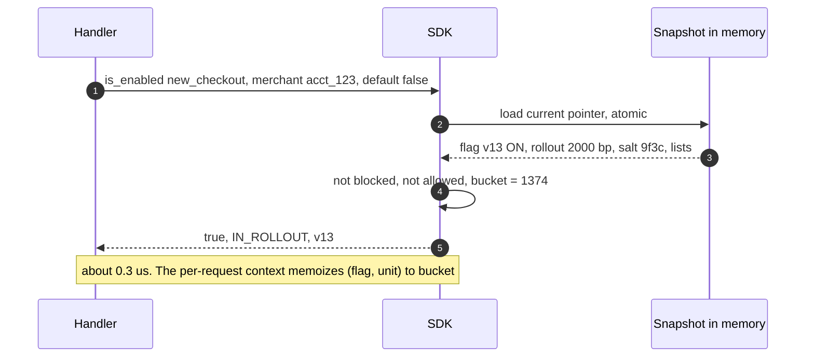

**Still missing:** where the snapshot comes from, how anyone edits a flag, and how an edit reaches 50,000 processes.

### 4.2 Manage flags: one small, strongly consistent store

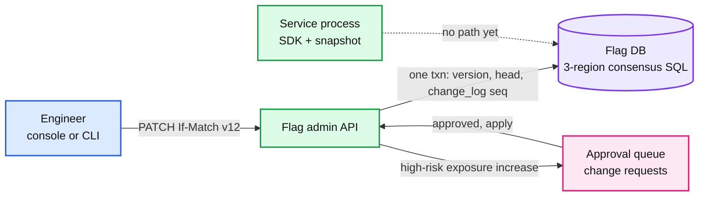

**One edit:**
1. The console sends `PATCH /v1/flags/new_checkout` with `If-Match: "v12"` and `{rollout_bp: 2000, reason: "ramp to 20%"}`.
2. The API checks permissions (owner team or delegated), then validates: `rollout_bp` in range, lists under their caps, no id on both lists, segment names exist.
3. For a `high`-risk flag, any edit that can make the answer **true for more units** becomes a change request and returns `202`: a rollout increase, `OFF -> ON`, `allow_add`, a new allow segment, `block_remove`, adding members to an allow segment or removing them from a block segment, a reshuffle (~9% of units move in at 10%). A second engineer approves it, and the API applies it with the same `If-Match`. If the head moved meanwhile (say a kill landed), the apply gets `409` and the request goes back to pending against the new head for re-approval. Kills, decreases, and reverts that do not raise exposure skip approval.
4. One transaction: check `head_version == 12`, insert `FLAG_VERSION 13`, set the head to 13, take the next `seq` from the counter row, insert `CHANGE_LOG(seq, flag, 13)`. Commit.
5. Return `200 {version: 13, seq: 884213}`. A concurrent editor who also sent `If-Match: "v12"` gets `409` and sees the diff.

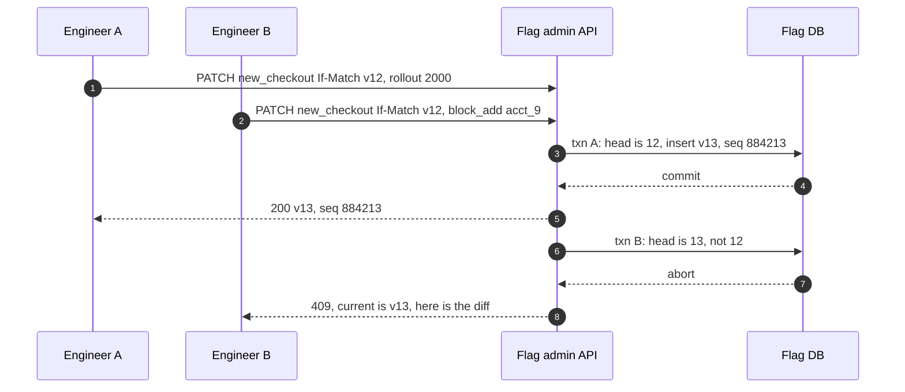

**Still missing:** no process has seen version 13. The store is the truth, but nothing carries it to the fleet.

### 4.3 Propagate: a change log, immutable files, and a 5-second poll

The obvious next step is "every SDK polls the admin API". That puts the control plane's database behind 50,000 pollers and makes the fleet depend on it. Instead, turn the change log into **files**, and let hosts read files.

```mermaid
%% Step 3: the propagation path. Red = the publisher: it is the one component whose single bad output reaches every host within seconds.
flowchart LR
    API[Flag admin API] -->|"txn"| DB[(Flag DB<br/>change_log seq)]
    DB -->|"tail seq > last, every 200 ms"| PUB[Publisher<br/>1 active + standby, lease]
    PUB -->|"delta/seq, snap/seq, then pointer"| OBJ[(Object storage<br/>per region, immutable files)]
    OBJ -->|"cache miss"| CDN[Regional HTTP cache<br/>pointer max-age 1 s]
    CDN -->|"pointer every 5 s, 304 mostly"| AG[Host agent<br/>1 per host, 10k]
    AG -->|"validated snapshot file"| DISK[(Local disk<br/>current + previous)]
    DISK -->|"new generation, reload and swap"| SDK[SDK in each process<br/>50k]
    AG -->|"applied seq"| WM[(Watermark metrics)]

    class API,SDK service
    class PUB critical
    class DB,OBJ,DISK store
    class CDN cache
    class AG service
    class WM store

    classDef service  fill:#dcfce7,stroke:#16a34a,stroke-width:2px,color:#111
    classDef store    fill:#ede9fe,stroke:#7c3aed,stroke-width:2px,color:#111
    classDef cache    fill:#fef3c7,stroke:#d97706,stroke-width:2px,color:#111
    classDef critical fill:#fee2e2,stroke:#dc2626,stroke-width:4px,color:#111
```

**Walk one change, seq 884213, from commit to check:**
1. **Publisher.** It holds a 10 s lease in the Flag DB, reads `CHANGE_LOG where seq > 884212`, and builds `delta/884213`: the full new record of every flag that changed in that transaction, or the add/remove list of a segment edit (never the whole segment), with `base_seq = 884212`, `last_seq`, a schema version, a checksum and a signature. A delta is named by its **first** seq, so an agent at seq L always fetches `delta/{L+1}`. A 1,000-change batch is one file, `delta/884213` covering 884213 to 885212.
2. **Validate, then write.** It parses the delta with the same library the agents use and checks it against hard limits (§5.4). Each region is published **independently**: files first (create-only, so nothing is ever overwritten), then that region's `pointer`, so one slow region never delays a kill elsewhere. **Files first, pointer last**, so a pointer never names a file that does not exist. The pointer write is **fenced**: it carries the publisher's lease `epoch` and is a conditional write on the last ETag the publisher saw, so a paused old publisher cannot overwrite a newer pointer. Every 1,000 changes, or every hour, it also writes a full `snap/{seq}`. Every 60 s it rewrites the pointer with a fresh signed `as_of` even when nothing changed, so a host can tell "no edits today" from "my cache is wedged".
3. **Cache.** Each region runs an HTTP cache in front of its bucket (a CDN, or 3 caching proxies). The pointer has `max-age=1`. Delta and snapshot files are immutable, so they are cached forever.
4. **Agent.** Every host runs one agent (a DaemonSet or systemd unit). Every 5 s, jittered by plus or minus 20%, it sends `GET /v1/pointer` with `If-None-Match`. Nearly always the answer is `304`. On a change it fetches `delta/884213`, checks `base_seq == local seq` and the checksum, applies it to a copy of its snapshot, validates the result, and writes `snapshot.884213` to local disk with fsync and an atomic rename.
5. **SDK.** Each process watches the agent's file generation (inotify, or a 100 ms poll of a header). On a new generation a background thread loads the file, builds an immutable map, and swaps one pointer. The request path never waits on this. In-flight checks finish on the old map.
6. **Watermark.** The agent reports `{host, seq: 884213, applied_at}`. The console's propagation view counts hosts at or above 884213.

**Why polling and not push.** The SLO is 10 s at p99. Polling a 100-byte pointer every 5 s gives a worst case of `0.2 (tail) + 0.5 (write) + 1 (cache) + 6 (poll, with jitter) + 0.1 (fetch and swap) ≈ 7.8 s`. A seeded simulation of 10,000 hosts gives p50 3.4 s and p99 6.5 s with every host healthy, and p99 9.4 s with 2% of hosts flaky (7.0 s once a failed poll retries after 1, 2 and 4 s). That is inside the SLO with no stateful tier. Push would buy about 4 s on a path where a human takes minutes to decide. Its cost is not the connection count (10,000 with agents, which is fine). It is a stateful, ordered tier with reconnect storms after every deploy, while you keep the file path anyway for boot and catch-up. If the SLO ever drops under 2 s, the seam is a data-free "poll now" nudge, not a data stream. It is also constant work: the cache sees the same 2,000 req/s whether 0 or 1,000 flags changed. §5.3 has the full ladder.

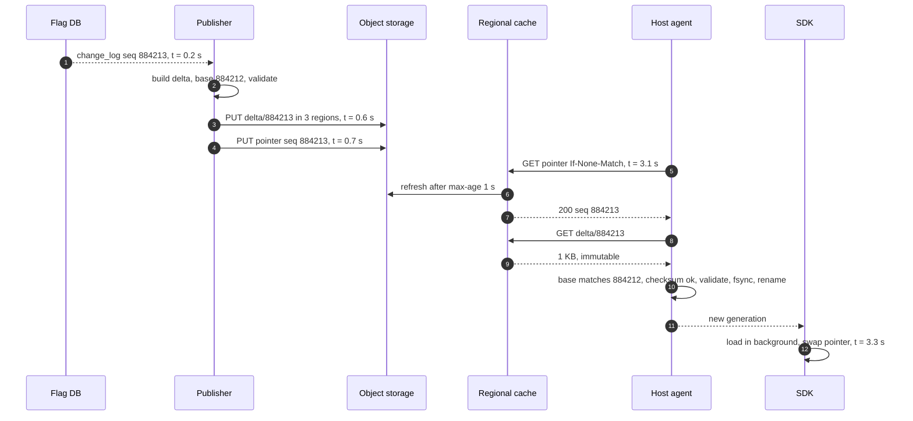

**Still missing:** the editor cannot see whether the change landed, there is no history view, and there is no undo.

### 4.4 Audit and undo: history is the versions table, undo is a new version

```mermaid
%% Step 4: add audit, revert and the propagation view. Nothing new on the data plane.
flowchart LR
    ENG[Engineer] -->|"history, revert to v11, kill"| API[Flag admin API]
    API -->|"read versions, write v14 = copy of v11"| DB[(Flag DB<br/>FLAG_VERSION forever)]
    DB -->|"change_log"| PUB[Publisher]
    PUB -->|"files"| OBJ[(Object storage)]
    OBJ -->|"poll, delta"| AG[Host agents]
    AG -->|"applied seq"| WM[(Watermark metrics)]
    WM -->|"hosts at or above seq 884300"| API
    API -->|"60% at 4 s, 99.2% of live at 10 s, 30 laggards"| ENG

    class ENG client
    class API,PUB,AG service
    class DB,OBJ,WM store

    classDef client   fill:#dbeafe,stroke:#2563eb,stroke-width:2px,color:#111
    classDef service  fill:#dcfce7,stroke:#16a34a,stroke-width:2px,color:#111
    classDef store    fill:#ede9fe,stroke:#7c3aed,stroke-width:2px,color:#111
```

- **History** is `FLAG_VERSION` ordered by version: diff, author, reason, approver, seq, time. Nothing is ever updated in place.
- **Revert** writes a new version whose content equals the chosen old one: `v14 = v11`. It gets a new `seq` and flows like any edit. History only moves forward, so "what was live at 14:02" always has one answer: the version whose seq was the highest a given host had applied at 14:02.
- **Kill** is an edit that sets `state = OFF`. It is idempotent and skips approval.
- **Propagation view.** For the edit's seq: hosts at or above it, p50 and p99 time to apply, and the laggard list. A laggard is a host still below the change's seq 30 s after publish. Dead ones (no report for 30 s) are listed but leave the SLO's live denominator. The rest are rejecting (they report a rejected file) or in a slow region. That turns "I clicked kill" into "kill is on 99.2% of live hosts at 10 s, these 30 are behind, and here is why". Expect ~60% at 4 s: with a 5 s poll, only about 60% of agents have polled 4 s after the publish.

**What this design does not have yet:** a story for a bad snapshot, a control-plane outage, a 1 M-id list, two services that disagree for 4 s, and guardrails on who can ramp what. That is §5.

---

## 5. Deep dives

Each one is the question an interviewer asks, what breaks in the §4 design, the fix, and what changed.

### 5.1 "A check runs 20 times inside every request. How is it under 1 us, and how does the flag system never take a request down?"

**The ladder.**

| Rung | Approach | Why it breaks, in numbers |
|---|---|---|
| Bad | Every check calls a central flag service | 20 M RPC/s, or ~1 M/s if batched per request. ~0.5 to 1 ms added to every request. The service is a dependency of every request in the company: its 99.99% is 52 minutes a year of slowed or failed requests everywhere at once |
| Good | Central service with Redis behind it, a local cache in each process, 30 s TTL (the rate-limiter template) | Kills take up to 30 s plus cache layers. TTL refresh alone is `50k processes x 500 active flags / 30 s ≈ 830k req/s` against Redis, which is now on the request path for every miss and every expiry. After a fleet-wide deploy, every process starts cold at once |
| **Great** | Whole snapshot in every process, evaluated locally. A per-host agent keeps it current | No network on the check path. Refresh traffic is 2,000 tiny polls a second, off the request path |

**Making the Great rung actually fast.**
- **Immutable maps, one pointer.** The SDK holds `current: *Snapshot`. A check does one atomic load and then only reads. Reload builds a whole new map off the request path and swaps the pointer (read-copy-update). No locks, no torn reads.
- **Pin per request.** The request context captures the snapshot pointer at its first check. All 20 checks in one request see one version, even if a swap happens halfway through. A pin expires after ~10 s, and long-running jobs create one context per unit of work, so a 3-hour batch job cannot keep a pre-kill snapshot alive.
- **Memoize the bucket.** The context caches `(flag, unit) -> bucket`, so the same flag checked 5 times in one request hashes once.
- **Nothing allocates on the hot path.** The flag key interns to an index at load time.
- **Measured budget:** map lookup ~50 ns, SHA-256 of ~54 bytes ~0.3 us, list probe ~0.1 us. p99 under 1 us leaves headroom for a cache miss.

**Push back on the textbook answer.** "Cache the flags locally with a TTL" sounds like the same thing as the Great rung. It is not. A TTL cache is still *pull on miss*: a cold process makes 20 network calls on its first request, the cache tier sees a herd after every deploy, and a check can block. A snapshot is *push to memory before use*. The process does not take traffic until it has one (§5.4), and after that no check waits on anything.

**What changed:** the SDK pins a snapshot per request and memoizes buckets. No API change. [`deep-dives/evaluation-and-bucketing.md`](deep-dives/evaluation-and-bucketing.md).

### 5.2 "How does the same merchant get the same answer on every server, in every language, as the rollout grows, and without landing in the same 10% for every flag?"

**What breaks.** Each naive answer breaks one of the four properties:

| Approach | Sticky | Monotonic | Independent | Storage |
|---|---|---|---|---|
| `random() < pct` per request | no, flaps every request | no | yes | none |
| Assignment table `(flag, merchant) -> on/off` | yes | only if you write it carefully | yes | `20k flags x 5 M merchants = 10^11` rows, written on first sight. A hot write path to hide a read path |
| `hash(merchant) mod 100 < pct` | yes | yes | **no**: the same 10% of merchants are first in line for every launch | none |
| `hash(flag_key + merchant) mod 100` | yes | yes | yes, until a flag is renamed. Granularity 1% | none |
| **`SHA-256(salt:merchant)[0:8] mod 10,000 < bp`** | yes | yes | yes. The salt is random, fixed at creation, survives renames | none |

**Details that come up in the follow-ups.**
- **Which unit.** Each flag declares one (`merchant_id`, `account_id`, `user_id`). For an API product the merchant is usually right: one merchant's integration should not see two behaviours from two of its own users. The console shows the unit next to the percentage.
- **Granularity.** Basis points: 1 bp is 0.01%. With ~5 M merchants [estimate], 1 bp is ~500 merchants, a sensible first canary.
- **Reshuffle on purpose.** "Re-roll the 10%" is an explicit action that writes a version with a new salt. It is logged and needs a reason. It is never a side effect. The console shows the blast radius before the click: at 10%, about 9% of units move out and about 9% move in. The salt lives on the **version**, so reverting to a pre-reshuffle version restores the old buckets, and "who was in the rollout at 14:02" is answerable from history.
- **Dependent flags.** Independence is the default, so with two flags at 10%, 90% of flag B's cohort lacks flag A. When B only makes sense with A, create B with **A's salt**: B at 5% then sits entirely inside A at 10%. Sharing a salt is a **declared link**, not a copied string: B's version records `salt_group = A`, and B's owner opts in when creating it. The API enforces the group: a reshuffle of A moves every flag in the group to the new salt in one transaction, or it is refused. Without that, reshuffling A alone puts 90% of B's units outside A again (measured in the deep dive). Because a reshuffle moves ~9% of units in and out of **every** flag in the group, it needs approval from the owner of each one. Team X cannot reshuffle team Y's cohort as a side effect. A general prerequisite rule (LaunchDarkly has one) is a §10.11 extension.
- **Lowering a rollout removes the highest buckets first.** A rollback from 20% to 10% removes exactly the units added last.
- **Cross-language equality is tested, not hoped for.** A golden file of 10,000 `(salt, unit, bp) -> bucket, decision` rows is generated once. Every SDK's CI must reproduce it byte for byte, including non-ASCII unit ids (UTF-8, no normalization). Units are stored in the file as UTF-8 hex and the file's SHA-256 is pinned, so no editor or YAML tool can quietly normalize the rows the file exists to protect. A new SDK release that fails one row does not ship.
- **SDK version skew.** A flag using a feature an old SDK does not know (a new rule type) would be evaluated differently by old and new SDKs. And an SDK that skips unknown fields would parse it cleanly and silently drop a narrowing rule. So each flag record carries a `min_sdk_level`. An SDK below it returns `ERROR` for that flag (its `state` is still read first, so kills work). The publisher publishes the flag only when at least 99.9% of the processes **that evaluated that flag** in the last 7 days run an SDK at that level. A fleet-wide 99.9% would be 50 processes: one whole service could be left behind.

**What changed:** the `salt` column, the `unit_type` column, a "reshuffle" action, and the golden test file in every SDK repo. [`deep-dives/evaluation-and-bucketing.md`](deep-dives/evaluation-and-bucketing.md) runs the numbers: stickiness under growth, independence between two flags, and bucket uniformity.

### 5.3 "An engineer hits kill on a broken feature. How long until every process sees it, and how do they know it landed?"

**The ladder.**

| Rung | Approach | Kill latency | Why it breaks or what it costs |
|---|---|---|---|
| Bad | Every SDK polls the admin API every 5 s | ~5 s | `50,000 / 5 = 10k QPS` on the Flag DB from pollers, and **propagation stops when the control plane is down**, which is exactly when a kill is needed |
| Good | Every SDK fetches the full snapshot from object storage every 30 s, changed or not (AWS "constant work") | ≤ 30 s | Simple and robust. But `50,000 x 8 MB / 30 s ≈ 13 GB/s` of mostly-unchanged bytes, 50,000 clients per language SDK to keep correct, and a kill takes up to 30 s |
| **Great** | One agent per host polls a 100-byte pointer every 5 s through a regional cache and fetches only the deltas it is missing | p50 ~3.5 s, p99 6.5 s (healthy) to 9.4 s (2% flaky hosts), simulated | 2,000 req/s fleet-wide, mostly `304`. The complex part (fetch, order, validate, persist) is written once, in the agent, not once per SDK language |
| Rejected | Streaming push (SSE or gRPC) from a relay tier to every agent | under 1 s | Buys ~4 s on a path where humans take minutes. 10,000 connections are not the problem. A stateful, ordered tier is: reconnect storms after every relay deploy, a component that must be up for propagation, and the file path still needed for boot and catch-up. The seam, if ever needed, is a data-free "poll now" nudge |

**The pieces that make "in order" and "how far" true.**
- **Prefix rule.** An agent at seq L fetches `delta/{L+1}` and applies it only if `base_seq == L`. A gap (missing or corrupt file) **or a delta that fails validation** means: fetch `snap/{pointer.snap_seq}` if it is newer than L, then the deltas after it. So a host is always at an exact `seq`, never holds a torn mix, and is never stuck behind one bad file. The pointer also carries `prev_snap_seq`. A host behind the previous snapshot (`local < prev_snap_seq`) takes the latest snapshot. Otherwise it reads deltas one at a time, in order, because each delta's `last_seq` names the next file: at most about 125 files in an hourly snapshot interval, ~2.5 s at ~20 ms each [estimate]. Counting seqs instead would not work: one 1,000-change batch is 1,000 seqs but one 1 MB file, and would send every host the 8 MB snapshot.
- **Fetch hygiene.** Read files from the same region whose pointer was used. Never cache a 404 or 5xx on a file path. On a checksum failure, re-fetch once from origin, bypassing the cache. After a failed poll, retry at 1, 2 and 4 s before returning to 5 s.
- **Never backwards.** An agent ignores a pointer whose `seq` is below its own. A cache serving a stale pointer can delay a host, never roll it back.
- **Kill overlay.** The prefix rule means a kill queued behind large deltas waits for all of them. Simulated in two independent models: a kill alone reaches p99 ~7 s, behind 10 batches 32 to 34 s, behind a 24 to 40 MB segment transfer 81 to 135 s. So the signed pointer also carries `recent_kills`: every kill committed in the last 10 minutes with its seq, at most 100. An agent applies them at once as an **OFF-only overlay** on top of its prefix, and keeps each entry until **its own** prefix reaches that seq, even after the entry has left the pointer's 10-minute window (a host stuck behind a rejected file for 20 minutes must not turn the feature back on). The overlay is kept in its own small file next to the snapshot, never baked into it, and is re-applied after every delta: a delta committed before the kill carries a full record of the flag with `state ON`, and applying it must not lift the kill. A restarted agent reloads the overlay file. The file header carries both the prefix seq and the overlay's highest kill seq, and SDKs reload when either rises; otherwise an overlay kill would never reach a running process. The overlay can only turn flags off, so it never exposes anything. Simulated, kill p99 stays at 6.5 to 7.4 s in every case, and kills also reach a host stuck behind a rejected file. That assumes pointer requests never queue behind bulk downloads on a saturated cache, so the cache serves the pointer and override from a separate, priority pool and caps concurrent bulk downloads. Watermarks report overlay kills applied, and the kill view counts a host as done when its seq has passed the kill **or** the kill is in its overlay. Otherwise, behind a big delta, the view would show ~1% done while every host already has the flag off. A kill followed by an unkill is safe: the unkill has a higher seq and arrives through the prefix, after the kill's entry has been dropped.
- **Watermarks.** Each agent reports its applied seq (coalesced to once per 5 s). The console answers "kill seq 884300: 60% at 4 s, 99.2% of live hosts at 10 s, 30 laggards". Laggards as defined in §4.4. Each class alerts differently (§10.9).
- **Publisher failover.** The standby tails the change log too, so takeover is lease expiry plus one publish. Simulated: a kill committed during a failover reaches 99% of hosts at p99 17 to 19 s, depending on when in its lease the old publisher died. Accepted. Two deterministic publishers (the [deny list's §5.2](../distributed-denylist/solution.md) design) would remove that delay, but they pay off at the deny list's write rate, not at 0.035 edits/s.
- **Fencing the old publisher.** A publisher that pauses (GC, VM freeze) and wakes after the takeover could write its stale pointer over the new one. In simulation that left only 11% of hosts with the kill until the next edit. Three defences: the pointer write is conditional on the last ETag and carries the lease `epoch`; files are create-only; the active publisher re-reads each region's pointer every 1 s and rewrites it if it is not its own. The re-check alone brings p99 back to 9.4 s.
- **Agent-less processes** (batch jobs, laptops, a host without the DaemonSet) run the SDK in "direct mode": they poll the regional cache themselves every 30 s, keep their own copy in memory, and report their own watermark. Slower, but correct.
- **Watermarks count what processes loaded, not what the agent wrote.** A process whose reload failed (a dead watcher thread, an OOM during parse) would otherwise be invisible. Each SDK pushes its loaded seq to the agent on **every swap** (not at the 1-minute eval-count cadence, which would make the watermark lag by up to 60 s), and the agent reports the minimum across its processes. A process that stops reporting for ~30 s (exited, wedged) is dropped from the minimum, so one dead process cannot pin its host as a laggard forever. The SDK, like the agent, refuses a file whose seq is below the one it already holds (a disk restored from an image, an agent bug).

**Push back on the textbook answer.** "Use Kafka or a pub-sub topic, every process subscribes." 50,000 consumers of one ordered topic means 50,000 sessions on the brokers that lead that partition. It also means a new process must replay from a retained offset or fetch a snapshot anyway, so you build the snapshot path regardless. Files plus a pointer is that snapshot path, and it turns out to be enough on its own.

```mermaid
%% Timing budget for one kill, normal operation, worst case. The poll wait dominates; everything else is about 2 s.
gantt
    title Kill seq 884300 from click to check, worst case about 8 s
    dateFormat X
    axisFormat %S s
    section Control plane
    Commit, publisher tail, validate, files, pointer :a1, 0, 1s
    section Edge
    Cache max-age, up to 1 s                       :b1, after a1, 1s
    Agent poll wait, 5 s plus 20 percent jitter     :b2, after b1, 6s
    section Host
    Fetch, verify, fsync, swap, under 0.1 s        :milestone, c1, after b2, 0s
```

**What changed:** the agent tier, the `pointer` and immutable files, the watermark endpoint, direct mode for agent-less processes. [`deep-dives/propagation-and-kill-switch.md`](deep-dives/propagation-and-kill-switch.md).

### 5.4 "The flag system is down, or a bad snapshot is published. What does `is_enabled` return, and what stops one file from crashing every service?"

Two failure classes, opposite in shape. An outage removes the flag system. A bad snapshot delivers it perfectly, to everyone, in seconds. The second is worse, which is why the publisher is the red node.

**Outage: fail static.**
- **Running processes** keep their in-memory snapshot. Running agents keep their disk copy and keep polling. Nothing on the request path notices. Staleness grows, the 5-minute alarm fires, and nobody's checkout breaks.
- **Booting processes** load, in order: (1) the host agent's file on local disk; (2) if that file is missing or unreadable, or there is no agent, `snap/{seq}` from the regional cache; (3) a bootstrap snapshot written into the deploy artifact **at deploy time**, not build time, so it is as fresh as the deploy; (4) nothing, so every check returns its code default with `NO_SNAPSHOT`. Every fallback can predate a kill (a 3-day-old bootstrap can show a killed flag as ON), so a booting agent or direct-mode SDK polls immediately rather than waiting a cycle. A service can declare "do not take traffic unless the snapshot was confirmed current within 24 h", measured from the signed `as_of` of a pointer whose seq the host has actually loaded, not from the last edit. A host stuck rejecting files keeps seeing a fresh `as_of` on a seq it cannot load, so that does not count. A quiet day (a holiday change freeze) then never fails readiness. Payment paths should declare it.
- **Booting hosts** with an empty disk fetch the latest snapshot from the regional cache, which only needs object storage. Object storage is up when the Flag DB and the publisher are not. That is the reason the files exist at all.
- **Neither fail open nor fail closed.** A flag system that turns everything on during an outage launches every unfinished feature. One that turns everything off kills every launched one. Last-known-good is the only answer that changes nothing.
- **Break-glass kill.** The kill switch is an incident tool, so it needs a path for "control plane down and we need a kill". Two on-call engineers with break-glass credentials write a **signed override file** straight to object storage. It may only set `state = OFF`, at most 100 flags. The publisher writes the pointer, so the override cannot ride inside it: agents fetch `/v1/override` with its own conditional GET on every poll (about +2,000 req/s, nearly all 404 or 304) and apply it on top of the snapshot. When the control plane returns, the kills become real versions. The override is then **retired, never deleted**: a signed `retire_at_seq` tells each agent to drop it only once its local seq has reached the real kill. Deleting it would switch the feature back on for hosts that have not applied the kill yet. A live override pages until it is retired. It carries a monotonic counter, so an old signed override cannot be replayed, and an `expires_at` that only limits when it may **first** be installed. An installed override never lapses on its own: if the control plane stays down longer than expected, the kill must not silently lift.

**Bad snapshot: validate twice, cap everything, isolate per flag.**

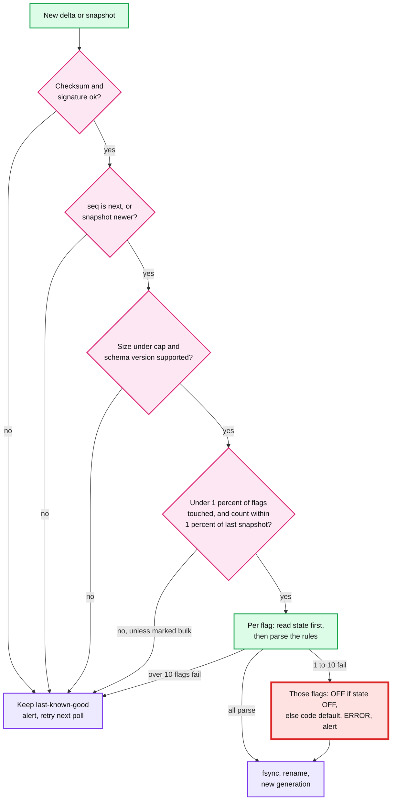

- **The publisher validates first** with the same parser the agents use, against hard limits: snapshot ≤ 32 MB (4x today), ≤ 50k flags, inline lists ≤ 10k ids, segment total ≤ 256 MB, every flag compiles, `state` is exactly `ON` or `OFF` (the `state`, `version` and `min_sdk_level` fields never change name, type or position across schema versions, because every host reads them before anything else, and `min_sdk_level` is what tells an old SDK to stop), no flag whose `min_sdk_level` its evaluating processes do not support (§5.2). It also runs **every SDK language's parser** on the file (a small conformance harness), because the Cloudflare shape is a value that only one parser chokes on. A failure stops publishing and pages. The fleet stays on the previous seq.
- **Every agent validates again.** The publisher can have a bug, and a cache can serve a corrupt object. Any failure keeps the last-known-good copy (diagram above). The count check has two halves, because each half alone misses a bug: **flags touched** in one delta (a bug that flips 6,000 flags OFF keeps the count unchanged) and **count against the last snapshot boundary** (a slow drain of 150 removals per delta passes a per-delta check every time). After an approved bulk delta, the publisher writes a snapshot at once, so it becomes the new reference. Otherwise the next one-flag edit would read as 2.5% off the old reference and be rejected, with no newer snapshot to fall back to. A host that was offline across several snapshots does not compare against its own old copy, since legitimate bulk batches may add up to more than 1%. Each snapshot header carries `prev_snap_seq`, the previous snapshot's flag count and a bulk bit, and the agent checks the newest step of that chain.
- **Limits reject, they never crash.** Cloudflare's 18 Nov 2025 outage came from a feature file that doubled in size and hit a preallocated limit, and the proxy panicked. Here, "over the limit" is a validation failure handled like any other.
- **A limit ladder, so growth never halts kills.** If normal growth reached a publisher limit, publishing would stop, kills included. So each limit is enforced first at the API, at ~80%, inside the commit transaction, and the edit that would cross it is refused there. Then the publisher at 100%, then the agent and SDK above that. A producer never passes a file its consumer rejects.
- **A corrupt file in a cache.** The agent re-fetches it once from origin, past the cache. Caches evict an object that fails verification. Agent reject reports trigger an on-demand snapshot, so a host never waits for the hourly one.
- **Per-flag isolation.** A flag whose rules fail to parse on a host falls back to its code default with reason `ERROR`, unless its `state` (read first, with a schema that never changes) is OFF: then the kill still applies. The other 19,999 keep working. Isolation is capped: more than 10 `ERROR` flags in one file [estimate] means a parser mismatch, not a bad flag, and the whole file is rejected. Kills never count toward the 10. Telemetry turns `ERROR > 0` into an alert within a minute.
- **Format changes are staged, value changes are not.** A new snapshot schema version goes to 1% of hosts (agents whose host hash falls in the canary range read `pointer.canary`), then 10%, then all, over about an hour. During the canary the publisher writes **two file chains** for the same seqs, so file paths carry the schema version (`v7/delta/{first_seq}`, `v8/delta/{first_seq}`) and immutable names never collide. Turning a flag on or off never changes the format, so it never waits for that.
- **Flags protect against config pushes too.** Google Cloud's 12 Jun 2025 outage was a new code path that was "not feature flag protected", triggered by a policy change that replicated globally in seconds. A flag service is half of the defence. The other half is that its own data plane must not be that kind of global push.

**What changed:** a deploy-time bootstrap snapshot and an immediate poll at boot, readiness on the pointer's `as_of`, hard limits in the publisher and agent, the two-part count check and the 10-flag `ERROR` cap, `pointer.canary`, a signed break-glass override with `retire_at_seq`, `ERROR` and `NO_SNAPSHOT` reasons wired to alerts. [`deep-dives/fail-static-and-bad-snapshots.md`](deep-dives/fail-static-and-bad-snapshots.md).

### 5.5 "A block list of 1 M merchant ids. Where does it live, and what does a host load?"

**What breaks.** Inline lists live in the 8 MB snapshot, which each process parses into its own map. A 1 M-id list inline adds ~24 MB of ids per process, ~100 MB as a language-level hash set, times 5 processes per host. And every edit to the list republishes it.

**Fix: segments.**
- **Inline up to 10k ids per list.** Above that the API requires a named **segment**: its own file, versioned by the same `seq`, reusable across flags.
- **One copy per host, shared.** The agent writes each segment as a read-only file with a static open-addressing hash index: a 64-bit hash picks a slot, and the slot points to the full id. Every process `mmap`s it, so the OS page cache holds one copy per host, not one per process. Lookup is one or two probes plus one string compare, ~0.1 us.
- **Exact, not a filter.** Measured on 1 M ids: a Bloom filter at 10 bits per id has a 0.81% false-positive rate, so ~32,000 of 4 M merchants are permanently and silently wrong on a block list. At 33 bits per id (still ~10x smaller than the exact index) it is 1.3 x 10^-7, but needs 23 random probes per check. Even then the errors are per id and permanent, and a filter cannot enumerate its members or remove one. Lists are small enough to be exact.
- **Edits are deltas.** `POST /segments/{name}/members` with adds and removes, up to 40k ids per call, so the largest delta stays ~1 MB like the largest batch. Kills never wait behind a segment edit (they ride the pointer's overlay, §5.3). Other edits queued behind it wait ~1 s, not ~8 s. The agent applies them to a new copy, rebuilds the index (~1 s for 1 M ids), and swaps the file. Processes remap on the next generation.
- **Atomic replace and a manifest.** Replacing a whole list is a new segment version under the same name, built off-line and switched in by one edit, never 25 calls of 40k ids. New segment versions are published **outside the in-order delta stream**, so a 24 MB file never queues ramp decreases or block-list adds behind it (simulated p99 81 s if it did). A 1 M-id file is ~40 MB of data plus headers, ~42 MB on disk, so ~140 GB per region if every host fetched it at the switch. Agents **prefetch** the new version as soon as it is published, and the switch edit is allowed only once 99% of live hosts report having it. The API checks that a referenced segment exists inside the edit's transaction. Each snapshot carries a manifest of the segment versions at its seq, and the SDK loads the snapshot and those segment files together, so a check never mixes a new flag version with an old segment.
- **Company-wide budget.** All segments together, **including prefetched versions**, are capped at 256 MB, and a host prefetches one segment version at a time, so every host can load every segment and there is no "segment not loaded yet" state. When the budget binds, that is the §10.11 trigger for per-service subscriptions.
- **Size math.** 1 M ids x ~24 B = 24 MB of ids, plus 2 M slots x 8 B = 16 MB of index, so ~40 MB. Six such segments fill the budget. Most segments are a few thousand ids.

**Push back on the textbook answer.** "Put big lists in Redis and look them up per check." That brings back the remote call from §5.1 for exactly the flags that matter most (a block list is a safety tool). When a list is too big for every host, the answer is targeting by attribute ("country = X"), not a 50 M-id list.

**What changed:** the `SEGMENT` and `SEGMENT_CHANGE` tables, the segment endpoint, segment files with an mmap-friendly index, a 256 MB budget enforced at the API. [`deep-dives/lists-segments-and-cross-service.md`](deep-dives/lists-segments-and-cross-service.md).

### 5.6 "Two services take part in one feature and see the flag flip 3 s apart. What breaks?"

**What breaks.** The propagation window is real. For a few seconds after an edit, host A is at seq 884300 and host B is at 884299. Bucketing is deterministic per version, so two hosts at the same seq agree. Two hosts at different seqs may not. Three shapes of feature care:

1. **Request-scoped behaviour across services.** The API gateway shows the new checkout page. The backend it calls still runs the old flow. One request, two versions.
2. **Data written by one service and read by another.** A writer turns on a new field format. A reader on an older seq cannot parse it.
3. **Async work.** A message enqueued under the new behaviour is consumed minutes later by a worker. Ordinary staleness never ends this window: the queue holds the message regardless.

**Fix, one rule per shape.**
- **Request-scoped: evaluate once, pass the decision.** The first service that checks a cross-service flag puts `flag=value@version` into the request context (a baggage header). Downstream SDKs honour a propagated decision for that flag instead of re-evaluating. One request sees one answer. Only flags marked `propagate` do this, so headers stay small. Two guards: the edge gateway **strips** any flag decision from external callers (OpenTelemetry's default propagators include baggage, so a public header would otherwise reach every SDK), and only mTLS-authenticated internal peers may set one. A local kill always beats a propagated ON. The bucketing unit id never comes from a client header.
- **Data formats: expand, then contract.** A flag never gates a data format by itself. Readers learn the new format first (deployed, or flagged and fully rolled out). Only then does the writer's flag turn on. Turning the writer's flag off later is then always safe. This is the same rule as an online schema migration.
- **Async work: decide at enqueue time, unless killed.** The producer writes its decision into the message. Each flag is marked **format-carrying** (the message's payload depends on it, so the consumer honours the queued decision) or **behaviour-only** (the consumer re-checks, so a kill stops a queued backlog too). Default: behaviour-only.
- **Within one process:** already solved by pinning the snapshot per request (§5.1).

**Push back on the textbook answer.** "Make propagation atomic across the fleet with two-phase commit." You would block every flag change on the slowest of 10,000 hosts, and a single dead host would block kills. Eventual propagation with a measured bound, plus the three rules above, is cheaper and safer.

**What changed:** a `propagate` attribute on the flag, the baggage header format, and SDK support for honouring a passed decision. [`deep-dives/lists-segments-and-cross-service.md`](deep-dives/lists-segments-and-cross-service.md).

### 5.7 "Who can ramp what, and how do you stop a bad ramp from becoming an outage?"

**What breaks.** The data plane is now fast and robust, so the most likely outage is a human doing the wrong thing quickly: a ramp from 1% to 100% in one click, a flag key reused for a different feature, a forgotten flag that turns 3 years later.

**Fix.**
- **Risk tiers.** A flag created as `high` (money movement, auth, data deletion) needs a second approver for any edit that can turn the answer true for more units: a rollout increase, an unkill (`OFF -> ON` at 100% is a full launch), allow-list additions, a new allow segment, block-list removals, segment member edits that widen exposure, a reshuffle. Kills, decreases, and reverts that do not raise exposure never wait.
- **Guarded ramps.** For a `high` flag, a ramp is a schedule: 1%, 5%, 25%, 50%, 100%. A step is promoted only after 30 minutes of bake **and** about 1,500 requests on the newly enabled slice. On a quiet path (20 r/s), 30 minutes of a 1% step is only 360 such requests and catches a 0.2% to 0.9% error regression half the time. At most 50 flags ramp at a time, to cap metric cardinality.
- **The guard's statistics, measured.** Three traps, each simulated (seeded) in the deep dive:
  - **Peeking.** Testing `p < 0.05` every minute through a 30-minute bake pauses 15 to 23% of healthy steps, so about half of healthy ramps would page someone. The guard uses a pooled two-proportion z ≥ 3.3 with at least 3 errors in the new slice, looked at every 10 s: 0.9 to 2.1% false pauses per step, and it still catches 0.2% to 0.9% at the 5% step at 20, 200 and 2,000 r/s.
  - **Merchant mix.** A 5% merchant cohort carries 3.5 to 6.1% of traffic (p10 to p90), and one big merchant can dominate it. So on vs off cohorts differ even with no regression: the naive test false-pauses 18.5% of steps at 2,000 r/s. Comparing the slice with its own past fails on any global incident. The guard uses **difference in differences**: the SDK tags `on`, `next` (the buckets the next step will add, still off) and `off`, and the guard compares how the newly enabled slice changed against how the `next` slice changed over the same minutes. False pauses 0.1 to 0.9%, detection kept. The console shows the slice's traffic share.
  - **Crashes are invisible to the SDK.** A request that dies before its outcome is recorded removes exactly the failures the guard is looking for. Because the bucket is deterministic, the guard recomputes cohorts from the merchant id in edge logs. Sample ratio checks for merchant flags count units, not requests.
- **On a regression, drop to 0 and page.** Pausing is expensive: at 2,000 r/s on a 5% step, ~630 extra failures pile up during a 15-minute page response, against ~42 to detect. So for `high` flags the guard's default action is to set the rollout to 0 bp (a decrease, which needs no approval) and page. `kill_safe = false` flags only pause. This is the flag-level version of AWS AppConfig rolling back a deployment on a CloudWatch alarm.
- **Approval follows effective exposure.** "Increase" means any edit, revert or unkill that raises the share of units that get `true`. A revert to an approved 50% while a ramp is paused at 5% needs approval. A segment edit inherits the strictest risk tier of the flags that reference the segment.
- **Kill-safe.** Some flags guard a protection (`enable_new_fraud_check`): OFF removes the protection. Those are created with `kill_safe = false`. Killing them needs an approver, break-glass skips them, and on a regression the guard only pauses their ramp instead of dropping the rollout to 0 bp.
- **A change budget per person.** The batch rule catches one big file, but not 300 files of 0.99% each in 25 s. The API caps flags touched (killed, ramped, list-edited, removed) at 1% (200) per hour per principal, sliding, unless the batch is approved as `bulk`. Each delta carries its principal and approval, so agents apply the same per-principal check over a sliding hour of deltas. A fleet-wide hourly cap would be wrong: simulated, an ordinary working day's busiest hour touches 270 to 320 distinct flags. A fleet-wide backstop, if wanted, sits at ~5x that peak (~1,500 an hour) [estimate].
- **Never reuse a key.** Archived keys stay reserved forever. Knight Capital (1 Aug 2012) repurposed an old flag that, on one server still running old code, re-enabled a dead trading feature (§10.8).
- **Lifecycle.** Every release flag gets `expires_at` (default 90 days). A flag at 100% (or 0%) for 30 days, or with no evaluations in 30 days (from telemetry), is marked stale. Its owner gets a ticket to delete the code path. The flag is archived only after **zero evaluations fleet-wide** for 45 days, or 30 days plus the owner's confirmation, so a flag read only by month-end jobs is never archived the day before its next run. Direct-mode SDKs report evaluation counts too, or their flags would look unused. Metadata-only edits (description, owner) take no seq and produce no delta. `permanent` (operational kill switches) is an explicit, reviewed choice.
- **Bulk edits are not exempt.** The batch endpoint applies the same approval rules per flag, and a batch that **touches** more than 1% of flags (200), not only one that removes them, needs a `bulk` marker and an approver. This matches the agent's two-part count check in §5.4.

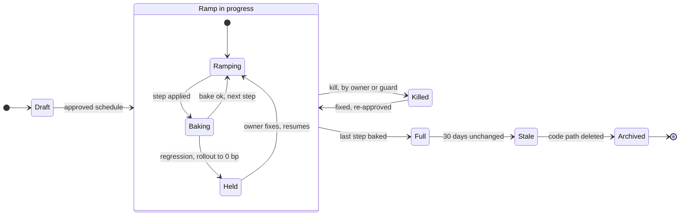

**What changed:** `risk`, `expires_at` and `lifecycle` on the flag, the change-request table, ramp schedules, a guard monitor, per-flag metric tagging during ramps. [`deep-dives/safe-changes-and-flag-lifecycle.md`](deep-dives/safe-changes-and-flag-lifecycle.md).

### 5.8 "What fails, and what is the blast radius?"

| Component | Failure | Blast radius | What the user sees | Mitigation |
|---|---|---|---|---|
| Flag DB (1 region) | Region down | None for checks. Writes continue on 2 of 3 regions | Nothing | Consensus replication |
| Flag DB (all) | Down | No edits, no kills through the API | Nothing until someone needs a kill | Break-glass override file (§5.4) |
| **Publisher** | **Bug publishes a bad file** | **Every host, in seconds** | Nothing, if validation catches it: agents keep last-known-good | Publisher validation, agent validation, per-flag isolation, staged formats |
| Publisher | Down | Propagation pauses. Checks unaffected | Edits wait ~10 s for failover | Warm standby with lease |
| Object storage / cache | One region down | Hosts in that region stop getting updates | Nothing. Staleness alarm after 5 min | Agents fall back to another region's cache |
| Host agent | Crashes or stuck | One host: its processes keep their last snapshot | Nothing | Watchdog restart. Host flagged as laggard |
| SDK | Old version in a service | That service may misread a new rule type | Wrong flag answer on that service | Publisher gates new rule types on fleet SDK telemetry (§5.2) |
| A human | Wrong ramp or reused key | Users of that flag | A broken feature for the ramped share | Approvals, guarded ramps, reserved keys (§5.7) |

---

## 6. Final design and the core flows

```mermaid
%% Final design. Red = the publisher: not a load bottleneck (writes are rare) but the one component whose single bad output reaches every host within seconds. Everything left of the cache can be down without any check failing.
flowchart LR
    ENG[Engineers<br/>console, CLI, scripts] -->|"edit, kill, revert, approve"| API[Flag admin API<br/>authz, validate, If-Match]
    API -->|"txn: version + change_log seq"| DB[(Flag DB<br/>3-region consensus SQL)]
    GRD[Guard monitor<br/>cohort metrics] -->|"pause or kill"| API
    DB -->|"tail seq, 200 ms"| PUB[Publisher<br/>lease, validates]
    PUB -->|"delta, snap, segment, then pointer"| OBJ[(Object storage<br/>3 regions)]
    BG[Break-glass<br/>signed override] -.->|"kill only"| OBJ
    OBJ -->|"miss"| CDN[Regional HTTP cache]
    CDN -->|"pointer 5 s, deltas"| AG[Host agent<br/>validates, disk LKG]
    AG -->|"file generation"| SDK[SDK in process<br/>eval under 1 us]
    SDK -->|"Decision"| APP[Service handler]
    AG -->|"applied seq"| WM[(Watermarks and<br/>eval telemetry)]
    WM -->|"propagation view"| API
    WM -->|"cohort error rates"| GRD

    class ENG client
    class API,AG,SDK,APP,GRD service
    class PUB critical
    class DB,OBJ,WM store
    class CDN cache
    class BG external

    classDef client   fill:#dbeafe,stroke:#2563eb,stroke-width:2px,color:#111
    classDef service  fill:#dcfce7,stroke:#16a34a,stroke-width:2px,color:#111
    classDef store    fill:#ede9fe,stroke:#7c3aed,stroke-width:2px,color:#111
    classDef cache    fill:#fef3c7,stroke:#d97706,stroke-width:2px,color:#111
    classDef critical fill:#fee2e2,stroke:#dc2626,stroke-width:4px,color:#111
    classDef external fill:#e5e7eb,stroke:#6b7280,stroke-width:2px,color:#111,stroke-dasharray:4 3
```

Zoom-ins for every component are in [`diagrams.md`](diagrams.md).

### Flow 1: a check (~0.3 us, no I/O)
1. The handler calls `is_enabled("new_checkout", ctx, false)`.
2. The SDK reads the request's pinned snapshot (pinned at the first check), finds `new_checkout v13` (ON, 2,000 bp).
3. The unit is `merchant_id = acct_123`: not blocked, not allowed. The bucket is 1,374, under 2,000. It returns `true, IN_ROLLOUT, v13`.

### Flow 2: a ramp from 10% to 20%
1. The engineer edits with `If-Match: v12`. The flag is `low` risk, so there is no approval. Commit: v13, seq 884213.
2. Within ~8 s, every host applies delta 884213. Merchants in buckets 1,000 to 1,999 start getting the feature. Buckets 0 to 999 never stopped.

### Flow 3: a kill during an incident (~8 s worst case)
1. On-call clicks kill with a reason. No approval, no `If-Match`. Commit: seq 884300.
2. Publisher, files, pointer: under 2 s. Agents pick it up on their next poll.
3. The propagation view shows ~60% at 4 s and 99.2% of live hosts at 10 s, with 30 laggards (dead hosts and one partitioned rack). The on-call moves on.

### Flow 4: a host boots while the control plane is down
1. The agent starts, reads `snapshot.884290` from local disk, validates it, and serves it.
2. Its polls fail. It keeps serving 884290 and reports staleness.
3. Processes start with the agent's file. Payment services require a snapshot confirmed current within 24 h. The last pointer this host loaded at its own seq has an `as_of` 10 min old, so they pass readiness.

### Flow 5: a bad snapshot is stopped
1. A publisher bug emits a delta that drops 6,000 flags.
2. In the publisher, the sanity check (more than 1% removed, no bulk marker) refuses to publish and pages. If that check had a bug too, every agent runs the same check and keeps 884299.
3. The fleet never leaves 884299. Nothing was published, so the fix is the repaired publisher rendering the same committed change (seq 884300) correctly. No new seq is committed.

### Flow 6: a guarded ramp pauses itself
1. `refund_v2` (high risk) is at the 5% step on a path of ~10 r/s. The newly enabled slice's refund errors rise from 0.2% to 0.9% while the `next` slice stays at 0.2%. The difference in differences crosses z ≥ 3.3 after about 12 minutes.
2. The guard sets the rollout to 0 bp and pages the owner. The owner investigates with the feature already off.

---

## 7. Trade-offs

| Decision | Option A | Option B | Chose | Why |
|---|---|---|---|---|
| Where a check runs | Central evaluation service (with Redis and a local cache) | In-process SDK over a local snapshot | **In process** | ~6 x 10^8 reads per write. A remote check adds ~1 ms to every request and makes the flag service a dependency of every request |
| How changes travel | Push stream (SSE or gRPC) from a relay tier | Poll a 100 B pointer every 5 s, fetch deltas | **Poll** | p99 ~8 s meets the 10 s SLO. No stateful tier, constant load, nothing to reconnect. Push buys ~4 s that no incident needs |
| Who polls | Every process (50k) | One agent per host (10k), SDK reads its file | **Agent**, with direct mode as a fallback | 5x fewer clients. Fetch, order, validate and persist are written once, not once per SDK language. One disk copy per host survives restarts |
| Where hosts read from | The admin API or the Flag DB | Immutable files in object storage behind a cache | **Files** | The fleet can boot and keep working while the whole control plane is down |
| Stickiness | Assignment table per (flag, unit) | Salted hash of the unit | **Hash** | 10^11 rows avoided. Sticky, monotonic, independent, nothing to store |
| Hash | MurmurHash3 (Unleash) or SHA-1 with a float divisor (LaunchDarkly Go) | SHA-256, integer `mod 10,000` | **SHA-256, integers only** | In every standard library, so no hand-ported hash to get wrong. Integer math is exact by construction (a float32 divisor disagrees on only ~1e-8 of units, so floats were never the main risk). The real risk is reading 8 bytes as an unsigned 64-bit integer in Java and JavaScript, and only the golden file catches it. ~0.3 us |
| Granularity | 1% | 1 basis point | **Basis points** | 1% of ~5 M merchants is 50,000. A first canary should be ~500 |
| Outage behaviour | Fail open or fail closed | Fail static (last-known-good), then code default | **Fail static** | Open launches unfinished features. Closed kills launched ones. Static changes nothing |
| Flag DB | Postgres with a sync standby | 3-region consensus SQL | **Consensus SQL** | A kill works during a region loss with no failover step. ~70 ms commits do not matter at 0.035 writes/s |
| Sequence numbers | Publisher assigns them at a closed timestamp | Counter row in the edit transaction | **Counter row** | Simplest. Caps single edits at ~12/s, ~340x the real rate. Scripts batch |
| Publisher HA | Two deterministic active publishers | One active, warm standby, 10 s lease | **Lease** | Writes are rare. Failover adds ~10 s to a kill, rarely |
| Big lists | Inline in every process | Segments, mmapped, one copy per host | **Segments above 10k ids** | 5 processes x 100 MB per host avoided |
| List structure | Bloom filter | Exact hash index | **Exact** | At practical sizes a filter is permanently wrong for some ids (0.81% at 10 bits per id), needs many random probes when made accurate, and cannot list or remove members |
| Cross-service skew | Atomic fleet-wide switch (2PC) | Evaluate once and pass the decision, expand/contract for data | **Pass and expand** | 2PC blocks kills on the slowest host |
| Snapshot scope | Per-service namespaces | One global snapshot | **Global** | 8 MB per host. Revisit at 10x flags (§10.11) |
| Kill latency behind big deltas | Strict prefix only | Prefix plus an OFF-only overlay of recent kills in the pointer | **Overlay** | A kill never waits behind a batch or a segment rewrite (p99 7.3 s vs 32 to 81 s simulated). It can only turn things off, so it cannot expose a unit |

**Refused to build:** a streaming tier, a per-user assignment store, a remote evaluation API for backend services, experiment analysis (a separate system that consumes our exposure events), attribute-based targeting rules, client-side SDKs that receive rules or lists.

---

## 8. Staff-level notes

**Failure modes and blast radius.** The table is in §5.8. The short version: everything to the left of the regional cache can be down and no check fails. The one global hazard is a bad file from the publisher, which is why there are two validators and staged format changes.

**Migration from what exists.** Most companies already have flags: env vars, per-service YAML, or a homegrown lookup in Redis.
1. **Import** every existing flag with an owner and a unit. Unowned flags go to a triage queue, not into the new system.
2. **Preserve buckets.** The old system hashed differently, so moving a 30% flag to the new hash would take the feature away from ~21% of merchants and give it to another ~21%. Imported flags carry `bucket_algo: legacy_v1`, and every SDK implements the old function for them, with golden tests. New flags use the new hash. Legacy flags are allowed to drain as they reach 0% or 100% and get deleted.
3. **Dual read.** The SDK evaluates both sources, returns the old answer, and counts mismatches by flag. Cut over one service at a time once mismatches are under 0.01% for a week. During the whole migration the **old system stays the write master**, and a continuous importer copies every edit into the new one, so both hold the same state and already-migrated services see new edits. After the last service cuts over, flip writes to the new system.
4. **Rollback** is a per-service SDK setting that returns to the old source. The old system stays read-only for 30 days.

**Operability.**
- **SLOs:** check error rate (reason `ERROR`) 0; propagation p99 under 10 s, measured from watermarks; under 0.1% of hosts more than 5 min stale.
- **What pages at 3 am:** (1) any agent rejecting a published file, because that is a bad-snapshot attempt; (2) the publisher refusing to publish or lagging more than 60 s; (3) more than 1% of hosts stale for more than 5 minutes; (4) a flag evaluating with `ERROR` anywhere. A paused guarded ramp pages the flag's owner, not the platform team.

**Cost.**
- **Infrastructure** is small: 9 DB nodes, 2 publishers, 9 cache boxes, a few GB of object storage, ~320 MB of agent RAM per host.
- **Engineering** is the real cost: SDKs in ~5 languages kept identical, the agent, the console, the guard monitor. That is a team of ~4 to 6 [estimate].
- **Buy vs build:** a vendor is a fine answer for a small fleet. At ~50k processes on money-moving paths, the deciding question is whether a third party's control plane should be in the kill-switch path during your own incident.

**Team boundaries.**
- The platform team owns the SDKs, agent, publisher, console and the golden tests.
- Product teams own their flags, their risk tier and their cleanup tickets.
- SRE owns the kill-switch runbook and the break-glass path, and security reviews it. Publishing the "flag hygiene" report per team (stale flags, expired flags) is how the platform team gets cleanup done without owning other teams' code.

---

## 9. What is expected at each level

**Mid (breadth 80, depth 20).** A flag service with a database, a cache, and an SDK that caches flags locally with a TTL. Percentage rollout by hashing the user id. Allow and block lists checked before the percentage. Probably misses independence across flags, fail-static, and the cost of a remote call per check.

**Senior (60 / 40).** Says the read path must be local and gives the reason. Snapshot polling with versions. Deterministic, salted bucketing that is sticky and monotonic, and can explain why. A kill-switch latency budget. Last-known-good on outage. Versions and audit. Identifies the per-host or per-process fan-out cost and picks one.

**Staff+ (40 / 60).** Starts from the ratio and **declines the template out loud** (this is where the reported Staff candidate was rejected). Names the publisher as the global blast radius and designs two-stage validation, hard limits, per-flag isolation and staged format changes, citing real incidents. Makes the kill switch work when the control plane is down. Handles cross-service skew with explicit rules. Covers governance: risk tiers, guarded ramps, flag lifecycle, never reusing a key. Brings migration with bucket preservation, golden tests across SDK languages, and says that the SDKs, not the servers, are the cost.

---

## 10. Nitty-gritty (past interview scope)

### 10.1 Internals of each chosen technology

- **Consensus SQL (Flag DB).** Each range of rows is a Raft group with 3 replicas, one per region. A commit is durable once a majority (2 of 3) has it in its log, so a write costs one round trip from the leaseholder to the nearest other region. The counter row is one range, so all edits serialize on its leaseholder: that is the ~12 to 15 commits/s cap in §3.3. See [`../../concepts/raft.md`](../../concepts/raft.md) and [`../../concepts/replication-and-quorums.md`](../../concepts/replication-and-quorums.md).
- **Object storage.** S3-class stores give strong read-after-write consistency for new objects and overwrites, so once the publisher's `PUT pointer` returns, every later `GET` sees it. They also support conditional writes: files are written create-only (`If-None-Match: *`), and the pointer is written with `If-Match` on the last ETag the publisher read, which is the fence against a paused old publisher. Files are written before the pointer, so a pointer never names a missing file.
- **HTTP cache.** The pointer is served with `Cache-Control: max-age=1` and an `ETag`. Agents send `If-None-Match` and get `304` with no body. Deltas, snapshots and segments are named by seq and served `immutable`, so a cache can keep them forever and never revalidate. Request coalescing (one miss to the origin per object) keeps a synchronized poll from hitting object storage 670 times a second.
- **Agent.** A single-threaded loop: poll, fetch, verify, apply to a copy, validate, write `snapshot.{seq}.tmp`, fsync, rename to `snapshot.current`, fsync the directory, bump a generation number and the seq in a small header file. SDKs reload only when the header's seq is higher than the one they hold. It keeps `current` and `previous` on disk. It never edits a file in place.
- **SDK reload.** A watcher thread sees the new generation and parses the file into a new immutable structure: a flag array indexed by interned key, inline lists as hash sets, segments as mmapped indexes. It then does an atomic pointer swap (RCU style). Readers never take a lock. The old structure is freed when the last request pinned to it finishes.

### 10.2 Configuration knobs that matter

| Knob | Value | Why |
|---|---|---|
| Agent poll interval | 5 s, jitter ±20% | Sets p99 propagation. 2,000 req/s fleet-wide |
| Pointer `max-age` | 1 s | Adds at most 1 s. Without coalescing, origin load would be 670/s per region |
| Publisher tail interval | 200 ms | Or a changefeed. Adds ~0.2 s |
| Full snapshot cadence | Every 1,000 changes or 1 h | Bounds catch-up after a long partition to one snapshot plus ≤ 1,000 deltas |
| Delta retention in object storage | 7 days | An agent down longer than that takes a snapshot |
| Staleness alarm | 5 min per host, page at 1% of hosts | Bounded staleness that someone enforces |
| Snapshot hard cap | Publisher 32 MB (4x today), agent 40 MB [estimate] | The limit ladder: a consumer's limit always sits above its producer's |
| Inline list cap | 10k ids | Above it, a segment |
| Segment budget | 256 MB company-wide, 1 M ids per segment | Every host can load every segment |
| Publisher lease | 10 s | Failover adds up to ~10 s |
| Guarded ramp | 1, 5, 25, 50, 100%. Promote after 30 min **and** ~1,500 requests on the new slice. Max 50 concurrent | Enough evidence on quiet paths. Cohort metrics cardinality stays bounded |
| Guard test | Difference in differences (`on` vs `next`), pooled z ≥ 3.3, at least 3 errors, looks every 10 s. Action: rollout to 0 bp and page | 0.9 to 2.1% false pauses per step, detection kept at 20 to 2,000 r/s |
| Release flag expiry | 90 days default | Forces the cleanup conversation |
| Snapshot freshness for readiness | Confirmed current (pointer `as_of`) within 24 h, opt-in per service | Payment paths refuse traffic on code defaults, and a quiet day never fails them |
| Pointer `as_of` refresh | Every 60 s | Separates "no edits" from "wedged cache" |
| Retry after a failed poll | 1, 2, 4 s, then back to 5 s | Keeps the SLO with up to 4% flaky hosts instead of 2% |
| Per-file `ERROR` cap | 10 flags [estimate] | Above it, a parser mismatch, so reject the file |

### 10.3 Capacity math per component

| Component | Load | Capacity | Headroom |
|---|---|---|---|
| Flag DB | 0.035 writes/s avg, batches for scripts | ~12 to 15 serialized commits/s | ~340x on average |
| Publisher | ≤ 15 change rows/s, 1 KB each | One process | Idle |
| Object storage | ≤ 1 MB delta per batch, 3 regions | Effectively unbounded | Idle |
| Regional cache | ~670 pointer and ~670 override req/s per region, plus ~3,300 delta fetches per change | A few thousand req/s per box | ~5x with 3 boxes |
| Regional cache, worst case | Full snapshot to 3,300 cold hosts: 26 GB | ~1 GB/s per region with 3 boxes | ~30 s, so admission control at 100 concurrent downloads |
| Agent | 1 poll per 5 s, rare deltas | | Idle. ~320 MB RAM: segments (256 MB budget), a rebuild copy, two snapshots |
| SDK per process | ~400 checks/s (20 M / 50k) | ~3 M checks/s per core at 0.3 us | Negligible |
| Watermark ingest | ≤ 2,000 reports/s at the edge of a change | Metrics pipeline | Small |

The closest to a limit: the regional cache during a cold region-wide boot, and it only reaches that limit if hosts have lost their disk copies.

### 10.4 Failure timeline

**A: Kill during a publisher failover.**

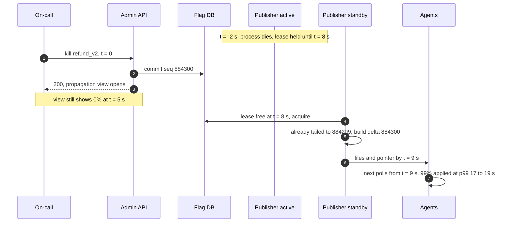

What the on-call sees: the propagation view stalls at 0% for ~9 s, then climbs. The publisher-lag alert fires at 60 s only if failover does not happen.

**B: A bad file published by a buggy publisher that also skipped its own check.**
- t = 0: `delta/884301` claims to remove 6,000 flags. The pointer moves.
- t = 0 to 6 s: every agent fetches it. The flag-count check fails. Agents keep 884300, report `rejected 884301`, and alert.
- t = 6 s: the "agents rejecting a file" page fires with 10,000 hosts reporting. User impact: none. Data at risk: none.
- Fix: stop the publisher. The fixed build re-renders the same committed change correctly as `snap/884301` and points the pointer at it. Agents that rejected `delta/884301` see a `snap_seq` newer than their own and take the snapshot. No new seq is needed. The bad delta stays in object storage under its name, never read again.

**C: A region is lost.**
- Flag DB: 2 of 3 replicas remain. Writes continue after the range leases move, about 10 s.
- Publisher: if it ran there, the standby takes over after the 10 s lease.
- Hosts in the lost region are down anyway. Hosts elsewhere never notice.

### 10.5 Exactly-once and idempotency end to end

| Hop | Duplicate or loss risk | Defence |
|---|---|---|
| Console to API | Double click, retry after timeout | `If-Match` makes a retried edit `409` with no effect. A kill retry with the same `Idempotency-Key` returns the original version |
| API to DB | Commit unknown after a timeout | The retry carries the same `If-Match`. Either it already committed (`409`, shows the version) or it commits now |
| DB to publisher | Publisher crash mid-publish | Files are named by seq and rewritten with identical bytes. Re-publishing is harmless |
| Publisher to object storage | Partial: delta written, pointer not | Pointer last. A delta without a pointer is invisible |
| Publisher to pointer | A paused old publisher overwrites the new pointer | Conditional write on the last ETag, lease `epoch` in the pointer, 1 s re-check by the active publisher |
| Object storage to agent | Duplicate or stale pointer from a cache | The prefix rule ignores an old or repeated seq. Each seq applies once |
| Agent to SDK | Reload mid-request | Per-request pinning |
| SDK to watermarks | Lost report | The next report carries the latest seq. Reports are state, not events |

### 10.6 Consistency model per edge

| Edge | Model |
|---|---|
| Engineer to Flag DB | Linearizable per flag (`If-Match`). Total order across flags via `seq` |
| Flag DB to publisher | Prefix of the committed log, in seq order |
| Publisher to object storage | Read-after-write. Files before pointer |
| Pointer through the cache | Bounded staleness, ≤ 1 s cache age |
| Agent | Monotonic. Applies a contiguous prefix and never goes back, plus an OFF-only overlay of recent kills from the pointer |
| SDK in one process | One snapshot per request (snapshot isolation for reads) |
| Across hosts and services | Eventual, p99 under 10 s. A decision passed in the request context overrides it for that request |
| Watermarks | Eventual, ≤ 5 s coalescing |

### 10.7 Alternatives rejected

| Alternative | Why it looked attractive | Why it lost here |
|---|---|---|
| Central evaluation API with Redis | Familiar, one place for logic | Puts a network hop and a dependency on 20 M checks/s |
| Streaming (SSE / gRPC) to every process | Sub-second updates, what SaaS flag vendors use for their SDKs | A stateful tier for ~4 s of gain. LaunchDarkly also ships a supported polling mode with a 30 s default, so tens of seconds is an accepted propagation time even for a vendor |
| etcd or ZooKeeper watches from every process | Built-in watch and ordering | 50k watchers on a consensus cluster. A hard dependency at boot. History compaction fights the audit trail |
| Kafka topic, every process a consumer | Ordered, replayable | 50k consumer sessions on one partition leader, and you still need snapshots for new processes |
| Per-host sidecar answering checks over localhost RPC | One implementation of evaluation for every language | A syscall and serialization per check (~20 to 50 us), 20 per request. Evaluation is ~200 lines per language. Keep it in process |
| Publisher-assigned seq at a closed timestamp | Removes the counter-row cap | Needed only above ~12 edits/s. Here the rate is 0.035/s |
| Bloom filter for big lists | Smaller | Permanent per-id errors at practical sizes (0.81% at 10 bits per id), 23 probes at 33 bits per id, no enumeration or remove |
| Per-service snapshots | Smaller files | Needs a "which flags does this service use" model. Not worth it at 8 MB |

### 10.8 How the big companies do it

- **LaunchDarkly.** Server SDKs evaluate in process. The Go SDK polls every 30 s by default, and 30 s is also its minimum. Streaming reconnects after 1 s. Bucketing is SHA-1 of `key.salt.value`: the first 15 hex digits divided by `0xFFFFFFFFFFFFFFF` (2^60 - 1), with rollout weights in units of 0.001%. The Go code does that division in `float32`, which is fine for percentages but a reason our SDKs use integer math. A Relay Proxy inside the customer's network holds one upstream stream and fans it out, like our regional cache.
- **Unleash (open source).** SDKs poll every 15 s by default (`refreshInterval = 15_000`) and send metrics every 60 s. Stickiness is MurmurHash3 x86 32-bit over `groupId:userId` with seed 0, normalized to 1..100. `groupId` defaults to the flag name, which is how rollouts stay independent across flags. Until the first sync, flags are false unless the SDK is bootstrapped from a file. Our code default and bootstrap snapshot are the same idea.
- **Meta Gatekeeper and Configerator (SOSP 2015).** Gatekeeper rolls features out by user sampling ("1%→10%→100%" of employees, then regions, then users), evaluating restraints in process. Configerator delivers a config change in about 5 + 5 + 4.5 = 14.5 s end to end to "hundreds of thousands of servers". Its section 6.4 splits config issues into common errors (42%), subtle errors (36%) and valid changes exposing code bugs (22%). The third bucket is exactly what guarded ramps catch.
- **Uber Flipr.** Over 350K active properties, ~150K changes a week (~21k a day), used by 700+ services on 50K+ hosts at ~3 M QPS, served through a fan-out tier of gateway caches. Its change rate is about 7x ours with a similar shape: a small store, a cache tier, local reads.
- **AWS AppConfig.** Deploys flags with linear or exponential strategies (e.g. 20% every 2 hours over 10 hours). A bake time after 100% watches CloudWatch alarms and rolls the deployment back if one fires. Our guarded ramp is the same contract at flag level.
- **OpenFeature (vendor-neutral API spec).** Evaluation "MUST NOT throw" and returns the default value on abnormal execution (requirement 1.4.10). Evaluation methods "SHOULD NOT" log because they "run in hot code paths" (1.4.11). The spec defines 8 reasons and 8 error codes. Our `Decision.reason` maps onto it, so an OpenFeature provider for our SDK is a thin adapter.
- **The incidents.**
  - **Knight Capital, 1 Aug 2012:** new code "repurposed a flag that was formerly used to activate the Power Peg code". One of 8 servers did not get the new code. The flag then re-enabled dead code on that server, and 212 parent orders became 4 million executions in about 45 minutes, a $460 million loss. Never reuse a flag key.
  - **Google Cloud, 12 Jun 2025 (10:49 PDT start):** a new code path that "was not feature flag protected" crashed on policy data that was "replicated globally within seconds".
  - **Cloudflare, 18 Nov 2025 (11:20 UTC start):** a feature file "doubled in size" past a preallocated limit of 200 (about 60 in use) and was "propagated to all the machines". Core traffic was largely normal by 14:30 UTC.

  All three are reasons for §5.4 and §5.7. Sources and spot-checks: [`research/facts-survey.md`](research/facts-survey.md).

### 10.9 Operational runbook

- **Dashboards (the 5 metrics):** propagation p50 and p99 per change; percentage of hosts more than 5 min stale; files rejected by agents; checks by reason (`ERROR` and `NO_SNAPSHOT` should be 0; alert on a jump in a flag's `NO_UNIT` share, the sign of a wrong `unit_type`, since unauthenticated paths produce `NO_UNIT` legitimately); publisher lag (now minus the commit time of the last published seq).
- **Alerts:** rejected file anywhere, page the platform on-call; publisher lag over 60 s, page; stale hosts over 1% for 5 min, page; `ERROR` above 0 for any flag, ticket to the owner plus a platform alert; guarded ramp paused, page the flag owner.
- **Laggard triage:** "reported recently but behind" means the agent is rejecting files (look at its reason). "Not reported for 30 s or more" means the host or agent is down or partitioned. "Behind with no rejects" means the cache or object storage for that region.
- **Rollout of the platform itself:** agents and SDKs ship like any library, canary hosts first. A new snapshot schema follows §5.4: canary pointer, 1%, 10%, all.
- **Rollback:** a bad flag edit is reverted by a forward version. A bad agent build is rolled back like any deploy, and its disk copy stays valid because the format is versioned. A bad publisher build is stopped, and the previous build republishes from the DB.

### 10.10 Security and abuse

- **Who can edit.** RBAC by owner team. High-risk flags need two people for increases. Every action is a version with a reason, author and approver. The audit log is the versions table, append-only.
- **Integrity on the way to hosts.** Two keys. The admin API signs each flag version at commit, and the publisher signs each file. Agents verify both, so neither a compromised cache or bucket nor a compromised publisher alone can flip a flag, and agents refuse a flag version lower than the one they hold. An independent auditor rebuilds the file checksums from the Flag DB every hour. The break-glass override uses a separate key held by SRE, and the agent applies only `state = OFF` from it.
- **Data in snapshots.** Lists hold internal ids (merchant ids), never names or emails. Snapshots never leave the backend. Client apps get evaluated booleans from a backend endpoint, never rules or lists.
- **Abuse.** A malicious insider can turn a feature on. The defences are approvals on high-risk flags, a page for any change to a `permanent` kill switch, and the audit trail. A buggy script is capped by the batch endpoint's rules and the 1% flag-count check.

### 10.11 Evolution

- **10x flags (200k).** The snapshot becomes 80 MB, and each process parsing it costs real RAM. Add per-service namespaces: services declare the flag prefixes they read, the agent keeps the whole set, and the SDK loads only its namespaces. The seam: the SDK's loader already reads by interned key.
- **Experiments.** Add multiple variants and **exposure logging**: the SDK emits `(flag, unit, variant, version)` when a check returns, sampled and batched through the agent. Log at evaluation, not at assignment, and alarm on sample ratio mismatch (Microsoft reports ~6% of its experiments show one). Analysis lives in a separate experimentation system (#40).
- **Prerequisites.** "Evaluate B only if A is true for this unit" as a step before the block list, with a depth limit of 1 and a cycle check in the publisher. Until then, a shared salt gives nested cohorts (§5.2).
- **Attribute targeting** (country, plan). A rule list evaluated before the percentage, as typed predicates (`country in [...]`), never free-form code. Every new predicate type is gated on fleet SDK support (§5.2).
- **Browser and mobile.** A backend endpoint evaluates all flags for one user and returns booleans, cached per session. No rules or lists ever ship to clients.
- **Multi-region active-active editing.** Already there through the consensus store.
- **Config values, not booleans.** Resist it, or cap value size. A flag system that carries arbitrary config is how the 8 MB snapshot becomes Cloudflare's feature file.

---

## 11. Follow-up questions to expect

Ranked by how likely an interviewer is to ask them.

1. "Why not Redis plus a local cache?" The ratio, the cold-start herd, and the dependency on every request. §5.1, edge case "remote flag store slow".
2. "How exactly does the percentage stay sticky as it grows, and independent across flags?" §5.2, [`deep-dives/evaluation-and-bucketing.md`](deep-dives/evaluation-and-bucketing.md).
3. "The kill switch: how fast, and how do you know?" §5.3, the propagation view, edge case "kill during publisher failover".
4. "The flag service is down. What does a booting service do?" §5.4 boot order, the readiness option.
5. "A bad flag file goes out." Two validators, hard limits, per-flag isolation. §5.4, Flow 5.
6. "Two services, one feature, 3 s apart." §5.6.
7. "1 M ids on a block list." §5.5.
8. "A ramp to 5% raises errors. Who notices?" §5.7, guarded ramps.
9. "How would you migrate our existing flags without reshuffling users?" §8, `legacy_v1` bucketing.
10. "What does this cost, and would you buy it?" §8.

---

## 12. Running it in Stripe's 60-minute round

The reported Staff round was 60 minutes. One way to spend it:

| Minutes | What to do | What it signals |
|---|---|---|
| 0 to 5 | Ask the prompt's own clarifying questions ([README](README.md)). Write the ratio on the board: checks/s vs edits/day | You design from requirements, not a template (the exact feedback the reported candidate got) |
| 5 to 15 | Evaluation order table and the bucket formula. Show sticky, monotonic, independent with one example | Correctness before boxes |
| 15 to 30 | §4.2 and §4.3: one store, change log, files, agent, 5 s poll. The kill-switch budget, and why no push | Simplest design that meets the SLO, with the refused alternative named |
| 30 to 42 | §5.4: outage and bad snapshot, the two validators, the incidents | Blast radius thinking |
| 42 to 52 | The interviewer's pick: §5.6 skew, §5.5 lists, or §5.7 governance | Depth on demand |
| 52 to 60 | Migration with bucket preservation, operability, cost, what you refused | Staff scope |

Before the round, practise saying in one sentence why each component is the technology it is. Stripe's other reported design feedback (superhero dispatch, 2026) was "justification for the technology choices wasn't strong enough".
