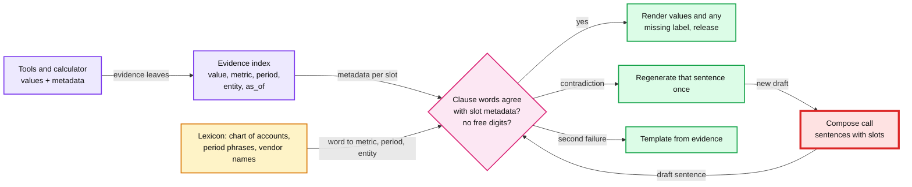

# Deep dive: grounding and number verification

> One-line answer: tools compute every number, and the model never types one: it writes claim slots like `{c4.current}`, code fills in the value, and a ~15 µs lexicon check makes the metric, period and entity words in each clause agree with the metadata the tool attached to that value, rendering a label when the prose gives none and regenerating one sentence only on a contradiction; the design uses claim slots because its first version, a number-only verifier that asked "is this number somewhere in the cited evidence?", stopped typos ($52,310 for $52,130) but passed a correct number with the wrong words ("$9,200 on contractors" when $9,200 is rent, "last quarter" when the value is the prior year's, a vendor swap, or the user's own guess repeated as fact), as the runnable check in §9 shows.

Zoom-in on [`../solution.md`](../solution.md) §5.3 (grounding), §10.1 (the claim checker) and §5.4 (numbers in proposals). Siblings: [`latency-cost-and-context.md`](latency-cost-and-context.md) (what a block costs in latency), [`offline-evals-and-rollout.md`](offline-evals-and-rollout.md) (how the leak rate is measured). Concepts: [`../../../concepts/rag-and-react.md`](../../../concepts/rag-and-react.md) §4 (faithfulness metrics and why they are offline tools).

Acronyms: LLM (large language model), P&L (profit and loss), CPU (central processing unit), NLI (natural language inference), AR (accounts receivable).

---

## 1. Three layers: prevent, check, fall back



- **Prevent.** The model never adds up rows. Comparisons come back from tools with deltas and percentages already computed; any other arithmetic goes through `calculate`, recorded as a derivation over citation paths (solution §5.3). Periods are enums that code resolves in the realm's time zone and fiscal calendar.
- **Check.** Deterministic code, per clause, before the sentence streams: the claim check of solution §5.3, which checks the words that give a number its meaning, not only the number.
- **Fall back.** One sentence regenerated if at least 2 s of the deadline remain, else a template rendered straight from the evidence: "Net income, Jan 1 to Oct 3, 2026: $52,130 (Profit and Loss)". Sentences already shown were checked, so nothing wrong was ever on screen.

## 2. The evidence index

Every leaf of every tool result enters the turn's index with metadata the tool supplied, not the model:

| Leaf | Value | Unit | Metric | Period | Entity | Source |
|---|---|---|---|---|---|---|
| `c1.current` | 18,400.00 | USD | contract_labor | Q3 2026 | realm | `query_transactions` |
| `c1.prior` | 14,250.00 | USD | contract_labor | Q3 2025 | realm | same call |
| `c1.change` | 4,150.00 | USD | contract_labor | Q3 2026 vs Q3 2025 | realm | same call |
| `c2.v88` | 9,800.00 | USD | contract_labor | Q3 2026 | vendor v88 (Rivera Electric) | top payees |
| `c4.current` | 9,200.00 | USD | rent | Q3 2026 | realm | `run_report` |
| `d1` | 8,200.00 | USD | rent | Q3 2026 | realm | `calculate(c4.current - q.n2)` |
| `q.n2` | 1,000.00 | USD | none | none | user | the user's message |

- **The metadata already exists.** A report row knows its account; a query knows its filters and resolved bounds; the calculator knows its inputs. Carrying it costs a few bytes per leaf.
- **Vendor and customer names are untrusted text** (they can be written by outsiders), but the mapping from name to id is done by code, so matching a name in the prose to an entity id is safe.
- **The lexicon** comes from the realm's chart of accounts (account names plus a standard synonym list: "contractors" for Contract labor, "lease" for Rent) and the period resolver's phrases. It is cached with the realm profile, a few KB per realm.

## 3. Why number-only checking was replaced

The runnable code in §9 feeds the same adversarial drafts to the design's first verifier (numbers must equal cited evidence after rounding, direction words must match the sign) and to the claim check that replaced it.

| Failure shape | Example | Number-only (first version) | Claim check (the design) |
|---|---|---|---|
| Transposed digit | "$18,040" for $18,400 | caught | caught: no free digits at all |
| Wrong direction | "fell $4,150" when the change is +4,150 | caught | caught |
| Right number, wrong metric | "$9,200 on contractors", $9,200 is rent [c4] | **passes** | caught |
| Right number, wrong period, same citation | "$14,250 on contractors last quarter" [c1] | **passes**: c1 holds both periods | caught |
| Wrong year | "$18,400 in Q3 2025" | **passes**: years were allowed as "structural numbers" | caught: years are period phrases |
| Right number, wrong vendor | "Rivera Electric was $5,100" (Bay Plumbing's) | **passes** | caught |
| Two values swapped in one sentence | "contractors were $9,200, while rent was $18,400" | **passes** | caught: checked per clause |
| The user's guess echoed as fact | "Yes, your profit was $80,000" | **passes**: user numbers are evidence | caught: user numbers only in hypotheticals |
| A zero with no digits | "You have no overdue invoices" (there are 4) | **passes**: no number found | caught by the quantifier rule (§5) |
| A status claim | "Acme has paid" | **passes** | caught by the status rule (§5) |

- **The common thread:** the number-only check asked "is this number somewhere in the cited evidence?" The question that matters is "does this sentence describe that number correctly?" A citation that holds several numbers (both periods of a comparison, all rows of a top-N) made the first question much weaker than it looked.
- **One more trap in the first version:** "percent to one decimal" read literally made "29%" fail against 29.1, a false block for a harmless rounding. The design now rounds the evidence to the precision the mention uses, with at least 2 significant digits (solution §10.2), so "29%" passes and "30%" fails. Since the model no longer types values in prose, the rule applies only to numbers it does type: proposal arguments and the user's numbers quoted back.

## 4. Claim slots: what the model writes, what code does

**The model writes references, not values.** The compose call returns a list of sentences with citations (solution §5.3), and every number inside a sentence is a slot naming an evidence path:

```text
{"text": "You spent {c1.current} on contractors last quarter, up {c1.change} from {c1.prior} in Q3 2025.",
 "cites": ["c1"]}
```

**Code checks each clause** (split on commas, semicolons, "and", "while", "but"):
1. **No free digits.** After removing slots and period phrases, any digit left in the text fails. A typo can no longer exist, because the model never types a value.
2. **Every slot resolves** to a leaf of this turn's evidence.
3. **Metric words agree.** Any metric word in the clause (from the lexicon) must be the slot's metric.
4. **Period words agree.** Any period phrase or year in the clause must be an alias of the slot's period. "Last year" bound to Q3 2026 fails.
5. **Entity names agree.** A vendor or customer named in the clause must be the slot's entity.
6. **Direction words agree** with the sign of a change slot (kept from the first version).
7. **User numbers stay hypothetical.** A slot from the user's message in a clause with a ledger metric word and no hypothetical marker (if, would, suppose) fails. Otherwise it renders as "the $1,000 you mentioned".

**Code renders.** Values are formatted by the display rules (currency to whole dollars, explicit currency codes in multi-currency realms). If the sentence names no metric or no period for a slot, code appends them: "That was $9,200 (rent, Q3 2026)." That turns the most common failure, a vague sentence, into a correct one without a regeneration.

**The claim list is a by-product.** After rendering, each slot is a claim `(value, metric, period, entity, citation id)` taken from the index, never from the model. It is stored on the turn as the verifier report, and the next turn carries these claims forward instead of the prose (useful against injection, see [`prompt-injection-and-write-actions.md`](prompt-injection-and-write-actions.md)).

## 5. Beyond numbers: quantifiers and statuses

- **Quantifiers are numbers.** "No", "none" and "zero" need a citation to a count of 0, an empty result; "all" and "every" need a count equal to its total. "You have no overdue invoices" with `c1.count = 4` fails (solution §5.3).
- **Status words bind to status fields.** "Paid", "overdue", "sent" next to a named invoice or customer must match that entity's status leaf. This is the same machinery with a different lexicon.
- **What stays unchecked:** opinion and advice ("that looks high", "consider renegotiating"). The offline judge scores it; the runtime does not try.
- **Why not a model for this?** An NLI model or an LLM judge at runtime adds a call (~1 to 2 s, ~$0.005 per question [estimate]) and is itself probabilistic. The lexicon is brittle on paraphrase, but it fails closed: an unknown phrasing renders a label or falls to a template, and every such miss becomes a lexicon entry and an eval case.

## 6. The policy, and what it costs in latency

| Outcome of the check | Action | Latency cost |
|---|---|---|
| Pass | Render and release the sentence | ~15 µs CPU |
| Slot with no metric or period words | Render the label from metadata | none |
| Contradiction (metric, period, entity, direction, user number) or free digits | Regenerate **that sentence** once, with the reason ("c4.current is rent, not contract labor") | ~0.7 s first token + ~50 tokens, ~1.2 s at 100 tokens/s |
| Second failure, or under 2 s of deadline left | `replace` event with the template | none |

- **Tokens.** A slot such as `{c1.current}` is a few tokens longer than "$18,400"; at ~4 numbers per answer that is ~10 to 20 extra output tokens, ~0.1 to 0.2 s at 100 tokens/s [estimate]. Emitting a full claim list from the model (metric, period, entity per number) would be ~15 to 20 tokens per claim, ~0.7 s per answer, for no extra safety, because the metadata already sits in the index. So the model emits slots only.
- **CPU** is noise: ~15 µs per sentence in the code below, against the ~1 ms the first version budgeted.
- **False blocks are the real cost, and they set two of the design's rules.** With the old 300-token answers, whole-answer regeneration at an 8% block rate raised the full-answer p95 from ~8.75 s to ~9.8 s. With today's 150-token answers it would add ~0.6 s; one-sentence regeneration adds ~0.2 s (6.64 s to 6.81 s in the latency model). So the design regenerates one sentence, not the answer (~1.2 s, not ~3.7 s), and renders missing labels instead of regenerating at all. The migration runs the claim check in report-only mode for 2 weeks and switches it to blocking only once contradiction blocks stay under ~3% (solution §8).
- **The deadline rule follows from the scope.** The first version regenerated the whole answer if at least 3 s remained, but a whole regeneration took ~3.7 s, so one started with 3 to 3.7 s left overran the 10 s deadline and ended in a template after paying for the call. A sentence takes ~1.2 s, so the design regenerates only with at least 2 s left (solution §10.2); a whole-answer regeneration would need ~4.5 s [estimate].

## 7. Catching what the checker misses

- **The NFR (non-functional requirement) is the checker's miss rate**, not the model's error rate: under 0.1% of answers with an untraced or mislabelled number reach the user.
- **Online:** experts review ~3,000 consented turns a week (solution §5.3). Over 4 weeks (~12k turns) a 0.1% miss rate expects ~12 misses and 0.3% expects ~36. Alarm at 21 or more: the chance of a false alarm at 0.1% is ~1.2%, and the chance of missing a real 0.3% is ~0.3% (Poisson).
- **The sample keeps the numbers.** Redaction removes names, tax ids and free text but keeps amounts and labels (solution §5.8), or reviewers could not check anything. Review happens in the restricted store, under break-glass audit.
- **Offline:** adversarial phrasing suites (numbers in words, ranges, fractions, paraphrased account names, period phrases) on synthetic tenants, gated per release. Every online miss becomes a parser or lexicon test and an eval case.

## 8. Numbers in proposals

The same index guards writes (solution §5.4). Every number in a proposal's arguments must be a slot to evidence or to the user's own message: "invoice Acme for 10 hours at $150" has `q.n1 = 10` and `q.n2 = 150`, and the total is `calculate(q.n1 * q.n2)`. A "50% discount" that appears only in a memo or in the model's own earlier prose resolves to nothing and never reaches a card.

## 9. Runnable check

Standard library only. `old_check` is the first version's number-only verifier (number in cited evidence, direction words); `new_check` is the claim-slot check. Each line prints both verdicts and, on a pass, the sentence code renders.

```python
import re, time
# Evidence for one turn. Every leaf carries metadata from the tool or calculator, never from the model.
EV = {"c1.current": (18400.0, "contract_labor", "Q3 2026", "realm"),
      "c1.prior":   (14250.0, "contract_labor", "Q3 2025", "realm"),
      "c1.change":  (4150.0,  "contract_labor", "Q3 2026 vs Q3 2025", "realm"),
      "c2.v88":     (9800.0,  "contract_labor", "Q3 2026", "v88"),
      "c2.v91":     (5100.0,  "contract_labor", "Q3 2026", "v91"),
      "c4.current": (9200.0,  "rent", "Q3 2026", "realm"),
      "d1":         (8200.0,  "rent", "Q3 2026", "realm"),     # calculator: c4.current - q.n2
      "q.n1": (80000.0, None, None, "user"), "q.n2": (1000.0, None, None, "user")}  # typed by the user
METRIC = {"contract_labor": r"contractors?|contract labor", "rent": r"rent|lease", "net_income": r"profit|net income"}
PERIOD = {"Q3 2026": ["last quarter", "q3 2026"], "Q3 2025": ["same quarter last year", "q3 2025", "last year"]}
ENTITY = {"v88": "rivera electric", "v91": "bay plumbing"}   # names from evidence, matched by code
PERIOD_RE = re.compile(r"same quarter last year|last quarter|last year|this year|q[1-4] 20\d\d|20\d\d")
UP, DOWN = re.compile(r"\b(up|rose|more|increased?)\b"), re.compile(r"\b(down|fell|less|decreased?)\b")
SLOT, HYPO = re.compile(r"\{([a-z0-9.]+)\}"), re.compile(r"\b(if|would|suppose)\b")

def money(v): return f"${v:,.0f}"
def old_check(text):                 # first version: each number equals cited evidence, direction words
    rendered, low = SLOT.sub(lambda m: money(EV[m.group(1)][0]), text), text.lower()
    nums = [float(n.replace(",", "")) for n in re.findall(r"\$([\d,]+)", rendered)]
    flips = any(EV[r][0] > 0 and DOWN.search(low) or EV[r][0] < 0 and UP.search(low)
                for r in SLOT.findall(text) if "change" in r)
    return not flips and all(round(n) in {round(v[0]) for v in EV.values()} for n in nums)

def new_check(text):
    if re.search(r"\d", PERIOD_RE.sub("", SLOT.sub("", text.lower()))):
        return "FAIL free digits: every number must be a slot"
    out, whole = [], SLOT.sub(" ", text.lower())            # sentence-wide words decide labels
    for clause in re.split(r"(,|;| and | while | but )", text):
        low = SLOT.sub(" ", clause.lower())                       # judge the words, not the slot names
        said_m = {m for m, rx in METRIC.items() if re.search(rf"\b({rx})\b", low)}
        said_p = PERIOD_RE.findall(low)
        named = [e for e, n in ENTITY.items() if n in low]
        for ref in SLOT.findall(clause):
            if ref not in EV: return f"FAIL {ref} is not in the evidence"
            val, metric, period, entity = EV[ref]
            if entity == "user":
                if said_m and not HYPO.search(low): return f"FAIL {ref} is the user's number stated as a fact"
                continue
            if said_m and metric not in said_m: return f"FAIL {ref} is {metric}, prose says {said_m.pop()}"
            ok_p = PERIOD.get(period.split(" vs ")[0], []) + [period.lower()]
            if any(not any(p in o for o in ok_p) for p in said_p): return f"FAIL {ref} is {period}, prose says '{said_p[0]}'"
            if named and entity not in named: return f"FAIL {ref} belongs to {ENTITY.get(entity, entity)}"
            if "change" in ref and (UP.search(low) and val < 0 or DOWN.search(low) and val > 0):
                return f"FAIL direction word disagrees with the sign of {ref}"
        def fill(m):                     # code renders every value, and any label the sentence left out
            v, metric, period, entity = EV[m.group(1)]
            if entity == "user": return f"the {money(v)} you mentioned"
            lab = [] if re.search(rf"\b({METRIC[metric]})\b", whole) else [metric.replace("_", " ")]
            said = all(any(a in whole for a in PERIOD.get(p, [p.lower()])) for p in period.split(" vs "))
            lab += [] if said else [period]
            return money(v) + (f" ({', '.join(lab)})" if lab else "")
        out.append(SLOT.sub(fill, clause))
    return "PASS  " + "".join(out)

drafts = ["You spent {c1.current} on contractors last quarter, up {c1.change} from {c1.prior} in Q3 2025.",
          "You spent {c4.current} on contractors last quarter.",          # right number, wrong metric
          "Contractors cost you {c1.prior} last quarter.",                 # right number, wrong period
          "Rivera Electric was {c2.v91} of it.",                          # right number, wrong vendor
          "Contractors were {c4.current}, while rent was {c1.current}.",  # swapped in one sentence
          "You spent $18,040 on contractors last quarter.",               # a typed number, with a typo
          "Contractor spend fell {c1.change} from Q3 2025.",              # wrong direction
          "Yes, your profit this year was {q.n1}.",                       # a leading question echoed
          "If you cut rent by {q.n2}, it would have been {d1} last quarter.",
          "That was {c4.current}."]                                       # no label in the prose
for d in drafts:
    print(f"old {'pass' if old_check(d) else 'FAIL'} | new {new_check(d)}")
t = time.perf_counter()
for _ in range(10000): new_check(drafts[0])
print(f"new check: {(time.perf_counter() - t) / 10000 * 1e6:.0f} microseconds per sentence")
```

Output (Python 3.14; the timing line varies by machine):

```text
old pass | new PASS  You spent $18,400 on contractors last quarter, up $4,150 from $14,250 in Q3 2025.
old pass | new FAIL c4.current is rent, prose says contract_labor
old pass | new FAIL c1.prior is Q3 2025, prose says 'last quarter'
old pass | new FAIL c2.v91 belongs to bay plumbing
old pass | new FAIL c4.current is rent, prose says contract_labor
old FAIL | new FAIL free digits: every number must be a slot
old FAIL | new FAIL direction word disagrees with the sign of c1.change
old pass | new FAIL q.n1 is the user's number stated as a fact
old pass | new PASS  If you cut rent by the $1,000 you mentioned, it would have been $8,200 last quarter.
old pass | new PASS  That was $9,200 (rent, Q3 2026).
new check: 15 microseconds per sentence
```

## 10. What an interviewer pushes on

1. **"A number-only verifier passes '$9,200 on contractors'. Does yours?"** No. Ours started that way: it checked that 9,200 was in the cited result, not what the sentence called it. Slots plus the label check catch it.
2. **"Isn't a lexicon brittle?"** Yes, and it fails closed. A phrase it does not know cannot contradict; at worst code adds a label. The lexicon grows from review misses.
3. **"Why not render the whole answer from a template?"** That is the fallback. Templates are right and stiff; the model's job is the explanation around the numbers, and slots let it do that without ever typing a number.
4. **"The user says 'my profit is $80,000, right?'"** User numbers are allowed only as hypotheticals or as "the $80,000 you mentioned". The answer states the P&L figure.
5. **"What does this cost?"** ~15 µs CPU and ~0.1 to 0.2 s of extra tokens per answer. The real cost is the false-block rate, which is why missing labels are rendered, not regenerated.
6. **"How do you know it works?"** The miss rate is measured: 12k expert-reviewed turns per 4 weeks separate 0.1% from 0.3%.

## 11. Trade-offs

| Decision | Option A | Option B | Chose | Why |
|---|---|---|---|---|
| What the model writes | Digits plus citation ids | Slots that name evidence paths | Slots | Typos become impossible; the check moves from "is it there?" to "is it described right?" |
| Claim metadata | Declared by the model per number | Taken from the tool's own metadata | Tool metadata | ~0.7 s fewer output tokens, and the model cannot mislabel what it does not write |
| Label check | Runtime NLI or LLM judge | Lexicon from chart of accounts and period resolver | Lexicon | Deterministic, ~15 µs, explainable; brittle but fails closed |
| Missing label | Regenerate | Render from metadata | Render | No latency, and the user sees the true label |
| Regeneration scope | Whole answer, ~3.7 s | One sentence, ~1.2 s | One sentence | Fits a 2 s deadline rule; at 8% blocks, +0.2 s of p95 instead of +0.6 s |
| User numbers | Evidence like any other | Hypotheticals and proposals only | Restricted | Stops the leading-question echo |

## 12. Numbers to say out loud

- Number-only checking caught typos and direction but passed metric, period, vendor and swap errors and the user's own guess. The claim check that replaced it catches all of them, in ~15 µs per sentence.
- A slot costs ~10 to 20 extra output tokens per answer, ~0.1 to 0.2 s.
- Sentence regeneration ~1.2 s versus whole-answer ~3.7 s; only with at least 2 s of deadline left. Blocking turns on once contradiction blocks stay under ~3%.
- Leak-rate monitoring: ~3,000 reviewed turns a week; 4 weeks separate 0.1% (~12 misses) from 0.3% (~36), alarm at 21.
