# Deep dive: latency, cost and context

> One-line answer: the turn is three sequential model calls (router, plan, compose), so latency is mostly output tokens divided by output speed and cost is mostly how many input tokens hit the prompt cache; the design caps the compose answer at ~150 tokens (the card already carries every number) and regenerates one sentence, not the whole answer, because the uncapped 300-token version had an all-questions p95 of ~8.75 s against an 8 s target; now the first visible event is ~1.35 s p50, the card ~4.2 s p95 and the full answer ~6.6 s p95 at ~100 tokens/s, and at 50 tokens/s an eval-gated faster compose model keeps the p95 at ~7.5 s; cost is ~$0.015 per question with every cache hit, ~$0.017 at 95% hits and ~$0.044 with none, and the design keeps the cache intact by never editing the tools list inside a turn and by pinning each conversation to one provider deployment.

Zoom-in on [`../solution.md`](../solution.md) §2 (back-of-envelope), §5.1 (bounded loop), §5.7 (cost) and §10.1 (prompt caching). Reusable blocks: [`../../../concepts/caching-patterns.md`](../../../concepts/caching-patterns.md), [`../../../concepts/rate-limiting-and-load-shedding.md`](../../../concepts/rate-limiting-and-load-shedding.md), [`../../../concepts/rag-and-react.md`](../../../concepts/rag-and-react.md) §5 (the ReAct loop). The provider routing it depends on is [`../../ai-gateway/solution.md`](../../ai-gateway/solution.md) §5.4. Siblings: [`grounding-and-number-verification.md`](grounding-and-number-verification.md), [`prompt-injection-and-write-actions.md`](prompt-injection-and-write-actions.md).

Acronyms: LLM (large language model), TTFT (time to first token), SSE (server-sent events), ITPM (input tokens per minute), NFR (non-functional requirement), CI (continuous integration), AI (artificial intelligence), API (application programming interface), p50 and p95 (the median and the 95th percentile).

---

## 1. Where the time goes

```mermaid
%% Critical path of one single-round question with the solution's p50 estimates and the 150-token compose cap. Red: the compose output, the largest block and the one that doubles when output speed halves.
flowchart LR
    G["API gateway<br/>0.05 s"] -->|"session"| R["Router, small model<br/>0.2 s"]
    R -->|"intent, tool bundle"| P["Plan call, first token<br/>0.6 s"]
    P -->|"45 tokens"| C1["Tool call 1 streamed<br/>0.45 s"]
    C1 -->|"status line at 1.3 s"| C2["Tool call 2 + tools<br/>0.45 + 0.3 s"]
    C2 -->|"card at 2.1 s"| T["Compose, first token<br/>0.7 s"]
    T -->|"sentence by sentence"| O["Compose output<br/>150 tokens, 1.5 s"]
    O -->|"checked answer at 4.5 s"| U[Assist panel]

    class G,U client
    class R,P,C1,C2,T service
    class O critical

    classDef client   fill:#dbeafe,stroke:#2563eb,stroke-width:2px,color:#111
    classDef service  fill:#dcfce7,stroke:#16a34a,stroke-width:2px,color:#111
    classDef critical fill:#fee2e2,stroke:#dc2626,stroke-width:4px,color:#111
```



- **Three numbers set the whole budget.** TTFT of the mid model (~0.6 to 0.7 s with a warm prefix), its output speed (~100 tokens/s), and the number of sequential model calls (3, plus a 4th on ~20% of questions). All three are **[estimate]**. The speed is plausible: Artificial Analysis lists GPT-4o mini at 90.8 output tokens/s, against a median of 98 for the models it tracks (artificialanalysis.ai, read 2026-10-04).
- **What sits before each visible event.** The status line needs the router plus the first ~45 output tokens of the plan call. The card needs both tool calls and the tools. The full answer needs the compose output on top. So the first event barely depends on output speed, and the full answer depends on it almost linearly.
- **Prefill is the small term.** Anthropic's 2024 caching announcement measured a 10,000-token prompt at 1.6 s uncached and 1.1 s cached: ~0.05 s per 1,000 uncached tokens. A cold 6k-token static block adds ~0.3 s to TTFT. Caching matters far more for money than for latency here.

## 2. Why the answer is capped at 150 tokens: the sensitivity

The runnable model in §9 draws each step from a lognormal fitted to the solution's p50 and p95, draws output speed per call (p5 at 0.7x nominal), adds a second tool round on 20% of questions and a regeneration on 2%, and runs 20,000 questions per row. "Before" is the first version of the design: 300-token answers and whole-answer regeneration. "Now" is the design: a ~150-token cap and one-sentence regeneration (~50 tokens). Results, in seconds:

| Scenario | Status p50 | Status p95 | Card p95 | First sentence p95 | Full p50 | Full p95 | Over 8 s |
|---|---|---|---|---|---|---|---|
| Before: 300-token answers, all questions | 1.35 | 2.01 | 4.23 | 5.57 | 6.29 | **8.76** | 10.9% |
| Now: single round, no regeneration (the §2 table) | 1.36 | 2.00 | 3.12 | 4.55 | **4.49** | 5.72 | 0.0% |
| Now: all questions, 100 tokens/s | 1.35 | 2.01 | **4.17** | 5.50 | 4.70 | **6.64** | 0.4% |
| Now: two-round questions only | 1.36 | 1.99 | 4.96 | 6.36 | 6.01 | **7.57** | 2.3% |
| Now: 75 tokens/s | 1.51 | 2.18 | 4.66 | 6.18 | 5.56 | 7.70 | 3.2% |
| Now: prefix cache hit 50% | 1.50 | 2.16 | 4.47 | 5.85 | 4.89 | 7.00 | 1.0% |
| Now: verifier blocks 8%, one sentence regenerated | 1.36 | 2.00 | 4.19 | 5.53 | 4.78 | 6.81 | 0.7% |
| Verifier blocks 8%, whole answer regenerated | 1.36 | 2.00 | 4.21 | 5.54 | 4.77 | 7.25 | 2.2% |

What it says:
1. **The uncapped design missed its own target.** Its §2 budget timed a single-round question (p95 ~7.6 s), but the NFR is over all questions. With 20% two-round questions and 2% regenerations the p95 was ~8.75 s, and 1 question in 10 took over 8 s. Capping compose at ~150 tokens is what fixed it: all questions now p95 ~6.6 s, two-round questions alone ~7.6 s. The README's latency row now states both targets (8 s single-round, 10 s two-round) and adds the card (p95 under 5 s), the user-meaningful event.
2. **The status line is robust.** Halving output speed moves its p50 from 1.35 s to 1.82 s, still under 2 s. Only ~45 tokens are on its path.
3. **The verifier's block rate is a latency number.** At 8% blocks, one-sentence regeneration adds ~0.2 s to the p95; regenerating the whole answer adds ~0.6 s with 150-token answers and added ~1.1 s with the old 300-token ones. That is why the claim check regenerates one sentence and renders a missing label instead of regenerating at all ([`grounding-and-number-verification.md`](grounding-and-number-verification.md) §6).
4. **Cache hit rate barely moves latency** (6.64 s to 7.00 s at 50% hits). It moves money (§4).

## 3. What changes at 50 tokens/s

Output speed halves when a provider is loaded at month end, when traffic fails over to a slower fallback, or when a release switches to a bigger model.

| At 50 tokens/s | Card p95 | Full p50 | Full p95 | Over 8 s |
|---|---|---|---|---|
| Before: 300-token answers | 5.59 | 10.34 | 14.00 | 95.0% |
| Now: 150-token cap | 5.59 | 7.24 | **9.84** | 28.6% |
| Now, plus an eval-gated compose model at ~150 tokens/s for simple intents [estimate] | 5.58 | 5.10 | **7.49** | 2.1% |

- **The cap is the biggest lever.** It took the 50 tokens/s p95 from 14.0 s to 9.8 s. The card holds every number with its citation; the prose explains and does not need 300 tokens.
- **A faster compose model is the second, and the one that matters at 50 tokens/s.** Compose writes; it does not plan, so a smaller model with good evals is often enough. It ships only if it passes the same suite, including the claim check's first-pass rate. With it the p95 is back to ~7.5 s (solution §5.1).
- **The card is the weak spot at 50 tokens/s:** p95 ~5.6 s against its 5 s target, because two tool calls are streamed before it. A slow provider also trips the turn-level SLO burn trigger (full-answer p95 over 8 s for 10 minutes), which shifts weight to the fallback (solution §5.6).

## 4. Cost per question, and what moves it

Prices are **[estimate]**: mid model $2 per million input and $10 per million output tokens, small model $1 and $5. Multipliers are verified from Anthropic's prompt caching docs: cache reads 0.1x the input price, 5-minute cache writes 1.25x, 1-hour writes 2x. Each call is split into static prefix, conversation (written by the plan call at breakpoint 2, read by compose), new input and output.

| Scenario | $ per question | $ per day at 5 M |
|---|---|---|
| Before: 300-token answers, every cache hit | 0.0163 | 82k |
| Now: every cache hit | **0.0148** | 74k |
| Now: static prefix and conversation hit 95% (the §2 design number) | **0.0167** | 84k |
| Static prefix hit 50% | 0.0310 | 155k |
| Compose lands on another deployment | 0.0212 | 106k |
| 4 model calls per question | 0.0181 | 90k |
| 5 model calls per question | 0.0222 | 111k |
| 30% of turns edit the tools list mid-turn | 0.0203 | 102k |
| No caching at all | **0.0441** | 220k |

- **~$0.017 at 95% hits leaves ~15% headroom to the $0.02 target**, and each of three ordinary mistakes (editing the tools list, losing plan-to-compose affinity, a fourth and fifth model call) eats it. §5 is how the design avoids the first two; the CI gate blocks a release that costs more than 10% more per question, which catches the third.
- **A cold cache is worse than no cache.** A miss writes at 1.25x, a hit reads at 0.1x. At hit rate h the cached tokens cost `0.1h + 1.25(1 − h)` of the base price, which equals 1.0 at h ≈ 0.22. Below ~22% hits, caching loses money.
- **Each extra model call is ~$0.004.** A prompt change that adds a tool round on every question is a ~+28% cost change at every cache hit.
- **Quota is the other bill.** Cache reads do not count toward ITPM rate limits on most Claude models (Anthropic rate limits docs; Claude Haiku 3.5 is the stated exception). So the static prefix costs no quota when it hits, and ~72 M uncached tokens a minute at peak is the number to buy.

## 5. The caching mechanics, and the three rules they forced

Verified on Anthropic's prompt caching page (read 2026-10-04): the TTL (time to live) is 5 minutes and "refreshed for no additional cost each time the cached content is used"; the minimum cacheable length is 512 to 4,096 tokens depending on the model; the cache follows the order tools, then system, then messages, and "Modifying tool definitions (names, descriptions, parameters) invalidates the entire cache", while "Changes to `tool_choice` parameter only affect message blocks". The first version of the design broke these three ways, and each became a rule:

1. **The tools list never changes inside a turn.** The first version removed write tools from the request after a turn read untrusted text. That rewrote the tools block, so the plan call's cached prefix and conversation were lost: ~8k tokens at 1.25x instead of 0.1x, and $0.0203 per question if 30% of turns did it. The design now keeps `tools` and `tool_choice` byte-identical for the turn and enforces the capability state in code: the tool gateway refuses a `propose_*` call with `tool_unavailable`, and one note after the last breakpoint tells the model (solution §5.4). The guarantee was always the code, not the tools list.
2. **Tool bundles, not per-intent subsets.** The router used to pick 3 to 5 tools per intent, so the "static" prefix was really per (release, tool subset): up to ~40 variants. At 300/s each stays warm; at night the long tail fell below the 22% break-even. The router now picks one of ~8 bundles [estimate] (solution §5.7).
3. **Session affinity, not prefix-hash affinity.** The AI gateway's affinity key is `hash(tenant, x-gw-session)` when a session header is sent, "else a hash of the first 2 KB of the prompt". The assistant's first 2 KB is the static block, identical for every user of a bundle, so without the header a whole bundle hashed to one host (the old D10 hot deployment), and bounded load only spilled it at 1.5x average. The orchestrator now sends `x-gw-session = conversation_id`: plan, compose and the next turn land together (breakpoint 2 hits; without it, $0.0212 per question), and load spreads by conversation. Re-writing the static block once per deployment per bundle every 5 minutes costs ~6k × 1.25 × $2 per million = ~$0.015 each, ~$4 an hour for 8 bundles on 3 deployments, against ~$3,500 an hour of model spend.

**Isolation.** From the same page: caches "are isolated per workspace within an organization" on the Claude API, but "On Bedrock and Google Cloud, caches are isolated per organization", and "caches are never shared across organizations". Intuit reaches Claude through Bedrock (solution §5.6), so every Intuit assistant shares one cache scope. A hit needs byte-identical content, so nothing is returned across tenants, but cache hits are visible as faster responses (Gu et al. 2025, arXiv 2502.07776, detected cross-user cache sharing at seven API providers). So the realm segment starts with the realm id, and no prefix past the shared static block can match across realms, at zero cost ([`../edge-cases.md`](../edge-cases.md), the timing entry).

## 6. Context: aggregate, never stuff

| Input | Naive size | What the design sends |
|---|---|---|
| Three years of a busy company's transactions | ~50k rows × ~40 tokens = ~2 M tokens | A typed aggregate (`sum`, `count`, deltas) plus at most 25 example rows, ~1.5k tokens |
| Free text on those rows | Unbounded: a 30 KB memo is ~7.5k tokens | Only with `include_text`, ~200 characters per field, each tool result capped at ~2k tokens |
| Conversation history | Every turn so far | The last two turns; untrusted spans and tainted prose dropped, verified claims and ids kept |
| Tool catalog | ~20 schemas, ~12k-token prefix | One bundle of 3 to 5 schemas from the router, ~6k-token prefix |

- **Stuffing fails three ways at once:** 2 M tokens is past any context window, ~$4 per call at $2 per million even if it fit, and models miscount long tables. Retrieval over transactions cannot sum a category over 50k rows either ([`../../../concepts/vector-index.md`](../../../concepts/vector-index.md)).
- **The per-turn budget is in code:** 40k input tokens, 1.5k output tokens, 6 model steps, 8 tool calls, 10 s. At a limit the orchestrator composes from the evidence it has.
- **The user who wants the rows** gets a deep link to the product's own report, filtered the same way. The model never reads them.

## 7. What an interviewer pushes on

1. **"Your p95 is 6.6 s. Measured?"** No, modelled, and the model is why the answer is capped: uncapped, the all-questions p95 was ~8.75 s. Ship with the cap, measure, and keep the card (p95 ~4.2 s) as the event users wait for.
2. **"The provider halves output speed. What breaks?"** Not the status line (1.8 s p50). The full answer goes to ~9.8 s p95 and the card to ~5.6 s. The faster compose model brings the full answer back to ~7.5 s, and turn-level SLO burn shifts traffic to the fallback.
3. **"Why not stream raw tokens?"** A wrong first number is worse than a late one. The card shows checked numbers at ~2.1 s p50 anyway (solution §5.1).
4. **"Why is caching worth it if hit rate is uncertain?"** Above ~22% hits it pays; at the design's ~95% it cuts cost from ~$0.044 to ~$0.017. And cache reads cost no ITPM quota.
5. **"Why a router? It adds 0.2 s."** It halves the prompt (~12k to ~6k static tokens), removes wrong tools, picks a warm bundle, and costs ~$0.0007.
6. **"Why not cache answers?"** They differ per realm and role and go stale with every posting (solution §5.7). Cache the prefix and nothing that holds a number.

## 8. Trade-offs

| Decision | Option A | Option B | Chose | Why |
|---|---|---|---|---|
| Answer length | ~300 tokens of prose | ~150 tokens, numbers on the card | 150 | p95 ~8.75 s to ~6.6 s; the card already carries every number |
| Regeneration scope | Whole answer | One sentence | Sentence | At 8% blocks, +0.2 s of p95 instead of +0.6 s (150 tokens) or +1.1 s (300) |
| Capability enforcement | Remove write tools from the request | Same tools all turn, refuse in code | Code | Editing tools invalidates the whole cache; code is the guarantee anyway |
| Provider affinity | Hash of the prompt's first 2 KB | Session header per conversation | Session | Prefix hashing put a whole bundle on one host; spreading costs ~$4 an hour |
| Tool exposure | Per-intent subset | ~8 bundles | Bundles | Fewer prefixes, each warm; slightly larger prompts |
| Latency NFR | One full-answer p95 | Card p95, plus full-answer p95 by round count | Split | Measures what the user waits for, and is honest about two-round questions |
| Compose model | Same mid model | Faster model for simple intents | Faster, eval-gated | The lever that keeps p95 under 8 s at 50 tokens/s |

## 9. Runnable model

Standard library only, seeded. It prints the tables above.

```python
import math, random
random.seed(7)
Z95 = 1.645
def ln(p50, p95):                      # a lognormal draw with this p50 and p95
    return random.lognormvariate(math.log(p50), math.log(p95 / p50) / Z95)
MISS_S_PER_1K = 0.05                   # extra prefill per 1k uncached tokens [estimate]

def turn(tps, hit=0.95, out=150, round2=0.20, regen=0.02, regen_out=50, compose_tps=None):
    """One question: (first visible event, card, first verified sentence, full answer) in s."""
    def speed(base): return base * random.lognormvariate(0, math.log(1 / 0.7) / Z95)  # p5 = 0.7x
    miss = lambda k: 0 if random.random() < hit else MISS_S_PER_1K * k
    ctps = compose_tps or tps
    t = ln(0.05, 0.1) + ln(0.2, 0.4) + ln(0.6, 1.2) + miss(6)   # API gateway, router, plan TTFT
    t += 45 / speed(tps); first = t                        # first tool call streamed: status line
    t += 45 / speed(tps) + ln(0.3, 1.0)                    # second call, then the tools
    if random.random() < round2:                           # second tool round
        t += ln(0.6, 1.2) + miss(6) + 45 / speed(tps) + ln(0.3, 1.0)
    card = t
    s = speed(ctps); t += ln(0.7, 1.3) + miss(2)           # compose, checked sentence by sentence
    sentence = t + 50 / s; t += out / s
    if random.random() < regen:                            # a blocked sentence (or answer) regenerated
        t += ln(0.7, 1.3) + regen_out / speed(ctps)
    return first, card, sentence, t

def pct(xs, q):
    xs = sorted(xs); return xs[int(q * (len(xs) - 1))]
print("latency, 20,000 simulated questions per row (seconds)")
print(f"{'scenario':38} {'event p50':>9} {'p95':>5} {'card p95':>8} {'1st sent p95':>12} {'full p50':>8} {'p95':>5} {'over 8 s':>8}")
for name, kw in [("now: single round, no regen", dict(tps=100, round2=0, regen=0)),
                 ("now: all questions, 100 tok/s", dict(tps=100)),
                 ("now: two-round questions only", dict(tps=100, round2=1.0)),
                 ("now: 75 tok/s", dict(tps=75)),
                 ("now: 50 tok/s", dict(tps=50)),
                 ("now: 50 tok/s, compose model 150 tok/s", dict(tps=50, compose_tps=150)),
                 ("now: cache hit 50%", dict(tps=100, hit=0.5)),
                 ("now: 8% blocks, one sentence", dict(tps=100, regen=0.08)),
                 ("8% blocks, whole answer", dict(tps=100, regen=0.08, regen_out=150)),
                 ("before: 300-token answers", dict(tps=100, out=300, regen_out=300)),
                 ("before: 300-token answers, 50 tok/s", dict(tps=50, out=300, regen_out=300))]:
    r = list(zip(*(turn(**kw) for _ in range(20000))))
    print(f"{name:38} {pct(r[0],.5):9.2f} {pct(r[0],.95):5.2f} {pct(r[1],.95):8.2f} {pct(r[2],.95):12.2f}"
          f" {pct(r[3],.5):8.2f} {pct(r[3],.95):5.2f} {sum(x > 8 for x in r[3]) / 20000:8.1%}")

# $ per question [estimate]: mid $2 in / $10 out, small $1 / $5; cache read 0.1x, 5-minute write 1.25x
MID, SMALL = (2e-6, 10e-6), (1e-6, 5e-6)
def call(price, static, conv, new, out, hit_s, hit_c, write_new, wm):
    pin, pout = price                                          # wm: price of a miss, 1.25 = re-write
    c = static * pin * (hit_s * 0.1 + (1 - hit_s) * wm)
    c += conv * pin * (hit_c * 0.1 + (1 - hit_c) * wm)
    return c + new * pin * (wm if write_new else 1.0) + out * pout
def dollars(hit_s=1.0, hit_c=1.0, extra=0.22, tainted=0.0, wm=1.25, out=150):
    router = call(SMALL, 1500, 0, 500, 10, hit_s, 1, False, wm)
    plan = call(MID, 6000, 0, 2000, 90, hit_s, 1, True, wm)    # writes breakpoint 2 for compose
    compose = call(MID, 6000, 2000, 1500, out, hit_s * (1 - tainted), hit_c * (1 - tainted), False, wm)
    more = call(MID, 6000, 3500, 500, 100, hit_s, hit_c, True, wm)  # second round or regeneration
    return router + plan + compose + extra * more
print("\n$ per question, and per day at 5 M questions")
for name, kw in [("now: every cache hit", {}),
                 ("now: prefix and conversation hit 95%", dict(hit_s=.95, hit_c=.95)),
                 ("static prefix hit 50%", dict(hit_s=.5)),
                 ("compose on another deployment", dict(hit_c=0)),
                 ("4 model calls per question", dict(extra=1.0)),
                 ("5 model calls per question", dict(extra=2.0)),
                 ("30% of turns edit the tools list", dict(tainted=.3)),
                 ("no caching at all", dict(hit_s=0, hit_c=0, wm=1.0)),
                 ("before: 300-token answers, every hit", dict(out=300))]:
    d = dollars(**kw)
    print(f"{name:44} ${d:.4f}  ${d * 5e6 / 1e3:4.0f}k/day")
```

Output (Python 3.14):

```text
latency, 20,000 simulated questions per row (seconds)
scenario                               event p50   p95 card p95 1st sent p95 full p50   p95 over 8 s
now: single round, no regen                 1.36  2.00     3.12         4.55     4.49  5.72     0.0%
now: all questions, 100 tok/s               1.35  2.01     4.17         5.50     4.70  6.64     0.4%
now: two-round questions only               1.36  1.99     4.96         6.36     6.01  7.57     2.3%
now: 75 tok/s                               1.51  2.18     4.66         6.18     5.56  7.70     3.2%
now: 50 tok/s                               1.82  2.53     5.59         7.47     7.24  9.84    28.6%
now: 50 tok/s, compose model 150 tok/s      1.83  2.54     5.58         6.73     5.10  7.49     2.1%
now: cache hit 50%                          1.50  2.16     4.47         5.85     4.89  7.00     1.0%
now: 8% blocks, one sentence                1.36  2.00     4.19         5.53     4.78  6.81     0.7%
8% blocks, whole answer                     1.36  2.00     4.21         5.54     4.77  7.25     2.2%
before: 300-token answers                   1.35  2.01     4.23         5.57     6.29  8.76    10.9%
before: 300-token answers, 50 tok/s         1.82  2.54     5.59         7.43    10.34 14.00    95.0%

$ per question, and per day at 5 M questions
now: every cache hit                         $0.0148  $  74k/day
now: prefix and conversation hit 95%         $0.0167  $  84k/day
static prefix hit 50%                        $0.0310  $ 155k/day
compose on another deployment                $0.0212  $ 106k/day
4 model calls per question                   $0.0181  $  90k/day
5 model calls per question                   $0.0222  $ 111k/day
30% of turns edit the tools list             $0.0203  $ 102k/day
no caching at all                            $0.0441  $ 220k/day
before: 300-token answers, every hit         $0.0163  $  82k/day
```

## 10. Numbers to say out loud

- Status line ~1.35 s p50, card ~2.1 s p50 and ~4.2 s p95, full answer ~4.5 s p50 single-round and ~6.6 s p95 over all questions (~7.6 s for two-round questions), at ~100 tokens/s with a 150-token cap.
- Before the cap: all-questions p95 ~8.75 s. At 50 tokens/s now: ~9.8 s, ~7.5 s with a faster compose model.
- ~$0.015 per question with every cache hit, ~$0.017 at 95% hits, ~$0.044 with no caching. Break-even hit rate ~22%. Each extra model call ~$0.004.
- Cache reads 0.1x, 5-minute writes 1.25x, TTL 5 minutes refreshed on use. Tool changes invalidate everything; `tool_choice` changes invalidate messages.
- ~72 M uncached input tokens a minute of quota at peak; cache reads cost no ITPM.
