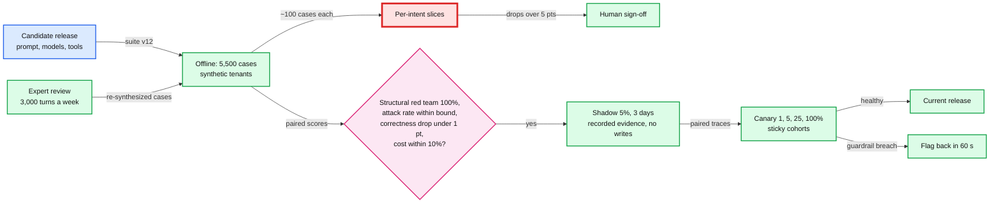

# Deep dive: offline evals and rollout

> One-line answer: a prompt, model, tool or router change is a deploy, so it ships only as an immutable release that passes a ~5,500-case suite on synthetic tenants where code knows every right answer (paired against the current release, sized so a 1-point correctness drop is caught ~80% of the time), a red team split into deterministic structural tests that must pass 100% and model-level attacks reported as a rate, and a judge used only for prose after it agrees with experts as often as experts agree with each other; then a shadow that replays recorded evidence and a cohort canary that catches latency, cost and big breaks but cannot see a 1-point correctness drop; the red team is split because "0 failures in 400 model-level cases" bounds an attack's success rate at ~0.75%, not zero, so the authorization promise rests on tests of the code, and every expert-review finding is re-created on a synthetic tenant, never copied, so customer data never enters the suite.

Zoom-in on [`../solution.md`](../solution.md) §4.4 (the flow), §5.5 (the quality gate), §8 (team boundaries) and [`../diagrams.md`](../diagrams.md#d6-activity--decision-flow) D6c, D8d. Concepts: [`../../../concepts/rag-and-react.md`](../../../concepts/rag-and-react.md) §4 (evaluation and migration). Siblings: [`grounding-and-number-verification.md`](grounding-and-number-verification.md) (what "numeric correctness" checks), [`tool-authorization.md`](tool-authorization.md) (what the red team attacks).

Acronyms: LLM (large language model), CI (continuous integration), PII (personally identifiable information), SQL (structured query language), PR (pull request).

---

## 1. The pipeline



## 2. What is in the suite, and what each part proves

| Part (solution §5.5) | Cases | Ground truth | Proves | Gate |
|---|---|---|---|---|
| Templated questions, ~40 intents × ~100, on ~200 synthetic tenants | ~4,000 | An independent SQL oracle over the generated ledger | Right tool, right period, right number | Paired correctness drop under 1 point |
| Expert hard cases: cash vs accrual, refunds, multi-currency, closed periods, questions that need a clarifying question | ~500 | Expert answer plus expected tool calls | The cases templates do not generate | Same; per intent over 5 points needs sign-off |
| Structural red team: bad calls fired straight at the tool gateway and action service, the model bypassed | ~400 | Expected denial | The code holds: no cross-tenant or above-role read, no write in a tainted turn | 100%, deterministic |
| Behavioral red team: the model attacked through memos, payee names, pastes, attachments; several samples per case at production temperature | ~600 | How often the model even tries (a write call, an outside link, an instruction followed) | The model's susceptibility, as a rate | An attempt rate with a 95% bound; a rise blocks |

- **Deterministic checks first.** Numeric correctness (every key number exact after display rounding, plus the claim check's metric, period and entity labels from the grounding deep dive), tool-call accuracy compared structurally, verifier first-pass and template rates, clarification and refusal correctness, latency and tokens.
- **Synthetic tenants** are generated companies whose every transaction is known: a plumber with 12 contractors and seasonal revenue, a retailer in two currencies. The oracle computes the answer with plain SQL, independent of the reports engine, so a reports bug and a model bug cannot hide each other.
- **What synthetic data misses:** real mess. Duplicate vendor names, a "Misc" account holding half the spend, memos in two languages. Shadow and expert review cover it, and each real-mess miss becomes a generator feature.
- **Keeping it honest.** New seeds every suite version, and a 20% hidden set used only at release time, so nobody tunes a prompt to the test.

## 3. The statistics: what the suite can and cannot see

Old and new releases answer the same cases, so the test is paired: only cases that flip matter. The runnable code in §10 simulates it (one-sided exact sign test, α = 0.05, 5% of cases flipping):

| Cases | 1-point drop | 2-point drop | 5-point drop |
|---|---|---|---|
| 200 (the "Good" rung's golden set) | 8% | 24% | 98% |
| 1,000 | 37% | 86% | 100% |
| 3,100 | 77% | 100% | 100% |
| 4,500 (the non-red-team suite) | 90% | 100% | 100% |
| 100 (one intent) | 3-point drop: 17% | 5-point drop: 57% | |

- **The solution's sizing holds.** The normal-approximation formula gives ~3,090 cases for 80% power at a 1-point drop (one-sided); the exact test in the simulation reaches 77% at 3,100 and 90% at 4,500.
- **One intent is nearly blind.** With ~100 cases, a 5-point drop in one intent is caught about half the time. That is the red node: a release can pass every gate while one intent quietly gets worse. Mitigations: flag per-intent drops for a human instead of auto-blocking (solution §5.5), weight the generator toward high-traffic and high-risk intents (a "net profit" question deserves 300 cases, a "which month was best" 50), and watch per-intent canary metrics.
- **Non-determinism.** Temperature 0 is not fully deterministic across provider deployments. Flaky correctness cases run 3 times and count by majority (solution §5.5).

## 4. Why the red team is split

- **Zero failures is a bound, not a proof.** The first version gated a model-level red team at "100%". But 0 failures in 400 cases bounds the per-attempt success rate at ~0.75% with 95% confidence (rule of three: 3/400); at 600 cases, ~0.5%.
- **A flaky attack hides.** An injection that works on 1% of samples is caught by its own case 1% of the time per run, 5% with 5 runs. So model-level cases run at production temperature, several samples each, and report an attempt rate.
- **So the design splits the red team in two** (solution §5.5).
  - **Structural tests (the promise).** Bypass the model and fire the bad call straight at the tool gateway and the action service: a `company_id` field, another realm's invoice id, a forged session context, an invoices-only user's payroll call, a `propose_*` call in a tainted turn, a confirm with a stale record version. Deterministic, and they must pass 100% on every release, because the authorization guarantee depends only on this code.
  - **Behavioral tests (the rate).** The model is attacked through memos, names and pastes; the metric is how often it even tries (calls a write tool, writes an outside link). A rise is a regression worth blocking on, but it is not what keeps data safe.
- **Who writes them.** Security engineers write seeds; a generator multiplies them across tenants, phrasings and fields (solution §5.5).

## 5. The judge, and how far to trust it

- **Scope.** The LLM judge scores clarity, helpfulness and tone on a 1 to 5 rubric. It never decides whether a number is right: that is the oracle and the verifier.
- **Calibration.** ~300 answers are labelled by two experts each. Zheng et al. 2023 (arXiv 2306.05685) found strong judges reach "over 80% agreement" with humans, about the level humans reach with each other. The rule: trust the judge only if its agreement with the experts is at least the experts' agreement with each other. In the simulation below, experts agree 84% (Cohen's kappa 0.63) and a weaker judge 78% (kappa 0.50): that judge fails calibration.
- **Bias.** The same paper documents position bias, so pairwise comparisons run in both orders. A new judge model is re-calibrated before use.

## 6. Shadow without extra reads

- **Why not re-execute.** The first version mirrored 5% of live questions to `r_42` and let the candidate call domain APIs as the user, for a question the user asked only once: extra load, extra token exchanges, and audit events for reads nobody made.
- **Evidence replay first** (solution §4.4, §5.5). The shadow receives the live turn's recorded tool results. When the candidate makes the same tool calls (most turns), it runs on identical evidence, which also makes the comparison truly paired. Only when it calls something different does it read live, under a separate shadow quota, marked `shadow` in the audit log. Write tools are always off and answers are always hidden (solution §4.4).
- **Shadow traces are customer data:** same redaction and access rules as production traces, and TurboTax data reaches a candidate only within the consent the live turn had.

## 7. The canary: what it can see

- **Stages:** 1%, 5%, 25%, 100% of users, sticky per user, each at least 24 h and 50k questions [estimate] (solution §5.5). Any guardrail breach flips the flag back in 60 s.
- **Sensitive metrics are the frequent ones.** With 50k questions per arm, a template rate around 3% [estimate] moves visibly at ~0.3 points (2.5 standard errors). Thumbs are rare: if 2% of turns get a vote and 30% are down [estimate], each arm has ~1,000 votes and only a ~5-point shift in the down share is visible.
- **So the canary catches** latency, cost, crashes, verifier blocks, template rate, tool errors, rephrase-within-60-s and action cancels. **It does not catch** a 1-point correctness drop. That is decided offline, where the right answer is known (the solution's push-back on "watch the thumbs").

## 8. Eval data without customer data

- **The suite is synthetic.** No customer data is in it (solution §5.5), which keeps 7216 and PII out of fixtures that run through third-party models and CI logs.
- **The feedback loop is the leak path, so it re-synthesizes.** Experts review ~3,000 consented, redacted turns a week and their findings become new cases. Copied verbatim, a finding would carry a real customer's names and memo text into a global suite. So every red-team and expert-review finding is re-created: the failure pattern (intent, phrasing, data shape) is reproduced on a synthetic tenant, and a PII scanner gates every suite version (solution §5.5).
- **Model drift.** Releases pin dated model snapshots. **Decision past the solution:** a nightly sentinel of ~500 cases [estimate] on the current release and its fallback catches a provider-side change; a drop over 2 points is a ticket, any red-team failure pages.

## 9. What an interviewer pushes on

1. **"Why 5,500 cases?"** ~3,100 paired cases catch a 1-point drop ~80% of the time; 4,500 non-red-team cases give ~90%. 200 cases see a 1-point drop 8% of the time.
2. **"Who labels?"** Code labels templated cases through the oracle; experts write hard cases and calibrate the judge; security writes red-team seeds.
3. **"Your red team passed 100%. Are you safe?"** The structural tests prove the code holds on every release. The behavioral result is a rate: 0 attempts in 600 cases bounds it at ~0.5% per attempt; it is a regression signal, not the guarantee.
4. **"Offline passed, canary complaints rose."** Slice by intent, compare with the control cohort, pull that intent's turns into expert review, and ship only after the suite reproduces the regression.
5. **"Why not just A/B test on thumbs?"** Too rare and too late: ~1,000 votes per arm see only ~5-point shifts.
6. **"What does an eval run cost?"** ~$140 per release, ~$280 with the fallback model [estimate], ~9 minutes at 64-way parallelism (solution §10.3). Cheap next to one bad release.

## 10. Runnable statistics

Standard library only, seeded. Power of the paired gate, the zero-failure bound, flaky attacks, and judge calibration.

```python
import math, random
random.seed(42)

def tail(b, m):                       # one-sided exact sign test: P(X >= b), X ~ Binomial(m, 0.5)
    return sum(math.comb(m, k) for k in range(b, m + 1)) / 2 ** m if m else 1.0

def power(n, drop, flip=0.05, alpha=0.05, sims=1500):
    """Paired eval: old and new release answer the same n cases. `flip` of cases change outcome.
    Regressions (old right, new wrong) happen at (flip + drop) / 2, fixes at (flip - drop) / 2."""
    pb, pc, hits = (flip + drop) / 2, (flip - drop) / 2, 0
    for _ in range(sims):
        b = c = 0
        for _ in range(n):
            u = random.random()
            if u < pb: b += 1
            elif u < pb + pc: c += 1
        hits += tail(b, b + c) <= alpha
    return hits / sims

print("power to block a release, paired sign test, one-sided alpha 0.05, 5% of cases flip")
print(f"{'cases':>6} {'1 pt drop':>10} {'2 pt drop':>10} {'5 pt drop':>10}")
for n in (200, 1000, 3100, 4500):
    print(f"{n:>6} " + " ".join(f"{power(n, d):>10.0%}" for d in (0.01, 0.02, 0.05)))
print(f"{'100':>6} (one intent)" + "".join(f"  {d:.0%} drop: {power(100, d):.0%}" for d in (0.03, 0.05)))

print("\nzero failures in n red-team cases: 95% upper bound on the per-attempt success rate")
for n in (400, 600, 3000):
    print(f"  n = {n:>4}: {1 - 0.05 ** (1 / n):.2%}  (rule of three: {3 / n:.2%})")

print("\nan injection that works on p of samples: chance a suite run catches it")
for p in (0.01, 0.05):
    print(f"  p = {p:.0%}: " + ", ".join(f"{k} run(s) {1 - (1 - p) ** k:.0%}" for k in (1, 5, 20)))

# Judge calibration: agreement with experts, compared with expert-expert agreement (Zheng et al. 2023)
def kappa(a, b):
    po = sum(x == y for x, y in zip(a, b)) / len(a)
    pe = sum((a.count(l) / len(a)) * (b.count(l) / len(b)) for l in set(a) | set(b))
    return po, (po - pe) / (1 - pe)
truth = [random.random() < 0.7 for _ in range(300)]          # 300 answers, 70% truly "good"
noisy = lambda acc: [t if random.random() < acc else not t for t in truth]
e1, e2, judge = noisy(0.92), noisy(0.92), noisy(0.85)
for name, (x, y) in {"expert vs expert": (e1, e2), "judge vs expert 1": (judge, e1)}.items():
    po, k = kappa(x, y)
    print(f"{name:18} agreement {po:.0%}, Cohen's kappa {k:.2f}")
```

Output (Python 3.14):

```text
power to block a release, paired sign test, one-sided alpha 0.05, 5% of cases flip
 cases  1 pt drop  2 pt drop  5 pt drop
   200         8%        24%        98%
  1000        37%        86%       100%
  3100        77%       100%       100%
  4500        90%       100%       100%
   100 (one intent)  3% drop: 17%  5% drop: 57%

zero failures in n red-team cases: 95% upper bound on the per-attempt success rate
  n =  400: 0.75%  (rule of three: 0.75%)
  n =  600: 0.50%  (rule of three: 0.50%)
  n = 3000: 0.10%  (rule of three: 0.10%)

an injection that works on p of samples: chance a suite run catches it
  p = 1%: 1 run(s) 1%, 5 run(s) 5%, 20 run(s) 18%
  p = 5%: 1 run(s) 5%, 5 run(s) 23%, 20 run(s) 64%
expert vs expert   agreement 84%, Cohen's kappa 0.63
judge vs expert 1  agreement 78%, Cohen's kappa 0.50
```

## 11. Trade-offs

| Decision | Option A | Option B | Chose | Why |
|---|---|---|---|---|
| Ground truth | Hand-labelled real questions | Synthetic tenants plus an SQL oracle | Synthetic | Exact answers, no customer data, regenerated every version |
| Suite size | ~200 golden cases | ~5,500, sized by power | 5,500 | 200 cases see a 1-point drop 8% of the time |
| Per-intent drops | Auto-block | Flag for a human | Flag | ~100 cases per intent cannot separate noise from a 3-point drop |
| Red team | Model-level only | Structural (gateway) plus behavioral (model) | Both | The guarantee is code, so test the code deterministically |
| Shadow | Live re-execution | Evidence replay, live only on divergence | Replay | No extra load, truly paired, no phantom reads |
| Feedback into the suite | Copy failing turns | Re-synthesize on synthetic tenants | Re-synthesize | Customer text never enters a global fixture |

## 12. Numbers to say out loud

- ~3,100 paired cases for 80% power at a 1-point drop; 4,500 give ~90%; one intent's ~100 cases catch a 5-point drop ~57% of the time.
- Structural red team ~400 cases, deterministic, 100%. Behavioral ~600 cases: 0 attempts bounds the rate at ~0.5%, not 0 (0 in 400 at ~0.75%).
- Judge trusted only if judge-expert agreement is at least expert-expert agreement (Zheng et al.: strong judges over 80%).
- Canary: 50k questions per stage see a ~0.3-point template-rate change but only a ~5-point thumbs shift.
- Rollback is a flag flip in 60 s; every turn names its `release_id`.
