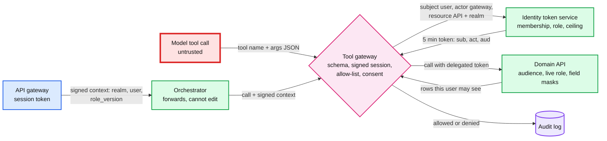

# Deep dive: tool authorization

> One-line answer: the assistant acts as the user, never as itself: the tenant comes from a session context the API gateway signs (no tool has a tenant field, so the model has nothing to choose), the tool gateway exchanges the user's token for a 5-minute on-behalf-of token whose audience is one API with the realm in its path (RFC 8693 plus RFC 8707), and the domain API checks that audience and the user's live role and field rules exactly as for the product's own screens, so a leak needs two independent walls to fail; the subtle risks were never in the token path but in the caches and replays around it, so the design keys every one of them by user as well as tenant (tool results by user, role version, resolved period and ledger sequence; turn replay by owner; the provider prompt cache behind a realm-unique segment), and §5 audits each layer.

Zoom-in on [`../solution.md`](../solution.md) §4.3 (the flow), §5.2 (what a red team finds), §10.1 (token exchange internals) and §10.10 (security). Concepts: [`../../../concepts/oauth.md`](../../../concepts/oauth.md) §3 (how an API checks a token) and §7 (security rules), [`../../../concepts/caching-patterns.md`](../../../concepts/caching-patterns.md). The MCP (Model Context Protocol) gateway this would sit behind for outside agents is [`../../ai-gateway/solution.md`](../../ai-gateway/solution.md) §5.5. Siblings: [`prompt-injection-and-write-actions.md`](prompt-injection-and-write-actions.md), [`offline-evals-and-rollout.md`](offline-evals-and-rollout.md).

Acronyms: API (application programming interface), AI (artificial intelligence), OBO (on-behalf-of), STS (security token service, the identity token service), RFC (Request for Comments), JWT (JSON Web Token), URI (uniform resource identifier), HMAC (hash-based message authentication code), AR (accounts receivable), OWASP (Open Worldwide Application Security Project), PII (personally identifiable information).

---

## 1. Two walls, and who checks what



| Check | Where | Stops | Fails how |
|---|---|---|---|
| No tenant, company or user field; `additionalProperties: false` | Tool gateway | The model picking a tenant, honestly or by injection | `invalid_arguments`, audit `denied: schema` |
| Session context signature, and tenant equals the conversation's | Tool gateway | An orchestrator bug or compromise changing the realm | Reject and alert |
| Tool allowed for release, product and capability state | Tool gateway | Invoice tools in a TurboTax session; writes after untrusted text | `tool_unavailable` |
| Membership, role scope, assistant ceiling | STS | An invoices-only user reading payroll; the assistant asking for bank changes | No token, `403` |
| Audience equals this API with this realm in the path | Domain API | A token minted for realm A replayed at realm B | `401` |
| Live role and field rules | Domain API | Permission changes since the token was minted; masked fields | `403`, or masked values |

**Why two walls.** The gateway's binding is one piece of code. If it has a bug, the token's audience still names the session's realm, and the domain API rejects a call for any other (the runnable code below shows exactly that: `401 wrong audience`). Both must fail for a cross-tenant read. The role wall works the same way: the gateway never decides what a role may see; the API that owns the data does, with the rules it already applies to the product's screens.

## 2. The session-bound tenant

- **The API gateway signs the context** (realm or filer account, user, role version, product, session id, expiry) with a key the orchestrator never holds. The orchestrator forwards it; the tool gateway verifies it on every call. A compromised orchestrator can call tools only for sessions it currently holds (solution §10.10).
- **A conversation is pinned to (tenant, user), and so is every turn.** Switching company opens a new conversation, and a request whose session tenant differs from the conversation's is rejected (solution §5.2). Turns are keyed `(tenant_id, user_id, turn_id)` and the owner is checked on every read and replay (solution §3.3), because a tenant check alone was not enough: an invoices-only coworker who learned a payroll turn's id (a screenshot, a support ticket) could have replayed it. A mismatch is a 404 and an audit event.
- **Ids resolve inside the token's realm.** "See invoice 99812" in a memo becomes a call carrying the session's realm; 99812 belongs to another realm and is a 404 here, the same answer as a typo, so a probe learns nothing.

## 3. The token exchange

The tool gateway posts to the STS (RFC 8693):

```text
grant_type     = urn:ietf:params:oauth:grant-type:token-exchange
subject_token  = <the user's access token>
actor_token    = <the tool gateway's workload identity>
resource       = https://invoices.api.intuit/v3/company/9130354
scope          = invoices.read
```

- **The STS holds the policy**: is `u_17` a member of realm 9130354, does the role include `invoices.read`, may this actor act for users, and is the scope inside the assistant's ceiling. Only then does it mint a JWT: `sub = u_17`, `act.sub = assist-tool-gateway`, `aud` = that resource URI, `scope`, `exp` in 5 minutes.
- **RFC 8707 §3** tells a multi-tenant server to put the tenant in the resource URI, so a token for one tenant cannot be replayed at another. That is the second wall's whole mechanism.
- **The `act` claim** lets the API and the audit trail tell "the assistant did this for u_17" from "u_17 clicked". "Did the assistant send that invoice?" has an answer.
- **Caching.** Tokens are cached 60 s per (session, resource, scope): ~600 exchanges/s at peak instead of ~900, a one-third cut. When the STS is down, cached tokens serve for up to 60 s, then tools fail closed; never a service-credential fallback (solution §5.6). **Decision past the solution:** serving cached tokens until their own 5-minute expiry during an outage would also be safe, because the 60 s is not the revocation boundary (the API re-checks roles live).

## 4. The scope ceiling

| Class | Allowed for the assistant | Never |
|---|---|---|
| Reads | Reports, transactions, invoices, customers; tax summary only with 7216 consent | Payroll changes, user lists and permissions |
| Proposals | Invoices, reminders, categorization (executed only by the action service after the user's confirm) | Money movement, bank account or payee changes, user management |
| Future tools | Through a security review that widens the ceiling at the STS | Through a prompt change |

This is OWASP's "excessive functionality" and "excessive permissions" removed at the identity layer: even a perfectly injected model, holding a perfectly valid token, cannot ask for a scope the STS will not mint. Recording a payment sits outside this ceiling: no catalog tool records one (solution §3.2) and the write scopes exclude it, so offering it means a new `propose_payment_record` tool, a new scope and step-up on every confirm, through that same security review.

## 5. Every cache layer, audited for tenant isolation

A cache keyed without the tenant, or without the user where roles differ, is a data leak. Every cache the design touches, with the reason for its key:

| Layer | Key in the design | What a weaker key leaked | Why this key |
|---|---|---|---|
| Tool-result cache, 60 s | `(realm, user, role_version, tool, resolved args, ledger_seq)`, cleared on every confirm | Keyed by realm: a coworker gets another role's payroll. Keyed by the period enum: `last_quarter` asked at 00:00:10 on Oct 1 serves Q2. Keyed without `ledger_seq`: an invoice created 20 s ago is missing (demo below) | Per user and role; resolved bounds; the ledger change sequence keeps read-your-writes (solution §10.6). An API with no change sequence is cached within one turn only |
| Delegated token cache, 60 s | `(session, resource, scope)` | Without session or realm: a token for one user or realm used for another | The resource URI carries the realm |
| Consent | `(taxpayer_id, use)`, read through, uncached, for tax tools; re-checked at context assembly | Keyed by login: one login reaches several returns (a spouse, a client). Cached 60 s: up to a minute of use after revocation. Checked only at the tool: replayed context was a use with no check | Tax tools are a small share of ~900 calls/s, so no cache is needed (injection deep dive §4) |
| Provider prompt cache, 5 min | Byte-identical prefix; isolated per organization on Bedrock and Google Cloud, per workspace on the Claude API (Anthropic docs) | Nothing is returned across tenants, but a hit is visible as speed (Gu et al. 2025, arXiv 2502.07776, found cross-user sharing at seven API providers) | The realm segment starts with the realm id, so no prefix after the shared static block matches across realms (solution §5.7) |
| Answers | Never cached (solution §5.7) | A semantic answer cache would serve one realm's numbers to another | The AI gateway's optional response cache stays off for this tenant |
| Conversation store | Partition `tenant_id`; turns by `(tenant_id, user_id, turn_id)` | Turn replay keyed without the user | Owner checked on read and replay (§2) |
| Release config, 60 s | `release_id` | None: global, holds no customer data | No tenant data |
| Local intent matcher (quick answers) | Model weights, no per-request cache | Trained on real questions: customer text inside a model artifact | **Decision past the solution:** train on synthetic and templated questions only; never cache a plan with entity ids across users |
| Eval suites and trace lake | Suites global; traces by `turn_id` | Findings copied verbatim into a global suite | Every finding is re-created on a synthetic tenant and each suite version is PII-scanned (solution §5.5) |

## 6. Outside agents over MCP

If customers' own agents call these tools, the MCP server is one more client of the same tool gateway, not a second path to the data. The MCP authorization spec (2025-11-25 and 2026-07-28) already requires what this design does: the server validates that a token was issued for it, clients send RFC 8707 resource indicators, and servers "MUST NOT accept or transit any other tokens" (solution §5.2, §10.8). The outside agent gets the same ceiling and the same propose-and-confirm writes.

## 7. Detecting probing and binding bugs

- **Probing:** more than 20 denied calls by one user in 10 minutes raises an alert (solution §5.2). Every denial is an audit event with `act`.
- **Binding bugs:** the page "a domain API denied a call the gateway allowed" is the canary for a broken first wall. It fires only on audience or tenant denials (`401`), not on role denials (`403`), which spike legitimately after every permission change because the token was minted up to 60 s earlier and the API checks roles live (solution §8).
- **Rollback forensics:** if a permissions regression ever ships, the audit lake lists every call allowed under that `release_id` (solution §10.9).

## 8. What an interviewer pushes on

1. **"The model emits `company_id='OTHER'`."** There is no such field; schema validation rejects it before any I/O. Nothing to argue with.
2. **"An injection asks for invoice 99812 politely."** The call carries the session's realm and a token whose audience is this realm's invoices URI. 99812 is a 404 here.
3. **"Your binding code has a bug."** The audience check is independent: a token minted for the session's realm is rejected anywhere else. Both walls must fail.
4. **"An invoices-only user asks about payroll."** The STS will not mint `payroll.read` for that role. With a service account the assistant would have answered: that is the privilege escalation OBO tokens remove.
5. **"Why not just put the rule in the system prompt?"** A prompt is a request, and the same context holds text written by strangers. The prompt may say it for helpfulness; code enforces it.
6. **"What does this cost?"** One exchange per (session, API, scope) per minute, ~5 ms [estimate], and every domain team must accept delegated tokens with an `act` claim: an organizational migration, done one API at a time behind a flag (solution §8).

## 9. Trade-offs

| Decision | Option A | Option B | Chose | Why |
|---|---|---|---|---|
| Credential | Service account | OBO token per API and realm | OBO | Inherits every role and field rule; two walls |
| Tenant source | Tool argument | Signed session context | Session | The model has nothing to choose |
| Where role rules live | Re-implemented in the gateway | The domain API, as for the product | Domain API | One source of truth; future permission changes apply with no assistant code |
| Token cache | None (~900 exchanges/s) | 60 s per session, resource, scope | 60 s | ~600/s; revocation still live at the API |
| Result cache | Per realm | Per user, role version, resolved period, ledger sequence | Per user, full key | A per-realm key leaks across roles; an enum key leaks across periods |
| Cross-turn result cache | Keep for hit rate | Within-turn only, unless the API gives a change sequence | Conditional | Cross-turn hits are rare; stale answers after a write are not |

## 10. Runnable gateway

Standard library only. The session context is signed with HMAC; the STS, the domain API's audience check and the result cache are a few lines each. Each line is one attack and what the design returns.

```python
import hmac, hashlib, json, datetime as dt
KEY = b"api-gateway-signing-key"                       # held by the API gateway, never the orchestrator
def sign(ctx): b = json.dumps(ctx, sort_keys=True); return b, hmac.new(KEY, b.encode(), hashlib.sha256).hexdigest()
def verified(b, sig): return hmac.compare_digest(sig, hmac.new(KEY, b.encode(), hashlib.sha256).hexdigest())
SCHEMA = {"list_invoices": {"customer", "status"}, "run_report": {"report", "period"}}   # no tenant field
SCOPE = {"list_invoices": ("invoices", "invoices.read"), "run_report": ("reports", "reports.read")}
MEMBER = {("u_17", "9130354"): {"invoices.read", "reports.read", "payroll.read"},       # Standard role
          ("u_22", "9130354"): {"invoices.read"}}                                       # invoices only
CEILING = {"invoices.read", "reports.read", "payroll.read", "invoices.propose"}         # never bank, users
BOOKS = {"9130354": {"invoices": [1043, 1051], "payroll": 212000},
         "4410923": {"invoices": [99812], "payroll": 990000}}

def sts(sub, realm, api, scope):                      # identity token service: policy lives here
    if scope not in MEMBER.get((sub, realm), set()) or scope not in CEILING: return None
    return {"sub": sub, "act": "assist-tool-gateway", "aud": f"https://{api}.intuit/company/{realm}", "scope": scope}
def domain_api(api, realm, token, what):              # the second wall: audience and scope, per call
    if token["aud"] not in ("*", f"https://{api}.intuit/company/{realm}"): return "401 wrong audience"
    if what == "payroll" and "payroll" not in token["scope"]: return "403 scope"
    return BOOKS[realm][what]

SERVICE_ACCOUNT = {"sub": "assist-svc", "aud": "*", "scope": "*.read payroll"}   # the Bad rung
def gateway(tool, args, session, realm_bug=None, cache=None, key_fn=None, svc=False):
    if not set(args) <= SCHEMA[tool]: return f"invalid_arguments {sorted(set(args) - SCHEMA[tool])}"
    if not verified(*session): return "reject: session signature"
    ctx = json.loads(session[0]); realm = realm_bug or ctx["realm"]      # the tenant comes from the session
    what = "payroll" if args.get("report") == "payroll" else "invoices"
    api, scope = ("payroll", "payroll.read") if what == "payroll" else SCOPE[tool]
    k = key_fn(ctx, tool, args) if key_fn else None
    if cache is not None and k in cache: return f"cache hit: {cache[k]}"
    tok = SERVICE_ACCOUNT if svc else sts(ctx["user"], ctx["realm"], api, scope)
    out = domain_api(api, realm, tok, what) if tok else "403 token service: scope not granted to this user"
    if cache is not None and isinstance(out, (int, list)): cache[k] = out
    return out

a17 = sign({"realm": "9130354", "user": "u_17", "role_version": 4})
a22 = sign({"realm": "9130354", "user": "u_22", "role_version": 9})
forged = (a17[0].replace("9130354", "4410923"), a17[1])
cases = [("model adds company_id", lambda: gateway("list_invoices", {"customer": "Acme", "company_id": "4410923"}, a17)),
         ("orchestrator edits the session realm", lambda: gateway("list_invoices", {}, forged)),
         ("tenant-binding bug picks 4410923", lambda: gateway("list_invoices", {}, a17, realm_bug="4410923")),
         ("invoices-only user, service account", lambda: gateway("run_report", {"report": "payroll"}, a22, svc=True)),
         ("invoices-only user, on-behalf-of token", lambda: gateway("run_report", {"report": "payroll"}, a22))]
for name, f in cases: print(f"{name:40} -> {f()}")

naive, safe = {}, {}
naive_key = lambda c, t, a: (c["realm"], t, json.dumps(a, sort_keys=True))
safe_key = lambda c, t, a: (c["realm"], c["user"], c["role_version"], t, json.dumps(a, sort_keys=True))
q = {"report": "payroll"}
gateway("run_report", q, a17, cache=naive, key_fn=naive_key); gateway("run_report", q, a17, cache=safe, key_fn=safe_key)
print(f"{'cache keyed (realm, tool, args)':40} -> u_22 gets {gateway('run_report', q, a22, cache=naive, key_fn=naive_key)}")
print(f"{'cache keyed with user + role_version':40} -> u_22 gets {gateway('run_report', q, a22, cache=safe, key_fn=safe_key)}")
ledger = {"9130354": 41}                                 # the realm's ledger change sequence
seq_key = lambda c, t, a: safe_key(c, t, a) + (ledger[c["realm"]],)
gateway("list_invoices", {}, a17, cache=safe, key_fn=safe_key); gateway("list_invoices", {}, a17, cache=safe, key_fn=seq_key)
BOOKS["9130354"]["invoices"] = BOOKS["9130354"]["invoices"] + [1088]; ledger["9130354"] += 1   # created 20 s later
print(f"{'new invoice, key without ledger_seq':40} -> {gateway('list_invoices', {}, a17, cache=safe, key_fn=safe_key)}")
print(f"{'new invoice, key with ledger_seq':40} -> {gateway('list_invoices', {}, a17, cache=safe, key_fn=seq_key)}")

def resolve(enum, now):                              # the period resolver, in the realm's time zone
    qtr = (now.month - 1) // 3                        # 0-based current quarter
    y, qn = (now.year, qtr) if qtr else (now.year - 1, 4)
    return f"Q{qn} {y}"
cache = {}
t1, t2 = dt.datetime(2026, 9, 30, 23, 59, 30), dt.datetime(2026, 10, 1, 0, 0, 10)
cache[("u_17", "last_quarter")] = f"spend for {resolve('last_quarter', t1)}"
print(f"{'key by enum, asked at 00:00:10 Oct 1':40} -> {cache[('u_17', 'last_quarter')]}, labelled 'last quarter'")
print(f"{'key by resolved bounds':40} -> miss, recompute for {resolve('last_quarter', t2)}")
```

Output (Python 3.14):

```text
model adds company_id                    -> invalid_arguments ['company_id']
orchestrator edits the session realm     -> reject: session signature
tenant-binding bug picks 4410923         -> 401 wrong audience
invoices-only user, service account      -> 212000
invoices-only user, on-behalf-of token   -> 403 token service: scope not granted to this user
cache keyed (realm, tool, args)          -> u_22 gets cache hit: 212000
cache keyed with user + role_version     -> u_22 gets 403 token service: scope not granted to this user
new invoice, key without ledger_seq      -> cache hit: [1043, 1051]
new invoice, key with ledger_seq         -> [1043, 1051, 1088]
key by enum, asked at 00:00:10 Oct 1     -> spend for Q2 2026, labelled 'last quarter'
key by resolved bounds                   -> miss, recompute for Q3 2026
```

## 11. Numbers to say out loud

- Delegated token 5 minutes, cached 60 s per (session, resource, scope): ~600 exchanges/s at peak instead of ~900.
- Two walls: the gateway's binding and the API's audience check (realm in the resource URI, RFC 8707 §3). Both must fail for a leak.
- Red-team authorization suite ~400 cases, gate 100%. Probing alert: 20 denials in 10 minutes.
- Result cache 60 s keyed `(realm, user, role_version, tool, resolved period, ledger sequence, args)`. Answers never cached.
