# Diagrams: GenAI assistant over a customer's financial data

> One-line answer: twelve views of one design. An orchestrator runs a bounded loop of model calls (router, plan, compose) through the AI gateway; a tool gateway binds the tenant from the session, exchanges the user's token for an on-behalf-of token per API and realm, and returns typed aggregates as citable evidence; the model writes claim slots and a deterministic claim check renders every value and checks the words around it before a sentence reaches the user; writes are proposals the user confirms; an eval and release platform gates every change. The model call is the one red box.

The D1 to D12 set from `hld/CLAUDE.md` §4, each with a one-line caption. A diagram already in [`solution.md`](solution.md) gets a pointer here, never a second copy. Acronyms: LLM (large language model), SSE (server-sent events), OBO (on-behalf-of), STS (security token service, the identity token service), JWT (JSON Web Token), PII (personally identifiable information), AZ (availability zone), QBO (QuickBooks Online), P&L (profit and loss), MCP (Model Context Protocol), CI (continuous integration), PR (pull request), TTL (time to live), KV (key-value), FR (functional requirement), DFD (data flow diagram), HTTPS (encrypted web requests).

| # | Diagram | Where it lives |
|---|---|---|
| D1 | Context | below |
| D2 | Data flow | below (D2a system, D2b inside the orchestrator) |
| D3 | Component architecture (final design) | [solution §6](solution.md#6-final-design-and-the-six-core-flows) |
| D4 | Happy path per FR | FR1: [solution §4.1](solution.md#41-answer-a-question-the-model-picks-tools-tools-compute-the-answer-cites-them) and §6 Flow 1; a two-round question with the calculator below. FR2: [solution §4.2](solution.md#42-act-on-request-the-model-proposes-the-user-confirms-our-code-executes-once); drafting an invoice with step-up below. FR3: [solution §4.3](solution.md#43-stay-inside-the-users-permissions-the-tool-gateway-and-on-behalf-of-tokens). FR4: [solution §4.4](solution.md#44-evaluate-before-rollout-the-eval-suite-is-the-test-suite) |
| D5 | Failure paths | Write timeout, dropped stream and crashed orchestrator, token service down: below. Number mismatch and injection: solution §6 Flows 2 and 4. Provider outage: [solution §10.4](solution.md#104-failure-timeline) |
| D6 | Decision flows | Loop control, tool gateway, verifier: solution §5.1, §5.2, §5.3. Release gate and model fallback chain: below |
| D7 | Entity relationship | [solution §3.3](solution.md#33-data-model) |
| D8 | State machines | Proposed action: solution §4.2. Capability state of a turn: solution §5.4. Turn and release: below |
| D9 | Deployment / topology | below |
| D10 | Scaling / partitioning | below |
| D11 | Failure mode map | below, two trees |
| D12 | Rollout / migration | below |

## D1. Context (zoom-out)

The assistant as one box: users ask and confirm, Intuit identity vouches for them, domain APIs own the data, model providers are reached only through the AI gateway.

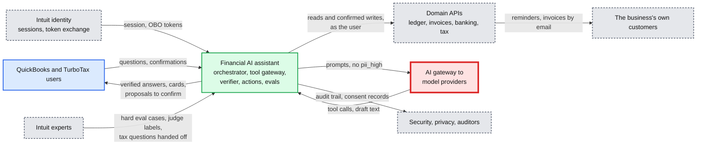

## D2. Data flow (DFD)

### D2a. The system

Inputs to outputs with format, size and rate. Peak rates from solution §2 (300 questions/s).

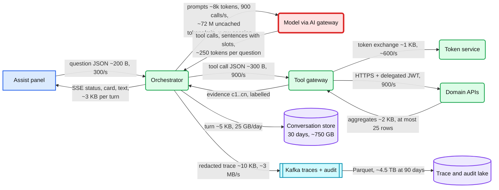

### D2b. Inside the orchestrator: two streams, one gate

The plan stream becomes `status` events and tool calls; the compose stream becomes `text` events, one checked sentence at a time, with values rendered by code.

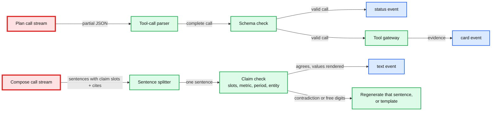

## D3. Component architecture

The final design is in [solution §6](solution.md#6-final-design-and-the-six-core-flows): 14 nodes, red on the model calls through the AI gateway.

## D4. Happy paths, one per FR

FR1 to FR4 each have their chosen-flow sequence in solution §4.1 to §4.4, and FR1's final version is solution §6 Flow 1. Two more variants worth rehearsing:

### D4 FR1. A two-round question that needs the calculator

"What was my average monthly revenue this year, and which month was best?" The average is not a field of any report, so the model calls `calculate`, and the answer can only refer to the average through that recorded derivation's slot.

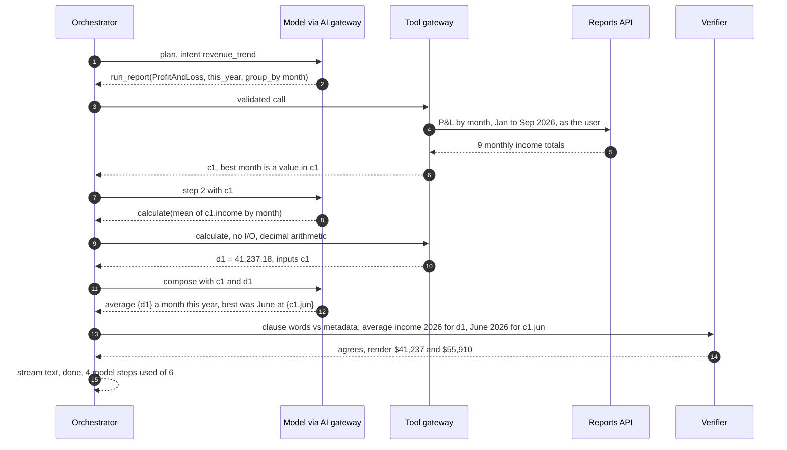

### D4 FR2. Draft a new invoice, with step-up above the threshold

"Invoice Acme for 10 hours of consulting at $150." The quantity and rate come from the user's own message, the total from the calculator, the customer id from a lookup that our code matches without handing names to the model, so the turn stays clean and can propose (solution §5.4).

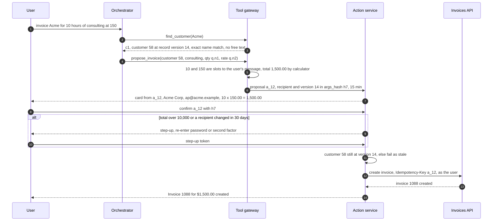

## D5. Failure paths

### D5a. The write times out, then the retry settles it

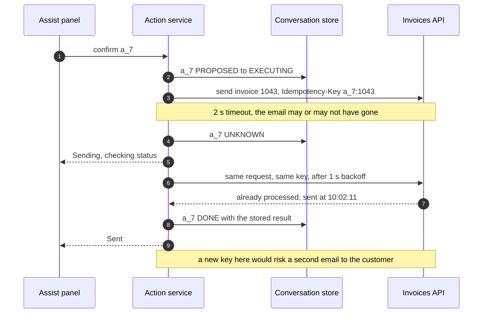

### D5b. The stream drops, or the orchestrator dies mid-turn

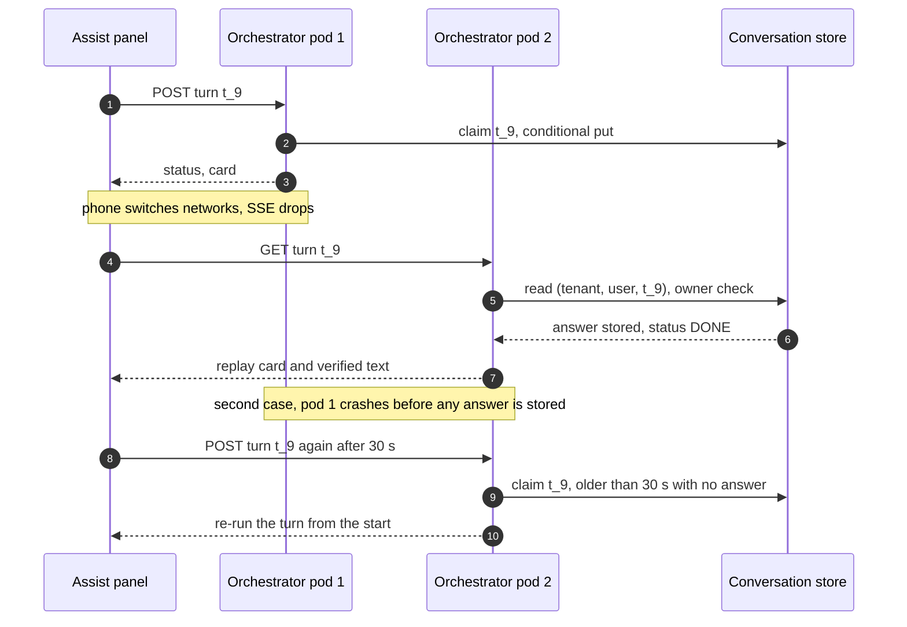

### D5c. The identity token service is down

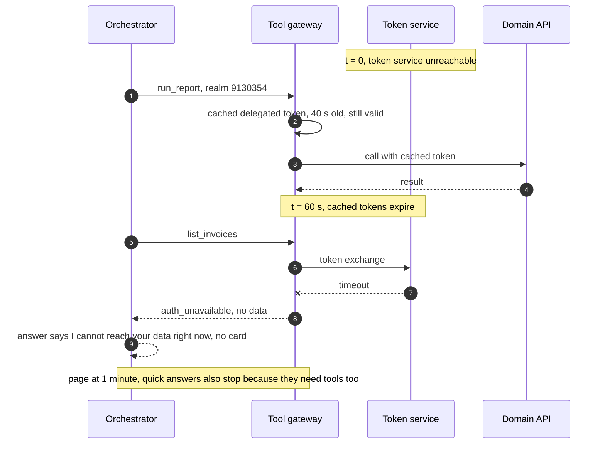

## D6. Activity / decision flow

The three decision flows inside the hardest components are in the solution: the loop's budget checks (§5.1), the tool gateway's checks (§5.2) and the verifier (§5.3). Two more:

### D6c. The release gate pipeline

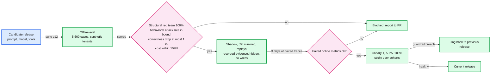

### D6d. Which model answers, or none

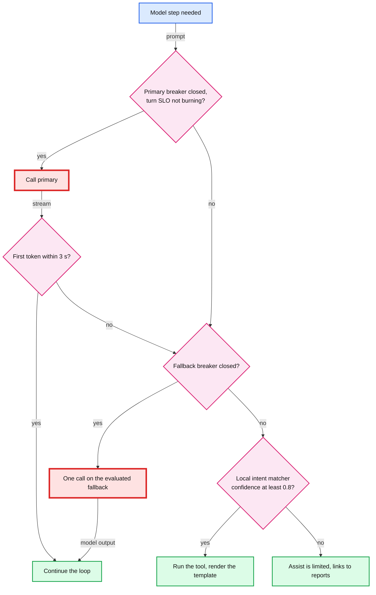

## D7. Entity relationship

In [solution §3.3](solution.md#33-data-model): conversations, turns, tool calls and derivations, proposed actions keyed by tenant; consent by user; releases and eval data global.

## D8. State machines

The proposed action (solution §4.2) and the capability state of a turn (solution §5.4) are in the solution. Two more:

### D8c. One turn

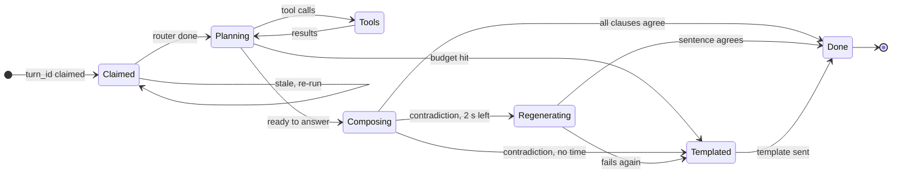

### D8d. One release

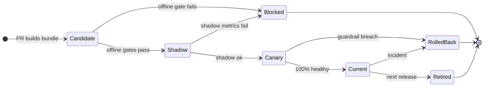

## D9. Deployment / topology

Two US regions, active-active for the stateless tiers. Providers are reached in-region; nothing with customer data leaves the US.

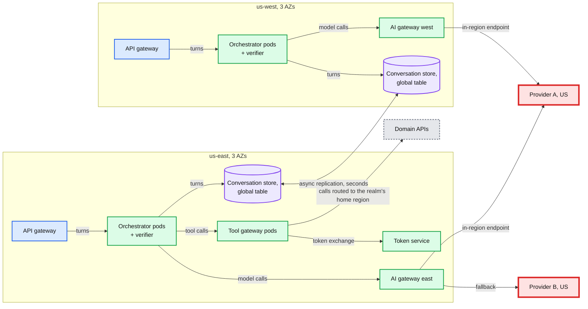

Replication factor: the conversation store keeps 3 copies per region plus the other region's copy. Orchestrator and tool gateway pods are spread over 3 AZs and sized to lose one. The tool gateway in the west region is not drawn; it is the same as the east one.

## D10. Scaling / partitioning

Our data partitions trivially by tenant. The hot spot is not a shard of ours: it is one provider deployment, made hot by how requests are routed to it.

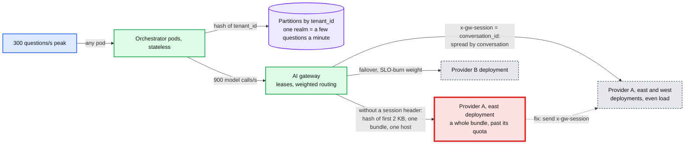

Why no hot tenant: the biggest accounting firm is many realms, each its own conversation partition, and per-user and per-realm budgets (200 and 2,000 questions a day [estimate]) cap a script. Why the session header: the shared prefix is per (release, tool bundle), so prefix-hash affinity sends every user of a bundle to one deployment, and bounded load spills it only at 1.5x average (AI gateway §5.4). With `x-gw-session = conversation_id`, a conversation's plan and compose calls and its next turn land together (the conversation cache hits) and load spreads by conversation. The price is re-writing each bundle's ~6k-token static block once per deployment every 5 minutes, ~$4 an hour (solution §5.7).

## D11. Failure mode map

### D11a. The model and the loop

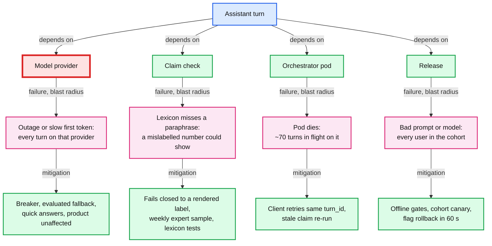

### D11b. Data, identity and writes

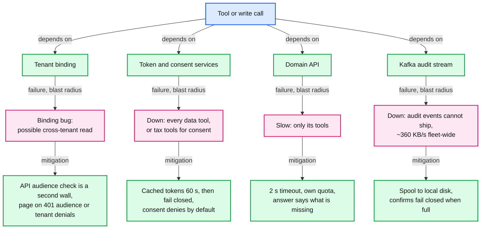

## D12. Rollout / migration

From a first-generation assistant (help-article retrieval plus a data plugin on a service account) to this design. Every phase is a flag, and each one names its rollback point.

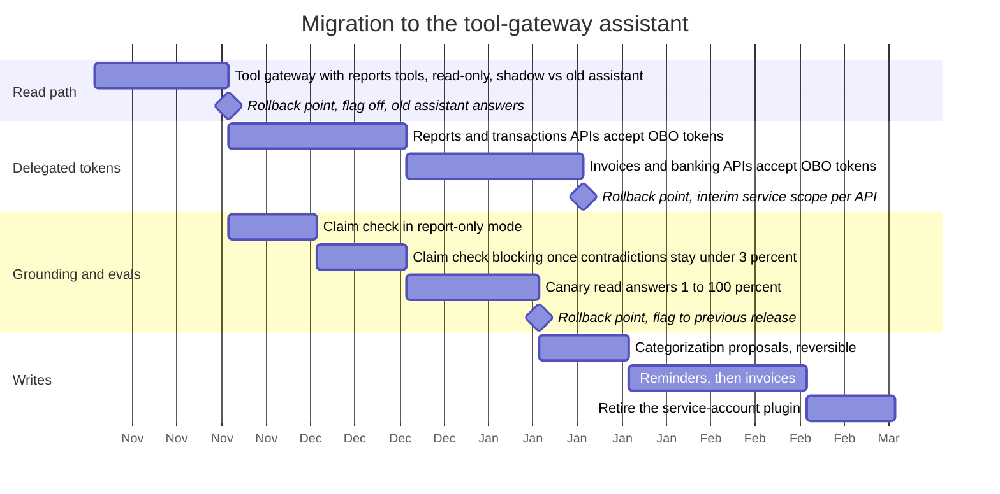

Rollback per phase: p1 is a flag (the old assistant still answers); p2 and p3 keep the interim path (session binding plus a narrow service scope) per API until its owner flips it; p4 to p6 are release flags; p7 and p8 turn proposal tools off per type; p9 happens only after 30 days with zero traffic on the old plugin.
