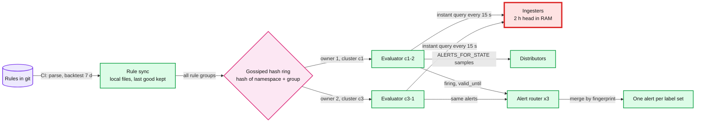
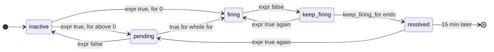

# Deep dive: alert evaluation and latency

> One-line answer: shard rule groups over evaluators with a gossiped hash ring, give every group **2 owners in different clusters** that both evaluate and let the router dedup, run every rule every **15 s** as an instant query against the ingesters' in-memory head only, persist `for` timers in `ALERTS_FOR_STATE` so a restart does not reset them, push host-local thresholds into the agent, and leave "the host is dead" to the liveness path because no rule can see missing data. End to end, emission to page, is **~40 s** without a stream processor.

Backs [`../solution.md`](../solution.md) §4.3 and §5.2. Related: [`../../../concepts/time-series-db.md`](../../../concepts/time-series-db.md) §6 (read path, staleness), [`../../../concepts/stream-processing.md`](../../../concepts/stream-processing.md) (why not Flink here), [`../../../concepts/sharding.md`](../../../concepts/sharding.md) (hash ring).

---

## 1. The problem in plain words

- Per region: 3,000 alerting rules and 300 recording rules, every 15 s. That is **220 evaluations/s**, ~100 ms each, ~22 cores. Twice, because every group has 2 owners: **~48 cores**.
- Three things must hold at once. Alerts fire within a minute of the data. An evaluator restart does not lose or restart a 10 minute `for`. No single evaluator is a single point of failure, and no lock service sits on the alert path.
- One thing a rule can never do: fire on data that did not arrive.

## 2. Rule groups on evaluators: sharding without a leader

- Evaluators register tokens on a ring gossiped over memberlist. A group's owners are the first 2 instances clockwise **in 2 different clusters**. Same idea as zone-aware replication for ingesters.
- Both owners evaluate and send. Duplicates cost a merge at the router. A leader per group would cost a lock service on the alert path and a stuck-leader failure mode. Duplicates are cheaper.
- Evaluators read **only the ingesters** (`query_ingesters_within` 13 h covers every rule window). Object storage is never on the alert path.
- A group evaluates its rules in order, so a recording rule can feed an alerting rule in the same group within one tick.

## 3. The alert state machine

- `pending` lasts the rule's `for`. It is the anti-flap filter for "true for one tick".
- `keep_firing_for` is the anti-flap filter the other way: a metric that dips below the threshold for one tick does not resolve and re-fire.
- A resolved instance is kept and resent for 15 min (`resolvedRetention` in `rules/alerting.go`), so a router that missed the first resolve still gets one.
- Each firing alert is sent with `valid_until = ts + 4 × max(interval, resend delay)` (`rules/alerting.go`). With 15 s and 1 min that is **4 min**. Firing alerts are resent every resend delay (1 min), so a live evaluator never lets one expire.

## 4. Surviving a restart: `for` restore

- Every evaluation writes a sample `ALERTS_FOR_STATE{alertname, labels...} = active_at` for each pending or firing alert. It goes through the distributors like any other series.
- On start, an evaluator reads the last `ALERTS_FOR_STATE` value for each alert (`RestoreForState` in `rules/group.go`). Prometheus defaults, kept: `--rules.alert.for-outage-tolerance` **1 h** and `--rules.alert.for-grace-period` **10 min**. The rules, exactly:
  - Outage longer than 1 h: nothing is restored, timers start again.
  - `for` shorter than 10 min: not restored. The alert waits its full `for` again. Short timers are cheap to redo.
  - `for` of 10 min or more, already past its `for` when the evaluator died: fires at the next evaluation if still true.
  - Less than 10 min left: fires exactly **10 min after the restart**. It never fires on restored state before one grace period of fresh data.
  - More left: `active_at` moves forward by the downtime, so the pending time already spent is kept.
- With 2 owners, one restarting changes nothing: the other keeps sending. Restore matters when both restart, which is why deploys roll one cluster at a time.

## 5. The latency budget

| Hop | Worst case | Why this number |
|---|---|---|
| Sample taken to pushed | 10 s | Agent pushes every 10 s |
| Distributor to ingester head | ~1 s | Synchronous, ack on 2 of 3 |
| Head to evaluation | 15 s | Eval interval, head only |
| Evaluation to router | < 1 s | New firing alerts are sent at once |
| Router `group_wait`, page severity | 10 s | Lets the rest of the same failure join |
| Router to PagerDuty to phone | ~5 s | |
| **Total** | **~40 s**, plus the rule's `for` | Under Hello Interview's 1 minute. Textbook defaults (scrape 1 min, eval 1 min, `group_wait` 30 s) give ~2.5 min |

## 6. What runs where

| Check | Where | Latency | Why there |
|---|---|---|---|
| Disk read-only, SMART pre-fail, ECC rate, NTP offset > 100 ms, hung task | **Agent**, exported as `health_check{check=...} 0/1` | one push, 10 s | The host already knows. 200k disk series per region never need a central threshold |
| Host 10x its rack's median on retransmits or errors | Central rule | 10 min `for` | Needs peers, so it cannot run on the host |
| Fleet and cluster aggregates for dashboards | Recording rules, every 1 min | n/a | 50k series become ~30 (see [`query-and-retention.md`](query-and-retention.md)) |
| SLO burn rate | Central rule on recorded SLIs | §8 below | Symptom, pages the owning team |
| Host dead or unreachable | **Liveness path**, not a rule | 30 s verdict | A dead host sends nothing (§7) |

The risk of edge checks: a bad check config ships to 500k agents at once and marks thousands of hosts UNHEALTHY. Three guards. Check configs roll out one cluster, then one region, then the fleet. The correlator treats the same check failing on more than 5% of a cluster within 10 min of a config change as a check bug. The remediation budget caps drains at 1% of a cluster ([`correlation-and-alert-storms.md`](correlation-and-alert-storms.md)).

## 7. Missing data

- `node_filesystem_avail_bytes < ...` on a dead host does not fire. The series goes stale and the rule has nothing to compare.
- Per job, one rule like `absent(up{job="storage"})` catches "the whole job stopped reporting". Per host, 50k `absent()` rules through one evaluator would recreate the single-observer problem. Hosts belong to the liveness path.
- When ingest lag is over 30 s, evaluators hold absence-based rules and fire `RegionMonitoringDegraded` instead, so a slow pipeline does not look like 50k dead hosts.

## 8. SLO burn-rate alerts

For a 30-day SLO, the SRE workbook's multiwindow, multi-burn-rate table ([Alerting on SLOs](https://sre.google/workbook/alerting-on-slos/)):

| Budget consumed | Long window | Short window | Burn rate | Action |
|---|---|---|---|---|
| 2% | 1 h | 5 min | 14.4x | Page |
| 5% | 6 h | 30 min | 6x | Page |
| 10% | 3 days | 6 h | 1x | Ticket |

Both windows must be over the rate. The long window makes it significant, the short window makes it reset quickly once fixed. This is how a symptom page stays both fast and quiet.

## 9. Getting a rule right before it pages: CI backtest

- On merge, CI parses the rule, estimates the series it selects from index stats, and runs the expression as a range query over the **last 7 days** at the eval step.
- It applies `for` and `keep_firing_for` offline and reports episodes: "would have fired 212 times, 38 h in total".
- A page-severity rule that would have fired more than 3 times in 7 days without a matching incident fails review. The page budget (2 incidents per 12 h shift) is enforced before the rule exists, not after the on-call burns out.

## 10. Failure cases

| Failure | What happens | Why it is fine or what catches it |
|---|---|---|
| One owner of a group dies | Other owner keeps evaluating and sending | 2 owners in 2 clusters |
| Both owners die | Alerts stop refreshing, expire after 4 min, router resolves them | Silence that looks like health. The canary catches it in ~2 min ([`meta-monitoring-and-region-loss.md`](meta-monitoring-and-region-loss.md)) |
| A group takes longer than 15 s | Next tick is skipped | `prometheus_rule_group_iterations_missed_total` > 0 for 5 min is a ticket. Split the group |
| Two owners disagree at a threshold edge | One sends firing, one does not, for one tick | Router merges. The next tick agrees |
| Evaluator restarts mid `for` | Timer restored from `ALERTS_FOR_STATE` | Outage tolerance 1 h, grace 10 min |
| Ingest lag over 30 s | Stale head | Absence rules held, `RegionMonitoringDegraded` fires |

## 11. Numbers to say out loud

- 3,000 alerting + 300 recording rules per region, 15 s, 220 evaluations/s, ~48 cores with 2 owners.
- `valid_until` 4 min, resend 1 min, resolved kept 15 min.
- `for` restore: outage tolerance 1 h, grace 10 min.
- Emission to page ~40 s. Textbook defaults ~2.5 min.
- Burn rates 14.4x / 6x / 1x over 1 h / 6 h / 3 d.

## 12. Trade-offs

| Choice | Gain | Cost |
|---|---|---|
| 2 owners, dedup at the router | No lock service, no stuck leader | 2x evaluation CPU, ~24 extra cores per region |
| 15 s eval on the head only | ~40 s end to end | Rules cannot look back past 13 h. Nobody should alert on last week |
| Checks in the agent | 10 s latency, no central load | A bad check config is fleet-wide unless rolled out by cluster |
| Backtest in CI | Noisy rules die before paging | Slower rule changes, a CI job over 7 days of data |

Push back on the textbook: "evaluate rules in Flink on the stream" buys sub-second per-event latency. We are at ~40 s with the head in memory. Flink would add a second rule language, its own state and checkpoints, and a Kafka dependency on the page path. Hello Interview's "milliseconds since the last order" is a metric designed to move fast, not an engine choice.

## 13. What the interviewer asks next

- "Why not one leader per rule group?" A lock service on the alert path, and a leader that is alive but stuck stops alerts silently. Duplicates are cheap.
- "An evaluator restarts 8 minutes into a 10 minute `for`. When does it fire?" If it is the only owner, 10 min after the restart: 2 min were left, which is under the 10 min grace, so Prometheus waits a full grace period of fresh data. With our 2 owners the other one fires on time.
- "Why does a dead host not fire your disk alert?" No data, no comparison. That is the liveness path's job.
- "How do you stop teams from writing noisy rules?" 7-day backtest in CI against the page budget.
- "Can you get to 10 s?" Checks in the agent already are. For central rules, cut push and eval to 5 s and pay 2x ingest and eval. Ask what acts on it faster.

## 14. Cross-links

- [`../solution.md`](../solution.md) §4.3 (flow), §5.2 (budget), §10.2 (knobs).
- [`ingestion-and-cardinality.md`](ingestion-and-cardinality.md) (the head the rules read), [`alert-routing-and-dedup.md`](alert-routing-and-dedup.md) (what happens after firing), [`failure-detection.md`](failure-detection.md) (hosts).
- [`../../../concepts/time-series-db.md`](../../../concepts/time-series-db.md), [`../../../concepts/stream-processing.md`](../../../concepts/stream-processing.md), [`../../../concepts/sharding.md`](../../../concepts/sharding.md).
