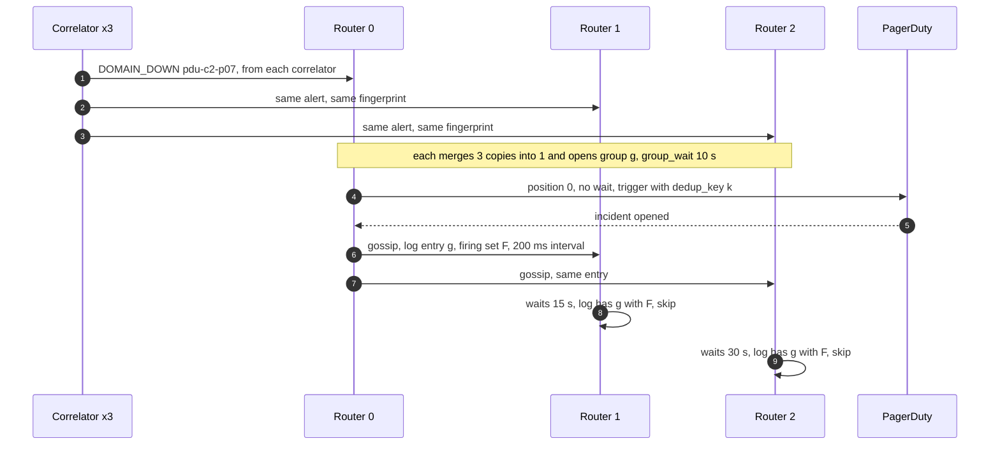

# Deep dive: alert routing and dedup

> One-line answer: 3 alert router replicas per region (one per cluster) each receive **every** alert from every evaluator and correlator replica, run the same pipeline (route, group, inhibit, silence), then replica p waits p × 15 s and checks a gossiped notification log before sending; pages carry `dedup_key = hash(receiver, group key)`, so the one case gossip cannot cover, a partition, collapses into the same PagerDuty incident. The two traps: a load balancer in front of the routers breaks dedup, and an alert that expires because its evaluator died is not a resolve.

Backs [`../solution.md`](../solution.md) §4.5, §6 Flow 4 and §10.1. Related: [`../../../concepts/gossip-protocol.md`](../../../concepts/gossip-protocol.md) (memberlist), [`../../../concepts/exactly-once.md`](../../../concepts/exactly-once.md) (effectively once via a dedup key), [`correlation-and-alert-storms.md`](correlation-and-alert-storms.md) (what is inhibited and why).

---

## 1. The problem in plain words

- Alerts arrive duplicated by design: 2 evaluator replicas per rule group and 3 correlator replicas. That is how we avoid a lock service on the alert path.
- The router itself must be HA, so it is 3 replicas. Without coordination that is 3 pages per problem.
- Coordination through consensus would put a leader election on the page path. We want the opposite: any single replica can page alone.
- So: every replica does all the work, and they only agree, loosely, on "has this already been sent".

## 2. The pipeline inside one replica

| Step | What it does | Our setting |
|---|---|---|
| Merge | Alerts with the same label set (fingerprint) from different senders are one alert | Duplicates from 2 evaluators or 3 correlators vanish here |
| Route tree | Match labels to a receiver: `owner_team`, `severity`, `cluster` | Tree in git, last good copy on disk |
| Aggregation group | One group per receiver and `group_by` value | `(alertname, cluster, failure_domain)` |
| `group_wait` | First notification of a new group waits for stragglers | 10 s for pages, 30 s otherwise (default 30 s) |
| `group_interval` | Next notification only if the firing set changed | 5 min (default). Also the timeout for each send |
| `repeat_interval` | Reminder while still firing | 4 h (default) |
| Inhibit | A source alert mutes matching targets | DOMAIN_DOWN mutes host alerts in that domain, `RegionMonitoringDegraded` mutes host rule alerts, `MassSilence` mutes per-host DOWNs |
| Silence | Matchers with an end time, gossiped | Maintenance silences come from the change system |
| Peer wait | Replica at position p waits p × `--cluster.peer-timeout` | 15 s (default), so 0 s, 15 s, 30 s |
| Notification log | "Group g was sent with firing set F at time t", gossiped | Checked after the wait. Kept 120 h (`--data.retention` default) |
| Send with retry | Receiver call, retried with backoff inside `group_interval` | PagerDuty, tickets, Slack, email |

## 3. The normal path: one page from three replicas

- If replica 0 is dead, replica 1 sends 15 s later. If 0 and 1 are dead, replica 2 sends 30 s later. The 60 s p99 page budget holds with one replica down (~35 s + 15 s).
- Gossip runs every 200 ms with a full state sync every 60 s (Alertmanager cluster defaults), so a log entry reaches peers far inside the 15 s wait.

## 4. Why senders must not go through a load balancer

The Alertmanager docs say it plainly: "It's important not to load balance traffic between Prometheus and its Alertmanagers, but instead, point Prometheus to a list of all Alertmanagers" ([Alertmanager](https://prometheus.io/docs/alerting/latest/alertmanager/)).

- Behind a load balancer, replica 0 sees 60% of a group's alerts and replica 1 sees 40%.
- Their firing sets differ, so each one's log check says "not sent with this set" and both send.
- Worse, each page lists only part of the failure, and a resolve on one replica can close what the other still sees firing.
- Rule: every evaluator and correlator replica sends to all 3 router addresses. 3x the alert traffic, a few KB/s.

## 5. Partitions: the one case gossip cannot cover

- Router 1 is cut off from router 0. Its log never receives g. After 15 s it sends too.
- Both triggers carry `dedup_key = hash(receiver, group key)`. PagerDuty's Events API v2 treats a trigger whose `dedup_key` matches an open alert as the same alert: the event is appended, no new incident.
- So delivery is at-least-once from the routers and effectively once at the pager. Solution §6 Flow 4 draws this.
- Tickets are created idempotently with the same key.
- Silences also travel by gossip. A silence created on replica 0 during a partition is unknown to replica 1, which may page. Accepted: a stray page in a partition beats a lost page.

## 6. Resolve semantics, and the blind-evaluator trap

- An evaluator sends each firing alert every resend (1 min) with `valid_until = now + 4 × max(eval interval, resend delay)` = now + 4 × max(15 s, 1 min) = **4 min** (Prometheus `rules/alerting.go`).
- If every evaluator for that rule group dies, nothing refreshes the alert, and after 4 min the router **resolves** it. The on-call sees "resolved" while the truth is "we are blind".
- Our change: a resolve caused by expiry, with no explicit resolve from any sender, is **not** sent as a resolve. The router instead fires `AlertSourceSilent{rule_group}` to the monitoring on-call.
- The always-firing `Watchdog` rule, evaluated by the evaluators and delivered by the router to an external dead man's switch every minute, catches the case where the whole path is gone. See [`meta-monitoring-and-region-loss.md`](meta-monitoring-and-region-loss.md).
- `resolve_timeout` (default 5 min) only applies to alerts sent without an end time. Ours always carry `valid_until`.

## 7. Severity routing

| Alert | Severity | Receiver |
|---|---|---|
| One host DOWN, UNHEALTHY, AGENT_DEAD, FLAPPING | ticket | Repair queue, plus the automation that already acted |
| Disk filling, NTP drift, SMART pre-fail on one host | ticket | Owner team queue |
| DOMAIN_DOWN (rack, PDU, switch, cluster) | page | Datacenter ops for the region |
| Cluster healthy capacity under 95% | page | Fleet on-call |
| SLO burn 14.4x over 1 h, or 6x over 6 h | page | The service's on-call |
| SLO burn 1x over 3 days | ticket | The service's queue |
| `RegionMonitoringDegraded`, `MassSilence`, `AlertSourceSilent`, automation halted | page | Monitoring on-call |
| Informational (deploys, drains in progress) | chat | Slack channel |

**Escalation** lives in PagerDuty: primary acknowledges within 5 min or it goes to the secondary, then 10 min more to the team lead. The router never escalates on its own; one escalation owner avoids double escalation.

## 8. Silences, with guardrails

- RBAC: you can silence alerts your team owns.
- An empty matcher (matches everything) is rejected.
- A silence that would match more than 1,000 current alerts, or lasts longer than 7 days, needs a second approver.
- Planned maintenance silences are created by the change system with the exact hosts and an end time, and expire by themselves.
- Every silence carries `created_by` and a comment, and is listed on the region dashboard.

This is the monitoring version of the empty-set bug in [`correlation-and-alert-storms.md`](correlation-and-alert-storms.md) §6: the dangerous input is the one that means "everything".

## 9. When the pager is the thing that is down

- The router counts notification failures per receiver. Over 1% for 5 min fires `NotificationsFailing`, routed to a second provider (SMS gateway).
- The external dead man's switch pages through that second provider if the `Watchdog` stops, so a dead PagerDuty integration and a dead router look the same to it and are both caught.
- A send that times out is retried inside `group_interval`. The docs note that `group_interval` also sets the context timeout for each send, so a short interval with a slow receiver cancels sends.

## 10. Numbers

- 3 replicas per region, 10 regions, one per cluster.
- Normal load ~2,000 firing alerts per region, ~0.4 GB. A PDU event adds ~4,800, to ~1.4 GB. Mimir sizes the router at 1 GB per 5,000 firing alerts and 1 core per 100 notifications/s ([planning capacity](https://grafana.com/docs/mimir/latest/manage/run-production-environment/planning-capacity/)). Notifications stay under 10/s.
- Peer timeout 15 s, gossip 200 ms, full sync 60 s, log retention 120 h.
- `group_wait` 10 s pages, 30 s rest. `group_interval` 5 min. `repeat_interval` 4 h. `valid_until` 4 min.

## 11. Trade-offs

| Choice | Gain | Cost |
|---|---|---|
| Duplicate work, gossip the log | No leader, any replica can page alone | Up to 30 s extra if 2 replicas die. A duplicate send in a partition |
| `dedup_key` at the pager | Partition duplicates collapse | Depends on the pager honouring the key. Tickets need the same idempotency |
| Expiry is not a resolve | Blindness is loud | A real resolve that was lost in transit shows as `AlertSourceSilent` for one cycle |
| Senders to all replicas | Identical groups everywhere | 3x alert traffic, negligible |

## 12. What the interviewer asks next

- "Why not one router with a hot standby and a lease?" A lease needs a lock service on the page path, and a paused leader with a valid lease pages nobody. Duplicates are cheaper than a stuck leader.
- "A silence was created during a partition and one replica paged anyway." Accepted and explained in §5. Stray page over lost page.
- "PagerDuty is down for 20 minutes." §9.
- "All evaluators died and alerts resolved." §6.
