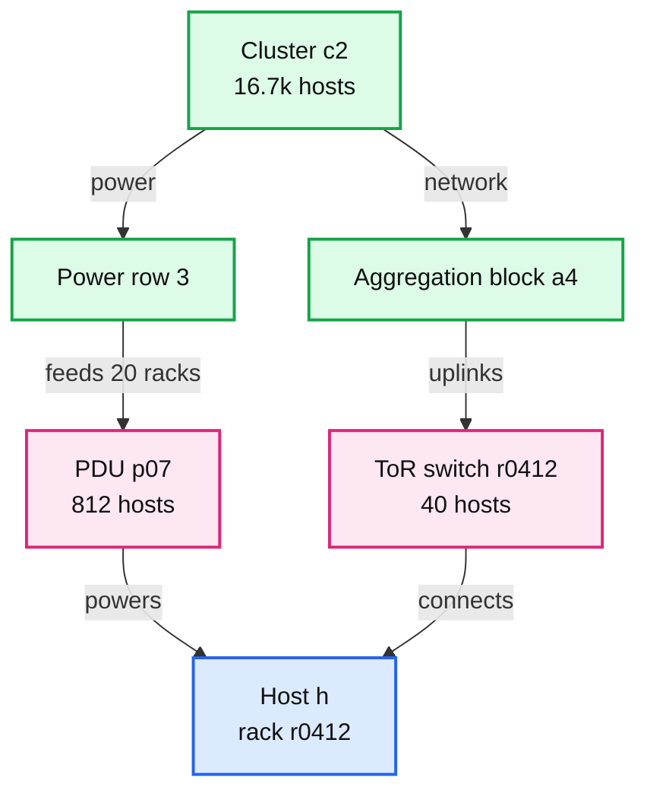
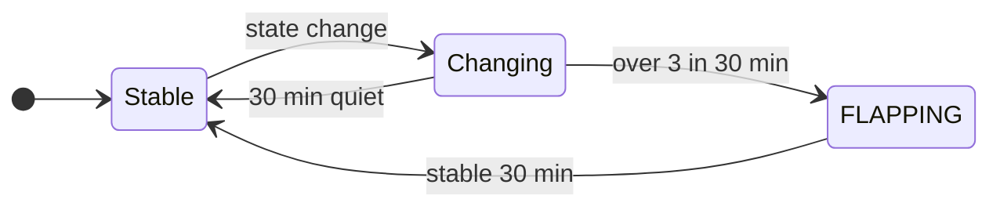

# Deep dive: one page per failure, not per server

> One-line answer: before anything alerts, the correlator walks two failure-domain trees (power and network) bottom-up and reports the **highest** domain with ≥ 50% of its hosts suspect (and ≥ 5 hosts) as one DOMAIN_DOWN, absorbing its hosts; the router then inhibits every host alert carrying that domain's label, groups stragglers for 10 s, and damps flapping hosts. A PDU failure that produces 812 DOWN verdicts and ~4,000 rule alerts becomes one page at ~t0 + 33 s. Automation that takes live hosts out of service has a budget (1% of a cluster and 5 racks at once, 0.5% of the fleet per hour) and stops and pages when it runs out, because the worst storm is the one your own automation creates.

Backs [`../solution.md`](../solution.md) §5.6 and §10.4. Related: [`failure-detection.md`](failure-detection.md) (where suspects come from), [`alert-routing-and-dedup.md`](alert-routing-and-dedup.md) (inhibition and grouping in the router), [`../../../concepts/rate-limiting-and-load-shedding.md`](../../../concepts/rate-limiting-and-load-shedding.md) (the budget is a token bucket).

---

## 1. The problem in plain words

- Hosts do not fail independently. Dean's LADIS 2009 list for one new cluster's first year: ~20 rack failures (40 to 80 machines instantly), ~1 PDU failure (500 to 1,000 machines), ~5 racks with 50% packet loss. Across our 30 clusters that is ~1.6 rack failures a day and a PDU every ~12 days.
- Without correlation, one PDU failure produces 812 DOWN verdicts, ~4,000 host-scoped rule alerts (absent, disk, NTP, ...), and every service's SLO alert on those hosts.
- Grouping by `alertname` alone still sends one page per alert name. Then power returns in waves and hosts flap DOWN, HEALTHY, DOWN.
- The on-call budget is 2 incidents per 12 h shift ([SRE book](https://sre.google/sre-book/being-on-call/)). The cause is one PDU. The page count must be one.

## 2. The two failure-domain trees

Every host sits in two trees at once. The topology service loads both from the asset inventory; every correlator keeps them in memory (500k hosts × ~100 B = 50 MB).

- Power tree: host, PDU, power row, cluster.
- Network tree: host, ToR, aggregation block, cluster.
- A rack is the leaf in both (one ToR, one or two PDU feeds), so "rack" is the most common qualifying domain.

## 3. The walk

Per 5 s window (one heartbeat phase, so every host of a failed rack has had time to go silent):

1. `suspects` = hosts silent at 2 of 3 liveness replicas.
2. For every domain d in both trees: `hit(d) = hosts(d) ∩ suspects`. d qualifies if `|hit| ≥ 5` and `|hit| ≥ 50% of hosts(d)`.
3. Sort qualifying domains by `|hit|`, largest first. Take a domain if it still explains unabsorbed suspects, then absorb them. This reports the **highest qualifying ancestor** and, across the two trees, the explanation with **fewer events**: a PDU (1 event) beats its 20 racks (20 events).
4. Confirm with **sampled probes**, not all hosts: 5 hosts of the domain plus the device itself (PDU over Redfish, ToR over SNMP). Probing 812 hosts × 3 probers tells us nothing the sample does not.
5. The device answer labels the cause: `cause="power"` if the PDU is unreachable or reports a trip, `cause="network"` if the ToR is down and hosts' BMCs say "on".
6. Leftover suspects go through the per-host verdict table in [`failure-detection.md`](failure-detection.md) §3, behind the mass-silence gate.

Why ≥ 5 hosts: 2 dead hosts out of 3 in a tiny test rack is not a rack failure. Why 50%: a real rack or PDU failure takes out 95 to 100%; 50% leaves room for hosts that were already down or were powered from a second feed.

The runnable version of this walk is in [`failure-detection.md`](failure-detection.md) §4.

## 4. At the router: inhibit, group, damp

**Inhibit.** `DOMAIN_DOWN{domain="pdu-c2-p07"}` mutes every alert whose `pdu`, `rack` or `tor` label equals the domain. The router adds `pdu` and `tor` to host-scoped alerts from its topology file, so series stay lean and only carry `host`, `cluster`, `rack`, `region`.

**What is not inhibited.** A service's SLO burn alert on users of those hosts still pages that service's on-call. That is a symptom they own, and it may need a traffic shift. Inhibiting symptoms by cause is how outages get missed.

**Group** by `(alertname, cluster, failure_domain)` with `group_wait` 10 s for pages, so the stragglers of a domain join the first notification rather than opening a second.

**Flap damping.**

- More than 3 state changes in 30 min: the host goes to FLAPPING. It is out of rotation, gets one ticket, and sends no further state notifications.
- It leaves FLAPPING only after 30 min stable. Power returning in waves after a PDU event is the usual trigger.
- DOMAIN_DOWN resolves when 90% of the domain is HEALTHY again, not at the first returning host.

## 5. The PDU walk-through, with numbers

| Time | What happens |
|---|---|
| t0 | PDU p07 in cluster c2 trips. 812 hosts, 20 racks, lose power. Last heartbeats were in t0 − 5 s to t0 |
| t0 + 10 to 15 s | The first hosts pass 15 s of silence at all 3 replicas |
| t0 + 20 s | Window closes. 20 racks at 97 to 100%, PDU at 98%. Sampled probes: 5 hosts and the PDU's Redfish endpoint unreachable. One `DOMAIN_DOWN pdu-c2-p07, cause=power, hosts=812` |
| t0 + 21 s | Router opens a group, `group_wait` 10 s |
| t0 + ~33 s | Replica 0 sends one page to datacenter ops. Replicas 1 and 2 see it in the notification log |
| next minutes | ~4,000 host rule alerts arrive and are inhibited on `pdu=p07`. Service SLO alerts page their owners if users are hurt |
| t0 + 1 to 6 h | Power back in waves, hosts return with new `boot_id`s. Flappers damped. DOMAIN_DOWN resolves at 90% healthy |

Pages: one to datacenter ops, one capacity notice to the fleet on-call if cluster c2 falls under 95% healthy (812 of 16.7k is 4.9%, so right at the edge). Host pages: zero.

## 6. The remediation safety budget

Automation removes hosts from service: drain on UNHEALTHY, reboot via BMC, reimage. A bad health check or a correlator bug can turn that into the largest outage of the year.

- **Budget:** at most 1% of a cluster (~170 hosts) and 5 racks out of service by automation at once, and 0.5% of the fleet (2,500 hosts) per hour. It is a token bucket per cluster plus one for the fleet.
- **Only live hosts consume budget.** A DOWN host is already out of service; recording that costs nothing. The budget guards against taking **working** capacity away.
- **Over budget, stop and page:** "automation halted in c2, 1,240 hosts pending". A human decides whether 30% of a cluster is really sick or the check is broken.
- **Empty-set and all-hosts guard:** a request whose host set is empty, or matches every host of a cluster, is rejected outright.
- **Idempotent workflow** keyed on `(host, verdict_id, step)`, so a retried drain never runs twice.

The reason is written in the SRE book's automation chapter ([Automation at Google](https://sre.google/sre-book/automation-at-google/)). A rack decommission workflow was restarted after the disk-erase step had already succeeded. The set of machines still to erase was, correctly, empty. The empty set was a special value meaning "everything", so the automation sent almost all machines in all colos to Diskerase and wiped the CDN. The fix was more sanity checks, including rate limiting, and an idempotent workflow. Our budget, the empty-set guard and the idempotency key are that fix, applied up front.

## 7. Failure cases

- **Stale topology.** A rack was moved to another PDU and the inventory was not updated. The walk dilutes: the old PDU shows 40 of 800 suspect, the new one shows no hosts. Result: 40 per-host DOWN tickets instead of one rack event. No pages, a noisy ticket queue. Mitigations: the agent reports its ToR from LLDP, a nightly job diffs LLDP against the inventory, and the correlator keeps the last good topology on disk if the feed breaks.
- **Two unrelated failures in one window.** A rack dies while a host elsewhere panics. The walk reports the rack and the host separately. Correct.
- **Partial domain.** 30% of a rack dies (one of two PDU feeds). Below 50%, so hosts go through per-host verdicts: 12 tickets, no page. If that is wrong for your hardware, set the threshold per domain type.
- **Correlator bug marks a healthy rack DOWN.** Hosts are not drained by DOWN verdicts alone if heartbeats resume, and the `boot_id` SLI in [`failure-detection.md`](failure-detection.md) §9 catches it within the hour.

## 8. Trade-offs

| Choice | Gain | Cost |
|---|---|---|
| Correlate before alerting | The cause is reported once, with its host list | A 5 s window added to every verdict |
| Highest qualifying ancestor | 1 event, not 20 | A PDU event hides which racks were also on a second feed. The host list keeps the detail |
| Inhibit causes, not symptoms | Host noise gone, service pages kept | Service teams still get paged during a PDU event, correctly |
| Budget on automation | A bad check cannot drain a cluster | Real mass sickness waits for a human |

## 9. What the interviewer asks next

- "A switch and a PDU fail at the same minute in the same cluster." Two domains qualify in two trees, two events, two causes. The walk absorbs hosts once.
- "Topology data is wrong." §7: per-host tickets, LLDP diff, last good copy.
- "Why not let the on-call group it by eye?" 2 incidents per shift is the budget. A page with 812 lines is a failure to design.
- "Automation drained 30% of a cluster last quarter. How do you prevent it?" §6.
