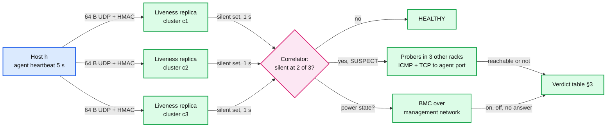

# Deep dive: deciding a server is dead

> One-line answer: silence from one observer means nothing, because a crashed host, a broken switch, a partitioned observer and a paused observer all look the same. So a 64 B heartbeat every 5 s goes to 3 liveness replicas in 3 different clusters, a host is SUSPECT only when 2 of 3 have not heard it for 15 s, probers in 3 other racks plus the BMC confirm it on a second channel, and a verdict lands in ~21 s (30 s p99). Mass silence that no failure domain explains is treated as our bug, not 500 deaths. False DOWNs are measured for free: a "dead" host that comes back with the same `boot_id` never died.

Backs [`../solution.md`](../solution.md) §4.4 and §5.5. Related: [`../../../concepts/gossip-protocol.md`](../../../concepts/gossip-protocol.md) (SWIM, phi accrual), [`../../../concepts/leases-fencing-clocks.md`](../../../concepts/leases-fencing-clocks.md) (monotonic clocks).

---

## 1. Why silence is ambiguous

Five different events produce the same observation, "no heartbeat from host h for 15 s". One observer cannot tell them apart, and a wrong call is expensive both ways: a false DOWN drains a healthy server, a false storm at 3 am trains the on-call to ignore pages.

| Cause | What is actually broken | Right action |
|---|---|---|
| Host crashed (kernel panic, power) | The host | DOWN, drain, repair |
| ToR switch or PDU died | 40 to 800 hosts at once | One DOMAIN_DOWN page, see [`correlation-and-alert-storms.md`](correlation-and-alert-storms.md) |
| Observer's uplink is partitioned | The observer | Nothing about the hosts. Alert on the observer |
| Observer paused 20 s (GC, CPU starvation) | The observer | Nothing. Every host looks late when it wakes |
| Agent crashed, host fine | The agent | AGENT_DEAD ticket, restart the agent, never drain |

## 2. The mechanism: quorum of observers, then a second channel



**Heartbeat design.**
- Separate from the metrics push. A backed-up 2 KB metrics batch never delays a 64 B heartbeat. Kubernetes made the same split: a small Lease renewed every 10 s, the big NodeStatus only on change or every 5 min ([node status](https://kubernetes.io/docs/reference/node/node-status/)).
- Fields: `{host_id, boot_id, seq, sent_at}`. `boot_id` changes on every boot. `seq` is monotonic within a boot, so replays and UDP duplicates are dropped by "max seq per boot_id".
- HMAC with a per-host key. A compromised host cannot keep a dead neighbour alive.
- The receiver judges by **its own monotonic clock** on receipt, never by `sent_at`. A host whose wall clock is 10 min off is still judged correctly.
- Each replica holds `last_seen[host]` for 50k hosts (~2 MB), scans it every 1 s, and publishes the silent set as a 6 KB bitmap over a stable host index.

**Observer self-check.** A replica abstains, and alerts on itself, when its received heartbeat rate drops more than 5% within 10 s, when its own 1 s scan loop ran late (a pause), or when it has not synced the host index in 10 min. An abstaining replica votes "unknown"; with 2 healthy replicas left, 2 of 2 must agree.

## 3. The verdict table

| Silent at 2 of 3 replicas | Probes from 3 other racks | BMC | Verdict | Action |
|---|---|---|---|---|
| No | not run | not asked | HEALTHY | none |
| Yes | 2 of 3 reach it | on | AGENT_DEAD | Agent ticket, restart agent. Host stays in service |
| Yes | 2 of 3 reach it | no answer | DOWN, network | In-cluster probes pass but 2 replicas in other clusters hear nothing: its path out of the cluster is broken. Drain |
| Yes | 2 of 3 fail | off | DOWN, power or hardware | Drain, hardware ticket |
| Yes | 2 of 3 fail | on or no answer | DOWN, host or NIC | Drain, reboot via BMC, then repair |

Before any row applies, the correlator checks two gates:
- **Domain gate.** If ≥ 50% of the host's rack, PDU or switch (and ≥ 5 hosts) is suspect in the same 5 s window, the host is absorbed into one DOMAIN_DOWN.
- **Mass-silence gate.** If more than 1% of the region's hosts (500 of 50k) are suspect and no domain explains them, a bad agent release or a broken liveness path is far more likely than 500 independent deaths. Hold every per-host verdict, fire one `MassSilence`, and probe a sample of 20: reachable means the agents died, unreachable means the network did.

## 4. The core algorithm, runnable

```python
MIN_SUSPECTS, FRACTION, MASS = 5, 0.5, 0.01

def window_verdicts(silent_sets, domains, region_hosts, probes_failed, bmc):
    """One 5 s correlator window.
    silent_sets: 3 sets of host ids, one per liveness replica.
    domains: {domain_id: set(host ids)} for racks, PDUs, ToRs, clusters.
    probes_failed: {host: how many of its 3 probers failed}.
    bmc: {host: "on" | "off" | None}."""
    votes = {}
    for s in silent_sets:
        for h in s:
            votes[h] = votes.get(h, 0) + 1
    suspects = {h for h, n in votes.items() if n >= 2}
    events, absorbed = [], set()
    qualifying = []
    for d, hosts in domains.items():
        hit = hosts & suspects
        if len(hit) >= MIN_SUSPECTS and len(hit) >= FRACTION * len(hosts):
            qualifying.append((d, hit))
    # Biggest explanation first: a PDU absorbs its 20 racks, fewer events win.
    for d, hit in sorted(qualifying, key=lambda x: -len(x[1])):
        if hit - absorbed:
            events.append(("DOMAIN_DOWN", d, len(hit)))
            absorbed |= hit
    rest = suspects - absorbed
    if len(rest) > MASS * region_hosts:
        return events + [("MASS_SILENCE", len(rest))]
    for h in sorted(rest):
        if probes_failed.get(h, 0) < 2:
            state = "AGENT_DEAD" if bmc.get(h) == "on" else "DOWN_NETWORK"
        elif bmc.get(h) == "off":
            state = "DOWN_POWER"
        else:
            state = "DOWN_HOST"
        events.append((state, h))
    return events

if __name__ == "__main__":
    rack = {f"r1-{i}" for i in range(40)}
    domains = {"rack-r1": rack, "rack-r2": {f"r2-{i}" for i in range(40)}}
    sets = [rack | {"r2-7", "r2-9"},           # replica 1 also misses r2-9
            rack | {"r2-7"},
            {"r2-7"}]                          # replica 3 still hears rack r1
    print(window_verdicts(sets, domains, 50_000,
                          {"r2-7": 3}, {"r2-7": "off"}))
    # [('DOMAIN_DOWN', 'rack-r1', 40), ('DOWN_POWER', 'r2-7')]
    # rack r1: 2 of 3 replicas, one event. r2-9: 1 replica, not a suspect.
```

## 5. Timing math: 30 s p99

| Step | Time |
|---|---|
| Last heartbeat to 3 missed intervals | 15 s |
| Replica scan tick | ≤ 1 s |
| Correlator window (one heartbeat phase, so a whole rack is in) | 5 s |
| Probes, 1 s timeout, 1 retry, run in parallel with the window | ≤ 3 s, overlapped |
| **Verdict** | **~21 s typical, 30 s p99** |

Kubernetes marks a node unreachable after 50 s and evicts pods 5 min later ([kube-controller-manager](https://kubernetes.io/docs/reference/command-line-tools-reference/kube-controller-manager/); its node status page still says 40 s). We can be 2x faster because the quorum and the probes, not a long timeout, carry the false-positive burden.

## 6. Phi accrual, and why we do not need it

- Phi accrual (Hayashibara et al., 2004) fits a distribution to recent inter-arrival times per host and computes `phi = -log10(P(a heartbeat still arrives later than now))`. Phi 1 means a 10% chance the suspicion is wrong, phi 2 means 1%, phi 8 means 1 in 100 million.
- Cassandra's `phi_convict_threshold` defaults to 8. Akka's default threshold is 8 with a 1 s heartbeat and 3 s acceptable pause. It shines on WAN links, where the timeout stretches when delay is jittery.
- Our heartbeats run on a fixed 5 s schedule inside one region with sub-millisecond jitter. Phi with a tiny standard deviation degenerates into a fixed timeout, at the cost of per-host history and a number nobody can reason about at 3 am.
- The hard question here is not "how late is too late" but "who is late, the host or me". The quorum answers that. Phi does not.

## 7. The rejected peer-to-peer alternative: SWIM

- Every host pings a random peer every `ProbeInterval` (1 s), waits `ProbeTimeout` (500 ms), then asks `IndirectChecks` (3) other peers to try. Suspicion lasts `SuspicionMult × log10(N) × ProbeInterval`: 4 × 4.7 × 1 s ≈ 19 s at 50k hosts (hashicorp/memberlist defaults).
- Rejected, despite having no central observer and indirect probes built in: it runs membership on every production host, so one gossip bug or a bad config is fleet-wide; it still needs topology correlation; and a pause on the pinging host reproduces the observer problem on 50k observers instead of 3.

## 8. Gray failure: up but sick

- Dean's LADIS 2009 list includes "~5 racks go wonky (40-80 machines see 50% packetloss)" per new cluster per year. Those hosts heartbeat fine. The [Gray Failure paper (Huang et al., HotOS 2017)](https://www.microsoft.com/en-us/research/publication/gray-failure-achilles-heel-cloud-scale-systems/) names the cause: **differential observability**. The failure detector sees a healthy host while its clients see errors.
- Evidence we use: agent checks (NIC CRC errors, TCP retransmits, disk latency), **peer outliers** (retransmit or error rate 10x its rack's median for 10 min), and client-side RPC error rates per backend host. A gray verdict is UNHEALTHY, not DOWN. It drains within the remediation budget and never pages by itself.

## 9. Measuring false DOWNs: the `boot_id` SLI

- A host marked DOWN that heartbeats again with the **same** `boot_id` never died: that verdict was false (network or monitor). A new `boot_id` means it really rebooted.
- SLO: false DOWN under 0.1% of DOWN verdicts. Page the monitoring on-call above 1% in an hour. No labelling effort.

## 10. Trade-offs

| Choice | Gain | Cost |
|---|---|---|
| 3 observers, 2 of 3 | One partitioned or paused observer changes nothing | 3x heartbeat traffic: 10k msgs/s per replica, trivial |
| Probes plus BMC | A second, physically separate channel | Probers and BMC access to run and secure |
| Fixed 15 s timeout | Explainable, tunable, 30 s p99 verdict | Not adaptive. Fine inside a region |
| Mass-silence gate | A bad agent release causes one alert, not 25k tickets | 500 real simultaneous deaths without a domain would be held for one probe round |

## 11. What the interviewer asks next

- "Your correlator is 3 replicas. Do they need a leader?" No. Same inputs, deterministic output, the router dedups identical verdicts by fingerprint.
- "A host's clock is 10 minutes ahead." Irrelevant here: receipt time on the replica's monotonic clock decides.
- "An agent release crashes every agent." Mass-silence gate: one alert, sample probes say hosts reachable, roll back the release.
- "How do you know your detector is right?" The `boot_id` SLI.
