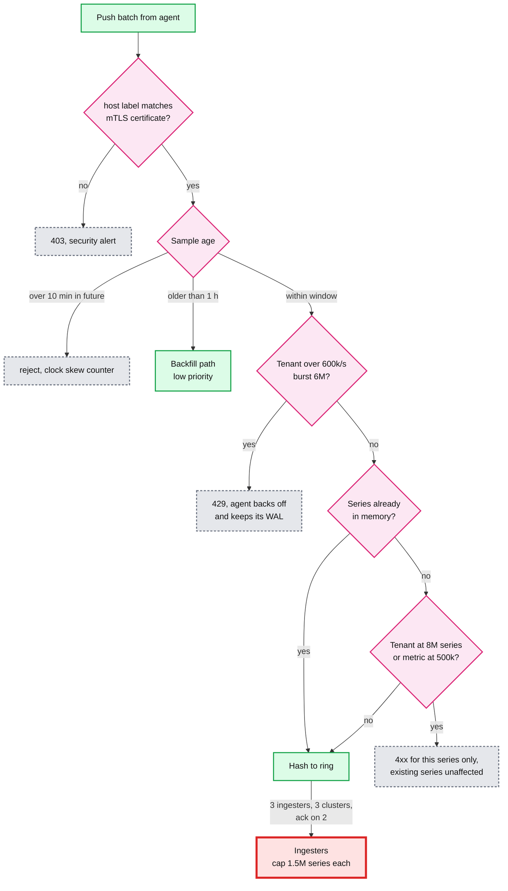
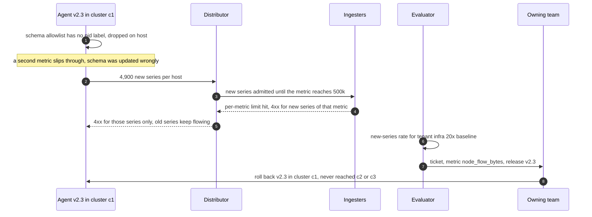

# Deep dive: ingestion and cardinality (the red node)

> One-line answer: the agent enforces a metric and label schema, buffers to a local WAL and sends newest first; stateless distributors check the host label against the mTLS certificate, apply an admission window and per-tenant and per-metric limits, and write each series to 3 ingesters in 3 clusters with a quorum of 2; the ingesters hold every active series in memory, so they are the red node, and the only defence that works is **rejecting a new series before it is created**, loudly and attributably, because one unbounded label turns 5M series into 250M and OOMs the tier that every dashboard and alert rule reads.

Backs [`../solution.md`](../solution.md) §4.1, §5.3 and §5.4. Storage internals (head, WAL, chunks, index, compaction) are in [`../../../concepts/time-series-db.md`](../../../concepts/time-series-db.md) §3 to §9, not repeated here. Related: [`../../../concepts/sharding.md`](../../../concepts/sharding.md), [`../../../concepts/replication-and-quorums.md`](../../../concepts/replication-and-quorums.md), [`../../../concepts/rate-limiting-and-load-shedding.md`](../../../concepts/rate-limiting-and-load-shedding.md), [`../../../concepts/stream-sketches.md`](../../../concepts/stream-sketches.md).

---

## 1. The problem in plain words

- Per region: 50k hosts, **500k samples/s, 5M active series**. RF 3 makes **15M in-memory series** on 15 ingesters of 16 GB, ~1M each.
- Mimir's sizing: 1 core, 2.5 GB RAM and 5 GB disk per 300k in-memory series, so ~8.3 GB per ingester. That is **1.8x headroom**, the thinnest margin in the whole design.
- Samples are cheap (~1.4 B each). A **new series** is the expensive write: a memory structure, an index insert, a WAL record. So the capacity number is series, not samples/s.

## 2. The write path, hop by hop

**Agent** (one per server):
- Ships only metrics and labels on the allowlist in its schema. An unknown label is dropped on the host, with a counter.
- Timestamps samples at collection with its NTP-synced clock. Exports its own NTP offset as a check.
- Appends each batch to a local WAL (1 MB segments, ~2 h) before pushing. Deletes a segment once acked.
- On failure: full-jitter exponential backoff. On reconnect: **newest batch first**, then backfill at up to 1x its normal rate on top of live data, shed first by the tenant rate limit.

**Distributor** (10 pods of 4 cores per region, 1M samples/s capacity, 2x steady state):
- Rejects any series whose `host` label differs from the mTLS certificate.
- Validates: at most 30 label names per series (Mimir's `max_label_names_per_series` default), bounded name and value length.
- Applies the admission window, the tenant rate limit and the series limits (§3).
- Hashes `(tenant, labels)` onto the ring and writes to 3 ingesters in 3 different clusters. Acks after 2. The ring and zone-aware placement are drawn in [`../solution.md`](../solution.md) §10.1.

**Ingester**: WAL on local SSD, open chunk per series in the 2 h head, a hard cap on in-memory series (1.5M per pod) that **rejects instead of OOMing**, 2 h blocks to object storage.

## 3. The admission decision at the distributor

- The series-limit check in Mimir happens in the ingesters against a global per-tenant count. Drawn here at the distributor for clarity: the effect is the same, the new series is refused before it allocates.
- The out-of-order window is 1 h (`out_of_order_time_window`, default 0 s). Anything older takes the backfill path, which builds blocks offline and never touches the head.
- 429 is backpressure, not loss: the agent keeps the data on its own disk.

## 4. The cardinality explosion, with numbers

A team adds `node_flow_bytes{flow_id=...}`, or an agent release adds a `pid` label.

| | Before | After |
|---|---|---|
| Series per host | 100 | 5,000 |
| Active series per region | 5M | 250M |
| In-memory series (RF 3) | 15M | 750M |
| RAM at 2.5 GB per 300k | 125 GB | **~6 TB** |
| Provisioned (15 × 16 GB) | 240 GB | 240 GB |

Samples/s went up too, but the killer is the series count. Without limits: ingesters OOM, restart, replay a WAL full of the same new series, OOM again. **Dashboards and all alert rules read the ingesters, so the region goes blind.**

Two different diseases:

| Flavour | Looks like | Why it hurts | Fix |
|---|---|---|---|
| High cardinality | 250M active series, stable | Head RAM, index size, every `sum by` touches every series | Limits, drop the label, aggregate at collection |
| High churn | 5M active but 50M new per day (pod names, IPs, build SHAs) | Every new series is the expensive write, and dead series stay in the head until the next block cut | Relabel at the agent, per-tenant new-series limits, shorter retention for that tenant |

## 5. Defences, in the order they fire

1. **Agent schema.** Unknown labels never leave the host. Catches most mistakes at zero central cost.
2. **CI review for new metrics.** A new metric declares its labels and expected series per host. Review rejects free-text or unbounded labels.
3. **Per-metric limit** (500k series, 10% of the tenant). Stops one metric from eating the tenant.
4. **Per-tenant limit** (8M for infra, 1.6x of 5M; Mimir's default `max_global_series_per_user` is 150,000). New series get a 4xx. Existing series keep working.
5. **New-series-rate alert** per tenant. Pages on the rate of new series, not on the total, because churn shows up there first.
6. **Ingester cap** (1.5M in-memory series per pod). The last line: rejects instead of OOMing even if every limit above is misconfigured.
7. **Collection aggregation** for real needs. The agent sums per-flow bytes into per-host totals. Monarch aggregates 36 input series into one on average during collection ([VLDB 2020](https://www.vldb.org/pvldb/vol13/p3181-adams.pdf) §7).
8. **Staged rollout.** Agent releases go one cluster first, so the blast radius of a bad release is 1/30 of the fleet.

Why reject and not drop samples: dropping samples of an existing series is invisible (a graph with holes). Rejecting a new series is loud, attributable to one metric and one team, and costs nothing that was working.

HyperLogLog is for analysis, not defence. The cardinality API ("top 10 metrics by series", "labels by distinct values") can use HLL sketches merged across ingesters (12 KB each). But a sketch only tells you after the fact. The limit must be an exact check before the series exists.

## 6. Spikes and failures on this path

| Event | What happens | Handling |
|---|---|---|
| 10 min blip in one cluster, 16.7k agents reconnect | 60 buffered pushes each, 100M samples | Newest first keeps alerts live. Jitter spreads the first batch over 10 s (~167k/s extra). 429s past the tenant rate |
| Backfill math at up to 1x normal rate | The 600k/s tenant limit leaves 100k/s above steady state. A 10 min one-cluster backlog (100M samples) drains in ~17 min, a region-wide one (300M) in ~50 min | Both fit the 1 h out-of-order window. Only backlogs older than 1 h take the backfill path. Alerting already has "now", so only history waits |
| One ingester OOM-killed | Its series still have 2 of 3 copies | Quorum met, agents see nothing. WAL replay 2 to 5 min |
| One whole cluster lost | Every series has one copy there | 2 of 3 left everywhere. Distributor pods in the other 2 clusters take 1.5x load, inside the 2x headroom |
| Agent clock 10 min ahead | Samples in the future | Rejected with a counter. NTP offset check turns the host UNHEALTHY |
| Duplicate push after a timeout | Same sample twice | Ingester ignores an identical `(series, ts, value)` |

## 7. Numbers to say out loud

- 500k samples/s, 5M series per region. 15M in-memory with RF 3.
- 15 ingesters × 16 GB, ~1M series and 8.3 GB each, cap 1.5M. Headroom 1.8x.
- Distributors: 1 core per 25k samples/s, 20 cores steady, 40 provisioned.
- Limits: 600k samples/s and burst 6M per region, 8M series per tenant, 500k per metric, 30 labels per series.
- Admission: 1 h out-of-order window, reject > 10 min in the future.
- Explosion: 100 to 5,000 series per host is 125 GB to ~6 TB.

## 8. Trade-offs

| Choice | Gain | Cost |
|---|---|---|
| Reject new series past a limit | Region stays up, cause is attributable | The offending team loses the new metric until review |
| Agent schema | Most mistakes die on the host | A legitimate new label needs a schema change and review |
| RF 3 across clusters, quorum 2, no consensus | Lose a cluster, keep writing | 3x ingester RAM. Samples are idempotent, so no Raft is needed |
| Newest first after reconnect | Alerts see "now" immediately | Old data arrives out of order; needs the 1 h out-of-order head |
| 2x distributor headroom | Survives a cluster reconnect | ~20 idle cores per region |

Push back on the textbook: ByteByteGo's design puts Kafka between collectors and the TSDB ([post](https://blog.bytebytego.com/p/metric-monitoring)). It gives replay and decoupling. On the alert path it is a liability: consumer lag becomes alert lag, and it is one more stateful system that must be up for a page to go out. The agent WAL already gives replay per host. Tee to Kafka asynchronously for consumers that want a stream, off the critical path.

## 9. What the interviewer asks next

- "Someone adds `request_id` as a label. Walk me through what happens." §5, in order.
- "Why not autoscale ingesters on memory?" An unbounded label grows faster than any autoscaler, and each new series is the expensive write.
- "Why RF 3 and no Raft?" Writing the same `(series, ts, value)` twice is the same state. Nothing to agree on. See [`../../../concepts/replication-and-quorums.md`](../../../concepts/replication-and-quorums.md).
- "What if a whole cluster reconnects at once?" Newest first, jitter, 429, 2x headroom, backfill path.
- "How would you find which metric exploded?" The cardinality API, the new-series-rate alert, and the per-metric 4xx counter all name it.

## 10. Cross-links

- [`../solution.md`](../solution.md) §4.1 (flow), §5.3 (spikes), §5.4 (cardinality), §10.1 (ring diagram), §10.3 (capacity).
- [`query-and-retention.md`](query-and-retention.md) (what reads the ingesters), [`alert-evaluation-and-latency.md`](alert-evaluation-and-latency.md) (why they must stay up).
- [`../../../concepts/time-series-db.md`](../../../concepts/time-series-db.md) §8 and §9, [`../../../concepts/sharding.md`](../../../concepts/sharding.md), [`../../../concepts/rate-limiting-and-load-shedding.md`](../../../concepts/rate-limiting-and-load-shedding.md), [`../../../concepts/stream-sketches.md`](../../../concepts/stream-sketches.md).
