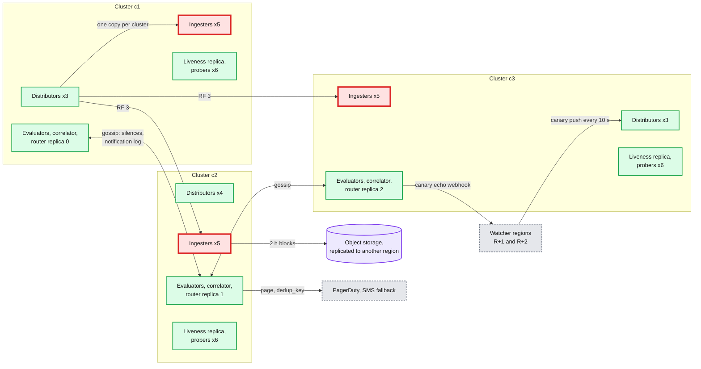
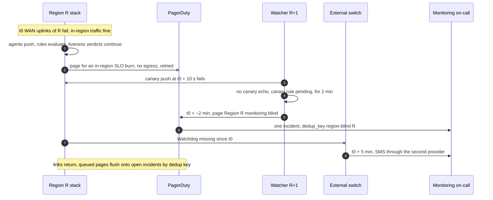

# Deep dive: who monitors the monitor, and region loss

> One-line answer: the worst failure of a monitoring system is silence that looks like health, so make every kind of silence loud: the alert path depends on nothing it monitors (local config files, gossip, memory; object storage only for history), each region's stack is watched by two other regions with a **canary** pushed every 10 s through the full push, ingest, evaluate, route, notify path, every router sends an always-firing **Watchdog** to an external dead man's switch that pages through a second provider after 5 min of silence, and a lost region is paged by its watchers in ~2 min while its history survives in replicated object storage.

Backs [`../solution.md`](../solution.md) §5.7 and §10.4 ("region monitoring blind"). Related: [`../../../concepts/gossip-protocol.md`](../../../concepts/gossip-protocol.md) (router and ring membership), [`../../../concepts/replication-and-quorums.md`](../../../concepts/replication-and-quorums.md), [`../../../concepts/time-series-db.md`](../../../concepts/time-series-db.md) §8.

---

## 1. The problem in plain words

Four ways the stack goes quiet while the fleet burns:
- **Circular dependency.** Monitoring reads its rules from a database it also monitors. The database fails, monitoring loses its rules, nobody is told.
- **All evaluators die.** Firing alerts stop being refreshed. After `valid_until` (4 × max(15 s, 1 min) = **4 min**) the router treats them as **resolved** and may even send "resolved". The on-call sees green.
- **The region is cut off.** Alerts fire inside the region, but its router cannot reach PagerDuty.
- **The pager is down.** Everything works up to the last hop.

Google's SRE book sets the bar for noise too: at most **2 incidents per 12-hour shift** ([Being On-Call](https://sre.google/sre-book/being-on-call/)). Meta-monitoring must page on blindness, and on nothing else.

## 2. The dependency rule for the alert path

Monarch's version of the rule ([VLDB 2020](https://www.vldb.org/pvldb/vol13/p3181-adams.pdf) §2): it trades consistency for availability, drops delayed writes and returns partial data rather than block. It keeps data in memory and avoids Bigtable, Colossus and Spanner on the alerting path, because those systems rely on Monarch for their own monitoring.

| Component | May depend on | Must not depend on |
|---|---|---|
| Agent | Local disk, the region's distributor VIP by IP, NTP | DNS for the push target, any config service at runtime |
| Distributor | Memberlist ring, limits file on local disk, CA bundle on disk | A database, an auth service call per request |
| Ingester | Local SSD. Object storage for shipping blocks, async | Object storage for writes or recent reads |
| Evaluator | Ingesters, rules file synced from git, last good copy kept | Object storage, the global query layer |
| Liveness, correlator | Topology snapshot file, probers, BMC network | Inventory database at verdict time |
| Router | Routes file, memberlist, PagerDuty, a second provider | Anything else |

- Config is **pushed as files**. A sync failure means "keep the last good copy and raise a ticket", never "run with no rules".
- Peers are found by IP lists in files and memberlist, not DNS (Dean's cluster year includes "dozens of minor 30-second blips for DNS"). Repair automation, dashboards and CI may depend on anything: they are not on the page path.

## 3. What runs where in one region

One distributor's fan-out is drawn; all 10 do the same. Borgmon runs "a single Borgmon per cluster, and a pair at the global level" ([SRE book ch. 10](https://sre.google/sre-book/practical-alerting/)); we run one stack per region spread over its 3 clusters, plus a thin global query layer that stores nothing.

## 4. Cross-region watchers: the canary

- Regions form a ring. Region R is watched by R+1 and R+2.
- Every 10 s a canary writer in each watcher pushes `canary_ts{watcher="R+1"} = now` into R's distributors, like any agent.
- R's evaluators run an always-true canary rule on that series. R's router delivers it on a dedicated route (10 s group interval) to a webhook in the watcher region. The payload carries the push time.
- The watcher measures the **whole alert path**: push, ingest, evaluate, route, notify. Round trip over **60 s for 2 min**, or no echo at all: the watcher's own router pages "Region R monitoring blind".
- Both watchers use the same `dedup_key` (hash of "region-blind" and R), so PagerDuty shows one incident. Why cross-region: R's own meta-alerts (missed evaluations, evaluator count) are evaluated by R's evaluators. If those are the thing that died, only an outside observer notices.

## 5. The dead man's switch

- Every router sends an always-firing `Watchdog` alert (`vector(1)`) every **1 min** to an external heartbeat service outside our infrastructure. Missing for **5 min**: that service pages the monitoring on-call through a **second provider** (SMS), not through PagerDuty.
- It catches what the canary cannot: all regions' routers broken by the same bad config push, or our paging integration itself broken.

## 6. Region monitoring blind, from the outside

## 7. When every evaluator dies

- Firing alerts stop refreshing. After 4 min they expire and the router resolves them; a resolve by expiry and a real resolve look the same to it. Liveness verdicts keep flowing (correlators are separate), so hard-down hosts still page. Threshold and SLO rules are what go dark.
- Caught by: the canary rule is itself evaluated by those evaluators, so the echo stops and the watchers page in ~2 min. That is why the canary goes through the evaluators and not just the query API.

## 8. Region loss timeline

| Time | What happens |
|---|---|
| t0 | Region R lost. Its stack goes with it |
| t0 + 10 s | First canary pushes from R+1 and R+2 fail |
| t0 + ~2 min | Watchers' canary rules fire, one page "Region R monitoring blind" |
| t0 + 5 min | External switch misses R's Watchdog, SMS page as backstop |
| during | Global dashboards show `partial`, missing region R. Other regions unaffected |
| recovery | Agents in R flush newest first when R returns. Backfill within 1 h lands in the out-of-order head |

Data: blocks already shipped are safe in object storage replicated to another region. If R is gone for good, the last ≤ 2 h in ingester memory and WAL that had not shipped goes with it. Accepted: that is monitoring history of hosts that no longer exist.

## 9. Failure cases

| Failure | Detected by | Time to page |
|---|---|---|
| One cluster's stack replicas die | In-region meta-alerts, 2 of 3 still serve | Ticket, no page |
| All evaluators in R die | Watchers' canary | ~2 min |
| R's router cannot reach PagerDuty | Notification failures > 1% for 5 min, routed to the second provider | ~5 min |
| R cut off from the WAN | Watchers' canary, then the external switch | ~2 min, backstop 5 min |
| Bad router config in every region | External dead man's switch | 5 min |

## 10. Numbers to say out loud

- Canary every 10 s, page on round trip over 60 s for 2 min, two watchers, one shared dedup key. Watchdog every 1 min, external switch pages after 5 min via SMS.
- `valid_until` 4 min: the window after which dead evaluators look like resolved alerts.
- Region loss: paged in ~2 min, history safe except ≤ 2 h unshipped.

## 11. Trade-offs

| Choice | Gain | Cost |
|---|---|---|
| No database on the alert path | Monitoring works during the outage it reports | Config is files, so changes propagate by sync, not by query |
| Canary through evaluators and router | Tests the whole alert path, catches dead evaluators | A dedicated route and ~6 alerts per minute per watcher |
| Two watchers per region | One watcher down does not blind us | 2x canary traffic, trivial |
| External switch with a second provider | Catches global config mistakes and pager outages | A third-party dependency, deliberately outside our trust boundary |
| Regional stack, not global | WAN partitions do not stop in-region alerting | A thin global layer for fleet views, partial results |

## 12. What the interviewer asks next

- "Who monitors the monitor?" Two other regions through a canary, and an external dead man's switch through a different provider.
- "What if every evaluator crashes?" Alerts expire into "resolved" after 4 min. The canary goes through the evaluators, so its echo stops and watchers page in ~2 min.
- "Why not keep rules in a database?" The database is one of the things being monitored. Files with the last good copy.
- "The region is gone. What did you lose?" Its last ≤ 2 h of unshipped samples, and nothing on the other 9 regions.

## 13. Cross-links

- [`../solution.md`](../solution.md) §5.7, §8, §10.4. [`alert-evaluation-and-latency.md`](alert-evaluation-and-latency.md) (`valid_until`), [`alert-routing-and-dedup.md`](alert-routing-and-dedup.md) (router gossip, dedup key), [`ingestion-and-cardinality.md`](ingestion-and-cardinality.md) (newest-first recovery).
- [`../../../concepts/gossip-protocol.md`](../../../concepts/gossip-protocol.md), [`../../../concepts/replication-and-quorums.md`](../../../concepts/replication-and-quorums.md).
