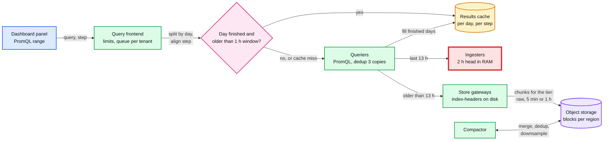
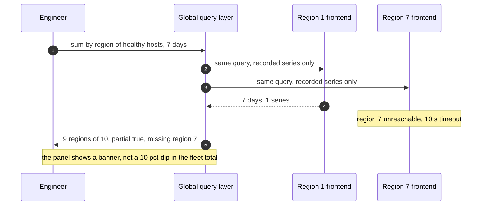

# Deep dive: dashboards over weeks, and retention

> One-line answer: a fleet panel over 30 days at a 10 s step decodes 13 billion samples, so never let it: the compactor writes 5 min and 1 h rollups that keep count, sum, min, max and a counter per point, evaluators precompute fleet aggregates as recording rules (30 series instead of 50k), and the query frontend splits by day, aligns steps, serves finished days from a cache and enforces per-query limits. Recent data comes from ingester memory, older data from object storage through store gateways. Storage for raw 15 d plus rollups to 13 months is ~27 TB, ~$620 a month, so the design goal is query speed, not disk.

Backs [`../solution.md`](../solution.md) §4.2 and §5.1. Engine internals (block layout, index-headers, downsampling rules) are in [`../../../concepts/time-series-db.md`](../../../concepts/time-series-db.md) §5 to §8. Related: [`../../../concepts/caching-patterns.md`](../../../concepts/caching-patterns.md), [`../../../concepts/columnar-db.md`](../../../concepts/columnar-db.md) (the OLAP alternative we did not pick).

---

## 1. The problem in plain words

- "CPU for every host in the region, last 30 days" at a 10 s step: 50k series × 259,200 samples = **~13 billion samples** to decode. Minutes of CPU, tens of GB through one querier.
- ~130 dashboard QPS per region (2,000 engineers, 20 panels, 30 s refresh, spread over 10 regions).
- Hello Interview's target: "within seconds, even for queries spanning days or weeks". Ours: p99 under 1 s for a 6 h panel over at most 10k series, under 5 s for 30 days.

## 2. The read path

- **Split by day.** A 30-day query becomes 30 sub-queries run in parallel. 29 of them are finished days that never change.
- **Align the step.** Start and end are rounded to a multiple of the step, so the same panel refreshed 30 s later asks for the same sub-queries and hits the cache.
- **Do not cache the last hour.** Samples up to 1 h late still land (out-of-order window), so a day is only cacheable once it is more than 1 h old.
- **Limits** per query: 100k series, 50M samples, 2 min. Plus a queue per tenant, so one team's heavy dashboard cannot starve another's.
- Queriers pull the last 13 h from ingesters (`query_ingesters_within`) because blocks ship every 2 h and store gateways sync with a lag. Older ranges come from store gateways.

## 3. Downsampling: five aggregates, not one

The compactor writes a 5 min rollup and a 1 h rollup of every block. Each rollup point stores **count, sum, min, max and a counter aggregate**.

Why storing only the average breaks queries. One 5 min window of a gauge with samples 10, 10, 90, 10:

| Query | Needs | From avg only | From the 5 aggregates |
|---|---|---|---|
| `avg_over_time` | sum / count | 30 | 30 |
| `max_over_time` | max | **30, wrong** (real 90) | 90 |
| `min_over_time` | min | 30, wrong | 10 |
| `rate()` on a counter | increase with resets handled | **wrong across a restart** | counter aggregate keeps it correct |

Space saving is only ~4x: 30x fewer points than 10 s raw, but 5 values per point at ~2 B each. **The win is query speed**: 13 months at 1 h is 9,480 points per series instead of 3.4M.

The frontend picks the tier from the requested range and step:

| Range | Step | Tier read |
|---|---|---|
| Up to 15 days | under 5 min | raw, 10 s |
| 15 to 90 days | 5 min or more | 5 min rollup |
| 90 days to 13 months | 1 h or more | 1 h rollup |

## 4. Recording rules for fleet panels

- A fleet panel should never read 50k host series. Evaluators precompute aggregates every 1 min: `cluster:cpu_utilization:avg`, `cluster:hosts_healthy:ratio`, `rack:disk_full:count`.
- "CPU by cluster, fleet-wide, 30 days" becomes 30 recorded series × 8,640 points (5 min tier) = **~260k points, ~50 ms**.
- Drill-down to one host still reads raw data: 100 series × 8,640 = 864k points at 5 min, fast because it is one host.
- Cost: another thing to own. Recording rules live in git beside alert rules, reviewed the same way.

## 5. Store gateways and compactor

- **Store gateway.** Keeps each block's index-header (symbol table and postings offsets) on local disk and fetches chunks from object storage on demand. Mimir sizing: 13 GB of disk per 1M active series, 1 core per 10 QPS reaching it. For 5M series per region: ~65 GB of disk.
- **Compactor.** Per region: merges 2 h blocks into larger ones, **vertically dedups** the 3 replica copies into 1 (storage ÷ 3), writes the rollups, applies retention by deleting whole blocks. Mimir recommends one compactor per 20M active series before replication; one region at 5M needs one, run two so a backlog clears.
- **Compactor backlog** is a silent failure: thousands of small blocks make every long query open thousands of indexes. Ticket at 6 h behind.

## 6. Retention and cost

| Tier | Math | Size |
|---|---|---|
| Raw 10 s, 15 days | 50M series × 8,640 × 1.4 B × 15 | ~9 TB |
| 5 min rollup, 90 days | 50M × 288 × 5 × 2 B × 90 | ~13 TB |
| 1 h rollup, 13 months | 50M × 24 × 5 × 2 B × 395 | ~5 TB |
| **Total** | | **~27 TB, ~$620/month** at $0.023/GB |

Retention is a directory delete per block, not a row delete. 15 days raw covers two weeks of incident lookback; 13 months of 1 h gives year-over-year capacity graphs.

## 7. Global queries and partial results

- The global layer is thin: fan out, merge, flag. It stores nothing.
- Global queries should read recording rules, so each region returns a handful of series, not millions.

## 8. Failure cases

| Failure | What the user sees | Handling |
|---|---|---|
| Results cache lost | Slower panels for one refresh cycle | Cache is losable, queriers recompute |
| One store gateway down | Queries still answered | Blocks are sharded over gateways with RF 3 |
| Compactor 6 h behind | Long queries slow | Ticket, add a compactor shard |
| A query asks for 30 days of every host at 10 s | 4xx "too many samples" | 50M sample limit, suggest the recorded series |
| Querier OOM on a bad query | Other queries on it fail | Limits and per-tenant queue. Kill on 2 min |
| Region missing in a global query | Partial flag and banner | Never a silently smaller total |

## 9. Numbers to say out loud

- 13 billion samples for the naive 30-day fleet panel. ~260k points with recording rules and 5 min rollups.
- Rollups keep 5 aggregates. ~4x space saving, 30x (5 min) and 360x (1 h) fewer points than raw.
- Limits: 100k series, 50M samples, 2 min per query.
- Ingesters serve the last 13 h. Out-of-order window 1 h, so the last hour is never cached.
- ~27 TB, ~$620 a month. One or two compactors per region.

## 10. Trade-offs

| Choice | Gain | Cost |
|---|---|---|
| 5 aggregates per rollup | `max` and `rate` stay correct on old data | 5 values per point, only ~4x smaller |
| Recording rules | Fleet panels in ms | Rules to own. Precomputed dimensions only |
| Cache finished days only | Correct with late data | The newest day is always computed |
| Hard query limits | One query cannot OOM a querier | Some legitimate queries need rewriting |

Push back on the textbook: an OLAP store (Druid, ClickHouse) for dashboards is sometimes proposed. Our queries are "this metric, these labels, this range", which rollups and recording rules answer. OLAP earns its place for ad-hoc "group by anything" over wide events, which is a logs or product-analytics question. Two stores would also mean two sources of truth for the same graph.

## 11. What the interviewer asks next

- "Why not just store the average?" `max_over_time` and `rate` break. Show the 10, 10, 90, 10 example.
- "How do you keep a 13 month graph fast?" 1 h rollups plus recording rules. 9,480 points per series.
- "Why is the last hour not cached?" Late samples up to 1 h still land.
- "A region is down. What does the fleet dashboard show?" Partial with the missing region named.
- "Would you use ClickHouse?" Not for this query shape. §10.

## 12. Cross-links

- [`../solution.md`](../solution.md) §2 (storage math), §4.2 (flow), §5.1 (ladder), §10.2 (knobs).
- [`ingestion-and-cardinality.md`](ingestion-and-cardinality.md) (the ingesters this reads), [`alert-evaluation-and-latency.md`](alert-evaluation-and-latency.md) (recording rules run there).
- [`../../../concepts/time-series-db.md`](../../../concepts/time-series-db.md) §7 and §8, [`../../../concepts/caching-patterns.md`](../../../concepts/caching-patterns.md), [`../../../concepts/columnar-db.md`](../../../concepts/columnar-db.md).
