# Diagrams: Server-health monitoring and alerting

The D1 to D12 set from `hld/CLAUDE.md` §4. A diagram is drawn once: the ones embedded in [`solution.md`](solution.md) are linked here, not repeated.

| # | Diagram | Where |
|---|---|---|
| D1 | Context | below |
| D2 | Data flow | below |
| D3 | Component architecture (final design) | `solution.md` §6 |
| D4 | Happy path per FR | FR1, FR3, FR5 disk fills to a ticket: `solution.md` §6 Flow 1. FR4 one server dies: §6 Flow 2. FR2 dashboard range query: below |
| D5 | Failure paths | Reconnect storm: `solution.md` §5.3. PDU fails: §6 Flow 3. Router partition: §6 Flow 4. Ingester OOM-killed, all evaluators die: below |
| D6 | Decision flow | Liveness verdict per host: `solution.md` §5.5. Alert router pipeline: §10.1. Remediation safety budget: below |
| D7 | Entity relationship | `solution.md` §3.3 |
| D8 | State machine | Host health: `solution.md` §4.4. Alert and incident lifecycle: below |
| D9 | Deployment / topology | One region: below. Cross-region watchers: `solution.md` §5.7 |
| D10 | Scaling / partitioning | Zone-aware ring: `solution.md` §10.1. Failure-domain trees: §5.6. Hot tenant and the limit: below |
| D11 | Failure mode map | below, split into metrics path and alert path |
| D12 | Rollout / migration | below |

---

## D1. Context (zoom-out)

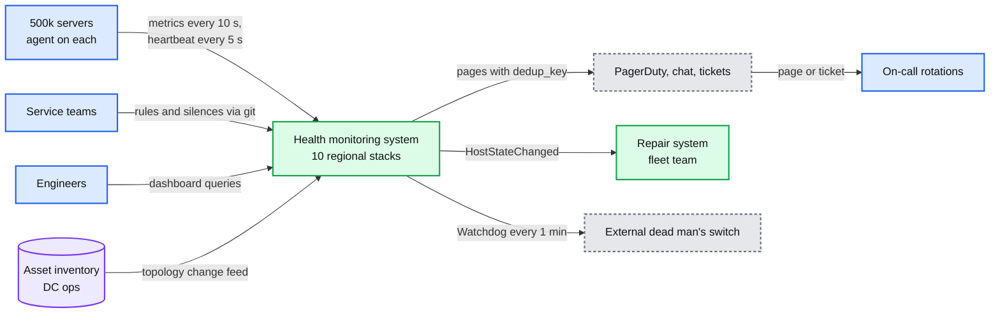

## D2. Data flow (DFD)

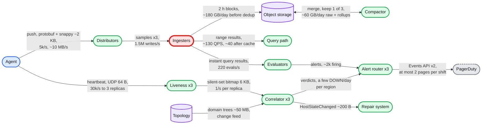

Push rate: 500k hosts / 10 s = 50k pushes/s globally, 5k/s per region. Heartbeats: 50k hosts / 5 s × 3 replicas = 30k/s per region. Blocks leave the ingesters 3 times (RF 3) and the compactor keeps one copy.

## D4. FR2 dashboard range query (happy path)

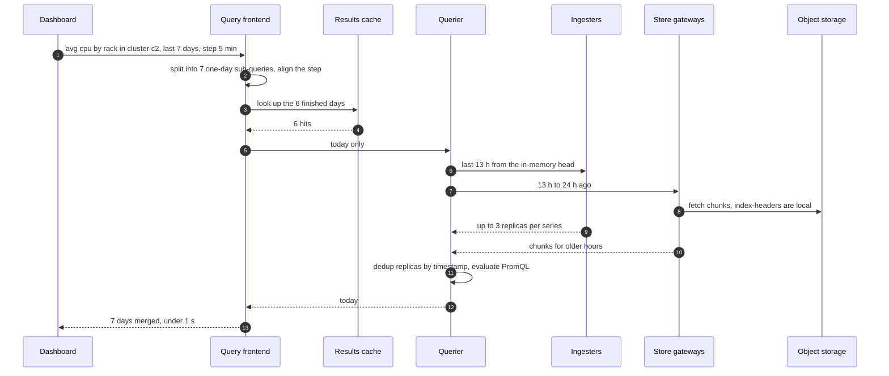

## D5. Ingester OOM-killed mid-write

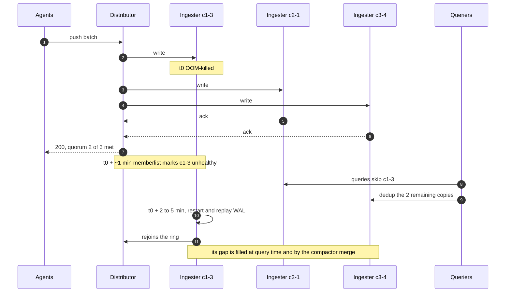

## D5. All rule evaluators die

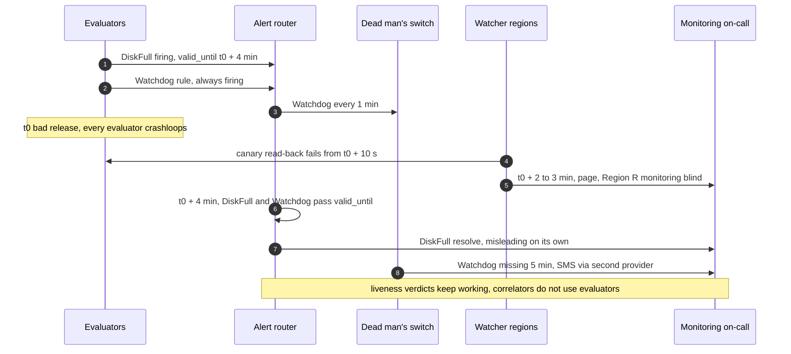

## D6. Remediation safety budget

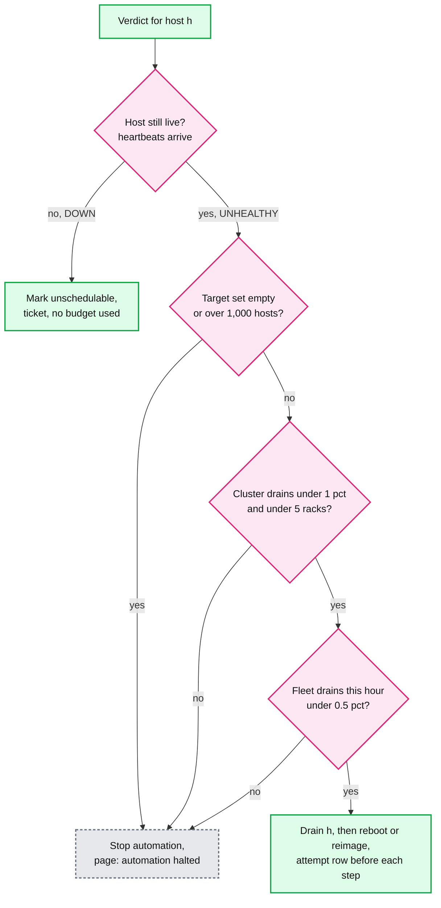

## D8. Alert lifecycle

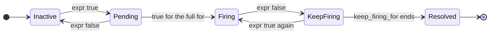

## D8. Incident lifecycle at the pager

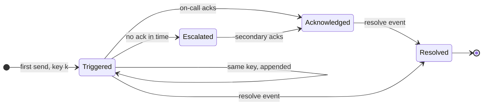

## D9. Deployment / topology

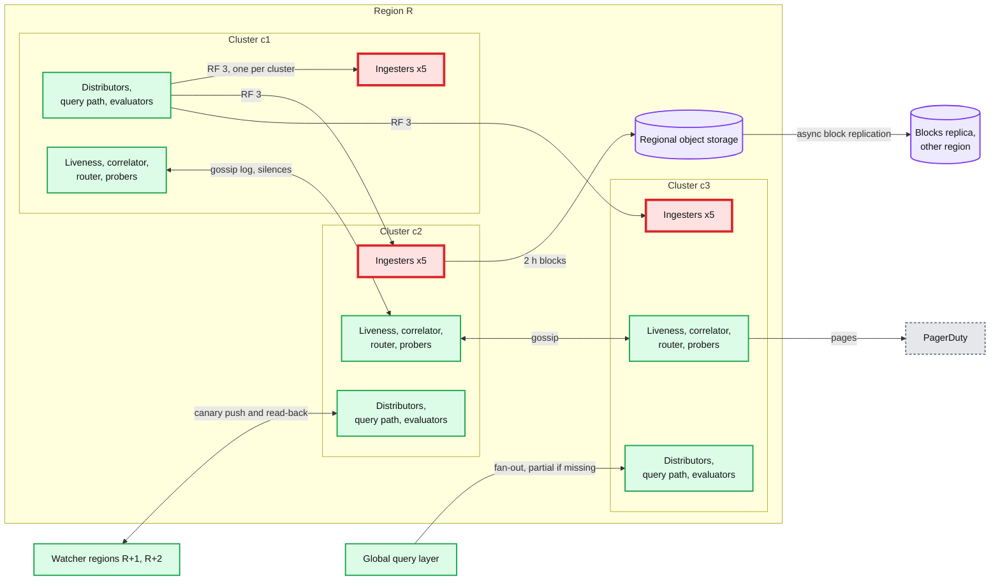

Each distributor pod writes every series to one ingester in each cluster; only c1's edges are drawn. Losing a whole cluster leaves 2 of 3 replicas of every component.

## D10. Hot tenant and the limit

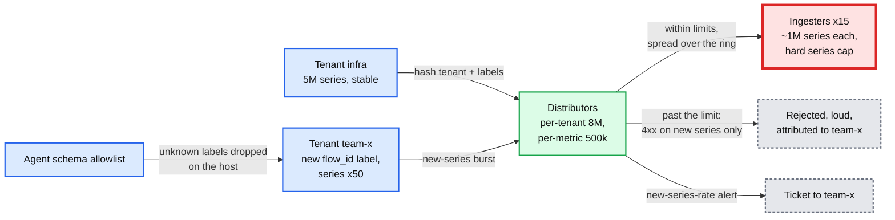

Existing series keep working when the limit trips; only new series are refused. Shuffle sharding (pinning each tenant to a subset of ingesters, as Mimir can) would shrink the blast radius further; it is an option, not part of the chosen design.

## D11. Failure mode map: metrics path

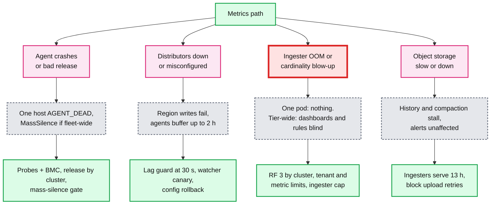

## D11. Failure mode map: alert path

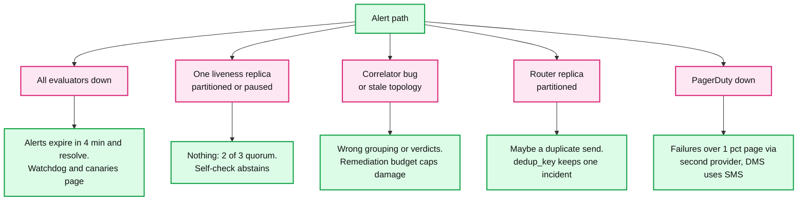

## D12. Rollout and migration

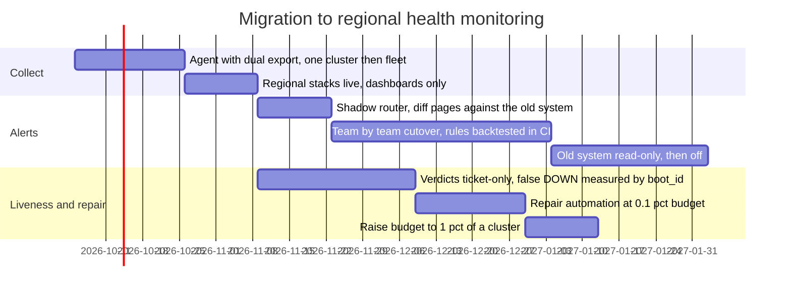

Rollback points: a1 pins the old agent version, b1 and b2 switch the receiver back to the old system, c2 and c3 set the budget to 0. Nothing is destructive.
