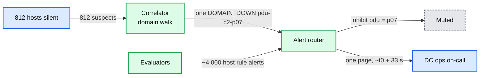
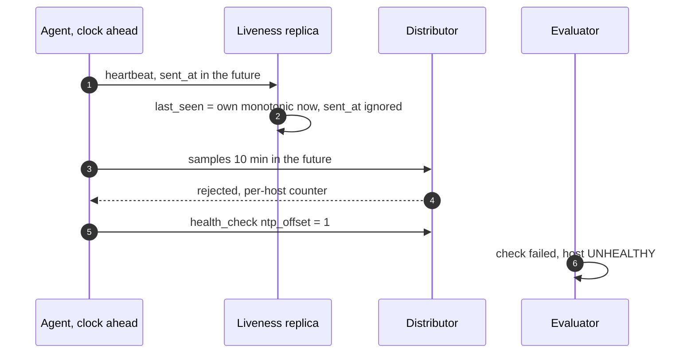
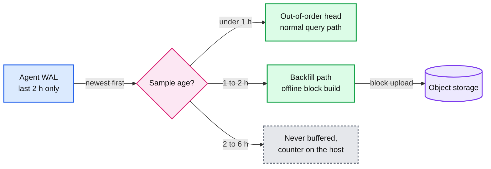
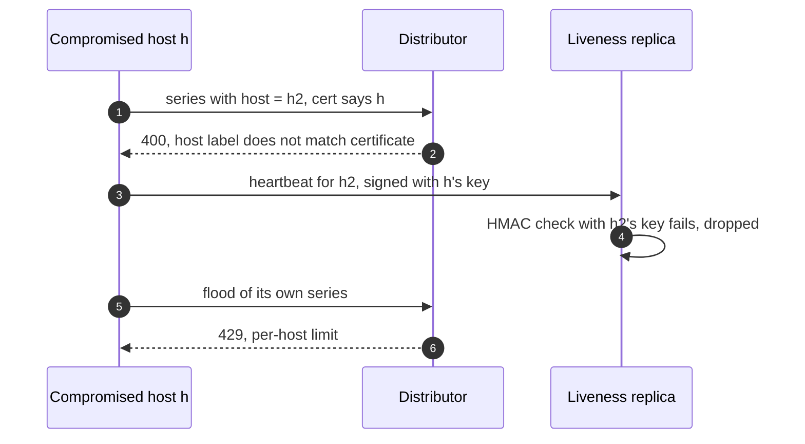

# Edge cases: Server-health monitoring and alerting

Every entry answerable in under 60 seconds out loud. Categories: failure, consistency, scale, data, operations, security. Design reference: [`solution.md`](solution.md).

---

## Failure

## Edge case: a PDU fails and 800 servers go dark at once
- **Trigger:** PDU p07 in cluster c2 trips. 812 hosts on 20 racks lose power together.
- **Symptom:** without correlation, 812 DOWN verdicts plus ~4,000 host rule alerts. With it, one page.
- **Answer:**
  - All 3 liveness replicas see the hosts silent between t0 + 15 and 20 s. The correlator's 5 s window finds 20 racks at 97 to 100% and the PDU at 98%, and reports one `DOMAIN_DOWN` for the PDU, not 20 racks (§5.6).
  - Probes are sampled: 5 hosts plus the PDU's Redfish endpoint, not 812 × 3.
  - The router inhibits every alert with `pdu=p07`. One page to DC ops at ~t0 + 33 s. Dead hosts use no remediation budget.
  - Power returns in waves. Hosts come back with new `boot_id`s, flappers are damped, `DOMAIN_DOWN` resolves at 90% healthy.
- **Diagram:**

- **Confidence:** [ ] shaky  [ ] ok  [ ] confident

## Edge case: the liveness replica in one cluster is partitioned from its hosts
- **Trigger:** the uplink of the replica in c1 flaps, or the replica pauses 20 s.
- **Symptom:** that replica sees up to 50k hosts silent. Nothing else happens.
- **Answer:**
  - SUSPECT needs 2 of 3 replicas (§5.5). The other two still hear every host.
  - The replica's self-check sees its receive rate drop more than 5% in 10 s, or its own scan loop run late. It abstains and alerts on itself.
  - If two replicas are cut at once, the mass-silence gate holds verdicts: more than 1% silent with no domain to explain it becomes one `MassSilence` alert plus probes of 20 sampled hosts.
- **Confidence:** [ ] shaky  [ ] ok  [ ] confident

## Edge case: an ingester is OOM-killed mid-write
- **Trigger:** memory spike, bad deploy, node failure.
- **Symptom:** one ingester restarting. Agents and dashboards see nothing.
- **Answer:**
  - Every series lives on 3 ingesters in 3 clusters. Writes still reach 2 of 3, so quorum holds and agents get 200 (§10.4).
  - Memberlist marks it unhealthy in ~1 min. Queriers dedup the other 2 copies.
  - Restart replays the WAL (2 h of ~1M series) in 2 to 5 min. The gap is filled at query time and by the compactor's merge.
  - If the cause is a cardinality blow-up, a restart OOMs again. See the `request_id` edge case.
- **Diagram:** [`diagrams.md` D5](diagrams.md#d5-ingester-oom-killed-mid-write).
- **Confidence:** [ ] shaky  [ ] ok  [ ] confident

## Edge case: a whole region's monitoring stack goes dark
- **Trigger:** region cut off from the network, or a bad config on every distributor.
- **Symptom:** nothing arrives from region R. Its router may not reach PagerDuty at all.
- **Answer:**
  - Watchers in R+1 and R+2 push a canary through R every 10 s. Round trip over 60 s for 2 min, or R unreachable, and they page "Region R monitoring blind" (§5.7).
  - R's Watchdog stops reaching the external dead man's switch, which pages by SMS after 5 min.
  - If only the distributors are broken, heartbeats still flow (separate path), liveness keeps working, and evaluators fire `RegionMonitoringDegraded` at 30 s of lag.
  - History is safe in replicated object storage. Global dashboards show `partial`.
- **Confidence:** [ ] shaky  [ ] ok  [ ] confident

## Edge case: PagerDuty is down
- **Trigger:** provider outage.
- **Symptom:** router sends fail or time out.
- **Answer:**
  - Routers retry with backoff and alert on their own notification failures over 1% for 5 min (§5.7).
  - That alert, and every page, falls back to a second provider (SMS gateway).
  - The dead man's switch lives outside our infrastructure and pages through a different provider, so even a total paging failure is noticed.
  - When PagerDuty returns, retried triggers carry the same `dedup_key`. No duplicate incidents.
- **Confidence:** [ ] shaky  [ ] ok  [ ] confident

## Edge case: all rule evaluators die at once
- **Trigger:** a bad evaluator release, or a rule that crashes the engine.
- **Symptom:** firing alerts pass `valid_until` = 4 × max(15 s, 1 min) = 4 min and the router resolves them. On-call sees "resolved" while the region is blind.
- **Answer:**
  - The Watchdog is an always-true rule run by the evaluators. When it stops, the dead man's switch pages within 5 min.
  - Watcher canaries are read back through R's evaluators, so they fail at once and page in 2 to 3 min.
  - Liveness verdicts come from the correlators, not the evaluators. DOWN and `DOMAIN_DOWN` keep working.
  - Every rule group runs on 2 evaluators in different clusters, and releases roll one cluster at a time. A bad release should stop at one cluster.
- **Diagram:** [`diagrams.md` D5](diagrams.md#d5-all-rule-evaluators-die).
- **Confidence:** [ ] shaky  [ ] ok  [ ] confident

## Edge case: the agent crashes but the server is fine
- **Trigger:** agent bug, agent OOM, an operator kills it.
- **Symptom:** metrics and heartbeats stop. The host still serves traffic.
- **Answer:**
  - SUSPECT at 15 s. Probers reach the host and the BMC says powered on, so the verdict is `AGENT_DEAD`, not DOWN (§5.5 decision flow).
  - `AGENT_DEAD` is a ticket plus an automatic agent restart. The host is not drained.
  - A release that kills agents fleet-wide trips the mass-silence gate: one `MassSilence` alert instead of thousands of `AGENT_DEAD`s. Agent releases start with one cluster.
- **Confidence:** [ ] shaky  [ ] ok  [ ] confident

## Edge case: a server answers pings but drops 50% of packets
- **Trigger:** bad NIC or cable. Dean's list: "racks go wonky", 40 to 80 machines at 50% packet loss.
- **Symptom:** heartbeats mostly arrive, probes mostly pass. Its clients see timeouts.
- **Answer:**
  - Silence cannot find it. Gray failure needs different evidence (§5.5 item 6).
  - Agent checks export NIC CRC errors and TCP retransmits. A peer-outlier rule makes a host UNHEALTHY at 10x its rack's median for 10 min. For a whole wonky rack, compare against the cluster median instead.
  - The strongest signal is its clients' RPC error rate by backend: differential observability, from the Gray Failure paper.
  - UNHEALTHY drains within the remediation budget.
- **Confidence:** [ ] shaky  [ ] ok  [ ] confident

---

## Consistency

## Edge case: two alert router replicas both send the same page
- **Trigger:** gossip partition between router replicas.
- **Symptom:** replica 1 cannot see replica 0's notification log entry.
- **Answer:**
  - Normally replica p waits p × 15 s and checks the gossiped log, so only replica 0 sends (§4.5).
  - In a partition both send. Both use `dedup_key` = hash of receiver + group key, so PagerDuty appends the second trigger to the same open incident.
  - Tickets use the same key for an idempotent create. When the partition heals the logs merge.
- **Diagram:** `solution.md` §6 Flow 4.
- **Confidence:** [ ] shaky  [ ] ok  [ ] confident

## Edge case: an evaluator restarts halfway through a 10 minute for window
- **Trigger:** deploy or crash 6 minutes into a `for: 10m`.
- **Symptom:** without saved state the timer restarts and the alert fires 6 minutes late.
- **Answer:**
  - The evaluator writes `ALERTS_FOR_STATE` to the TSDB and restores from it if the outage was under 1 h (§4.3 step 6).
  - Exact Prometheus rule: a `for` under the 10 min grace period is not restored at all. Ours is exactly 10 min, so it is restored, but only 4 min were left, which is under the grace period, so it fires 10 min after the restart, not 4.
  - The group's second evaluator, in another cluster, did not restart. Its timer fires on time and the router merges. Two owners are the real fix.
- **Confidence:** [ ] shaky  [ ] ok  [ ] confident

## Edge case: a server's clock is 10 minutes ahead
- **Trigger:** NTP broken on one host, drift grows.
- **Symptom:** its samples carry timestamps in the future.
- **Answer:**
  - Liveness is unaffected. Replicas judge by their own monotonic receive time and never read `sent_at` (§4.4 step 2).
  - The distributor rejects samples more than 10 min in the future, counted per host. Loud, not silently misplaced.
  - Long before 10 minutes, the agent's NTP-offset check (over 100 ms) marks the host UNHEALTHY.
- **Diagram:**

- **Confidence:** [ ] shaky  [ ] ok  [ ] confident

## Edge case: a host flaps up and down every few minutes
- **Trigger:** failing PSU, a kernel panic loop, a link that bounces.
- **Symptom:** DOWN, HEALTHY, DOWN. Each change is a notification and a repair ticket.
- **Answer:**
  - More than 3 state changes in 30 min puts it in FLAPPING: out of rotation, one ticket, no more state notifications until stable for 30 min (§5.6 item 4).
  - `keep_firing_for` on rules stops a metric hovering at a threshold from resolving and re-firing.
  - A bounce that returns with the same `boot_id` never rebooted. It shows up in the false DOWN SLI as a network verdict.
- **Confidence:** [ ] shaky  [ ] ok  [ ] confident

---

## Scale

## Edge case: someone ships a metric with a request_id label
- **Trigger:** a new collector or team metric with an unbounded label.
- **Symptom:** series per host go from 100 to thousands. Region series head from 5M toward 250M. Ingesters OOM-loop, and dashboards and rules go blind (§5.4).
- **Answer:**
  - The agent schema allowlist drops unknown labels on the host. Most never leave it.
  - The distributor rejects new series past the tenant limit (8M infra) or the metric limit (500k) with a 4xx. Existing series keep working.
  - An ingester hard cap rejects rather than OOMs. A new-series-rate alert tickets the owner.
  - A real need gets aggregated at collection: per-host totals, not per request.
- **Diagram:** [`diagrams.md` D10](diagrams.md#d10-hot-tenant-and-the-limit).
- **Confidence:** [ ] shaky  [ ] ok  [ ] confident

## Edge case: 500k agents reconnect at once after a network blip
- **Trigger:** a blip across a cluster or the fleet. Every agent has buffered pushes in its WAL.
- **Symptom:** many times the normal push rate at once. Distributors have 2x headroom.
- **Answer:**
  - Agents send their newest batch first, so evaluators see "now" at once, then backfill at up to 1x normal rate. A 10 min cluster backlog drains in ~17 min, inside the 1 h out-of-order window (§5.3).
  - The per-tenant rate limit (600k/s, burst 6M per region) returns 429. Agents back off with full jitter and keep buffering on disk.
  - Backfill is shed before fresh samples. Liveness is unaffected: heartbeats are a separate UDP path.
- **Diagram:** `solution.md` §5.3.
- **Confidence:** [ ] shaky  [ ] ok  [ ] confident

## Edge case: a dashboard query asks for 30 days of every host at 10 s resolution
- **Trigger:** a panel over every host dragged to 30 days.
- **Symptom:** raw would be 50k series × 259,200 samples = 13 billion samples.
- **Answer:**
  - The frontend picks the tier from the range: past 15 days it reads 5 min rollups. Still 50k × 8,640 = 432M points.
  - Per-query limits (100k series, 50M samples, 2 min) reject it with a message pointing at the recording rule (§5.1).
  - Recording rules precompute cluster and rack aggregates every minute: the fleet panel reads 30 series, ~260k points, ~50 ms.
  - Finished days come from the results cache.
- **Confidence:** [ ] shaky  [ ] ok  [ ] confident

## Edge case: the fleet grows 10x
- **Trigger:** 5M servers.
- **Symptom:** 500M series fleet-wide, 50M per region.
- **Answer:**
  - Ingesters go to ~150 per region, distributors scale with samples/s. Same design (§10.11).
  - Collection aggregation becomes the main lever (Monarch averages 36 inputs to 1). Split regions into more zones.
  - Liveness and correlators are per cluster already. The router scales with incidents, not hosts.
  - Storage grows to ~270 TB, still a few thousand dollars a month.
- **Confidence:** [ ] shaky  [ ] ok  [ ] confident

---

## Data

## Edge case: an agent upgrade renames a metric
- **Trigger:** `node_disk_io_time_ms` becomes `node_disk_io_time_seconds_total`.
- **Symptom:** rules on the old name go quiet without firing. Dashboards break.
- **Answer:**
  - The metric schema is a versioned contract. The agent emits both names for one release, inside the series budget.
  - CI backtests every rule on the last 7 days. A rule that selects zero series fails review.
  - A job-level `absent()` rule catches anything missed. The release goes to one cluster first.
- **Confidence:** [ ] shaky  [ ] ok  [ ] confident

## Edge case: backfilling 6 hours of buffered samples after an outage
- **Trigger:** a cluster was cut off for 6 hours.
- **Symptom:** agents hold data older than the ingesters accept.
- **Answer:**
  - The agent WAL caps at 2 h, so only the last 2 h exist. Older samples were dropped on the host, with a counter.
  - Newest first: the last hour lands in the 1 h out-of-order head (§5.3 item 2).
  - Samples 1 to 2 h old go to the backfill path (offline block build, uploaded to object storage) or are dropped with a counter.
  - Alerting never needed the old data. Dashboards show the 4 h gap as a gap.
- **Diagram:**

- **Confidence:** [ ] shaky  [ ] ok  [ ] confident

## Edge case: a host is decommissioned and its series linger
- **Trigger:** a host is removed from service.
- **Symptom:** liveness would declare it DOWN, absent rules would fire, dashboards show dead lines.
- **Answer:**
  - Decommission is a topology change. The inventory feed marks it retired, liveness and the correlator stop judging it, and the change system silences its alerts.
  - Its series stop getting samples and fall out of the in-memory head at the next head compaction. Disk data ages out with retention (15 d raw, 13 months rollups).
  - Active series drop, so tenant limits free up.
- **Confidence:** [ ] shaky  [ ] ok  [ ] confident

## Edge case: personal data ends up in a label
- **Trigger:** a team adds a `user_email` label.
- **Symptom:** personal data in the TSDB, kept 13 months in rollups.
- **Answer:**
  - Prevention: the agent allowlist, and CI rejects metrics with free-text labels (§10.10).
  - If it leaks: a relabel rule at the distributor drops the label at once. Then delete the series with tombstones plus compaction, raw and rollups.
  - Blocks are immutable, so deletion is a rewrite. Hours to days, not seconds. Say so.
- **Confidence:** [ ] shaky  [ ] ok  [ ] confident

---

## Operations

## Edge case: a bad health check marks 30% of a cluster unhealthy
- **Trigger:** a new check config ships with a wrong threshold.
- **Symptom:** ~5,000 UNHEALTHY verdicts in minutes.
- **Answer:**
  - The remediation budget allows 1% of a cluster (~170 hosts) and 5 racks at once, and 0.5% of the fleet per hour. Past it, automation stops and pages "automation halted, N pending" (§5.6 item 5).
  - Checks roll out one cluster first. The same check failing on 30% of hosts is a check problem, not 5,000 host problems.
  - The SRE book's Diskerase story (an empty set read as "everything") is why the empty-set and huge-set guards exist.
- **Diagram:** [`diagrams.md` D6](diagrams.md#d6-remediation-safety-budget).
- **Confidence:** [ ] shaky  [ ] ok  [ ] confident

## Edge case: planned maintenance on 20 racks
- **Trigger:** DC ops schedules power work on 20 racks.
- **Symptom:** ~800 hosts go dark on purpose.
- **Answer:**
  - The change system creates silences on those rack labels for the window (§3.1). The repair system skips hosts inside an approved change.
  - No remediation budget is used: the hosts are down, not being drained by automation.
  - Silences end on time. Racks not back by then raise `DOMAIN_DOWN` and page as usual.
- **Confidence:** [ ] shaky  [ ] ok  [ ] confident

## Edge case: rolling out a new alert rule that would page 500 times
- **Trigger:** a team writes a noisy rule.
- **Symptom:** it would blow the 2 pages per 12 h shift budget in an hour.
- **Answer:**
  - CI backtests it on the last 7 days: "would have fired 500 times" fails review (§4.3 step 1).
  - If it slips through, new rules start at ticket severity for a week and are promoted to page after.
  - Pages per rotation per shift is a dashboard metric. The rule that burns it is visible by name.
- **Confidence:** [ ] shaky  [ ] ok  [ ] confident

## Edge case: migrating from per-datacenter Nagios or Prometheus
- **Trigger:** today every datacenter has its own stack and hand-written pages.
- **Symptom:** risk of losing pages during the switch.
- **Answer:**
  - The agent exports both ways: `/metrics` for the old scrapers and push to the new stack (§8).
  - A shadow router diffs its pages against the old system for 2 weeks. Then team by team, with rules backtested in CI.
  - Liveness runs ticket-only for a month while the false DOWN rate is measured by `boot_id`. Repair automation starts at a 0.1% budget.
  - Rollback at every step is a receiver switch or a version pin.
- **Diagram:** [`diagrams.md` D12](diagrams.md#d12-rollout-and-migration).
- **Confidence:** [ ] shaky  [ ] ok  [ ] confident

---

## Security / abuse

## Edge case: a compromised server pushes fake metrics for other hosts
- **Trigger:** an attacker has root on host h.
- **Symptom:** h tries to write `host=h2` series, or fake heartbeats to keep a dead h2 "alive".
- **Answer:**
  - mTLS: the distributor rejects any series whose `host` label differs from the certificate (§10.10).
  - Heartbeats carry an HMAC with a per-host key. h cannot heartbeat as h2.
  - Per-host rate limits: h can only flood itself into 429s.
  - Worst case h lies about itself. Peer comparison and its clients' error rates still catch a sick h.
- **Diagram:**

- **Confidence:** [ ] shaky  [ ] ok  [ ] confident

## Edge case: someone creates a silence that matches every alert
- **Trigger:** an empty matcher or `alertname=~".*"` to "quiet things down" during an incident.
- **Symptom:** every page in the region stops.
- **Answer:**
  - Empty matchers are rejected. A silence that would match more than 1,000 alerts, or last over 7 days, needs a second approver (§10.10).
  - RBAC: a team can only silence alerts carrying its own owner label.
  - Silences are audited and listed on the on-call dashboard. The external dead man's switch cannot be silenced from inside.
  - It is the monitoring version of the empty-set bug.
- **Confidence:** [ ] shaky  [ ] ok  [ ] confident
