# HLD: Server-health monitoring and alerting

> One-line answer: an agent on every server samples ~100 health series every 10 s, runs local health checks, and pushes batches to a **region-local** metrics stack: stateless distributors hash each series onto a ring of ingesters that keep the last 2 h in memory with RF = 3 across the region's 3 clusters, and ship 2 h blocks to object storage. Rule evaluators run every alert rule every 15 s against that in-memory head. **Liveness is a separate path**: a 64 B heartbeat every 5 s goes to 3 liveness replicas, a host is suspect only when 2 of 3 miss it, probes from 3 other racks plus the BMC confirm it, and a topology correlator folds a rack, PDU or switch failure into **one** event. An HA alert router groups, inhibits and dedups, then pages with a dedup key. A single dead server is routine (30 to 80 a day across the fleet), so it goes to automated drain and repair, and a human is paged only for correlated failures, capacity and SLO symptoms. The stack depends on nothing it monitors and is watched from another region plus an external dead man's switch. The red node is the **ingester tier**: a cardinality explosion there OOMs the one component that both dashboards and alert rules read.

Sources: [Hello Interview, Metrics Monitoring](https://www.hellointerview.com/learn/system-design/problem-breakdowns/metrics-monitoring) (FR, NFR and deep-dive list; its ladder picks are premium, so the picks here are ours), [Monarch, VLDB 2020](https://www.vldb.org/pvldb/vol13/p3181-adams.pdf), [SRE book ch. 10 Practical Alerting](https://sre.google/sre-book/practical-alerting/), [SRE book ch. 11 Being On-Call](https://sre.google/sre-book/being-on-call/), [SRE workbook, Alerting on SLOs](https://sre.google/workbook/alerting-on-slos/), [Jeff Dean, LADIS 2009](https://www.cs.cornell.edu/projects/ladis2009/talks/dean-keynote-ladis2009.pdf), [Grafana Mimir capacity planning](https://grafana.com/docs/mimir/latest/manage/run-production-environment/planning-capacity/), [Alertmanager docs](https://prometheus.io/docs/alerting/latest/alertmanager/). Research notes in [`research/`](research/). Written flow-first: §4 builds one diagram one functional requirement at a time, §5 breaks and changes that design one non-functional requirement at a time, §6 is the final design plus the flows to rehearse.

---

## 1. Understanding the problem

Restate before designing. A fleet of servers in many datacenters. Engineers want graphs of every server's health. The on-call wants to be told, quickly and once, when something is broken. The fleet wants dead servers taken out of service and repaired without a human.

The pipeline half (collect, store, graph) is a well-known shape; [`../../concepts/time-series-db.md`](../../concepts/time-series-db.md) covers it end to end. Four things carry the Staff interview:
- **Deciding "dead" from silence.** A dead server sends nothing. So does a server behind a broken switch, and so does a healthy server whose monitor is partitioned. Every one of these looks the same from one observer.
- **One page per problem.** A PDU failure takes out 800 servers at once. Paging per server is 800 pages.
- **The monitor must outlive what it monitors.** If monitoring runs on the storage it watches, it goes blind in exactly the outage it exists for.
- **Series count, not bytes.** One bad label turns 5M series into 250M and OOMs the tier every alert rule reads.

### 1.1 Functional requirements

Core (after the web research, see [`README.md`](README.md#what-the-web-research-changed)):
1. **Ingest.** Health metrics from every server: ~100 series per server every 10 s (CPU, memory, disk, network, processes, hardware sensors).
2. **Dashboards.** Query and graph with label filters, aggregations and time ranges from 1 hour to 13 months.
3. **Alert rules.** Teams define "expression over a window, true for N minutes", owned, versioned, reviewed.
4. **Detect dead and unhealthy servers** with no rule written, and hand them to repair.
5. **Notify** the right on-call once per problem: PagerDuty, Slack, email, ticket. Grouping, dedup, silences, escalation.

Below the line (say it out loud):
- Logs and traces. Separate pipelines; alerts link to them.
- ML anomaly detection. A consumer of recorded series that emits alerts into the same router. The seam is named in §10.11.
- Per-container and per-request metrics. Different cardinality profile, separate tenant with its own limits.
- The repair workflow itself (drain, reimage, RMA). Owned by the fleet team; we emit the events it consumes.

**What "healthy" means** (agree this before drawing anything):

| State | Meaning | Who acts |
|---|---|---|
| HEALTHY | Heartbeats arrive, local checks pass, not an outlier against its peers | Nobody |
| UNHEALTHY | Heartbeats arrive, but a check fails (disk read-only, ECC storm, NTP off) or it is a 10x outlier on errors vs its rack | Automation drains it, within a safety budget |
| SUSPECT | 2 of 3 liveness replicas have not heard from it for 15 s | Probers, for ~5 s |
| DOWN | Suspect and unreachable from 2 of 3 probers in other racks | Automation: tell the scheduler, open a repair ticket |
| AGENT_DEAD | Heartbeats stopped but probes and BMC say the host is up | Agent team ticket, restart agent |
| DOMAIN_DOWN | ≥ 50% of a rack, PDU or switch domain went DOWN in the same window | **Page** datacenter ops, once |
| MAINTENANCE | Inside an approved change (reboot, rack move, firmware) | Nobody. Silenced, not counted as a suspect, skipped by repair |

**What pages and what does not:**

| Event | Rate across the fleet (§2) | Routed to |
|---|---|---|
| One server DOWN or UNHEALTHY | 30 to 80 a day | Repair automation plus a ticket. Never a page |
| A rack, PDU or switch DOWN | ~2 a day | Page datacenter ops for that region |
| A cluster below 95% healthy capacity | rare | Page the fleet on-call |
| A service's SLO burn rate (14.4x over 1 h) | per service | Page that service's on-call |
| The monitoring pipeline itself degraded or blind | rare | Page the monitoring on-call from another region |

### 1.2 Non-functional requirements

Ask for scale first. Hello Interview's number is 500k servers at 100 series every 10 s. Keep it.

| Dimension | Target | Why this number |
|---|---|---|
| Scale | 500k servers, 10 regions × 3 clusters. 100 series per server, 10 s. **5M samples/s, 50M active series** | Hello Interview baseline. Each cluster is a datacenter building with its own power and network |
| Host verdict latency | Hard-down server marked DOWN in **30 s p99** | Nothing downstream acts faster. Kubernetes waits 50 s ([kube-controller-manager](https://kubernetes.io/docs/reference/command-line-tools-reference/kube-controller-manager/)) |
| Page latency | Correlated failure paged in **60 s p99**. Threshold rule fires within **15 s** of its `for` window closing | Hello Interview: under 1 minute from emission to firing |
| False verdicts | **Zero** pages caused by a partition on the monitoring side. False DOWN < 0.1% of DOWN verdicts | A false DOWN drains a healthy server; a false storm burns trust in every future page |
| Page budget | ≤ **2 incidents per 12 h shift** per rotation on average | [SRE book, Being On-Call](https://sre.google/sre-book/being-on-call/): 6 h of work per incident, so 2 per 12 h shift is the max |
| Availability | Alert path **99.99%** per region. Dashboards 99.9% | Monitoring must be more available than what it watches |
| Consistency | Metrics eventual, partial results allowed and labelled. Pages at-least-once with a dedup key | Monarch trades consistency for availability on the alert path (§2 of the paper) |
| Freshness | Dashboards show data < 30 s old. Late samples up to 1 h accepted | Agents buffer through network blips |
| Durability | Lose ≤ 1 push (10 s) of one host on any single failure. Raw 15 d, 5 min rollups 90 d, 1 h rollups 13 months | 2 weeks of incident lookback, year-over-year capacity graphs |
| Query latency | p99 < 1 s for a 6 h panel over ≤ 10k series. < 5 s for 30 days | Hello Interview: "within seconds, even for weeks" |

Below the line: strong consistency of samples, exactly-once samples (samples are idempotent, §10.5), cross-region replication of raw data (object storage replicates blocks; ingest stays regional).

---

## 2. Back-of-envelope

**Fleet.** 500k servers in 10 regions × 3 clusters = 30 clusters of ~16.7k servers. 40 servers per rack gives ~420 racks per cluster. A PDU feeds ~20 racks, ~800 servers (Dean's slides: a PDU failure takes out 500 to 1,000 machines).

**Samples.** 500k × 100 / 10 s = **5M samples/s**, **50M active series**. Per region: 50k servers, **500k samples/s, 5M series**.

**Wire bytes.** Hello Interview prices a point at 100 to 200 B, so 1 GB/s. That is one JSON object per sample. A batched protobuf push of 100 samples with snappy is ~2 KB (labels repeated per series, ~20 B/sample): 500k × 2 KB / 10 s = **~100 MB/s global, ~10 MB/s per region**. 10x less, and it never crosses a region.

**Stored bytes.** Gorilla-style chunks store ~1.4 B/sample ([Gorilla](https://www.vldb.org/pvldb/vol8/p1816-teller.pdf); Prometheus quotes 1 to 2 B). 5M × 1.4 B = 7 MB/s = **~600 GB/day** after the compactor keeps one of the 3 replicas.

| Tier | Math | Size |
|---|---|---|
| Raw 10 s, 15 days | 50M series × 8,640 samples × 1.4 B × 15 | ~9 TB |
| 5 min rollup, 90 days | 50M × 288 points × 5 aggregates × 2 B × 90 | ~13 TB |
| 1 h rollup, 13 months | 50M × 24 × 5 × 2 B × 395 | ~5 TB |
| Total in object storage | | **~27 TB, ~$620/month** at $0.023/GB |

Storage is not the problem. Say it and move on.

**Ingester memory** (the red node). Mimir's sizing rule: in-memory series = active × RF, and each 300k in-memory series needs 1 core, 2.5 GB RAM, 5 GB disk ([planning capacity](https://grafana.com/docs/mimir/latest/manage/run-production-environment/planning-capacity/)). Per region: 5M × 3 = 15M in-memory series = **50 cores, 125 GB RAM, 250 GB disk**. Run 15 ingesters (5 per cluster) at 8 cores and 16 GB: ~1M series each, 8.3 GB used, 2x headroom for a spike. Global: 150 ingesters.

**Distributors.** Mimir: 1 core and 1 GB per 25k samples/s. 500k/s per region = **20 cores** at steady state. Run 10 pods of 4 cores: 2x headroom for a reconnect storm (§5.3).

**Heartbeats.** 64 B every 5 s to 3 replicas: 500k / 5 × 3 = **300k msgs/s global, 30k/s per region, 10k/s per replica**, 640 KB/s. A `last_seen` map of 50k hosts × ~40 B = 2 MB. Trivial by design.

**Rules.** Assume 3,000 alerting and 300 recording rules per region, every 15 s: **220 evaluations/s per region**. At ~100 ms each that is ~22 cores (Mimir: a rule evaluation costs a query).

**Failures.** Two views from Jeff Dean's LADIS 2009 slides. "Typical yearly flakiness": servers crash at least twice, a **2 to 4% failure rate**, and even 30-year-MTBF servers give one failure a day per 10,000. "Typical first year for a new cluster": ~1,000 machine failures, ~20 rack failures of 40 to 80 machines, ~1 PDU failure of 500 to 1,000 machines. Applied to 500k servers and 30 clusters:

| Event | Per year | Per day |
|---|---|---|
| Single machine failure | 10,000 to 30,000 (2 to 4%, or 1,000 per cluster) | **30 to 80** |
| Rack failure | ~600 (20 per cluster) | **~1.6** |
| PDU failure | ~30 (1 per cluster) | one every ~12 days |

If every dead machine paged, the fleet on-call would get 15 to 40 pages per 12 h shift against a budget of 2. **This single number forces the design: single-host failures go to automation, and only correlated failures page.**

**Alert volume in a PDU failure.** 800 hosts × ~5 host-scoped rules (absent, disk, NTP, ...) = ~4,000 alerts inside ~30 s, plus 800 DOWN verdicts. Mimir sizes the alert router at 1 GB per 5,000 firing alerts and 1 core per 100 notifications/s. Memory is fine. The problem is the human, not the router.

**Queries.** 2,000 engineers with dashboards open, 20 panels, 30 s refresh = 1,333 QPS global, ~130 per region. Mimir: 1 querier core per 10 QPS = 13 cores. Recording rules and a results cache cut it further (§5.1).

**Verdict budget** (hard-down host, p99 30 s):

| Step | Time |
|---|---|
| Last heartbeat to "silent" at a replica (3 intervals) | 15 s |
| Replica scan tick | ≤ 1 s |
| Probes from 3 racks, 1 s timeout, 1 retry, in parallel | ≤ 3 s, overlapped with the next step |
| Correlation window (one heartbeat phase) | 5 s |
| **Verdict** | **~21 s, 30 s p99** |
| Router `group_wait` for page severity, then send | 10 s + ~2 s |
| **Page on the phone** | **~35 to 45 s, 60 s p99** |

---

## 3. The set-up

Data-processing style: system interface, a deliberately naive data flow, then the data model.

### 3.1 System interface

**Input**
- Metrics push (agent to distributor): `POST /api/v1/push`, protobuf remote-write batch, snappy, mTLS with the host's certificate. `[{labels: {__name__, host, cluster, rack, ...}, samples: [(ts_ms, value)]}]`. ~100 series per push, every 10 s.
- Heartbeat (agent to liveness replicas): `{host_id, boot_id, seq, sent_at}`, 64 B over UDP with an HMAC, every 5 s, to all 3 replicas of the region.
- Topology (asset inventory to topology service): `host → rack → PDU → power row → cluster`, `host → ToR switch → aggregation block → cluster`, owner team, hardware class. A change feed.
- Rules: `PUT /v1/rules/{namespace}/{group}` from CI after a git merge. `{name, expr, for, keep_firing_for, severity, labels, annotations.runbook}`.
- Silences: `POST /v1/silences {matchers, starts_at, ends_at, created_by, comment}`. Also created automatically by the change system for planned maintenance.

**Output**
- `GET /api/v1/query_range?query=&start=&end=&step=` → matrix plus `partial: true` and the list of missing regions if any.
- Notifications: PagerDuty Events API v2 `{routing_key, event_action: trigger|resolve, dedup_key, payload: {summary, severity, source, custom_details}}`, Slack, email, ticket.
- Host health events (to the repair system): `HostStateChanged {host_id, boot_id, from, to, reason, evidence, verdict_id}` on a queue.
- `GET /v1/hosts/{host}/health` → state, since, reason, evidence (which replicas, which probes).

### 3.2 Data flow (deliberately naive)

1. Every server POSTs its 100 metrics as JSON every 10 s to a metrics API.
2. The API inserts rows `(host, metric, ts, value)` into a Postgres table.
3. A cron job runs every rule as SQL every minute and emails the owner for each row that matches.

What breaks, in the order an interviewer finds it:
- **Writes.** 5M rows/s into a B-tree at ~100 B per row with index. One Postgres node takes tens of thousands of inserts/s. Retention is a multi-hour `DELETE` plus vacuum every day.
- **Dead servers are invisible.** A dead server sends nothing, so no row matches any rule. The system goes quiet at exactly the wrong time.
- **Storms.** A PDU failure sends 800 × 5 emails.
- **Latency.** Cron every minute plus a scan of the last minute of 300M rows.
- **The monitor dies with the thing it watches.** Postgres in one datacenter.

§4 fixes each of these.

### 3.3 Data model

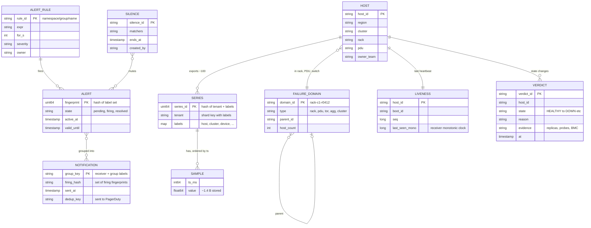

Access patterns that justify it:
- **"CPU of host h, last 6 h"** looks up series by labels through the inverted index, then reads one chunk run per series. Series are hashed onto ingesters by `(tenant, labels)`, so one host's 100 series spread over the ring. Fine: queries fan out to 15 ingesters anyway.
- **"Every host with disk > 90%"** is a rule: one metric name, 50k hosts × ~4 mounts = 200k series, latest sample only. Served from the in-memory head.
- **"Has host h heartbeated in 15 s?"** is a hash map lookup in a liveness replica. Never touches the TSDB.
- **"All hosts on PDU p"** comes from the topology cache, loaded into every correlator for its own region (50k hosts × ~100 B = 5 MB).
- **"Did we already page for group g with this firing set?"** is the notification log, keyed by group key, gossiped between router replicas.
- Partition key everywhere is **region**: nothing on the ingest or alert path crosses a region.

---

## 4. High-level design

One subsection per functional requirement. Each traces input to output, adds boxes to one diagram, and ends with what is still missing. §5 fixes the gaps.

### 4.1 Ingest: every server's health series land in a region-local store

**Push or pull?** The first question an interviewer asks. Compressed ladder:

| Option | What it buys | Why it breaks here |
|---|---|---|
| Pull: central scrapers per cluster (Borgmon, Prometheus) | Scrape failure is a free "up" signal. Monitoring controls the rate | 500k targets need service discovery and a sharded scraper fleet. The "up" signal comes from one scraper, the single observer problem of §5.5 |
| Push from an agent | Agent batches, buffers to local disk through outages, crosses firewalls. Monarch is push | Silence carries no information. A dead host and a quiet host look the same |
| **Push metrics plus a separate tiny heartbeat** | Everything push gives, and liveness gets its own cheap, fast, quorum-observed path | Two paths to run. Worth it: Kubernetes made the same split (a Lease renewed every 10 s, the big NodeStatus only every 5 min, per [node status docs](https://kubernetes.io/docs/reference/node/node-status/)) |

**Flow**

1. The agent on each server reads `/proc`, sysfs, SMART, and IPMI sensors every 10 s: ~100 series. It only ships metrics and labels on its allowlist (schema shipped with the agent config). Every series carries `host`, `cluster`, `rack`, `region`.
2. It appends the batch to a local WAL (a few MB for 2 h) and pushes it to the region's distributor VIP: protobuf, snappy, mTLS with the host certificate.
3. A **distributor** (stateless) checks that the `host` label matches the certificate, validates labels, rejects samples more than 10 min in the future (a bad clock), applies per-tenant limits, hashes `(tenant, labels)` onto the ingester ring, and writes to 3 ingesters, **one in each of the region's 3 clusters**. It acks the agent after 2 of 3 succeed.
4. An **ingester** appends to its WAL on local SSD and to the series' open chunk in the in-memory head (last 2 h). Every 2 h it cuts an immutable block and uploads it to **object storage**.
5. The agent drops WAL segments once acked. If distributors are unreachable it keeps buffering and retries with jittered backoff.

```mermaid
%% Incremental diagram, step 1 of 5: ingest. Agents push to a region-local ring of ingesters, RF 3 with one replica per cluster. Red: ingesters hold every active series in memory.
flowchart LR
    AG[Agent on each server<br/>100 series every 10 s<br/>local WAL] -->|"1. push batch, ~2 KB<br/>mTLS, 50k hosts per region"| DIST[Distributors<br/>stateless, limits,<br/>hash series to ring]
    DIST -->|"2. RF 3, one per cluster<br/>ack on 2, 500k samples/s"| ING[Ingesters x15<br/>2 h head in RAM + WAL]:::critical
    ING -->|"3. 2 h blocks"| OBJ[(Object storage<br/>blocks per region)]

    class AG client
    class DIST service
    class OBJ store

    classDef client   fill:#dbeafe,stroke:#2563eb,stroke-width:2px,color:#111
    classDef service  fill:#dcfce7,stroke:#16a34a,stroke-width:2px,color:#111
    classDef store    fill:#ede9fe,stroke:#7c3aed,stroke-width:2px,color:#111
    classDef critical fill:#fee2e2,stroke:#dc2626,stroke-width:4px,color:#111
```

**Still missing:** nobody can read it. Nothing decides a server is dead.

### 4.2 Dashboards: query and graph from 1 hour to 13 months

**Flow**

1. The dashboard UI sends PromQL range queries to the **query frontend**. It splits a long range into one sub-query per day, aligns the step so results are cacheable, serves finished days from a **results cache**, and queues per tenant for fairness.
2. **Queriers** fan out: the last 13 h to the ingesters (in memory), older ranges to **store gateways**, which keep block index-headers on local disk and fetch chunks from object storage. Queriers merge and dedup the 3 replicas per series by timestamp.
3. The **compactor** merges each region's 2 h blocks into bigger ones, keeps one of the 3 replica copies, and writes 5 min and 1 h downsampled blocks (count, sum, min, max, counter per point, so `rate` and `max` still work).
4. The query frontend picks the resolution from the step: raw for steps under 5 min, 5 min rollups for ranges past 15 days, 1 h past 90 days.
5. A global query (fleet-wide) goes to a thin global query layer that fans out to the 10 regional frontends and marks the result `partial` if a region does not answer.

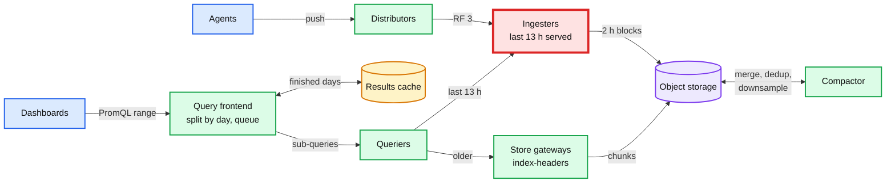

**Still missing:** nobody watches graphs at 3 am. Nothing fires.

### 4.3 Alert rules: teams define thresholds over windows

**Flow**

1. A team writes a rule in git: `expr: node_filesystem_avail_bytes / node_filesystem_size_bytes < 0.05`, `for: 10m`, `severity: ticket`, `owner: storage-team`, `runbook: <link>`. CI parses it, estimates how many series it selects, and **backtests it on the last 7 days**: "this would have fired 212 times". A rule that would page more than a few times a week fails review.
2. Rule groups are spread over **rule evaluators** by a hash ring. Each group is owned by **2 evaluators in different clusters**. Both evaluate; the router dedups (§4.5). No leader election, so nothing on this path needs a lock service.
3. Every 15 s each evaluator runs the group's rules as instant queries **against the ingesters only** (the in-memory head). Rules never read object storage.
4. Per label set, an alert moves `inactive → pending → firing → resolved`. `pending` lasts the rule's `for`. `keep_firing_for` stops a flapping metric from resolving and re-firing.
5. Firing alerts go to the alert router every evaluation, each with `valid_until = now + 4 × max(eval interval, resend delay)`, the rule Prometheus uses (`rules/alerting.go`). If the evaluator vanishes, the alert expires by itself. That is why §5.7 watches the evaluators.
6. The evaluator writes `ALERTS_FOR_STATE` back to the TSDB, so a restarted evaluator does not silently lose a long `for` timer. The exact Prometheus rule (`RestoreForState` in `rules/group.go`, outage tolerance 1 h, grace 10 min): a `for` under 10 min is not restored and starts again; a timer with under 10 min left fires exactly 10 min after the restart; a longer one resumes with the downtime not counted. The group's second evaluator, which did not restart, is what keeps the alert on time.
7. **Host-local checks run in the agent**, not centrally: disk read-only, SMART pre-fail, corrected ECC rate, NTP offset > 100 ms, kernel hung task. The agent exports `health_check{check="disk_ro"} 0|1`. Central rules only aggregate check results and compare hosts to their peers.

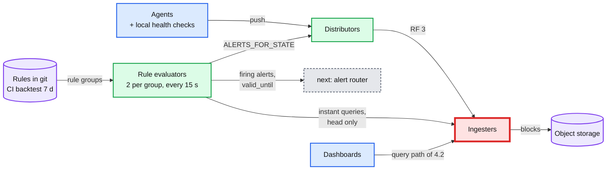

**Still missing:** a dead server sends nothing, so `disk < 5%` on it simply goes quiet. `absent()` per host would work for one server, but 50k absent rules per region evaluated through one observer is the single-observer problem again. Something has to own "down".

### 4.4 Detect dead and unhealthy servers with no rule written

The idea: **silence is only evidence when several independent observers agree and a second channel confirms it.**

**Flow**

1. The agent sends a 64 B heartbeat `{host_id, boot_id, seq, sent_at}` every 5 s to **all 3 liveness replicas** of its region, one per cluster. It is a separate UDP path, so a backed-up metrics push never delays it.
2. Each replica keeps `last_seen[host]` on its own monotonic clock (2 MB for 50k hosts). Every second it publishes the set of hosts silent for 15 s (3 intervals). It judges by its own receive time, never by `sent_at`, so host clock skew cannot fool it.
3. The **correlator** (3 replicas, one per cluster, each doing the same deterministic computation) marks a host SUSPECT only when **2 of 3 replicas** report it silent. One replica behind a broken uplink cannot create a suspect.
4. It asks **probers** in 3 other racks of the same cluster, not sharing the suspect's rack or PDU, to ICMP ping it and TCP connect to the agent port, and it asks the **BMC** over the out-of-band management network for power state.
5. It holds suspects for a 5 s window (one heartbeat phase, so every member of a failed rack has had time to go silent), then walks the **failure-domain tree** from the topology service bottom-up: rack, then PDU and ToR switch, then cluster. A domain with ≥ 50% of its hosts suspect (and ≥ 5 hosts) becomes **one DOMAIN_DOWN event** carrying its host list, and absorbs its hosts.
6. Verdicts for the rest: unreachable from 2 of 3 probers → DOWN. Probes succeed, BMC on, agent silent → AGENT_DEAD. The verdict table is in §5.5.
7. Verdicts go two ways: as alerts to the router (§4.5), and as `HostStateChanged` events on a queue to the **repair system** (fleet team): tell the scheduler, open a ticket, reboot, reimage, RMA.
8. UNHEALTHY comes from the evaluators: a failed local check, or a peer-outlier rule (host error rate 10x its rack's median for 10 min). It rides the same path.
9. Planned work is not a failure. The change system marks the hosts of an approved change MAINTENANCE for its window: the router silences them, the correlator leaves them out of suspect counts and domain fractions, and the repair system skips them. A host still silent when the window ends becomes an ordinary suspect.

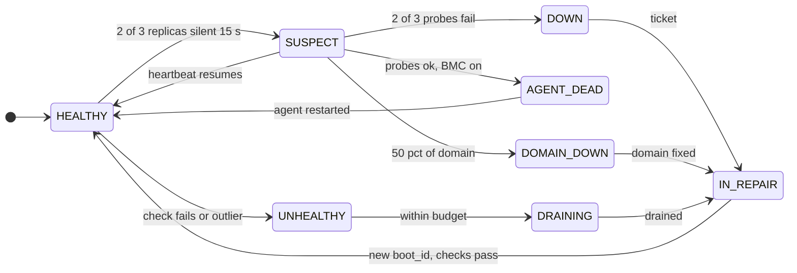

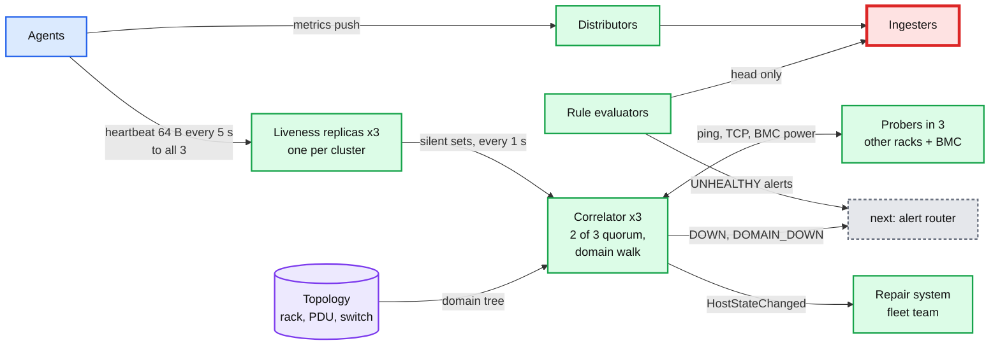

**Still missing:** 2 evaluators and 3 correlators send the same alert up to 3 times. Nothing groups, silences, routes or pages.

### 4.5 Notify the right on-call once per problem

**Flow**

1. Every evaluator and correlator replica sends its alerts to **all 3 alert router replicas** of the region, one per cluster. Never through a load balancer: the Alertmanager docs say to point senders at the full list, because each replica must see every alert to dedup.
2. Each router replica first **enriches** every host alert with `pdu`, `tor` and `owner_team` from its local topology file (series only carry `host`, `cluster`, `rack`, `region`). Then it does the same work as its peers: **route** by labels (`owner_team`, `severity`) to a receiver, **group** by `(alertname, cluster, failure_domain)`, **inhibit** (a DOMAIN_DOWN for rack r mutes every host alert with `rack=r`; `RegionMonitoringDegraded` mutes host-scoped rule alerts in that region; `MassSilence` mutes per-host DOWN verdicts), and **silence** (maintenance silences are created by the change system, not by hand).
3. A new group waits `group_wait` (10 s for page severity, 30 s otherwise) so late members of the same failure join it. Then replica number p waits p × 15 s (`--cluster.peer-timeout`, default 15 s) and checks the **gossiped notification log**. If a peer already sent this group with this firing set, it does nothing.
4. Pages go to PagerDuty with `dedup_key = hash(receiver, group key)`. If a partition makes two replicas both send, the second trigger lands on the same open incident. Tickets are created idempotently with the same key.
5. Updates go out every `group_interval` (5 min) only if the firing set changed. Still-firing groups repeat every 4 h. When every member resolves, a resolve event closes the incident.
6. **Severity decides the receiver.** Single-host DOWN and UNHEALTHY: ticket plus automation, no page. DOMAIN_DOWN, cluster capacity below 95%, SLO burn rate, monitoring degraded: page.

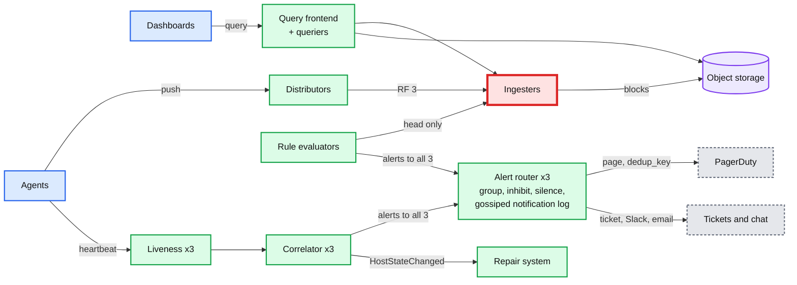

**Still missing:** everything in §5. Weeks-long queries are slow, the latency budget is not proven, a reconnect storm or a bad label can take out the ingesters, a partition can still fool the liveness path, and nobody watches this stack.

---

## 5. Deep dives

One per non-functional requirement, phrased as the interviewer's question. §5.1 to §5.4 are Hello Interview's four. §5.5 to §5.7 are what makes this a server-health question. Each says what breaks in the §4 design, the fix, and what changed.

### 5.1 "How do dashboards over weeks of data return in seconds?"

**What breaks in §4.** A "CPU for every host in the region, last 30 days" panel at a 10 s step selects 50k series × 259,200 samples = **13 billion samples** to decode. That is minutes of CPU and tens of GB through a querier. 130 dashboard refreshes per second per region multiply it.

| Rung | Approach | What breaks next |
|---|---|---|
| Bad | Bigger queriers over raw data | Cost grows with range × series. A 13 month panel reads 3.4 M samples per series |
| Good | **Downsampled blocks.** Compactor writes 5 min and 1 h rollups with count, sum, min, max, counter per point. The frontend picks the tier from the step | 30 days at 5 min is 8,640 points per series: 50k series is still 432 M points for a fleet panel |
| Great | Plus **recording rules**: evaluators precompute `cluster:cpu_util:avg`, `rack:disk_full:count` every 1 min, so a fleet panel reads 30 series, not 50k. Plus the frontend **splits by day and caches finished days** (past days never change), aligns steps, and enforces limits (100k series, 50 M samples, 2 min per query) | Recording rules are another thing to own and review. A drill-down still hits raw data, which is fine because it is one cluster or one host |

Numbers after the fix: a fleet CPU panel for 30 days reads 30 recorded series × 8,640 points = 260k points, ~50 ms. A single host for 30 days reads 100 series × 8,640 = 864k points. The results cache serves 29 of 30 days on refresh.

Push back on the textbook: some designs add an OLAP store (Druid, ClickHouse) for dashboards. Not here. The questions are "this metric, these labels, this range", which a TSDB with rollups answers. OLAP earns its place for ad-hoc "group by anything" over wide events, which is a logs or product-analytics question.

**What changed:** the compactor downsamples, evaluators run recording rules, the query frontend gained a results cache and limits. Details: [`deep-dives/query-and-retention.md`](deep-dives/query-and-retention.md).

### 5.2 "How do alerts fire in under a minute?"

**What breaks in §4 with textbook defaults.** Prometheus defaults are scrape 1 min, evaluate 1 min, Alertmanager `group_wait` 30 s ([configuration](https://prometheus.io/docs/prometheus/latest/configuration/configuration/)). Worst case ~2.5 min before a notification even without a `for`. A Kafka hop with 30 s of consumer lag adds 30 s to every alert in that partition.

**The latency budget, emission to page, for a threshold rule with `for: 0`:**

| Hop | Worst case | How |
|---|---|---|
| Sample taken to pushed | 10 s | Agent pushes every 10 s |
| Distributor to ingester head | ~1 s | Synchronous, ack on 2 of 3 |
| Head to evaluation | 15 s | Eval every 15 s, head only, never object storage |
| Evaluation to router | < 1 s | Sent immediately on first fire |
| Router `group_wait` (page severity) | 10 s | Batches the other members of the same failure |
| Router to PagerDuty to phone | ~5 s | |
| **Total** | **~40 s** | Under the 1 minute target with margin |

Faster where it matters:
- **Host-local checks in the agent** fire within one push (10 s): the agent already knows its own disk is read-only.
- **Liveness does not wait for any rule**: the §4.4 path has its own 30 s verdict.
- **Symptom alerts use burn rates, not raw thresholds.** The SRE workbook pages at a 14.4x burn over 1 h with a 5 min short window (2% of a 30-day budget), and at 6x over 6 h with a 30 min window ([Alerting on SLOs](https://sre.google/workbook/alerting-on-slos/)). The short window is what makes it both fast and quiet.

Push back on the textbook: "use Flink to evaluate rules on the stream" is the reflex answer for sub-minute alerting. The head block is already in memory and evaluating every 15 s gives ~40 s end to end. A stream engine adds a second rule language, its own state and checkpoints, and a Kafka dependency on the alert path. It earns its place only for per-event rules under a second, which this problem does not have. Hello Interview's own example, Amazon alerting on "milliseconds since the last order", is a metric designed to move fast, not an engine choice.

**One thing no rule can do: see missing data.** `disk < 5%` on a dead host does not fire, it goes quiet. That is why §4.4 exists, and why each job also gets one `absent(up{job="x"})` style rule at the job level, not per host.

**What changed:** eval interval 15 s, evaluators pinned to the head (`query_ingesters_within` style), `group_wait` 10 s for pages, checks in the agent. Details: [`deep-dives/alert-evaluation-and-latency.md`](deep-dives/alert-evaluation-and-latency.md).

### 5.3 "How does it stay up during spikes and failures?"

**What breaks in §4.**
- **Reconnect storm.** A 10 minute network blip in a cluster. 16.7k agents each buffered 60 pushes. When the link returns they all flush at once: 60x the normal rate for that cluster, and the distributors fall over.
- **Stale alerts.** If the flush is oldest-first, the ingesters spend minutes writing the past while the evaluators look at a head with no "now" in it. Every rule sees stale data exactly when an incident just happened.
- **An ingester dies** with 2 h of its series in memory.
- **A cluster dies**, taking a third of every component with it.

**Fixes.**
1. **Newest first.** After a reconnect the agent sends its latest batch first, then backfills older batches at up to its normal rate again, on top of live data. Monarch recovers the same way, "in reverse chronological order (since newer data is more critical)". The tenant rate limit (600k/s per region, 100k/s above steady state) sheds backfill before fresh samples: a 10 min backlog in one cluster (100M samples) drains in ~17 min, a region-wide one in ~50 min, both inside the 1 h out-of-order window. Only a backlog older than 1 h (the agent WAL holds 2 h) takes the backfill path.
2. **Admission window.** Distributors accept samples up to 1 h old into an out-of-order head. Older ones go to a lower-priority backfill path or are dropped with a counter. Monarch drops delayed writes outright, because alerting needs recent data more than complete data.
3. **Backpressure, not buffering.** Per-tenant rate limits return 429. The agent backs off with full jitter and keeps buffering on its own disk. Shed backfill before fresh samples.
4. **RF = 3, one replica per cluster, write quorum 2.** Lose one ingester or one whole cluster and every series still has 2 live copies. A restarted ingester replays its WAL; the distributor keeps writing to the other 2 meanwhile.
5. **Freshness guard.** Evaluators read the ingestion lag metric. If lag > 30 s they keep evaluating but hold absence-based rules (`absent()`, "no data for 5 min") and fire `RegionMonitoringDegraded`, which the router uses to inhibit host-scoped rule alerts. Liveness verdicts are unaffected: heartbeats do not go through the distributors.

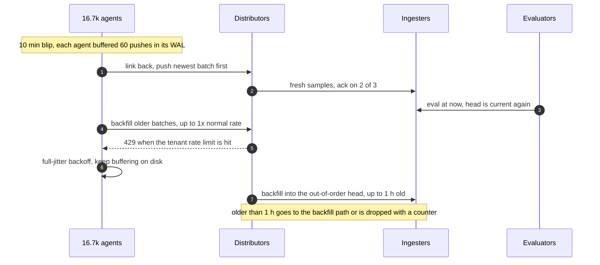

Push back on the textbook: ByteByteGo's design puts Kafka between collectors and the TSDB to decouple and absorb spikes ([post](https://blog.bytebytego.com/p/metric-monitoring)). On the alert path it is a liability: consumer lag becomes alert lag, it is one more stateful system that must be up for a page to go out, and the agent WAL already gives replay. Tee to Kafka asynchronously for consumers that want a stream (capacity planning, ML), off the critical path.

**What changed:** agent sends newest first, distributors have an admission window and 429s, ingesters are zone-aware across clusters, evaluators check lag. Details: [`deep-dives/ingestion-and-cardinality.md`](deep-dives/ingestion-and-cardinality.md).

### 5.4 "Someone ships a metric with a `request_id` label. What happens?"

This is the red node.

**What breaks.** A team adds `node_flow_bytes{flow_id=...}` to the agent, or an agent upgrade adds a `pid` label. Series per host go from 100 to 5,000. Region series go from 5M to 250M. At Mimir's 2.5 GB per 300k in-memory series (× RF 3) that is ~6 TB of RAM against 240 GB provisioned. Ingesters OOM, restart, replay a WAL full of the same new series, and OOM again. **Dashboards and every alert rule read the ingesters, so the region goes blind.** Samples/s barely changed. Series count did.

| Rung | Approach | What breaks next |
|---|---|---|
| Bad | Bigger ingesters, autoscale on memory | One label with unbounded values grows faster than any autoscaler. Every new series is also the expensive write (index insert, WAL series record) |
| Good | **Per-tenant series limit at the distributor**: reject new series past the limit with a 4xx. Existing series keep working. Infra tenant limit 8M active series per region (1.6x headroom) | Stops the OOM. The team that caused it loses new series, and so does everyone else in the same tenant until it is fixed |
| Great | Plus **the agent enforces the schema**: only allowlisted metrics and labels leave the host, unknown labels are dropped at the source. **Per-metric limits** (no single metric over 10% of a tenant). **CI cardinality review** for new metrics. **New-series-rate alert** on the tenant. **Ingester self-protection**: a hard cap on in-memory series per ingester that rejects instead of OOMing. For a real need (per-flow bytes), **aggregate at collection**: the agent sums flows into per-host totals, like Monarch's collection aggregation (on average 36 inputs to 1) | A legitimate new dimension now needs review. That is the point |

The interview line: cardinality is the number of series, not samples. I cap series per tenant at ingest and reject, because dropping samples of an existing series is invisible, and rejecting a new series is loud and attributable.

Push back on the textbook: "use HyperLogLog to count cardinality" is fine for the analysis API (top metrics by series count). It is not a defence. The defence is a hard limit enforced before the series is created.

**What changed:** agent schema, distributor limits per tenant and per metric, an ingester cap, a new-series-rate alert, collection aggregation for high-cardinality needs. Details: [`deep-dives/ingestion-and-cardinality.md`](deep-dives/ingestion-and-cardinality.md), [`../../concepts/time-series-db.md`](../../concepts/time-series-db.md) §9.

### 5.5 "Is the server dead, or is the network between you broken?"

The question behind the question: from one observer, a crashed host, a broken switch and a partitioned observer all look like silence. Deciding wrongly either way is expensive: a false DOWN drains a healthy server, a false storm pages at 3 am and trains the on-call to ignore pages.

**What breaks with one observer and a timeout.**
- The observer's own uplink flaps: every host it watches goes silent at once. 16.7k false DOWNs.
- The observer pauses (GC, CPU starvation) for 20 s: every host is "late" when it wakes up.
- The agent crashes but the host serves traffic fine: a false DOWN drains it.
- The host answers pings but drops 50% of packets ("racks go wonky" in Dean's list: 40 to 80 machines at 50% packet loss): a false HEALTHY.

**Fixes, in the order they apply.**
1. **Observer quorum.** 3 liveness replicas, one per cluster. SUSPECT needs 2 of 3. One partitioned replica changes nothing.
2. **Observer self-check.** A replica that sees its received heartbeat rate drop more than 5% within 10 s, or whose own scan loop ran late, abstains and alerts on itself. It does not judge hosts while it is the likely problem.
3. **Second channel.** Probers in 3 other racks (not the suspect's rack or PDU) ping and TCP connect. The BMC reports power over the out-of-band network, a physically separate path.
4. **Mass-silence gate.** If more than 1% of the region's hosts go silent in one window and no failure domain explains them, a bad agent release or a broken liveness path is far more likely than 500 independent deaths. Hold the per-host verdicts, fire one `MassSilence` alert, and probe a sample of 20 hosts to tell which: reachable hosts mean the agents died, unreachable ones mean the network did.
5. **Correlate before judging** (§5.6).
6. **Gray failure needs different evidence.** Silence cannot find a host that is up but sick. Two sources: the agent's own checks (NIC CRC errors, TCP retransmits, disk latency), and **peer comparison**: a host whose retransmit or error rate is 10x its rack's median for 10 min is UNHEALTHY. The strongest evidence comes from its clients (RPC error rates by backend), which is the "differential observability" argument of the [Gray Failure paper (Huang et al., HotOS 2017)](https://www.microsoft.com/en-us/research/publication/gray-failure-achilles-heel-cloud-scale-systems/).

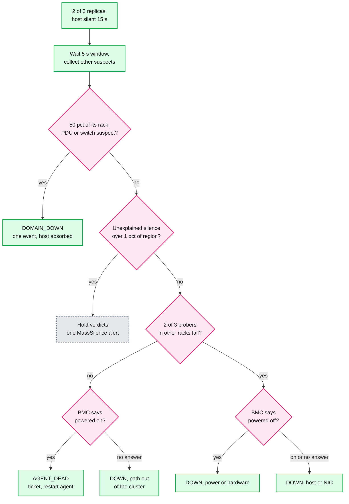

The one odd row: in-cluster probes succeed but the BMC does not answer and 2 of 3 replicas, which sit in other clusters, hear nothing. The host is up inside its cluster but its path out of the cluster is broken (a bad route, a half-dead uplink), so it cannot serve cross-cluster traffic either. It is DOWN for the network reason and goes to the network team, not to a reimage.

**Measuring false DOWNs for free.** Every heartbeat carries `boot_id`. A host marked DOWN that heartbeats again **with the same `boot_id`** never died: that verdict was false (network or monitor). A new `boot_id` means it really rebooted. The false DOWN rate is a real SLI with no labelling effort.

Push back on the textbook: the phi accrual failure detector (Cassandra's `phi_convict_threshold` defaults to 8) adapts the timeout to the observed heartbeat jitter, which matters on WAN links with variable delay. Inside a cluster, with a fixed 5 s heartbeat and a confirmation probe behind it, a fixed 3-miss timeout is simpler to explain, to tune and to reason about in an incident. Phi answers "how late is too late". Our hard question is "who is late: the host or me", and the quorum answers that.

**What changed:** heartbeats go to 3 replicas, probers and BMC queries added, a self-check in each replica, a lag gate in the correlator, peer-outlier rules. Details: [`deep-dives/failure-detection.md`](deep-dives/failure-detection.md).

### 5.6 "A PDU dies and 800 servers go dark. How many pages?"

**What breaks without correlation.** 800 DOWN verdicts, plus ~4,000 host-scoped rule alerts, plus every service's own SLO alert on those hosts. Grouping by `alertname` alone gives one DOWN page with 800 lines, but every other alert name pages separately. Then power returns in waves and hosts flap DOWN, HEALTHY, DOWN.

**The fix, layer by layer.**
1. **Correlate before alerting.** The correlator walks the failure-domain tree (two trees: power, host to PDU to power row; network, host to ToR to aggregation block). A domain with ≥ 50% of its hosts suspect in the same 5 s window becomes one `DOMAIN_DOWN{domain="pdu-c2-p07", hosts="812"}`. If a whole PDU's 20 racks qualify, report the PDU, not 20 racks.
2. **Inhibit.** At the router, `DOMAIN_DOWN{domain=d}` mutes every alert whose `pdu`, `rack` or `tor` label equals `d`: the host DOWNs, the host rules, the absent rules.
3. **Group** by `(alertname, cluster, failure_domain)` with `group_wait` 10 s so stragglers join the first notification.
4. **Flap damping.** A host with more than 3 state changes in 30 min goes to FLAPPING: out of rotation, one ticket, no further state notifications until it is stable for 30 min.
5. **Remediation safety budget.** Automation may take **live** hosts out of service (UNHEALTHY drains, reboots, reimages) for at most 1% of a cluster (~170 hosts) and 5 racks at a time, and 0.5% of the fleet per hour. Over budget, it **stops and pages** "automation halted, N pending". Dead hosts are already out of service and do not consume budget. This is what stops a bad health check, or a correlator bug, from draining a healthy cluster. The SRE book's automation chapter tells the story of a decommissioning workflow that wiped every machine in a CDN because an empty set was read as "everything" ([Automation at Google](https://sre.google/sre-book/automation-at-google/)).

**Result:** one page to datacenter ops for the region ("PDU pdu-c2-p07 in cluster c2: 812 hosts down, power path"), one capacity notice to the fleet on-call if the cluster falls under 95%, zero host pages. Service teams see their own SLO burn if users are hurt, which is correct: that is a symptom they own.

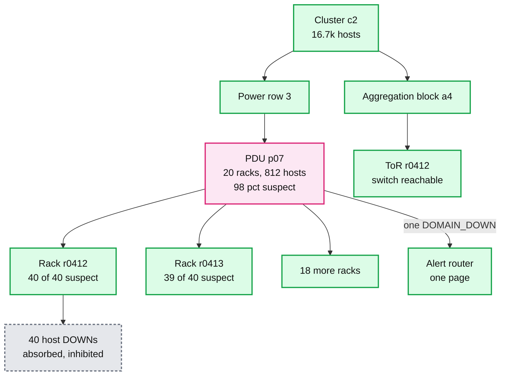

**What changed:** a topology service with both trees, the correlator's domain walk, inhibit rules keyed on domain labels, flap damping, the remediation budget. Details: [`deep-dives/correlation-and-alert-storms.md`](deep-dives/correlation-and-alert-storms.md), [`deep-dives/alert-routing-and-dedup.md`](deep-dives/alert-routing-and-dedup.md).

### 5.7 "Who monitors the monitor, and what if a whole region goes dark?"

**What breaks in §4.**
- The stack for region R runs in region R. If R is cut off from the world, its router cannot reach PagerDuty and nobody hears about it.
- If the stack reads rules or topology from a database it also monitors, an outage of that database blinds monitoring during that outage.
- If every evaluator dies, firing alerts expire after `valid_until` (4 × 1 min) and the router **resolves them**. The on-call sees "resolved" when the truth is "blind".
- If PagerDuty is down, nothing pages and nothing complains.

**Fixes.**
1. **Dependency rule for the alert path.** Agent, distributor, ingester, evaluator, liveness, correlator, router, pager. Nothing else. Rules, routes and topology are local files synced from git and the inventory, with the last good copy kept on disk. Object storage is for history, never for alerting. Monarch states the same rule: it keeps data in memory and avoids Bigtable, Spanner and Colossus on the alerting path because they depend on Monarch.
2. **Cross-region watchers.** Region R is watched by regions R+1 and R+2 (a ring). Each watcher pushes a **canary series** through R's distributors every 10 s. R's evaluators run an always-true rule on it and R's router echoes it back to the watcher on a dedicated route with a 10 s group interval, so it never waits on the default 5 min. Canary round trip over 60 s for 2 min, or R unreachable: the watcher's router pages "Region R monitoring blind".
3. **Dead man's switch.** Each region runs an always-firing `Watchdog` rule on its evaluators, and the router delivers it every minute to an external heartbeat service outside our infrastructure. So one signal proves the evaluators, the router and the path out are all alive. Missing for 5 min: that service pages through a different provider (SMS).
4. **Expiry is not a resolve.** A firing alert that ends only because `valid_until` passed, with no evaluator saying "false", is not sent as resolved. The router fires `AlertSourceSilent` for that rule group instead.
5. **Paging path diversity.** Routers alert on their own notification failures (> 1% for 5 min) and fall back to a second provider.
6. **Region loss.** The stack dies with the region. Watchers page within ~2 min. Global dashboards show `partial` with R missing. R's shipped blocks are in object storage replicated to another region, so history survives, except the last ≤ 2 h that was still in ingester memory and WAL. If the region never comes back, that window is lost. Ingest restarts when the region does.

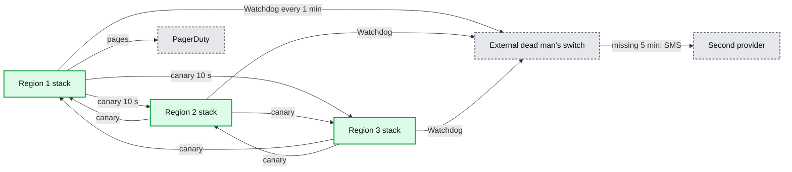

**What changed:** canary series and watcher config, the Watchdog rule, expiry handled as `AlertSourceSilent`, a second pager, a dependency rule enforced in review. Details: [`deep-dives/meta-monitoring-and-region-loss.md`](deep-dives/meta-monitoring-and-region-loss.md).

---

## 6. Final design and the core flows

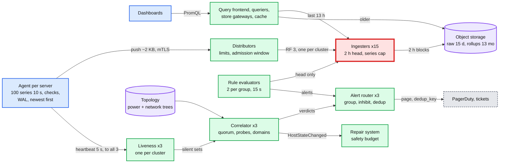

Zoom-ins live in [`diagrams.md`](diagrams.md): context, data flow, deployment per region, ring and partitioning, failure-mode map, rollout.

Flows to say from memory:

### Flow 1: a disk fills up, the owner gets a ticket in under a minute

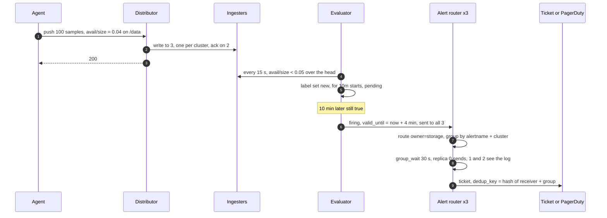

### Flow 2: one server dies, nobody is paged

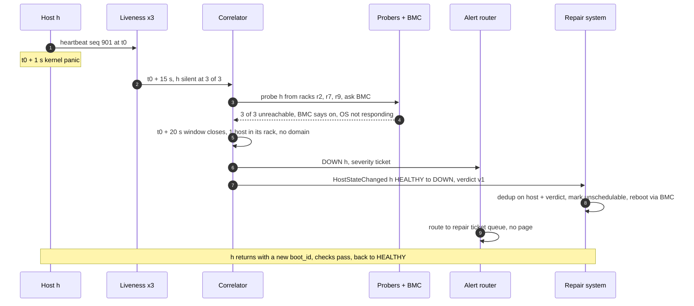

### Flow 3: a PDU fails, one page

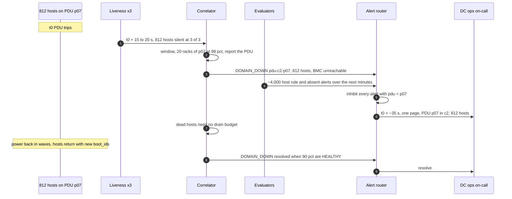

### Flow 4: a router replica is partitioned, still one page

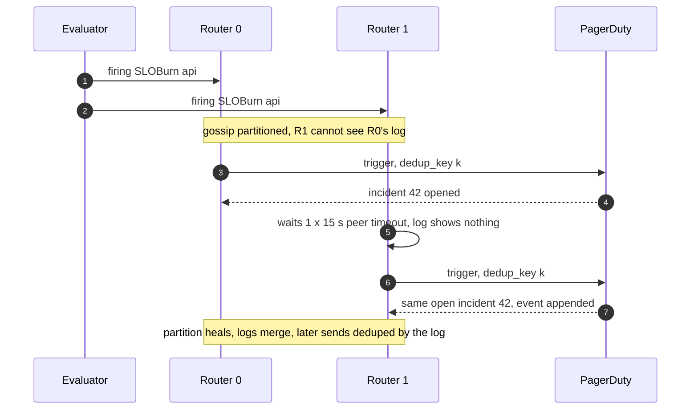

---

## 7. Trade-offs

| Decision | Option A | Option B | Chose | Why |
|---|---|---|---|---|
| Collection | Agent push + separate heartbeat | Central pull (scrape) | A | 500k targets, local buffering through outages, and liveness gets its own quorum-observed path. Pull's free `up` is a single observer |
| Liveness evidence | 3 observers, 2 of 3, plus probes and BMC | One observer, timeout | A | One observer turns its own partition into 16.7k false DOWNs. Cost: 3x heartbeats (10k/s per replica, trivial) |
| Failure detector | Fixed 3-miss timeout (15 s) | Phi accrual | A | Cluster-local, fixed interval, confirmed by probes. Phi's adaptivity is for jittery WAN links |
| Who gets paged for one dead server | Automation plus ticket | On-call | A | 30 to 80 a day vs a budget of 2 per shift. Page on correlated failure and symptoms |
| Storm control | Correlate by domain, then inhibit | Group by alertname only | A | Grouping still pages once per alert name. Correlation reports the cause once |
| Stack placement | Per region, RF 3 across its 3 clusters | One global stack | A | A WAN partition must not stop alerts. 95% of Monarch's standing queries run at zone level for the same reason |
| Buffer on the alert path | Agent WAL, newest first | Kafka between agents and TSDB | A | Kafka lag is alert lag, and one more thing to be up. Tee to Kafka off the critical path if needed |
| Alert evaluation | Standing queries every 15 s on the in-memory head | Flink on the stream | A | ~40 s end to end is enough. Flink adds a second rule language and state |
| Host-local thresholds | In the agent | Central rules over 200k series | A | Faster (one push) and cheaper. Risk: a bad check config ships to every host, so checks roll out by cluster and correlate (§5.6) |
| Evaluator and router HA | Duplicate evaluation, dedup at the router | Leader election per rule group | A | No lock service on the alert path. Duplicates are cheap to remove, a stuck leader is not |
| Cardinality defence | Reject new series past a limit | Autoscale ingesters | A | Rejection is loud and attributable. Autoscaling loses to an unbounded label |
| Retention | Raw 15 d, 5 min 90 d, 1 h 13 mo | Raw 1 year | A | ~27 TB, $620 a month. Long ranges are fast because of rollups, not because of cheaper disks |
| Refused to build | ML anomaly detection, logs, traces, Kafka on the alert path, consensus for samples, per-host pages | | | Each is a new requirement or a new failure mode. Name the seam, do not build it |

---

## 8. Staff-level notes

- **Failure modes and blast radius.** One ingester: nothing visible (RF 3). One cluster: the region runs on 2 of 3 replicas everywhere, with a DOMAIN_DOWN page for the cluster. A cardinality explosion: capped at the tenant that caused it by the series limit, otherwise the whole region's rules go blind. A bad health-check config: capped at 1% of a cluster by the remediation budget. Region loss: that region's monitoring is gone, detected by 2 watchers in ~2 min, history safe in replicated object storage. PagerDuty down: the dead man's switch pages through SMS. The worst failure a monitoring system can have is silence that looks like health, and every one of these has a path that makes silence loud.
- **Migration.** Today it is probably per-datacenter Prometheus or Nagios plus hand-written pages. (1) Ship the agent with both a `/metrics` endpoint for the old scrapers and push to the new stack. (2) Run the new router with a shadow receiver for 2 weeks and diff its pages against the old system's. (3) Move teams one at a time, rules translated and backtested in CI. (4) Turn on liveness verdicts in "ticket only" mode for a month, measure the false DOWN rate by `boot_id`, then connect repair automation with a budget of 0.1% and raise it. Rollback at every step is a receiver switch; nothing is destructive.
- **Operability.** SLOs: canary round trip under 60 s in 99.99% of minutes per region; host verdict p99 under 30 s; false DOWN under 0.1% of DOWN verdicts; page delivery under 60 s p99. Page the monitoring on-call for: canary lag over 60 s for 2 min, Watchdog missing (external), router notification failures over 1% for 5 min, tenant series limit hit on the infra tenant, false DOWN rate over 1% in an hour, remediation halted. Ticket for: ingester memory over 70%, compactor backlog over 6 h, rule evaluation misses.
- **Cost.** Per region: ingesters 120 vCPU, distributors 40, queriers and store gateways ~40, evaluators ~48 (every group runs twice), liveness, correlator, probers and routers ~30: ~280 vCPU, so ~2,800 vCPU globally, roughly $70k a month. Object storage ~$620 a month. The biggest cost is the agent: at 1% of a core on 500k servers it is 5,000 cores, almost twice the central stack. Keep the agent lean; it is paid for 500k times.
- **Team boundaries.** Monitoring platform owns the agent, pipeline, liveness, correlator and router. Fleet owns the repair system and its budget. Datacenter ops owns the topology data and receives DOMAIN_DOWN pages. Service teams own their rules and their pages. The metric and label schema, the rule format and `HostStateChanged` are contracts, versioned like APIs.

---

## 9. What is expected at each level

**Mid (80/20).** Agents or scrapers, a queue, a TSDB, a rule engine, a notifier, dashboards. Knows push vs pull. Probably Kafka in front of the TSDB. A dead server is detected by `up == 0` or a heartbeat timeout from one place. Alert dedup is "don't send the same email twice".

**Senior (60/40).** Sizes the TSDB with compression and series count. Downsampling with more than one aggregate. Knows cardinality is the killer and adds limits. Heartbeats with N missed intervals and knows about false positives. Alertmanager-style grouping, inhibition and silences. HA router with dedup. May still page per dead server, and may still run one global stack.

**Staff+ (40/60).** Opens with the page budget and the failure rate: 30 to 80 dead servers a day means single-host failures go to automation, and pages are for correlated failures and symptoms. Separates liveness from metrics and uses an observer quorum plus a second channel, so a monitor-side partition can never page. Correlates by failure domain before alerting. Puts a safety budget on automation. Keeps the alert path regional and free of dependencies on the systems it monitors, and explains who watches the watcher and why silence must never look like health. Pushes back on Kafka and Flink on the alert path with a latency budget. Numbers: 5M samples/s, 50M series, 15 ingesters and 125 GB per region, 30 s verdict, 60 s page, 27 TB of storage.

---

## 10. Nitty-gritty (past interview scope)

### 10.1 Internals of each chosen technology

**Agent.** Three independent loops so one cannot starve another: (1) collect every 10 s, apply the allowlist, append to a local WAL of 1 MB segments, push newest-first; (2) heartbeat every 5 s on its own UDP socket, HMAC with a per-host key, to 3 replicas; (3) run health checks on their own schedules (SMART every 5 min, ECC every 10 s) and export results as series. Budget: under 1% of a core and 50 MB of RAM.

**Distributor and the ingester ring.** Ingesters register tokens on a hash ring gossiped over memberlist (no etcd on the alert path). A series hashes to a token; the distributor walks clockwise and picks the next 3 ingesters **in 3 different zones** (our zones are the region's clusters; Mimir calls this zone-aware replication, off by default). Quorum is 2. Storage internals (head, WAL, chunks, blocks, compaction) are in [`../../concepts/time-series-db.md`](../../concepts/time-series-db.md) §3 to §8.

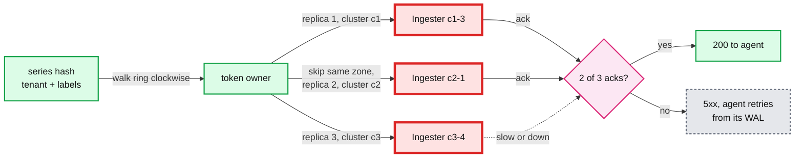

**Liveness replica.** A UDP receive loop verifies the HMAC, drops a `seq` lower than the last seen for that `boot_id`, and writes `last_seen[host] = monotonic_now()`. A 1 s ticker scans the map (50k entries, microseconds) and publishes the silent set as a bitmap over a stable host index (50k bits = 6 KB). It also publishes its own health: received rate, scan lag. It never uses the sender's clock.

**Correlator.** Each replica subscribes to all 3 liveness replicas. Per window: `suspects = hosts silent at ≥ 2 replicas`. Bottom-up over each tree: `frac(d) = suspects in d / hosts in d`; a domain qualifies at ≥ 50% and ≥ 5 hosts; report the highest qualifying ancestor and absorb its descendants. Across the power and network trees, prefer the explanation with fewer events. Probes for a qualifying domain are sampled (5 hosts plus the device: PDU over Redfish, ToR over SNMP), not all 800.

**Alert router** (Alertmanager model). Each replica runs the same pipeline and gossips two things: silences and the notification log.

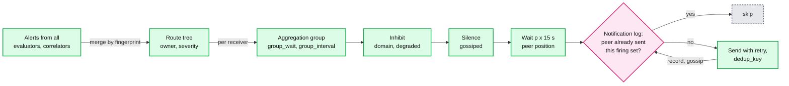

Gossip is eventually consistent. During a partition two replicas can both send; the dedup key at PagerDuty absorbs that. Docs: [Alertmanager](https://prometheus.io/docs/alerting/latest/alertmanager/), [`../../concepts/gossip-protocol.md`](../../concepts/gossip-protocol.md).

### 10.2 Configuration knobs that matter

| Component | Knob | Default (source) | Ours | Why |
|---|---|---|---|---|
| Agent | push interval | Prometheus `scrape_interval` 1 min ([config](https://prometheus.io/docs/prometheus/latest/configuration/configuration/)) | 10 s | Hello Interview's 10 s. Alert budget in §5.2 |
| Agent | heartbeat interval | Kubernetes Lease every 10 s ([node status](https://kubernetes.io/docs/reference/node/node-status/)) | 5 s | 30 s verdict budget. 3 misses = 15 s |
| Liveness | silent after | Kubernetes `node-monitor-grace-period` 50 s ([ref](https://kubernetes.io/docs/reference/command-line-tools-reference/kube-controller-manager/)) | 15 s, 2 of 3 replicas | Quorum and probes make a short timeout safe |
| Correlator | window, domain threshold | none | 5 s, ≥ 50% and ≥ 5 hosts | One heartbeat phase. 5 hosts avoids calling 2 of 3 dead hosts a rack failure |
| Probers | timeout, retries | blackbox exporter uses the scrape timeout | 1 s, 1 retry, 3 probers | Same-cluster RTT is sub-millisecond |
| Evaluator | `evaluation_interval` | 1 min | 15 s | §5.2 |
| Evaluator | `--rules.alert.resend-delay` | 1 min (`cmd/prometheus/main.go`) | 1 min | `valid_until` = 4 × max(15 s, 1 min) = 4 min |
| Evaluator | `for` restore | outage tolerance 1 h, grace 10 min | same | A restart does not reset a 10 min `for` |
| Router | `group_wait` | 30 s ([config](https://prometheus.io/docs/alerting/latest/configuration/)) | 10 s pages, 30 s rest | Page latency vs catching stragglers |
| Router | `group_interval`, `repeat_interval` | 5 min, 4 h | same | Updates when the set changes, reminders |
| Router | `--cluster.peer-timeout` | 15 s (`cmd/alertmanager/main.go`) | 15 s | Worst case replica 2 sends 30 s after replica 0 would have |
| Ring | replication factor, zone awareness | 3, off ([Mimir ref](https://grafana.com/docs/mimir/latest/configure/configuration-parameters/)) | 3, **on** (zones = clusters) | Lose a cluster, keep 2 of 3 |
| Limits | `max_global_series_per_user` | 150,000 | 8M for the infra tenant | 1.6x of 5M. Rejects past it |
| Limits | `max_global_series_per_metric` | 0 (off) | 500k | No metric over 10% of the tenant |
| Limits | `ingestion_rate`, burst | 10,000/s, 200,000 | 600k/s, 6M per region | 1.2x steady state, burst covers a 10 s spike |
| Ingester | `out_of_order_time_window` | 0 s | 1 h | Agents buffer through blips |
| Querier | `query_ingesters_within` | 13 h | 13 h | Blocks ship every 2 h; the store gateway may lag hours behind |
| Remediation | budget | none | 1% of a cluster and 5 racks at once, 0.5% of fleet per hour | Bounds the blast radius of a bad check |

### 10.3 Capacity math per component

Per region (50k hosts, 500k samples/s, 5M series):

| Component | Load | Limit | Headroom |
|---|---|---|---|
| Distributors (10 × 4 cores) | 500k samples/s | 1M/s at 25k per core | 2x |
| Ingesters (15 × 16 GB) | 1M in-memory series each, 8.3 GB | ~1.8M series at 16 GB | 1.8x. **Closest to its limit, and the one with no graceful overflow without the cap** |
| Object storage | 60 GB/day | none | n/a |
| Evaluators | 220 evals/s × 2 replicas × ~100 ms | 48 cores | 1.1x, add pods |
| Liveness replica | 10k heartbeats/s, 2 MB state | >100k/s per core | >10x |
| Correlator | 50k hosts, 5 MB topology, a PDU event is 812 suspects | trivial | >100x |
| Alert router | ~2k firing alerts normally, +4.8k in a PDU event | 1 GB per 5k firing alerts | fine |
| Queriers | ~130 QPS, ~40 after the results cache | 1 core per 10 QPS | fine |

The one to watch is the ingester tier: 1.8x headroom disappears with a single unbounded label (§5.4).

### 10.4 Failure timeline

**PDU p07 trips in cluster c2** (Flow 3 above):
- t0: 812 hosts lose power. Last heartbeats were between t0 − 5 s and t0.
- t0 + 10 to 15 s: all 3 liveness replicas see the first of them pass 15 s of silence. By t0 + 20 s all 812 are silent everywhere.
- t0 + 20 s: correlator window closes. 20 racks at 97 to 100%, PDU at 98%. Sampled probes: 5 hosts and the PDU's Redfish endpoint all unreachable. One `DOMAIN_DOWN pdu-c2-p07`.
- t0 + 21 s: router opens a group, `group_wait` 10 s. Host rule alerts start arriving over the next minutes and are inhibited on `pdu=p07`.
- t0 + ~33 s: replica 0 sends one page. Replicas 1 and 2 see the log entry and do nothing.
- t0 + 1 to 6 h: power back in waves. Each host returns with a new `boot_id`. `DOMAIN_DOWN` resolves at 90% healthy. Flapping hosts are damped.
- Data at risk: the 800 hosts' last ≤ 10 s of unacked samples. Nobody needs them.

**An ingester in c1 is OOM-killed:**
- t0: its connections drop. Distributors keep writing the affected series to the other 2 replicas: quorum still met, agents see nothing.
- t0 + ~1 min: memberlist marks it unhealthy; queries skip it and dedup the other 2 copies.
- t0 + 2 to 5 min: restarted, replays its WAL (2 h of ~1M series), rejoins. Its gap is filled by the other replicas at query time and by the compactor's vertical merge.
- Risk window: a second ingester in another cluster sharing some of the same series fails during replay. Those series drop below quorum; writes get 5xx and the agents buffer. No data loss, a few minutes of lag.

**Region monitoring blind** (a bad distributor config rolled out):
- t0: every push fails. Agents buffer. Heartbeats keep flowing, so liveness verdicts still work.
- t0 + 30 s: evaluators see ingest lag over 30 s, hold absence rules, fire `RegionMonitoringDegraded` to the router, which pages the monitoring on-call.
- t0 + 2 min: the 2 watcher regions' canaries fail. They page too, in the same incident key.
- Rollback the config. Agents flush newest first. A blind spell under ~1 h backfills into the out-of-order head. Longer, and the oldest part takes the backfill path.

### 10.5 Exactly-once and idempotency end to end

| Hop | Duplicates enter by | Removed by | Key | Lives for |
|---|---|---|---|---|
| Agent to distributor | Retry after a timeout | Ingester ignores an identical sample at the same timestamp | `(series, ts)` | head |
| Distributor to 3 ingesters | By design, 3 copies | Queriers dedup by timestamp, compactor keeps one | `(series, ts)` | forever |
| Heartbeat | UDP duplicates, replays | Max `seq` per `boot_id` | `(host, boot_id, seq)` | memory |
| 2 evaluators to router | By design | Router merges by fingerprint | hash of alert labels | while firing |
| 3 correlators to router | By design | Same, verdict labels are deterministic | `(host or domain, verdict)` | while firing |
| 3 routers to PagerDuty | Partitioned gossip | Notification log, then `dedup_key` | hash of receiver + group key | incident |
| Router to tickets | Same | Idempotent create | same key | ticket |
| Correlator to repair | By design, 3 replicas | Repair system dedups | `verdict_id` = hash of host, boot_id, state | repair DB |
| Repair action (reboot, reimage) | Workflow retry | Attempt row before the call, check state before a new attempt | `(host, verdict_id, step)` | repair DB |

Samples need no exactly-once: writing the same `(series, ts, value)` twice is the same state. Pages need **effectively once**, which the dedup key gives. Repair actions are the only non-idempotent side effects, and they sit in a normal service with a database, off the alert path. See [`../../concepts/exactly-once.md`](../../concepts/exactly-once.md).

### 10.6 Consistency model per edge

- Agent to distributor: at-least-once. Not ordered: newest-first replay is out of order on purpose, the out-of-order head accepts it.
- Distributor to ingesters: 2 of 3 quorum, **no consensus**. Replicas can differ by a sample. Samples are idempotent, so there is nothing to agree on.
- Ingesters and store gateways to queries: eventual, `partial` flagged. A global query without one region says so.
- Evaluators: each replica has its own view and may disagree for one cycle at a threshold edge. The router merges.
- Heartbeats to liveness: best-effort UDP. Decisions only by quorum.
- Correlator to router and repair: a deterministic function of the same inputs, delivered at-least-once.
- Router peers: eventually consistent gossip. A silence created on one replica reaches the others within a gossip round; a page can slip out in that window. Accepted.
- Router to PagerDuty: at-least-once, effectively once by `dedup_key`.
- Topology feed to correlator: eventual, with the last good copy on disk. Stale topology means wrong grouping, not wrong liveness.
- Repair system state: strongly consistent in its own database. It is off the alert path, so it may depend on anything.

### 10.7 Alternatives rejected

| Alternative | Why it looked attractive | Why rejected |
|---|---|---|
| Central active checks (Nagios style: a server pings every host) | Simple, one place | Single observer. At 500k hosts it is a scaling project in itself and still cannot tell its own partition from a dead rack |
| SWIM gossip among the hosts themselves (Consul style) | No central observer, indirect probes built in, scales with log N | Runs membership on every production host, so a gossip bug is fleet-wide. With memberlist defaults the suspicion timeout grows with log N (~19 s at 50k), and we still need topology correlation and a quorum outside the hosts |
| One global monitoring stack | One place to query | A WAN partition stops alerts for the far side. Monarch runs up to 95% of standing queries inside a zone for partition tolerance |
| Kafka between agents and TSDB | Replay, decoupling, spikes (ByteByteGo) | Consumer lag is alert lag, and one more dependency on the page path. Agent WAL gives replay |
| Flink for rule evaluation | Per-event latency | ~40 s end to end without it. Second rule language, state, checkpoints |
| Cassandra or HBase as the TSDB (OpenTSDB, KairosDB) | Proven write throughput | ~10x the bytes per sample of Gorilla chunks, no label index, retention by TTL compaction instead of dropping blocks |
| ClickHouse or Druid for dashboards | Fast ad-hoc group by | Our queries are label-selected ranges; rollups and recording rules cover them |
| Raft per ingester shard | Strong consistency | Samples are idempotent. Consensus adds a leader and an election to the hottest path for nothing |
| Leader election for evaluators and correlators | No duplicate alerts | Needs a lock service on the alert path. Duplicates are cheap to dedup |
| Phi accrual | Adaptive timeouts | Fixed intervals in a cluster, probes behind it. §5.5 |

### 10.8 How the big companies do it

- **Google Borgmon** ([SRE book ch. 10](https://sre.google/sre-book/practical-alerting/)): pull, "a single Borgmon per cluster, and a pair at the global level", rules produce alerts that go to an Alertmanager for dedup and routing. Our regional stack with a thin global query layer is the same split.
- **Google Monarch** ([VLDB 2020](https://www.vldb.org/pvldb/vol13/p3181-adams.pdf)): push, in memory, regional zones plus a global root. As of July 2019: ~950 billion series in ~750 TB of RAM, ~2.2 TB/s ingested, over 6 million QPS, ~95% of queries are standing queries (including alerting), and up to 95% of standing queries evaluate inside a zone. Collection aggregation averages 36 input series into one. It trades consistency for availability and keeps Bigtable, Spanner and Colossus off the alerting path. Our dependency rule and zone-local evaluation come from here.
- **Meta Gorilla** ([VLDB 2015](https://www.vldb.org/pvldb/vol8/p1816-teller.pdf)): in-memory write-through cache of the last 26 hours for ODS, 2 billion series, 700 million points per minute, 1.37 bytes per point, 73x lower query latency. The compression every TSDB since uses.
- **Kubernetes node lifecycle** ([node status](https://kubernetes.io/docs/reference/node/node-status/), [controller flags](https://kubernetes.io/docs/reference/command-line-tools-reference/kube-controller-manager/)): a small Lease every 10 s separate from the big status every 5 min, unreachable after 50 s, eviction 5 min later. Same heartbeat split as ours, with a single observer and slower timings because pods move more slowly than pages.
- **Facebook FBAR** ([2011 post](https://engineering.fb.com/2011/09/15/data-center-engineering/making-facebook-self-healing/)): auto-remediation run by two engineers doing the work of about 200 system administrators, managing over half of Facebook's infrastructure. The argument for sending single-host failures to automation.
- **Grafana Mimir** ([1 billion series](https://grafana.com/blog/2022/04/08/how-we-scaled-our-new-prometheus-tsdb-grafana-mimir-to-1-billion-active-series/)): 1 billion active series, ~50M samples/s at a 20 s scrape. The open-source version of our metrics path.

### 10.9 Operational runbook

- **Dashboards (5 metrics):** canary round trip per region; samples/s and active series per tenant with limit rejections; ingester memory per pod; verdicts per minute by type with the false DOWN rate (same `boot_id` returns); pages per rotation per shift and notification failures.
- **Alerts:** see §8.
- **Rollout.** Agent releases go one cluster, then one region, then the fleet over a week. The mass-silence gate catches a release that kills agents. Pipeline components roll one cluster at a time, never two, so every series keeps 2 of 3 replicas. Rules go through CI backtest, then a canary region.
- **Rollback.** Agent version pin. Rules revert in git. Router and limit configs keep the last good copy. No manual backfill is needed for a rollback that completes within ~1 h: agents replay their WAL into the out-of-order head.

### 10.10 Security and abuse

- **Identity.** Agents use mTLS with host certificates. The distributor rejects any series whose `host` label differs from the certificate, so a compromised host cannot write other hosts' metrics.
- **Heartbeats** carry an HMAC with a per-host key. A compromised host cannot keep a dead neighbour "alive".
- **Rate limits** per host and per tenant. A misbehaving agent gets 429s, not the ingesters.
- **Silences** need RBAC. An empty matcher is rejected. A silence that would match more than 1,000 alerts or last over 7 days needs a second approver. This is the monitoring version of the empty-set bug.
- **Queries** have series, sample and time limits per tenant.
- **Labels are not a place for secrets or personal data.** The agent schema allowlist keeps them out; CI rejects metrics with free-text labels.
- **BMC and probers** sit on the management network. Probers only accept signed requests from correlators, so they cannot be used as a scanner.

### 10.11 Evolution

- **10x hosts (5M).** 500M series fleet-wide, 50M per region. Ingesters go to ~150 per region. Collection aggregation becomes the main lever (Monarch averages 36 inputs to 1). Split each region into more zones. Liveness and correlators are per cluster already, so they do not change.
- **Containers.** Per-container series churn every deploy. Separate tenant, shorter retention (3 days raw), per-metric limits, and aggregate to per-service at collection.
- **ML anomaly detection.** A consumer of recorded series that emits alerts into the same router with its own severity and owner. It never pages until it has a backtested precision, like any other rule.
- **Logs and traces.** Alerts carry links and exemplar trace ids. Separate stores.
- **New hardware dimension** (per-GPU health). New agent collector, schema review, a cardinality budget per host.
- **Multi-tenant SaaS** (Datadog shape). Tenants become customers. Per-tenant limits, compactor shards and query queues already exist. Add per-tenant encryption and billing on active series.

---

## 11. Follow-up questions to expect

1. "Push or pull?" → §4.1 table.
2. "How do you know a server is dead, not just unreachable from you?" → §5.5, [edge case: liveness replica partitioned](edge-cases.md#edge-case-the-liveness-replica-in-one-cluster-is-partitioned-from-its-hosts), [deep dive](deep-dives/failure-detection.md).
3. "A PDU fails. How many pages?" → §5.6, §6 Flow 3, [edge case](edge-cases.md#edge-case-a-pdu-fails-and-800-servers-go-dark-at-once).
4. "Three router replicas, why not three pages?" → §4.5, §6 Flow 4, [edge case](edge-cases.md#edge-case-two-alert-router-replicas-both-send-the-same-page), [deep dive](deep-dives/alert-routing-and-dedup.md).
5. "Someone adds a `request_id` label" → §5.4, [edge case](edge-cases.md#edge-case-someone-ships-a-metric-with-a-request_id-label).
6. "Who monitors the monitor?" → §5.7, [edge case: region monitoring dark](edge-cases.md#edge-case-a-whole-regions-monitoring-stack-goes-dark).
7. "Why not Kafka? Why not Flink?" → §5.3, §5.2 push backs.
8. "A server answers pings but drops half its packets" → §5.5 item 6, [edge case](edge-cases.md#edge-case-a-server-answers-pings-but-drops-50-of-packets).
9. "Your automation drains a cluster because of a bad check" → §5.6 item 5, [edge case](edge-cases.md#edge-case-a-bad-health-check-marks-30-of-a-cluster-unhealthy).
10. "Dashboards over 13 months are slow" → §5.1, [deep dive](deep-dives/query-and-retention.md).
11. "An evaluator restarts halfway through a 10 minute `for`" → §4.3 step 6 (the exact restore rule), the second owner fires on time, [edge case](edge-cases.md#edge-case-an-evaluator-restarts-halfway-through-a-10-minute-for-window).
12. "10x the fleet" → §10.11.
