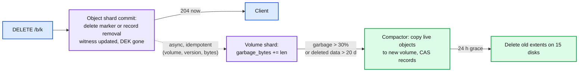

# Deep dive: delete, garbage collection, and compaction

> One-line answer: delete is one metadata commit that removes the record and with it the only wrapped copy of the object's encryption key, so the bytes are unreadable everywhere at that instant; the space comes back later when a volume's garbage crosses 30% and a compactor copies its live objects into a new volume and swaps each record's pointer with a compare-and-swap. Nothing is ever freed inside an extent, because an erasure-coded extent cannot free 64 KB.

Part of [`../solution.md`](../solution.md) §4.3. Research in [`../research/metadata-consistency-and-interview-survey.md`](../research/metadata-consistency-and-interview-survey.md) §5 and [`../research/durability-and-placement-survey.md`](../research/durability-and-placement-survey.md) §6. Systems: Haystack compaction, f4 (leaves holes, rewrites volumes), S3 lifecycle and Object Lock docs.

## 1. What delete does, and does not do



- Versioned bucket: `DELETE /b/k` inserts a delete marker version. `GET /b/k` returns 404; `GET /b/k?versionId=v7` still works. `DELETE /b/k?versionId=v7` removes that version's record for real.
- Unversioned bucket: `DELETE /b/k` removes the record.
- Either way the visible effect is one Raft commit, strongly consistent, ~2 ms.
- The record holds the object's DEK wrapped by the bucket KEK. Removing the record removes the only copy of the DEK. Ciphertext on 15 disks, in the DR copy, and in gateway content caches is now noise. That is the compliance answer at t0.

## 2. Why not free the bytes now

- A needle in a REPL3 extent or a chunk in an EC96 fragment is a range inside a 1 GB append-only file that is one of 15 erasure-coded fragments. Zeroing it means rewriting the parity for that row on 6 other disks; doing that per delete is 15 writes per delete and breaks the "extents never change after seal" invariant that makes reads version-free and caches invalidation-free.
- So: leave holes, count them, rewrite whole volumes when the holes are worth it. f4 does exactly this.

## 3. Compaction

```
trigger: volume.state == ENCODED and garbage / (live + garbage) > 0.30
         OR volume holds any object deleted more than 20 days ago (GDPR forced)
         OR the volume's disks are being drained

compact(volume V):
  manifest = V's per-extent object index (offset, length, version_id)      # written by the gateway alongside data
  live     = [e for e in manifest if object_shard.exists(e.version_id)]     # batch lookup, one RPC per shard touched
  V'       = allocate(EC96)
  for e in live:
      bytes = read(V, e.offset, e.length)          # from data fragments; decode only if degraded
      verify crc; new_off = append(V', bytes)      # re-encoded inline as it is appended
      cas(object_shard, e.version_id, old_seg=(V, e.offset, e.length), new_seg=(V', new_off, e.length))
      if cas fails: (object deleted or moved meanwhile) -> mark new bytes garbage in V'
  V.state = DRAINING, drain_at = now
  after 24 h: delete V's 15 extents; retire V's id for 30 days
```

- Write amplification: at 30% garbage, reclaiming 0.3 GB costs reading and writing 0.7 GB: 2.3x. At 20%: 4x. At 50%: 1x. The threshold is a cost knob.
- Compaction budget: 10 k deletes/s x 5 MB average = 50 GB/s of new garbage. If every byte of it were reclaimed through 30%-garbage compactions, that is 50 x 2.3 = ~115 GB/s of rewrite, over half of ingest. It is not, for two reasons: most deletes are bulk (drop table, lifecycle on a date prefix) and produce volumes that are 100% garbage and are simply deleted, and garbage that sits in a volume that never reaches 30% is only rewritten by the 20-day forced pass. Measured steady state on lake workloads is ~10% of ingest; alert at 25%.
- The CAS is on `(version_id, old segment)`. A concurrent new version of the same key is a different version and does not conflict. A concurrent delete removes the record and the CAS fails, so the copy becomes garbage in V'. Two compactors on V: the second's CASes all fail (the first already moved them) and its V' is garbage; a `compacting_by` lease on the volume prevents the waste in the common case.
- Readers: a gateway holding a record with the old segment reads V during the 24 h grace and succeeds; after deletion it gets `GONE`, re-reads the record (witness says "changed" because the CAS bumped the key's LSN), reads V'. The content cache keyed by `(V, offset)` simply never gets asked for V again.

## 4. Lifecycle rules

All lifecycle actions are ordinary deletes produced by a scan:
- `Expiration: days N` on a prefix: per-shard scan of the range, delete markers or removals for records with `created_at < now - N`.
- `NoncurrentVersionExpiration`: remove noncurrent versions older than N days.
- `ExpiredObjectDeleteMarker`: remove delete markers that have no noncurrent versions behind them.
- `AbortIncompleteMultipartUpload: 7 days`: delete MPU and part records; part segments become garbage.
- Transition to a cold tier (§10.11 of the solution): a compaction into a volume of a different type (RS(17,3), single AZ plus copy), pointer swap by the same CAS.

The scan runs per shard, once a day, as a low-priority iterator; 100 B records at 1 M/s per shard-scan is 50 s per shard.

## 5. GDPR and retention

- **Right to erasure within 30 days:** DEK removal at t0 makes the data unreadable; forced compaction at 20 days overwrites the ciphertext; both events are in the audit log with the version id. The DR region receives the record deletion in its apply stream, so its copy of the DEK is gone within minutes too. Backups of the metadata tier (RocksDB checkpoints) are the residual: retain them 14 days, encrypt them with a key rotated every 14 days, so a DEK in a backup is unrecoverable after 28 days. State this; it is the honest gap.
- **Object Lock (WORM):** a per-version `retain_until` and a `legal_hold` flag in the record. Governance mode: privileged principals can shorten. Compliance mode: nobody can, including the operator; the apply step rejects a delete of a locked version and the compactor treats locked objects as live regardless of anything. S3 and its regulated customers (SEC 17a-4) are the reference.

## 6. Orphans and the reconciler

Delete and GC handle bytes that had a record. The reconciler handles bytes that never got one (crashed uploads, losers of conditional PUTs, bad-digest uploads, aborted parts whose delete never reached the volume shard):
- Per sealed volume every 7 days: manifest entries whose `version_id` does not exist in the object shard (and are older than 24 h) are marked garbage. Same counters, same compaction path.
- Expected orphan rate: ~0.1% of raw at steady state (a few crashed uploads per hour plus every lost conditional PUT). Alert above 0.5%.

## 7. Space accounting

| Bucket of raw capacity | Steady-state share | Why |
|---|---|---|
| Live data x 1.67 | ~85% | the design |
| Deleted, awaiting compaction | ~8% | 30% threshold, bulk deletes are cheap |
| Open REPL3 volumes at 3x | ~0.05% | 2 h window |
| Orphans | ~0.1% | reconciler |
| DRAINING volumes in 24 h grace | ~1% | compaction rate x 24 h |
| Free for placement balance | ~6% | allocator needs room |

Push back on the textbook: "delete frees space" is not a requirement; "delete is immediately visible, compliant at t0, and space returns within a bounded time at a bounded I/O cost" is. Say the three numbers: 2 ms, 30 days, 2.3x.

## 8. What to say in 60 seconds

"Delete is a two-millisecond metadata commit that inserts a delete marker or removes the record, which also destroys the only copy of the object's encryption key, so the bytes are unreadable everywhere immediately. Space comes back asynchronously: every delete adds to its volume's garbage counter, and when a volume crosses thirty percent garbage, or holds deleted data older than twenty days, a compactor copies the live objects into a new volume, swaps each record's pointer with a compare-and-swap, and deletes the old extents after a day's grace for in-flight readers. Erasure-coded extents are never modified in place; that invariant is what keeps reads and caches simple."
