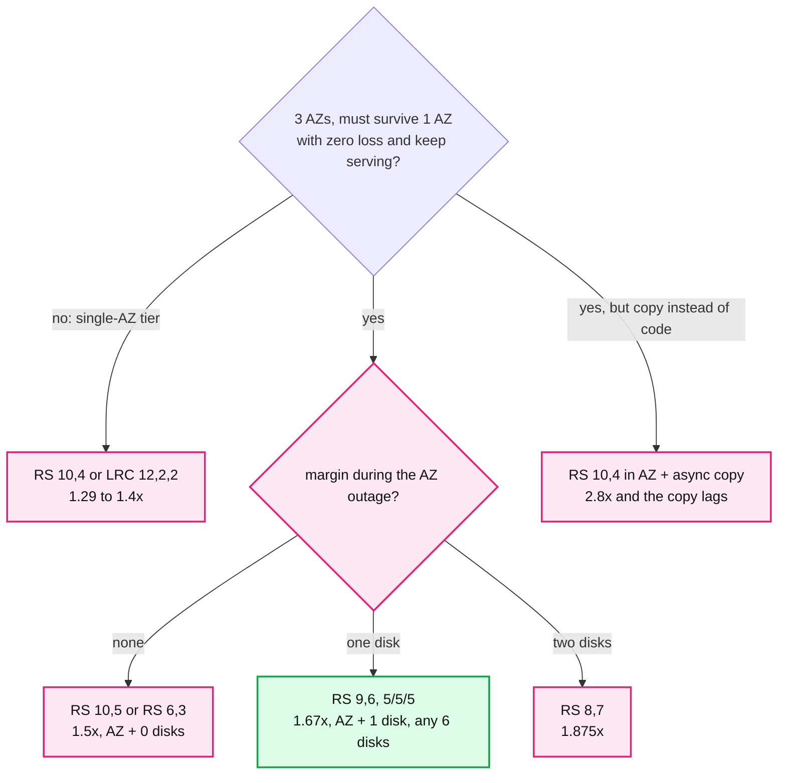
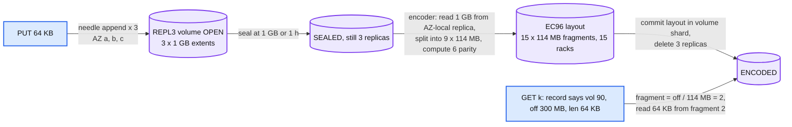

# Deep dive: erasure coding, replication, and the durability number

> One-line answer: every sealed byte is RS(9,6) across 15 disks in 15 racks, 5 per AZ, because that is the cheapest code (1.67x) that survives an AZ plus one disk over three AZs; small objects are 3x-replicated only while their volume is open, then encoded as a unit. The durability number is dominated by the repair window and by correlated failure, not by the exponent, so the design spends its effort on distributed repair and placement.

Part of [`../solution.md`](../solution.md) §5.3. Research in [`../research/durability-and-placement-survey.md`](../research/durability-and-placement-survey.md) §1 to §3 and §10. Papers: f4 (OSDI '14), Azure LRC (ATC '12), Copysets (ATC '13), Google "Availability in Globally Distributed Storage Systems" (OSDI '10), Backblaze durability post. The file system's [`durability-and-erasure-coding`](../../distributed-file-system/deep-dives/durability-and-erasure-coding.md) covers the same math for a single-DC RS(10,4); this one is about the 3-AZ constraint and the small-object path.

## 1. Reed-Solomon in one paragraph

RS(k, m) splits a unit of data into k equal fragments and computes m parity fragments such that any k of the k+m reconstruct the whole. Storage overhead (k+m)/k. Survives any m losses. Rebuilding one lost fragment reads k fragments (k x read amplification). Encoding and decoding cost is ~3 to 5 GB/s per core with ISA-L; a cluster ingesting 200 GB/s needs ~50 cores. Small reads inside one data fragment cost one disk read; reads that need a missing fragment cost k reads plus a decode.

## 2. The 3-AZ constraint sets the parameters

Requirement: lose one AZ, lose no data, keep serving. With 3 AZs, fragments are spread as evenly as possible, so an AZ loss removes ⌈n/3⌉ fragments.

```
Survive an AZ  <=>  n - ceil(n/3) >= k  <=>  m >= ceil(n/3)  <=>  roughly m >= k/2  <=>  overhead >= 1.5x

RS(10,4) n=14: AZ takes 5, leaves 9  < k=10.  Fails.
RS(12,4) n=16: AZ takes 6, leaves 10 < k=12.  Fails.
RS(6,3)  n=9:  AZ takes 3, leaves 6  = k.     Survives AZ, zero margin: AZ + 1 disk loses data. Overhead 1.5x.
RS(10,5) n=15: AZ takes 5, leaves 10 = k.     Same, zero margin. 1.5x.
RS(9,6)  n=15: AZ takes 5, leaves 10 > k=9.   AZ + 1 disk. Any 6 disks. 1.67x.   <- chosen
RS(8,7)  n=15: AZ + 2 disks. 1.875x.
LRC(12,2,2) n=16: AZ takes 6; needs 12; fails. Single-DC code.
```

The Staff point: the 1.5x floor is a property of "3 AZs, tolerate 1", not of any code. Anyone proposing 1.4x is either not AZ-tolerant or is paying for a separate copy (f4: RS(10,4) in a DC plus an XOR across DCs = 2.1x). We pay 0.17x over the floor for one disk of margin during an AZ outage, which is the state in which you most want margin.



## 3. The durability equation, honestly

```
Inputs: AFR = 1.5% per disk-year (Backblaze fleet 2024: 1.57%). W = repair window after the first loss.

Fragment loss rate inside W:  lambda_W = AFR x W / 8,760 h.
   W = 30 min:  lambda_W = 8.6e-7        W = 5.5 days (single-target rebuild at 50 MB/s):  lambda_W = 2.3e-4

RS(9,6): data lost iff 7 of 15 fragments die inside one window.
   P_year ~ n x AFR x C(n-1, m) x lambda_W^m = 15 x 0.015 x C(14,6) x lambda_W^6
   W = 30 min:  0.225 x 3,003 x 4e-37 = 3e-34 per volume-year.   x 57 M volumes = 2e-26 losses/year.
   W = 5.5 d:   0.225 x 3,003 x 1.5e-22 = 1e-19 per volume-year.  x 57 M = 6e-12 losses/year.

3x replication (for comparison, 500 PB in 64 MB chunks = 7.8 B chunks):
   P_year ~ 3 x AFR x C(2,2) x lambda_W^2
   W = 30 min:  0.045 x 7.4e-13 = 3.3e-14.  x 7.8 B = 2.6e-4 losses/year. 11 nines, barely.
   W = 5.5 d:   0.045 x 5.3e-8 = 2.4e-9.    x 7.8 B = 19 chunks lost per year. 9 nines. This is the design that pages you.
```

Three lessons, in the order to say them:
1. **Repair window is the knob.** For 3x it moves the answer by five orders of magnitude; for RS(9,6) by fifteen. Distributed repair (every surviving disk rebuilds a slice) is not an optimization, it is the durability design.
2. **The RS(9,6) independent-failure number is meaningless.** 1e-26 says the model is wrong, not that the system is that safe. What is left is correlated failure and software.
3. **Correlated failure is bounded by placement, not by math.** A rack takes ≤ 1 fragment, an AZ ≤ 5, a power domain ≤ whatever the placement rule says (we also cap at 1 per power domain within an AZ). A firmware batch is the one that placement does not see; mitigate by mixing drive vendors and firmware versions across the 15 disks of a volume group (a placement constraint like rack).

What "11 nines" then means when you say it: "Independent-failure loss is negligible by construction. Correlated loss requires 7 disks of the same volume to die inside a 30-minute window, which the placement makes require a multi-rack event, at which point the region is having a disaster and we are into DR. The residual risk is a software bug that deletes or corrupts live data, which is why the reconciler, the 24 h GC grace, and the client checksum on every read exist. Backblaze publishes this same shape of argument for 17+3."

## 4. Small objects: replicate, seal, encode



- Why not inline EC for a 64 KB object: 15 fragments of 4.3 KB, 9 disk reads to fetch it, repair dominated by per-fragment RPC overhead, and 15 inventory rows per object. Haystack and f4 solved this in 2010 and 2014: pack, seal, encode the pack.
- Why the record does not change: the segment is `(volume_id, offset, length)` in the volume's logical 1 GB address space. REPL3 stores that address space three times; EC96 stores it as 9 data fragments of 114 MB each (fragment i holds bytes [i x 114 MB, (i+1) x 114 MB)). The reader computes the fragment. An object straddling a fragment boundary (0.06% at 64 KB) reads two fragments.
- The 3x window: seal at 1 GB or 1 h, encode within 1 h. So small bytes are at 3x for at most ~2 h, ~0.05% of raw capacity at any time. The encoder budget is 23 volumes/s x 1 GB = 23 GB/s read, 38 GB/s write, ~6 cores of RS.
- The encoder is a background worker with a CAS on the volume's layout version. Two encoders on one volume: the second's commit fails and its fragments are deleted.

## 5. Large objects: inline EC

- 8 MB and up: the gateway stripes the object in rows of 9 x 4 MB data chunks + 6 x 4 MB parity, all appended at the same offset to the 15 extents. A 260 MB object is 8 rows (the last row is zero-padded to the 4 MB chunk boundary on parity only; the data fragments record the true length).
- Read of a byte range: `row = off / 36 MB`, `chunk = (off mod 36 MB) / 4 MB`, `fragment = chunk`, `fragment_offset = row x 4 MB + (off mod 4 MB)`. One fragment for a 4 MB row-group read; 9 fragments in parallel for a full scan.
- Why 8 MB: at the threshold, fragments are ~0.9 MB (one HDD seek is worth ~1 MB of transfer at 150 MB/s and 8 ms). Below that, the seeks dominate. Above, replicate-then-encode would read and write every byte twice.

## 6. Degraded reads and the AZ outage

- A read whose data fragment is missing reads any 9 of the 14 remaining and decodes: 9x read amplification, plus ~1 ms decode for 4 MB. p99 for that read goes from ~10 ms to ~30 ms.
- During an AZ outage, one third of data fragments are missing, so one third of reads are degraded. Aggregate read amplification is 1 + (1/3)(9 - 1) = 3.7x on disk I/O. The 9x headroom on random IOPS (§2 of the solution) covers it, barely: this is why the read concurrency cap and the `503` path matter during an outage, and why we say "degraded, not down".
- Repair during the outage: none for AZ-scoped loss (4 h delay). If the AZ is really gone, repair 280 PB of fragments onto the two surviving AZs at the event budget: 45 k x 2/3 disks x 60 MB/s = 1.8 TB/s of reads with 9x amplification -> ~16 days. State that number; it is the DR conversation.

## 7. LRC and where it fits

Azure's LRC(12,2,2): 12 data fragments in two groups of 6, one local parity per group, two global parities. A single missing fragment is rebuilt from its 6 group siblings instead of 12: half the repair I/O, and single-fragment loss is 98% of repairs (Hitchhiker, SIGCOMM '14). Overhead 1.29x. Tolerates any 3 losses and 86% of 4-loss patterns.

Where it fits here: not the 3-AZ hot tier (an AZ takes 6 of 16 and k = 12). It is the right code for a single-AZ cold tier with an async copy, or for a future 4th AZ. Named as the §10.11 evolution.

## 8. Scrubbing and checksums

- Every 64 KB block of every extent carries a CRC32C in the storage node's inventory; verified on every read and every scrub.
- Scrub cadence 14 days at 1 to 2% of disk bandwidth (24 TB / 14 d = 20 MB/s, capped at 2 MB/s when the disk is busy, which stretches to 30 days). FAST '08: 0.86% of nearline disks show mismatches over 41 months; at 45 k disks that is ~8 disks a month producing a bad block. Without scrub, a latent error is found when the other fragments are gone.
- A bad fragment is a lost fragment for repair purposes; the disk gets a strike; three strikes drain it.
- The client's full-object CRC64NVME in the record is the end-to-end check: verified on PUT before commit and on GET before the last byte is sent. A wrong encoder, a wrong decoder, a bad NIC, all show up as a `500`, never as wrong bytes.

## 9. What to say in 60 seconds

"Three AZs and one-AZ tolerance put a floor of 1.5x on any erasure code, because an AZ takes a third of the fragments. RS(9,6) at 1.67x survives an AZ plus one disk and any six disks. Small objects are packed three-way into 1 GB volumes and encoded as a unit after seal, like Haystack into f4; large objects are encoded inline. The durability number is set by the repair window, so repair is distributed across hundreds of disks and a dead disk is rebuilt in about two hours; the independent-failure loss rate is then negligible and the real risks are correlated failure, bounded by one-fragment-per-rack placement, and software, bounded by checksums on every read and a reconciler."
