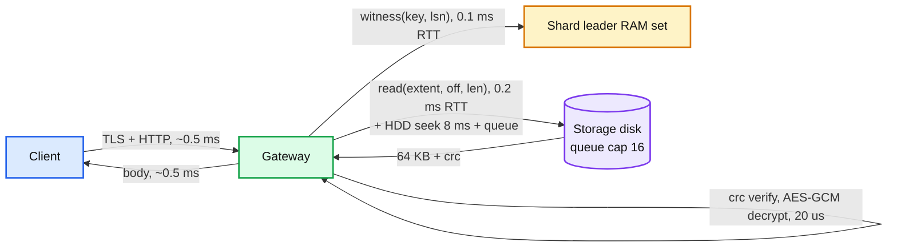

# Deep dive: the read path, hot objects, and the immutable cache

> One-line answer: a GET is a witness call to the shard leader (in-memory, 50 us), a record cache hit, and one direct fragment read from the disk that holds the requested range; the first byte is under 50 ms because the disk queue is capped at 16. A hot object is absorbed by a gateway-local content cache keyed by `(volume, offset, length)`, which is correct forever because extents never change, and hot chunks are gossiped to every gateway within two seconds. No CDN, no cache cluster, no invalidation.

Part of [`../solution.md`](../solution.md) §4.2, §5.4. Research in [`../research/metadata-consistency-and-interview-survey.md`](../research/metadata-consistency-and-interview-survey.md) §3, §9 and [`../research/real-world-architectures-survey.md`](../research/real-world-architectures-survey.md) (S3 Express, Haystack cache tier). Witness details in [`metadata-index-and-listing.md`](metadata-index-and-listing.md) §5.

## 1. The path and its latency budget



```
p50, small object, cold:   0.5 + 0.1 + 0.2 + 8 (seek) + 0.5 = ~9.5 ms
p99:                        the seek under a queue of 16 at ~8 ms each = up to 130 ms if the queue is full
                            -> cap outstanding reads per disk at 16 and RETRY_OTHER_FRAGMENT the 17th;
                               with the cap, p99 is ~3 queued seeks = ~30 ms. Budget 50 ms holds.
record cache miss:          + one RocksDB read on the leader, ~0.3 ms
witness "unknown":          same as a miss
EC degraded read:           9 fragment reads in parallel (~10 ms) + decode 4 MB (~1 ms) = ~12 ms p50, ~40 ms p99
large sequential:           9 fragments streamed in parallel, ~9 x 100 MB/s = 900 MB/s per object; client-side range fan-out for more
```

## 2. Which fragment, which replica

- REPL3 (open or sealed-not-yet-encoded): read the AZ-local replica; on `BAD_CRC` or timeout, the next AZ.
- EC96: `row = off / 36 MB`, `chunk = (off mod 36 MB) / 4 MB`, `fragment = chunk`; for a sealed-small-object volume, `fragment = off / 114 MB`. Read that one data fragment. A range that crosses a chunk boundary reads two fragments, in parallel.
- Missing or bad fragment: read any 9 of the remaining 14 (prefer AZ-local, then least-loaded), decode, serve, report to repair. The decode is per 4 MB row, so a 64 KB read still decodes 4 MB x 9; acceptable in degraded mode.
- Hedging: if a fragment read has not returned in max(2 x p50, 20 ms), send the same read to another replica (REPL3) or fetch a 10th fragment and decode (EC96). First answer wins; the other is cancelled. Adds ~5% read load, cuts p99 roughly in half on a fleet with a few slow disks.

## 3. The content cache

- Key: `(volume_id, fragment_idx, offset, length)`. Value: ciphertext bytes plus their CRC. Immutable: an extent's bytes at an offset never change after they are written (append-only, sealed, never modified; compaction creates a new volume id). So there is no invalidation, ever. A volume that gets compacted away is simply never requested again and ages out.
- Tiers per gateway: RAM 128 GB (LRU, 4 MB and 64 KB pages), NVMe 4 TB (FIFO by insertion, read-through). 200 gateways = 25 TB RAM + 800 TB NVMe. The working set of a lake's hot metadata (Delta logs, checkpoints, table manifests) is far under 25 TB.
- Routing: the load balancer hashes on `(bucket, key)` so the same object tends to hit the same 2 to 3 gateways (bounded-load consistent hashing), which makes each gateway's cache effective without a shared cache. Any gateway can serve any key; the hash is an affinity, not a requirement.
- Hot set replication: each gateway counts reads per cache key in a 1 s window; the top-1,000 are gossiped fleet-wide every second; any chunk above 1 k reads/s fleet-wide is pulled into every gateway's RAM. A new hot object is fully absorbed in ~2 s. During those 2 s, the owning disk serves at its 16-deep cap and the excess gets `503 Slow Down`; S3 does the same ("request rate scaling takes time").
- Ciphertext in cache, decrypt per request: the cache never holds plaintext, so a cache dump is not a data leak and a KEK rotation does not invalidate the cache.

## 4. What a hot object costs, with and without the cache

```
Hot object: 10 KB, 100 k GET/s (every executor of a 100 k-task job reads _last_checkpoint at start).

Without cache:  100 k reads/s on one disk (REPL3, 3 replicas -> 33 k/s each, AZ-local routing). HDD does ~80 IOPS.
                400x over. Queue cap makes it 503 for 99.8% of requests. The job stalls.
With cache:     100 k x 10 KB = 1 GB/s from RAM spread over 200 gateways = 5 MB/s each. Invisible.
                Witness: 100 k calls/s on one shard leader, ~50 us each = 5 cores. Fine; the cap is ~1 M/s.
Hot large object: 1 GB Parquet file read by 10 k tasks, 4 MB row groups: 40 k x 4 MB/s = 160 GB/s.
                9 data fragments on 9 disks: 18 GB/s each. Way over an HDD's 150 MB/s.
                Cache: 1 GB fits in every gateway's RAM; 160 GB/s over 200 gateways = 800 MB/s each. Fine.
```

Push back on the textbook: a CDN would add a second cache with its own key space, TTLs, and a purge API; a Redis cluster would add a network hop and a size limit. Neither buys anything over a local cache of immutable bytes, and both add a way to serve stale data if someone sets a TTL. The witness on the record plus immutability of the bytes is the whole consistency story.

## 5. Range reads on Parquet, precisely

A Parquet reader does: 8-byte footer length read at the end, footer read (tens of KB to a few MB), then row-group reads (a few MB each, scattered). With a 260 MB file in an EC96 volume:
- Footer: last row, one fragment, one 64 KB to 1 MB read. Cached after the first reader.
- Row groups: each 4 MB chunk is one fragment read; a reader that wants row groups 3, 7, 11 issues three range GETs in parallel and hits three different disks.
- The gateway supports multi-range requests (`Range: bytes=a-b, c-d`) to save round trips; the SDK coalesces adjacent ranges.
- A `HEAD` for size and etag is a record read plus a witness call; no storage access.

## 6. The flash tier (evolution)

For buckets that need single-digit-millisecond first byte (S3 Express One Zone class): a placement policy that puts the bucket's REPL3 volumes on NVMe and never encodes them (3x on flash, single AZ optional for the latency win). Same gateway, same record, same cache; only the allocator's disk choice and the encoder's exclusion list change. Cost: NVMe at ~10x HDD per TB, so this is a per-bucket opt-in with a separate price.

## 7. What to say in 60 seconds

"A GET is a witness call, a cached record, and one direct read of the fragment that covers the requested range; the disk queue is capped at sixteen so the first byte stays under fifty milliseconds. Erasure coding already spreads a large object over nine disks. A hot small object lands on one disk, so gateways keep a content cache keyed by volume and offset, which is correct forever because extents never change, and the top hot chunks are gossiped to every gateway within two seconds. No CDN, no cache cluster: immutability plus a witness on the record is the whole invalidation story."
