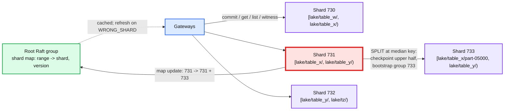

# Deep dive: the metadata index, listing, and the hot prefix

> One-line answer: object records live in ~2,000 Raft shards range-partitioned on `(bucket, key)` so that a prefix is one contiguous range and LIST is one ordered iterator; shards split by size and by load; the hot-prefix cost is bounded by one leader's 20 to 50 k commits/s, and reads are taken off the leader by a witness that lets gateways cache records without giving up strong consistency.

Part of [`../solution.md`](../solution.md) §3.3, §4.4, §5.2. Research in [`../research/metadata-consistency-and-interview-survey.md`](../research/metadata-consistency-and-interview-survey.md) §1 to §3, §6 to §8. Systems: Windows Azure Storage partition layer (SOSP '11), S3 consistency (Vogels 2021), S3 prefix docs, Tectonic ZippyDB (FAST '21). The file system's [`metadata-sharding`](../../distributed-file-system/deep-dives/metadata-sharding.md) covers Raft-per-shard mechanics; this one is about the key space.

## 1. Hash or range

| | Hash on key | Range on `(bucket, key)` |
|---|---|---|
| PUT spread | perfect | skewed by prefix |
| GET spread | perfect | skewed by prefix |
| LIST prefix | scatter-gather over all shards, merge, paginate | one iterator on one or a few shards |
| Delimiter (directory) listing | scatter-gather plus per-shard skip | one seek per common prefix |
| Locality for a table's files | none | all in one shard: multi-key commit within a prefix is possible |
| Hot spot | none from keys | one leader per hot prefix |
| Used by | Tectonic (files are listed via a directory layer), Dynamo-style stores | S3, Azure, Bigtable, HBase, CockroachDB |

Range wins for an object store because LIST is in the API and because analytics workloads read a prefix as a unit. The whole cost is the hot prefix, which §4 sizes.

## 2. Layout in RocksDB

```
CF object:   key   = bucket || 0x00 || key || 0x00 || (MAX - version_seq)      newest version first
             value = record (~300 B: version_id, size, crc64, etag, state, dek_wrapped, segments[], timestamps)
CF mpu:      key   = bucket || 0x00 || key || 0x00 || upload_id [|| part_no]
CF dedup:    key   = client_id || request_id  ->  outcome, ttl 10 min (compaction filter drops expired)
Prefix bloom on bucket || key.  Block cache 16 GB per node.  4 memtables x 64 MB per shard.
```

- `get(k)`: one `Seek(bucket||k||0x00)` returns the newest version; skip if it is a delete marker and `versionId` was not given. One probe, ~10 us from block cache.
- `list(prefix)`: `Seek(bucket||prefix)`, iterate while the key has the prefix, collapsing versions (emit only the newest non-deleted per key), up to 1,000. With a delimiter: on emitting a common prefix `p/d/`, `Seek(bucket||p/d/ + 0xFF)` (the byte after the delimiter range) to skip its whole subtree. A directory with 1 M files costs one seek.
- Record size matters: 100 B objects x 300 B = 30 TB, and every byte of the record is read on every cache miss. Keep segments compact (varint offsets, 24 B per segment); inline nothing else.

## 3. Shard map, split, and merge



- Split triggers: 20 GB of RocksDB, or 10 k commits/s, or 100 k reads/s, sustained 5 min. The leader writes a `SPLIT(median)` entry; a new Raft group is bootstrapped on three fresh nodes from a RocksDB checkpoint of the upper range (hard links, seconds; transfer of ~10 GB at 1 GB/s, ~10 s); the leader stops serving the upper range once the new group is live; the root group records the new map. Gateways with the old map get `WRONG_SHARD{new_range, new_shard}` and refresh. Client-visible effect: one retry.
- Merge: two adjacent shards both under 5 GB and under 500 commits/s for a day merge the same way in reverse. Keeps shard count from growing without bound as tables are dropped.
- Placement of shard replicas: one per AZ, spread across metadata nodes by a bin packer that balances RocksDB bytes and commit rate. A node holds ~20 shard replicas.
- Why not Azure's single "partition manager" with a lock service: same idea, and ours is the root Raft group; a shard is a RangePartition. Azure moves partitions between servers without copying (the data is in the shared stream layer); we copy a checkpoint because each shard owns local NVMe. 10 s vs sub-second, acceptable at our split rate (~10/day).

## 4. The hot prefix, sized

Monotonic keys under one prefix (`part-00001...`, `000123.json`) always land in the last range of that prefix, so splitting does not spread them. The ceiling is one Raft leader.

```
Commit entry            ~400 B (record 300 B + request id + precondition + raft header)
Raft leader throughput  4 MB batches every 5 ms, NVMe fsync ~100 us: log is not the limit
RocksDB apply           single-threaded per shard: ~50 k small puts/s with 4 memtables, L0 trigger 8, no write stall
Practical per-shard cap 20 k commits/s with headroom; alert at 15 k for 5 min

Spark job:              10 k part files/s into one prefix -> 10 k commits/s on one shard. OK.
                        A job that big is ~1 k executors each writing 10 files/s; realistic peak.
Delta log:              commits are serialized by the protocol anyway: ~10/s per table. Nothing.
Reads of _delta_log/:   1 M witness calls/s on one leader: hash lookup, ~50 us of CPU incl. RPC, ~4 cores. OK.
                        Without the witness: 1 M RocksDB reads/s: 200 k/s cap. NOT OK. The witness is the load-bearing piece.
```

Beyond the cap, in order:
1. `503 Slow Down` with `Retry-After` for the offending tenant's commits (fair queue per tenant per shard). This is exactly S3's behaviour and its documented 3,500 PUT/s per prefix (S3's per-partition budget is lower than ours because it is a multi-tenant public service with a smaller unit).
2. Per-bucket salted ranges: keys stored as `hash(key) mod 16 || key` so the prefix becomes 16 ranges on 16 shards; LIST merges 16 iterators (16x list cost, still ordered). Opt-in via bucket policy, because it changes the cost model for every LIST on the bucket. This is "randomize your prefixes" done by the store, without breaking the user's key names.
3. Follower witness: followers maintain the same modified-key set from the apply stream and answer witness calls with staleness bounded by apply lag (~1 ms). Strictly weaker than the leader witness (a read could miss a commit that is committed but not yet applied on that follower). Behind a per-bucket flag with the weaker guarantee documented.

## 5. The witness, precisely

- Every apply that changes a key does `witness[key] = lsn` and prunes entries older than 60 s. On election, the new leader starts an empty set with `set_start_lsn = its commit index` and `set_start_time = now`.
- A gateway holds `(record, lsn_seen)` in its cache, where `lsn_seen` is the shard's applied LSN at the time of the read that filled the cache. On a GET, it asks `witness(key, lsn_seen)`:
  - if `key in set` and `set[key] > lsn_seen`: "changed", full read.
  - if `key in set` and `set[key] <= lsn_seen`: "unchanged".
  - if `key not in set` and `lsn_seen >= set_start_lsn`: "unchanged" (no modification since the set began, and the cache is at least that fresh).
  - if `key not in set` and `lsn_seen < set_start_lsn`: "unknown", full read (the cache predates the set; a modification could have happened before the set began).
- The answer is served under the leader lease, so it is linearizable with respect to commits.
- Cache entries older than 60 s are refreshed rather than witnessed (`lsn_seen` would be older than the set on a long-lived leader too; the rule above handles it, but refreshing bounds memory of stale records).
- This is Vogels' description of S3's post-2020 design: a per-object sequencer and a witness that is "notified on every change and acts as a read barrier".

## 6. LIST semantics, precisely

- Page = `[cursor, cursor + 1000 keys)` scanned on one shard under the leader lease at applied LSN L. Every PUT or DELETE with LSN ≤ L is reflected; none with LSN > L. That is a linearizable snapshot for the page.
- Across pages: no guarantee. Cursor is the last key; the next page starts after it. A key inserted behind the cursor between pages is missed; one ahead is seen.
- Crossing shards: the gateway follows the shard map; the cursor is a key so it needs no shard-local state. A shard split between pages is invisible.
- Delete markers and noncurrent versions are collapsed in the iterator (`list-type=2`); `list-object-versions` is the same scan without collapsing.
- Cost: 1,000 keys x ~350 B = 350 KB per page from block cache, ~1 ms; a listing of 100 k files is 100 pages, ~100 ms serial or ~10 ms with parallel cursor ranges (the client can split the key range itself, as S3 users do with prefix fan-out).

## 7. Small objects and the metadata budget

- 70 B objects under 1 MB cost 21 TB of records; the data is 4.5 PB. Metadata is 0.5% of small-object bytes and 8% of all bytes. The index is sized by count, not bytes: 2,000 shards, 300 nodes.
- Inline threshold as an evolution: objects ≤ 4 KB stored in the record (MinIO inlines ≤ 128 KiB). Saves the needle write and the storage read for tiny Delta files; costs record size (RocksDB compaction I/O scales with value bytes) and Raft log bytes (3x replication of the inline bytes, which is the same 3x the REPL3 path pays before encoding). Gate per bucket.
- Bytes per record are the number to defend: 300 B. Every extra field costs 30 TB x 3 replicas of NVMe and one more byte of every commit.

## 8. Why not a single database

- Single Postgres: 65 k commits/s and 30 TB do not fit one primary; and a hot prefix would be a hot page anyway.
- DynamoDB: hash partitioned by design (range on sort key within a partition key only); a bucket-wide ordered LIST is a scatter-gather or a GSI; per-partition write cap ~1 k WCU/s is far below our 20 k commits/s per shard.
- Spanner / CockroachDB / FoundationDB: range partitioned, auto-split, cross-key transactions. The buy option, and the honest answer if "from scratch" were not in the prompt. We use the same layout (range, split by load) and skip the general transaction layer because one per-shard multi-key entry covers the only cross-key need (a Delta commit plus its checkpoint pointer, both under `_delta_log/`).

## 9. What to say in 60 seconds

"Range partition on bucket and key, because LIST and prefix locality are in the API. Two thousand Raft shards on NVMe, split by size or by load, merged when cold, mapped by a tiny root group that gateways cache. A prefix is one shard, so a hot table is one leader: that leader takes about 20 k commits a second, which covers any real Spark job; past that the tenant gets 503 and can opt into salted ranges. Reads never hit RocksDB on the hot path: gateways cache records and ask the leader's in-memory witness whether the key changed since the LSN they cached at, which keeps strong consistency at a million calls a second per shard."
