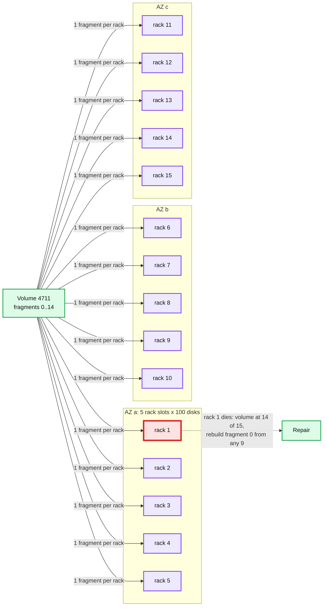
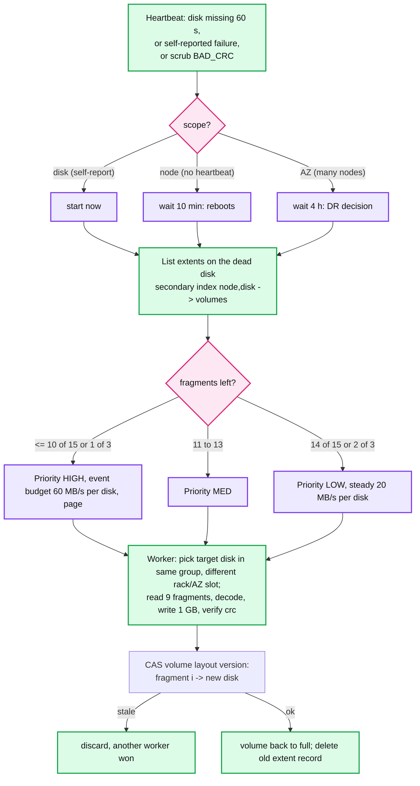

# Deep dive: placement, rebalancing, and repair

> One-line answer: placement is a policy in a central volume map, not a hash function: every volume's 15 extents go to 15 racks, 5 per AZ, chosen from a volume group of ~1,500 disks (scatter width 100) so correlated failures rarely hit one volume and a dead disk still has hundreds of peers to rebuild from. New capacity fills from new writes with zero forced movement; repair is prioritized by fragments remaining and capped per disk so it never starves reads.

Part of [`../solution.md`](../solution.md) §5.3, §7. Research in [`../research/durability-and-placement-survey.md`](../research/durability-and-placement-survey.md) §4, §5. Papers: CRUSH (SC '06), Copysets (ATC '13), Ceph recovery docs, Warfield FAST '23 on spreading heat.

## 1. Computed placement vs a map

| | CRUSH / consistent hashing | Central volume map (chosen) |
|---|---|---|
| Lookup | none; client computes from cluster map | one cached map, 57 M x 200 B = 11 GB, versioned |
| Failure domains | encoded in the hierarchy | a constraint the allocator enforces |
| Copysets | not natively (random per PG) | yes: volume groups |
| Hot volume policy | no | yes: raise replication, pin to flash |
| Node add | moves ~1/N of data whether wanted or not | zero forced movement; new writes fill it |
| Drain a node | remap and move | allocator excludes it; mover copies at chosen rate |
| Failure of the map | n/a | volume shards are Raft; reads use the cached map, writes have 30 s of lease headroom |

We already run sharded Raft metadata, so the map costs nothing extra, and it lets placement be a policy we can change without re-hashing an exabyte. Ceph chose CRUSH to avoid any central component; that was the right call for a system without one.

## 2. The allocator

```
allocate(type=EC96, policy):
  group   = pick a volume group with free capacity (round robin weighted by free bytes)
  racks   = choose 15 racks from the group: 5 per AZ, at most 1 per power domain per AZ, exclude draining racks
  disks   = per rack, the disk with the most free bytes and the lowest queue depth, excluding disks with a strike
  vendors = reject the choice if > 8 of 15 disks share a drive model + firmware (correlated-batch rule)
  extents = create 1 GB extent on each (fallocate), record (volume_id, frag_idx, node, disk) in the volume shard
  lease   = to the requesting gateway, epoch 1, 30 s
```

- A **volume group** is a fixed set of ~1,500 disks (100 per rack slot x 15 slots, 5 slots per AZ). Every volume draws its 15 disks from one group. Scatter width per disk is therefore ~1,500 - 100 = 1,400 peers, not 45 k. That is the copyset idea at a coarse grain: a correlated event that kills 7 disks loses data only if all 7 fall in one group AND one volume, which the per-rack rule makes require a 7-rack event.
- Trade: repair for one disk draws on ~1,400 peers instead of 45 k. 24 TB x 9 read amplification over 1,400 peers at 20 MB/s = ~2 h. Acceptable; a smaller group (300 disks) would give ~11 h, too long.



## 3. Spreading heat

Warfield's S3 point: each object is spread over many disks and each disk holds pieces of many objects, so per-disk load is an average over many customers. Our version:
- Every large object is on 9 data disks by construction; a 260 MB scan reads 9 disks in parallel.
- Small objects are packed into volumes, so a hot small object is a hot needle on 1 disk (REPL3) or 1 fragment (EC96): the gateway content cache absorbs it ([`hot-objects-and-read-path.md`](hot-objects-and-read-path.md)).
- Per-extent heat is reported in the storage heartbeat. A volume above 500 reads/s sustained for 10 min gets extra replicas of its hot extents on NVMe (a `hot_replicas[]` field on the volume record, read-only copies, dropped when cold). Policy, not math; possible only because placement is a map.

## 4. Adding and removing capacity

- **Add 100 nodes:** they join a new or existing volume group; the allocator's free-bytes weighting sends most new volumes there. No movement. Fill balance across the fleet converges over weeks; if IOPS balance matters sooner, the mover copies cold ENCODED volumes from the fullest disks at ≤ 5 MB/s per source disk.
- **Drain a node** (decommission, firmware): allocator excludes it; leases on its open volumes are not renewed (volumes seal); the mover rebuilds its fragments elsewhere at the steady budget (like repair but from the live source, 1x read amplification). 36 x 24 TB at 20 MB/s per target over ~2,000 targets: ~1 h. Then power off.
- **Replace a dead disk:** the new disk is empty and joins the group; the allocator fills it. The dead disk's extents were already rebuilt elsewhere; nothing moves back.
- **Retire a volume group:** drain every node in it; the group's volumes migrate by compaction into other groups' volumes.

## 5. Repair



- Repair reads 9 fragments (9 GB per volume for a 1 GB fragment) and writes 1 GB. The 9x read amplification is the price of RS; LRC would cut it to 6x for single-fragment loss but does not fit the 3-AZ constraint (see [`erasure-coding-and-durability.md`](erasure-coding-and-durability.md) §7).
- Budget: 20 MB/s per disk steady (13% of an HDD's sequential rate), 60 MB/s during a declared event. Repair traffic is a separate QoS class on the storage node, behind client reads and appends (mClock-style shares: client 70%, repair 20%, scrub 10%, with work-conserving borrowing).
- Ordering inside a priority class: oldest degradation first, so no volume starves.
- Repair storm protection: the 10 min node delay (a rolling reboot of 50 nodes must not trigger 43 PB of rebuild), the per-disk cap, and a fleet-wide cap of 10% of total disk bandwidth.
- Rebuild time table (24 TB disk, 9x read amplification, distributed):
  | Peers | Per-peer budget | Time |
  |---|---|---|
  | 1,400 (group) | 20 MB/s | ~2.1 h |
  | 1,400 | 60 MB/s | ~43 min |
  | 45,000 (random placement) | 20 MB/s | ~4 min, but random placement loses the copyset property |
  | 1 (naive) | 50 MB/s | 5 days |

## 6. Scrub

- Every extent, every 14 days, at 1 to 2% of disk bandwidth, verifying every 64 KB CRC32C. A full pass of 24 TB at 20 MB/s is 14 days exactly, so on busy disks it stretches to 30.
- Findings: `BAD_CRC` on a fragment → treated as one lost fragment → repair from 9 others → old extent deleted → strike on the disk. Three strikes: drain.
- Deep verification sample: 0.1% of volumes per pass are fully decoded with 6 fragments withheld to catch a wrong parity (encoder bug) rather than a wrong byte.

## 7. Heartbeats and the inventory

- Storage node → volume shard every 3 s: disk health (SMART, queue depth, free bytes), per-extent heat deltas, and any extent whose state changed. Full inventory (57 k extents x 32 B = 1.8 MB) every 6 h, used to detect extents the map does not know about (leaked) or map entries the node does not have (lost).
- Dead detection: 60 s without heartbeat → node SUSPECT (reads route around it); 10 min → DEAD (repair starts). A disk the node itself reports as failed is DEAD immediately.

## 8. What to say in 60 seconds

"Placement is a policy in a central, cached volume map, not a hash function, because we already have sharded metadata and a map lets us do things a hash cannot: copyset-style volume groups so correlated failures rarely take seven fragments of one volume, one fragment per rack and five per AZ, extra replicas for hot volumes, and zero forced movement when we add capacity. Repair is prioritized by fragments remaining, capped per disk so it never starves reads, delayed ten minutes for a node and four hours for an AZ so reboots and blips do not trigger petabytes of rebuild, and spread across about fourteen hundred peers so a dead disk is rebuilt in about two hours."
