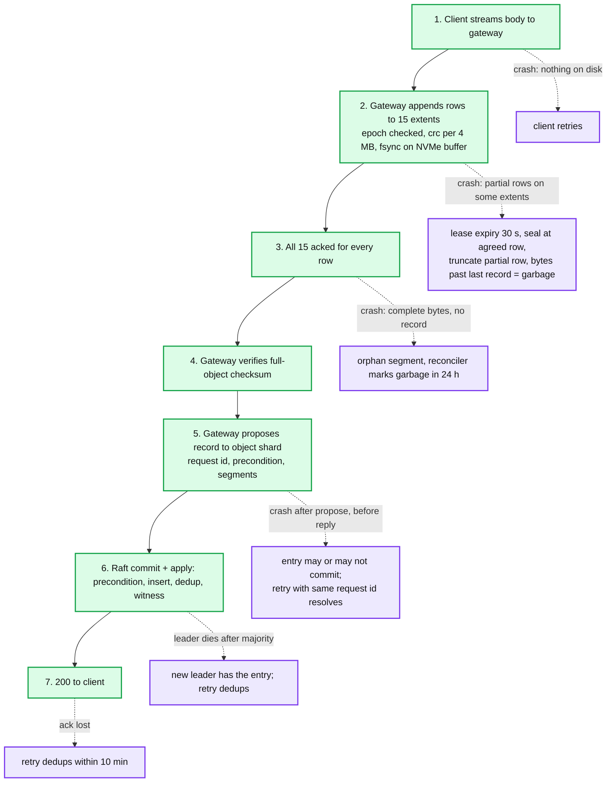
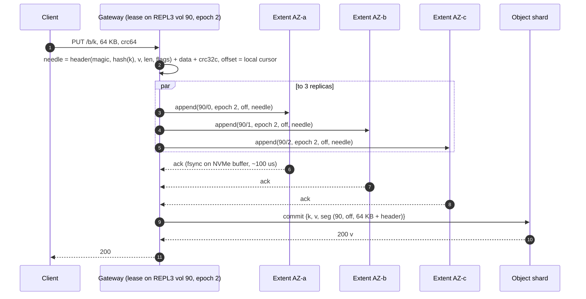

# Deep dive: the write path and the commit point

> One-line answer: bytes go to storage first, the metadata record goes to Raft last, and the record's commit is the only moment an object starts to exist. Everything on disk that no committed record points at is garbage by definition, so a crash at any step leaves orphans, never a half-visible object. Single writer per extent (lease + epoch) and seal-and-move on any failure mean nothing is ever repaired in flight.

Part of [`../solution.md`](../solution.md) §4.1, §4.5, §5.1. Research in [`../research/metadata-consistency-and-interview-survey.md`](../research/metadata-consistency-and-interview-survey.md) §3, §4 and [`../research/durability-and-placement-survey.md`](../research/durability-and-placement-survey.md) §7. Same shape as Azure's stream layer (SOSP '11) and the file system's [`write-path-and-commit`](../../distributed-file-system/deep-dives/write-path-and-commit.md), with the object record in place of the inode.

## 1. The invariant

```
An object version V is visible  <=>  its record is applied in the object shard's Raft log.
A record is proposed            only after every fragment (15 or 3) has acked a durable append of every byte the record points at.
Therefore: visible => durable on every fragment.   Not visible => nothing promised, bytes are garbage.
```

Two things follow that interviewers probe:
- There is no "partially visible" object and no rollback. The record is one Raft entry; it is there or it is not.
- Retries are safe without coordination between gateways because a second attempt writes new bytes and the dedup table on the shard decides whether a second record is inserted.

## 2. The steps, and the crash at each one



Crash matrix per hop:

| Hop | Duplicates enter | What exists after crash | Who cleans up | User-visible |
|---|---|---|---|---|
| client -> gateway | client retry | nothing | none | one slow PUT |
| gateway -> extents | never retried into the same extent | partial row on ≤ 14 extents, complete rows below | volume shard seals and truncates on lease expiry | none |
| extents acked, no record | gateway retry writes new bytes | complete orphan segment | reconciler | none |
| record proposed | gateway retry | maybe committed | shard dedup on request id | none |
| record committed, ack lost | client retry | committed | shard dedup on request id | none |

## 3. Single writer per extent: lease and epoch

- The volume shard grants a gateway a lease on an OPEN volume: `(volume_id, gateway_id, epoch, expires_at)`. Renewed every 10 s of a 30 s lease. One gateway holds ~4 open REPL3 and ~4 open EC96 volumes.
- Every `append(extent, epoch, offset, bytes, crc)` carries the epoch. Each storage node persists the highest epoch it has accepted per extent (in its RocksDB inventory, fsynced before acking the append that raised it) and rejects anything lower with `FENCED`.
- On lease expiry or explicit release, the volume shard bumps the epoch and pushes it to the 15 (or 3) storage nodes before handing the volume to anyone, or (the common case) simply seals it.
- Because one gateway is the only appender, it assigns offsets locally: no coordination per append, and all 15 extents of an EC volume stay at the same length.

Why not let any gateway append to any volume with a per-append offset from the volume shard? That is a Raft commit per 4 MB row: 80 k commits/s at 330 GB/s. The lease turns that into one commit per volume per 15 GB.

## 4. Seal-and-move

- Trigger: any fragment append not acked within 2 s (per 4 MB), a `FENCED`, a `BAD_CRC`, a lease that could not be renewed, or the extent reaching 1 GB.
- Gateway sends `seal(volume, last_full_row)` to the volume shard. The shard asks every reachable extent for its length, records `min(last_full_row x 4 MB, agreed lengths)` as the sealed length, tells extents to truncate to it, marks the volume SEALED with the failed fragment MISSING, and queues repair.
- Gateway allocates a fresh volume and re-sends rows from `last_full_row + 1`. The object record gets segments `[(old_vol, off, len1), (new_vol, 0, len2)]`.
- Nothing is repaired in flight: the failing extent is never written again. The 14 healthy fragments plus the sealed length are enough to rebuild the 15th later.
- Push back: Tectonic uses quorum appends (write 15, accept 13 acks, repair the stragglers) to protect the write p99. That trades a simpler invariant ("bytes are on every fragment") for a better tail. With a 2 s seal-and-move, our p99 for a 4 MB row is bounded at ~2 s plus one allocate, which is fine for an analytics store; a latency-sensitive tier would revisit this.

## 5. Small objects: the REPL3 needle path



- Three parallel appends, not a chain: the object is 64 KB, the client's bandwidth is not the constraint, and parallel gives the lowest latency (one RTT to the farthest AZ, ~1 ms).
- Group commit on the storage node: appends from many gateways to many extents on one node share one fsync of the NVMe write buffer every 1 ms or 4 MB. 35 k small PUTs/s over 1,250 nodes is 28/s per node; latency is dominated by the cross-AZ RTT, not fsync.
- The volume seals at 1 GB or 1 h, whichever first, then encodes ([`erasure-coding-and-durability.md`](erasure-coding-and-durability.md) §4).

## 6. Conditional PUT inside apply

```
apply(entry):
  outcome = dedup.get(entry.request_id)
  if outcome: return outcome                                  # retry after lost ack
  current = object.seek_newest(entry.bucket, entry.key)       # one RocksDB prefix seek
  if entry.precondition == IF_NONE_MATCH and current and not current.is_delete_marker:
      outcome = 412(current.etag, current.version_id)
  elif entry.precondition == IF_MATCH(etag) and (not current or current.etag != etag):
      outcome = 412(current.etag if current else None)
  else:
      object.put(key, version_seq = next_seq(), record = entry.record)
      witness.mark(entry.key, this_lsn)
      volume_msgs.enqueue(garbage_or_heat_updates)             # async, idempotent
      outcome = 200(entry.record.version_id, entry.record.etag)
  dedup.put(entry.request_id, outcome, ttl 10 min)
  return outcome
```

- Apply is single-threaded per shard, so the read of `current` and the insert are atomic with respect to every other entry on that key. That is the whole linearizability argument.
- The loser has already written bytes; they become orphans. For Delta commits (10 KB JSON) this costs nothing. For a 5 TB conditional PUT that loses, it costs 5 TB of write bandwidth; the API lets the client do a cheap `HEAD` first to avoid the obvious case, and the precondition is still checked at apply for the race.
- Multi-key within one shard: an entry may carry two records (e.g. `_delta_log/000123.json` and `_delta_log/_last_checkpoint`) with preconditions on both; apply evaluates both and inserts both or neither. Same code path. Cross-shard multi-key: refused (would need 2PC; Delta does not need it).

## 7. Multipart

- `initiate` inserts an MPU record `(bucket, key, upload_id)`. Parts are written exactly like large objects into EC96 volumes, each `complete part` inserts a part record `(bucket, key, upload_id, part_no) -> segments, etag`. Re-uploading a part replaces the record; the old segments become garbage.
- `complete(upload_id, [part_no, etag])` is one entry: verify the listed parts exist with matching etags, build the object record with the concatenated segment list and the composite checksum, insert it (precondition allowed), delete the part records and the MPU record. Atomic.
- Limits: 5 MB to 5 GB per part, 10,000 parts, 5 TB. A 10,000-part record has a ~300 KB segment list; RocksDB is fine with it and it is read once per GET (then cached).
- Abort or 7-day lifecycle: delete the part and MPU records; segments become garbage via the volume counters.

## 8. The reconciler

The reconciler is the process that makes "bytes without a record are garbage" true in practice.

- Per sealed volume, every 7 days: read the extent's needle headers or the EC volume's object index (each EC volume keeps a small per-extent manifest of `(offset, length, version_id)` appended by the gateway alongside the data, so reconciliation does not need to decode), look up each `version_id` in the object shard, and mark any unreferenced range as garbage (volume `garbage_bytes += len`).
- The reverse check, per object shard, every 7 days: for a sample of records, verify the referenced `(volume, offset, len)` exists in the extent inventory and, for 0.1% of them, that the bytes decode and match the record's checksum. A record pointing at missing or bad bytes is the data-loss alert.
- Grace: nothing younger than 24 h is ever reconciled as garbage, because it may be an in-flight upload whose record is seconds away.
- Cost: reading 850 PB of manifests (not data) per week is ~1 TB of manifest per day; the sampled decode is ~1 PB/day, ~1% of read capacity.

## 9. What to say in 60 seconds

"Bytes first, record last. The gateway holds a lease on an open volume and is the only appender, so offsets need no coordination and a stale gateway is fenced by epoch. It writes every fragment, waits for all 15 fsync acks, verifies the client's checksum, and then commits one Raft entry with the record and any precondition. Apply is single-threaded per shard, so put-if-absent is linearizable per key. A crash anywhere before the commit leaves orphan bytes, never a half object; a reconciler turns orphans into garbage after 24 h. On any fragment failure we seal the volume at the last complete row and move to a new one; nothing is repaired in flight."
