# Diagrams: immutable distributed object store

The D1 to D12 set from `hld/CLAUDE.md` §4. Diagrams already embedded in [`solution.md`](solution.md) are linked, not pasted twice. Colors per root `CLAUDE.md` §3. Red is only for the thing that breaks first.

| # | Diagram | Where |
|---|---|---|
| D1 | Context | below |
| D2 | Data flow | below |
| D3 | Component architecture | [`solution.md` §6](solution.md#6-final-design) |
| D4 | Happy path per FR (5 sequences) | PUT and conditional PUT in `solution.md` §4.1 and §4.5; GET, DELETE, LIST below |
| D5 | Failure paths (3 sequences) | 2 in [`solution.md` §10.4](solution.md#104-failure-timelines); duplicate PUT after lost ack below |
| D6 | Decision flow: the write path | below |
| D7 | Entity relationship | [`solution.md` §3.3](solution.md#33-data-model) |
| D8 | State machines: volume, object version, multipart upload | below |
| D9 | Deployment topology | below |
| D10 | Scaling and partitioning | [`solution.md` §5.2](solution.md#52-a-spark-job-writes-10000-files-a-second-into-one-prefix-and-a-million-readers-hit-_delta_log-what-melts) |
| D11 | Failure mode map | below |
| D12 | Migration off S3 | below |

---

## D1. Context

Our system is one box. Everything around it and what flows on each edge.

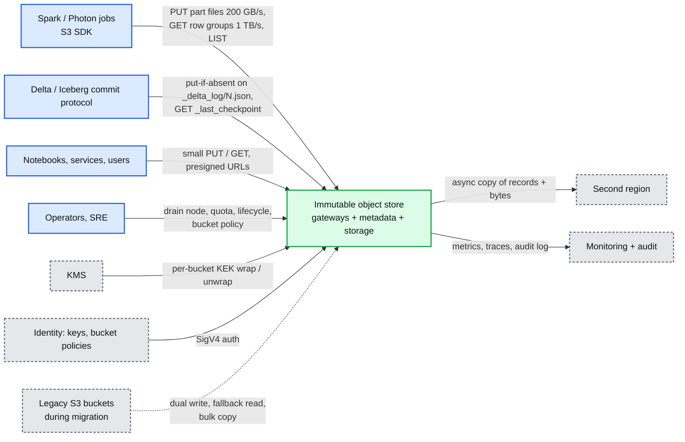

## D2. Data flow

Inputs to outputs, with data name, size, rate on each edge.

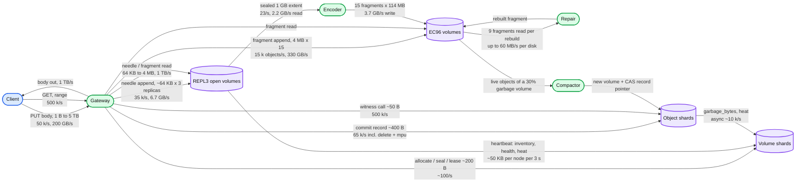

## D4. Happy path: GET with range (FR 2)

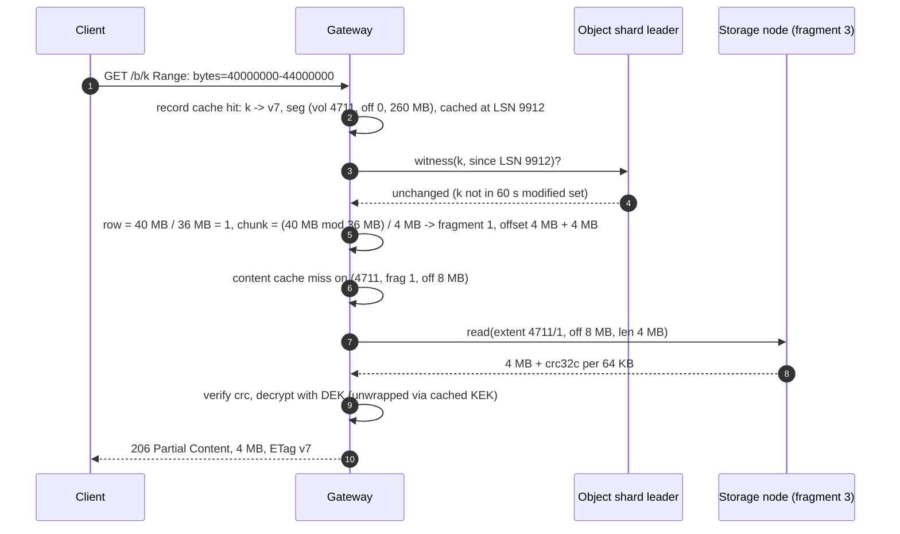

## D4. Happy path: DELETE (FR 3)

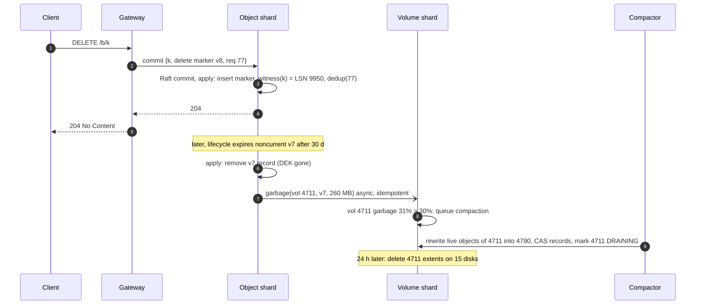

## D4. Happy path: LIST with delimiter (FR 4)

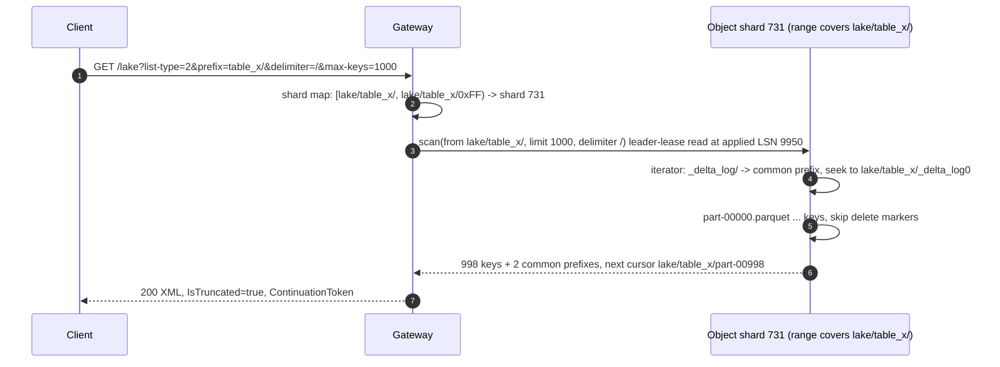

## D5. Failure path: duplicate PUT after a lost ack

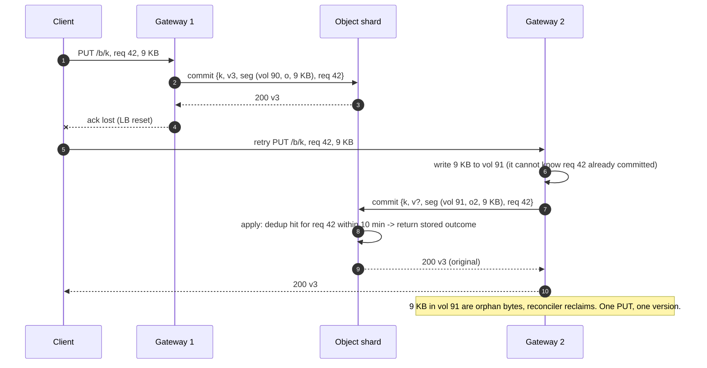

## D6. Decision flow: the write path

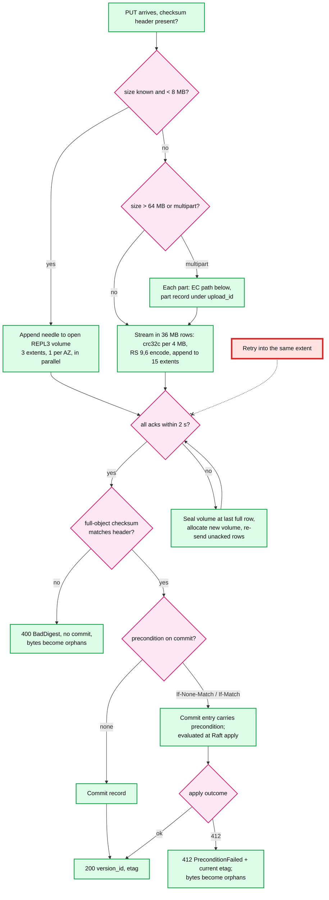

## D8. State machines

Volume lifecycle. Every transition is one commit in the volume shard.

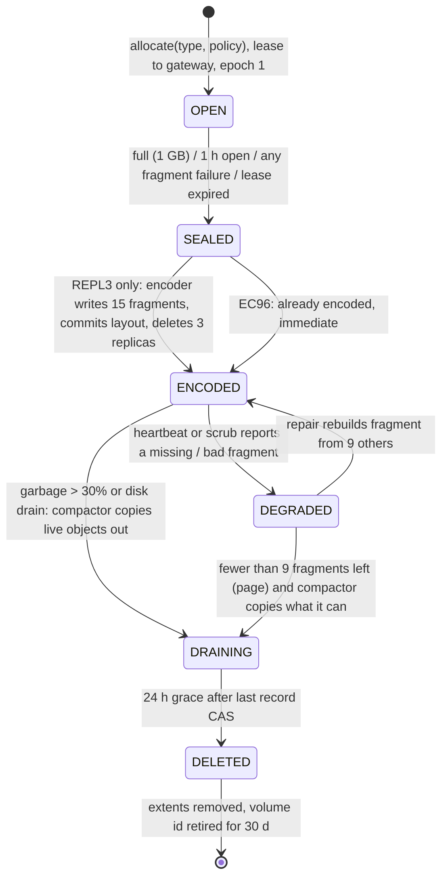

Object version lifecycle.

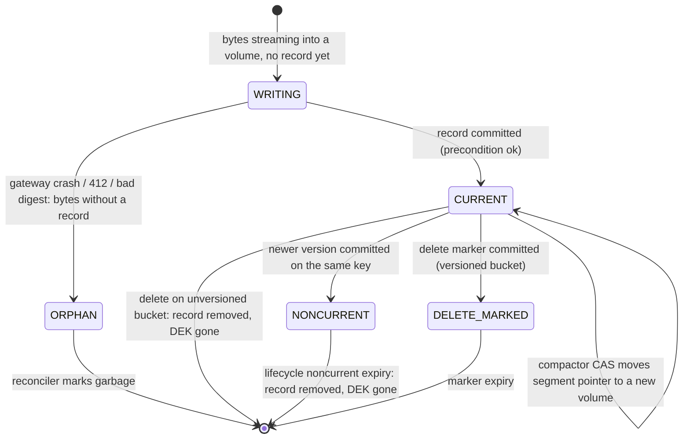

Multipart upload.

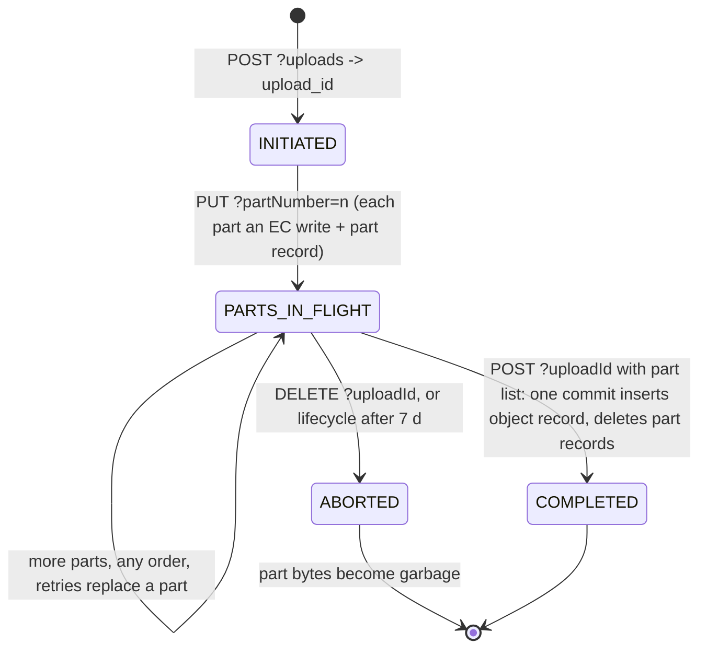

## D9. Deployment topology

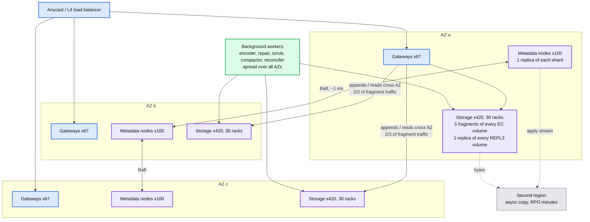

What crosses an AZ boundary: two thirds of every fragment write and one third of REPL3 reads (the gateway prefers the AZ-local replica), Raft replication for every shard, repair traffic for cross-AZ rebuilds. Budget: at 330 GB/s of fragment writes, ~220 GB/s crosses AZ boundaries; inter-AZ bandwidth is provisioned at 1 TB/s.

## D11. Failure mode map

```mermaid
%% D11: component -> failure -> blast radius -> mitigation. The one red leaf is the data-loss path.
flowchart TD
    subgraph GW [Gateway]
        G1[Process dies mid-PUT] --> G1b[One client's PUT fails, retries<br/>orphan bytes] --> G1c[Lease expiry seals volume; reconciler GC]
        G2[Encoder bug writes wrong parity] --> G2b[Objects of that build unreadable in degraded mode] --> G2c[Client checksum re-verified on every read;<br/>CI decode-fuzz; canary 1%]
    end
    subgraph MD [Metadata shard]
        M1[Leader dies] --> M1b[One key range stalls 1 to 2 s] --> M1c[Raft election; request-id dedup on retry]
        M2[Hot monotonic prefix] --> M2b[One leader at 20 to 50 k commits/s cap;<br/>PUTs get 503] --> M2c[Witness takes reads off; split; per-bucket salting]
        M3[RocksDB corruption] --> M3b[One shard down] --> M3c[Restore checkpoint + replay Raft log]
    end
    subgraph ST [Storage]
        S1[Disk dies] --> S1b[~1,600 volumes at 14 of 15] --> S1c[Repair ~2 h at 20 MB/s per peer]
        S2[Rack loses power] --> S2b[2% of disks, every affected volume loses 1 fragment] --> S2c[Placement 1 per rack; repair ~6 h at event budget]
        S3[AZ dark] --> S3b[10 of 15 per volume, 2 of 3 Raft;<br/>degraded reads 9x amplification on 1/3] --> S3c[Serve on; repair waits 4 h; 8/7 placement for new volumes]
        S4[Silent bit rot] --> S4b[One fragment wrong] --> S4c[CRC on read + 14 d scrub; rebuild from 9]
    end
    subgraph BGW [Background]
        B1[GC deletes a live volume]:::critical --> B1b[Objects pointing at it return 404 / missing bytes] --> B1c[24 h grace; reconciler refuses to delete referenced extents;<br/>dry-run counters; reconciler alert = page everyone]
        B2[Repair storm on mass reboot] --> B2b[Foreground I/O starves] --> B2c[10 min start delay; per-disk cap; priority by fragments left]
    end

    class G1,G2,M1,M2,M3,S1,S2,S3,S4,B2 service
    class G1b,G2b,M1b,M2b,M3b,S1b,S2b,S3b,S4b,B1b,B2b store
    class G1c,G2c,M1c,M2c,M3c,S1c,S2c,S3c,S4c,B1c,B2c service
    class B1 critical

    classDef service  fill:#dcfce7,stroke:#16a34a,stroke-width:2px,color:#111
    classDef store    fill:#ede9fe,stroke:#7c3aed,stroke-width:2px,color:#111
    classDef critical fill:#fee2e2,stroke:#dc2626,stroke-width:4px,color:#111
```

## D12. Migration off S3

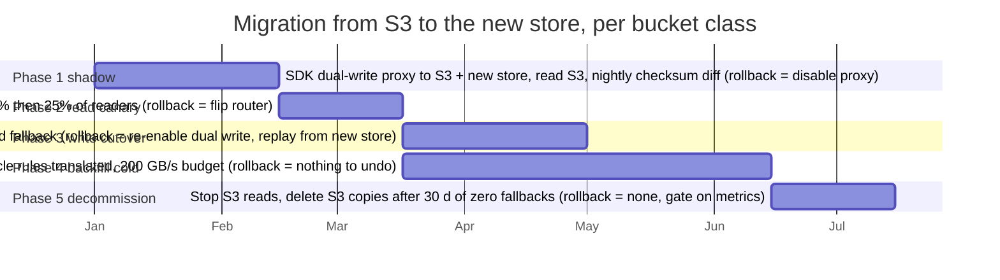
