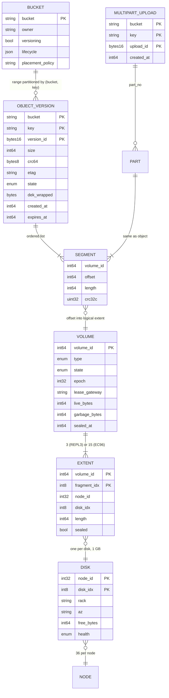
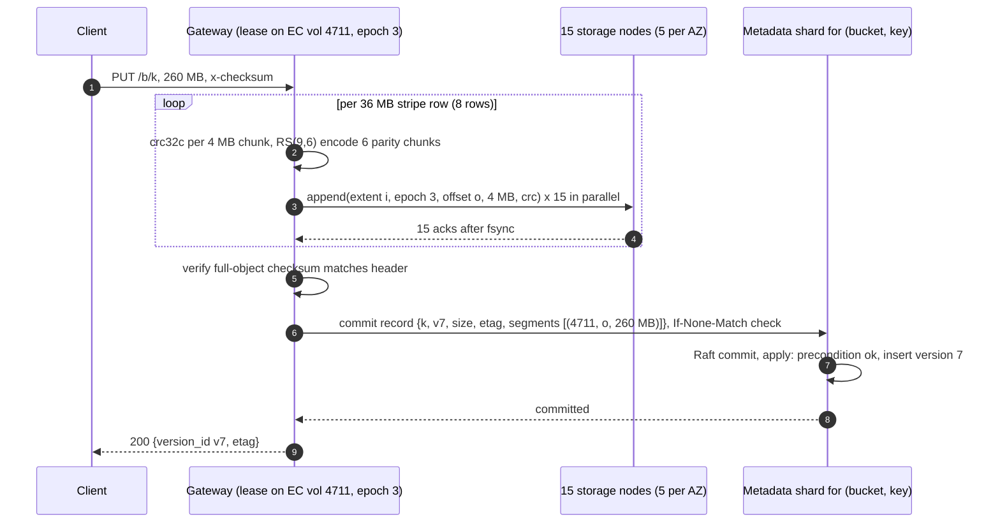
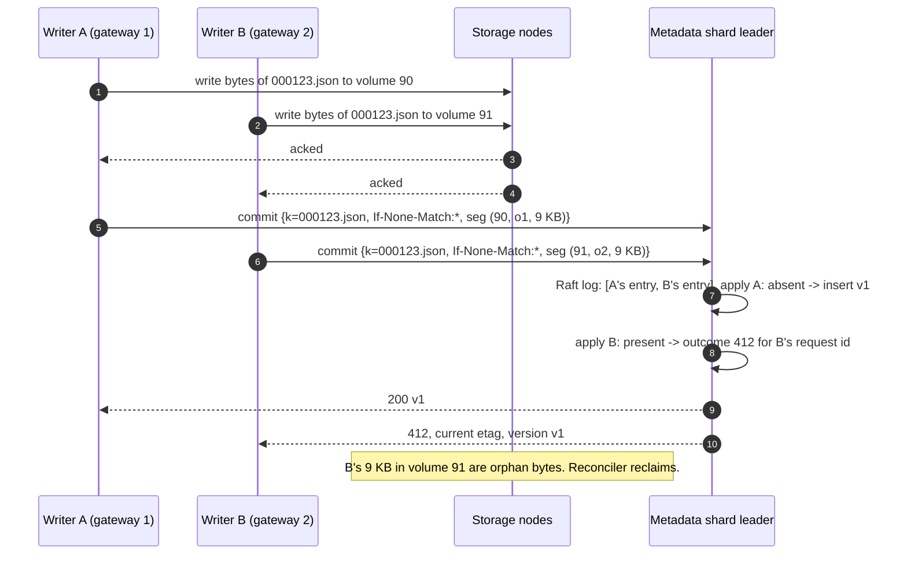
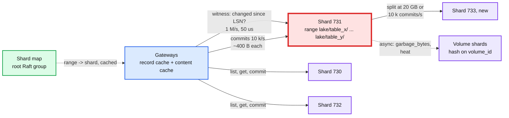
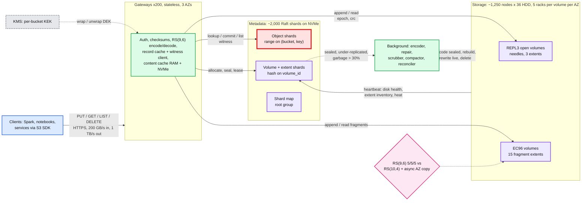
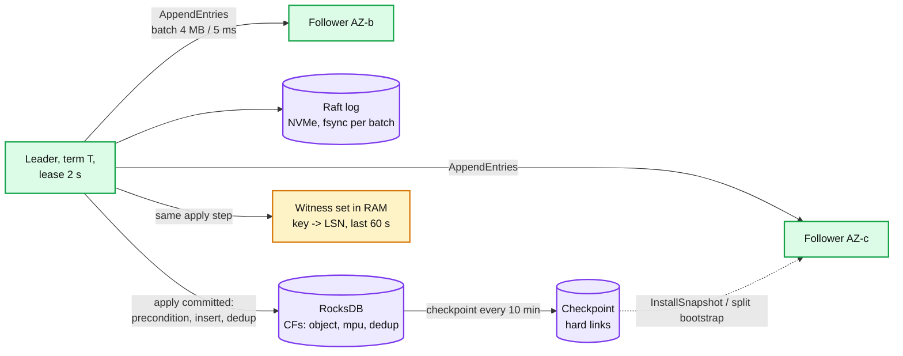
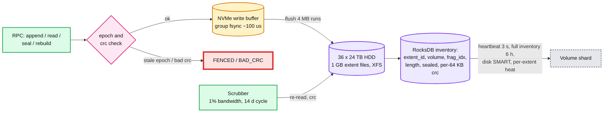
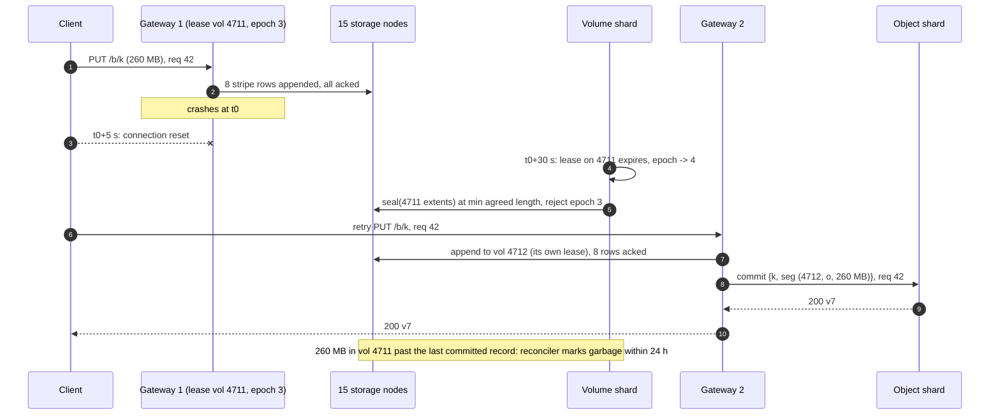
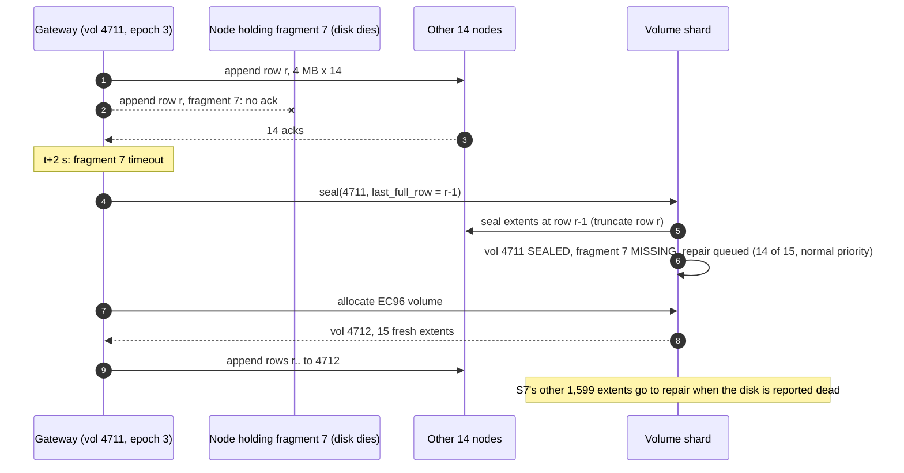

# HLD: Immutable distributed object store

> One-line answer: an S3-shaped store in one region across 3 AZs. A stateless gateway streams bytes from the client straight into storage nodes: objects under 8 MB are appended as needles into 3x-replicated append-only volumes (one replica per AZ), objects 8 MB and up are erasure coded inline as RS(9,6) stripes across 15 disks in 15 racks, 5 per AZ. An object exists only when its record commits in a range-partitioned, Raft-replicated metadata index keyed by `(bucket, key, version)`; that single commit is what makes PUT, DELETE, LIST, and conditional PUT strongly consistent. Sealed replicated volumes are encoded to RS(9,6) in the background, so 99% of bytes end at 1.67x overhead. Immutability is what makes this cheap: any copy of any byte is correct forever, so reads go to any fragment, caches never invalidate, and repair is a copy, not a merge.

Sources this follows: Vogels "Diving deep on S3 consistency" (2021), Warfield FAST '23 keynote, Haystack (OSDI '10), f4 (OSDI '14), Windows Azure Storage (SOSP '11) and Azure LRC (ATC '12), Copysets (ATC '13), Tectonic (FAST '21), AWS S3 docs on prefixes, multipart, and conditional writes. Raw notes with links in [`research/`](research/). Diagrams D1 to D12 are in [`diagrams.md`](diagrams.md).

---

## 1. Understanding the problem

Interviewer's framing (Databricks, per candidate reports): "Design an immutable distributed object store" or "an immutable distributed file system". They own the workload: Delta tables are Parquet files plus a `_delta_log/` directory of JSON commits, all on S3. So they know what the store must do under a Spark job that writes 10,000 part files into one prefix, a million readers hitting `_delta_log/_last_checkpoint`, and a commit protocol that depends on put-if-absent. Expect the first 15 minutes on the API and commit point, then 30 minutes on durability math, erasure coding, the metadata index, and what breaks under skew.

### 1.1 Functional requirements

Core:
1. **`put(bucket, key, bytes, checksum, [if-none-match | if-match etag])`**. 1 B to 5 TB. Multipart for anything over 64 MB. Ack means durable and visible.
2. **`get(bucket, key, [version], [range])` and `head`.** Byte-range reads are first class: a Parquet reader fetches the footer, then a few row groups.
3. **`delete(bucket, key, [version])`.** Returns immediately; the bytes come back later.
4. **`list(bucket, prefix, [delimiter], [cursor], max 1000)`.** Lexicographic, paginated, strongly consistent.
5. **Conditional PUT is linearizable per key.** put-if-absent and put-if-match are the primitive that a transaction log (Delta, Iceberg) builds on.

Below the line (say it out loud):
- Append, overwrite in place, partial write. A second `put` on a key is a new version, never a mutation.
- Cross-object transactions. Delta puts the transaction in its log; the store gives it one atomic key.
- Content search, tag queries, cross-tenant dedup. The seam is noted in §10.11.
- Multi-region active-active. Async cross-region copy is an evolution, §10.11.

### 1.2 Non-functional requirements

Ask for scale first. Numbers assumed:

| Dimension | Core target | Below the line |
|---|---|---|
| Data | 500 PB live, 100 B objects. By count: 70% under 1 MB, 29% 1 MB to 1 GB, 1% over 1 GB. By bytes: 1% / 47% / 52% | 5 EB (S3-scale region) |
| Throughput | 50 k PUT/s, 500 k GET/s peak. Avg 1/5 of that. 200 GB/s ingest, 1 TB/s egress | |
| Latency | small GET first byte p99 < 50 ms; small PUT ack p99 < 100 ms; streams at 100 MB/s or better | single-digit ms (S3 Express class, SSD tier) |
| Durability | **11 nines per object per year. Zero loss on any 2 disks, any rack, any 1 AZ. Bit rot found and fixed** | |
| Availability | 99.99% GET, 99.9% PUT. AZ loss is degraded, not down | |
| Consistency | **Strong read-after-write for PUT, DELETE, LIST. Conditional PUT linearizable per key** | |
| Cost | Under 1.7x raw overhead on 99% of bytes. ~$10 per TB-month all in | |

The durability row and the cost row fight: 3x replication is easy to reason about and costs 3x; erasure coding costs 1.4x and makes small reads, repair, and AZ loss harder. The consistency row and the latency row fight: every visible write must go through one serialization point per key. The design is about where those points sit.

---

## 2. Back-of-envelope

```
Objects              = 100 B. Small (<1 MB) 70 B x 64 KB avg = 4.5 PB. Medium 29 B x 8 MB avg = 232 PB. Large 1 B x 260 MB avg = 260 PB.
                       Total ~500 PB live. 99% of bytes are in 30% of objects. 70% of objects hold 1% of bytes.

Redundancy           = small: 3 replicas on the write path, encoded to RS(9,6) after seal.  large: RS(9,6) inline.
                       Steady state ~99% of bytes at 15/9 = 1.67x, ~1% at 3x (open volumes).  Raw = 500 x 1.67 + 5 x 3 = ~850 PB.
Disks                = 24 TB HDD, fill to 80%: 850 PB / 19 TB = ~45,000 disks. 36 per node -> ~1,250 storage nodes, ~420 per AZ, ~30 racks per AZ.
                       Node = 36 x 24 TB HDD + 2 x 3.8 TB NVMe (write buffer, index) + 2 x 100 Gbps.

PUT                  = 50 k/s peak. 35 k/s small (70%), 15 k/s medium and large.
                       Small bytes: 35 k/s x 64 KB = 2.2 GB/s. Large bytes: the rest of 200 GB/s.
                       Write to disk: small 2.2 x 3 = 6.7 GB/s; large 198 x 1.67 = 330 GB/s. Total ~340 GB/s over 45 k disks = 7.5 MB/s per disk. Fine.
                       Later re-encode of sealed small volumes: read 2.2 GB/s, write 3.7 GB/s. Background.

GET                  = 500 k/s peak, 1 TB/s. Say 400 k/s small (one seek each) + 100 k/s range reads on Parquet (4 MB each).
                       Disk IOPS: 400 k random reads/s over 45 k HDDs = 9 IOPS per disk. Budget ~80 random IOPS per HDD. 9x headroom on average.
                       The average hides the problem: a hot 10 KB object at 100 k GET/s lands on 1 disk (replicated) or 1 fragment (EC). That is 1,000x over budget. -> cache tier (§5.4).
                       Bandwidth: 1 TB/s over 1,250 nodes = 800 MB/s per node. 2 x 100 Gbps = 25 GB/s. Fine.

Metadata             = 100 B objects x ~300 B per record (key ~80 B, version, size, checksum, 1 to 3 segment pointers, timestamps, flags)
                       = 30 TB. Plus tombstones, old versions, in-flight multipart ~1.3x -> 40 TB. Raft x3 = 120 TB on NVMe.
                       Shards: 20 GB each -> 2,000 range shards. 300 metadata nodes with 1 TB NVMe hold 20 shard replicas each.
                       Writes: 50 k PUT + 10 k DELETE + 5 k multipart ops = 65 k/s / 2,000 shards = ~30 commits/s per shard on average.
                       Reads: 500 k/s / 2,000 = 250/s per shard on average. A Raft shard on NVMe does 20 to 50 k commits/s and 200 k reads/s.
                       Average is 1,000x under. Skew is the only metadata problem (§5.2): one Spark job or one table's _delta_log/ is one shard.

Volumes              = unit of placement. 15 extents x 1 GB (RS(9,6): 9 GB of data per volume) or 3 extents x 1 GB (REPL3).
                       850 PB raw / 15 GB = ~57 M volumes. Volume map: 57 M x 200 B = 11 GB. Small. Lives in its own shards, cached everywhere.
                       Open volumes at once: ~200 gateways x 4 open REPL3 + 4 open EC volumes = 1,600. Sealing rate: 340 GB/s / 15 GB = ~23 volumes/s.

Gateway              = stateless. 1 TB/s egress + 330 GB/s to disks + 200 GB/s from clients = ~1.5 TB/s of NIC.
                       At 2 x 100 Gbps (25 GB/s) per box, 60 boxes saturated; deploy 200 for headroom and AZ loss.
                       EC encode: 200 GB/s at ~4 GB/s per core (ISA-L) = 50 cores cluster-wide. Nothing.
                       CRC32C: 1.2 TB/s at ~15 GB/s per core = 80 cores. Nothing.

Repair               = one 24 TB disk dies: its ~1,600 extents belong to 1,600 volumes; each has 14 siblings on 14 other disks.
                       Rebuild reads 9 fragments per stripe from ~14,000 distinct peer disks, writes to ~1,600 new disks.
                       At 20 MB/s repair budget per peer disk: 24 TB x (9/1 read amplification) = 216 TB read over 14 k disks = 15 MB/s each -> ~20 min.
                       Detection 60 s, start delay 10 min for a node (0 for a self-reported disk failure). Window W ~ 30 min. This number drives §5.3.

Durability (indep.)  = AFR 1.5%. Fragment loss rate inside W=0.5 h: 0.015 x 0.5 / 8,760 = 8.6e-7.
                       RS(9,6) loses data only if 7 of 15 die inside one window: ~15 x 0.015 x C(14,6) x (8.6e-7)^6 = ~3e-38 per volume-year. Irrelevant.
                       The real risks are correlated: rack, power domain, AZ, firmware batch. Placement (15 racks, 5 per AZ) is the answer, not the exponent.
                       AZ loss: 5 of 15 fragments gone, 10 remain, k = 9. Readable, and one more disk can die. With RS(10,4) over 3 AZs (5/5/4) an AZ loss leaves 9 or 10 of 14; k = 10 -> not readable. That is why the parameters are 9 and 6.

Cost                 = 45 k disks x ~$400 = $18 M capex, 5 yr life -> $3.6 M/yr. Nodes, network, power, DC ~3x that -> ~$15 M/yr for 500 PB = $2.5 per TB-month raw.
                       With 3x replication instead: 1.5 EB raw, ~80 k disks, ~$27 M/yr. EC saves ~$12 M/yr. At S3 list price ($23/TB-month) 500 PB is $138 M/yr.
```

Implications:
- Disks are idle on average and on fire under skew. Every mechanism is about spreading: objects across 15 disks, prefixes across shards, hot keys across caches.
- The redundancy parameters are set by the AZ loss requirement, not by the durability exponent.
- Metadata is 8% the size of the data by bytes and 100% of the consistency problem.

---

## 3. The set-up

Product-style: an HTTP API that Spark executors, notebooks, and services call through an S3-compatible SDK.

### 3.1 Core entities

- **Bucket**: namespace, owner, versioning flag, lifecycle rules, default placement policy.
- **Object record**: `(bucket, key, version_id) -> {size, etag, checksum, content_type, dek_wrapped, segments[], state, created_at}`. One record per version. The record is the commit.
- **Segment**: `(volume_id, offset, length, crc32c)`. One for objects up to 9 GB in an EC volume (or up to 1 GB in a REPL3 volume), a list for larger ones. The reader turns `(volume, offset)` into fragments without asking anyone.
- **Volume**: unit of placement and repair. `{volume_id, type: REPL3 | EC96, state: OPEN | SEALED | ENCODED | DRAINING | DELETED, extents[3 or 15] -> (node, disk, extent_id), writer_lease (gateway, epoch), live_bytes, garbage_bytes}`.
- **Extent**: a 1 GB append-only file on one disk, checksummed per 64 KB block. Sealed when full or on any failure. Never modified after seal.
- **Needle**: a small object's bytes inside a REPL3 extent: `header(magic, key_hash, version_id, length, flags) + data + crc32c`. Same as Haystack.
- **Multipart upload**: `(bucket, key, upload_id) -> {parts: part_no -> segment list + etag, created_at}`. Parts are written like large objects; `complete` commits one record listing every part's segments.
- **Tombstone / delete marker**: a version record with `state = DELETED`. `get` without version returns 404; `get` with an older version still works until lifecycle expires it.

### 3.2 API

Every mutating call carries an idempotency key (`x-request-id`); the metadata shard dedups it (§10.5).

| Call | Args | Returns | Semantics |
|---|---|---|---|
| `PUT /b/k` | body, `x-checksum-crc64nvme`, optional `If-None-Match: *` or `If-Match: <etag>` | `200 {version_id, etag}` or `412` | Durable and visible when `200` returns. Precondition evaluated at the metadata commit, linearizable per key |
| `GET /b/k` | optional `?versionId=`, `Range: bytes=a-b` | `200` / `206` + body, `ETag`, `x-checksum` | Strong: sees every acked PUT and DELETE on that key |
| `HEAD /b/k` | | headers only | Same consistency as GET |
| `DELETE /b/k` | optional `?versionId=` | `204` | Delete marker (versioned) or record removal (unversioned). Visible immediately, space later |
| `GET /b?list-type=2&prefix=&delimiter=&continuation-token=&max-keys=1000` | | keys, common prefixes, next token | Ordered, strongly consistent per page, no snapshot across pages |
| `POST /b/k?uploads` | | `upload_id` | Start multipart |
| `PUT /b/k?partNumber=n&uploadId=` | body, part checksum | part etag | 5 MB to 5 GB per part, up to 10,000 parts. Parts are invisible |
| `POST /b/k?uploadId=` | part list, optional precondition | `200 {version_id, etag}` | Atomic commit of the whole object |
| `DELETE /b/k?uploadId=` | | `204` | Abort; parts become garbage |

Internal: `Gateway.allocate_volume(type, policy)`, `Storage.append(extent, epoch, offset, bytes, crc)`, `Storage.read(extent, offset, len)`, `Storage.seal(extent)`, `Repair.rebuild(volume, fragment_idx, target)`, `Encoder.encode(volume)`, `GC.reclaim(volume)`.

### 3.3 Data model



Access patterns:
- `get`: point read on `(bucket, key)` newest non-deleted version, then direct reads of `segments[]` from storage. Two hops, no fan-out.
- `put`: write bytes first, then one Raft commit inserting the record (precondition checked at apply). Ack.
- `list`: ordered range scan on `(bucket, key)` from the cursor; delimiter handled by seeking past each common prefix.
- Repair: `EXTENT` has a secondary index `(node_id, disk_idx) -> volume_ids`, so a dead disk yields its volume list in one scan.
- GC: `VOLUME` where `garbage_bytes / (live + garbage) > 0.3` and `state = ENCODED`.

Partition keys. Object records: **range partition on `(bucket, key)`**, because `list` needs order and prefix locality, and because a Delta table's files share a prefix and are read together. Volumes and extents: **hash on `volume_id`** in a separate shard family; nobody lists volumes by name. The cost of range partitioning is the hot prefix, §5.2. Full argument in [`deep-dives/metadata-index-and-listing.md`](deep-dives/metadata-index-and-listing.md).

---

## 4. High-level design

One subsection per functional requirement.

### 4.1 Clients put objects of any size, and the ack means durable and visible

**Bad: gateway writes the object to one storage node, which replicates in the background.**
- Approach: pick a node, stream the bytes, node acks after local write, replicates to two peers later.
- Why it breaks: the ack arrives before a second copy exists. A single disk death in the next minute loses an acknowledged object. At 45 k disks and 1.5% AFR that is ~2 disk deaths per day, so it is not a corner case. Also, one file per object on a filesystem: 100 B inodes, directory ops, and a fsync per object. Dead on arrival.

**Good: gateway writes 3 replicas synchronously to 3 AZs, then commits a metadata record.**
- Approach: gateway allocates space in an open REPL3 volume it holds a lease on, appends the object as a needle to all three extents in parallel, each storage node fsyncs (group commit on the NVMe write buffer, then flushed to HDD), acks. Gateway then commits the object record to the metadata shard. Ack to client.
- Works: durable across AZ loss. Commit point is precise. Small objects get one seek on read.
- Cost: 3x bytes on the write path and 3x on disk forever. For 500 PB that is ~80 k more disks than needed, ~$12 M/yr. And a 5 TB object as one needle in a 1 GB extent does not fit.

**Great: two write paths by size, both ending in the same metadata commit, and everything ends erasure coded.**
- Small (< 8 MB): as in Good. Needle appended to an open REPL3 volume (3 extents, one per AZ). When the volume seals at 1 GB (or after 1 h open, or on any failure), a background encoder reads the sealed extent, splits it into 9 data fragments of ~114 MB, computes 6 parity fragments, writes the 15 fragments to 15 disks in 15 racks, 5 per AZ, commits the new layout to the volume map, and deletes the 3 replicas. The object record does not change: `(volume_id, offset, length)` is an offset into the logical extent, and the reader computes `fragment = offset / 114 MB`. This is f4.
- Large (≥ 8 MB): inline EC. Gateway holds a lease on an open EC96 volume. It streams the object in 36 MB stripe rows (9 x 4 MB data chunks), computes 6 x 4 MB parity per row, appends chunk `i` to extent `i` at the same offset in all 15 extents. Every storage node fsyncs and acks per 4 MB. When the last row is acked by all 15, gateway commits the record. Bytes on the write path: 1.67x, never re-read.
- Why 8 MB: below it, 15 fragments would be under 1 MB each, which turns one seek into nine on read and makes repair I/O dominated by per-fragment overhead. Above it, replicating first and encoding later would read and write every byte twice. 8 MB is where the two costs cross for 24 TB HDDs; it is a knob.
- Commit point, precisely: **an object is committed when its record is applied by the metadata shard's Raft log. The gateway proposes that record only after every fragment (all 15, or all 3) has acked an fsync.** A reader can never see a record whose bytes are not durable in every fragment. A crash of the gateway before the commit leaves orphan bytes in an extent, which a reconciler finds by comparing extent contents against the index (§4.5 and [`deep-dives/write-path-and-commit.md`](deep-dives/write-path-and-commit.md)).
- Single writer per extent: the gateway holding the volume lease is the only appender, so offsets are assigned locally with no coordination, and a stale gateway is fenced by `epoch` on every append. Seal-and-move on any fragment timeout (2 s per 4 MB): the gateway abandons the volume, the volume shard seals it at the last fully acked offset, the gateway re-sends the unacked rows into a fresh volume. No in-flight repair, no divergence.
- Challenges: 15 parallel connections per large PUT; the write p99 is the slowest of 15 disks, mitigated by the 2 s seal-and-move. The metadata commit adds one Raft round (~2 ms). Hot prefixes concentrate commits on one shard (§5.2).
- Push back on the textbook: you do not need a write-ahead log in the gateway or a coordinator service. The extent is the log and the metadata record is the commit. Anything not pointed at by a committed record is garbage by definition.



### 4.2 Clients read whole objects or byte ranges and never see stale data

**Bad: gateway reads through a TTL cache of object records.**
- Why it breaks: a 5 s TTL means a `put` then `get` from another client can return 404 or the previous version for 5 s. Delta's log reader would see commit N+1 missing and conclude the table is at N. That is the pre-2020 S3 behaviour and it is why every Delta LogStore had a consistency workaround.

**Good: every read does a linearizable metadata lookup (leader lease read), then reads fragments directly.**
- Approach: gateway asks the shard leader for the newest version of the key; leader serves from local RocksDB while its Raft lease holds (no disk, no quorum round). Gateway then reads the segment: for REPL3, one needle read from the nearest replica; for EC96, the data fragments covering the requested range (a 4 MB Parquet row-group read touches one fragment, a full-object read streams 9 fragments in parallel). CRC32C per 64 KB verified at the gateway; on mismatch, read a different replica or decode from parity and report the bad fragment.
- Cost: one metadata RPC per GET. 500 k/s spread over 2,000 shards is fine. The issue is the hot key: 100 k GET/s on `_delta_log/_last_checkpoint` puts 100 k/s on one leader, and 100 k/s of 10 KB reads on one disk.

**Great: same, plus a witness for cached records and an immutable-content cache tier.**
- Record cache with a witness: gateways cache object records. On a GET, the gateway asks the shard leader a one-word question: "has `(bucket, key)` changed since LSN x?" The leader keeps an in-memory set of keys modified in the last 60 s with their LSNs; keys not in the set have not changed. That call is a hash lookup, no RocksDB, ~50 us, and one leader handles 1 M/s of them. This is what S3 calls its witness. Strong consistency is preserved because the witness is updated in the same apply step as the record.
- Content cache: fragments and needles are immutable, so a cache keyed by `(volume_id, offset, length)` is correct forever. Gateways keep a 2-tier cache (RAM 128 GB, NVMe 4 TB each; 200 gateways = 800 TB), consistent-hashed by `(volume, offset)` so each hot chunk lives on ~3 gateways. Above a heat threshold (1 k reads/s), a chunk is replicated to every gateway. The hot-key problem becomes a memory-bandwidth problem.
- Hedged reads: if a fragment read has not returned in 2x the p50 (~20 ms), issue the same read to a second replica (REPL3) or fetch one more fragment and decode (EC96). Take the first answer.
- Challenges: the witness makes a key's freshness depend on the leader's in-memory state; on leader change the new leader has no set, so it answers "unknown" for 60 s and gateways fall back to a full read. Cache memory is a cost line (~$1 M). Push back on the textbook: no CDN and no separate cache cluster. The gateways already have the NICs and the immutability makes invalidation a non-problem. Full read path in [`deep-dives/hot-objects-and-read-path.md`](deep-dives/hot-objects-and-read-path.md).

### 4.3 Clients delete objects, and the space comes back

**Bad: delete removes the record and frees the bytes synchronously.**
- Why it breaks: the bytes sit inside a 1 GB extent that is one of 15 fragments; freeing 64 KB means nothing to an append-only extent, and re-encoding a stripe for every delete is 15 disk writes per delete. Also, a reader that fetched the record 1 s ago is mid-read.

**Good: delete is a metadata-only tombstone; a GC job reclaims volumes when garbage exceeds a threshold.**
- Approach: `delete` commits a delete marker (versioned bucket) or removes the record (unversioned) in one Raft entry. Visible immediately. The apply step increments `garbage_bytes` on the referenced volume (async message to the volume shard, idempotent). A compactor picks ENCODED volumes with over 30% garbage, copies live objects into a new volume, CASes each object record's segment pointer, then deletes the old volume after a 24 h grace period for in-flight readers.
- Cost: reclaimed space lags deletes by hours to days. Compaction rewrites live bytes: at 30% garbage that is 2.3 bytes written per byte reclaimed.

**Great: same, plus per-object encryption keys so "delete" is immediate for compliance, and lifecycle rules drive both.**
- Every object has a data encryption key (DEK) stored wrapped in its record. Delete removes the record, which removes the only copy of the DEK. The bytes on disk are ciphertext with no key: gone for GDPR purposes at the moment of the Raft commit, physically reclaimed by compaction within the 30-day SLA (compaction of volumes holding deleted-but-not-reclaimed objects older than 20 days is forced). Same for the DR copy and any cache: the key is gone.
- Lifecycle: expiry rules, noncurrent-version expiry, abort-incomplete-multipart after 7 days, all run as a scan per shard producing ordinary deletes.
- Challenges: the DEK is in the record, so the record is 32 B bigger and the KMS is on the read path (cached, per bucket key). Compaction must never move an object without a CAS on its record, or a concurrent PUT of a new version could be lost. Detail in [`deep-dives/delete-gc-and-compaction.md`](deep-dives/delete-gc-and-compaction.md).

### 4.4 Clients list a prefix in order, paginated, and the listing is strongly consistent

**Bad: hash-partitioned index, list by scatter-gather.**
- Why it breaks: every `list` fans out to all 2,000 shards, each returns its keys under the prefix, gateway merge-sorts, returns 1,000. A Spark planner listing a table with 100 k files does 100 pages x 2,000 RPCs. The hot table's listing is 200 k RPCs. Also, sequential PUTs spread perfectly across shards, so hash looks better for writes; that is why people pick it and then cannot list.

**Good: range-partitioned index on `(bucket, key)`; a prefix is one contiguous key range, usually one shard.**
- Approach: gateway finds the shard(s) covering `[bucket/prefix, bucket/prefix + 0xFF)` from the shard map (cached), streams keys in order from the first shard using a leader-lease read of a RocksDB iterator, crosses into the next shard when the range ends. Cursor is the last key returned. Delimiter: after returning `prefix/dirA/`, seek the iterator to `prefix/dirA0` (the next key after everything under that common prefix), so a directory of 1 M files costs one seek, not 1 M reads.
- Cost: no snapshot across pages; a key inserted between page 1 and page 2 may or may not appear depending on its position. Document it, S3 does the same.

**Great: same, plus a per-page linearizability guarantee, and load-based shard split so a giant prefix is not one shard forever.**
- Each page is a linearizable snapshot at the shard's applied LSN: any PUT acked before the page request started is in the page. Delete markers are filtered in the iterator, not in the gateway.
- A shard splits at 20 GB or at 10 k commits/s or 100 k reads/s sustained for 5 min. Split is a metadata operation (RocksDB range is cut, the new Raft group bootstraps from a checkpoint), ~10 s, no data movement in the data plane. Merges when both halves are cold.
- Challenges: splitting does not help a monotonically increasing key pattern; the newest keys always land in the last shard. §5.2 says how much a single shard can take and why that is enough. Detail in [`deep-dives/metadata-index-and-listing.md`](deep-dives/metadata-index-and-listing.md).

### 4.5 Conditional PUT is linearizable per key (the Delta commit primitive)

**Bad: gateway does `head` then `put`.**
- Why it breaks: two writers both see "absent" and both write. Delta commit N would be written twice with different contents; the second overwrites the first, and the first writer's transaction is silently lost. Before Aug 2024 S3 had no conditional PUT, which is why Delta needed a DynamoDB LogStore to serialize commits.

**Good: the precondition is evaluated inside the metadata shard's Raft apply.**
- Approach: the commit entry carries `{record, precondition: none | absent | etag == X}`. The shard applies entries in log order, single-threaded per shard. At apply, it reads the current newest version of the key from RocksDB, evaluates the precondition, and either inserts or records a `412` outcome for that request id. Two concurrent `If-None-Match: *` PUTs on `_delta_log/000123.json` are two entries in one log; exactly one inserts.
- Cost: the loser has already written its bytes into a volume. They are orphans, reclaimed by the reconciler. For Delta that is a ~10 KB JSON file per lost race; irrelevant.

**Great: same, plus the etag is the content checksum, and the response carries the winning version so the loser can read it without a second round.**
- `If-Match: <etag>` gives optimistic concurrency for overwrite-style keys (Iceberg's `metadata.json` pointer swap). Etag = CRC64NVME of the content for single-part objects, composite for multipart, same as S3 since Dec 2024.
- Challenges: linearizable per key only. Two different keys in one atomic operation is a below-the-line refusal; the seam is a per-shard multi-key entry, which works when both keys are in one shard (same prefix) and is exactly what a Delta commit needs (the commit file and the checkpoint pointer share `_delta_log/`).



---

## 5. Deep dives

One per non-functional requirement, phrased as the interviewer asks it.

### 5.1 "Walk me through what is committed when. The gateway dies at each step: what does the client see?"

Walk the PUT: client -> gateway -> 15 storage appends -> metadata commit -> ack. Four crash points.

| Gateway dies... | Bytes on disk | Record | Client sees | Cleanup |
|---|---|---|---|---|
| before any append | none | none | timeout, retries with same request id | nothing to do |
| after some fragment acks | partial rows in 15 extents | none | timeout, retry | volume lease expires (30 s), volume shard seals the volume at the last offset all 15 agree on; bytes past the last committed record are reclaimed by the reconciler |
| after all appends, before commit | complete object | none | timeout, retry. Retry re-writes the bytes (no dedup across gateways) | orphan segment reclaimed by reconciler within 24 h |
| after commit, before ack | complete | committed | timeout, retry. Metadata shard dedups on request id, returns the original `200 {v7}` | nothing |

Rules that make the table true:
- The record is proposed only after every fragment acked a durable write. So a committed record never points at bytes that are not on every fragment.
- Storage nodes fsync before acking. On NVMe write buffer with power-loss protection, ~100 us; the HDD flush is deferred, same as BlueStore's deferred writes.
- The volume lease and `epoch` fence a gateway that comes back from a GC pause and tries to append to a volume it no longer owns: `append(extent, epoch 3)` after the volume shard bumped to epoch 4 is rejected with `FENCED`.
- Idempotency: the metadata shard keeps `(client_id, request_id) -> outcome` for 10 min. A retried commit after a lost ack returns the same version id. A retried PUT whose first attempt never reached the commit writes new bytes and gets a new version id; the client asked for one PUT and got one visible version, either way.

Multipart: each part is an independent large-object write with its own segments and a part record under `(bucket, key, upload_id, part_no)`. `complete` is one metadata commit that inserts the object record with the concatenated segment list and deletes the part records in the same entry. Parts of an upload never completed are garbage after 7 days. The 5 TB, 10,000-part object is 10,000 part records of ~100 B and one object record of ~300 KB (segment list). Fine.

Push back on the textbook: no two-phase commit and no distributed transaction across storage nodes. Immutability means there is nothing to roll back; the record either exists or it does not. Detail and a crash matrix per hop in [`deep-dives/write-path-and-commit.md`](deep-dives/write-path-and-commit.md).

### 5.2 "A Spark job writes 10,000 files a second into one prefix and a million readers hit `_delta_log/`. What melts?"

The request path: gateway -> shard map -> one metadata shard leader (range partition) -> RocksDB. Every key under `s3://lake/table_x/` is one contiguous range, so one shard. That leader is the red node.

**Bad: hash the key to spread the load.**
- Spreads perfectly and breaks `list` (§4.4). Also breaks the "one shard sees one table" locality that makes Delta commits cheap. Rejected, but name it: it is what S3 told people to do by hand before 2018 ("randomize your prefixes"), and they withdrew the advice once they had automatic range splitting.

**Good: range partition with load-based split.**
- Works for read-hot prefixes: split the range, the two halves get two leaders on two nodes. Works for write-hot prefixes when keys are spread (`part-<uuid>`). Does not work for monotonic keys (`part-00001`, `000123.json`): the newest key is always in the last range, and splitting only moves the boundary.
- Cost: split takes ~10 s and needs sustained load to trigger, so a burst gets throttled first. That is why S3 documents 3,500 PUT/s and 5,500 GET/s per prefix and says scaling takes 30 to 60 min.

**Great: accept that one range is one leader, and size the leader so that one is enough. Then take reads off it.**
- Push back on the textbook: 10 k PUT/s into one prefix is NOT a hot-shard emergency. A Raft shard on NVMe with 4 MB log batches commits 20 to 50 k small entries/s. The entry is ~400 B. 10 k/s is 4 MB/s of log. The things that actually melt are (a) RocksDB write stalls if the memtable flushes to L0 faster than compaction drains, tuned by giving each shard 4 memtables of 64 MB, and (b) the reads on the same leader.
- Reads off the leader: the witness (§4.2). A million readers of `_delta_log/_last_checkpoint` become a million "changed since LSN x?" calls, 50 us each, on the leader's in-memory recently-modified set; the record and the content come from gateway caches. One leader does 1 M witness calls/s on 4 cores. If that is not enough, follower reads with a follower-side witness fed by the apply stream (bounded staleness of the Raft apply lag, ~1 ms), which we keep behind a per-bucket flag because it is strictly weaker.
- Writes beyond one leader: the seam is a per-bucket "salted range" mode where the key is stored as `hash(key) % 16 || key` and `list` merges 16 iterators. Off by default; on for buckets whose owner wants 100 k PUT/s into one prefix and accepts 16x list cost. This is what "prefix randomization" would look like if the store did it instead of the user.
- Shard split for everything else: at 20 GB or 10 k commits/s or 100 k reads/s for 5 min. A table's prefix moves to its own shard within minutes of becoming busy; a bucket with 1 B keys spans ~100 shards.



Full treatment, including why not a single Spanner-style database, in [`deep-dives/metadata-index-and-listing.md`](deep-dives/metadata-index-and-listing.md).

### 5.3 "Show me the durability number. Replication or erasure coding? A 24 TB disk dies; what is at risk and for how long?"

**Bad: 3 replicas on 3 random disks, repair from one surviving replica.**
- Why it breaks: two things. Random placement in a 45 k-disk cluster means that when a rack (960 disks, 2%) loses power, some volume has all three replicas in it with near certainty (Copysets, ATC '13: 99.99% probability of some loss at 1% simultaneous failure with random placement). And single-source repair of 24 TB at 50 MB/s takes 5.5 days; with 7.8 B replicated chunks and AFR 1.5%, independent-failure math alone expects ~3 chunks lost per year. That is 9 nines, not 11.

**Good: 3 replicas in 3 AZs, failure-domain placement, cluster-parallel repair, scrubbing.**
- Placement: one replica per AZ, different racks. Rack loss costs 1 copy; AZ loss costs 1 copy.
- Repair: the extent index gives the dead disk's ~1,600 volumes; for each, a healthy replica copies the extent to a new disk. Reads spread over 1,600 source disks at 20 MB/s each -> 24 TB in ~13 min. Window W ~ 30 min with detection. Independent-failure loss probability per volume-year drops to ~3e-14; times 57 M volumes is ~2e-6 expected losses per year. That is 11 nines with room.
- Scrub: every extent re-read and CRC-checked every 14 days at 1% of disk bandwidth (24 TB / 14 d = 20 MB/s; cap at 2 MB/s per disk and take 30 days if load is high). FAST '08 measured checksum mismatches on 0.86% of nearline disks over 41 months; without scrubbing, a latent bad sector is found only when the other two copies are already gone.
- Cost: 3x. 1.5 EB raw, ~80 k disks, ~$12 M/yr more than EC.

**Great: RS(9,6) across 15 racks, 5 per AZ, for every sealed byte; 3x only while a small-object volume is open; copyset-aware volume groups; repair budgeted and prioritized.**
- Why 9 and 6, not 10 and 4: the requirement is "survive one AZ with zero data loss and keep serving". Over 3 AZs, an AZ loss removes a third of the fragments. RS(k, m) survives that only if `k ≤ 2(k+m)/3`, i.e. `m ≥ k/2`. So overhead is at least 1.5x for any 3-AZ-tolerant code. RS(10,5) is exactly 1.5x with zero margin (an AZ down plus one disk down loses data). RS(9,6) is 1.67x and survives an AZ plus one disk, or any 6 disks. Azure's LRC(12,2,2) at 1.29x is a single-DC code; f4 gets cross-DC tolerance with an XOR of two volumes in a third DC at 2.1x. We pay 0.17x over the floor for the margin. This is the decision node in D3.
- Durability math, RS(9,6), W = 30 min, AFR 1.5%: loss needs 7 of 15 fragments dead in one window. `15 x 0.015 x C(14,6) x (8.6e-7)^6 ~ 3e-38` per volume-year. The exponent is not the point. The point is that correlated failure dominates: a rack takes at most 1 fragment (15 racks), an AZ takes at most 5, a firmware batch takes whatever fraction of disks share it (mitigated by mixing vendors per volume group). The honest form of "11 nines" is: independent-failure loss is negligible, correlated loss is bounded by placement, and the residual is the unmodelled bug (a bad encoder, a GC that deletes live data). Backblaze publishes the same shape of argument for 17+3.
- Copyset-aware volume groups: instead of picking 15 disks at random per volume (which makes every disk a partner of every other, so any 7-disk coincidence somewhere kills something), disks are pre-grouped into volume groups of 15 x 20 = 300 disks (scatter width 20 per rack slot). A correlated event that kills 7 disks only loses data if all 7 are in one group, which the layout makes rare. Cost: repair parallelism for one disk is bounded by its group (~280 peers) instead of 45 k. 24 TB x 9 (read amplification) / 280 peers at 20 MB/s = ~11 h. Too slow. Compromise: scatter width 100 (group of 1,500 disks): repair ~2 h, correlated-loss probability still 100x better than random. Then the repair budget goes up during an event: 20 MB/s per disk is the steady cap; on a rack loss the cap rises to 60 MB/s, so a rack (960 disks) rebuilds in ~6 h, not days.
- Repair priority: volumes with the fewest surviving fragments first (an ENCODED volume at 9 of 15 pages a human and repairs at full speed; at 13 of 15 it waits its turn). Scrub finds a bad fragment: it is treated as one lost fragment, rebuilt from 9 others.
- Encoding after seal for small objects: encoder reads the 1 GB replicated extent (from the AZ-local replica), writes 15 fragments, commits the layout, deletes 3 replicas. Runs at ~4 GB/s per encoder core; 23 volumes/s sealing means ~6 encoder cores cluster-wide. The delay between seal and encode is the only time small-object bytes cost 3x; keep it under 1 h.
- Challenges: EC reads for a small object that straddles a fragment boundary need 2 fragments (0.06% of 64 KB objects at 114 MB fragments; fine). Degraded reads during an AZ outage cost 9 fragment reads plus a decode for every object with a fragment in the dead AZ, so p99 rises for a third of the reads; the SLO says 99.99% availability, not 99.99% at p99 latency, and we say that out loud. Full math in [`deep-dives/erasure-coding-and-durability.md`](deep-dives/erasure-coding-and-durability.md) and placement in [`deep-dives/placement-rebalancing-and-repair.md`](deep-dives/placement-rebalancing-and-repair.md).

### 5.4 "500 k GET/s and 1 TB/s. First byte under 50 ms. And one object is 20% of all reads."

- The data path never touches the metadata leader for bytes, and with the witness it barely touches it for records. Bytes flow storage node -> gateway -> client, or gateway cache -> client.
- First byte, small object, cold: witness 0.1 ms + record cache hit + one HDD read (~8 ms seek plus transfer) + TLS. p99 under 50 ms holds if the disk queue is short, so per-disk concurrency is capped at 16 outstanding reads and the 17th gets `RETRY_OTHER_FRAGMENT`. For REPL3 volumes the gateway picks the AZ-local replica; for EC96 it reads the one data fragment that covers the range.
- Range reads on Parquet: a footer read is one 64 KB to 1 MB read from one fragment; a row-group read is one 4 MB chunk from one fragment. A 260 MB full scan streams from 9 fragments in parallel at 9 x 100 MB/s. Clients that want more open more ranges.
- Hot object: the content cache (§4.2). 100 k GET/s of a 10 KB object is 1 GB/s from RAM across 200 gateways. Detection: per-chunk counters in the gateway, gossip the top-1000 hot chunks every second, replicate them to every gateway's RAM. Time to absorb a new hot object: ~2 s during which the owning disk serves at its IOPS limit and the excess gets 503 Slow Down, exactly as S3 does.
- Push back on the textbook: no CDN, no Redis cluster, no "read replicas". Immutability makes the gateway cache correct with zero invalidation logic, and hot Delta metadata is small.
- Detail in [`deep-dives/hot-objects-and-read-path.md`](deep-dives/hot-objects-and-read-path.md).

### 5.5 "An AZ goes dark. What do reads, writes, LIST, and repair do? What does it cost?"

- Metadata: every shard is a Raft group of 3 with one replica per AZ. AZ loss leaves 2 of 3; leaders in the dead AZ are re-elected in 1 to 2 s. Writes continue. Shard map, volume shards, object shards: all the same.
- Data: every EC96 volume has 10 of 15 fragments; every REPL3 volume has 2 of 3. All readable. Reads of objects whose covering fragment was in the dead AZ decode from 9 others: 9x read amplification on a third of the reads. Gateways in the surviving AZs take the load: 200 -> 133 gateways at 1.5x each; sized for it.
- Writes: new volumes are allocated across the 2 surviving AZs only if the bucket's policy allows `degraded_placement`; default is to keep accepting writes with 15 fragments over 2 AZs (8/7) and rebalance them to 5/5/5 when the AZ returns. A write's durability during the outage is "any 6 disks", which is still better than 3x.
- Repair: do NOT start rebuilding 280 PB of fragments when an AZ blinks. Repair for AZ-scoped loss waits 4 h (an AZ that is really gone is a disaster-recovery decision, not a repair job). Single-disk and single-rack repair continues normally.
- Cost of the requirement: the 1.5x floor from §5.3, plus 1.5x gateway and metadata headroom. Compared with a single-AZ RS(10,4) design plus an async cross-AZ copy (2.8x) this is cheaper; compared with a single-AZ design with no AZ tolerance (1.4x) it is 20% more disk. That is the trade the interviewer wants stated.
- Region loss is out of scope (async cross-region copy, RPO minutes, §10.11).

---

## 6. Final design



Zoom-ins: [`diagrams.md`](diagrams.md) D2 (data flow with rates), D4 (per-FR sequences), D5 (failure sequences), D6 (write path decision flow), D8 (volume and object state machines), D9 (deployment), D11 (failure map), D12 (migration).

---

## 7. Trade-offs

| Decision | Option A | Option B | Chose | Why |
|---|---|---|---|---|
| Metadata partitioning | Hash on key | Range on `(bucket, key)` with load split | B | `list` and prefix locality; the hot-prefix cost is bounded by one Raft leader's 20 to 50 k commits/s and taken off the read path by the witness |
| Placement | Computed (CRUSH) | Central volume map in metadata | Central | We already run sharded metadata. Central placement gives copysets, hot-volume policy, zero data movement on node add, and drain-by-policy. CRUSH's win (no lookup) is worth little when the volume map is 11 GB and cached |
| Redundancy for sealed data | RS(10,4) single AZ + async AZ copy (2.8x) | RS(9,6) over 3 AZs, 5/5/5 (1.67x) | B | AZ loss must not lose data or availability. 1.5x is the floor for that with 3 AZs; 0.17x buys one extra disk of margin |
| Small objects | Inline EC for everything | Replicate to REPL3 volumes, encode after seal | B | Under 8 MB, 15 sub-MB fragments make reads 9 seeks and repair overhead-bound. Cost: re-read 1% of bytes once |
| Write coordination | Coordinator service, WAL in gateway | Single writer per extent via lease + epoch, metadata record is the commit | B | Nothing to roll back; the extent is the log. Fewer moving parts |
| Read consistency | Linearizable read on every GET | Record cache + witness | B | 1 M witness calls/s per leader vs 200 k RocksDB reads/s. Same guarantee |
| Hot objects | CDN or cache cluster | Gateway-local immutable content cache with hot-set replication | B | Immutable content needs no invalidation; gateways already have the NICs |
| Delete | Synchronous reclaim | Tombstone + DEK removal + compaction | B | EC extents cannot free 64 KB; crypto-shred makes compliance immediate |
| Conditional PUT | Lock service | Precondition evaluated in Raft apply | B | The log already serializes per key; a lock service is a second consensus system |
| Fragment ack quorum | 13 of 15, repair later (Tectonic style) | 15 of 15 with seal-and-move | 15 of 15 | Simpler invariant (a committed record's bytes are on every fragment); p99 handled by the 2 s seal-and-move |
| Refused to build | Append / overwrite in place, multi-key transactions, cross-region sync | | Refused | Each breaks immutability or per-key linearizability, which are what make everything else cheap. Delta puts transactions in its log; that is the right layer |

---

## 8. Staff-level notes

- **Failure modes and blast radius.** Metadata shard leader loss: the keys in one range (0.05% of keys, but possibly one whole hot table) stall for 1 to 2 s; gateways retry with request ids. Storage node loss: zero user impact; 36 disks x 1,600 volumes go to 14 of 15, repair in ~2 h at steady budget. Rack loss: 2% of disks, every affected volume at 14 of 15 (placement guarantees 1 per rack), repair ~6 h at raised budget. AZ loss: §5.5. Gateway bug: worst blast radius, because the gateway computes parity and checksums; every fragment carries the client's checksum so a wrong encoder is caught on the first read, and the encoder is fuzzed against a reference decoder in CI. Metadata corruption bug: one shard, restore from checkpoint plus Raft log. GC bug that deletes live data: the one that keeps a Staff engineer up; mitigated by the 24 h grace, by the reconciler refusing to delete an extent referenced by any record, and by a "GC dry-run" metric that must match the model before a release enables real deletes.
- **Migration.** Existing state: the lake is on S3. Phase 1: run the new store as a shadow for one low-risk bucket; a dual-write proxy in the SDK writes to both and reads from S3, compares checksums nightly. Phase 2: read from the new store with S3 fallback on 404; measure. Phase 3: cut writes over per bucket via the SDK router; rollback = flip the router, S3 still has everything. Phase 4: bulk copy of cold buckets with checksums verified, then stop paying S3. No step needs downtime; every step has a rollback until the S3 copy is deleted. D12 in `diagrams.md`.
- **Operability.** SLO: GET availability 99.99%, PUT 99.9%, small GET first-byte p99 50 ms, zero unrecoverable objects. Pages at 3 am: any volume with fewer than 11 of 15 fragments (page now); any shard without a leader for 30 s; under-replicated volumes above 0.01% for 30 min; scrub mismatch rate above baseline; reconciler finding a record that points at missing bytes (this is the "we lost data" signal, page everyone); Raft apply lag above 5 s; repair bandwidth pinned at cap for 2 h; a single shard above 15 k commits/s for 5 min (split did not happen). Dashboards: per-shard commit p99 and leader changes, volume state histogram, repair queue and bandwidth, cache hit ratio and hot-set size, orphan bytes found per day.
- **Cost.** ~$15 M/yr for 500 PB raw plus ~$3 M/yr metadata tier plus ~$4 M/yr gateways, ~$22 M/yr, ~$3.7 per TB-month. S3 Standard list price for the same is ~$138 M/yr; S3's real cost to Amazon is not public. Engineering: 10 to 12 engineers for 18 months to first production: metadata service, storage node plus repair, gateway, and a fourth thin team for lifecycle, GC, and reconciliation. The reconciler is the most under-estimated piece.
- **Team boundaries.** Metadata (shards, split, witness, conditional PUT) is one team. Storage node, encoder, repair, scrub is another. Gateway and SDK are a third and own the API contract. Lifecycle, GC, compaction, reconciler is a fourth because it is the only component that deletes bytes and should be reviewed as such. The volume map is the contract between metadata and storage; version it.

---

## 9. What is expected at each level

**Mid (80/20 breadth/depth).** Draw a gateway, a metadata database, and storage nodes. Explain PUT/GET/DELETE/LIST, 3x replication across AZs, checksums, and that objects are immutable so caching is easy. Say "metadata is a bottleneck, shard it". Know multipart upload exists.

**Senior (60/40).** All of the above, plus: the commit point (bytes durable before the metadata commit), Raft for metadata, range partitioning for LIST and its hot-prefix cost, erasure coding with the overhead and repair numbers, failure-domain placement, per-key conditional PUT. Give QPS, bytes, and disk counts. Name the hot object and the small-object problem when asked.

**Staff+ (40/60).** Unprompted: why the metadata commit is the only commit point and what that implies for crash recovery (orphans, not corruption). The 1.5x floor for AZ-tolerant erasure coding over 3 AZs and why RS(10,4) does not meet the requirement. Replicate-then-encode below 8 MB, inline EC above, and where the crossover comes from. Copysets versus repair parallelism, and repair window as the durability knob. The witness as the way to cache records under strong consistency. Why the loser of a conditional PUT leaves orphan bytes and why that is fine. GDPR as key deletion. The reconciler as the component that turns "we think it is durable" into "we checked". Migration off S3 with a rollback per phase. What pages at 3 am and which page means data loss.

---

## 10. Nitty-gritty (past interview scope)

### 10.1 Internals of each chosen technology

**Metadata shard: Raft on RocksDB, range partitioned, with a witness.**



- Key layout in RocksDB: `object` CF key = `bucket || 0x00 || key || 0x00 || ~version_seq` so the newest version sorts first and a prefix seek finds it in one probe. Value = the record (~300 B). Prefix bloom filter on `bucket || key`.
- Apply is single-threaded per shard and is where preconditions, dedup, and the witness update happen atomically. A `412` outcome is stored in the `dedup` CF against the request id so a retry gets the same answer.
- Leader-lease reads: served locally while `now < last_majority_ack + 0.9 x election_timeout`; otherwise ReadIndex. Witness answers "changed" for any key not in the set if the leader's set is younger than 60 s (just elected), which forces a full read; that is the safe direction.
- Split: leader picks the median key, writes a `SPLIT` entry, the new group bootstraps from a checkpoint of the upper half, the shard map is updated in the root group. Gateways learn from `WRONG_SHARD` responses. ~10 s, no client-visible error beyond one retry.

**Storage node.**



- Extents are `fallocate`d 1 GB files on XFS, one directory per disk, ~1,600 files per disk. No per-object files. Appends are 4 MB aligned for EC fragments, needle-aligned (8 B) for REPL3 with a 64 KB CRC block boundary.
- The NVMe write buffer is the durability point: append -> buffer -> group fsync (every 1 ms or 4 MB) -> ack. The HDD write happens within seconds. On restart the buffer replays. Same trick as BlueStore deferred writes and the DFS chunk server.
- Per-extent `epoch` persisted before acking any append that raises it; a node that restarts cannot be fooled into accepting an old writer.
- Reads: `read(extent, offset, len)` verifies the CRC of every 64 KB block touched and returns `BAD_CRC` on mismatch, which the gateway treats as a lost fragment (read elsewhere, report to repair).

**Gateway.**
- Holds: shard map (from the root group), record cache (LRU, 50 M entries, with witness LSN), volume map cache (all 57 M volumes, 11 GB, refreshed by version), leases on 4 open REPL3 and 4 open EC96 volumes with renewal every 10 s of a 30 s lease, content cache (RAM 128 GB + NVMe 4 TB).
- Streams: never buffers a whole object. Encodes per 36 MB stripe row; a 5 TB object is 140 k rows in flight one or two at a time.
- Checksums: verifies the client's full-object CRC64NVME as bytes stream; computes CRC32C per 4 MB chunk and per 64 KB block; the storage node re-verifies on receipt. Wrong client checksum -> `400`, no commit, orphan bytes.

### 10.2 Configuration knobs that matter

| Component | Knob | Value | Why |
|---|---|---|---|
| Redundancy | EC scheme, layout | RS(9,6), 5 fragments per AZ, 1 per rack | Survive AZ + 1 disk; 1.67x |
| Redundancy | small-object threshold | 8 MB | Below: 15 sub-MB fragments; above: double write cost of replicate-then-encode |
| Volume | extent size | 1 GB | ~1,600 extents per disk, 57 M volumes; repair unit small enough to parallelize |
| Volume | seal triggers | 1 GB full, 1 h open, any fragment failure | Bounded 3x window for small objects; seal-and-move |
| Volume | encode delay after seal | < 1 h | Only time small bytes are at 3x |
| Lease | volume writer lease / renew | 30 s / 10 s | Rides a leader election, fences a dead gateway within a minute |
| Storage | append timeout before seal-and-move | 2 s per 4 MB | Tail latency; never retry into a failing extent |
| Storage | per-disk read concurrency | 16 | Keeps HDD queue short for p99 |
| Storage | group fsync interval | 1 ms or 4 MB | Latency vs fsync count on NVMe |
| Metadata | shard split | 20 GB or 10 k commits/s or 100 k reads/s for 5 min | Keeps RocksDB small and one table from owning a shard's whole budget |
| Metadata | Raft election / heartbeat / lease | 1 s / 100 ms / 0.9 x election | Failover < 2 s, local reads |
| Metadata | witness window | 60 s | Longer than any cache entry's max age between checks |
| Metadata | dedup window | 10 min | Longer than any client retry policy |
| Repair | start delay (node / disk self-report) | 10 min / 0 | No storm on a reboot; fast on a real disk death |
| Repair | bandwidth per disk steady / event | 20 MB/s / 60 MB/s | Bounded interference; rack loss in ~6 h |
| Repair | AZ-scope repair delay | 4 h | AZ blips do not trigger 280 PB of rebuild |
| Scrub | cycle / bandwidth | 14 d / 1 to 2% | Latent errors found in two weeks |
| GC | compaction threshold / grace | 30% garbage / 24 h | 2.3x write amp; in-flight readers finish |
| GC | forced compaction for deleted data | 20 days | 30-day GDPR SLA with margin |
| Lifecycle | abort incomplete multipart | 7 days | Same as S3 practice |
| Cache | hot threshold / gossip | 1 k reads/s per chunk / 1 s | Absorb a hot object in ~2 s |

### 10.3 Capacity math per component

| Component | Metric | Value | Limit | Headroom |
|---|---|---|---|---|
| Object shard (avg) | commits/s | 30 | 20 k | 600x |
| Object shard (hot table) | commits/s | 10 k | 20 to 50 k | **2 to 5x. The tightest number in the metadata tier** |
| Object shard (hot table) | witness calls/s | 1 M | ~1 M per 4 cores | 1x; add cores or follower witness |
| Object shard | RocksDB size | 20 GB | 50 GB before compaction hurts | 2.5x |
| Volume shard | updates/s | 23 seals + 23 encodes + repair + garbage counters ~ 5 k | 20 k | 4x |
| Storage node | write MB/s | 270 | 36 disks x 150 = 5,400 sequential | 20x |
| Storage node | random reads/s | 320 | 36 x 80 = 2,900 | 9x on average, **0.001x on a hot object without cache** |
| Storage node | NIC | 1.1 GB/s | 25 GB/s | 20x |
| Storage node | extents per node | 57 k | RocksDB inventory 100 M rows | fine |
| Gateway | NIC | 7.5 GB/s | 25 GB/s | 3x |
| Gateway | EC encode | 1 GB/s | 4 GB/s per core x 8 cores | 30x |
| Gateway | content cache | 800 TB total | hot set ~ top 1% of reads = ~50 TB/day | 16x |
| Repair | one disk, steady | 24 TB x 9 read / 1,500 peers x 20 MB/s | ~2 h | ok |
| Repair | one rack, event budget | 960 disks x 24 TB x 9 / 45 k peers x 60 MB/s | ~6 h | ok |
| Encoder | sealed volumes/s | 23 | 4 GB/s per core | 6 cores |

Closest to its limit: **one object shard under a write-hot monotonic prefix**, then **a hot object's disk without the cache**. Both are named in §5.

### 10.4 Failure timelines

**Gateway dies after all 15 fragment acks, before the metadata commit.**


- Detection 5 s at the client (TCP), 30 s at the volume shard (lease). Data at risk: none; nothing was promised. User sees one slow PUT. On-call sees a gateway restart and an orphan-bytes counter bump.
- Variant: crash after commit, before ack. Retry hits the dedup table on the object shard and gets `200 v7` back without writing bytes again, if the retry lands within 10 min. Past that, the client gets a fresh version v8 and v7 becomes noncurrent; still one PUT, one visible latest version.

**Storage disk dies mid-append (one of 15).**


- Rows 0..r-1 in 4711 are complete on all 15 and stay there; objects committed against them are unaffected. Row r is truncated on the 14 that have it, because the gateway will re-send it into 4712 and a committed record will only ever point at 4712 for those bytes. The objects that had rows in both volumes get a two-segment record.
- Detection 2 s. User sees nothing (one slow row). Repair of fragment 7 for 4711 reads 9 fragments, ~1 GB, seconds. The disk's other extents follow at the steady budget.

**Object shard leader partitioned with a few gateways.**
- t+0: leader L (term 5) loses its followers but not some gateways. L's lease is valid for up to 0.9 s more; it keeps answering witness calls and reads, which is correct: no other leader can exist yet.
- t+0.9 s: lease expired. L stops serving reads and cannot commit. Gateways time out.
- t+1 to 2 s: followers elect L' (term 6). L' has every committed entry. L' has an empty witness set, so for 60 s it answers "changed" to every witness call and gateways do full reads from L'. p99 rises, correctness holds.
- Any commit L still proposes cannot reach a majority. Any `WRONG_SHARD` or term check on the volume shard rejects L's messages with term 5. No write from the partitioned side becomes visible. Same proof shape as the file system's [`leases-fencing-epochs`](../distributed-file-system/deep-dives/leases-fencing-epochs.md).

### 10.5 Exactly-once and idempotency end to end

| Hop | Where duplicates enter | Dedup key | Lifetime | On retry |
|---|---|---|---|---|
| Client -> gateway PUT | client retries after timeout | `(client_id, request_id)` at the object shard | 10 min | if the first attempt committed: same `200 {version}`; if not: fresh bytes, fresh version, one visible latest |
| Gateway -> storage append | gateway retries a slow fragment | never retried into the same extent: seal-and-move | volume lifetime | a duplicate row can exist only past the sealed length, which no record points at |
| Gateway -> object shard commit | gateway retries after leader change | request id in the commit entry | 10 min | apply is idempotent on request id, returns stored outcome, including `412` |
| Object shard -> volume shard garbage counters | at-least-once async message | `(volume_id, version_id)` | until volume deleted | counter update is idempotent per version |
| Encoder / repair / compactor | scheduler re-issues | `(volume_id, target_layout_version)` | until committed | volume shard CAS on layout version; a stale worker's commit is rejected |
| Compactor pointer swap | two compactors on one volume | CAS on the object record `(version_id, old segment)` | n/a | second CAS fails, second copy becomes garbage |
| Conditional PUT | two writers | the Raft log order plus precondition at apply | n/a | exactly one wins by construction |

No hop has an at-least-once effect a user can observe. The one thing that is at-least-once is bytes on disk, and bytes without a record are garbage by definition.

### 10.6 Consistency model per edge

| Edge | Model | Note |
|---|---|---|
| Client -> `PUT`, `DELETE`, conditional `PUT` | Linearizable per key | Raft commit, precondition in apply |
| Client -> `GET`, `HEAD` | Linearizable per key | Witness check ties the cached record to the leader's applied state |
| Client -> `LIST` page | Linearizable snapshot per page | Applied LSN at page start; no snapshot across pages (documented) |
| Gateway record cache | Bounded by the witness | Never served without a witness answer; safe direction on leader change is "changed" |
| Gateway content cache | Immutable | `(volume, offset, len)` never changes meaning; a compacted-away volume id is simply never asked for again |
| Gateway -> storage read | Immutable, checksummed | Any fragment or replica; version-free because extents never change after seal |
| Object shard -> volume shard (garbage, heat) | Eventual, seconds | Drives GC and caching, never reads |
| Storage heartbeat -> volume shard | Eventual, 3 s | Drives repair |
| Volume layout change (encode, repair, compaction) | Linearizable in the volume shard, eventual to gateway caches | A gateway with a stale volume map hits a `GONE` fragment and refreshes; the old layout is kept 24 h so stale readers finish |
| Cross-region copy (§10.11) | Eventual, minutes | RPO = lag |

Where it changes: at the volume map cache (linearizable to eventual, hidden by the 24 h layout grace) and at the region boundary. Nowhere on the client-facing API.

### 10.7 Alternatives rejected

| Alternative | Why it looked attractive | Why rejected |
|---|---|---|
| One file per object on a local filesystem (early MinIO, many toy designs) | Simple, `ls` works | 100 B inodes, a directory op and a fsync per PUT, fragmentation, no packing of small objects. Haystack was written to kill this |
| Hash-partitioned metadata | Perfect write spread | LIST is scatter-gather over 2,000 shards; loses prefix locality that Delta relies on |
| CRUSH-style computed placement | No volume map, clients compute locations | Cannot do copysets, hot-volume policy, or zero-movement capacity add; a topology change moves data even when nothing failed. Our volume map is 11 GB and cached; the lookup it saves costs nothing |
| RS(10,4) single AZ plus async AZ copy | 1.4x hot path, familiar | 2.8x total, and the copy lags: an AZ loss loses the lag. Fails "zero loss on AZ" |
| LRC(12,2,2) (Azure) | 1.29x, cheap single-fragment repair | Single-DC code; over 3 AZs it does not survive an AZ. Right answer for a single-AZ tier, noted as the cold-tier evolution |
| Inline EC for all sizes | One write path | 15 sub-MB fragments per small object: 9 seeks per read, repair dominated by per-fragment overhead |
| 13-of-15 write quorum (Tectonic-style) | Better write p99 | Every read must know which 13; the 15-of-15 with 2 s seal-and-move gets the p99 back with a simpler invariant |
| Spanner / FoundationDB / CockroachDB for metadata | Cross-key transactions free, ordered, auto-split | "From scratch" prompt; and we need one cross-key op at most (multi-key commit within a prefix), which a per-shard entry gives. Name it as the buy option |
| DynamoDB LogStore for conditional commit (what Delta did on S3 pre-2024) | Works on a store without conditional PUT | A second consistency system with its own failure modes; unnecessary once the store evaluates preconditions in its own log |
| CDN / Redis for hot objects | Familiar | A second cache with an invalidation story we do not need; immutability makes the gateway cache correct for free |
| Synchronous cross-region replication | RPO 0 | +80 ms per commit for every write; offered per bucket as an evolution, not default |

### 10.8 How the big companies do it

- **Amazon S3**: front end, a partitioned ordered key index that auto-splits by prefix load (hence 3,500 PUT/s and 5,500 GET/s per prefix, and the 2018 withdrawal of "randomize your prefixes"), objects sharded and erasure coded across disks in multiple AZs (parameters not public), ShardStore per node (an LSM over extents, SOSP '21). Strong consistency since Dec 2020 via a per-object sequencer and a witness that lets metadata caches check freshness (Vogels 2021). Conditional writes Aug and Nov 2024. Default CRC64NVME full-object checksums Dec 2024. Our witness, range index, and commit point are this shape.
- **Meta Haystack (OSDI '10) and f4 (OSDI '14)**: needles in ~100 GB volumes, in-memory index, one seek per read, 3.6x effective replication for hot photos; f4 takes volumes that have cooled (weeks old) and encodes them RS(10,4) within a DC plus an XOR across DCs for 2.1x. Our REPL3 volume -> encode-after-seal is Haystack -> f4 with the age threshold set to "sealed" instead of "cold". **Tectonic (FAST '21)** merged both into one multi-tenant system with hash-sharded ZippyDB metadata, 10.7 B files in a 1.25 EB cluster, quorum appends.
- **Windows Azure Storage (SOSP '11)**: front end, range-partitioned partition layer (the object table split into RangePartitions by load, which is our metadata tier), append-only stream layer with 1 GB extents, sealed extents encoded with LRC(12,2,2) at 1.29x (ATC '12). Our extent and seal semantics are this.
- **Ceph RADOS**: computed placement (CRUSH), placement groups, primary-copy replication, EC pools, daily scrub and weekly deep scrub, mClock to keep recovery from starving clients. Our scrub and repair throttles come from here; our placement deliberately does not.
- **Backblaze Vaults**: 20 pods, 17+3 shards per file, 1.18x, and a published durability calculation with the repair window as the dominant term. **Google Colossus**: metadata in Bigtable, curators, custodians for background repair and rebalance, clients talk to disk servers directly, hot data on flash by predicted access.

### 10.9 Operational runbook

Dashboards (5 metrics): per-shard commit p99 and leader changes; volume state histogram (open / sealed / encoded / degraded by fragment count); repair queue depth and bytes/s vs cap; gateway cache hit ratio and hot-set size; reconciler and scrub findings per day (orphan bytes, bad CRCs, records pointing at missing bytes).

Alerts:
| Alert | Threshold | Who |
|---|---|---|
| Volume with < 11 of 15 fragments or < 2 of 3 replicas | any | page storage on-call now |
| Record points at missing or corrupt bytes (reconciler) | any | page storage + metadata on-call now; this is the data-loss signal |
| Shard with no leader | 30 s | page metadata |
| Shard above 15 k commits/s | 5 min | page metadata (split failed or salting needed) |
| Under-replicated volumes | > 0.01% for 30 min | page |
| Raft apply lag | > 5 s | page |
| Repair bandwidth at cap | 2 h | ticket |
| Scrub bad-CRC rate | > 2x 30-day baseline | ticket, page if 10x |
| Orphan bytes | > 0.1% of raw | ticket |
| PUT or GET error rate | > 0.1% for 5 min | page gateway |
| Multipart uploads older than 7 d not aborted | > 1,000 | ticket |

Rollout: storage nodes first, 1% then 10% then 50% per day; a node in rollout is drained of open volumes (leases moved) and its extents keep serving reads. Metadata: one follower per shard at a time, leaders last, at most 5% of shards in flight. Gateways: canary 1% with a per-bucket router; the SDK sends `x-client-version` so a bad gateway build can be excluded per client population. Encoder and GC ship behind flags with a dry-run mode whose counters must match a model for 24 h before the flag flips.

Rollback: storage node binary rollback is free (extent and inventory formats are additive and versioned). Metadata rollback requires N-1 to read the RocksDB schema, enforced in CI. GC rollback: stop the compactor; anything it moved is still readable through the 24 h grace, and the old volume ids are not reused for 30 days.

### 10.10 Security and abuse

- Auth boundary is the gateway: SigV4-style signed requests with per-tenant keys, bucket policies evaluated before any metadata call. Presigned URLs carry the signature in the URL and expire; the gateway is still in the path (we do not expose storage nodes to clients), so a presigned URL is a capability to call the gateway, nothing more.
- Encryption: per-object DEK (AES-256-GCM), wrapped by a per-bucket KEK in the KMS; the wrapped DEK lives in the record. Storage nodes never see plaintext or keys. Gateway caches unwrapped KEKs for 5 min. Delete-by-key-loss is the GDPR mechanism (§4.3).
- Rate limits: per-tenant request rate and bandwidth at the gateway (token bucket, `503 Slow Down` with `Retry-After`), per-shard commit budget with fair queuing across tenants sharing a shard, per-disk read concurrency cap. A tenant cannot make another tenant's shard leader elect; a tenant can be moved to its own shards by a split.
- A malicious client can: fill its quota, hammer one key (absorbed by the cache and then throttled), upload garbage with a matching checksum. It cannot: read another tenant's object (bucket policy plus DEK it cannot unwrap), corrupt a fragment (the storage node verifies the CRC the gateway computed, and the gateway verified the client's full-object checksum), or make the store keep bytes without a record forever (reconciler).
- Malformed input: keys limited to 1,024 bytes UTF-8, 10,000 parts, 5 GB per part, 5 TB per object; a checksum header that does not match the body is `400` and no commit.

### 10.11 Evolution

- **10x objects (1 T):** metadata to 300 TB, 20,000 shards, 3,000 metadata nodes. The shard map is still tiny. The witness set per shard is unchanged. The seam is the shard map's root group, which handles 20 k entries trivially; the operational seam is split throughput (200 splits/day). Inline objects under 4 KB into the record (MinIO does 128 KiB) to cut the small-object volume churn; the record grows and RocksDB compaction cost goes up, so gate it per bucket.
- **10x bytes (5 EB):** storage nodes scale linearly; 570 M volumes make the volume map 110 GB, too big to cache whole on a gateway. Seam: cache by volume-id range with a version per range, which is the same shape as the shard map.
- **Single-digit ms latency tier (S3 Express class):** a bucket policy that places REPL3 volumes on NVMe and never encodes them, 3x on flash. Same code paths, different placement policy and cost line.
- **Cold tier at 1.2x:** for buckets with lifecycle "archive after 90 days", re-encode volumes to RS(17,3) or LRC within one AZ plus an async copy elsewhere, accepting AZ-loss RPO for archive data. The seam is the volume type enum and the encoder.
- **Multi-region:** async copy of committed records and their bytes to a second region, driven by the object shard's apply stream; RPO minutes. Sync replication offered per bucket by stretching that bucket's shards across regions (2 regions + witness), +80 ms per commit. Seam: shard placement in the shard map.
- **Dedup:** content-addressed segments (`sha256 -> segment`) with reference counts in the volume shard; the object record points at the shared segment. Reference counting is the hard part (the same reason we do not do it on day one); crypto-shred becomes per-segment, not per-object, which weakens GDPR delete to "when the last reference goes".
- **Append:** the one thing that would break the design. Offer it as "append creates a new version whose record lists the old segments plus a new one" (copy-free append), so extents stay immutable and readers stay version-free. Overwrite in place: refuse.

---

## 11. Follow-up questions to expect

Ranked by likelihood.

1. "Two clients PUT the same key. Who wins? Can a reader see half?" -> §4.5, [`edge-cases.md`](edge-cases.md) "concurrent PUT same key".
2. "Client gets 200, a node dies a second later. Safe?" -> §5.1, §10.4, edge case "node dies after ack".
3. "Replication or erasure coding? Numbers." -> §5.3, [`deep-dives/erasure-coding-and-durability.md`](deep-dives/erasure-coding-and-durability.md).
4. "Show the durability math. A disk dies; what is at risk, for how long?" -> §2, §5.3, edge case "second disk dies during repair".
5. "Hot prefix from a Spark job. What breaks?" -> §5.2, [`deep-dives/metadata-index-and-listing.md`](deep-dives/metadata-index-and-listing.md).
6. "70 B tiny objects. Metadata bigger than data?" -> §2, §4.1 small path, edge case "small objects".
7. "LIST a billion keys, consistent?" -> §4.4, edge case "list during writes".
8. "Delete on an EC stripe, GDPR 30 days." -> §4.3, [`deep-dives/delete-gc-and-compaction.md`](deep-dives/delete-gc-and-compaction.md).
9. "Scrub finds a bad fragment." -> §5.3, §10.1 storage node, edge case "bit rot".
10. "AZ goes dark." -> §5.5, edge case "AZ loss".
11. "Halve the bill." -> §7, §10.11 cold tier, edge case "cost cut".
12. "Why could Delta not commit safely on S3 before 2024?" -> §4.5, §10.7 DynamoDB LogStore row.
13. "Gateway dies mid-upload. What is on disk?" -> §10.4 timeline 1, [`deep-dives/write-path-and-commit.md`](deep-dives/write-path-and-commit.md).
14. "How do you cache under strong consistency?" -> §4.2 witness, edge case "stale cache".
15. "How do you add 100 nodes without moving data?" -> [`deep-dives/placement-rebalancing-and-repair.md`](deep-dives/placement-rebalancing-and-repair.md), edge case "capacity add".
16. "Why not CRUSH?" -> §7, §10.7.
17. "What is the one page that means data loss?" -> §8 operability, the reconciler alert.
