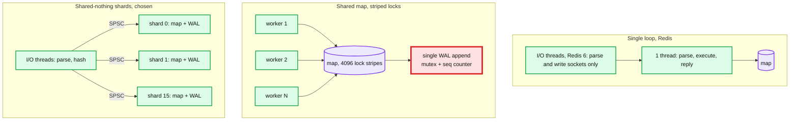

# Deep dive: concurrency model, write ordering, and visibility

> One-line answer: one thread owns each shard's map and log, so memory order, log order, and LSN order are the same thing by construction; readers see only versions whose LSN is at or below the durable watermark, so a write is never observed before it can survive a crash; the only shared state on the data path is a single-producer queue per shard and a per-bucket sequence counter for the snapshot walker.

Part of [`solution.md`](../solution.md) §4.1, §4.4, §5.3. Raw notes: [`research/snapshots-compaction-concurrency-survey.md`](../research/snapshots-compaction-concurrency-survey.md) §4.

---

## 1. Three ways to run a KV store on 32 cores



| Model | Peak simple ops/s per node | Where it breaks | Multi-key atomicity |
|---|---|---|---|
| Single loop (Redis) | ~100 to 200 k, up to ~1 M with I/O threads for network-bound loads | one core executes everything; any slow command, fork, or rehash step stalls all clients | free, all keys on one thread |
| Shared map + striped locks | ~1 M with care | the single WAL append point (one mutex, one sequence) and cross-core cache-line traffic on hot entries; global resize | needs multi-lock ordering to avoid deadlock |
| Shared-nothing shards (Dragonfly, Scylla) | many M; Dragonfly reports 6.4 M ops/s on 64 cores | a hot key pins one core; cross-shard ops need a coordination protocol | free within a shard, absent across shards unless you build VLL-style transactions |

We choose shared-nothing because the WAL is per shard anyway (one fsync stream per shard is what lets 16 fsyncs run concurrently) and because the interview's hardest questions (ordering, visibility, snapshot consistency) become trivial when one thread owns everything.

## 2. Why one thread makes ordering a non-question

The interviewer asks: "Two threads write the same key. A reader reads it at the same time. Who wins? Is the WAL order the same as the memory order?"

With shared-nothing:
- Both writes go into the same shard's queue. The shard thread pops them in some order. That order gets LSNs 10 and 11, is appended to the log buffer in that order, and is applied to the map in that order. There is no second thread that could interleave. Memory order = log order = LSN order because they are the same loop iteration.
- "Who wins" is whichever was dequeued second, and that is the answer everywhere: in memory, on disk, on every replica, after every restart.
- The reader also goes through the queue. It runs before, between, or after the two writes, and what it sees is exactly the state at that point in the sequence (subject to the watermark, next section).

With a shared map and a separate log leader (RocksDB-style), the same property needs the write group protocol: the leader assigns sequence numbers under a mutex in the order it writes the log, and memtable inserts by followers can happen in parallel because each insert carries its sequence number and readers filter by sequence. That works, and it is what RocksDB does, but it is a paragraph of explanation instead of a sentence.

## 3. Visibility: when may a reader see a write?

Three options. The failure case is a process crash after the read but before the write is durable.

| Option | Rule | Crash consequence | Cost |
|---|---|---|---|
| A. Visible on apply (Redis) | apply to map, reply, fsync later | a reader saw a value that is gone after restart. Also the writer got an ack for a lost write with `everysec` | none |
| B. Apply after fsync | buffer, fsync, then apply and reply | none; nothing unacked is ever in the map | `cas`/`incr` logic must run at apply time; same-key writes in one batch re-ordered at apply |
| C. Apply now, publish at watermark (chosen) | apply with LSN, reply and expose when `durable_lsn ≥ lsn` | none; readers filter by watermark | one `prev` pointer per entry for ~1 ms; one compare per read |

Option C in detail:

```
entry: { key, cur: (value, lsn), prev: (value, lsn) or null }

read(k):
    e = table[k]
    if e.cur.lsn <= durable_lsn: return e.cur
    if e.prev and e.prev.lsn <= durable_lsn: return e.prev
    return NOT_FOUND          # key did not exist durably yet

write(k, v):                  # shard thread only
    e = table[k]
    if e.cur.lsn > durable_lsn: e.prev stays (it is the durable one), cur is replaced   # two unacked writes in a row
    else: e.prev = e.cur      # cur was durable; keep it visible until the new one is
    e.cur = (v, lsn)
```

Linearization points: a write at the moment `durable_lsn` passes its LSN (in `on_durable`, before the ack is sent); a read at its map lookup. Both happen on the shard thread, so there is a single total order per shard and the client-observed order matches it. That is per-key linearizability, and actually per-shard.

The subtle case: two unacked writes to the same key, lsn 10 then lsn 11, both in flight. `prev` must hold the last **durable** version, not simply the previous one. So a write only rotates `cur` into `prev` if `cur` was durable. Otherwise `prev` is kept and `cur` is overwritten (the lsn 10 version becomes unreachable, which is fine: nobody was allowed to see it and it is still in the log).

Interaction with the snapshot: the snapshot walker also uses `prev`, for "version at `snap_lsn`". Two consumers, one slot. Resolve by making `prev` a tiny chain (at most two nodes: durable-but-superseded and snapshot-version) or by delaying the snapshot start until `durable_lsn == applied_lsn`, which happens every few ms and makes the two uses never overlap on the same entry. We do the latter: it is one line of code.

## 4. `cas` and `incr`

- Evaluated by the shard thread against `e.cur` (the newest version, durable or not). Because the shard thread is the only writer, this is atomic with no lock.
- Result is logged physically: `CAS_RESULT k v_new` or, for `incr`, `PUT k 43`. Replay never re-evaluates.
- A `cas` that fails writes nothing to the log and replies immediately. A `cas` that succeeds is acked at the watermark like any write.
- Why evaluating against unacked state is correct: the ack for the `cas` is only sent after its own LSN is durable, and batches sync in order, so the write it depended on is durable by then too. If the earlier batch fails, the process halts and both are gone.

## 5. Reads that never block, writes that never wait for reads

- The shard thread does reads and writes alternately from its queue. A read is ~1 us. Nothing blocks it: no lock, no disk, no allocation (values are returned by pointer; the I/O thread copies onto the socket under an epoch guard so the shard thread can free the old version only after the copy).
- Epoch-based reclamation for freeing values: the I/O thread pins an epoch while it copies; the shard thread defers frees to the next epoch. Same idea as RCU and crossbeam-epoch. Cheaper alternative for small values: copy the value into the reply on the shard thread (200 B memcpy ≈ 20 ns) and skip epochs entirely. We do that for values under 4 KB and use epochs only for big values.
- Big values (1 MB) are the p99 risk: a 1 MB memcpy is ~50 us on the shard thread. Bound it with the size cap and off-thread copying.

## 6. The hash table

- Chained buckets, power-of-two array, per-shard. 12.5 M entries per shard → 16 M buckets × 8 B = 128 MB of bucket array.
- Incremental rehash on growth: allocate the new array, migrate one bucket per operation plus a 1 ms timed step every 100 ms, look up in both during migration, insert into the new one. Paused during a snapshot walk. Redis `dict` does exactly this and additionally pauses during `fork()` to limit CoW.
- Alternative that never doubles: Dragonfly's segmented "dashtable" (extendible hashing) grows one 60-bucket segment at a time. Better memory profile, more code.
- Per-bucket seqlock (a 32-bit counter) for the snapshot walker. Writer increments before and after touching the bucket; the walker retries on an odd or changed value. No effect on normal reads, which happen on the writer's own thread.

## 7. Memory accounting and pressure

- Per-shard counters for live bytes, retained-version bytes, log buffer bytes. Summed for the node.
- At 80% of the budget: alert. At 90%: reject mutations with `OUT_OF_MEMORY`, keep serving reads and deletes. Never evict; this is a store.
- Fragmentation: jemalloc with size classes; a slab per size class for values under 512 B; background defrag (like Redis active defrag) when the fragmentation ratio passes 1.5.
- Transparent huge pages set to `never` or `madvise`. THP is a well-known Redis latency and RSS problem, and even without `fork()` it causes compaction stalls of tens of ms.

## 8. TTL

- Lazy on read: the shard thread checks `expire_at` and returns `NOT_FOUND` for an expired key, logging an `EXPIRE` record so the deletion is durable and replicated.
- Active sampler: every 100 ms sample 20 keys with TTLs per shard, expire the expired ones (log `EXPIRE`), repeat the cycle while more than 25% were expired. Redis's algorithm; bounded CPU, eventual reclamation.
- Followers never expire on their own clock; they apply `EXPIRE` records. Prevents leader/follower disagreement under clock skew.

## 9. What to say when asked "why not just Redis"

Redis is a fine single loop with I/O threads for parsing, and its `appendfsync always` does batch commands from one event-loop iteration into one fsync. The reasons it is not this design: one core executes all commands, `fork()`-based snapshots with 2x memory risk, visibility before durability (option A), and async replication. Each is a stated requirement here. KeyDB and Dragonfly exist because people hit exactly these walls.

## 10. Questions this deep dive answers

- "Two writers, one reader, same key." One thread orders them; the reader sees the newest durable version.
- "Is WAL order the memory order?" Same loop iteration assigns the LSN, appends, and applies. Yes, by construction.
- "Can a reader see something that is later lost?" No: watermark filtering.
- "How does `cas` stay atomic without locks?" Single writer per shard.
- "What stalls the shard thread?" Big values, rehash steps, and a slow log writer sharing its core. Each has a mitigation above.
