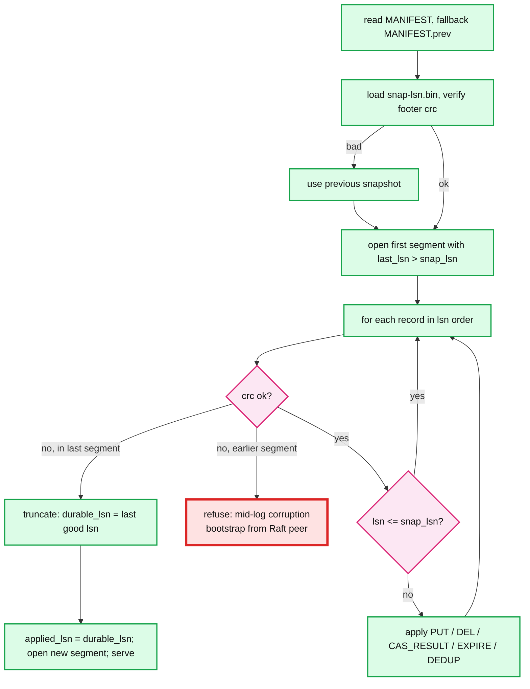
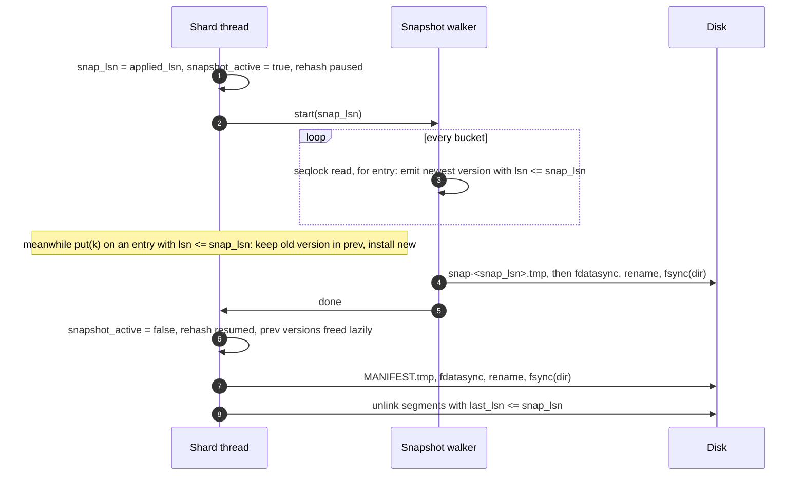

# Deep dive: crash recovery, snapshots, and log truncation

> One-line answer: recovery is "load the newest complete snapshot, replay every log record after its LSN, stop at the first bad CRC in the last segment"; a snapshot is a consistent image of one shard at `snap_lsn` taken without pausing writes by keeping the pre-snapshot version of any entry written during the walk; the log before `snap_lsn` is deleted once the snapshot and the manifest that points at it are durable.

Part of [`solution.md`](../solution.md) §4.3 and §5.2. Raw notes: [`research/snapshots-compaction-concurrency-survey.md`](../research/snapshots-compaction-concurrency-survey.md).

---

## 1. Why the log alone is not enough

```
log growth   = 50 MB/s peak, 10 MB/s avg  -> 0.9 to 4.3 TB per day
replay speed = ~500 MB/s (parse + hash insert bound, one thread)
restart      = 1 day of log / 500 MB/s = 30 min to 2.4 h, growing every day
```

The restart SLO is 2 minutes. So the log must be cut regularly, and cutting it requires an image of the state at the cut point. That image is the snapshot. The two are tied by one number, the LSN at which the snapshot is exact.

## 2. On-disk layout for one shard

```
shard-3/
  MANIFEST            {snapshot_lsn: 4200000, first_live_segment: 4100000, format: 2, epoch: 7}
  MANIFEST.prev       previous manifest, kept for fallback
  snap-4200000.bin    entries with lsn <= 4200000, footer {count, crc32c, snap_lsn, format}
  snap-3600000.bin    previous snapshot, kept until the next one is durable
  wal-4100000.log     segment, first_lsn 4100000 (contains records both before and after snap_lsn)
  wal-4400000.log     current segment
  wal-4700000.log     preallocated next segment, empty
```

Rules:
- A segment is deleted only when `last_lsn ≤ snapshot_lsn` of a durable manifest. So a segment that straddles the snapshot LSN stays and its early records are skipped on replay.
- The manifest is written as `MANIFEST.tmp → fdatasync → rename → fsync(dir)`. Rename is atomic on POSIX filesystems, so the manifest is always either the old one or the new one.
- Two snapshots and two manifests retained. If the newest is unreadable, recovery uses the previous one and replays a longer tail. Segments needed by the previous snapshot are only deleted when the newer manifest is durable, so the longer tail always exists.

## 3. Recovery flow



Timing for one shard (3.75 GB snapshot, ≤ 2 GB log tail): 4 s load + 4 s replay, 16 shards in parallel, bounded by NVMe read bandwidth at ~20 s for the whole node. Recovery threads = shards; the snapshot loader is a `memcpy` into a preallocated table, not a command interpreter, which is why RDB-style images load several times faster than AOF-style command replay.

Serving during recovery: no. A shard that answers `NOT_FOUND` for a key that exists in the unreplayed tail violates linearizability. Report `RECOVERING`; with Raft, clients are already on another leader.

## 4. Idempotent replay

Recovery itself can crash. Replay must be safe to run again from the start.

| Record | Replay twice? | How |
|---|---|---|
| `PUT k v` | safe | overwrite |
| `DEL k` | safe | delete-if-present |
| `incr k +1` as a logical record | **wrong**: doubles | do not log it this way |
| `CAS_RESULT k v_new` | safe | it is a `PUT` with a different name; the decision was made once, on the leader, before logging |
| `EXPIRE k` | safe | delete-if-present |
| `DEDUP client req result` | safe | overwrite |

Physical logging (log what the state became, not what was asked) is the whole trick. It costs nothing for `put` and `delete` and makes `cas` and `incr` replay-safe without tracking which records already applied. ARIES does the general version of this with per-page LSNs; we do not need it because every record is a whole-entry overwrite.

Snapshot and log overlap is handled by LSN: entries in the snapshot carry their LSN; records with `lsn ≤ snap_lsn` are skipped. Even if they were applied again, the result would be identical.

## 5. Snapshot without stopping writes

### 5.1 The options

| Method | Pause | Peak memory | Complexity | Used by |
|---|---|---|---|---|
| Stop the world, serialize | seconds per GB | 1x | trivial | nobody at scale |
| `fork()`, child writes, parent continues (CoW) | page-table copy: ~10 to 20 ms per GB on a modern VM, up to 239 ms/GB on old Xen; 60 GB ≈ 0.6 to 1.2 s | up to 2x under heavy writes; THP makes every 1 B write copy 2 MB | trivial in code, subtle in ops | Redis RDB and AOF rewrite |
| Freeze the map, start a new one, serialize the frozen one | none | 1x + writes during the walk, but the frozen map must be merged back or kept forever | moderate | RocksDB memtable flush (they never merge back; the frozen memtable becomes an SST on disk) |
| Retained versions per entry, walker reads version ≤ `snap_lsn` | none | 1x + entries written during the walk (~15 MB per shard for a 4 s walk) | moderate: seqlocks and paused rehash | Dragonfly, MVCC databases |

We choose retained versions. The freeze-and-swap model does not fit an in-memory store because the frozen map is most of the data and cannot be merged back cheaply.

### 5.2 Mechanics



Rules inside the shard thread while `snapshot_active`:
- On write to entry `e`: if `e.lsn ≤ snap_lsn` and `e.prev == null`, move the current version into `e.prev` before installing the new one. If `e.lsn > snap_lsn`, the entry was already written during the walk and `prev` already holds the snapshot version (or the entry did not exist at `snap_lsn`, marked by `prev = TOMBSTONE`).
- On insert of a new key: `prev = TOMBSTONE` so the walker emits nothing.
- On delete: the entry stays with a tombstone as the current version and the old value in `prev` until the walk passes.
- The walker never blocks the writer. It reads a bucket under a seqlock: read the sequence, copy the bucket's entries, re-read the sequence, retry if it changed. Writers bump the sequence before and after mutating a bucket. Cost to the writer: two relaxed atomic increments per write.
- Rehash is paused during the walk so the bucket array is stable. A 4 s pause of growth is harmless; inserts go into the existing table at a slightly higher load factor.

Memory bound: only entries written during the walk hold a `prev`. At 12.5 k writes/s per shard and a 4 s walk that is 50 k entries × ~300 B = 15 MB. A stuck walk (slow disk) is capped: abort after 5 minutes or 1 GB of retained versions, release, alert, retry later.

The snapshot at `snap_lsn` is usable only once `durable_lsn ≥ snap_lsn`, which is within milliseconds, because entries with `lsn ≤ snap_lsn` may still be in an fsync-in-flight batch when the walk starts. The manifest write waits for it.

### 5.3 When to snapshot

Not on a timer. On bytes: when `log_bytes_since_snapshot > budget`, where `budget = restart_replay_budget_s × replay_MB_per_s`. With 4 s of replay budget per shard at 500 MB/s, `budget = 2 GB`. A hot shard snapshots every 10 minutes at peak; an idle shard never does. Add a time cap (1 hour) so that a shard with a trickle of writes still bounds its log, and stagger shards so at most 2 walk at once (disk bandwidth for snapshot writes ≈ 2 × 1 GB/s).

## 6. Pseudocode (what the interviewer asks for)

Write path in the shard thread and the log writer. Single-node, no Raft.

```python
# shard thread: the only mutator of `table` and `pending`
def on_put(req):
    lsn = next_lsn; next_lsn += 1
    rec = encode(PUT, lsn, req.key, req.value, req.expire_at)   # crc32c over len|type|payload
    log_buf.append(rec)                                          # in-memory buffer, not yet written
    e = table.get_or_create(req.key)
    if snapshot_active and e.lsn <= snap_lsn and e.prev is None:
        e.prev = e.current()                                     # keep the snapshot version
    e.install(value=req.value, lsn=lsn)                          # visible only once durable_lsn >= lsn
    pending.push((lsn, req.conn, req.request_id))
    maybe_wake_log_writer()

def on_get(req):
    e = table.get(req.key)
    v = e.newest_version_with_lsn_at_most(durable_lsn) if e else None
    reply(req.conn, v if v and not v.tombstone and not expired(v) else NOT_FOUND)

def on_durable(last_lsn):                     # called by the log writer
    durable_lsn = last_lsn
    while pending and pending.head.lsn <= durable_lsn:
        lsn, conn, rid = pending.pop()
        reply(conn, OK(lsn))
    # prev versions with lsn <= durable_lsn and not needed by a snapshot are freed lazily on next touch

# log writer thread for the same shard
def log_writer_loop():
    while True:
        wait_until(log_buf.nonempty() or floor_timer_fired())   # floor 200 us on NVMe, 1 ms on EBS
        buf, log_buf = log_buf, new_buffer()                     # swap, shard thread keeps appending
        if segment.remaining() < len(buf): rotate_segment()      # next segment was preallocated in the background
        pwrite(segment.fd, buf, segment.offset); segment.offset += len(buf)
        if fdatasync(segment.fd) != 0:
            halt_shard(); fatal("fsync failed")                  # never retry (fsyncgate)
        post_to_shard_thread(on_durable, buf.last_lsn)

def rotate_segment():
    segment = next_segment                                       # already: open tmp, fallocate 256 MB, fdatasync, rename, fsync(dir)
    spawn_background(prepare_next_segment)
```

Recovery:

```python
def recover_shard(dir):
    m = read_manifest(dir / "MANIFEST") or read_manifest(dir / "MANIFEST.prev")
    snap = load_snapshot(dir / f"snap-{m.snapshot_lsn}.bin")     # verify footer crc; fall back to previous on failure
    table = snap.table; applied = m.snapshot_lsn
    for seg in segments_with_last_lsn_greater_than(dir, m.snapshot_lsn):   # ascending first_lsn
        for rec in read_records(seg):                            # yields None at first bad crc / bad length
            if rec is None:
                if seg.is_last: truncate(seg, at=rec_offset); break
                else: raise Corruption(seg)                      # mid-log corruption: refuse to start
            if rec.lsn <= applied: continue                      # covered by snapshot or replayed already
            if rec.lsn != applied + 1: raise Gap(rec.lsn)        # a hole is lost data, not a torn tail
            apply(table, rec)                                    # PUT/DEL/CAS_RESULT/EXPIRE/DEDUP, all overwrite-style
            applied = rec.lsn
    durable_lsn = applied_lsn = next_lsn - 1 = applied
    return table
```

Snapshot walker:

```python
def snapshot_walk(shard, snap_lsn):
    f = open_tmp(shard.dir / f"snap-{snap_lsn}.tmp")
    for bucket in shard.table.buckets:                           # rehash is paused, array is stable
        while True:
            s1 = bucket.seq.load()
            if s1 & 1: continue                                  # writer in progress
            entries = [(e.key, e.version_at_most(snap_lsn)) for e in bucket]
            if bucket.seq.load() == s1: break                    # consistent read
        for key, v in entries:
            if v and not v.tombstone: f.write(encode_entry(key, v))
    f.write(footer(count, crc, snap_lsn)); fdatasync(f); rename(tmp, final); fsync(dir)
    shard.post(finish_snapshot, snap_lsn)                        # waits for durable_lsn >= snap_lsn, then manifest, then unlink segments
```

## 7. How others do it, in one line each

- **Redis**: `fork()` for both RDB and AOF rewrite; Redis 7 writes a base RDB plus incremental AOF files and a manifest, and swaps the manifest atomically. Same manifest idea as ours, different snapshot mechanism.
- **RocksDB**: freezes the memtable, flushes it to an SST, then deletes WAL files whose records are all in flushed memtables (across all column families, which is the classic "one idle column family pins the WAL" trap).
- **etcd**: Raft snapshot every `--snapshot-count` entries (100,000 default), the snapshot is the bbolt file, log entries before it are compacted; lagging followers receive the snapshot file.
- **Bitcask**: no snapshot of values at all; the data files are the values, only the in-memory keydir is rebuilt on restart, accelerated by hint files written during merge. This is the shape of our disk-spill evolution.

## 8. Questions this deep dive answers

- "Process dies during recovery?" Replay is idempotent; start over.
- "Snapshot while writes continue: which version is in it?" Exactly the version with the largest `lsn ≤ snap_lsn`, for every key. Writes after that are in the log after `snap_lsn`.
- "When can you delete the log?" When a manifest pointing at a snapshot with `snapshot_lsn ≥ segment.last_lsn` is durable, and (with replication) every follower is past it or will re-bootstrap.
- "How long is restart?" ~30 s for 60 GB, bounded by disk read bandwidth, because shards recover in parallel and the tail is capped at 2 GB per shard.
- "What if the snapshot file is corrupt?" Previous snapshot plus a longer tail. Segments for it still exist by construction.
