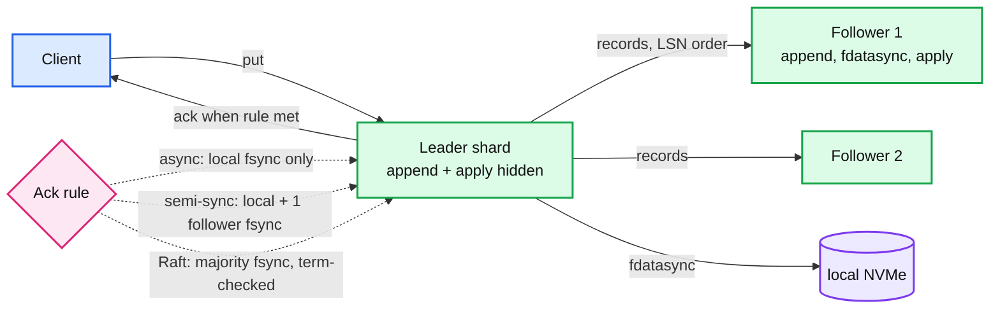
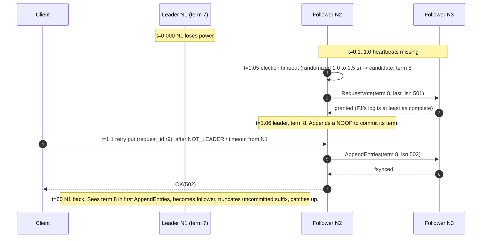

# Deep dive: replication, failover, and fencing

> One-line answer: ship the same per-shard WAL records to two other nodes and only ack when a majority has fsynced them; that is Raft, the term number in every record is the fence that stops a deposed leader, and failover is an election that finishes in 1 to 2 seconds with zero acked writes lost.

Part of [`solution.md`](../solution.md) §5.4. Raw notes: [`research/interview-framing-and-scaling-survey.md`](../research/interview-framing-and-scaling-survey.md) §4 to §5. Reusable concept: `concepts/consensus.md` (to be written), `popular_systems_deepdive/kafka/kafka-02-replication-isr.md` for the ISR variant.

---

## 1. The WAL is already a replication log

Every record has an LSN and is applied in LSN order by a deterministic state machine (the shard's map). Send the same records to another machine, apply them in the same order, and it holds the same state. Postgres streaming replication, MySQL binlog, Kafka partition replication, Raft, Paxos-based Data Shuttle at Meta: all the same object with different rules about **when the leader may ack**.

## 2. The options, with numbers

| Option | Ack when | Acked-write loss on leader death | Extra write latency (in DC) | Failover | Fencing | Examples |
|---|---|---|---|---|---|---|
| Async shipping | local fsync | everything not yet received by a follower: 10s of ms to seconds of writes | 0 | manual, or coordinator (Sentinel: `down-after-milliseconds` 30 s default) | none built in; coordinator must do it | Redis replication, Postgres `synchronous_commit = local`, MySQL async binlog |
| Redis `WAIT n` | n followers have the bytes **in memory** | still possible: followers have not fsynced and the leader already acked | 1 RTT | same | none | Redis. `WAITAOF` (7.2) waits for follower fsync but the design is still ack-then-wait |
| Semi-sync | local fsync + 1 follower fsync (MySQL `AFTER_SYNC`, Postgres `synchronous_commit = on` with one sync standby) | none, if the sync follower survives | 1 RTT + follower fsync ≈ 0.5 to 1.5 ms | coordinator, 10 to 30 s; must pick the follower that acked | external (epoch in coordinator, kill old primary) | MySQL lossless semi-sync, Postgres sync standby |
| Raft (chosen) | majority (2 of 3) fsynced, same term | none | 1 RTT + slower of 2 fsyncs ≈ 0.5 to 1.5 ms | automatic, election timeout 1 s + election ≈ 1 to 2 s | built in: terms | etcd, TiKV, CockroachDB, Kafka KRaft |
| Chain replication | tail has it (whole chain fsynced) | none | chain length × (RTT + fsync) | master reconfigures chain | master-assigned chain config | Azure Storage stream layer, CRAQ |
| Dynamo quorum (W=2, R=2, N=3) | W replicas stored | none, but concurrent writers to one key conflict | 1 RTT | none needed, any replica takes writes | vector clocks resolve conflicts | Cassandra, Riak, DynamoDB (original) |

Per-key linearizability rules out Dynamo. Automatic failover under 10 s rules out semi-sync with a human. Latency rules out chain replication beyond 3. Raft is the remaining choice and it costs the least new code because the log format is already what Raft needs, plus a term field.

## 3. Raft mapped onto our shard

| Raft concept | Our object |
|---|---|
| Log entry | WAL record with `term` added to the header |
| `AppendEntries` | the group-commit batch, sent to followers in parallel with the local `pwrite` + `fdatasync` |
| `commit_index` | `durable_lsn`: the watermark that publishes versions and releases acks |
| Snapshot | `snap-<lsn>.bin`, sent to a follower that is behind the oldest retained segment |
| State machine | the shard's hash map |
| Leader lease | read without a quorum round trip, valid for `election_timeout − clock_drift_bound` |

The write path from [`concurrency-model.md`](concurrency-model.md) changes in one place: `on_durable` is called when the majority has fsynced, not when the local fsync returns. Local and remote fsyncs run in parallel, so the added latency is one RTT (~0.1 to 0.5 ms in a DC) plus the difference between the local fsync and the second-fastest follower fsync.

Multi-Raft on one node: 16 groups, each with its own log and election state. Heartbeats are batched per node pair (one message every 100 ms carries all 16 groups), as TiKV does. Leadership is spread so each node leads about a third of the groups and the write load is even.

## 4. Failover, second by second

Data at risk: none of the acked writes. LSN 501 was on a majority (N1 and at least one of N2, N3) or it was never acked. Unavailability for shard 3 writes: ~1 to 2 s. Reads: with leases, N1 could have served stale reads until its lease expired at ~t=1.0; after that nobody serves shard 3 reads until F1 wins.

Tuning: election timeout 1 s and heartbeat 100 ms are etcd's defaults, chosen for disks where fsync p99 is under 10 ms. A slow disk makes followers late and triggers spurious elections; alert on `wal_fdatasync_p99 > 10 ms` before that happens.

## 5. Fencing: what stops the old leader

The question "how do you stop the old primary from acking after failover" has one correct answer with Raft and several partial answers without it.

- **With Raft**: every `AppendEntries` carries the leader's term. A follower that has seen term 8 rejects term 7. The old leader cannot assemble a majority, so `commit_index` never advances, so it never acks. It may accept writes into its local buffer and apply them hidden; they are truncated when it learns of term 8. No external fencing needed.
- **Lease reads**: the old leader may serve reads for up to one lease after losing contact. The lease is shorter than the election timeout so a new leader cannot exist while the old lease is valid, provided clocks drift less than the margin. Stated assumption: bounded clock drift (say 500 ppm). Strict alternative: read-index, which costs a heartbeat round per read batch.
- **Without Raft** (semi-sync with a coordinator): the coordinator bumps an epoch in a config service, the new primary writes that epoch into its records, followers and the storage layer reject records with an older epoch, and clients carry the epoch so a stale primary returns `FENCED`. This is the fencing-token pattern (see `../distributed-file-system/deep-dives/leases-fencing-epochs.md`). It works but it is three moving parts that Raft gives you in one.

## 6. Catching up a follower and truncating the log

- A follower that lags by less than the retained log gets records from `match_index + 1`.
- A follower that lags past the oldest retained segment gets the leader's newest snapshot file (3.75 GB, ~4 s over 25 Gbps) then the log after `snap_lsn`. Same files as local recovery; no special format.
- Leader log truncation waits for `min(snapshot_lsn, min over live followers of match_index)`, capped at 2 hours of log. A follower that is dead for longer re-bootstraps from a snapshot. This is the same rule Kafka uses with ISR shrink.
- Snapshots are per shard, so a lagging follower on one shard does not pin logs on the other 15.

## 7. Read paths after replication

| Read type | Consistency | Latency | When |
|---|---|---|---|
| Leader with lease | linearizable | ~1 us + network | default |
| Leader with read-index | linearizable, no clock assumption | + 1 heartbeat RTT | strict mode |
| Follower, bounded staleness | may lag by replication delay (~ms) | local | opt-in for hot keys |
| Follower with client LSN (`read_after(lsn)`) | read-your-writes for that client | waits until `applied_lsn ≥ lsn` | opt-in |

## 8. Cost of the decision

- 3x memory and disk for the fleet. For 60 GB of user data per node, 180 GB of RAM across three nodes, and three NVMe write streams of 50 MB/s each.
- Put p99 goes from ~2 ms to ~3 ms in the same DC. Cross-AZ within a region adds ~1 ms RTT; still inside 5 ms. Cross-region Raft (30 to 100 ms RTT) is out; multi-region is async log shipping with an epoch fence, RPO of seconds.
- Engineering: use an existing Raft library (etcd/raft, openraft) rather than writing one. The state machine and the log storage are ours; the protocol is not.

## 9. Questions this deep dive answers

- "Make the ack mean the write survives a machine loss." Ack after a majority fsync. Cost: +1 RTT and the second-fastest fsync.
- "Old primary keeps acking." It cannot commit without a majority; terms make followers refuse it.
- "Failover time?" 1 to 2 s with etcd defaults.
- "Why not Redis replication plus `WAIT`?" `WAIT` confirms bytes in follower memory after the client was already acked. It bounds lag; it does not give durability.
- "Why not semi-sync?" It works for RPO 0 but failover and fencing need an external coordinator and are 10x slower.
- "Why not Dynamo quorums?" Conflicting concurrent writes on one key; the requirement is per-key linearizable.
