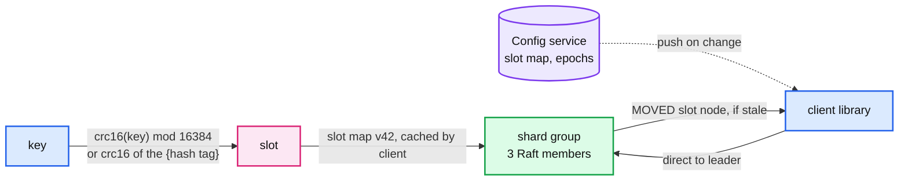
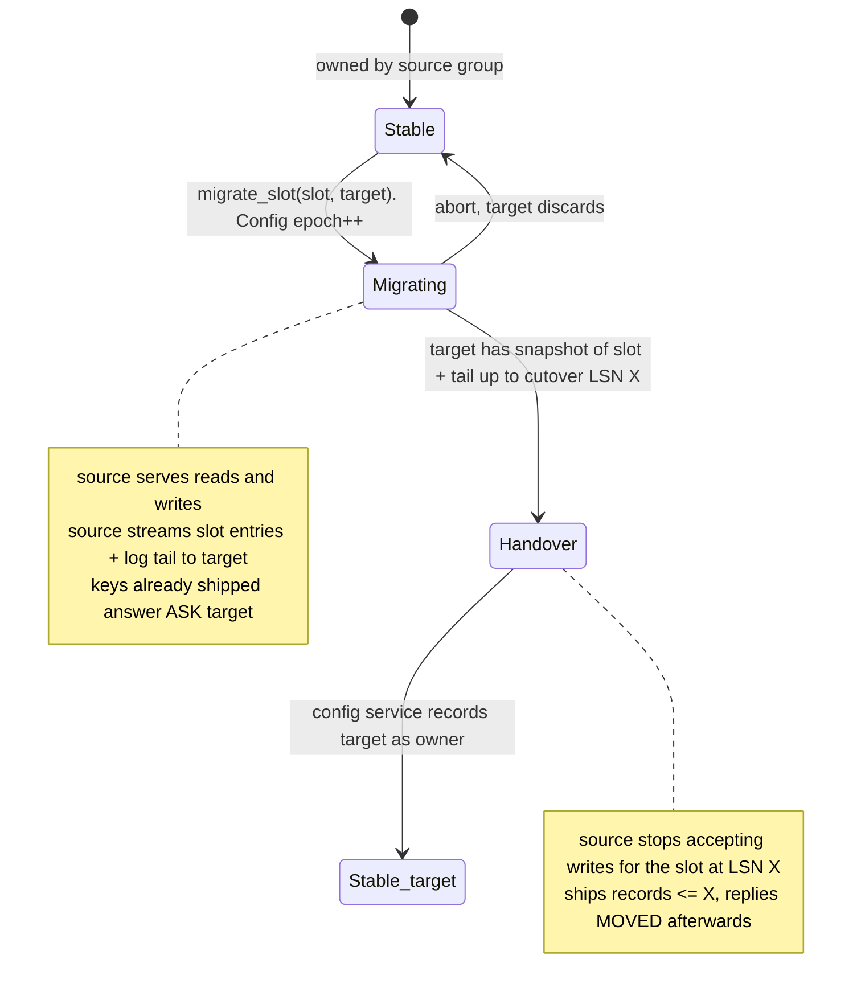

# Deep dive: sharding across nodes, live migration, hot keys, multi-key ops

> One-line answer: hash every key into one of 16,384 slots, map slots to shard groups in a small Raft-backed config service that clients cache, move a slot with a three-state handoff that cuts over at one LSN, absorb hot keys with a client cache and follower reads, and keep multi-key atomicity by co-locating keys with hash tags instead of building cross-shard transactions.

Part of [`solution.md`](../solution.md) §5.6. Raw notes: [`research/interview-framing-and-scaling-survey.md`](../research/interview-framing-and-scaling-survey.md) §6 to §7. Reusable concept: `concepts/sharding.md` (to be written).

---

## 1. Placement: slots, not a ring, not ranges



| Scheme | Lookup | Add a node | Hot spot handling | Range scans | Used by |
|---|---|---|---|---|---|
| Consistent hash ring with virtual nodes | hash, walk ring | ~1/N of keys move, but which keys is implicit | split a virtual node | no | Dynamo, Cassandra |
| Fixed hash slots (chosen) | hash mod 16384, table lookup | move explicit slots; observable, resumable | move the hot slot alone; a single hot key still cannot split | no | Redis Cluster |
| Range partitioning | ordered map lookup | split a range at a key | split ranges on load | yes | Bigtable, TiKV (96 MB regions), CockroachDB (512 MB ranges) |

Slots win for a hash-keyed store: ownership is a table an operator can read, migration is a state machine per slot, and 16,384 is small enough that the whole map is 32 KB. Range partitioning is the seam if range scans ever land.

Group sizing: a node holds 16 shard groups. With 16,384 slots and, say, 48 groups across 3 nodes, each group owns ~341 slots. Adding a fourth node means moving ~25% of slots, spread across all groups, one slot at a time.

## 2. Live slot migration



Steps:
1. Operator or balancer calls `migrate_slot(slot, target)`. Config service bumps the epoch and marks the slot `MIGRATING source → target`.
2. Source walks its map for keys in the slot (a per-slot index or a full walk with a slot filter; ~1/341 of a shard, ~11 MB) and streams entries to the target, then streams log records for the slot as they happen. Target applies them into its own map and its own WAL under its own Raft group.
3. Cutover: source picks LSN X, stops accepting writes for the slot (returns `ASK target` for the slot from then on), ships records ≤ X, and confirms. Target now owns everything up to X. Config service records the new owner. Clients learn via `MOVED` or push.
4. Source deletes the slot's entries lazily.

Writes during migration are never lost: until cutover, they land in the source's log and are forwarded; after cutover, they are refused with `ASK` and retried on the target with the same `request_id`. Duplicates are caught by the dedup table, which migrates with the slot.

Rate: one slot at a time per group, throttled to ~50 MB/s so migration does not compete with client traffic. Moving 25% of a 60 GB node is 15 GB, ~5 min.

## 3. Hot keys

Numbers first. One shard thread does ~1 M lookups/s. One node's NIC does ~3 GB/s. One Raft group commits ~10 k to 50 k batches/s.

| Hot pattern | What breaks first | Fix | When the fix stops working |
|---|---|---|---|
| Read-hot key, small value (30% of 800 k/s = 240 k reads/s) | nothing yet; the shard thread is at ~25% | client-side cache, 100 ms TTL, invalidate on own writes | never, for reads; the cost is 100 ms staleness |
| Read-hot key, 100 KB value | NIC: 240 k/s × 100 KB = 24 GB/s | client cache; then follower reads for that slot (3x); then a dedicated read-replica pool for that slot | when the key changes faster than the TTL |
| Write-hot counter (50 k incr/s on one key) | serialized through one Raft group, ~10 k batches/s: fine, but latency climbs under group commit | split into `key#0..key#15`, client picks a random sub-key for `incr`, sums 16 on read | when exact reads at high rate are needed; then move the counter to a purpose-built aggregator |
| Hot slot (many warm keys hashed together) | one shard thread's CPU | move the slot to a lighter group; split the group's slot range | hot single key: cannot split a slot below one key |

Detection: each shard keeps a space-saving top-k sketch (1,000 counters) over the last second and reports it. A balancer moves hot slots; a dashboard shows hot keys so the owning team can add a client cache.

Push back on "add a cache in front": the store already is the cache-speed layer. A second cache layer buys nothing for latency and adds an invalidation problem. Client-side caching with a short TTL is different: it removes network round trips, which is the actual bottleneck for a read-hot key.

## 4. Multi-key operations

| Need | Answer | Cost |
|---|---|---|
| `mget` across slots | client library fans out, merges. Not atomic, does not need to be | parallel RTTs |
| Atomic `mput` on related keys | hash tags: `{user:42}:balance` and `{user:42}:orders` hash on `user:42`, land in one slot, one shard thread, one log batch | client must choose keys with tags |
| Atomic across two arbitrary slots | refused. If forced: 2PC with a coordinator log record first, prepare on both groups (each writes a `PREPARE` record and holds the key), commit on both | 2x write latency, blocked keys if the coordinator dies, a recovery protocol. This is TiKV / Percolator territory and a different product |
| `cas` on one key | shard thread, no lock | free |
| Read-modify-write across keys | client reads, computes, writes with `cas` on each key, retries on mismatch. Optimistic, no atomicity across keys | retries under contention |

Say the refusal out loud and name the price. Interviewers want to hear that cross-shard atomicity is a product decision with a latency and availability cost, not a missing feature.

## 5. Cluster membership and the config service

- A 3 or 5 member Raft group (etcd is fine here; the data is 32 KB of slot map plus node list) holding: slot → group, group → members and leader hint, epoch per slot, node liveness.
- Clients fetch the map at startup and on any `MOVED`; the service pushes changes. A stale map costs one extra round trip, never a wrong answer, because the owning group checks ownership on every request.
- Node failure: Raft groups on the surviving members elect new leaders on their own. The config service only updates the leader hint. It is not on the data path and its outage freezes slot moves, not traffic.

## 6. Numbers for the interviewer

```
slots               = 16384, map = 16384 x 2 B = 32 KB per client
groups per node     = 16, nodes = 3 -> 48 groups, ~341 slots each
add a 4th node      = move 25% of slots = 15 GB per existing node, at 50 MB/s = 5 min per node, parallel across nodes
hot read key        = 240 k/s: shard CPU ok, NIC ok at 200 B value, NIC dead at 100 KB value
client cache effect = 100 ms TTL, 10 k clients -> at most 100 k reads/s reach the store for that key, from 240 k
write-hot counter   = 50 k/s on one Raft group: latency ~2 to 3 ms under group commit, ok; split at 100 k/s
```

## 7. Questions this deep dive answers

- "Shard it." Slots, config service, clients cache the map, `MOVED` self-heals.
- "Move data without downtime." Three-state slot migration, cutover at one LSN, `ASK` for in-flight keys.
- "One key is 30% of traffic." Client cache first, follower reads second, sub-key splitting for counters. Name the number where each stops working.
- "Two keys atomically." Hash tags. Across slots: refuse, or 2PC at 2x latency and a blocking failure mode.
- "Why slots and not a ring?" Explicit ownership, observable and resumable migration, same 1/N movement property.
