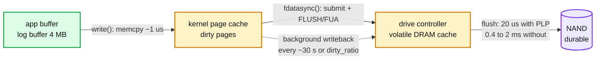

# Deep dive: WAL format and what fsync actually promises

> One-line answer: a write is durable when `fdatasync` has returned on a preallocated segment whose directory entry was fsynced once at creation; the record carries a CRC32C over its length, type, and payload so recovery can tell a torn tail from corruption; and one fsync is shared by every record that arrived while the previous fsync was in flight.

Part of [`solution.md`](../solution.md) §4.2 and §5.1. Raw notes: [`research/wal-and-durability-survey.md`](../research/wal-and-durability-survey.md).

---

## 1. The syscall path, and where the data actually is



| Call | What it guarantees on return | Cost |
|---|---|---|
| `write()` | Bytes are in the page cache. Survives a process crash, not a kernel crash or power loss | ~1 us |
| `fdatasync()` | Data and the metadata needed to read it (file size) are on stable storage. mtime is not | 20 us to 2 ms |
| `fsync()` | Same plus all inode metadata (mtime, etc.), which on ext4/XFS often means a journal commit too | slightly more |
| `fsync(dirfd)` | The directory entry (the file's name) is durable. Needed once after creating or renaming a file | same as fsync |
| `O_DSYNC` | Every `write()` behaves as `write` + `fdatasync`. Kills batching | per write |
| `O_DIRECT` | Bypasses the page cache. Does **not** imply durability; the drive cache is still volatile. Needs `fdatasync` or FUA anyway | no win for a log |

What "stable storage" means depends on the drive:
- Enterprise NVMe with power-loss protection (capacitors): the controller acks the flush as soon as data is in its DRAM, because the capacitors guarantee it reaches NAND on power loss. 20 to 100 us. 10 k to 50 k sync writes/s.
- Consumer NVMe: the flush waits for NAND. 0.4 to 2 ms. ~2 k sync writes/s. Some consumer drives lie and ack early; a power cut then loses acked data. Nothing in software fixes that.
- Cloud block storage (EBS gp3): 1 to 3 ms, IOPS-capped (16 k baseline). Durable within the AZ.
- Local NVMe on a cloud instance: fast, but gone when the instance dies. Fine for one Raft member, never as the only copy.

Interview line: "fsync is where the kernel asks the drive to promise. The promise is only as good as the drive's capacitors."

## 2. Record and segment format

```
segment file:  wal-<shard>-<first_lsn>.log     256 MB, fallocate'd, zero-filled
block:         32 KB, records never span a block unless fragmented (FIRST / MIDDLE / LAST)
record:        crc32c(4) | length(2) | type(1) | lsn(8) | op(1) | key_len(2) | key | expire_at(8) | value
               crc covers everything after the crc field. type in {FULL, FIRST, MIDDLE, LAST}
               op in {PUT, DEL, CAS_RESULT, EXPIRE, DEDUP, NOOP}
```

Why each piece:
- **CRC over length and type too.** If only the payload were covered, a corrupted length would make the parser read garbage as the next record and possibly pass a CRC by chance. RocksDB and etcd both checksum the header fields.
- **32 KB blocks.** A torn 4 KB page corrupts one record group; the reader skips to the next block boundary to resync. Small cost: a record that would straddle a block is fragmented. etcd instead frames each record with an 8-byte length (56 bits length, 8 bits padding) and no blocks; simpler, but resync after a torn middle page is not possible. We choose blocks.
- **LSN inside the record.** Recovery needs it to skip records already covered by the snapshot and to detect gaps. Raft adds `term` next to it.
- **Preallocation with `fallocate`.** Appending inside an already-allocated extent means `fdatasync` only has to flush data and the size, never an extent allocation. It also avoids the "two fsyncs" cost: without preallocation, each append that grows the file may force a journal commit for the block allocation.
- **Zero fill.** Recovery reads a zero CRC and zero length at the tail and knows it is the end, not a corrupted record. If the filesystem does not zero on `fallocate` (it does on ext4/XFS by unwritten extents), write zeros explicitly.
- **Segment creation protocol.** `open(tmp) → fallocate → fdatasync → rename(tmp, final) → fsync(dir)`. One directory fsync per 256 MB, not per record. Create the next segment ahead of time on a background thread so rotation never blocks the log writer.

## 3. Group commit math

The log writer for one shard runs this loop:

```
loop:
  wait until buffer non-empty or floor timer (200 us) fires
  swap buffers (shard thread keeps appending to the other one)
  pwrite(segment, buffer)          ~ 5 us per 4 KB
  fdatasync(segment)               ~ F
  durable_lsn = last lsn in buffer
  notify shard thread -> acks
```

Throughput = records per group / F. Latency for one record ≈ wait for current fsync (0 to F) + own fsync (F) + queueing in the shard thread.

| fsync F | Arrivals per shard | Group size at steady state | Added latency p50 / p99 | fsync/s per shard |
|---|---|---|---|---|
| 50 us (PLP NVMe) | 12.5 k/s | ~1 to 2 (floor 200 us → 2 to 3) | 0.1 / 0.25 ms | ~5 k |
| 500 us (consumer) | 12.5 k/s | ~6 | 0.5 / 1 ms | 2 k |
| 2 ms (EBS, floor 1 ms) | 12.5 k/s | ~25 | 2 / 4 ms | 500 |
| 100 ms (sick disk) | 12.5 k/s | 1,250, capped by 4 MB | 100 / 200 ms | 10 |

Across 16 shards on one device: 16 × 2 k = 32 k fsync/s on consumer NVMe is above what that drive can do; the drive queues them and F rises until it balances. Throughput holds, latency rises. That is the reason for the floor: on a slow device, waiting 1 ms to batch more is better than 16 threads fighting the drive.

Push back on "fsync per write" whenever it comes up: at 500 us, that is 2 k writes/s per shard, 32 k per node. The target is 200 k. Batching is not an optimization, it is the design.

## 4. What Postgres, RocksDB, Redis, Kafka, etcd each do

| System | Log unit | Sync policy | Batching | Notes |
|---|---|---|---|---|
| PostgreSQL | 16 MB WAL segments, 8 KB pages, LSN | `fsync` or `fdatasync` at commit (`wal_sync_method`) | group commit via `commit_delay`, and any backend flushing also flushes everyone's records | Full-page writes after checkpoint to survive torn pages |
| RocksDB | 32 KB blocks, CRC32C, FULL/FIRST/MIDDLE/LAST | `sync=true` per WriteBatch, else OS decides | write group: leader takes the mutex, writes all followers' batches, one sync | Recyclable WAL files avoid the size-metadata fsync; 4 recovery modes |
| etcd | 64 MB preallocated segments, protobuf records | `fdatasync` every Raft append batch | Raft batches entries per heartbeat interval | Alerts on `wal_fsync_duration_seconds` p99 > 10 ms |
| Redis AOF | command stream, rewritten via base RDB + incremental files | `always` (fsync in the event loop each write batch), `everysec` (background thread), `no` | `always` still batches commands from one event-loop iteration | `everysec` can lose up to 2 s. `WAITAOF` (7.2) lets a client wait for the fsync |
| Kafka | 1 GB segments, index every 4 KB | no fsync by default; durability = replication to ISR | producer batches per partition | Legitimate model: replicas are the durability, not the local disk |

Kafka's stance is worth saying out loud: with 3 replicas in separate failure domains, page-cache-only writes plus replication can be more durable than a single fsynced disk, because correlated power loss across racks is rarer than a single disk failure. Our design keeps the fsync because the single-node phase of the interview requires it, and adds replication on top.

## 5. fsyncgate

In 2018 PostgreSQL discovered that on Linux, if writeback of dirty pages fails (EIO), the kernel marks the error on the file, reports it to the **first** `fsync` caller, clears the dirty bit on the pages, and later `fsync` calls return success. Retrying `fsync` therefore lies. Behaviour was made consistent in Linux 4.13 (error reported once per file description), but the pages are still gone.

Correct behaviour, now in Postgres, MySQL, MongoDB: treat an fsync error as fatal. Crash, recover from the log, which necessarily ends before the failed batch. Our shard does exactly that: halt, stop acking, exit. Anything acked was synced by an earlier successful call.

Second-order lesson: never let two processes (or one process through two file descriptors opened at different times) share responsibility for fsyncing the same file. The error may be delivered to the one that does not care.

## 6. Checksums

- CRC32C with SSE4.2 / ARMv8 instructions: ~1 cycle per byte. 50 MB/s of log is ~50 M cycles/s, under 2% of one core. Free.
- Per record, not per block, so a single corrupt record is localized.
- Verify on every replay and on every snapshot load (footer checksum). Background scrub of old segments weekly if log retention is long.
- End-to-end: the client library can add a checksum to the value; the store keeps it opaque and returns it. Catches NIC and memory corruption, which the disk CRC cannot.

## 7. Sizing

```
record        = 26 B header + 32 B key + 200 B value = ~260 B
peak          = 200 k/s x 260 B = 52 MB/s per node, 3.25 MB/s per shard
segment       = 256 MB -> new segment every 80 s per shard at peak; dir fsync every 80 s
retention     = until snapshot (10 min or 2 GB per shard) + 1 extra snapshot's worth for the fallback manifest
disk for log  = 16 shards x 2 x 2 GB = 64 GB worst case
buffer memory = 16 shards x 2 buffers x 4 MB = 128 MB
```

If the interviewer moves values to 10 KB: 2 GB/s of log at 200 k writes/s. No single NVMe sustains that with fsync. The answer changes to "fewer writes per node, more nodes", or "values do not belong in this store".

## 8. Questions this deep dive answers

- "Where is the fsync?" One per group per shard, in the log writer, after `pwrite` of the swapped buffer.
- "fsync vs fdatasync?" `fdatasync` on preallocated segments; `fsync` on the directory when a segment is created.
- "What if fsync errors?" Halt the shard, exit, recover. Never retry.
- "How do you know a record is complete?" CRC over length, type, and payload; zero tail means end.
- "Why not O_DIRECT?" It does not buy durability and it loses coalescing. Preallocate + buffered write + fdatasync.
