# Diagrams: in-memory KV store with WAL

The D1 to D12 set for [`solution.md`](solution.md). Each diagram appears once in the repo: the ones embedded in `solution.md` are linked from here, not repeated. Colors per root `CLAUDE.md` §3. Red is used only for the fsync on the write path (the thing that breaks first) and for the halted-shard state.

Legend reminder: 🔵 client / edge, 🟢 stateless compute or threads, 🟣 durable storage, 🟡 cache or losable, 🔷 queue, 🔴 bottleneck or SPOF, ⚪ external, 🩷 decision.

---

## D1. Context (zoom-out)

What is inside the box and what talks to it. The store is one thing to its callers; replication and slot ownership are internal.

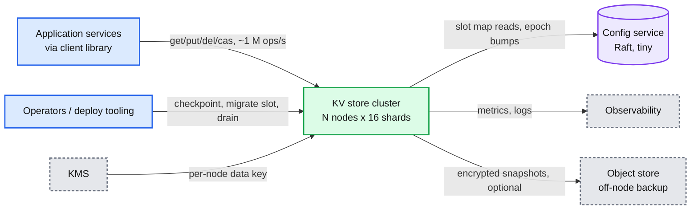

## D2. Data flow (DFD)

Bytes in, bytes on disk, bytes back. Sizes and rates are peak for one node.

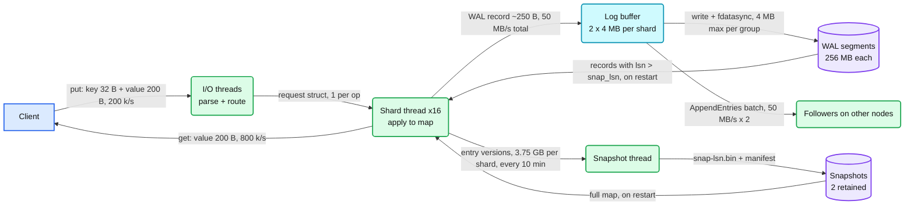

## D3. Component architecture

Embedded as the final design in [`solution.md` §6](solution.md#6-final-design). Not repeated here.

## D4. Sequence, happy path, one per FR

- D4a `get`: [`solution.md` §4.1](solution.md#41-serve-put-get-delete-from-memory-at-1-m-opss).
- D4b `put` with group commit and watermark: [`solution.md` §4.2](solution.md#42-make-an-acknowledged-write-survive-a-crash).
- D4c snapshot and truncation: [`solution.md` §4.3](solution.md#43-restart-recovers-on-its-own-in-bounded-time).
- D4d `cas` on a key with an unacked write in flight, below.

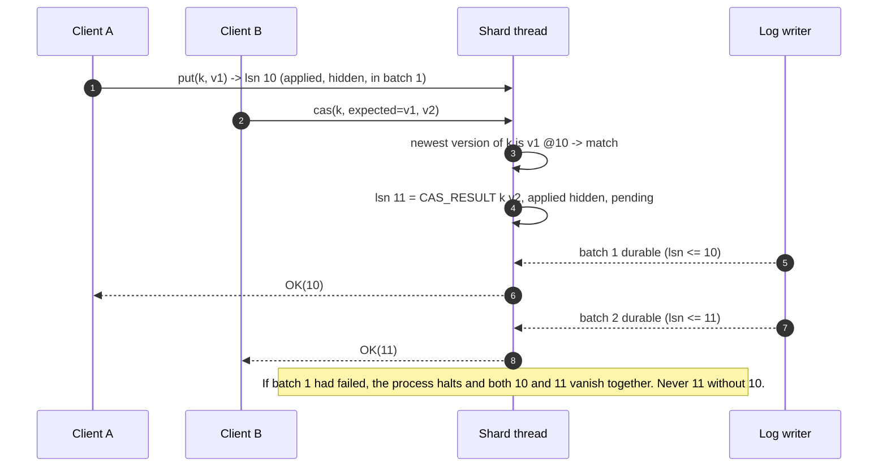

## D5. Sequence, failure paths

- D5a process crash mid-batch: [`solution.md` §10.4](solution.md#104-failure-timeline).
- D5b Raft commit with a slow follower: [`solution.md` §5.4](solution.md#54-the-machine-dies-make-the-ack-mean-the-write-survives-that-now-stop-the-old-primary-from-acking-after-failover).
- D5c fsync returns EIO, below.
- D5d leader partitioned, old leader fenced, below.

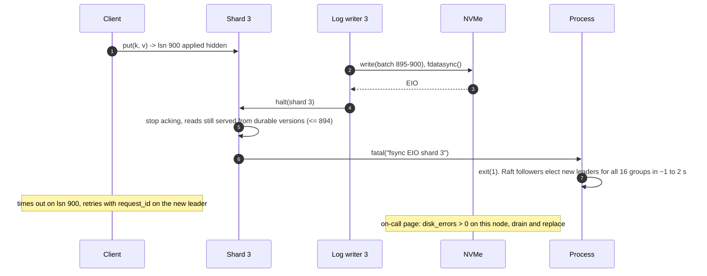

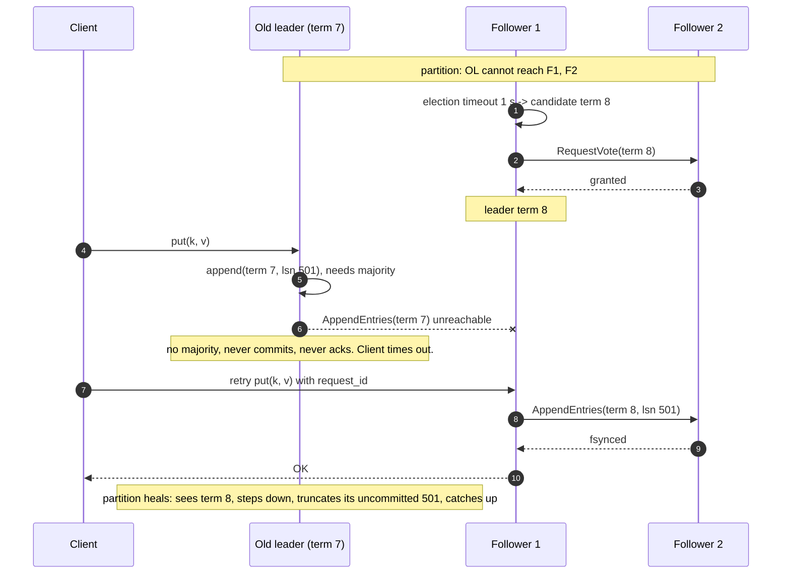

## D6. Activity / decision flow

Embedded in [`solution.md` §4.4](solution.md#44-per-key-linearizability-with-concurrent-clients-and-atomic-ops): the shard thread's per-request decision including the watermark check and the EIO branch. Recovery decision flow below.

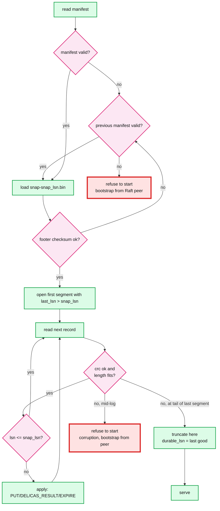

## D7. Entity relationship

Embedded in [`solution.md` §3.3](solution.md#33-data-model).

## D8. State machines

Two entities have lifecycles: a shard (leader / follower / halted / recovering) and a slot during migration.

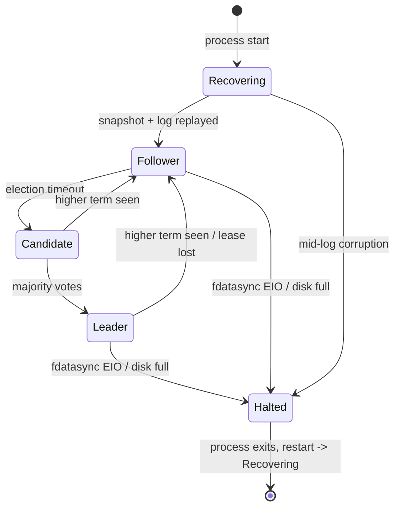

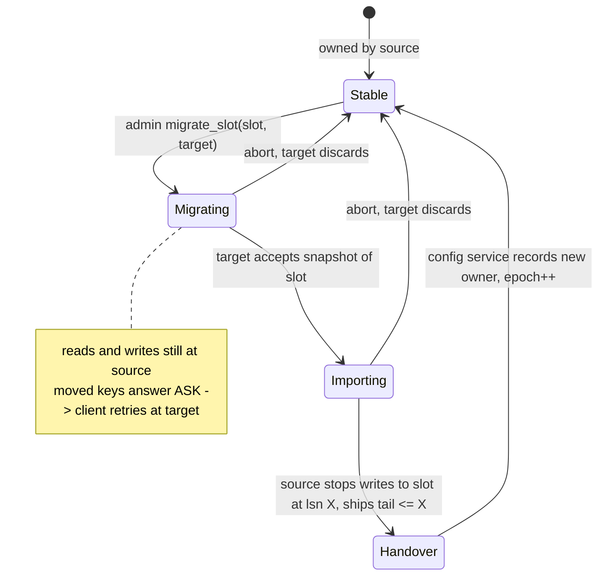

## D9. Deployment / topology

Three nodes, 16 shards each as Raft groups, leaders spread evenly so each node leads ~16 groups of the 48. Rack-aware so no rack holds a majority of any group.

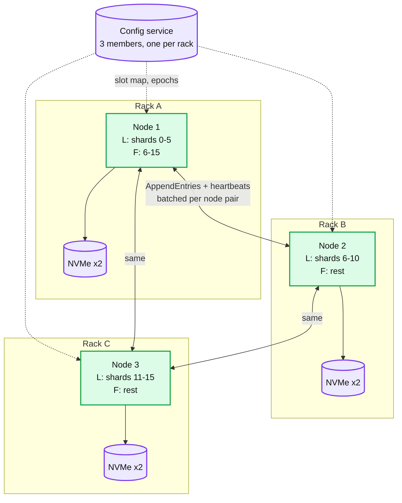

Crossing a rack boundary: every Raft append (50 MB/s per leader shard), snapshot transfer to a lagging follower (3.75 GB burst), and `MOVED` redirects. Nothing crosses a region boundary in this design; multi-region is async log shipping (§10.11).

## D10. Scaling / partitioning

Keys hash into 16,384 slots. Slots map to shard groups. A hot slot is red; the fixes are next to it.

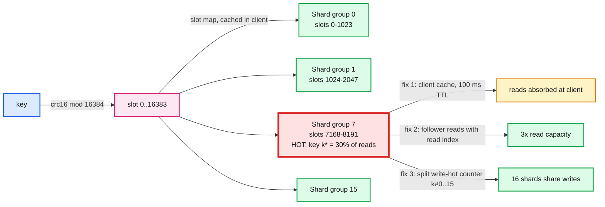

## D11. Failure mode map

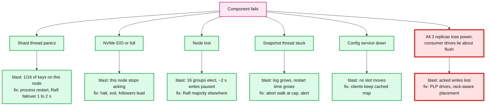

## D12. Rollout / migration

From "Redis with AOF everysec and async replicas" to this store, with a rollback point per phase.

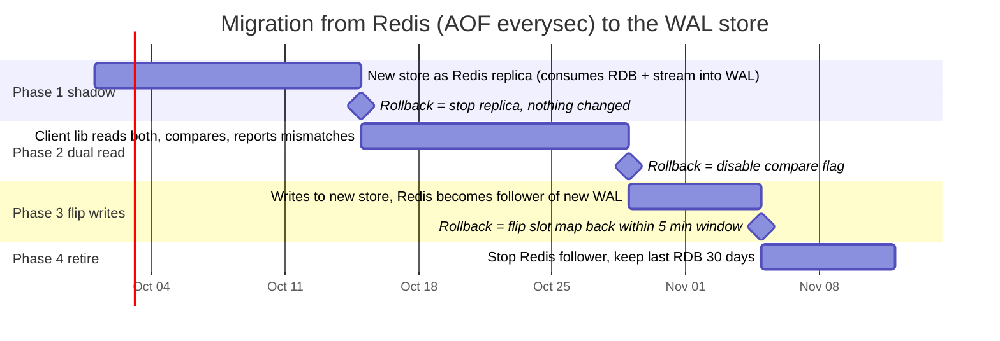
