# HLD: In-memory key-value store with a write-ahead log

> One-line answer: split the keyspace into N shared-nothing shards inside one process, one thread per shard owning a hash map and its own segmented, checksummed write-ahead log (WAL); every write is appended to the log, group-committed with one `fdatasync` per batch, and becomes visible and acked only when its log sequence number (LSN) is durable. Fuzzy per-shard snapshots keep the log and the restart time bounded. The same per-shard log, replicated with Raft, is what turns "survives a process crash" into "survives losing the machine".

Sources this follows: RocksDB WAL and write-path wikis, Redis persistence and latency docs, etcd storage docs, the Bitcask paper, LWN "Ensuring data reaches disk", the PostgreSQL fsync-errors wiki. Raw notes with links in [`research/`](research/). Diagrams D1 to D12 are in [`diagrams.md`](diagrams.md).

---

## 1. Understanding the problem

Interviewer's framing (Databricks, per candidate reports): "Design a durable key-value store with `put`, `get`, `delete`. Achieve durability with a write-ahead log, lay out the on-disk data structures, perform crash recovery. Single machine only. Write pseudocode." They do not want boxes. They want the exact sequence of syscalls between `put` and `ack`, what happens if the process dies at each step, and how you keep that fast. Expect 30 to 50 minutes on one machine before anyone says "replica", and be ready to write the write path and the recovery loop as pseudocode (both are in [`deep-dives/crash-recovery-and-snapshots.md`](deep-dives/crash-recovery-and-snapshots.md) §6).

### 1.1 Functional requirements

Core:
1. **`put(key, value)`, `get(key)`, `delete(key)`** on opaque bytes. Keys up to 1 KB, values up to 1 MB.
2. **Acknowledged writes are durable.** After the client sees the ack, a crash, kill -9, or power loss on that node does not lose the write.
3. **Restart recovers by itself.** The process comes back to a consistent state from local disk, with no operator step, in bounded time.
4. **Concurrent clients, per-key linearizable.** Many readers and writers. Each key behaves as if there is a single copy with one total order. Single-key atomic ops (`cas`, `incr`) included.

Below the line (say it out loud):
- Range scans. A hash index is enough for the stated API. Section 10.11 says what changes.
- Cross-shard multi-key transactions. Single-shard multi-key via hash tags only.
- Data larger than RAM. Spilling is the 10x evolution, not the design.
- Secondary indexes, queries, pub/sub, complex data types.

### 1.2 Non-functional requirements

Ask for scale first. Numbers assumed for one node:

| Dimension | Core target | Below the line |
|---|---|---|
| Data | 200 M keys, 32 B mean key, 200 B mean value, ~60 GB live | 1 TB per node (spill to NVMe, §10.11) |
| Throughput | 200 k writes/s, 800 k reads/s peak. Avg is 1/5 of that | 5 M ops/s (Dragonfly class) |
| Latency | get p99 < 1 ms, put p99 < 5 ms including durable commit | |
| Durability | **Zero acknowledged writes lost on process crash or power loss** | RPO 0 on node loss (§5.4) |
| Recovery | Restart to serving < 2 min for 60 GB | |
| Consistency | **Linearizable per key**. Read-your-writes preserved across failover | |
| Availability | 99.9% single node; 99.99% with replication, failover < 10 s | multi-region |
| Memory | Live data + log buffers + one in-flight snapshot ≤ 2x live | |

The durability row and the latency row fight each other. A durable write needs the disk to say yes. The disk says yes in 0.05 to 1 ms and only a few thousand times per second if you ask one write at a time. The whole design is about resolving that fight.

---

## 2. Back-of-envelope

```
Keys              = 200 M
Entry in memory   = key 32 B + value 200 B + entry overhead ~64 B (hash node, lsn, pointers) = ~300 B
Live memory       = 200 M x 300 B = 60 GB. Box: 128 GB RAM, 32 vCPU, 2 x 1.9 TB NVMe.

Writes            = 200 k/s peak, 40 k/s avg
WAL record        = header 20 B (crc 4, len 4, type 1, lsn 8, ...) + key 32 + value 200 = ~250 B
WAL rate          = 200 k/s x 250 B = 50 MB/s peak, 10 MB/s avg -> 0.9 TB/day avg, 4.3 TB/day if peak all day
Segment           = 256 MB per shard -> a new segment every ~80 s per shard at peak (one every ~5 s node-wide). fallocate'd, one dir fsync per segment.

fsync             = enterprise NVMe with power-loss protection: 20 to 100 us. Consumer NVMe: 0.4 to 2 ms. Cloud EBS gp3: 1 to 3 ms.
                    Plan for 0.5 ms so the design also works on the worse disk.
Unbatched         = 1 fsync per write -> 2,000 writes/s. 100x short of 200 k/s. Batching is mandatory.
Group commit      = 16 shards -> 12.5 k writes/s per shard at peak
                    fsync in flight 0.5 ms -> ~6 writes per group at peak, 2 groups pipelined
                    added latency per write <= 1 fsync wait + 1 queue wait = ~1 ms. put p99 budget 5 ms holds.
fsync/s per disk  = 16 shards x ~2,000 fsync/s = 32 k fsync/s worst case. NVMe handles it; EBS gp3 (16 k IOPS baseline) does not.
                    On EBS, cap group frequency: max 1 fsync per shard per 1 ms -> 16 k fsync/s, groups of ~12.

Reads             = 800 k/s / 16 shards = 50 k/s per shard thread
                    hash lookup with 2 cache misses ~ 0.5 to 1 us -> 5% of a core. The shard thread is not the bottleneck.
Network           = 1 M ops/s x ~300 B = 300 MB/s = 2.4 Gbps. Fine on 25 Gbps.
                    Syscalls: 1 M small ops/s needs batching (pipelined clients, io_uring, or epoll with readv). Budget 4 to 8 I/O threads.

Snapshot          = every 10 min, per shard, staggered. 60 GB / 16 = 3.75 GB per shard at ~1 GB/s serialize = ~4 s per shard, no pause.
Log kept          = 2 snapshots worth = 20 min x 50 MB/s = 60 GB worst case. Disk: 2 x 60 GB snapshots + 60 GB log = 180 GB. Fine.

Restart           = per shard in parallel: load 3.75 GB snapshot at 1 GB/s = 4 s
                    + replay <= 10 min of that shard's log: 600 s x 3 MB/s = 1.9 GB at 500 MB/s (apply bound) = 4 s
                    = ~10 s per shard, 16 in parallel, disk read 60 GB at 3 GB/s = 20 s -> ~30 s total. Budget 120 s holds.
                    Without snapshots: 4.3 TB/day of log -> hours. This is the number that forces snapshots.

Memory ceiling    = live 60 GB + log buffers (16 x 2 x 4 MB) + snapshot overhead (versions of keys written during ~4 s: 12.5 k/s x 4 s x 300 B = 15 MB per shard)
                    = ~61 GB. Fits 2x with room. fork() based snapshot could go to 120 GB in the worst case; that is why we do not fork.
```

Implications:
- fsync is the one hard wall. Everything on the write path is arranged around amortizing it.
- The log grows faster than any restart budget. Snapshots are not optional.
- One node has CPU to spare. The design must not waste it on locks.

---

## 3. The set-up

Product-style: an API other engineers program against, exposed by a client library.

### 3.1 Core entities

- **Entry**: `key -> (value, lsn, prev)`. `lsn` is the log position of the write that produced this value. `prev` is an older version kept only while a snapshot or the durability watermark still needs it.
- **Shard**: owns a contiguous set of hash slots, one map, one WAL, one thread. `shard = hash(key) % N` on a single node, `slot = crc16(key) % 16384` once clustered (§5.6).
- **WAL record**: `(crc32c, length, type, lsn, key, value)`. Types: `PUT`, `DEL`, `CAS_RESULT` (physical result of a `cas` or `incr`), `EXPIRE`, `NOOP`.
- **Segment**: a preallocated 256 MB file, `wal-<shard>-<first_lsn>.log`. Sealed when full.
- **Snapshot**: `snap-<shard>-<lsn>.bin`. A serialized map as of `lsn`, plus a footer with count and checksum.
- **Manifest**: per shard, `(current snapshot lsn, first live segment, durable lsn hint)`. Written with write-temp + fsync + rename + dir fsync.

### 3.2 API

All calls carry a `request_id` so a retried write is idempotent (§10.5).

| Call | Args | Returns | Semantics |
|---|---|---|---|
| `put(key, value, [ttl])` | bytes, bytes, seconds | `lsn` | Durable when returned |
| `get(key)` | bytes | `value` or `NOT_FOUND` | Linearizable: reflects every acked write to that key |
| `delete(key)` | bytes | `lsn` | Durable tombstone |
| `cas(key, expected, value)` | bytes, bytes or `ABSENT`, bytes | `OK` or `MISMATCH(current)` | Atomic per key |
| `incr(key, delta)` | bytes, int64 | new value | Atomic per key |
| `mput({k: v})` | same-shard keys only | `lsn` | Atomic within one shard, rejected across shards |

Internal (not for users): `Replica.append(lsn, batch)`, `Replica.snapshot(lsn)`, `Admin.checkpoint(shard)`, `Admin.migrate_slot(slot, to)`.

### 3.3 Data model

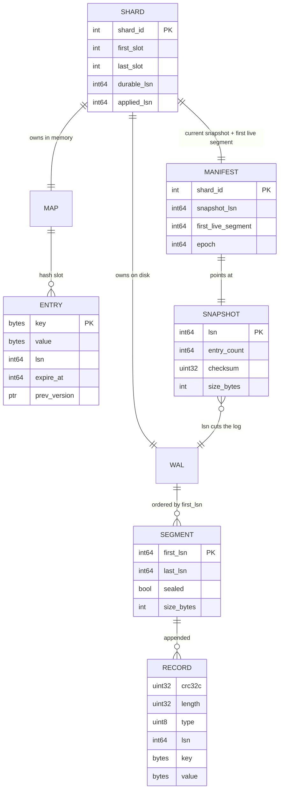

Access patterns:
- `get`: hash → shard → map lookup → return newest version with `lsn ≤ durable_lsn`. O(1), no disk.
- `put`: hash → shard → append record → apply to map with new `lsn` → wait for `durable_lsn ≥ lsn` → ack.
- Recovery: manifest → snapshot → segments with `first_lsn > snapshot_lsn` in order → truncate torn tail.
- Truncation: delete segments with `last_lsn ≤ snapshot_lsn` (and ≤ every replica's acked lsn).

Partition key: `hash(key)`. Chosen because there are no range queries and because it spreads any key distribution evenly across shard threads. Range needs would flip this to range partitioning with an ordered index (§10.11).

---

## 4. High-level design

### 4.1 Serve `put`, `get`, `delete` from memory at ~1 M ops/s

**Bad: one hash map behind one mutex.**
- Approach: `std::unordered_map` guarded by a lock, a thread pool of request handlers.
- Why it breaks: 1 M ops/s means a lock handoff every microsecond. Cross-core cache-line bouncing on the mutex costs 50 to 100 ns per handoff plus contention. Above ~200 k ops/s the threads spend more time waiting than working. Also a resize of a 200 M entry table under the lock stalls everything for seconds.

**Good: a concurrent hash map with striped locks, many worker threads.**
- Approach: 4,096 lock stripes, or a lock-free table. Any thread serves any key.
- Cost: works to ~1 M ops/s, but every write still has to be serialized into one WAL. That single append point (a mutex plus a sequence counter) becomes the new hot lock. Readers pay for cache-line traffic on entries written by other cores. Resize is still a global event.

**Great: shared-nothing shards, one thread per shard.**
- Approach: N = 16 shard threads (leave cores for I/O). `hash(key) % 16` picks the thread. That thread owns its map, its WAL, its snapshot state. I/O threads parse requests and hand them over via a per-shard single-producer queue. No lock on the data path. This is Dragonfly's and ScyllaDB's model, not Redis's single loop.
- Challenges: a hot key pins one core (§5.6); a cross-shard `mput` is impossible without coordination (we reject it); one slow shard, for example one doing a big-value write, delays only its own keys, which is a feature.

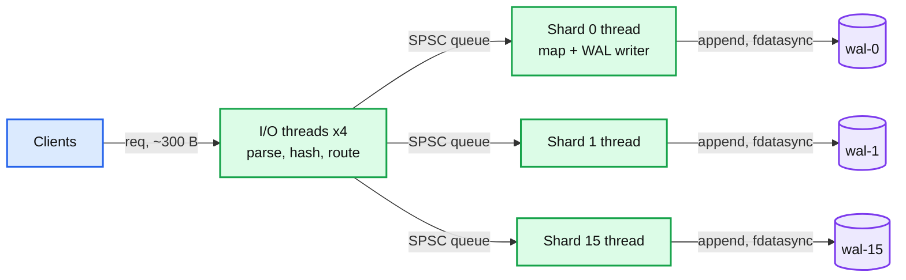

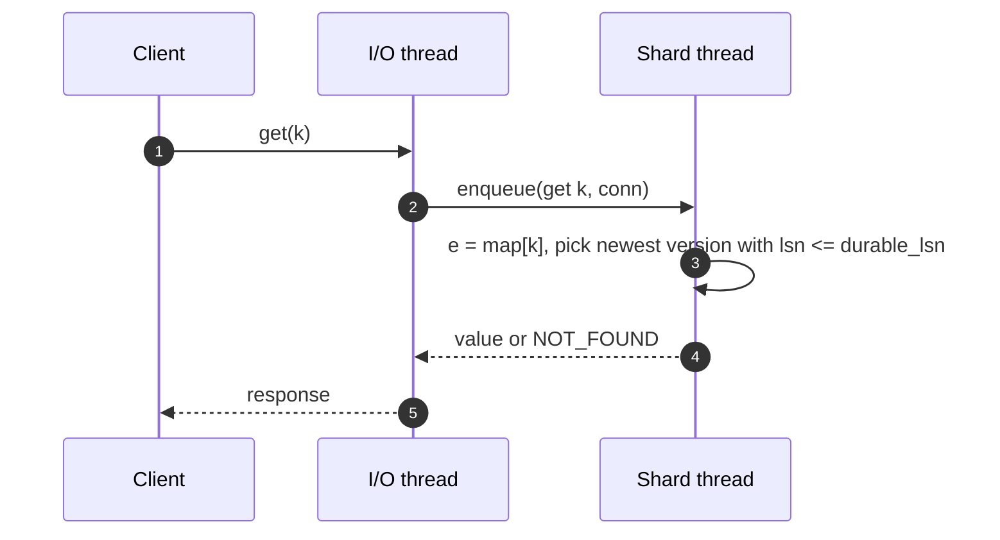

### 4.2 Make an acknowledged write survive a crash

**Bad: fsync the whole map, or fsync every record.**
- Approach A: write the map to disk after each change. 60 GB per write. Absurd, but candidates say "persist the state".
- Approach B: append the record and `fsync` before every ack. Correct and simple.
- Why B breaks: one fsync at a time on a consumer NVMe is 0.5 ms, so 2,000 writes/s. Even at 50 us on an enterprise drive it is 20 k/s. Target is 200 k/s. And the shard thread blocks for the whole fsync, so reads stall too.

**Good: one WAL, group commit.**
- Approach: writers append into a shared buffer; a leader thread issues one `write()` + `fdatasync()` for everything that arrived while the previous fsync was in flight, then acks all of them. At 0.5 ms per fsync and 200 k arrivals/s, each group holds ~100 records and the added latency is under 1 ms. This is Postgres, InnoDB, RocksDB.
- Cost: every shard thread hands its records to the one log leader. That handoff and the global LSN counter are a serialization point around 1 M records/s, and the single log is also a single replication stream, which makes later sharding harder.

**Great: one WAL per shard, pipelined group commit, visibility at the durable watermark.**
- Approach: each shard thread appends records to its own in-memory log buffer and applies them to its map immediately, tagged with the LSN. A per-shard log writer (or `io_uring` submission from the shard thread) writes and `fdatasync`s the buffer while the next buffer fills. When the sync returns, `durable_lsn` advances and every pending response with `lsn ≤ durable_lsn` is sent. Readers only see versions with `lsn ≤ durable_lsn`, so nobody observes a write that could still vanish.
- Order: **append to log buffer → apply to map → fdatasync → advance watermark → ack**. The map is ahead of the disk, visibility is not.
- Challenges: two versions per entry live briefly (memory, §5.5); a read of a key with an in-flight write returns the old value, which is correct because the write is not acked; an fsync error must halt the shard, not be retried (§5.1, fsyncgate).

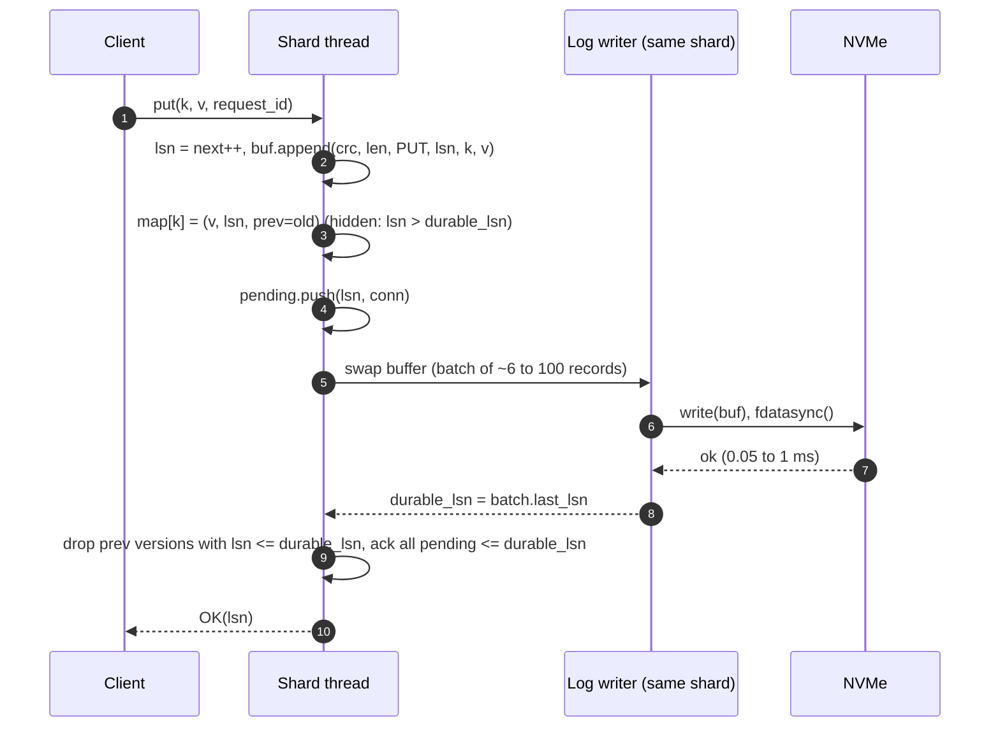

### 4.3 Restart recovers on its own, in bounded time

**Bad: replay the entire WAL from the beginning.**
- Approach: on start, read every segment, apply every record.
- Why it breaks: 0.9 to 4.3 TB of log per day. At 500 MB/s that is 30 min to 2.4 h per day of uptime, and it grows forever. Disk fills up too.

**Good: stop-the-world snapshot per shard, then truncate.**
- Approach: every 10 min the shard thread stops serving, serializes its 3.75 GB map to `snap-<lsn>.tmp`, fsyncs, renames, fsyncs the directory, updates the manifest, deletes segments with `last_lsn ≤ snapshot lsn`.
- Cost: ~4 s of stall per shard every 10 min. p99 is destroyed for that shard. Staggering shards helps availability but not p99. `fork()` and copy-on-write (Redis BGSAVE) is the classic dodge: pause is only the page-table copy, roughly 10 to 20 ms per GB on a modern VM, so 3.75 GB fork pauses ~50 ms and 60 GB in one process ~1 s; memory can double under write load, and transparent huge pages make it far worse.

**Great: fuzzy snapshot from entry versions, no pause, no fork.**
- Approach: the shard thread marks `snap_lsn = applied_lsn` and flips a flag. From then on any write to an entry with `lsn ≤ snap_lsn` keeps the old version in `prev` instead of freeing it. A snapshot thread walks the table and writes, for every entry, the newest version with `lsn ≤ snap_lsn`. Table growth (rehash) is paused during the walk, as Redis pauses rehash while a child exists. When the walk finishes, the flag flips back, `prev` pointers are released lazily on next touch or by a sweep, the file is fsynced, renamed, dir-fsynced, the manifest updated, and old segments deleted.
- Recovery = newest complete snapshot + replay of records with `lsn > snap_lsn`, skipping anything with a bad CRC at the tail. Replay of a `PUT` or `DEL` twice is harmless; `cas` and `incr` are logged as their physical result (`CAS_RESULT lsn key new_value`) so replay never re-evaluates them.
- Challenges: memory for retained versions is bounded by writes during the walk (tens of MB per shard, §2); the walker reads a table another thread mutates, so per-bucket seqlocks or an epoch scheme are required; snapshot at LSN S is only usable once `durable_lsn ≥ S`, which is milliseconds later.

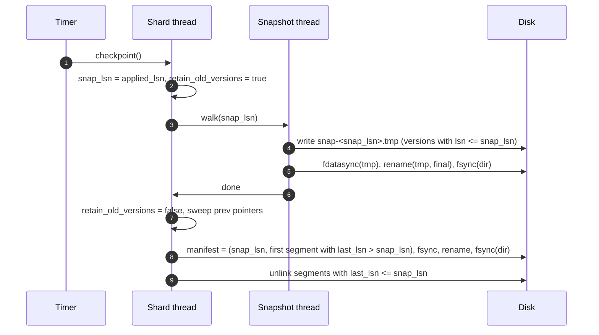

### 4.4 Per-key linearizability with concurrent clients and atomic ops

**Bad: apply to memory, ack, log later.**
- Approach: Redis with `appendfsync everysec`. Fast, simple.
- Why it breaks: an acked write can be lost for up to 2 s. A reader can observe a value that then disappears after a crash. That is neither durable nor linearizable across the crash.

**Good: apply only after fsync.**
- Approach: buffer the record, fsync, then apply and ack. Nothing unacked is ever in the map.
- Cost: `cas` and `incr` must be evaluated at apply time, so the client gets the result one fsync later and the shard thread must re-run the logic on the apply path. Two writes to the same key in one batch have to be ordered again at apply time. Simple but the apply path becomes the place where logic lives.

**Great: apply at once, publish at the watermark, log physical results.**
- Approach (the §4.2 model): the shard thread is the single writer for its keys, so it evaluates `cas` against the newest version in memory, including unacked ones, and writes the physical outcome to the log. Two concurrent writers to one key are ordered by the shard thread's queue; the second sees the first's value. LSN order equals apply order equals log order, by construction, because one thread does all three. Readers see the newest version with `lsn ≤ durable_lsn`.
- Linearization point of a write: the instant `durable_lsn` passes its LSN. Linearization point of a read: the map lookup. Both on one thread, so the order is total.
- Challenges: a `cas` that succeeded against an unacked write, whose batch then fails to fsync, must fail too. Since a fsync failure halts the shard and the process restarts from the log, both writes are gone together, which is consistent. A read after a failed ack (client timeout) may see the value or not; the client retries with `request_id` (§10.5).

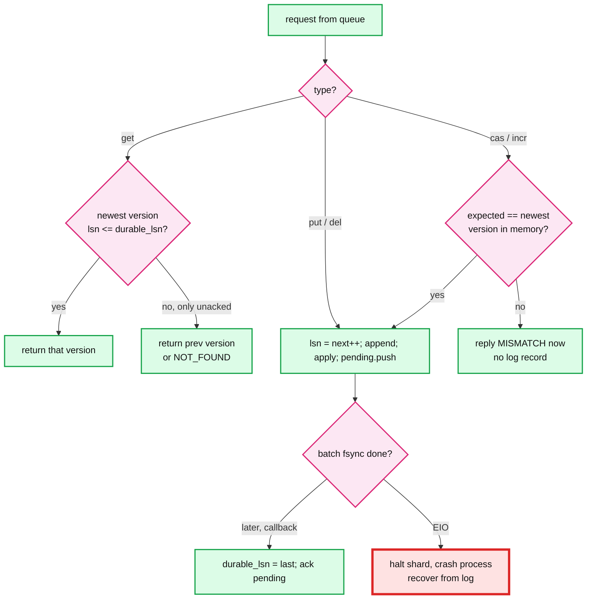

---

## 5. Deep dives

### 5.1 "How do you get put p99 under 5 ms at 200 k writes/s when every write must hit the disk?"

Walk the write path: I/O thread parse (~5 us) → shard queue (~1 us) → append and apply (~1 us) → **fsync (50 us to 2 ms)** → ack. The disk is the only slow step, and it is red.

**Bad: fsync per write.** 2,000 writes/s on consumer NVMe. Dead on arrival.

**Good: group commit, one log.** Throughput = group size × fsync rate. At 0.5 ms fsync and 200 k arrivals/s the natural group is ~100 records and the add-on latency is ≤ 1 ms (wait for the current fsync) + ≤ 0.5 ms (your own fsync). The single log leader is the residual bottleneck: one thread doing `memcpy` + `write()` of 50 MB/s is fine, but the mutex handoff of 200 k records/s from 16 shard threads to one leader is ~20% of a core spent on cache-line transfers and it forbids per-shard replication later.

**Great: per-shard log, two buffers in flight, disk-aware batching.**
- Per shard at peak: 12.5 k records/s. One fsync in flight while the next buffer fills. Group size self-tunes to the disk: fast disk, small groups, low latency; slow disk, big groups, same throughput. Add a floor: never fsync more often than every 200 us so an idle-ish shard on a slow disk still batches.
- Numbers: 16 shards × 2,000 fsync/s = 32 k fsync/s worst case. A datacenter NVMe with power-loss protection does 100 k+ sync writes/s. EBS gp3 does 16 k IOPS baseline, so on EBS raise the floor to 1 ms and accept groups of ~12.
- Push back on the textbook: "use O_DIRECT for the log" is not the win it sounds like. O_DIRECT skips the page cache but does not skip the drive's volatile cache; you still need `fdatasync` or FUA for durability, and you lose the kernel's write coalescing. Preallocate with `fallocate`, append with buffered `write()`, `fdatasync` (not `fsync`, to skip the mtime inode update), and `fsync` the directory once per new segment. That is what RocksDB and etcd do.
- What the disk promises: `fdatasync` returns when the data and the file size are on stable storage, which means the kernel sent a FLUSH or FUA to the drive. A consumer drive without capacitors can still lie. Enterprise drives with power-loss protection make fsync cheap because the flush is a no-op.
- fsyncgate: if `fdatasync` returns `EIO`, the kernel may have already dropped the dirty pages and the next call will return success. Retrying is wrong. Treat it as fatal for the shard: stop acking, crash the process, recover from the log (which ends at the last good record), and let replication or the operator deal with the disk.

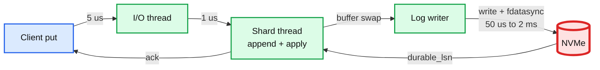

Deep dive: [`deep-dives/wal-format-and-fsync.md`](deep-dives/wal-format-and-fsync.md).

### 5.2 "How do you restart in under 2 minutes with 60 GB of state?"

**Bad: replay the whole log.** Hours, and unbounded.

**Good: periodic full snapshot, replay the tail.** Restart = snapshot load + replay since snapshot. With a 10 min interval, the tail is ≤ 10 min of writes. But loading 60 GB serially at 1 GB/s is 60 s and replaying up to 30 GB of log serially is another 60 s. Right at the budget with no margin.

**Great: per-shard snapshots and logs, parallel recovery, cheap replay.**
- 16 shards recover in parallel. Each loads 3.75 GB and replays ≤ 1.9 GB. ~10 s per shard, ~30 s wall clock, bounded by disk read bandwidth (60 GB at 3 GB/s = 20 s).
- Snapshot format is the in-memory layout, not a re-encoded command stream: load is a `memcpy` plus hash-insert, not command parsing. Redis learned this: RDB loads several times faster than AOF replay because AOF re-executes commands.
- Replay is idempotent: records carry their LSN, the snapshot carries `snap_lsn`, anything `≤ snap_lsn` is skipped, `PUT`/`DEL` overwrite, `cas`/`incr` are stored as physical results. Crash during recovery just restarts recovery.
- Torn tail: the last segment may end mid-record. CRC mismatch or a length that runs past the segment means "stop here". This is `kTolerateCorruptedTailRecords` in RocksDB terms. A bad CRC in the **middle** of the log with valid records after it is not a torn write, it is corruption, and the shard must refuse to start rather than silently skip (`kAbsoluteConsistency` for the body, tolerate for the tail).
- Serve reads before all shards finish? No. A partially recovered node answering `NOT_FOUND` for a key that exists is a consistency bug. Report `RECOVERING` and let clients go to the replica.
- Push back on the textbook: "snapshot every N minutes" is the wrong knob. Snapshot when the log since the last snapshot exceeds a byte budget derived from the restart SLO (`replay_budget_s × replay_MB_per_s`). A quiet shard never snapshots; a hot shard snapshots every few minutes.

Deep dive: [`deep-dives/crash-recovery-and-snapshots.md`](deep-dives/crash-recovery-and-snapshots.md).

### 5.3 "How do you serve 800 k reads/s at p99 under 1 ms while writes, snapshots, and resizes are happening?"

**Bad: one event loop for everything (plain Redis).** ~150 k simple ops/s on one core. Any O(N) command, a 1 MB value copy, a `fork()`, or a rehash step stalls every client.

**Good: single loop plus I/O threads (Redis 6+), plus fork-based snapshots.** Network parsing parallelizes, execution does not. Still one core for the data path, still fork pauses of ~0.5 to 1 s on 60 GB, still 2x memory risk under write load.

**Great: shared-nothing shards plus the fuzzy snapshot from §4.3, plus bounded work per request.**
- Reads never take a lock. The shard thread does a hash lookup and a watermark compare. No fsync on the read path. The p99 tail comes from: queueing behind a big write on the same shard, a rehash step, or CPU contention with the log writer. Mitigate each: cap value size at 1 MB and copy it off-thread onto the socket; incremental rehash moves one bucket per operation plus 1 ms per 100 ms in the background, growth paused during a snapshot walk; pin shard threads and log writers to separate cores.
- Transparent huge pages off. With THP on, one byte written during a snapshot walk in a fork-based design copies 2 MB. We do not fork, but THP also inflates RSS accounting and causes compaction stalls. `madvise` only.
- Snapshot walk reads the table concurrently: per-bucket seqlock, writer increments before and after a mutation, reader retries on odd or changed. Cost on the writer: two atomic increments. Cost on the reader: near zero unless it collides with a write on the same bucket.

Deep dive: [`deep-dives/concurrency-model.md`](deep-dives/concurrency-model.md).

### 5.4 "The machine dies. Make the ack mean the write survives that. Now stop the old primary from acking after failover."

**Bad: async WAL shipping (Redis replication, Postgres `synchronous_commit = off` to the standby).** Primary acks after local fsync, streams the log to replicas. On primary loss, everything past the replica's position is gone: typically tens of ms to seconds of acked writes. Redis `WAIT` does not fix it; it waits for replicas to have the bytes in memory, not on disk, and Redis still acked the client already.

**Good: semi-synchronous.** Primary acks after local fsync **and** one replica confirms it fsynced (MySQL lossless semi-sync, Postgres `synchronous_commit = on` with one sync standby). RPO 0 if the sync replica survives. Failover is manual or via an external coordinator (Sentinel-like), 10 to 30 s, and the coordinator must fence the old primary or you get two acking primaries.

**Great: Raft per shard. The WAL is the Raft log.**
- Each shard is a 3-node Raft group. The record we already write is the log entry. Leader appends locally and to 2 followers in parallel, commits when 2 of 3 have fsynced, then applies and acks. `durable_lsn` becomes `commit_index`. Nothing else in the design changes.
- Cost: +1 in-DC RTT (0.1 to 0.5 ms) and the slower of two fsyncs, so put p99 goes from ~2 ms to ~3 ms. Still under 5 ms. 3x memory and disk across the fleet.
- Fencing is built in: every entry carries a term; a follower rejects entries from a leader with an old term; an old leader cannot commit because it cannot reach a majority. Clients that still talk to it get `NOT_LEADER`. Reads on the leader need a lease or a heartbeat quorum check so a deposed leader does not serve stale data.
- Failover: election timeout 1 s (etcd default), election ~100 ms, so ~1 to 2 s of unavailability for that shard's writes. Under the 10 s target with room.
- Push back on the textbook: "3 replicas per shard means 3x cost" is true, but "put every shard on Raft" is not the same as "run etcd". etcd's bbolt backend and 8 GB size guidance are for a small config store. We keep our own memory state machine and only borrow the log replication and election. Multi-Raft (TiKV) is the reference: 16 groups per node, one heartbeat batch per peer pair.

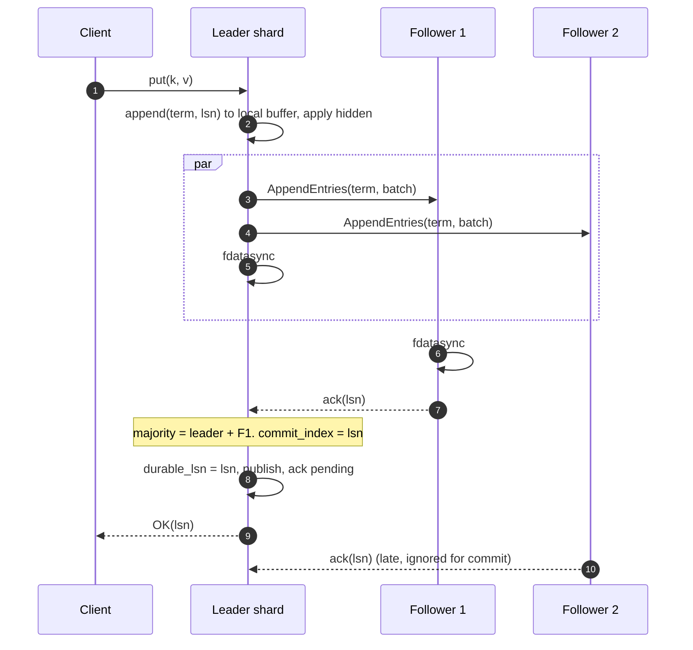

Deep dive: [`deep-dives/replication-and-failover.md`](deep-dives/replication-and-failover.md).

### 5.5 "Memory: live data plus buffers plus snapshot must stay under 2x. What blows it?"

- Baseline: 60 GB live. Log buffers: 16 shards × 2 × 4 MB = 128 MB. Retained versions during a 4 s snapshot walk: ~15 MB per shard. Total ~61 GB. The 2x budget exists because a fork-based design needs it; ours does not, and that is the argument for the version-based snapshot.
- What blows it: (1) a rehash doubles the bucket array for that shard: 200 M / 16 = 12.5 M buckets × 8 B = 100 MB per shard, fine; (2) allocator fragmentation after churn: jemalloc fragmentation ratio 1.3 to 1.5 is common, so plan RSS at 1.5x live and run background defragmentation; (3) a snapshot walk that never finishes (slow disk) retains versions forever: cap the walk duration and abort.
- When memory is full: this is a store, not a cache. Reject writes with `OUT_OF_MEMORY` at a 90% watermark, keep serving reads and deletes, alert. Never evict silently; that turns "durable" into "sometimes".

### 5.6 "60 GB is not enough. Shard across machines. Then a hot key, then a two-key write."

- **Placement**: 16,384 hash slots (Redis Cluster's number, small enough for a bitmap per node, large enough for smooth rebalancing). A slot map lives in a small Raft-backed config service and is cached by clients. Client hashes the key, looks up the slot owner, sends directly. Wrong owner replies `MOVED slot node` and the client refreshes.
- **Resharding with live traffic**: a slot moves as a state machine: `STABLE → MIGRATING (source) / IMPORTING (target)`. The source snapshots the slot's entries, streams them plus the slot's log tail to the target, then hands over the slot in one config-service write. During migration, reads and writes go to the source; keys already moved are answered with `ASK` and the client retries on the target. Handover cuts over at a single LSN so no write is lost or duplicated.
- **Hot key**: 30% of traffic on one key means 300 k reads/s on one shard thread. A shard thread does ~1 M lookups/s, so it survives reads, but the network for that node does not if the value is large, and writes at that rate serialize on one Raft group. Mitigations in order of cost: (1) client-side cache with a 100 ms TTL for read-hot keys, which removes almost all of the load; (2) follower reads for that slot, accepting bounded staleness or using a read index; (3) for write-hot counters, split into `key#0..key#15` and sum on read. Detect with a per-shard top-k sketch reported every second.
- **Multi-key**: `mput` on keys in one slot is atomic for free (single thread, one log batch). Hash tags (`{user:42}:balance`, `{user:42}:orders`) let the client force co-location. Across slots, we say no. If the interviewer insists: 2PC over the two shards with the coordinator's decision logged first, which doubles latency and adds a blocking failure mode. Say what it costs and that it is a different product (a transactional KV like TiKV).

Deep dive: [`deep-dives/sharding-and-hot-keys.md`](deep-dives/sharding-and-hot-keys.md).

---

## 6. Final design

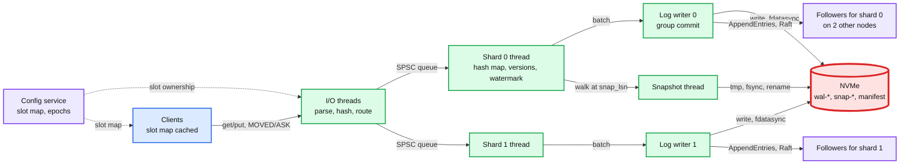

Zoom-ins: D9 deployment, D10 partitioning, D11 failure map in [`diagrams.md`](diagrams.md).

---

## 7. Trade-offs

| Decision | Option A | Option B | Chose | Why |
|---|---|---|---|---|
| Threading | Single event loop (Redis) | Shared-nothing shards | B | 1 M ops/s needs more than one core; no locks; a slow op hurts one shard only. Cost: no cross-shard atomicity |
| Log layout | One WAL per node | One WAL per shard | B | Removes the single append point; each log is a replication stream. Cost: 16x the fsyncs, no global order |
| Visibility | Apply after fsync | Apply now, publish at watermark | B | `cas` evaluates in memory without a second pass; reads never block on disk. Cost: one extra version pointer per entry |
| Log content | Logical (`incr k 1`) | Physical result (`k = 43`) | B | Replay is idempotent without tracking which records applied |
| Snapshot | `fork()` + copy-on-write | Retained versions + walk | B | No 2x memory cliff, no 1 s fork pause on 60 GB. Cost: seqlocks and paused rehash during the walk |
| fsync call | `fsync` | `fdatasync` on fallocate'd segments | B | Skips the inode mtime write; directory fsync only when a segment is created |
| fsync error | Retry | Crash the shard, recover from log | B | Kernel drops dirty pages on error; retry lies (fsyncgate) |
| Durability across nodes | Async shipping | Semi-sync | Raft per shard | Raft | RPO 0 with automatic fenced failover in ~1 to 2 s. Cost: +1 RTT, 3x storage |
| Full memory | Evict LRU | Reject writes | B | It is a store. Eviction silently breaks the durability promise |
| Placement | Consistent hash ring | 16,384 fixed slots | B | Slot ownership is an explicit, migratable unit; the ring hides where data is |
| Cross-shard txn | 2PC | Refuse, offer hash tags | B | 2PC doubles write latency and adds a blocking coordinator. Different product |

What we refused to build: range scans, cross-shard transactions, eviction, disk spill, multi-region active-active. Each is named in §10.11 with its seam.

---

## 8. Staff-level notes

- **Failure modes and blast radius.** One shard's disk error halts that shard's writes only; its Raft followers take over within ~2 s. A snapshot thread crash loses nothing (the tmp file is garbage, the log is intact). A config service outage freezes slot moves but not traffic, because clients cache the map. The worst case is a **correlated fsync lie**: consumer drives without power-loss protection across all three replicas in one rack losing power at once. Mitigation: rack-aware placement of Raft members and enterprise drives; say this out loud.
- **Migration path.** From "Redis with AOF everysec": run the new store as a Redis-protocol-compatible replica of the old primary (consume its replication stream into the new WAL), dual-read to compare, flip writes with a 5-minute rollback window where the old primary is kept as a follower of the new one. Rollback = flip the client slot map back.
- **Operability.** SLO: put p99 < 5 ms, get p99 < 1 ms, zero lost acked writes (measured by a canary writer that reads back after induced restarts). Pages at 3 am: `wal_fsync_p99 > 10 ms` for 2 min (disk dying), `shard_halted > 0`, `raft_leaderless_shards > 0` for 30 s, `log_bytes_since_snapshot > 3x budget` (snapshot stuck), `rss / live > 1.8`. Dashboards: fsync latency histogram, group size, durable minus applied LSN lag, snapshot age per shard, replication lag per follower.
- **Cost.** 128 GB RAM box with 2 NVMe: roughly $1.5 to 2.5 k/month cloud, 3x for Raft, so ~$6 k/month per 60 GB of user data. RAM is ~15x NVMe per GB, which is why the next step is tiering (§10.11), not bigger boxes. Eng time: single node with WAL and snapshots is a quarter for two engineers; Raft and slot migration are another two quarters. Use an existing Raft library.
- **Team boundaries.** Storage engine (shard thread, WAL, snapshot) is one team's code with a stable log format as the contract. Replication and cluster membership are a second layer that only sees `(term, lsn, bytes)`. Client library and slot map belong to the platform team. The log record format is the API between all three; version it from day one.

---

## 9. What is expected at each level

- **Mid (80/20 breadth/depth).** A hash map, a log file appended before the ack, fsync, replay on restart, snapshots so replay is short. Mentions Redis AOF and RDB. Does not know what fsync promises or why one fsync per write caps at 2 k/s.
- **Senior (60/40).** Group commit and its latency math. Snapshot without stopping writes (probably via fork), log truncation tied to snapshot LSN, torn-tail detection with CRC, idempotent replay. Threading model chosen deliberately. Replication as WAL shipping, and the data-loss window of async.
- **Staff+ (40/60).** All of the above unprompted, plus: the visibility watermark and why "apply then ack" without it is a dirty read; fsyncgate and crash-on-EIO; `fdatasync` vs `fsync` vs directory fsync; why fork's 2x memory and THP interaction rules it out at 60 GB and what replaces it; why the WAL and the Raft log are the same object and what fencing means for a deposed leader; the cost table for Raft vs semi-sync; hot-key mitigations with the specific numbers where each stops working; what was refused (cross-shard txn, eviction) and the seam for each.

---

## 10. Nitty-gritty (past interview scope)

### 10.1 Internals of each chosen technology

**WAL segment and record.** Follow RocksDB's layout: the file is a sequence of 32 KB blocks; a record is `crc32c(4) | length(2) | type(1) | payload`; a record that does not fit is split into `FIRST/MIDDLE/LAST` fragments; a block with < 7 bytes left is padded. Our payload = `lsn(8) | op(1) | key_len(2) | key | expire_at(8) | value`. CRC covers type + payload so a corrupted length cannot mislead the parser. Block alignment means a torn 4 KB write damages at most one block and the reader can resync at the next block boundary. etcd instead frames each record with an 8-byte length (56 bits length, 8 bits padding) and a protobuf `{type, crc, data}`; same idea, no blocks.

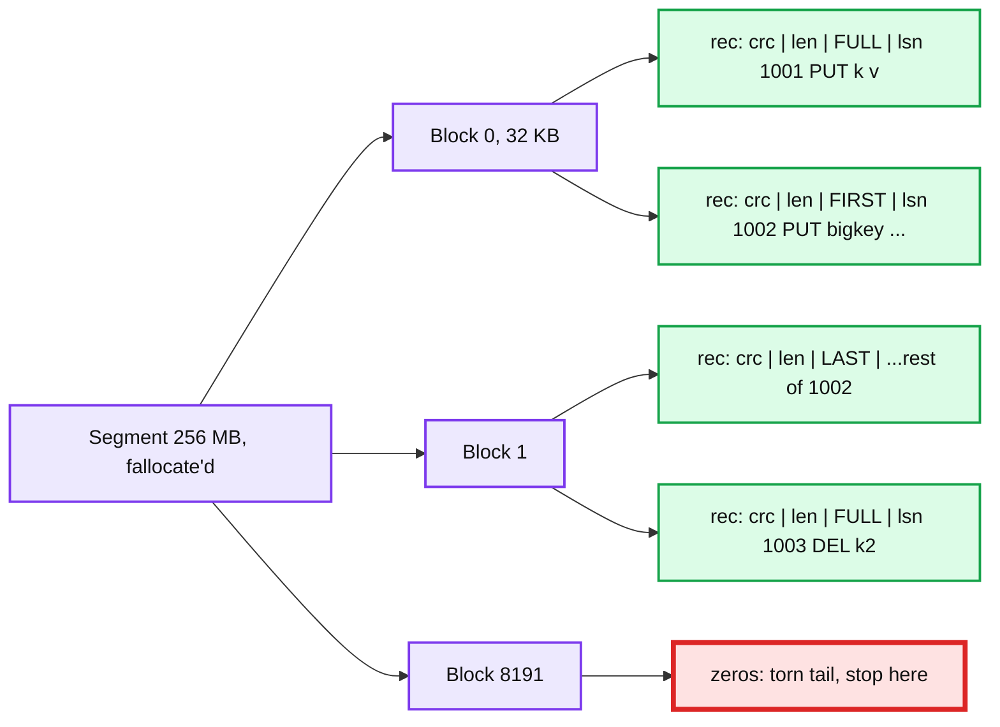

**Hash map.** Open hashing with chaining, power-of-two bucket array, incremental rehash: two tables during growth, one bucket moved per operation on the map plus a timed 1 ms step per 100 ms, lookups check both, inserts go to the new table, growth paused while a snapshot walk is active (Redis `dict` model). Entry = `{key_ptr, value_ptr, lsn, expire_at, prev_ptr, next_in_bucket}`. Overhead ~64 B per entry; a slab allocator for values under 512 B removes the per-value malloc header.

**Raft.** Log = our WAL with `term` added to the record header. Leader keeps `next_index`/`match_index` per follower; heartbeats every 100 ms batched across all 16 groups on a node pair (multi-Raft). Read path: leader lease (`election_timeout − clock drift`) so reads skip the quorum round trip. Snapshot transfer to a lagging follower uses the same `snap-<lsn>.bin` file. `commit_index` replaces `durable_lsn` as the watermark.

**Disk stack.** `fallocate(256 MB)` on segment creation, `fsync(dir)` once, buffered `pwrite`, `fdatasync`. The kernel issues a cache flush to the drive (`REQ_PREFLUSH`/FUA) on `fdatasync`. A drive with power-loss protection completes it in tens of microseconds; a consumer drive flushes its DRAM cache in ~0.5 to 2 ms.

### 10.2 Configuration knobs that matter

| Knob | Value | Why |
|---|---|---|
| Shards per node | 16 on 32 vCPU | Leave cores for I/O threads, log writers, snapshot thread |
| Segment size | 256 MB | One dir fsync per 5 s at peak; small enough that truncation frees space promptly |
| Group commit floor | 200 us NVMe, 1 ms EBS | Bounds fsync/s to what the device sustains |
| Max group bytes | 4 MB | Bounds latency for the last record in a group and memory per buffer |
| Snapshot trigger | log since snapshot > 2 GB per shard, or 10 min | Derived from restart budget: 2 GB at 500 MB/s = 4 s replay |
| Snapshots retained | 2 | Survive a corrupted latest snapshot |
| Recovery mode | tolerate torn tail, refuse mid-log corruption | The RocksDB `kPointInTimeRecovery` stance |
| Value size cap | 1 MB | One record per block group; bigger values stall the shard thread |
| Memory watermarks | reject writes at 90%, alert at 80% | Store, not cache |
| Raft election timeout | 1,000 ms; heartbeat 100 ms | etcd defaults; failover 1 to 2 s |
| THP | `never` or `madvise` | Avoid 2 MB copy amplification and compaction stalls |

### 10.3 Capacity math per component

| Component | Per unit | Limit | Headroom |
|---|---|---|---|
| Shard thread | 12.5 k writes/s + 50 k reads/s, ~1 us each = ~6% CPU | ~1 M ops/s | 15x |
| Log writer per shard | 3 MB/s, ~2,000 fsync/s at peak | NVMe ~100 k sync IOPS shared by 16 = 6 k each | 3x on NVMe, **0.5x on EBS gp3 without the floor** |
| NVMe bandwidth | 50 MB/s log + 100 MB/s snapshot bursts | 2 to 3 GB/s | 15x |
| I/O threads | 1 M ops/s ÷ 4 threads = 250 k syscalls/s each with batching | ~500 k/s per thread with io_uring | 2x |
| Memory | 61 GB used | 128 GB | 2x, fragmentation eats 0.5x |
| Disk space | 180 GB | 1.9 TB | 10x; log retention could grow to days |
| Raft network | 50 MB/s × 2 followers = 100 MB/s out | 25 Gbps | 30x |

Closest to its limit: the fsync rate on cloud block storage. That is the number to ask about first when the interviewer says "deploy on AWS".

### 10.4 Failure timeline

**Process crash mid-batch.**

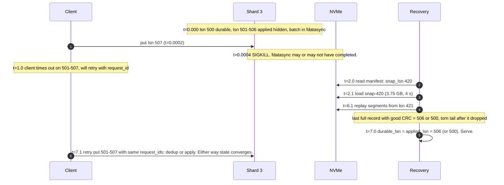

**Disk returns EIO on fdatasync.** t=0 EIO → shard 3 marks itself halted, stops acking, other shards unaffected → t=0.001 process exits deliberately (crash-only design) → t=1 Raft followers of all 16 groups notice missing heartbeats → t=2 elections complete, other nodes lead every group → clients get `NOT_LEADER`, refresh, retry → on-call page: `shard_halted` and `disk_errors` on that node; node is drained and the disk replaced. Data at risk: none; every acked write is on a majority.

**Snapshot thread stalls (slow disk).** t=0 walk starts → t=60 walk not finished, retained versions growing at 12.5 k/s × 300 B = 3.75 MB/s → t=300 cap hit: 1.1 GB retained, walk aborted, versions released, alert `snapshot_aborted` → log keeps growing, `log_bytes_since_snapshot` alert fires at 3x budget → on-call moves leadership off the node. Restart time is at risk, not data.

### 10.5 Exactly-once and idempotency end to end

- Where duplicates enter: client retry after timeout (the write may or may not have committed); Raft leader change with a client retry on the new leader; slot migration cutover where a write raced the handover.
- Dedup key: `(client_id, request_id)` stored in a per-shard table with the result and LSN, TTL 5 min, itself written to the log as part of the record so it survives crash and failover. A retry hits the table and returns the stored result.
- Why `cas` needs it: a `cas` that succeeded, whose ack was lost, will fail on retry with `MISMATCH` unless the dedup table returns the original `OK`. Without it, the client believes the write failed when it did not.
- Replay: records carry LSN; snapshot carries `snap_lsn`; records ≤ `snap_lsn` are skipped; physical logging makes any remaining double-apply harmless.
- Slot migration: source stops accepting writes for the slot at LSN X, ships the tail through X, target starts at X+1. Any write that arrived at the source after X gets `ASK` and is retried on the target with the same `request_id`.

### 10.6 Consistency model per edge

| Edge | Model | Note |
|---|---|---|
| Client → leader shard, `put`/`get` | Linearizable per key | Linearization point at watermark advance (write) or lookup (read) |
| Client → follower shard read | Bounded stale (optional) | Only if the client opts in; default is leader read with lease |
| Leader → follower log | Prefix-consistent, eventual | Followers may lag but never diverge |
| Shard → snapshot file | Consistent at `snap_lsn` | Point in time per shard, not across shards |
| Client → config service slot map | Eventual, self-correcting | `MOVED` fixes a stale map on the next request |
| Across shards, `mput` | None | Refused across shards; atomic within one |
| Old leader after partition | Fenced | Cannot commit, may serve stale reads for up to one lease if lease reads are used |

### 10.7 Alternatives rejected

| Alternative | Why it looked attractive | Why rejected |
|---|---|---|
| Redis as-is with AOF `always` | Zero build cost | Single core, fsync per command (Redis does batch in `always`, but one loop), fork snapshots, async replication |
| RocksDB as the engine | Battle-tested WAL, memtable, recovery | Designed for data larger than memory; block cache and SST reads on the path; we want a flat hash map and no compaction |
| `mmap` the data file and let the kernel persist | No explicit log | No ordering or atomicity guarantees; a crash leaves a torn mix of old and new pages; msync is fsync in disguise |
| Single global WAL | One order, simple replication | Single append point at 1 M/s and one replication stream for the whole node |
| `fork()` snapshots | Free CoW, proven in Redis | 60 GB fork pause ~1 s, up to 2x memory, THP amplification |
| Logical logging (`incr k 1`) | Smaller records | Non-idempotent replay; needs applied-LSN tracking per key |
| Chain replication | Strong consistency, reads at tail | Tail latency = chain length × fsync; needs an external master for reconfiguration |
| Dynamo-style quorum (N=3, W=2, R=2) | Always writable | Conflicting versions and vector clocks for a store that promised per-key linearizability |
| Consistent hash ring | Add a node with ~1/N movement | Slots give the same property with explicit, observable ownership and clean migration states |
| LSM / SSTables on disk | Handles data > RAM | Different problem; named in §10.11 as the spill design |

### 10.8 How the big companies do it

- **Redis**: single event loop, AOF (`always`/`everysec`/`no`) and RDB via `fork()`, Redis 7 multi-part AOF with a base RDB and incremental files plus a manifest, `WAITAOF` (7.2) for fsync acknowledgment. Async replication, Sentinel or Cluster failover in 15 to 30 s. Our design keeps the manifest idea and rejects fork and async.
- **Dragonfly**: shared-nothing shards, one thread per shard, io_uring, "dashtable" that grows one segment at a time instead of doubling; multi-key ops via a VLL-style transaction framework across shards. Snapshots are versioned per entry, which is the model we borrow.
- **RocksDB / LevelDB**: block-framed WAL with CRC32C, write group leader, pipelined write, `allow_concurrent_memtable_write`, four WAL recovery modes, WAL deleted only after the memtable it covers is flushed. We borrow the record format and the recovery stance.
- **etcd**: Raft log in preallocated 64 MB segments, bbolt for state, snapshot every `--snapshot-count` entries, `wal_fsync_duration_seconds` with a 10 ms p99 guideline. Our operability alerts copy this.
- **Bitcask (Riak)**: append-only files are the only store; the in-memory keydir maps key to file offset; merge rewrites live values; hint files speed restart. This is "in-memory index, on-disk values", the right shape for the disk-spill evolution.
- **TiKV / CockroachDB**: multi-Raft with one group per range, leader leases for reads, Percolator or parallel commits for cross-range transactions. What we would grow into if cross-shard transactions were required.
- **Meta memcache (NSDI '13)**: the opposite trade: no durability, leases to prevent thundering herds, gutter pools for failover. A reminder that "in-memory KV" at Meta means cache; ask the interviewer which they mean.

### 10.9 Operational runbook

- **Dashboards (5 metrics)**: `wal_fdatasync_seconds` histogram per shard; `group_commit_size` histogram; `applied_lsn − durable_lsn` per shard; `snapshot_age_seconds` and `log_bytes_since_snapshot` per shard; `raft_follower_lag_lsn` per group.
- **Alerts**: fsync p99 > 10 ms for 2 min → page storage on-call; `shard_halted > 0` → page; leaderless group > 30 s → page; `log_bytes_since_snapshot > 3x budget` → ticket, page if > 10x; `rss/live > 1.8` → ticket; canary lost-write detector → page immediately.
- **Rollout**: new binary must read the previous log and snapshot format. Canary one follower per node pair for 24 h, then followers fleet-wide, then transfer leadership onto upgraded nodes. Never upgrade a leader in place.
- **Rollback**: log format is versioned per record; a rollback binary must read the newer version or the node must be re-bootstrapped from a peer snapshot. Slot map changes are reversible through the config service. Backfill is never needed because the log is the source of truth.

### 10.10 Security and abuse

- Auth boundary at the I/O thread: mTLS between clients and nodes, per-tenant token checked before the request reaches a shard queue. Inter-node Raft traffic on a separate mTLS identity.
- Rate limits per client at the I/O thread, measured in bytes and ops, so one client cannot fill a shard's queue. Value size cap enforced at parse time, before allocation.
- A malicious client can: create hot keys (mitigated per §5.6), fill memory (rejected at the watermark, per-tenant quotas), replay old `request_id`s (dedup table returns the stored result, no state change). It cannot: read another tenant's keys (namespace prefix enforced by the token), bypass the log, or forge Raft entries.
- Encryption at rest: segments and snapshots encrypted with a per-node key from a KMS; the log format reserves a header field for the key id.

### 10.11 Evolution

- **10x data (1 TB per node)**: keep the hash index in memory (keys + 12 B offsets ≈ 90 GB for 2 B keys) and move values to the log itself, Bitcask-style, with a merge process to reclaim dead values. Reads become one NVMe read (~100 us). The seam is `Entry.value_ptr`: it becomes a `(segment, offset)` instead of a heap pointer. Everything else (WAL, snapshot of the index, Raft) stays.
- **10x throughput**: more shards per node and more nodes; the design is already shared-nothing. The first thing that breaks is the fsync rate per device, so add a second NVMe and split shards across devices.
- **Range scans**: replace the per-shard hash map with an ordered structure (ART or a skiplist) and switch placement from hash slots to key ranges with split/merge. The WAL and snapshot logic do not change; the slot map becomes a range map.
- **Multi-region**: do not stretch Raft groups across regions for a sub-ms store. Run one cluster per region, ship the per-shard log asynchronously to the other region, accept RPO of seconds, and fence on failover with the epoch in the config service.
- **GDPR delete**: a `DEL` is a tombstone in the log and absent from the next snapshot; segments containing the value are unlinked after the next snapshot, so the deletion becomes physical within one snapshot interval plus snapshot retention (≤ 30 min). Encrypt per tenant if crypto-shredding is required.
- **TTL at scale**: expiry is lazy on read plus an active sampler per shard; an `EXPIRE` record is logged when the sampler removes a key so replicas and replay agree. Replicas never expire on their own; they wait for the leader's record.

---

## 11. Follow-up questions to expect

1. "Walk me through `put` from syscall to ack." → §4.2, §5.1, [`deep-dives/wal-format-and-fsync.md`](deep-dives/wal-format-and-fsync.md).
2. "Process dies between log append and memory apply, or between apply and ack." → §10.4, [`edge-cases.md`](edge-cases.md) "Crash mid-batch".
3. "fsync is 1 ms. Show me 200 k writes/s." → §5.1 group commit math.
4. "Snapshot while writes continue. Which version is in it?" → §4.3, [`deep-dives/crash-recovery-and-snapshots.md`](deep-dives/crash-recovery-and-snapshots.md).
5. "Two writers, one reader, same key, same instant." → §4.4, [`deep-dives/concurrency-model.md`](deep-dives/concurrency-model.md).
6. "fsync returns an error once." → §5.1 fsyncgate, edge case "EIO on fdatasync".
7. "Make it survive a machine loss. What does the ack now mean?" → §5.4, [`deep-dives/replication-and-failover.md`](deep-dives/replication-and-failover.md).
8. "Old primary keeps acking after failover." → fencing in §5.4 and the deep dive.
9. "Disk is full." → edge case "Disk full", §5.5 reject-writes stance.
10. "One key is 30% of traffic." → §5.6, [`deep-dives/sharding-and-hot-keys.md`](deep-dives/sharding-and-hot-keys.md).
11. "Two keys atomically." → §5.6 hash tags, refuse cross-shard, cost of 2PC.
12. "Why not just use Redis / RocksDB?" → §10.7.
13. "Data no longer fits in RAM." → §10.11 Bitcask-style spill.
14. "How do you know you never lost a write?" → §8 operability, canary lost-write detector.
