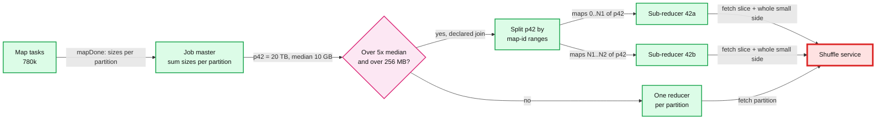
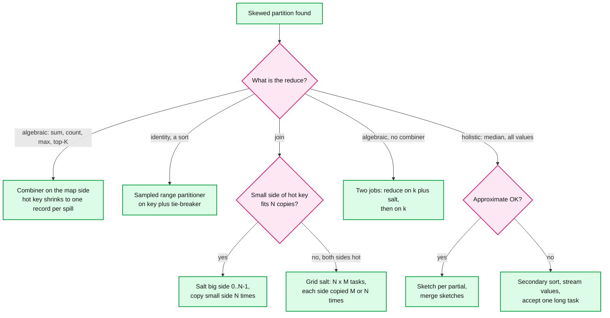

# Deep dive: data skew and partitioning

> One-line answer: hashing spreads **keys**, not **records**, so a key with 8% of the data puts 8% on one reducer no matter how big R is; the job master sees it in the per-partition sizes of the map statuses (skewed = over 5x the median and over 256 MB), and the fix depends on what `reduce` is: a combiner for algebraic reduces, a sampled range partitioner with a tie-breaker for sorts, salting or a map-range split with the other side copied for joins, two jobs for aggregates with no combiner, and a sketch (or a streamed secondary sort) for holistic reduces like median; speculation never helps, because the copy has the same work.

Part of [`../solution.md`](../solution.md) §5.3 and §5.2. Sources: OSDI 2004 §4.1, §4.3, §5.3; Hadoop trunk `InputSampler.java`, `HashPartitioner.java`; Spark master `OptimizeSkewedJoin.scala`, `ShufflePartitionsUtil.scala` and the [SQL performance tuning page](https://spark.apache.org/docs/latest/sql-performance-tuning.html); Mantri (OSDI 2010) §2 and §4; Magnet (VLDB 2020) §3.5.2. Map-side mechanics are in [`map-side-sort-spill-and-combine.md`](map-side-sort-spill-and-combine.md). General partitioning: [`../../../concepts/sharding.md`](../../../concepts/sharding.md).

## 1. Why hashing does not fix skew

Word counts, customers, URLs per host and items per user follow a Zipf-like law: the k-th most common key has frequency proportional to 1/k. With s = 1 over V keys, the top key holds 1 ÷ H(V) of all records, where H(V) ≈ ln V + 0.58.
- V = 100,000 keys: H ≈ 12.1, so the top key is **8.3%** of records. With R = 200 the fair share is 0.5%: the hot partition is **at least 17x the mean**, whatever the hash.
- Raising R splits the other keys finer. The hot key's partition stays at 8.3%. The job's floor is the time to reduce one key.
- At the solution's scale ([`../solution.md`](../solution.md) §5.3): one key with 20% of a 100 TB job is a 20 TB partition against a 10 GB median, **2,000x**. At the sort's ~10 GB per 5 min per reducer, that one task takes **~7 days**. Its node must also land 20 TB of fetched segments on local disk, ~3 h of writes at 1.8 GB/s, before the final merge.



## 2. Detection from map statuses

- Every `mapDone(attempt, host, sizes[R])` already carries bytes per partition. The job master sums them: partition sizes are exact once the map phase ends, and a good estimate after the first 5 to 10% of maps, because maps see random slices of the input. Not if the input is ordered by the key: then wait for all maps.
- Spark's rule, which we copy: a partition is skewed when it is larger than `skewedPartitionFactor` (5) x the median **and** larger than `skewedPartitionThresholdInBytes` (256 MB). The split target is the larger of the advisory size (64 MB) and the average non-skewed partition (`OptimizeSkewedJoin.targetSize`).
- **The compressed map status must keep big blocks exact.** Above 2,000 partitions only an average per map is kept, plus exact sizes for outliers ([`../solution.md`](../solution.md) §5.5). In the hot partition each map's block is 20 TB ÷ 780k = 25.6 MB against a 12.8 KB average, 2,000x. The outlier rule must be relative to the average. A fixed cutoff above 25.6 MB would record the hot partition as average and hide the skew.
- Also watch **map-side skew**: one unsplittable 50 GB gzip file is one map task. The same 5x-median rule on map input sizes catches it.

## 3. Pick the fix by what `reduce` is



**Combiner.** 20 TB of `("the", 1)` becomes one partial count per spill, then one per map after the final merge's combine (8 spills is over the 3-spill minimum): 780k records, ~8 MB. The skew is gone before the shuffle. This works only because sum is commutative and associative (map-side deep dive §7).

**Sort: sampled range partitioning.** The paper: "we would add a pre-pass MapReduce operation that would collect a sample of the keys and use the distribution of the sampled keys to compute split-points" (§5.3). Hadoop does it with `InputSampler.writePartitionFile` plus `TotalOrderPartitioner`. Two details interviewers miss:
- **Sample size.** About 100 samples per partition keeps each partition within ~10% of its target [estimate, error ~1 ÷ √samples]. R = 10,000 needs ~1 M samples. `writePartitionFile` sorts the whole sample in one process (the client), so 1 M is right and the 100 M of a 0.01% sample (Flow 2) is a 1 GB sort on the client.
- **Equal keys do not split by default.** `writePartitionFile` skips repeated split points (`while (last >= k && compare(samples[last], samples[k]) == 0) ++k`), and the partitioner is a pure function of the key. A key with 8% of records still lands in one partition. A sort does not need equal keys together, because its reduce is the identity. So make the sort key `(key, tie-breaker)`, with a record id or a random number as the tie-breaker. The sampler can then cut inside the hot key's run, and the output stays globally sorted, with ties in arbitrary order. §5 shows 18.6x become 1.5x.

**Join: salting.** On the big side rewrite hot key `k` as `(k, r)` with `r` random in 0..N-1. On the small side copy each row of `k` N times, once per `(k, i)`. N reducers share the key. Cost: the small side's rows for hot keys travel N times. Choose N per key from its sampled share: N ≈ share x R x 2 keeps each piece under half a fair partition.

**Join: split by map ranges (Spark AQE).** No rewrite of keys. The skewed partition's map outputs are cut into contiguous **map-id ranges** of ~target size. Each range becomes one task that joins its slice with the **whole** matching partition of the other side ("loads partition0 3 times by 3 tasks", `OptimizeSkewedJoin.scala`). It is safe for joins because each big-side row joins independently. It is not safe for an aggregate: one key now sits in several tasks. Limits: one side can be split only if duplicating the other is legal (`canDuplicateRightSide(joinType)`, so not the preserved side of an outer join), and the finest grain is one map's block.

**Skew meets push-merge.** A merged file has lost its per-map boundaries, so it cannot be cut by map range, and one merger would receive the whole 20 TB partition. Magnet's answer: do not push blocks above a size threshold, so "Magnet will merge all the normal partitions, but skip the skewed partitions" (VLDB 2020 §3.5.2). The skewed partition stays in the original map outputs, where the map-range split works.

**Two-phase aggregation.** Job 1 reduces on `(k, salt)` or on a composite key, job 2 on `k`. Example: distinct users per page. Job 1 keys on `(page, user)` and dedups, job 2 counts per page. In MapReduce that is two jobs, so job 1's output is written to the DFS with 3 replicas. Small, since it is already aggregated.

**Holistic reduces.** An exact median per key needs every value of the key in one place. There is no fixed-size partial, so no combiner and no salting. Options:
1. A **sketch** per partial (KLL, t-digest), a few KB per key, merged in the reduce, ~1% rank error [estimate]. See [`../../../concepts/stream-sketches.md`](../../../concepts/stream-sketches.md).
2. **Exact with a secondary sort.** Job 1 counts per key (combinable). Job 2 uses composite key `(k, v)`: partition on `k`, sort on `(k, v)`, group on `k` (Hadoop's partitioner, sort comparator and grouping comparator). Values reach `reduce` already sorted. The reducer walks to position n ÷ 2 in constant memory. The task is still long, but it never holds 20 TB in a 3 GB heap.

## 4. Why speculation does not help

- A backup of the hot reducer has the same 20 TB to fetch and reduce. It finishes no earlier, and it fetches the partition a second time through the shuffle service, the red node of the design.
- Mantri on Bing's clusters: "Duplicating tasks that run for long because they have a lot of work to do is counter-productive." Instead Mantri "does not restart outliers that take a long time to run because they have more work to do", and schedules a phase's tasks in descending input size, at most 33% worse than optimal.
- So the job master checks input size before speculating (the "input 5x median" node of D6 in [`../solution.md`](../solution.md) §5.2), and starts the biggest partitions first when R exceeds the reduce slots.

## 5. Runnable: Zipf keys into R partitions

Standard library only. 1 M records over 100,000 Zipf keys (s = 1), R = 200, 100 map tasks. Prints the largest partition over the median and over the mean (1.0 is perfect).

```python
import bisect, random, statistics, zlib
from collections import Counter
random.seed(42)
V, N, R, M = 100_000, 1_000_000, 200, 100           # distinct keys, records, reducers, map tasks
ranks = list(range(V)); random.shuffle(ranks)       # key names unrelated to popularity
names = [f"{r:06d}" for r in ranks]                  # rank i has key names[i]; sortable strings
keys = random.choices(names, [1 / (i + 1) for i in range(V)], k=N)   # Zipf, s = 1
h = lambda s: zlib.crc32(s.encode()) % R
def report(label, loads):
    loads = [x for x in loads] + [0] * (R - len(loads))
    med, mx = statistics.median(loads), max(loads)
    print(f"{label:34} max/median {mx / med:5.1f}   max/mean {mx / (sum(loads) / len(loads)):5.1f}")
top = Counter(keys).most_common(1)[0]
print(f"{N:,} records, {V:,} keys, R={R}. Hottest key {top[1] / N:.1%} of records, ideal partition {1 / R:.1%}")
# 1. Hash partitioner: spreads keys, not records.
hashed = Counter(h(k) for k in keys)
report("hash(key) mod R", [hashed[p] for p in range(R)])
# 2. Hash + combiner: each map task ships one record per distinct key it saw.
combined = Counter()
for m in range(M):
    for k in set(keys[m::M]): combined[h(k)] += 1
report("hash + combiner (records shipped)", [combined[p] for p in range(R)])
# 3. Salting: keys hot in a 1% sample get SALT sub-keys (k, 0..SALT-1).
sample = Counter(random.sample(keys, N // 100))
SALT, hot = 64, {k for k, c in sample.items() if c / (N // 100) > 0.5 / R}
salted = Counter(h(f"{k}#{random.randrange(SALT)}") if k in hot else h(k) for k in keys)
report(f"hash + salt {len(hot)} hot keys x {SALT}", [salted[p] for p in range(R)])
# 4. Sampled range partitioner (TotalOrderPartitioner): R-1 split points, duplicates skipped.
def split_points(smp):
    smp, pts, last = sorted(smp), [], -1
    for i in range(1, R):
        j = round(len(smp) / R * i)
        while last >= j and smp[last] == smp[j]: j += 1   # InputSampler skips repeated keys
        if j >= len(smp): break
        pts.append(smp[j]); last = j
    return pts
pts = split_points(random.sample(keys, N // 100))
ranged = Counter(bisect.bisect_right(pts, k) for k in keys)
report("sampled range, key only", [ranged[p] for p in range(R)])
# 5. Range on (key, record id): equal keys may now land in adjacent partitions. Fine for a sort.
recs = list(zip(keys, range(N)))
pts2 = split_points(random.sample(recs, N // 100))
ranged2 = Counter(bisect.bisect_right(pts2, r) for r in recs)
report("sampled range, (key, record id)", [ranged2[p] for p in range(R)])
# 6. AQE-style: split a partition > 5x median into map-index ranges (join only, other side copied).
sizes = [[0] * M for _ in range(R)]
for i, k in enumerate(keys): sizes[h(k)][i % M] += 1
tot = [sum(s) for s in sizes]; med = statistics.median(tot)
target = statistics.mean(t for t in tot if t <= 5 * med)
tasks = []
for p in range(R):
    if tot[p] <= 5 * med: tasks.append(tot[p]); continue
    acc = 0
    for x in sizes[p]:                                   # cut at map boundaries near target
        if acc and acc + x > target: tasks.append(acc); acc = 0
        acc += x
    tasks.append(acc)
report(f"hash + AQE split, +{len(tasks) - R} tasks", tasks)
```
Real output:
```
1,000,000 records, 100,000 keys, R=200. Hottest key 8.3% of records, ideal partition 0.5%
hash(key) mod R                    max/median  26.0   max/mean  17.2
hash + combiner (records shipped)  max/median   1.3   max/mean   1.3
hash + salt 29 hot keys x 64       max/median   1.9   max/mean   1.9
sampled range, key only            max/median  18.6   max/mean  17.4
sampled range, (key, record id)    max/median   1.5   max/mean   1.5
hash + AQE split, +63 tasks        max/median   4.3   max/mean   4.0
```

- **Hash** is 26x the median: the top key alone is 8.3% against a 0.5% fair share.
- **Combiner** flattens it to 1.3x, because each map ships one record per distinct key. Valid only for algebraic reduces.
- **Salting** 29 keys found hot in a 1% sample gives 1.9x. With 32 salts instead of 64 it was 2.6x, because sub-keys of different hot keys collide on one partition. The 1.9x left is plain hash variance of the tail: a variant run with 160 hot keys still gave 2.5x at 32 salts.
- **Sampled range on the key** is still 18.6x. Balanced key ranges cannot split one key. Adding a **record id tie-breaker** gives 1.5x. Fine for a sort, wrong for an aggregate.
- **AQE split** leaves 4.3x by design: partitions under 5x the median are not touched. It added 63 tasks and copies the other side's partition into each.

## 6. Trade-offs

| Decision | Option A | Option B | Chose | Why |
|---|---|---|---|---|
| Who fixes skew | The framework, always | The framework, only for declared operators | B | `reduce` is opaque. Splitting a key is only safe when the user declared a combiner, a join or a sketch aggregate |
| Sort partitioner | Range on key | Range on (key, tie-breaker) | B for sorts with heavy keys | Splits the hot key. Costs a few bytes per record in the sort key |
| Join skew | Salting, N chosen per key | Split by map ranges at run time | Map ranges, salting when one map's block is itself too big | No user code change. Grain is one map's block |
| Skew threshold | Fixed size | 5x median and 256 MB | B | Relative catches skew at every job size, the floor stops splitting small jobs |
| Detect when | After all maps | After 10% of maps, projected | Projected for pull jobs (slowstart 0.05 or 0.8), exact with push-merge (reducers launch at finalize) | The split plan must exist before the hot reducer launches |
| Holistic reduce | Exact, one long task | Sketch | Sketch unless the user asks exact | ~1% error [estimate] against days of one task |

Refused to build: automatic splitting of an arbitrary `reduce` (not safe), speculation for skewed tasks (same work twice), and per-key dynamic repartitioning in the middle of a reduce, as SkewTune does (complex, and the declared-operator path covers the common cases).
