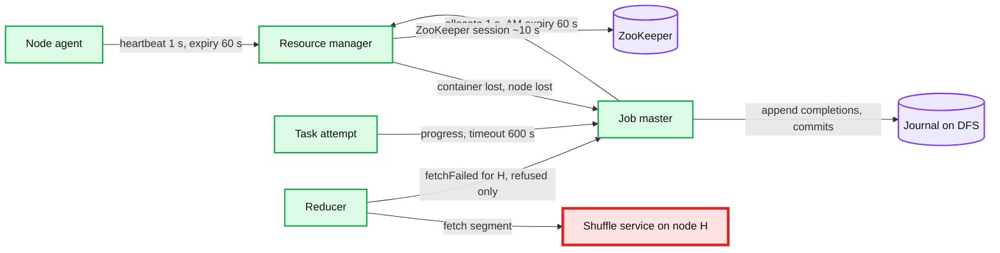
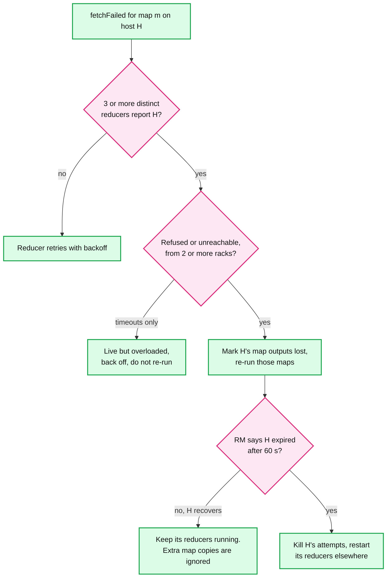
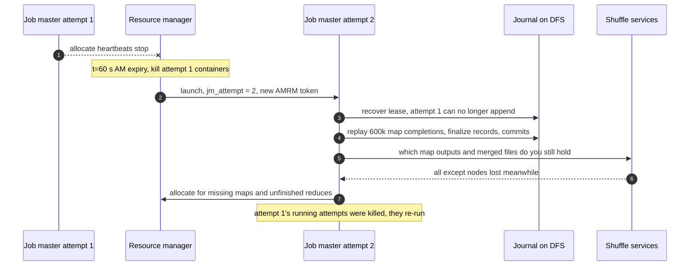

# Deep dive: fault tolerance and recovery

> One-line answer: three heartbeats (node agent to RM, task to job master, job master to RM) feed two verdicts, "this node's map outputs are gone" (in seconds, from connection-refused reports by 3 reducers on 2 racks) and "this node is dead" (60 s expiry); a failed attempt is retried up to 4 times and a record that crashes twice can be skipped; completed maps re-run because their output lived on the dead disk, committed reduces never do; a dead job master is replaced and replays its journal, fenced by the journal lease and `jm_attempt`; the RM fails over through ZooKeeper in ~20 to 30 s without stopping tasks; and the real cost of a node death in a big job is the **reduce tasks it was running**, which restart from zero.

Part of [`../solution.md`](../solution.md) §4.4, §5.5, §10.4. Sources: MapReduce ([OSDI 2004](https://static.googleusercontent.com/media/research.google.com/en//archive/mapreduce-osdi04.pdf) §3.3, §4.6, §5.5), YARN ([SoCC 2013](https://www.cse.ust.hk/~weiwa/teaching/Fall15-COMP6611B/reading_list/YARN.pdf) §3.6), [`mapred-default.xml`](https://hadoop.apache.org/docs/stable/hadoop-mapreduce-client/hadoop-mapreduce-client-core/mapred-default.xml), [`yarn-default.xml`](https://hadoop.apache.org/docs/stable/hadoop-yarn/hadoop-yarn-common/yarn-default.xml). Related: [`../../../concepts/leases-fencing-clocks.md`](../../../concepts/leases-fencing-clocks.md), [`../../../concepts/zookeeper.md`](../../../concepts/zookeeper.md), [`output-commit-and-exactly-once.md`](output-commit-and-exactly-once.md), [`../../query-engine/deep-dives/fault-tolerance-and-stragglers.md`](../../query-engine/deep-dives/fault-tolerance-and-stragglers.md).

## 1. Three heartbeats, two verdicts



| Signal | Interval | Hadoop default | Ours | When it fires, what is lost |
|---|---|---|---|---|
| Node agent to RM | 1 s | 600 s (`yarn.nm.liveness-monitor.expiry-interval-ms`) | 60 s | Every container on the node, every map output it served |
| Job master to RM (`allocate`) | 1 s | 600 s (`yarn.am.liveness-monitor.expiry-interval-ms`) | 60 s | That job master attempt. The RM starts the next one |
| Granted container never launched | once | 600 s (`rm.container-allocation.expiry-interval-ms`) | 60 s | The grant. The RM gives the slot to someone else |
| Task to job master | a few s [estimate] | 600 s (`mapreduce.task.timeout`) | 600 s | That attempt. Catches hangs, not slowness |
| Reducer fetch | per fetch | 180 s connect, 180 s read (`mapreduce.reduce.shuffle.connect.timeout`, `.read.timeout`) | 5 s connect, retried with backoff | Nothing alone. Refused or unreachable from 3+ reducers on 2+ racks marks H's map outputs lost. A timeout never does |

- **"H's map outputs are gone"** needs hard evidence: connection refused (the service process died) or host unreachable. Re-running 780 maps of 15 s is 11,700 slot-seconds, 0.4 s of a 32,000-slot job. The hidden cost is load on the shuffle services. **A timeout is not a loss.** A live shuffle service doing 1,200 seeks/s answers slowly. If timeouts counted, the job master would re-run healthy maps, which serve and push more data, which makes more timeouts. The reducer backs off and fetches from other hosts.
- **"H is dead"** comes from the 60 s node expiry. Only this verdict kills H's attempts. Being wrong costs up to 10 reducers x 6 min. A silent host (power loss across a routed fabric gives only timeouts) is caught here. A shuffle service restarting in place is not a loss: with NM recovery on (`yarn.nodemanager.recovery.enabled`, default false) reducers retry fetches for 30 s (`shuffle.fetch.retry.timeout-ms` = 30000).

## 2. The false-positive trade-off

A shorter timer handles real deaths faster and declares more live nodes dead.


- **Why 60 s.** 600 s is longer than the sort's whole map phase (~6 min). 10 s would turn a 10 to 30 s top-of-rack switch blip into 40 dead nodes and ~400 killed reducers of up to 6 min each.
- **Why 2 racks.** One reducer's failure may be its own NIC. Three in one rack may be its switch.
- **A false positive is safe, only wasteful.** H's attempts keep running as zombies and the commit gate refuses them ([`output-commit-and-exactly-once.md`](output-commit-and-exactly-once.md) §6). A second map output for the same task is ignored.

## 3. Task attempts, retries and preemption

- **An attempt id is `task_id` plus a counter** (`r_0042_0`, `r_0042_1`). Every path and token carries it. Attempt states: STARTING, RUNNING, COMMIT_PENDING, then SUCCEEDED, FAILED or KILLED. A SUCCEEDED map goes back to PENDING when its host is lost.
- **FAILED counts, KILLED does not.** 4 failed attempts (`mapreduce.map.maxattempts`, `reduce.maxattempts` = 4) fail the job. Attempts killed by speculation, preemption or a lost node end `KILLED` and do not count. `mapDone` is accepted only from an attempt still running, with the host taken from its container record. Retries avoid the last node, and a node with 3 failures for one job gets no more of its tasks (`maxtaskfailures.per.tracker` = 3).
- **Preemption is never a failure.** A preempted reducer's broken fetch streams are not reported as fetch failures. A reducer preempted mid-fetch re-fetches its whole 10 GB partition, ~1 to 2 min. So reduces go last, and a COMMIT_PENDING or commit-granted attempt is never preempted, nor is a job master.
- **The job master preempts its own reducers** when they hold every container and map asks go unmet (`mapreduce.job.reducer.preempt.delay.sec` = 0, and unconditionally after `unconditional-preempt.delay.sec` = 300 s). Otherwise reducers wait for maps that can never run.

## 4. Skip mode for bad records

A deterministic crash fails all 4 attempts. Paper §4.6: a library segfaults on one record in 10 billion and cannot be fixed today.
- The worker stores the record's sequence number before calling `map`. Its signal handler sends a "last gasp" UDP packet with that number. "When the master has seen more than one failure on a particular record, it indicates that the record should be skipped" on the next attempt.
- Hadoop: after `mapreduce.task.skip.start.attempts` = 2 failed attempts the task reports the record range it is about to process. Later attempts skip it and narrow the range. It is **off by default** (`mapreduce.map.skip.maxrecords` = 0). Skipped records go to `_logs/skip`.
- **Ours:** opt-in per job, a cap (fail above 1 skipped record per million [estimate]), and a `SKIPPED_RECORDS` counter. Skipping is data loss by consent, so it must be visible.

## 5. Lost map output, and why only maps re-run

Paper §3.3: "Completed map tasks are re-executed on a failure because their output is stored on the local disk(s) of the failed machine and is therefore inaccessible. Completed reduce tasks do not need to be re-executed since their output is stored in a global file system."
- Map output is never copied, by design: replicating 3 PB/day to protect cheap-to-recompute data does not even buy time (§6). Re-running is safe only because input is pinned at split time (a DFS snapshot or table version). **With push-merge** (solution §5.1) a node death also loses the merged partitions on it and the ~10 reducers placed next to them. The restarted reducers read the original map slices, after H's own maps re-run.

## 6. What node deaths cost the 100 TB sort: a simulation

Model: 1,000 nodes, deaths at one per 23 worker-hours (Poisson). Map phase 360 s (24 waves of 15 s), finalize 60 s, reduce phase 360 s: 780 s with no failures. A map-phase death re-queues the node's running and finished maps, seen after 60 s. A reduce-phase death restarts that node's ~10 reducers from zero after the ~5 s refused-fetch path, plus one 15 s map wave unless map output is replicated. Replication costs an off-rack second copy of 100 TB, ~80 s of map phase [estimate]. The job master is one more node at the same rate. "Abort" restarts the job. "Journal" loses 60 s of detection, 10 s of replay, and the attempts in flight, which are killed and re-run.

```python
"""100 TB sort on 1,000 nodes: what do the node deaths of one run cost?"""
import random, statistics
NODES, SLOTS = 1000, 32
MAP_T, WAVES, MAPS_PER_NODE = 15.0, 24, 780   # 780k maps over 1,000 nodes
T_MAP, T_FIN, T_RED = MAP_T * WAVES, 60.0, 360.0  # map 360 s, finalize, reduce
T_JOB = T_MAP + T_FIN + T_RED                 # 780 s = 13 min, no failures
RATE = 1 / (23 * 3600)                        # deaths per node-second (paper)
DET_MAP, DET_RED = 60.0, 5.0                  # node expiry vs refused-fetch path
REPL_TAX = 80.0                               # 2nd copy of 100 TB off-rack [estimate]
AM_DET, AM_REPLAY = 60.0, 10.0                # AM expiry, journal replay
def death_times(rng, n, horizon):
    t, out = rng.expovariate(RATE * n), []
    while t <= horizon:
        out.append(t); t += rng.expovariate(RATE * n)
    return out
def one_run(rng, replicated=False, t_task=T_RED):
    """Job end with node deaths. t_task: length of one reduce task (R sets it)."""
    t_map = T_MAP + (REPL_TAX if replicated else 0.0)
    map_end, extra = t_map, 0.0
    deaths = death_times(rng, NODES, 4 * T_JOB)
    for t in deaths:                                  # map phase
        if t >= map_end: break
        done = MAPS_PER_NODE * t / t_map              # maps this node finished
        extra += SLOTS * MAP_T / 2 + (0.0 if replicated else done * MAP_T)
        map_end = max(t_map + extra / (NODES * SLOTS), t + DET_MAP + MAP_T)
    groups = {n: map_end + T_FIN + T_RED for n in range(NODES)}  # node -> end
    for t in (d for d in deaths if d >= map_end):     # finalize and reduce
        if t >= max(groups.values()): break
        node = rng.randrange(NODES)
        if groups.get(node, 0.0) > t:                 # running reducers restart
            rerun = 0.0 if replicated else MAP_T      # its merged file, maps gone
            new = rng.randrange(NODES); del groups[node]
            groups[new] = max(groups.get(new, 0.0), t + DET_RED + rerun + t_task)
    end = max(groups.values())
    return end, sum(1 for t in deaths if t < end)
def with_master(rng, policy, length=None):
    """Add job master death on top: abort-and-restart vs journal replay."""
    total = 0.0
    while True:
        end = length or one_run(rng)[0]
        t_am = rng.expovariate(RATE)                  # the job master is one more node
        if t_am >= end: return total + end
        if policy == "abort":
            total += t_am; continue                   # everything so far is thrown away
        if length: lost = T_RED / 2                   # long job: half a reduce in flight
        elif t_am < T_MAP + T_FIN: lost = MAP_T       # in-flight maps killed, re-run
        else: lost = min(T_RED, t_am - T_MAP - T_FIN) # in-flight reducers restart
        return total + end + AM_DET + AM_REPLAY + lost
def mean(f, n=20000):
    rng = random.Random(42)
    return statistics.mean(f(rng) for _ in range(n))
rng = random.Random(42)
runs = [one_run(rng) for _ in range(20000)]
base = statistics.mean(e for e, _ in runs)
print(f"no failures: {T_JOB:.0f} s, node deaths per run: "
      f"{statistics.mean(d for _, d in runs):.1f}")
for name, kw in (("node-local map output", {}), ("replicated map output",
                 {"replicated": True}), ("node-local, R = 50,000", {"t_task": T_RED / 5})):
    m = base if not kw else mean(lambda g: one_run(g, **kw)[0])
    print(f"{name:24s}: {m:5.0f} s  (+{m - T_JOB:.0f} s)")
for pol in ("journal", "abort"):
    m = mean(lambda g: with_master(g, pol))
    print(f"sort, job master {pol:7s}: {m:5.0f} s  (+{m - base:.1f} s on top)")
    m = mean(lambda g: with_master(g, pol, 6 * 3600.0))
    print(f"6 h job, {pol:7s}        : {m / 3600:5.2f} h  (+{m / 60 - 360:.1f} min)")
```

Real output:

```
no failures: 780 s, node deaths per run: 13.6
node-local map output   :  1127 s  (+347 s)
replicated map output   :  1191 s  (+411 s)
node-local, R = 50,000  :   864 s  (+84 s)
sort, job master journal:  1131 s  (+3.4 s on top)
6 h job, journal        :  6.02 h  (+1.0 min)
sort, job master abort  :  1136 s  (+8.5 s on top)
6 h job, abort          :  6.87 h  (+51.9 min)
```

What it says:
- **Map-phase deaths are nearly free:** lost maps spread over 32,000 slots, which is why the paper's 200-worker kill cost 5%. **Reduce-phase deaths are the cost: +347 s, +44%.** ~13.6 deaths per run (more than ~11, because the run gets longer). Each one restarts ~10 reducers of up to 6 min, on the critical path, and a restart can be hit again.
- **Replicating map output makes it worse (+411 s):** it saves one 15 s map wave per death and costs ~80 s on every run. **Smaller reduce tasks are the fix (+84 s).** R = 50,000 with push-merge gives 2 GB partitions, ~72 s tasks, 5 waves, so a restart costs ~1 min. Without push-merge, 5x more blocks would hurt. Checkpointing merged runs to the DFS is the other option, paid on every run.
- **Journal vs abort barely matters for a 13 min job and decides a 6 h job** (p = 23% of a job master death): abort adds 52 min on average, replay 1 min.

## 7. Job master recovery from the journal

The journal is an append-only file on the DFS, one writer at a time (the DFS lease on the file).

| Journaled | Not journaled (rebuilt or lost) |
|---|---|
| Job plan: splits, R, conf hash, `jm_attempt` | Running attempts and their progress |
| Map completions: attempt, host, compressed sizes | Speculation state, node slowness scores |
| `shuffle_finalized`: per partition, merger and merged map slices | Counters of running attempts |
| `commit_granted(task, attempt)`, `commit_done(task)` | Container grants (asked for again) |
| `job_commit_started`, `job_commit_done` | Pending pushes not yet finalized |



- **What survives:** completed maps on live hosts (the shuffle service authorizes fetches by the per-job secret, not `jm_attempt`), merged files named in `shuffle_finalized`, every `commit_done` reduce. **Granted but not done:** the winner died between the yes and its rename. Replay checks for that attempt's committed directory (`committed/r_42.attempt_3`). Present: journal `commit_done`. Absent: re-run under attempt 2's path. The live master does the same check when a granted attempt dies, then reopens the gate. The losing attempts were only told to stop, and are killed after `commit_done`, so a backup can still win.
- **Job commit started but not done:** redo it. On HDFS it is one directory rename to an `output_path` that must not exist, so either it happened (the `_JOB_ID` marker there is ours: write `_SUCCESS`) or it did not (rename). See [`output-commit-and-exactly-once.md`](output-commit-and-exactly-once.md) §7.
- **What is lost:** attempts in flight. YARN paper: the MapReduce AM "will recover its completed tasks, but as of this writing, running tasks... will be killed and re-run." In the reduce phase that is up to one 6 min wave. Adopting them means re-fencing each to the new `jm_attempt`. We do not build it.
- **Fencing the old attempt.** (1) The RM rejects attempt 1's token. (2) Node agents kill its containers, at once or when they rejoin after a partition. (3) The journal lease: attempt 1 must journal before it says `canCommit` yes, so a partitioned attempt 1 cannot grant. (4) Job commit is one rename to a path that must not exist, or one conditional put. Layer 3 is the one that holds while attempt 1 is cut off from the RM ([`../../../concepts/leases-fencing-clocks.md`](../../../concepts/leases-fencing-clocks.md)). Budget: YARN `am.max-attempts` = 2, we use 4 for jobs over 1 h. The framework library version is pinned per job, so attempt 2 never reads attempt 1's journal with a new format.

## 8. Resource manager: active, standby, work-preserving restart

- The active RM holds an ephemeral leader znode and writes app and queue state to a ZooKeeper store, which "is implicitly fenced; meaning a single ResourceManager is able to use the store at any point in time" (`yarn-default.xml`). `recovery.enabled` defaults to **false**; we turn it on.
- **Work-preserving** restart keeps containers running. The 2013 YARN paper describes the older behaviour: after recovery the RM "kills all the containers running in the cluster, including live ApplicationMasters". Timeline: ~10 s session expiry, ~2 s to load state, resync of node agents and job masters, then `work-preserving-recovery.scheduling-wait-ms` = 10 s before new grants. ~20 to 30 s without allocation. Tasks never stop. Sequence in solution §10.4. **ZooKeeper quorum loss:** the active RM steps down after the ~10 s session timeout, because it can no longer prove it leads. No new allocations anywhere. Running containers and job masters continue. Page.

## 9. Non-deterministic maps and the "weaker semantics"

Paper §3.3: with non-deterministic operators, "the output of a particular reduce task R1 is equivalent to the output for R1 produced by a sequential execution of the non-deterministic program. However, the output for a different reduce task R2 may correspond to the output for R2 produced by a different sequential execution."

Plain words: map M ran twice and sampled different records. R1 read run 1, R2 read run 2. Each file is right for some run. Together they match no run: a record can be in neither file, or in both.

| Option | How | Cost | Pick |
|---|---|---|---|
| Accept weaker semantics | The paper's default | Free, users must know | Statistics that tolerate a re-sample |
| Re-run every reader of the old output | Spark, for indeterminate stages; aborts if a reader already committed | Can cascade to most reducers | DAG engines |
| Durable map output | DFS, 2 replicas, before `mapDone`. Push-merge forced off | ~2x shuffle writes, ~80 s on the sort [estimate], pull-shuffle seeks | **Ours**, `conf.map.deterministic = false` |
| Deterministic map | Seed from `task_id`, no clock, no outside calls | Free | The rule for everyone else |

Reducers read only the attempt the job master recorded first, so a backup's different output is never mixed in. Push-merge is off because a merger keeps the first pushed copy of a slice, possibly from another attempt (mergers also tag slices with the attempt id, and finalize keeps only the recorded one). A non-deterministic **reduce** is fine: exactly one attempt commits.

## 10. Trade-offs

| Decision | Option A | Option B | Chose | Why |
|---|---|---|---|---|
| Map output loss signal | Node expiry only | Refused fetches, 3 reducers, 2 racks | Both. Timeouts never count | Fast for crashes, no re-run storm on an overloaded shuffle service |
| Map output | Local, recompute | Replicated | Local. Durable only for non-deterministic jobs | Replication is slower even at 13 deaths a run (§6) |
| Reduce task size | 10 GB, 1 wave | 2 GB, 5 waves, push-merge | Smaller for jobs over ~50 TB | Restart cost 6 min becomes ~1 min |
| Job master death | Abort, client retries (paper, MIT lab) | Journal replay | Replay | +52 min vs +1 min on a 6 h job |

## 11. Interview soundbite

"Failures are re-execution with two verdicts. Refused fetches from two racks say a node's map outputs are gone in seconds. A slow fetch is only backed off. A 60 s heartbeat expiry says the node is dead and kills its attempts. Maps re-run because their output was on that disk, committed reduces never do. At one death per 23 worker-hours the 100 TB sort sees ~13 deaths, and what hurts is the 6-minute reducers on the dead node, so I keep reduce tasks small rather than replicate map output. The job master journals completions, the shuffle finalize and two-step commit records. A new attempt replays it and is the only one that can append. On a 6-hour job that turns a 23% chance of starting over into a one-minute blip."
