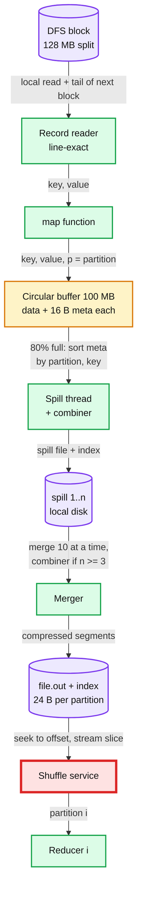
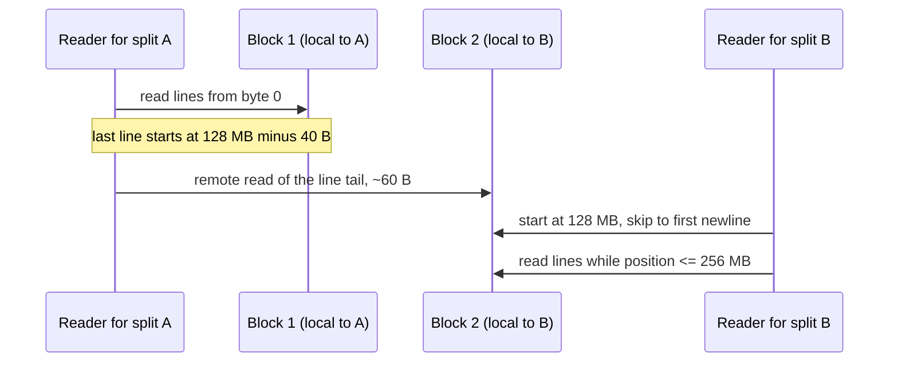
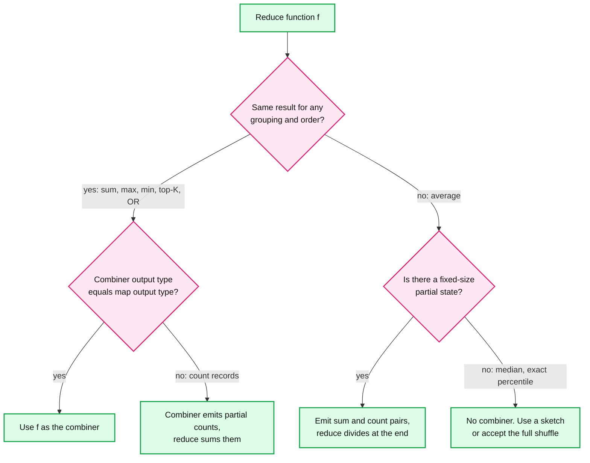

# Deep dive: map-side sort, spill and combine

> One-line answer: a map task reads its split line-exact (skip the partial first line, finish the line that crosses the end), serializes every output pair into one circular 100 MB buffer with a 16-byte metadata entry per record, and at 80% full a background thread sorts the metadata by (partition, key), runs the combiner and writes a spill; at the end the spills are merged 10 at a time into **one file sorted by (partition, key) plus a 24-byte-per-partition index**, which the shuffle service serves; the combiner may run 0, 1 or many times, so it must be commutative and associative.

Part of [`../solution.md`](../solution.md) §4.2, §10.1, §10.2. Sources: OSDI 2004 §4.1 to §4.4; Hadoop trunk `MapTask.java` (`MapOutputBuffer`), `Merger.java`, `MergeManagerImpl.java`, `LineRecordReader.java`, `FileInputFormat.java`, `HashPartitioner.java`; `mapred-default.xml`. Skew is in [`data-skew-and-partitioning.md`](data-skew-and-partitioning.md). What happens after the file is written is in [`shuffle-pull-push-and-remote.md`](shuffle-pull-push-and-remote.md).

## 1. The path of one record



## 2. Input splits and record boundaries

A split is a byte range. Split size is `max(minSize, min(maxSize, blockSize))` = 128 MB by default. A text line does not care where a block ends. The paper only says text splits "occur only at line boundaries" (§4.4). Hadoop makes that true with two rules in `LineRecordReader`:

1. **Not the first split: throw away the first line.** The reader starts at `start` and reads up to and including the first `\n`. That partial line belongs to the previous split.
2. **Read while `position <= end`.** The reader finishes the line that crosses `end`, even when its tail sits in the next block on another node. That remote read is one line, usually under 1 KB.

So a split owns every line whose first byte lies in `(start, end]` (the first split also owns byte 0). A line that starts exactly at `start` is owned by the previous split, because that split's `<= end` test lets it read one more line. Each line is read exactly once. The script in §8 checks this for 401 block sizes, and breaks if either rule is off by one byte.



- **Last split slop:** `FileInputFormat` keeps cutting while the remainder is over 1.1x the split size (`SPLIT_SLOP = 1.1`). A 140 MB file is one split, not 128 MB plus a 12 MB runt.
- **Non-splittable input:** `TextInputFormat.isSplitable` is false for a codec that is not a `SplittableCompressionCodec`. A 50 GB `.gz` file becomes **one** map task that runs ~400x longer than its peers: at ~60 s per 128 MB [estimate], ~7 h. That is map-side skew, and speculation cannot fix it. Use bzip2, a splittable container (SequenceFile, Parquet, ORC) or recompress upstream.

## 3. The circular sort buffer

One byte array of `mapreduce.task.io.sort.mb` (100 MB). Serialized key and value bytes grow forward from a point called the **equator**. A 16-byte metadata entry per record grows backward from it: 4 ints, `VALSTART`, `KEYSTART`, `PARTITION`, `VALLEN` (`METASIZE = NMETA * 4`).

- At 80% (`spill.percent` 0.80, the "soft limit") a spill thread takes the filled region. It sorts the **metadata** with quicksort, comparing partition first, then the raw key bytes. Record bytes never move. A record bigger than the whole buffer skips all this: `spillSingleRecord` writes it to its own spill with **no combiner**.
- A new equator is placed in the free 20%, so `map` keeps writing while the spill runs. Only if `map` also fills that 20% before the spill ends does `collect` block.

The 16 bytes of metadata are a fixed tax, and small records pay most:

| Job | Bytes per record in the buffer | Records per 80 MB spill | 128 MB split gives |
|---|---|---|---|
| Sort, 100 B records | 100 + 16 = 116 | ~690k | 1.34 M records, 156 MB of buffer, **2 spills** |
| Word count, `(word, 1)` ~10 B [estimate] | 10 + 16 = 26, 62% is metadata | ~3.2 M | ~22 M words [estimate], 570 MB, **8 spills** |
| Sort with `io.sort.mb` = 256 | 116 | ~1.77 M | **1 spill**, renamed as the final file, no merge |

The last row is why [`../solution.md`](../solution.md) §10.2 picks 256 MB. With one spill, `mergeParts` just renames the spill. That saves one 128 MB write and one 128 MB read per task: 780k tasks x 256 MB = **~200 TB of disk I/O** in the 100 TB sort, ~110 s per node at 1.8 GB/s.

## 4. Merge factor and merge passes

`mapreduce.task.io.sort.factor` = 10 streams per merge. With n spills and factor f:
- n = 1: rename, no merge.
- 2 <= n <= f: one final merge. Every byte is read once more and written once more.
- n > f: intermediate passes first. `Merger.getPassFactor` makes the **first** pass small, `(n - 1) mod (f - 1) + 1` segments, so later passes are exactly f wide. It always merges the smallest segments first, so few bytes are rewritten twice.

Example: a 1 GB split of 100 B records is 10.7 M records x 116 B = 1.25 GB of buffer, so **16 spills** at 80 MB. With f = 10 the first pass merges 7 segments, 10 remain, then the final merge. ~44% of the bytes are rewritten one extra time. With f = 64 there is one merge. Each pass rereads and rewrites data on HDD, so we raise the factor to 64. The cost is 64 open files per merge, each with a smaller read buffer.

## 5. One output file plus index, and compression

The merge writes partitions in order 0..R-1 into `file.out`, and `file.out.index` holds one 24-byte record per partition (start offset, raw length, compressed length; `MAP_OUTPUT_INDEX_RECORD_LENGTH = 24`). The paper's figure and the MIT lab write R files per map instead: 7.8 B files for the 100 TB sort, against 780k here.

- **Index size:** R = 10,000 gives 240 KB per map output. A node with 780 outputs holds ~187 MB of index. The shuffle service must cache it, or every fetch costs two seeks (index, then data) instead of one.
- **Compression** is per partition segment, so a reducer can decompress its slice alone. `mapreduce.map.output.compress` is **false** by default, with `DefaultCodec` (zlib) if turned on. We turn it on with a fast codec such as LZ4 or Snappy. Text and logs shrink ~3 to 4x [estimate]. Random TeraSort values barely shrink.
- **Push back:** compression shrinks bytes, not blocks. The 7.8 B blocks of §5.1 in the solution go from 12.8 KB to ~4 KB, and the shuffle service still does 7.8 M seeks per node. Compression helps the network and the page cache. It does not fix the red node.

## 6. The partitioner

Default: `(key.hashCode() & Integer.MAX_VALUE) % R` (`HashPartitioner`). The mask clears the sign bit so a negative hash still gives a partition in `[0, R)`. The paper's default is `hash(key) mod R`.

| Rule | What goes wrong if broken |
|---|---|
| **Deterministic across processes, a function of the key only** | Python's `hash(str)` is salted per process. Java's identity `hashCode` (an enum, a class with no override) differs per JVM. Two map tasks send `"the"` to different reducers. Each reducer outputs a partial count. **Wrong output, no error.** The MIT lab ships `ihash` (FNV) for this reason; the §8 script uses CRC32 |
| **Hash bits must be mixed** | `Long.hashCode` of a small id is the id. Ids that are all multiples of 1,000 with R = 2,000 land only on partitions 0 and 1,000: 2 of 2,000 reducers do all the work. Mix the bits (Murmur3) before `mod` |

**Custom partitioner (paper §4.1):** `hash(Hostname(urlkey)) mod R` puts every URL of one host into one output file, so a later job can read one host from one file. The price: the largest host becomes the largest partition. That is a chosen skew, see [`data-skew-and-partitioning.md`](data-skew-and-partitioning.md). For a global sort, a sampled range partitioner replaces the hash.

## 7. The combiner

The paper allows a combiner when "the user-specified Reduce function is commutative and associative" and keys repeat, as in word count, where each map makes "hundreds or thousands of records of the form <the, 1>" (§4.3). Hadoop runs it in three places:

1. **On every spill**, per run of equal (partition, key). Not for a record that bypassed the buffer.
2. **On the final merge**, only if there were at least 3 spills (`mapreduce.map.combine.minspills`, code default 3 in `MapTask.java`).
3. **On the reduce side**, when the in-memory merge spills fetched segments to disk (`MergeManagerImpl.combineAndSpill`).

So one value may pass through the combiner 0, 1, 2 or more times. Another engine may skip it entirely. The contract: `reduce(k, values)` must equal `reduce(k, [combine(g1), combine(g2), ...])` for **any** grouping of the values, in any order, nested any number of levels. And the combiner's output type must equal the map's output type, because it may be combined again.



| Aggregate | Combiner? | Why |
|---|---|---|
| Top-K, set union, bitwise OR | Yes (top-K keeps K per partial) | Commutative and associative. Set union is exact but its partials can grow without bound |
| Count | Only as "sum the partial counts" | A combiner that counts its inputs turns `[3, 5]` into `2` |
| Average | Only as `(sum, count)` | avg(avg(1, 2), avg(3)) = 2.25, the true answer is 2 |
| Median, percentiles | No exact one | No fixed-size partial. Use a sketch (KLL, t-digest), see [`../../../concepts/stream-sketches.md`](../../../concepts/stream-sketches.md) |
| String concat, "first value seen", any side effect | No | Not commutative (spill and merge order are not promised), or runs 0..n times |

Not idempotent, a common slip: a sum combiner applied twice to the same input double counts. The framework never does that; it only combines disjoint runs or already-combined output. **Operability:** compare the counters `COMBINE_INPUT_RECORDS` and `COMBINE_OUTPUT_RECORDS`. Under ~1.2x shrink (unique ids), the combiner only burns CPU in every spill. Turn it off.

## 8. Runnable: one map task, with and without a combiner

Standard library only. Zipf words (s = 1, 3,000 words), cut into 3 blocks that ignore line ends. A 48 KB buffer stands in for 100 MB, factor 4 for 10, R = 4.

```python
import heapq, random, zlib
random.seed(7)
R, BUF, SPILL_PCT, FACTOR, META = 4, 48_000, 0.80, 4, 16
VOCAB = [f"w{i}" for i in range(3000)]
WEIGHTS = [1 / (i + 1) for i in range(3000)]          # Zipf, s = 1
# 1. Input: lines of Zipf words, cut into fixed-size "blocks" that ignore line ends.
lines = [" ".join(random.choices(VOCAB, WEIGHTS, k=random.randint(3, 12))) for _ in range(6000)]
data = ("\n".join(lines) + "\n").encode()
BLOCK = len(data) // 3 + 1
splits = [(s, min(s + BLOCK, len(data))) for s in range(0, len(data), BLOCK)]
def read_split(start, end):                        # Hadoop LineRecordReader rule
    pos = start
    if start != 0:                                 # skip the partial first line
        pos = data.index(b"\n", start) + 1         # (a line starting at start belongs to the prior split)
    out = []
    while pos <= end and pos < len(data):          # "<= end": finish the line that crosses the end
        nl = data.index(b"\n", pos)
        out.append(data[pos:nl].decode()); pos = nl + 1
    return out
got = [ln for s, e in splits for ln in read_split(s, e)]
ok = all([ln for s in range(0, len(data), b) for ln in read_split(s, min(s + b, len(data)))] == lines
         for b in range(1000, 1400))                  # 400 block sizes, many land exactly on a line start
print(f"input {len(data):,} B in {len(splits)} splits, lines {len(lines)}, read {len(got)}, "
      f"exact: {got == lines}, exact for 400 other block sizes: {ok}")
# 2. One map task on split 0: buffer, sort by (partition, key), combine, spill.
part = lambda k: zlib.crc32(k.encode()) % R           # deterministic across processes, unlike hash()
size = lambda k: 1 + len(k) + 4                        # vint length + key bytes + 4-byte int value
def combine(run):                                      # sum adjacent equal (partition, key)
    out = []
    for p, k, v in run:
        if out and out[-1][:2] == (p, k): out[-1] = (p, k, out[-1][2] + v)
        else: out.append((p, k, v))
    return out
def map_task(use_combiner):
    spills, buf, used, emitted = [], [], 0, 0
    def spill():
        run = sorted(buf)                              # Hadoop sorts the 16 B metadata, not the bytes
        spills.append(combine(run) if use_combiner else run)
    for line in read_split(*splits[0]):
        for w in line.split():
            buf.append((part(w), w, 1)); used += size(w) + META; emitted += size(w)
            if used >= SPILL_PCT * BUF: spill(); buf, used = [], 0
    if buf: spill()
    n_spills, passes, runs = len(spills), 0, spills
    while len(runs) > FACTOR:                          # intermediate merge passes
        mod = (len(runs) - 1) % (FACTOR - 1)           # Hadoop Merger.getPassFactor: a small
        f = FACTOR if passes or mod == 0 else mod + 1  # first pass so later passes are full
        runs.sort(key=len)                             # merge the smallest segments first
        runs = [list(heapq.merge(*runs[:f]))] + runs[f:]; passes += 1
    final = list(heapq.merge(*runs))
    if use_combiner and n_spills >= 3: final = combine(final)   # minspills = 3
    index, off, body = [], 0, bytearray()
    for p in range(R):                                 # one file + index of R offsets
        seg = b"".join(bytes([len(k)]) + k.encode() + v.to_bytes(4, "big") for q, k, v in final if q == p)
        index.append((off, len(seg))); body += seg; off += len(seg)
    spilled = sum(size(k) for run in spills for _, k, _ in run)
    return emitted, n_spills, passes, spilled, len(final), bytes(body), index
for c in (False, True):
    emitted, n, passes, spilled, recs, body, index = map_task(c)
    print(f"combiner={c!s:5} map emitted {emitted:,} B, spills {n}, extra merge passes {passes}, "
          f"spilled {spilled:,} B, final {recs:,} records {len(body):,} B, zlib {len(zlib.compress(body)):,} B")
print("index (offset, length) per partition:", index)
```
Real output:
```
input 185,863 B in 3 splits, lines 6000, read 6000, exact: True, exact for 400 other block sizes: True
combiner=False map emitted 121,415 B, spills 10, extra merge passes 2, spilled 121,415 B, final 14,864 records 121,415 B, zlib 7,327 B
combiner=True  map emitted 121,415 B, spills 10, extra merge passes 2, spilled 51,450 B, final 2,143 records 20,369 B, zlib 6,628 B
index (offset, length) per partition: [(0, 5048), (5048, 5186), (10234, 5110), (15344, 5025)]
```

- **Record boundaries:** 6,000 lines in, 6,000 read, for 401 block sizes. Change `<= end` to `< end`, or skip from `start - 1`, and the check fails. **Spills and passes:** the toy makes 10 spills with factor 4, so 2 intermediate passes (10 to 7 to 4) before the final merge. The combiner does not change the spill count. Spills fire on buffer bytes, before combining.
- **Combiner:** 121 KB and 14,864 records become 20 KB and 2,143 records, ~6x fewer bytes and ~7x fewer records. Real word count on 128 MB splits shrinks more, because a spill holds ~3 M words over a vocabulary that grows much slower [estimate].
- **Compression is not a combiner.** zlib takes the uncombined file to 7.3 KB, almost as small as the combined one (6.6 KB), because sorted runs of `("w0", 1)` are perfectly repetitive. But the reducer still decodes 14,864 records, not 2,143, and pays the CPU to compress and decompress. Use both.

## 9. Trade-offs

| Decision | Option A | Option B | Chose | Why |
|---|---|---|---|---|
| Map output layout | R files per map (paper figure, MIT lab) | One sorted file plus 24 B per partition index | B | 780k files instead of 7.8 B for the 100 TB sort. Costs a sort on the map side |
| Sort buffer | 100 MB default | 256 MB in a 3 GB container | 256 MB | One spill per 128 MB sort split, no merge, ~200 TB less disk I/O per 100 TB sort. Costs 156 MB more heap per task |
| Combiner | Always on | On only when shrink > ~1.2x | Measure, then decide | It runs on every spill. On unique keys it is pure CPU |
| Map output compression | Off (Hadoop default) | LZ4 or Snappy | On | ~3x fewer shuffle bytes on text [estimate]. Does not reduce the M x R seek count |
| Splittable input | Accept gzip | Require a splittable format | Require for files over 1 GB | One 50 GB gzip is one 400x-long map task |

Refused to build: a hash-shuffle mode that skips the map-side sort (Spark removed its hash shuffle for the same file-count reason); a map-side in-memory hash aggregation in place of sort plus combine (faster for few keys, but needs a spill path of its own and the sort is needed anyway for the reduce-side merge).
